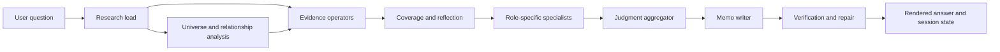

# FinSight-Agent

[中文版本](README.md)

FinSight-Agent is an auditable financial research system for public-company analysis. It does not simply retrieve a few passages and ask a model to summarize them. It turns a financial question into a sequence of inspectable research steps: classify the question, define the research scope, retrieve bounded evidence, build numeric ledgers and industry or relationship context, ask role-specific agents to produce verifiable claim cards, assemble an argument plan, write a research memo, and verify whether sources, numbers, and conclusions stay inside the evidence boundary.

The project is not a real-time market terminal, trading system, or personalized investment-advice engine. It focuses on a different problem: using language models for research reasoning and writing while keeping evidence boundaries, financial periods, tool calls, audit trails, and multi-turn context explicit.

## What It Is For

FinSight-Agent is designed for questions such as:

- comparing company fundamentals, management commentary, market reaction, and risk boundaries;
- analyzing a company or metric in depth, such as margin, capex, cash flow, bank asset quality, or energy and utility operating metrics;
- studying an industry theme or economic transmission path, such as AI infrastructure, cloud capex, data-center power demand, or semiconductor supply chains;
- narrowing scope in a multi-turn session, asking about a specific evidence row, inspecting coverage gaps, or reusing artifacts from a prior run;
- checking whether a claim comes from SEC filings, company-authored 8-K earnings material, an offline market snapshot, or an industry or relationship hypothesis.

The public repository does not include private SEC source files, market data, generated indexes, run outputs, or API keys. Users can generate equivalent artifacts from their own public filings, market snapshots, and industry data, then connect them through the project profile contract.

## Why Not Plain RAG

Plain RAG often means "retrieve text, pass it to a model, generate an answer." FinSight-Agent makes the fragile parts of financial research explicit: source boundaries, numeric periods, economic relationships, multi-turn state, and final-answer validation.

| Capability | How FinSight-Agent handles it |
| --- | --- |
| Question understanding | A research lead converts the user request into a mode, company scope, evidence needs, and agent activation plan |
| Tool execution | The tool harness calls registered MCP tools; the model cannot bypass permissions and read arbitrary data |
| Retrieval and reranking | SEC BM25, ObjectBM25, BGE reranking, 8-K rows, market snapshots, industry data, and relationship rows enter context in separate layers |
| Numeric evidence | The exact-value ledger records company, period, metric, unit, and source object instead of letting the model guess numbers from long text |
| Specialist analysis | Specialist agents read bounded evidence only, produce verifiable claim cards, and do not retrieve or expand scope |
| Research argument | The aggregator turns claim cards into an argument plan; the memo writer writes from the verified plan |
| Multi-turn context | The context manager keeps scope, current answer, artifact references, coverage, and reusable evidence |
| Quality gates | The verifier and deterministic gates check source boundaries, numeric citations, unsupported claims, permissions, and cost discipline |

## Data Sources And Boundaries

| Source type | What it can support | Boundary |
| --- | --- | --- |
| `primary_sec_filing` | Financial facts, business descriptions, risks, and MD&A from 10-K / 10-Q filings | Annual, quarterly, QTD, YTD, TTM, and full-year figures must not be mixed |
| `company_authored_unaudited_sec_filing` | Management commentary, business momentum, and operating narrative from 8-K earnings material | Company-authored commentary cannot replace SEC financial facts |
| `market_snapshot` | Offline price, return, event-window, and valuation context | Must carry `snapshot_id` and `as_of_date`; it is not a live quote |
| `industry_snapshot` | Industry themes, supply and demand, regulation, and market-structure background | Supports research context and hypotheses, not company filing facts |
| `relationship_graph` | Economic relationships, industry transmission, potential beneficiaries, and risk exposure | Supports scope and mechanism hypotheses; it must not be written as confirmed customer, supplier, or contract evidence |

## Multi-Agent Flow



Core rules:

- The research lead does not retrieve evidence. It understands the question, sets the research scope, lists evidence needs, and decides which agents should run.
- Evidence operators perform real tool calls: SEC search, ObjectBM25, BGE reranking, market / industry / relationship lookup, and runtime ledger construction.
- Specialist agents have no retrieval permission. They consume bounded evidence, numeric ledger rows, relationship summaries, and task cards.
- The judgment aggregator does not add facts. It turns specialist claim cards into a memo-ready argument plan.
- The memo writer does not read raw rows. It writes from the verified argument plan.
- The verifier is a safety layer. It checks unsupported conclusions, boundary violations, and repair convergence; it does not add analytical depth.

## Agent Activation Strategy

FinSight-Agent does not activate every specialist for every question. The research lead first classifies the request, then decides which agents are primary, supporting, conditional, or not relevant.

| Question type | Primary agents | Conditional agents | Usually inactive |
| --- | --- | --- | --- |
| Exact lookup | Evidence operator, renderer | Verifier | Full specialist layer |
| Focused company analysis | Fundamental specialist, risk specialist | Market specialist, industry specialist | Unrelated sector specialists |
| Standard research memo | Fundamental, market, and risk specialists | Industry specialist, relationship analysis | Unrelated specialists |
| Sector-depth research | Relationship analysis, industry specialist, fundamental specialist, risk specialist | Market specialist | Exact-only rendering path |
| Market reaction analysis | Market specialist, fundamental specialist | Risk specialist, relationship analysis | Relationship-only expansion |
| Multi-turn follow-up | Controller, context manager | Depends on scope changes | Unnecessary full-chain reruns |
| Saved-run inspection | Run-artifact reader, renderer | Coverage check | New retrieval and new memo writing |

The goal is to balance quality and cost: relevant agents must run, but irrelevant agents should not spend tokens or pollute context.

## Multi-Turn Context

Multi-turn support is not just appending the prior answer to a prompt. The system saves auditable state:

- session state: current user goal, research scope, active answer, source policy, and artifact references;
- graph state: each node's input, output, status, errors, and resume point;
- context rows: bounded evidence rows passed downstream;
- ledger rows: exact numeric values tied to source objects;
- relationship summary: economic relationship and transmission hypotheses;
- specialist claim cards: verifiable intermediate conclusions;
- memo argument pack: structured input for memo writing.

When a user changes companies, years, source types, or output format in a later turn, the tool harness decides which artifacts can be reused and which must be invalidated. For example, if the user says "keep only NVDA," the system should reuse existing NVDA evidence and invalidate AMD-related memo sections instead of starting an unrelated run.

## Quick Start

Install dependencies:

```powershell
python -m venv .venv
.\.venv\Scripts\Activate.ps1
pip install -r requirements.txt
```

Run local structural checks. These do not require an API key or private data:

```powershell
python scripts/evaluate_sec_agent_resume_closeout_readiness.py --timeout-s 600
python -m pytest tests/test_resume_closeout_readiness.py tests/test_sec_agent_context_source_policy.py tests/test_market_snapshot_fixture.py
```

Faster local contract check:

```powershell
python scripts/evaluate_sec_agent_resume_closeout_readiness.py `
  --skip-main-chain-case-suite `
  --skip-context-load-smoke `
  --skip-latency-profile
```

## Full-Chain Demo

The full chain requires local data artifacts, retrieval indexes, and an API model route. API keys should be injected through shell environment variables only.

```bash
export LLM_BACKEND=deepseek
export MODEL_NAME=deepseek-v4-pro
export API_KEY_ENV=DEEPSEEK_API_KEY
export DEEPSEEK_API_KEY="<set-in-shell-only>"
```

Copy the profile template into an ignored `.env`, then replace the paths with local artifact paths:

```bash
cp configs/sec_agent_full_source_demo.env.example .env
```

One-shot full-source demo:

```bash
SEC_AGENT_PROFILE_ENV=.env bash scripts/cloud/sec_agent_interactive.sh ask-full-source-api \
"Using SEC 10-K, latest 10-Q, 8-K earnings releases, and the last three months of market snapshots, compare NVDA, AMD, MSFT, AMZN, and GOOGL across AI fundamentals, management commentary, market reaction, and valuation divergence."
```

Multi-turn session demo:

```bash
SEC_AGENT_PROFILE_ENV=.env bash scripts/cloud/sec_agent_interactive.sh session-full-source-api
```

Useful session commands:

```text
/state
/context
/answer
/exit
```

## Workbench

Workbench is the local product-style entrypoint. It now covers more than agent runs: it can import runtime profiles, create and validate named source bundles, preview whitelisted data-build commands, run SEC / 8-K / market / industry processing steps as background jobs, backfill newly generated artifact paths into the selected source bundle, launch one-shot or multi-turn agent runs, inspect artifacts and node ledgers, and run smoke evaluations.

```powershell
.\scripts\workbench\run_workbench.ps1
```

For backend-only startup:

```powershell
python scripts/workbench/start_workbench.py
```

See [Workbench quickstart](docs/workbench/workbench_quickstart.zh-CN.md).

## Repository Layout

```text
src/
  connectors/      SEC connectors and filing manifests
  ingestion/       SEC / 8-K parsers and section splitters
  retrieval/       BM25, ObjectBM25, dense retrieval, and hybrid retrieval
  evidence/        evidence objects, structured data, and text evidence
  sec_agent/       query contracts, tool harness, context, gates, market snapshots, Workbench

scripts/
  README.md        current mainline script surface
  cloud/           interactive agent, session CLI, and graph runner
  market/          market snapshot download, normalization, analytics, and evidence packs
  mcp/             MCP contracts, server, and smoke checks
  workbench/       local Workbench startup and environment helpers

docs/
  README.md        documentation map and reader paths
  deployment/      custom data and deployment guides
  demo/            CLI demo entrypoints
  architecture/    architecture documentation entrypoint
  eval/            research quality framework and layered gates
  workbench/       Workbench usage
  worklog/         implementation history and handoff notes

tests/
  source policy, 10-Q / 8-K contracts, market snapshots, context, multi-agent gates, Workbench
```

## Quality And Gates

The project does not only check whether the final memo reads fluently. It checks whether each agent and node understood the task, activated correctly, called real tools, consumed legal evidence, produced verifiable intermediate output, and stayed within tool and token budgets.

The quality framework covers:

- question understanding and task authorization;
- evidence sufficiency and source boundaries;
- financial and metric analysis;
- economic relationships and industry transmission;
- investment thesis, risks, counterevidence, and watch items;
- output structure and user usefulness;
- process efficiency, permissions, and auditability.

Layered gating follows one rule: pass each layer before running the full chain. S1-S8 cover the research lead, universe and relationship analysis, evidence operators, coverage and reflection, specialists, judgment aggregator, memo writer, and verifier. Full-chain and multi-turn evaluation run only after the key layers pass.

Main entries:

- [Investment research quality framework](docs/eval/fin_agent_investment_research_quality_framework_v0_1.md)
- [Layered quality gate plan](docs/eval/fin_agent_layered_quality_execution_plan_v0_1.md)
- [Full-chain / multi-turn evaluation plan](docs/eval/fin_agent_full_chain_multiturn_eval_plan_v0_1.md)

## Documentation Map

- [Documentation map](docs/README.md)
- [Architecture docs entrypoint](docs/architecture/README.md)
- [Demo entrypoints](docs/demo/sec_agent_demo_entrypoints_v1.md)
- [Local custom data quickstart](docs/deployment/local_custom_data_quickstart.zh-CN.md)
- [Workbench quickstart](docs/workbench/workbench_quickstart.zh-CN.md)
- [Script surface](scripts/README.md)
- [Model-run index](reports/model_runs/model_run_index.md)

## Current Boundaries

- The public repository does not include private data, generated indexes, run outputs, model caches, or API keys.
- Market snapshots are offline data, not live quotes.
- Industry and relationship data support research scope, economic mechanisms, and hypotheses; they are not confirmed commercial contracts.
- The current session store is suitable for demos, development, and single-process evaluation. Multi-user service should use a database, Redis, or another locked state store.
- The verifier can block boundary violations and unsupported claims, but research depth still depends on upstream evidence coverage, specialist claim density, and memo-writer input quality.
