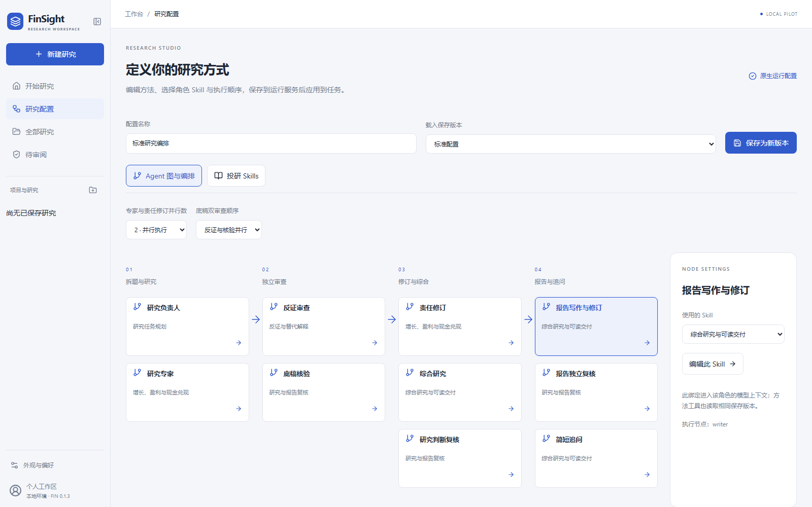
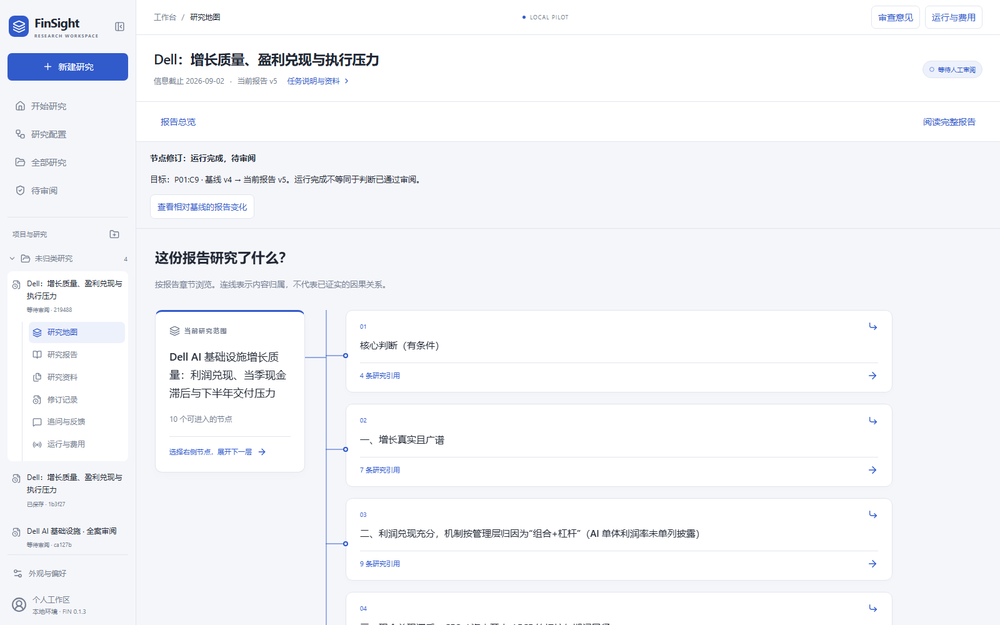
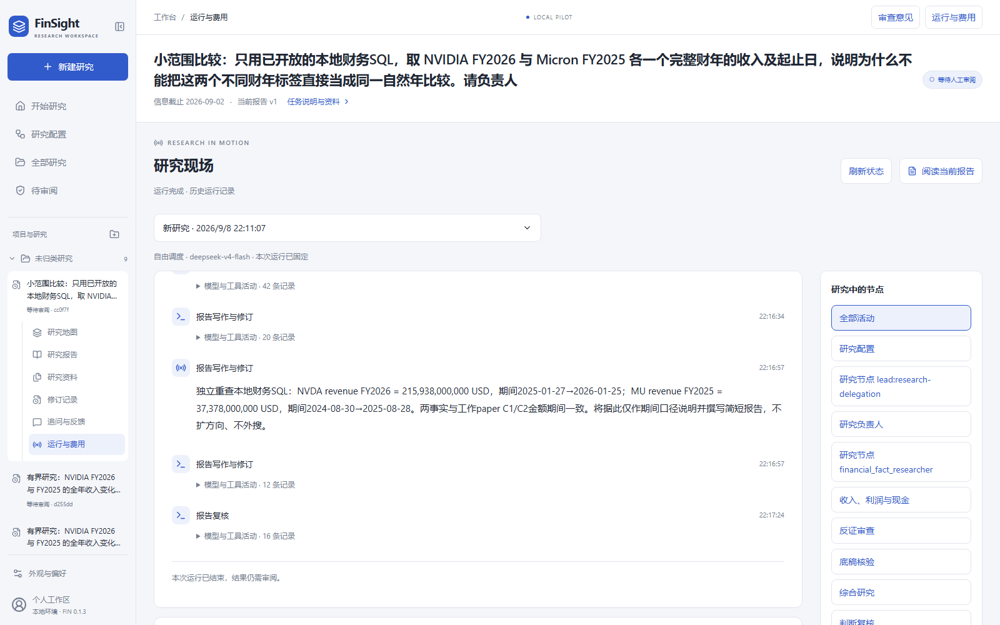
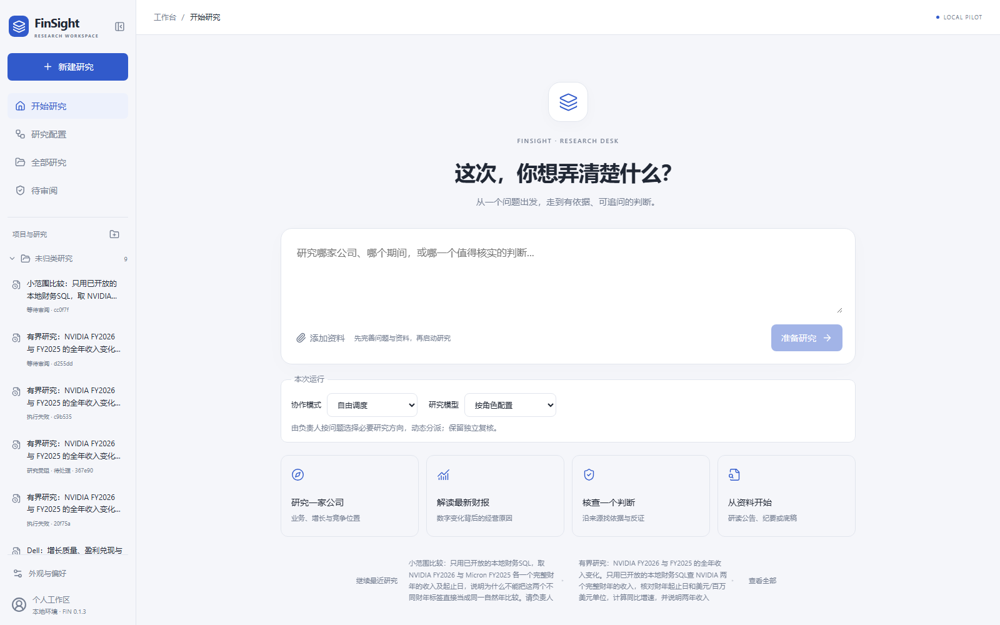
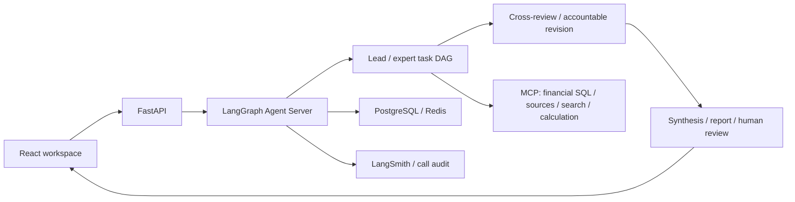

<div align="center">

# FinSight Agent

### From a research question to a judgment you can inspect and challenge.

Multi-agent research · Traceable evidence · Human revision · Editable research methods

[中文](README.md) · [Quickstart](docs/public/quickstart.en.md) · [Product tour](docs/public/demo-and-engineering.en.md) · [Architecture](docs/public/architecture.en.md) · [Changelog](CHANGELOG.md)

**FIN 0.1.3 · Local research workspace · Development preview**

</div>

FinSight brings financial SQL, source retrieval, source-bound calculations and multi-agent review into one workspace. Ask a question, follow the research, trace a report judgment to its evidence, and request a revision to a specific finding. It serves analysts who need to inspect conclusions and developers who want observable state, calls and reproducible checks.



*Actual application captured on September 8, 2026. Configuration versions persist in the native runtime and can be applied to a task. The current UI is Chinese; both documentation editions describe the same capabilities.*

## A research workflow you can participate in

| Step | What you can do |
| --- | --- |
| Start with a question | Choose a company, filing or judgment to investigate, set the research date, and attach documents or images. Organize research by project; project groups and pins currently live in this browser. |
| Choose execution | Select a model and single-agent, selected-expert, free-delegation or full-research mode for new research, followups and revisions. Each run pins its selection; single-agent results are explicitly unreviewed. |
| Follow the work | Read public progress, model and tool records, reported tokens and estimated cost in the main activity column. Add guidance or request cancellation; switch between saved runs afterward. |
| Inspect the evidence | Navigate report overview → topic → judgment and evidence. Expand source context, formulas, operands, periods and provenance. |
| Request a revision | Submit feedback on a selected judgment. The target and report baseline enter the native revision flow; compare the result while retaining the original version. |
| Define research methods | Edit role Skills, expert concurrency and dual-review order. Save an independent configuration version and apply it to an existing or new task. |
| Deliver the report | Export the same report as Markdown, PDF, Word or PowerPoint. Export makes no model calls; PowerPoint charts remain editable. |

### Follow a report back to its evidence



The research map represents report content and citation relationships. Artifact IDs, report versions and checkpoints bind revision targets to execution; navigation nodes do not need a one-to-one match with runtime nodes. The evidence library shares the same topic, judgment and source grouping, with links back to the map. Natural-language labels explain items while canonical identifiers retain exact bindings. Source inspection opens wider context. A visual connection does not establish financial causality.

### See actual execution and stay involved



This screenshot shows saved activity from a NVIDIA/Micron fiscal-period comparison. The lead chose one research direction, followed by independent review. Viewing history makes no new model calls. Public progress and tool events append during execution; guidance is read at later phase handoffs. Private reasoning transcripts are not displayed.

[Interaction and mode test questions](eval_sets/workbench_execution_modes.json) cover short followups, selected experts, new-company single-agent research, targeted revisions and free delegation. Selectable modes do not imply optimal cost: one local same-question comparison used 44,069 → 25,495 tokens, while the free-delegation example still needed 41 calls and 506,744 tokens. Review overhead remains an optimization target. These are individual engineering qualifications, not general savings guarantees.

<details>
<summary>View the research start page</summary>



</details>

## Verify a checkout without model keys or private data

Install Python 3.11, uv, Node.js 22 and npm. From the repository root:

```bash
uv sync --locked --extra agent-runtime --extra external-search --extra workbench-delivery
uv run --no-sync python -m scripts.dev.verify_public_checkout --output-directory .local/public-check-01

cd apps/workbench/frontend
npm ci
npm run build
npx playwright install chromium
npm run test:public
```

The Python check covers attachments, delivery, configuration and targeted revisions, then generates clearly synthetic reports. Choose an output directory that does not exist. Browser tests start only Vite and use synthetic API responses, covering three screen widths, navigation, sources, diffs, configuration editing and replay. **They verify interactions, not model research quality.** On Linux, install missing browser system dependencies with `npx playwright install --with-deps chromium`.

Full research additionally requires Docker, model/tool credentials, source data and service settings. Private qualification data is not distributed, so a fresh clone cannot complete real research without preparation. See the [quickstart](docs/public/quickstart.en.md) for deployment, expected results and troubleshooting.

## Architecture and engineering focus


```mermaid
flowchart LR
    UI[React workspace] --> BFF[FastAPI]
    BFF --> Runtime[LangGraph Agent Server]
    Runtime --> Lead[Lead / expert task DAG]
    Lead --> Review[Cross-review / accountable revision]
    Review --> Report[Synthesis / report / human review]
    Report --> UI
    Lead --> MCP[MCP: financial SQL / sources / search / calculation]
    Runtime --> State[PostgreSQL / Redis]
    Runtime --> Trace[LangSmith / call audit]
```

- **Native runtime infrastructure:** LangChain tool loops, LangGraph execution/checkpoints and native Assistants configuration snapshots. FIN owns research roles, evidence contracts and thin adapters.
- **Inspectable numbers:** expressions, operands, periods, units and provenance stay with calculations. Arithmetic checks and financial interpretation remain distinct.
- **Long-session context:** clear old tool bodies from outgoing requests while retaining original state and evidence; retrieve by ID, reuse calculations and avoid rewriting unrelated content.
- **Observable execution:** distinguish the selected operation from historical totals, preserving failures, unknown costs and human edits.

See [architecture](docs/public/architecture.en.md) for code entry points, configuration consumption and component boundaries.

## Current qualification scope

FIN 0.1.3 is the product iteration; Dell report **v5** is a separate content version awaiting human review. Evidence includes a nine-area Dell research case, bounded NVIDIA/Micron follow-ups, actual attachment Q&A and a frontend-driven local revision. It does not establish complete research quality for arbitrary companies. Graph/configuration interfaces do not branch on Dell prose; data coverage still needs separate qualification.

Model review can miss errors, and known citation/financial-wording findings remain recorded. Automatic summaries are disabled by default and on HOLD; no general equal-quality token-saving percentage is claimed. The deployment assumes a trusted local user and does not provide public multi-tenant authentication or isolation. Sample scope, costs and limitations are documented in [evidence and sharing](docs/public/sharing-scope.md).

## Explore the repository

| Entry | Contents |
| --- | --- |
| [Product tour](docs/public/demo-and-engineering.en.md) | Three-minute walkthrough and engineering narrative |
| [Quickstart](docs/public/quickstart.en.md) | Zero-model checks, local deployment, troubleshooting and feedback |
| [Workbench](apps/workbench/README.md) | Frontend/backend entry points and development commands |
| [Tests](tests/README.md) | Public checks, private-data replay and live model qualification |
| [Changelog](CHANGELOG.md) | Product milestones, frontend delivery and report revisions |

Git and `archive/versions/` preserve historical baselines. Internal worklogs retain decisions and failures from their original dates; this README and `docs/public/` describe the current public surface. The repository is public for code and engineering review, with no repository-wide open-source license selected. Third-party components retain their own licenses.
