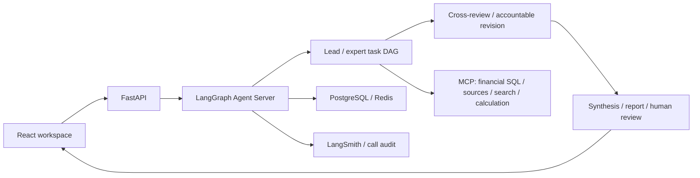

<div align="center">

# FinSight Agent

### From a research question to a judgment you can inspect and challenge.

Multi-agent research · Traceable evidence · Human revision · Editable research methods

[中文](README.md) · [Quickstart](docs/public/quickstart.en.md) · [Product tour](docs/public/demo-and-engineering.en.md) · [Architecture](docs/public/architecture.en.md) · [Changelog](CHANGELOG.md)

**v0.1.3 · Local financial research workspace · Preview**

</div>

FinSight brings financial SQL, source retrieval, source-bound calculations and multi-agent review into one workspace. Ask a question, follow the research, trace a report judgment to its evidence, and request a revision to a specific finding. It serves analysts who need to inspect conclusions and developers who want observable state, calls and reproducible checks.

**Measured evaluation (2026-09-11):** [Engineering and product report](docs/public/technical-evaluation.en.md), [metrics JSON](docs/public/evaluation-metrics.json) cover hybrid retrieval, real multi-turn recovery, human-reviewed delivery and identity checks.


*Actual application captured on September 8, 2026. Configuration versions persist in the native runtime and can be applied to a task. The current UI is Chinese; both documentation editions describe the same capabilities.*

## A research workflow you can participate in

| Step | What you can do |
| --- | --- |
| Start with a question | Choose a company, filing or judgment to investigate, set the research date, and attach documents or images. Organize research by project; project groups and pins currently live in this browser. |
| Choose execution | Select a model and single-agent, selected-expert, free-delegation or full-research mode for new research, followups and revisions. Each run pins its selection; single-agent results are explicitly unreviewed. |
| Follow the work | Read public progress, model and tool records, reported tokens and estimated cost in the main activity column. Add guidance or request cancellation; switch between saved runs afterward. |
| Inspect the evidence | Navigate report overview → topic → judgment and evidence. Expand source context, formulas, operands, periods and provenance. |
| Request a revision | Submit feedback on a selected judgment. The target and report baseline enter the native revision flow; compare the result while retaining the original version. |
| Define research methods | Edit role Skills, expert concurrency and dual-review order. Save an independent configuration version and apply it to an existing or new task. |
| Deliver the report | Export the same report as Markdown, PDF, Word or PowerPoint. Export makes no model calls; PowerPoint charts remain editable. |

### Start with company documents and original disclosures


The company library connects disclosure files, retrieval nodes and a document reader. Filter by company, year, document type and research cutoff, read the original material, then use it in research. The September 12, 2026 library snapshot contains **70 documents, 66 unique URLs, 9,253 nodes and 12,994 retrieval chunks**. Standardizable public material enters the library; external search and capture supplement its coverage.

*Actual deployed application, September 11, 2026. The screenshot's 60 documents are from the earlier snapshot; 70 is the count at the freeze.*

### Keep periods, units and provenance with financial numbers


Query financial observations by company and metric, retaining reporting periods, filing versions, units and original sources. The evaluated dataset includes **5 companies and 2,274 financial observations**, plus **37 source-bound derived metrics**. Calculation readback shows expressions and operands so analysts can inspect denominators, units and periods. Arithmetic validation still requires a separate review of financial meaning.

*Actual deployed application, September 11, 2026, showing filtered MSFT data. The visible row count is not the total library size.*

### Follow a report back to its evidence


The research map represents report content and citation relationships. Artifact IDs, report versions and checkpoints bind revision targets to execution; navigation nodes do not need a one-to-one match with runtime nodes. The evidence library shares the same topic, judgment and source grouping, with links back to the map. Natural-language labels explain items while canonical identifiers retain exact bindings. Source inspection opens wider context. A visual connection does not establish financial causality.

### See actual execution and stay involved


This screenshot shows saved activity from a NVIDIA/Micron fiscal-period comparison. The lead chose one research direction, followed by independent review. Viewing history makes no new model calls. Public progress and tool events append during execution; guidance is read at later phase handoffs. Private reasoning transcripts are not displayed.

[Interaction and mode test questions](eval_sets/workbench_execution_modes.json) cover short followups, selected experts, new-company single-agent research, targeted revisions and free delegation. Usage is recorded by task and call; failures and unknown costs are not reported as zero. Multi-layer review adds model calls; analysts still need to verify financial judgments against the original sources.

### Review, revise and deliver the same report


Read expert workpapers, inspect the evidence, edit the report and retain version differences. This actual HPE report v2 records two human edits and offers Markdown, PDF, Word and PowerPoint exports. Report versions are separate from product versions. Human confirmation does not relabel earlier failed model executions as successful.

*Actual deployed application, September 11, 2026, displaying public research prose and delivery controls.*

<details>
<summary>View the research start page</summary>


</details>

## Verify a checkout without model keys or private data

Install Python 3.11, uv, Node.js 22 and npm. From the repository root:

```bash
uv sync --locked --extra agent-runtime --extra external-search --extra workbench-delivery
uv run --no-sync python -m scripts.dev.verify_public_checkout --output-directory .local/public-check-01

cd apps/workbench/frontend
npm ci
npm run build
npx playwright install chromium
npm run test:public
```

The Python check covers attachments, delivery, configuration and targeted revisions, then generates clearly synthetic reports. Choose an output directory that does not exist. Browser tests start only Vite and use synthetic API responses, covering three screen widths, navigation, sources, diffs, configuration editing and replay. **They verify interactions, not model research quality.** On Linux, install missing browser system dependencies with `npx playwright install --with-deps chromium`.

Full research additionally requires Docker, model/tool credentials, source data and service settings. Source data and credentials must be configured before running full research. See the [quickstart](docs/public/quickstart.en.md) for deployment, expected results and troubleshooting.

## Architecture and engineering focus


```mermaid
flowchart LR
    UI[React workspace] --> BFF[FastAPI]
    BFF --> Runtime[LangGraph Agent Server]
    Runtime --> Lead[Lead / expert task DAG]
    Lead --> Review[Cross-review / accountable revision]
    Review --> Report[Synthesis / report / human review]
    Report --> UI
    Lead --> MCP[MCP: financial SQL / sources / search / calculation]
    Runtime --> State[PostgreSQL / Redis]
    Runtime --> Trace[LangSmith / call audit]
```

- **Native runtime infrastructure:** LangChain tool loops, LangGraph execution/checkpoints and native Assistants configuration snapshots. FIN owns research roles, evidence contracts and thin adapters.
- **Inspectable numbers:** expressions, operands, periods, units and provenance stay with calculations. Arithmetic checks and financial interpretation remain distinct.
- **Long-session context:** clear old tool bodies from outgoing requests while retaining original state and evidence; retrieve by ID, reuse calculations and avoid rewriting unrelated content.
- **Observable execution:** distinguish the selected operation from historical totals, preserving failures, unknown costs and human edits.

See [architecture](docs/public/architecture.en.md) for code entry points, configuration consumption and component boundaries.

## Evaluation scope

The following v0.1.3 results use specified datasets and a local deployment. Retrieval, interactions and financial judgments are evaluated separately:

| Verified area | Result and scope |
| --- | --- |
| Hybrid retrieval | Historical 1,105-chunk snapshot, 28 openly labeled questions, 24 positive cases: Hit@5 of 23/24 (95.8%) versus BM25's 12/24 (50%). This is neither an evaluation of the latest 12,994-chunk library nor answer accuracy. |
| Continued use and recovery | 19 real user turns, including failure recovery and restart handoff; not 19 first-attempt successes. |
| Identity and resource access | OIDC/PKCE with two users, 39 resource-ownership checks and 8 concurrent reads. Locally verified; no production multi-tenant security certification. |
| Tool approval | 4 actual frontend approval scenarios covering approval, rejection and pre-execution constraints through native task resumption, MCP and Docker sandbox execution. |
| Report delivery | Human revisions, version differences, source/calculation readback and four export formats. The AI/memory case produced a 7-page analyst-reviewed report; its native Writer did not finish, so it is not an autonomous end-to-end pass. |

Models can still misinterpret financial semantics or miss counterevidence. Automatic summaries are disabled by default. Dynamic financial methods, rule updates, bounded expert delegation and deadline-aware research convergence are planned in the [v0.1.4 roadmap](docs/product/roadmap.zh-CN.md) (Chinese). See the [evaluation report](docs/public/technical-evaluation.en.md) and [evidence and sharing](docs/public/sharing-scope.md) for samples, failures and cost scope.

## Explore the repository

| Entry | Contents |
| --- | --- |
| [Product tour](docs/public/demo-and-engineering.en.md) | Three-minute walkthrough and engineering narrative |
| [Quickstart](docs/public/quickstart.en.md) | Zero-model checks, local deployment, troubleshooting and feedback |
| [Workbench](apps/workbench/README.md) | Frontend/backend entry points and development commands |
| [Tests](tests/README.md) | Public checks, private-data replay and live model evaluation |
| [Changelog](CHANGELOG.md) | Product milestones, frontend delivery and report revisions |

The code, tests and documentation are available for project review. See the [quickstart](docs/public/quickstart.en.md) for installation and upgrades. No repository-wide open-source license has been selected; third-party components retain their own licenses.
