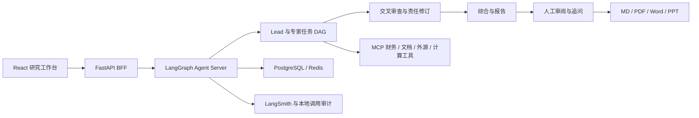

# FinSight Agent — FIN 0.1.3

**从研究问题到可追问报告的金融研究工作台。** 多 Agent 使用财务 SQL、原文检索和来源绑定计算，研究业务增长、利润与现金流，并交付可追溯的判断、图表与报告。

[English](README.en.md) · [运行与验证](docs/public/quickstart.zh-CN.md) · [架构](docs/public/architecture.zh-CN.md) · [证据与展示边界](docs/public/sharing-scope.md) · [版本迭代](CHANGELOG.md)

## 当前可以做什么

| 能力 | 实现与验证范围 |
| --- | --- |
| 动态多 Agent 研究 | Lead 生成任务 DAG；专家自行规划、调用工具并提交底稿。Dell 实案覆盖九个研究面，并发上限为 2。 |
| 研究质量闭环 | Counter / Verifier → 责任作者修订 → Lead 综合 → 研究复核 → Writer → 终审 → 人工审阅。保留失败和修改记录；模型审查仍会漏错。 |
| 可核查证据 | MCP 接入财务 SQL、文档结构/检索/原文窗口、外源搜索与网页读取；计算保存表达式、操作数、期间、单位和来源。计算正确不自动等于财务含义正确。 |
| 研究交互 | 新研究、短问答、深度追问、局部修订、停止、报告版本与差异查看、来源展开。运行中意见可保存并交给后续阶段；送达不等于被模型采纳。 |
| 长会话与费用 | 清理请求内的旧工具输出，保留原始证据和 checkpoint，按 ID 回读，复用已保存计算，避免局部修改时重写全文。展示全部原生运行的输入/输出/缓存、耗时、估费与未知用量。 |
| 用户资料 | 任务隔离的文档/图片上传、解析与分块；按需视觉读取并缓存。已用真实 PDF 和图片完成问答，发现并保留过 OCR 错误。 |
| 四格式交付 | 同一报告导出 Markdown、PDF、Word、PowerPoint；来源绑定图表，PPT 图表可编辑，详细来源放在讲者备注。导出不调用模型。 |

**当前报告：** Dell v4 开发审阅候选，54 处引用、3 张图表；PDF 15 页、Word 20 页、PowerPoint 44 页完成渲染检查，等待 Owner 内容审阅。产品版本仍为 **FIN 0.1.3**；报告 v4、执行 attempt 和产品版本分别记录。这不是无人辅助一次成功率或生产认证。

自动摘要资格目前为 **HOLD，默认关闭**。已验证的是工具输出清理、证据回读和局部编辑；尚未证明同等研究质量下的普遍 token 节省比例。

## 架构



执行、并发、持久化使用成熟组件。FIN 代码负责金融研究角色、证据与计算合同、来源权威、薄适配和产品验收；详见[架构及工程取舍](docs/public/architecture.zh-CN.md)。

## 运行

不需要模型凭据的源码检查：

```powershell
uv sync --locked --extra agent-runtime --extra external-search --extra workbench-delivery
uv run --no-sync python -m pytest tests/test_task_attachments.py tests/test_report_delivery.py -q
uv run --no-sync python -m scripts.qualification.research_delivery_smoke --output-directory D:/temp/finsight-delivery-smoke
```

输出目录须尚不存在。该命令生成的是合成测试文件。完整研究还需要 Docker、模型与工具凭据、已准备的财务数据和服务设置；当前不分发完整私有资格数据。`--fresh-only` 可在不加载旧报告/专家答案的情况下启动，仍需要原始资料。前端构建、配置、故障边界和验证命令见[运行说明](docs/public/quickstart.zh-CN.md)。

- 当前研究入口：`http://127.0.0.1:8766/workspace/session`；原生服务：`http://127.0.0.1:18165`。
- 历史固定 Evidence Pack 入口：`http://127.0.0.1:8765/workspace`。源码模式健康检查可用；未挂载私有证据时数据就绪检查返回 503，不展示虚构报告。
- 服务默认绑定本机；当前上传与操作面向可信 Owner，不是公网多租户产品。

## 如何审阅项目

1. 从[架构](docs/public/architecture.zh-CN.md)了解研究状态、证据流和自研边界。
2. 按[运行说明](docs/public/quickstart.zh-CN.md)运行零模型测试及合成导出。
3. 在配置好的工作台查看报告、来源、计算操作数、历史版本与差异，再尝试追问和上传。
4. 同时查看失败、未知用量和修订记录。原 Dell 开发研究为 265 次请求、264 次已知用量、估算 28.092715 元，包含失败和修订；后续整改、上传及新问题另列，不能作为一次普通问答价格。

当前固定资料时点为 2026-09-02，财务 SQL 覆盖 DELL / MU / NVDA。Dell 完整研究与 NVIDIA / Micron 有界追问的验证范围不同，不能据此声称任意公司全案已通过。研究结论、资料时点、估算与信息边界应结合原文审阅。

## 文档与历史

当前入口以本页和 `docs/public/` 为准；[CHANGELOG](CHANGELOG.md)区分产品里程碑与报告修订。`archive/versions/` 和 Git 历史保存此前基线，工作日志保存当时的决定与失败，不应将旧“下一步”当作当前状态。

仓库公开供代码与工程展示审阅。用户上传、数据库、原始模型上下文和私有 trace 不属于默认展示材料；完整研究报告的外部分享范围另行审阅。仓库目前没有统一开源许可证，不暗示授予额外使用权；第三方组件遵循各自许可证。
