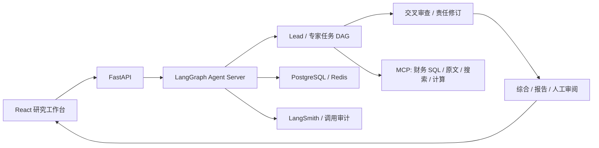

<div align="center">

# FinSight Agent

### 从一个研究问题，走到有依据、可追问的判断。

多 Agent 投研 · 证据追溯 · 人工修订 · 可编辑研究方法

[English](README.en.md) · [快速开始](docs/public/quickstart.zh-CN.md) · [产品导览](docs/public/demo-and-engineering.zh-CN.md) · [架构](docs/public/architecture.zh-CN.md) · [更新记录](CHANGELOG.md)

**FIN 0.1.3 · 本地研究工作台 · 开发预览**

</div>

FinSight 将财务 SQL、原文检索、来源绑定计算和多 Agent 审查放进一个研究工作区。你可以提出问题，跟踪研究过程，从报告判断回到依据，再针对具体节点提出修订。它面向需要核查研究结论的分析师，也为开发者提供可检查的状态、调用记录和测试入口。


*实际运行界面，2026-09-08。配置可保存到原生运行服务并应用到任务；当前界面为中文，中英文文档提供相同使用说明。*

## 在工作台里完成一次研究

| 步骤 | 你可以做什么 |
| --- | --- |
| 提出问题 | 从公司、财报或待核查判断开始，设定研究时点，添加文档或图片。侧栏按项目组织研究；当前项目分组和置顶保存在本浏览器。 |
| 观察研究 | 查看实际阶段、公开活动、已报告 tokens 与估费；运行中补充意见，必要时请求停止。历史事件可以回放。 |
| 追溯依据 | 沿“报告总览 → 专题 → 判断与依据”进入，展开原文上下文、公式、操作数、期间和来源。 |
| 提出修订 | 选中判断并提交意见，目标和报告基线进入原生修订流程；完成后比较修订前后，保留原版本。 |
| 定义方法 | 编辑角色使用的 Skill、专家并行数和双审查顺序，保存为独立配置版本，应用到当前或新研究。 |
| 交付报告 | 从同一报告导出 Markdown、PDF、Word、PowerPoint；导出不调用模型，PPT 图表可编辑。 |

### 按图索骥，回到每条判断的依据


研究地图表达报告内容及引用关系。它通过真实产物 ID、版本和 checkpoint 绑定修订目标；导航层不要求与执行图一一对应。来源展开后可以查看更完整的上下文。图线本身不代表已证实的财务因果关系。

### 看见实际运行，保留人的参与


上图是一次已完成短问的保存记录，包含配置加载、实际模型调用和费用。历史回放逐条展示已有事件，不重新调用模型；运行中的补充意见在后续阶段交接时读取。界面展示公开进展及工具活动，不展示私有思维链。

<details>
<summary>查看研究起始页</summary>


</details>

## 快速验证：无需模型密钥或私有数据

准备 Python 3.11、uv、Node.js 22 与 npm。从仓库根目录执行：

```bash
uv sync --locked --extra agent-runtime --extra external-search --extra workbench-delivery
uv run --no-sync python -m scripts.dev.verify_public_checkout --output-directory .local/public-check-01

cd apps/workbench/frontend
npm ci
npm run build
npx playwright install chromium
npm run test:public
```

Python 检查覆盖上传、导出、配置和目标修订，并生成明确标注的合成报告。输出目录须尚不存在。浏览器测试只启动 Vite，使用合成 API 响应，覆盖三种屏幕宽度、导航、来源、修订对比、配置编辑与回放；**它验证交互，不是模型研究效果测试**。Linux 缺浏览器系统依赖时使用 `npx playwright install --with-deps chromium`。

完整研究需要 Docker、模型/工具凭据、原始资料及服务配置。公开仓库不包含本地资格数据，因此不能承诺 clone 后无配置跑完真实研究。部署、检查预期和故障处理见[快速开始](docs/public/quickstart.zh-CN.md)。

## 架构与工程重点



- **原生运行基础设施：** LangChain 工具循环、LangGraph 执行与 checkpoint、原生 Assistants 配置快照。FIN 代码负责研究角色、证据合同与薄适配。
- **可核查数字：** 计算保留表达式、操作数、期间、单位和来源，区分算术校验与金融语义审阅。
- **长会话管理：** 清理下一次请求中的旧工具正文，保留原始状态和证据，按 ID 回读并复用计算；局部修订避免无关全文重写。
- **运行可解释：** 区分本次操作与历史累计用量，保留失败、未知计费和人工修改记录。

代码入口、配置生效路径和采用成熟组件的边界见[架构说明](docs/public/architecture.zh-CN.md)。

## 当前验证范围

FIN 0.1.3 是当前产品迭代，Dell 报告 **v5** 是待人工审阅的内容版本，两者分开编号。已有 Dell 九研究面实案、NVIDIA/Micron 有界追问、真实上传问答和前端局部修订证据；这不代表任意公司完整研究均已通过。研究图与配置接口不按 Dell 文本硬编码，数据覆盖资格仍需逐项验证。

模型审查可能漏错，已知引用和财务措辞意见保留。自动摘要默认关闭、资格 HOLD；没有宣称同等研究质量下的普遍 token 节省比例。当前服务面向可信本地使用者，尚未提供公网多租户认证与隔离。详细样本、成本和局限见[证据说明](docs/public/sharing-scope.md)。

## 继续了解

| 入口 | 内容 |
| --- | --- |
| [产品导览](docs/public/demo-and-engineering.zh-CN.md) | 三分钟界面走查与工程讲解 |
| [快速开始](docs/public/quickstart.zh-CN.md) | 无模型测试、完整本地部署、排错与反馈 |
| [工作台代码](apps/workbench/README.md) | 前后端入口和开发命令 |
| [测试说明](tests/README.md) | 公开检查、私有资料重放与真实模型验证的区别 |
| [更新记录](CHANGELOG.md) | 产品里程碑、前端交付与报告修订 |

历史基线保存在 Git 和 `archive/versions/`；内部工作日志保留当时的决策与失败，当前对外说明以本页及 `docs/public/` 为准。仓库公开供代码与工程审阅，尚未选定统一开源许可证；第三方组件遵循各自许可证。
