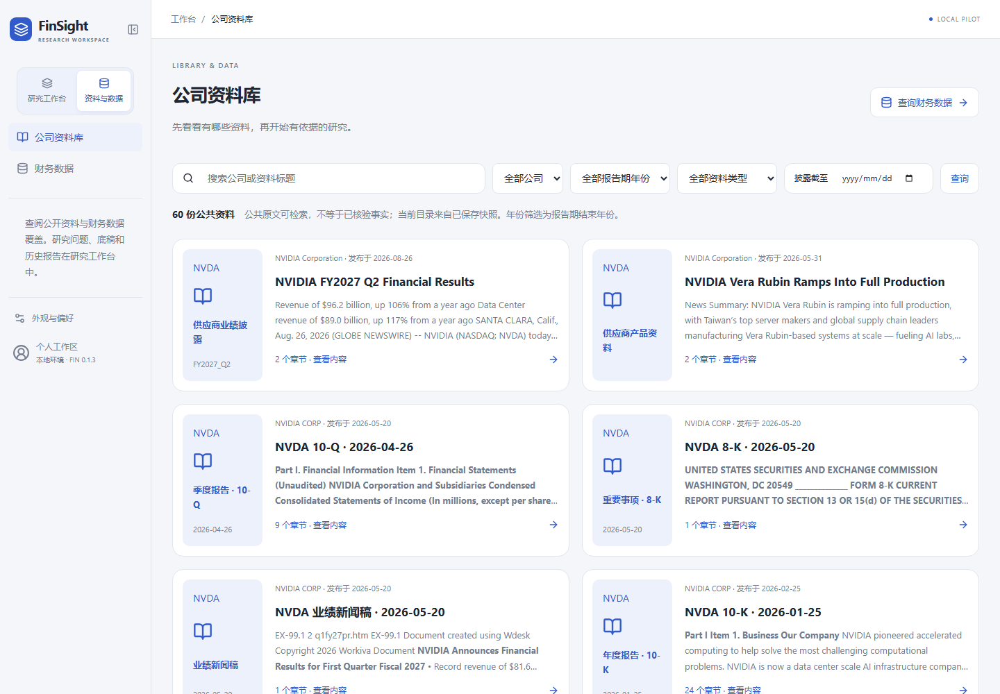
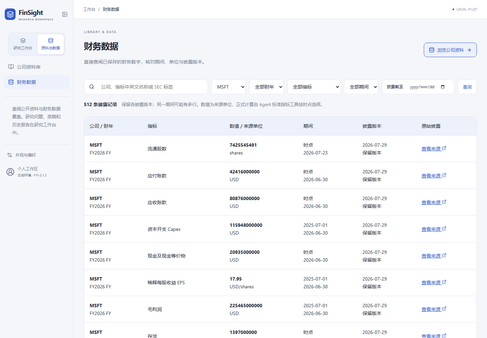
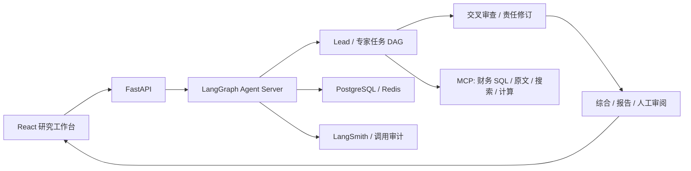

<div align="center">

# FinSight Agent

### 从一个研究问题，走到有依据、可追问的判断。

多 Agent 投研 · 证据追溯 · 人工修订 · 可编辑研究方法

[English](README.en.md) · [快速开始](docs/public/quickstart.zh-CN.md) · [产品导览](docs/public/demo-and-engineering.zh-CN.md) · [架构](docs/public/architecture.zh-CN.md) · [更新记录](CHANGELOG.md)

**v0.1.3 · 本地金融研究工作台 · 预览版**

</div>

FinSight 将财务 SQL、原文检索、来源绑定计算和多 Agent 审查放进一个研究工作区。你可以提出问题，跟踪研究过程，从报告判断回到依据，再针对具体节点提出修订。它面向需要核查研究结论的分析师，也为开发者提供可检查的状态、调用记录和测试入口。

**实测报告（2026-09-11）**：[工程与产品评测](docs/public/technical-evaluation.zh-CN.md)记录混合检索、真实长对话、人工报告交付、身份隔离及故障恢复；附[机器可读指标](docs/public/evaluation-metrics.json)。


*实际运行界面，2026-09-08。配置可保存到原生运行服务并应用到任务；当前界面为中文，中英文文档提供相同使用说明。*

## 在工作台里完成一次研究

| 步骤 | 你可以做什么 |
| --- | --- |
| 提出问题 | 从公司、财报或待核查判断开始，设定研究时点，添加文档或图片。侧栏按项目组织研究；当前项目分组和置顶保存在本浏览器。 |
| 选择执行方式 | 新研究、追问和修订均可选择模型，以及单 Agent、指定专家、自由调度或完整研究。运行会固定本次选择；单 Agent 结果明确标注未经独立复核。 |
| 观察研究 | 在主栏活动流中查看公开进展、模型与工具记录、已报告 tokens 和估费；运行中补充意见，必要时请求停止。历史记录可切换查看。 |
| 追溯依据 | 沿“报告总览 → 专题 → 判断与依据”进入，展开原文上下文、公式、操作数、期间和来源。 |
| 提出修订 | 选中判断并提交意见，目标和报告基线进入原生修订流程；完成后比较修订前后，保留原版本。 |
| 定义方法 | 编辑角色使用的 Skill、专家并行数和双审查顺序，保存为独立配置版本，应用到当前或新研究。 |
| 交付报告 | 从同一报告导出 Markdown、PDF、Word、PowerPoint；导出不调用模型，PPT 图表可编辑。 |

### 从公司资料库开始，直接阅读原始披露



公司资料库将披露文件、检索节点和阅读入口放在同一页。研究员可以按公司、年份、文件类型和研究截止日筛选，阅读原文，再把来源用于研究。截至 2026-09-12，示例资料库包含 **70 份文档、66 个独立 URL、9,253 个节点和 12,994 个检索块**；可标准化的公开资料进入资料库，外部搜索与抓取补充已有库的覆盖。

*实际部署界面，2026-09-11；截图中的 60 份文件属于扩充前快照，以上 70 份为 2026-09-12 的资料快照计数。*

### 财务数字同时保留期间、单位和出处



财务查询支持按公司和指标查看数据，区分报告期间、申报版本、单位和原始来源。已验证的数据集覆盖 **5 家公司、2,274 条财务观测**，另有 **37 项来源绑定派生指标**。计算回读展示表达式和操作数，帮助检查分母、单位与期间；算术校验通过后，金融含义仍需审阅。

*实际部署界面，2026-09-11，展示 MSFT 的筛选结果；页面行数不是全库规模。*

### 按图索骥，回到每条判断的依据


研究地图表达报告内容及引用关系。它通过真实产物 ID、版本和 checkpoint 绑定修订目标；导航层不要求与执行图一一对应。研究资料按同一套专题、判断和来源归类，并可跳回地图。界面使用自然语言名称，原始编号仍用于精确绑定。来源展开后可以查看更完整的上下文。图线本身不代表已证实的财务因果关系。

### 看见实际运行，保留人的参与


上图是一次 NVIDIA／Micron 财年比较研究的保存活动。负责人只选择了一个研究方向，随后进行独立复核；历史查看不重新调用模型。运行时公开进展和工具活动持续追加，补充意见在后续阶段交接时读取。界面不展示私有思维链。

[交互与模式测试题](eval_sets/workbench_execution_modes.json)覆盖简短追问、指定专家、跨公司单 Agent 研究、节点微修订和自由分派。用量按任务和调用记录；失败与未知费用不会被当成零成本。多层审查会增加调用开销；金融判断仍需要分析师结合原文复核。

### 审阅、修改，再交付同一份报告


研究员可以阅读专家底稿、检查结论依据、直接修订报告并保留版本差异。上图为实际 HPE 报告 v2，记录两次人工修改；右侧提供 Markdown、PDF、Word、PowerPoint 导出。报告版本和修改记录可分别查看，便于追溯分析过程。

*实际部署界面，2026-09-11；截图展示公开研究内容及交付入口。*

<details>
<summary>查看研究起始页</summary>


</details>

## 快速验证：无需模型密钥或私有数据

准备 Python 3.11、uv、Node.js 22 与 npm。从仓库根目录执行：

```bash
uv sync --locked --extra agent-runtime --extra external-search --extra workbench-delivery
uv run --no-sync python -m scripts.dev.verify_public_checkout --output-directory .local/public-check-01

cd apps/workbench/frontend
npm ci
npm run build
npx playwright install chromium
npm run test:public
```

Python 检查覆盖上传、导出、配置和目标修订，并生成明确标注的合成报告。输出目录须尚不存在。浏览器测试只启动 Vite，使用合成 API 响应，覆盖三种屏幕宽度、导航、来源、修订对比、配置编辑与回放；**它验证交互，不是模型研究效果测试**。Linux 缺浏览器系统依赖时使用 `npx playwright install --with-deps chromium`。

完整研究需要 Docker、模型/工具凭据、原始资料及服务配置。完整研究所用资料和凭据需由使用者配置。部署、检查预期和故障处理见[快速开始](docs/public/quickstart.zh-CN.md)。

## 架构与工程重点



- **原生运行基础设施：** LangChain 工具循环、LangGraph 执行与 checkpoint、原生 Assistants 配置快照。FIN 代码负责研究角色、证据合同与薄适配。
- **可核查数字：** 计算保留表达式、操作数、期间、单位和来源，区分算术校验与金融语义审阅。
- **长会话管理：** 清理下一次请求中的旧工具正文，保留原始状态和证据，按 ID 回读并复用计算；局部修订避免无关全文重写。
- **运行可解释：** 区分本次操作与历史累计用量，保留失败、未知计费和人工修改记录。

代码入口、配置生效路径和采用成熟组件的边界见[架构说明](docs/public/architecture.zh-CN.md)。

## 当前验证范围

以下评测基于 v0.1.3 的指定数据集和本地运行环境。检索、交互和研究质量分别测量：

| 已验证项目 | 结果与适用范围 |
| --- | --- |
| 混合检索 | 旧 1,105 块快照、28 个公开标签问题，其中 24 个正例：Hit@5 为 23/24（95.8%），BM25 为 12/24（50%）。不是最新 12,994 块全库评测，也不是答案正确率。 |
| 连续使用与恢复 | 19 个真实用户回合，包含失败恢复与重启交接；不是 19 次全都首轮成功。 |
| 身份与资源权限 | OIDC/PKCE 双用户验证，39 项资源归属检查与 8 次并发读取。已有本地验证，尚无生产多租户安全认证。 |
| 工具审批 | 4 个实际前端审批场景，覆盖批准、拒绝和执行前约束，经原生任务恢复连接 MCP 与 Docker 沙箱。 |
| 报告交付 | 人工修订、版本差异、来源与计算回读、四格式导出。AI/内存案例形成 7 页分析师审阅报告，该案例需要人工完成报告，自动写作仍有局限。 |

模型仍可能误读财务语义或遗漏反证。自动摘要默认关闭；金融判断方法库、规则更新、专家委派和研究时间预算列于 [v0.1.4 路线图](docs/product/roadmap.zh-CN.md)。详细样本、失败和费用范围见[评测报告](docs/public/technical-evaluation.zh-CN.md)与[证据说明](docs/public/sharing-scope.md)。

## 继续了解

| 入口 | 内容 |
| --- | --- |
| [产品导览](docs/public/demo-and-engineering.zh-CN.md) | 三分钟界面走查与工程讲解 |
| [快速开始](docs/public/quickstart.zh-CN.md) | 无模型测试、完整本地部署、排错与反馈 |
| [工作台代码](apps/workbench/README.md) | 前后端入口和开发命令 |
| [测试说明](tests/README.md) | 公开检查、私有资料重放与真实模型验证的区别 |
| [更新记录](CHANGELOG.md) | 产品里程碑、前端交付与报告修订 |

代码、测试和文档可用于项目审阅。安装与已有环境升级见[快速开始](docs/public/quickstart.zh-CN.md)。本仓库尚未选定统一开源许可证；第三方组件遵循各自许可证。
