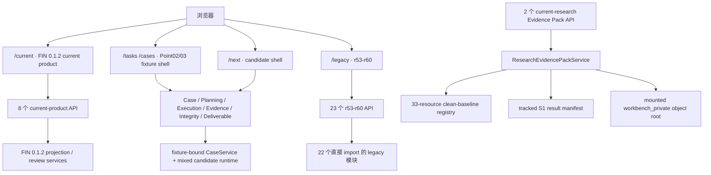

# FIN 0.1.3 Workbench 路由、Runtime、资源与消费者总图

日期：2026-08-11

状态：消费者总图完成；第一条 S1 真实 Evidence Pack 产品 API 纵切通过；UI 与 Case cutover 尚未完成。

机器权威：`configs/repository/fin_0_1_3_workbench_route_runtime_resource_consumer_map_v1_0.json`

## 1. 先说结论

现在已经可以看清代码，但结论不是“主干里只有一条产品链”。Workbench 实际并存四套表面：

1. `/current`：用户目前看到的 FIN 0.1.2 冻结成品与审核面；可用，但版本耦合严重。
2. `/tasks`、`/cases`：Point02/03 的完整工作台壳；默认 CaseService 只是 internal fixture，没有显式 `FINSIGHT_P02_FIXTURE_ROOT` 时不可运行。
3. `/next`：更完整的新 UI 已经写好，但此前后端没有注册 direct SPA fallback；本轮已补齐路由，业务 Runtime 仍复用 fixture 链。
4. `/legacy`：仍直接消费 `r53_r60_*` 代码，不能在替代面落地前归档。

因此，不能把任何一个 S1 候选随便接到某个页面，再宣布主线统一。本轮选择的是更窄但真实的纵切：把已经通过内容审计的 DELL／MU／NVDA 本地 Evidence Pack，通过版本中立的只读 Workbench API 暴露出来。

这不是新造检索链。新服务复用已有 Pack validator、tracked result、内容寻址对象和 `RuntimePathRegistry`。它只负责安全读取和产品投影。

## 2. 现状拓扑



当前 FastAPI 一共识别 109 个 decorator route：43 个 `/api/v1` 路由、66 个直接 app route。数量本身不是问题；问题是多代产品入口没有明确生命周期。

## 3. 为什么没有复用旧 local preview

初步看，`GET /api/v1/cases/{case_id}/local-research-preview` 很像现成 S1 入口。深入审计后发现不能这样做：

- `CaseService` 的 schema 只有 query、as-of 和 language，没有 typed company subject、ticker 或 entity identity。
- `P36LocalResearchService` 固定编译十个跨公司 P36 单元，包含 NVDA、DELL、MU、AMAT 和通用 SQL／Graph 单元。
- 它并不根据 Case 主体生成公司特定 Evidence Pack。
- 当前测试也明确把它当作固定 P36 fixture preview。

把 DELL Pack 塞到这个接口会产生一个危险假象：API 路径是 case-aware 的，但底层研究对象并不 case-aware。以后 MU、NVDA 或新案例只会继续增加分支和补丁。

本轮因此推翻了初步接入建议，改为：

```text
GET /api/v1/current-research/evidence-packs
GET /api/v1/current-research/evidence-packs/{case_key}
```

长期接口不含 `0.1.3`、S1、attempt 或 runner 名字。具体版本和对象根由注册资源与 current projection config 绑定。

## 4. 第一条 S1 产品纵切做了什么

新增 `ResearchEvidencePackService`，职责只有五项：

1. 从 current runtime registry 读取 projection config 和 tracked S1 result。
2. 从显式 `RuntimePathRegistry.workbench_private_root` 解析对象，不把 private data 复制进代码工作树。
3. 核对 result digest、artifact SHA、byte size、Pack payload digest、case identity、source text digest 和 Evidence-to-source binding。
4. 返回 Evidence 的业务含义、claim boundary、citation、受限内部摘录和 residual gaps。
5. 在权限、未知案例、路径逃逸、内容 mutation 或缺失对象时 fail closed。

它明确不做：

- 不检索；
- 不访问网络；
- 不调用 DeepSeek 或其他模型；
- 不晋升 Candidate 或 Evidence；
- 不写 financial truth；
- 不生成报告；
- 不把完整 source material 或 raw capture 暴露给前端。

受限摘录用于具备 `current_product:read` 权限的内部审核，并随每条 Evidence 明示“不可自动进入交付或事实库”。

## 5. 真实三案例结果

新工作树挂载 `D:/FIN_Insight_Agent/data` 后，三案都通过 registry、manifest、artifact 和 Pack 合同校验：

| 案例 | 已审 Evidence | 显式 gaps | API | 一个实际业务例子 |
| --- | ---: | ---: | --- | --- |
| DELL | 15 | 16 | 200 | 同季 AI 订单与确认收入可观察订单向收入转换，但没有取消率、交付周期分布或订单队列明细 |
| MU | 16 | 13 | 200 | Dell AI 服务器订单可作为下游需求旁证，但不能把 Dell 订单金额直接归因到 Micron 内存 |
| NVDA | 14 | 13 | 200 | Dell AI 服务器订单为 NVIDIA 平台下游需求提供独立旁证，但不能拆出 NVIDIA GPU 金额或交付节奏 |

同一 Pack 也没有掩盖问题。例如：

- DELL：TSMC 证据只证明先进制程爬坡，没有 CoWoS／先进封装容量，需要定向补 TSMC 法说和扩产披露。
- MU：有 3D die stacking 产品不等于先进封装可分配产能已披露。
- NVDA：当前 TSM 来源没有 CoWoS 容量和客户分配信息。

这正是 Workbench 应展示的研究状态：知道什么、为什么能用、不能推出什么、下一份资料应补什么；而不是只有“15 条 Evidence”这个数字。

## 6. 13 个 unknown 文件的结论

13 个静态无消费者文件已经全部归类，不再是模糊的“可能垃圾”：

| 数量 | 文件类型 | 裁决 |
| ---: | --- | --- |
| 9 | package `__init__.py` | 保留；静态图根节点假阴性 |
| 1 | `hermetic_test_capture.py` | 保留为 test-only；由路径字符串动态加载 |
| 2 | generic dense／hybrid RRF prototype | quarantine；确认无 operator 使用且 successor 切换后归档 |
| 1 | 历史 retrieval eval utility | quarantine；确认无手工运维入口后归档 |

本轮仍然没有移动或删除它们。原因不是保守拖延，而是用户明确禁止删除，且 operator 外部调用无法仅靠仓库静态图否定。

## 7. 当前哪些代码可以归档，哪些还不能

### 仍不能归档

- FIN 0.1.2 current projection/reviewer：`/current` 仍在消费。
- `r53_r60_*`：`/legacy` 和 23 个 API 仍在直接消费。
- P36 local preview：`WorkbenchNext` 仍读取它。
- attempt/release-only S1–S3 模块：必须先抽出 reusable core，并证明产品消费者已经改用 successor。

### 已经具备归档候选资格但尚未授权移动

- `src/retrieval/dense_retriever.py`
- `src/retrieval/hybrid_rrf_retriever.py`
- `src/eval/retrieval_eval.py`

它们还差一次 operator/CLI 外部入口确认和 redirect manifest。

## 8. 下一步的唯一合理切换顺序

下一步不应继续写新的检索 runner，也不应立刻搬 99 个 release-only 文件。

1. 在长期 Case contract 中增加 typed subject：entity ID、ticker、issuer identity、research as-of。
2. 建立 Case → current reviewed Evidence Pack 的显式 binding，禁止通过 query 文本猜 ticker。
3. 让 `/next` 或现有 Evidence Workbench 的一个真实页面消费新 API；UI 必须显示 Evidence、claim boundary、citation 和 residual gap。
4. 用 DELL／MU／NVDA 做 API 与 UI 同 digest 回归，以及人工业务可读性检查。
5. 新页面稳定后，把固定 P36 preview 降为 fixture-only；旧消费者归零后才移动对应代码。
6. 再按同样方式晋升 S2 Numeric view 和 S3 dynamic research；不直接 import attempt runner。

这一顺序首先解决“产品主干到底在哪”，然后才整理旧代码。否则先搬目录只会把混装从一个位置搬到另一个位置。

## 9. 本轮验收边界

已成立：

- route → service → Runtime/resource → private object → test 的总图；
- 13 个 unknown 的逐文件裁决；
- `/next` direct route 可达；
- 版本中立 S1 Evidence Pack API；
- DELL／MU／NVDA 真实挂载；
- 18 个新服务与 registry 合同测试；
- 零模型、零 Provider、零 live network、零自动晋升。

尚未成立：

- Case-aware 动态检索；
- 新 API 的前端消费者；
- FIN 0.1.3 完整 current product；
- FIN 0.1.2 或 legacy consumer 归零；
- S2/S3 产品 cutover；
- 任何文件删除或批量归档授权；
- 报告内容质量、qualified-human 或 release acceptance。

## 10. 扩大回归没有被“修绿”的原因

本轮 changed-surface 定向回归为 `23 passed`。扩大到旧 Workbench／VT4 契约后为
`201 passed / 8 failed`；8 个失败分别落在旧前端源码／shell 断言、VT4 十单元 fixture
状态和 VT4 legacy rollback fallback，没有一个失败栈进入新增 Evidence Pack router 或
service。

相邻 S1 历史候选套件在干净工作树中为
`28 passed / 1 skipped / 11 failed / 9 errors`。主要原因不是检索算法退化，而是这些
release-only 测试仍把 private manifest、物理索引和内容寻址对象解析为
`<当前工作树>/data/workbench_private`。干净工作树没有复制原仓库约 74 GiB ignored
数据，因此按设计暴露了路径耦合。

这里不采用“复制数据让测试变绿”的办法。产品化的新服务已经使用
`RuntimePathRegistry` 并在显式挂载原 DataRoot 后通过三案校验；历史候选只有在被晋升为
产品 Runtime 消费者时才迁移路径合同。这样既保留旧失败，也不让本次 S1 产品 adapter
重新吞下整个历史 release suite。
