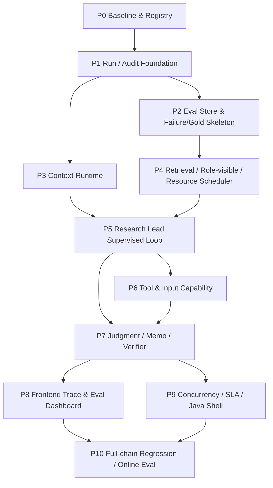

# 09-11 闭环后一体化执行计划

更新时间：2026-06-14

本文档把 09 Research Lead 常驻监督闭环、10 后端 / 前端 Runtime、11 Agent Eval Runtime 三个框架合并成下一阶段工程执行计划。

它不是按 09、10、11 各自排期，而是按可交付功能切片排期：每一步同时说明 Python agent runtime、后端 / 前端、评测体系如何一起推进，哪些可以并行，哪些必须同步屏障后再进入下一步。

## 2026-06-14 P0-P9 当前落地状态

本节覆盖用户要求的 P0-P9 “真正跑通后再进入 P10”的阶段状态；P10 full-chain 12case regression 暂未执行。

- P0/B0：已落地 JDK-only Java Task Gateway，不是空 shell。支持 task create / status / events / cancel / worker callback。
- P1：已接 file/JDBC task store、file/Redis queue、task event stream；JDBC 路径补 DB readiness retry。
- P2：Python worker 可把 Workbench eval summary 和 artifact refs 写入 runtime bridge eval store，并回传给 Java task。
- P3/P4：保留现有 run audit / context / Workbench artifact 通路；runtime bridge 已能承载 `context_api_smoke` 与 vNext diagnostic eval。
- P5/P7：已修 ClaimCard 产品 surface：产品收入 / AI server / ISG 事实即使由 fundamental agent 产出，也会进入 `product_technology` 和 `product_and_production`；memo / thesis driver pack 可以看到产品面。
- P6：工具/输入能力本轮未扩展新 multimodal/document renderer；保持 09/10 的接口规划。
- P8：Java task lifecycle 可由 API 查询 status / progress / memo / evidence / events；前端 dashboard 尚未新建。
- P9：已提供资源调度 contract 和 Docker backend smoke：`file+redis`、`jdbc+redis` 均通过；本机真实 vNext diagnostic 仍以 CPU BGE 跑通，CUDA/Milvus 绑定等待资源阶段。
- 已验证门控：
  - Java 编译通过。
  - `smoke_java_python_bridge.py --task-mode local_smoke --store-mode file --queue-mode file` 通过。
  - Docker Redis/MySQL backend smoke 通过。
  - Workbench 后端 `agent_graph_vnext_diagnostic_probe --limit 1` real case 通过，run id `runtime_bridge_agent_graph_diag_probe_l1_product_v4`。
  - 相关单测：runtime bridge、D-series fact selection、multi-agent contracts、real-LLM eval helpers、memo repair 通过。

剩余边界：

- P10 full-chain 12case regression 未跑；不能据此宣称全量线上质量已完成。
- Milvus 仍为 `unbound_cloud_deferred` semantic supplement，未重建 603 家公司云端 collection。
- Spring Boot parity、SSE 前端 dashboard、高并发压测仍属于下一阶段后端产品化工作。

后续完成口径已在 [13 09-11 剩余工作全量拆分与完成合同](13_09_11_remaining_full_completion_plan.zh-CN.md) 中收敛为 R0-R12。本文 P0-P10 保留为阶段来源和历史执行顺序；从 2026-06-14 起，09-11 的未完成项、云端依赖和通过门控以 13 文档为准。

## 核心原则

下一阶段目标不是“多加几个 agent 节点”或“单独做一个 Java 后端”，而是形成一个可审计的投研 Agent Runtime：

```text
用户请求
 -> Run Manager 创建 research run
 -> Python worker 执行 Research Lead supervised graph
 -> 每个节点写 run / context / retrieval / evidence / claim / gap / gate / model-call audit
 -> Eval Runtime 对节点和链路打分
 -> 前端展示 run trace / evidence / context / gap / report / eval
 -> 失败沉淀为 regression case，优秀结果晋级 gold candidate
```

执行原则：

- Eval 先行：任何新 agent 能力必须有 node-level eval，不等 full-chain 后才发现问题。
- 审计先行：任何模型调用、检索、repair、writer 输出都必须能回放输入、context、artifact refs 和 gate。
- 后端契约先行：Run / Event / Artifact / Eval schema 先稳定；P0 先打通 Java Task Gateway -> queue -> Python worker -> callback 通路，不把 Java 做成不可用 shell。
- 同步屏障清楚：Research Lead checkpoint、Evidence Fusion、LeadReview、MemoLogicPlan、Verifier 都是同步屏障；retrieval / specialist / tool calls 可以异步扇出。
- 不用弱兜底：找不到公开数据时暴露 bounded / commercial gap，不用 web snippet、memory 或 proxy 冒充事实。
- 企业级存储默认：SQL、ObjectStore、Redis、Milvus 等底座按企业级 Agent 平台的审计和扩展方式设计；“最小”只表示首批字段 / 首批接口 / 首批 runner，不表示 toy store、弱化 schema 或长期 SQLite-only 路线。
- 根因优先：遇到失败、慢任务或数据缺口时，先定位 parser、schema、算法复杂度、批处理、并发、索引、资源调度和数据写入方式的真实问题；只有确认本机资源或公开数据边界确实挡住后，才记录受限方案或 gap。

## 执行纪律：资源、存储、根因和数据质量

本节是 P0-P10 的共同门控，优先级高于单个任务里的“最小版”“fallback”“smoke”等表述。

### 企业级存储默认

- SQL 是 run audit、eval、claim/gap/gate、context、artifact index、source provenance、vintage 和业务事实表的默认审计源；JSONL 只作为导入导出、兼容旧 runner 或可读 artifact，不作为最终审计源。
- ObjectStore 保存原始文件、大型解析产物、报告产物、表格抽取快照和 before/after diff；数据库保存 URI、checksum、parser version、data snapshot、row counts、schema version 和 provenance。
- Redis 只做队列、锁、semaphore、working-set cache 和异步协作状态；不能替代最终 SQL 审计源。
- Milvus / vector store 是 passage-level semantic recall supplement，默认不承担 exact-value authority；向量库改动必须有 collection schema、snapshot、embedding model/version、rebuild/backfill/parity 记录。
- 只有在经过资源调度、内存/CPU/GPU 使用优化、脚本算法优化、批量/流式写入优化、索引/分区/去重/缓存优化之后仍无法在本机完成时，才允许记录 `resource_blocked_scale_up`，说明本机资源、已尝试优化、需要的云端规格和降级风险，并提示用户是否切到云端。

### 根因优先和慢任务处理

- 不把 fallback 当第一反应。fallback 只能是产品定义的有界行为、诊断保护，或带 removal condition 的临时 workaround；通过 fallback 产出的指标不能被提升为 mainline。
- 对 5 分钟级小任务、10 分钟级中任务、30-60 分钟以上长任务，如果慢是因为串行保守写法、重复加载模型、N+1 查询、低效 pandas/object loop、未批处理、未建索引、GPU/CPU/IO 低利用率或过早 CPU fallback，必须先做 profile 和算法/IO/并发优化，而不是被动等待。
- 慢任务优化记录至少包含：瓶颈类型、输入规模、当前复杂度或吞吐、改动策略、改动前后耗时、剩余资源约束。
- 因本机资源无法解决的问题要暴露为 `resource_blocked`；因公开免费源不可得的问题要暴露为 bounded/commercial gap；二者不能混写。

### 数据处理质量进入 eval

- Eval 不只看最终 memo。P4/P6/P10 必须覆盖前置数据质量：chunk 切分规则、chunk 边界、截断策略、表格 start/end、row/column/cell 保真、结构化抽取 schema validity、value/unit/period/product/entity 绑定、source/provenance/vintage、以及这些错误对 retrieval / rerank / ClaimCard 的下游影响。
- 对 SEC、上传文件、公开网页、宏观/行业官方源和 KG pack，必须保留 parser version、chunker version、input checksum、output row count、dropped reason、truncation reason 和可复跑命令。
- 如果 chunk 截断、表格抽取或结构化抽取导致检索看不到关键事实，failure taxonomy 归因到 parser/chunker/extractor，不得只归因到 reranker、Research Lead 或 Memo Writer。

## 工作流总图



## 工作流泳道

| 泳道 | 范围 | 默认技术 |
| --- | --- | --- |
| Python Agent Runtime | LangGraph、Research Lead、retrieval、specialists、ClaimCards、MemoLogicPlan、Verifier | Python |
| Backend Runtime | Java Task Gateway、Run Manager、API、DB、Redis、SSE、worker pool、rate limit、cancel/resume | P0 轻量 Java gateway；后续 Spring Boot parity |
| Eval Runtime | Eval Registry、node eval、chain eval、failure/gold lifecycle、judge audit | Python + SQL |
| Data / KG / Store | D-series SQL hardening、P/K registry、object store、Milvus semantic supplement | Python + SQL/ObjectStore/Milvus |
| Frontend / Workbench | run list、trace、evidence、context、claim/gap、report、eval dashboard | 现有 Workbench / 后续 Web UI |

## P0：Baseline、Registry 和技术路线冻结

目标：先把下一阶段“做什么、怎么验收、当前有哪些 eval / data / runner”整理成机器可读 registry，避免边做边漂移。

Python Agent：

- 不改主 graph。
- 盘点当前 09 L1-L9、10 B/F、11 EV 的实现状态。
- 输出 current / pending / superseded / diagnostic-only 清单。

Backend：

- B0 不再是 FastAPI / Java 二选一：P0 就采用 `Java Task Gateway + Python worker`，后续再升级 Spring Boot parity。
- Java P0 必须可用：`POST /api/research/tasks` 创建 task，写 store，投递 Redis/MQ 或 local file queue；Python worker 消费后通过 callback 回写状态、memo、evidence。
- 定义 run/event/artifact/eval schema 草案，不先上复杂微服务，不一开始引入 Spring Cloud / Kafka / K8s。
- 冻结存储路线：默认按 SQL + ObjectStore + Redis + Milvus supplement 的企业级组合设计；SQLite 只能作为本机开发 adapter 或临时兼容层，不是最终 D/P/Eval 主库。
- 路径兼容：D 盘代码 / 数据、Z 盘扩展数据、云端 Milvus 必须通过 registry / env 配置，不允许把路径统一迁移写死到单一路径导致链路断裂。
- 建立 `resource_blocked_scale_up` 记录格式，后续只有完成资源/脚本/写入优化审计后才能触发。

Eval：

- 实现 EV1 `Eval Registry` catalog。
- 登记当前 eval packs、fixtures、eval_sets、runner、命令、artifact policy、状态。
- 明确哪些旧 eval 是当前主线、哪些只是历史诊断。

可并行：

- D3/D4/D5/D11 DB hardening 设计可以并行，但不阻塞 P0。
- K5 offering / insider raw-material backfill 可以并行，但不得进入 runtime claim authority。

通过门控：

- E0 / EV1：Eval Registry 能回答每类能力对应跑哪个 eval。
- 文档和 registry 均能定位 09/10/11/12 的职责。
- B0 能说明 SQL/ObjectStore/Redis/Milvus 的职责边界、落地顺序、迁移 / backfill / parity 策略，以及哪些路径只是 local adapter。
- Java gateway smoke 能证明 `POST task -> queue -> Python worker -> callback -> GET task` 通路可用。
- 对任何“本机跑不动所以最小化”的判断，必须先有资源优化审计记录；否则不允许进入 P1 实现。
- `git status` 清洁；docs-only 不要求 runtime tests。

不通过处理：

- 如果 registry 无法归类旧 eval，先标 `unknown_legacy`，不得把它当 current gate。

## P1：Run / Audit Foundation

目标：把所有后续 agent 改动接到统一 run audit，不再只靠散落 JSON 和聊天记录复盘。

Python Agent：

- 扩展现有 `run_audit_store`，确保每次 graph run 都能物化：
  - `run`
  - `node_execution`
  - `artifact_ref`
  - `evidence_row`
  - `claim_card`
  - `gap`
  - `gate_result`
  - `model_call`
- 补 `retrieval_task`、`tool_call`、`context_snapshot`、`prompt_pack` 的最小 projection。
- 保留当前 per-run JSON artifacts，但 audit DB 成为默认复盘入口。

Backend：

- 实现 B1/B3 最小 Run Manager schema。
- API 最小接口：
  - `POST /api/research/tasks`
  - `GET /api/research/tasks/{task_id}`
  - `POST /api/research/tasks/{task_id}/worker-events`
  - 后续扩展 `GET /api/research/tasks/{task_id}/events`
- 以 Postgres/MySQL 级 SQL 主库契约为默认；本地 SQLite 只允许作为兼容 / 开发 adapter，必须保持 schema parity、migration path 和 parity test，不得作为长期主线替代。
- ObjectStore URI / checksum / parser version / before-after diff 必须可从 run audit 追溯。

Eval：

- E1 Backend Runtime / SLA Eval 最小版。
- 每个 run 必须有 `run_id`、`case_id`、`code_commit`、`data_snapshot_id`、`node_execution`、`model_call`。
- 添加 `backend_runtime_sla_v0_1` smoke，不要求高并发，只验证生命周期。

前端：

- Workbench 增加 run audit inspect 入口或继续复用已有 artifact inspect。

同步屏障：

- P1 过关前，不允许大规模改 L1-L5 graph；否则调试时会继续缺复盘底座。

通过门控：

- E1：single-run exact lookup / focused memo 都能写入 audit DB。
- E11：给定 `run_id` 能重建 node order、elapsed_ms、model token、artifact refs。
- 给定 `task_id` 能查询 Java gateway 中的 status、progress、memo、evidence 和 error。
- 关键审计表以 SQL-backed store 为主；JSON artifact 与 SQL projection 有 parity check。
- 没有隐藏 fallback：写入失败必须暴露为 audit failure，不允许静默只落 JSON。
- 无 private path / secret 泄漏到用户输出。

不通过处理：

- 如果 graph 可以跑但 audit 不全，不能进入 P3/P5；先补 audit projection。

## P2：Eval Store 与 Failure / Gold 骨架

目标：把 11 的 Eval Runtime 从文档推进到 SQL-backed eval store / artifact contract，使后续每一步都有统一 gate。

Python Agent / Eval：

- 实现 EV2 最小 eval store：
  - `eval_case_registry`
  - `eval_dataset_version`
  - `eval_case_result`
  - `eval_node_result`
  - `eval_metric_result`
  - `eval_failure_event`
  - `eval_gold_promotion`
- 写 `eval_run_manifest.json`、`eval_case_results.jsonl`、`eval_node_results.jsonl`、`eval_metric_results.jsonl`、`failure_events.jsonl`。
- JSONL 是导入导出和旧 runner adapter；主审计以 eval SQL rows 为准。
- 先把现有 S1-S10 / G11 / retrieval A/B / SEC benchmark 的 summary 归一成 eval rows，不重写全部 runner。

Backend：

- Run detail API 增加 eval summary / metric result 查询。

Eval：

- EV5 / EV6 先落状态机字段，不急着做完整前端。
- failure 状态：`observed -> triaged -> root_caused -> regression_case_added -> fixed -> monitored -> retired`。
- gold 状态：`candidate -> reviewed -> active_regression -> gold -> stale -> deprecated`。

通过门控：

- E11：一个已有 G11 run 能转换成 eval case/node/metric rows。
- Failure event 至少能记录 failure_type、node、expected、actual、artifact_refs。
- Gold candidate 不能直接变 gold，必须有 criteria_version / data_snapshot / review method。
- Eval store 能记录 parser/chunker/table/structured-extraction 类型 failure，不只记录最终 memo failure。

不通过处理：

- 如果旧 summary 字段不够，先写 adapter gap，不伪造 metric。

## P3：Context Runtime v0

目标：把 10 的 Context Runtime 接到运行系统，确保每次模型调用看到什么上下文可复盘。

Python Agent：

- 在现有 `SecAgentContextManager` 上封装 `ContextEngine` facade：
  - `resolve_user_session`
  - `select_context`
  - `build_injection_plan`
  - `compress_context`
  - `write_context_event`
  - `write_memory_candidate`
  - `invalidate_context`
  - `retrieve_memory`
- 输出 `context_pack_id`、`context_pack_digest`、`source_refs`、`allowed_claim_scope`、`dropped_items`、`compression_strategy`。
- D11 analyst view / research memory 只作为 index，不直接支撑 claim。

Backend：

- 落 B9/B10/B11 最小表：
  - `context_snapshots`
  - `context_events`
  - `context_injection_plans`
  - `prompt_packs`
  - `research_memory_entries`
- Redis 只 cache working set 和 injection plan，不作为最终审计源。

Eval：

- E2 Context / Memory Eval。
- 新增 `context_injection_replay_v0_1`。
- 检查 tenant/session isolation、token budget、drilldown parity、staleness。

前端：

- 暂时只提供 JSON inspect；完整 Context trace 留到 P8。

通过门控：

- 每个 model call 有 prompt/context digest。
- 给定 `run_id + node_id` 能重建该节点注入的 context summary。
- memory / vector / analyst view 不能直接进入 financial claim evidence refs。

不通过处理：

- 如果 context 超预算，必须记录 dropped_items 和策略；不能静默截断。

## P4：Retrieval / Role-visible / Resource Scheduler

目标：先解决“检索和 rerank 是否真的把证据送到正确 agent”的根因审计，再谈写作质量。

Python Agent：

- 实现 EV3 必需 ledgers：
  - `retrieval_candidate_ledger`
  - `rerank_ledger`
  - `role_visible_evidence_ledger`
  - `dropped_row_ledger`
- 修 L4 role-specific selector 和 quotas：
  - Product / Technology
  - Market / Valuation
  - Capital / Ownership / Macro
  - Fundamental
  - Industry / Supply-chain
  - Risk
- 实现 L6 `InferenceResourceScheduler`：
  - BGE CUDA queue
  - CPU spillover
  - route priority
  - rerank cache
  - latency/device audit
- 实现 L7 最小 `ModelRouter / AgentCoalescer`：
  - exact / deterministic 不调用大模型。
  - supporting agent 可用低成本模型或合并。
  - 记录 per-claim cost。

Backend：

- B2 Redis semaphore：
  - `llm:{provider}:semaphore`
  - `bge:cuda:semaphore`
  - `bge:cpu:queue`
- B3 `resource_usage` / `model_calls` / `retrieval_tasks` 入库。

Eval：

- E4 Retrieval / Rerank / Role Visibility Eval。
- E1 resource/SLA smoke。
- 新增 `retrieval_role_visible_recall_v0_1`。
- 新增 parser/chunker/extractor data-quality eval：
  - chunk boundary correctness
  - truncation and dropped-row reason
  - table row/column/cell integrity
  - structured extraction value/unit/period/product/entity binding
  - parser error to retrieval miss attribution

可并行：

- Java/Spring Boot 可以并行实现 Redis semaphore API，但 Python worker 必须先遵守同一 resource contract。

通过门控：

- 每个 retrieval run 有 pre-rerank candidates、post-rerank rows、selected rows、role-visible rows。
- Product case 不再出现“全局候选很多，但 product specialist 只看到 4 行且无明确 dropped reason”。
- BGE device、queue wait、cache hit 可审计。
- Token/cost warning 能定位到 node / agent / claim。
- 发现召回差时能区分 query / candidate cap / rerank / role quota / chunk truncation / parser table loss / source unavailable。
- 如果 evidence 在原始文件中存在但没有进入 role-visible rows，必须生成 retrievable gap 或 upstream parser/chunker failure，不允许直接 bounded。

不通过处理：

- 如果输出浅，先看 E4；E4 失败时不得只改 Memo Writer。
- 如果任务慢，先 profile retrieval、rerank、embedding、DB read/write、parser/chunker 和 fan-out 阶段；不得因为慢而直接压低证据预算或转弱模型。

## P5：Research Lead Supervised Loop

目标：把 Research Lead 从一次性派单升级为常驻 supervising analyst。

Python Agent：

- L1 `ResearchObjectiveContract`：
  - core question
  - required dimensions
  - minimum evidence requirements
  - source-family plan
  - forbidden claims
  - mandatory second-pass triggers
- L2 `LeadReviewCheckpoint`：
  - 读取 retrieval audit、packs、ClaimCards、GapLedger、source capability、run audit store。
  - 对每个维度判定 `sufficient / retrievable_gap / bounded_gap / commercial_gap / not_material`。
- L3 `TargetedRepairPlan`：
  - route
  - source class
  - specialist / operator
  - expected claim type
  - promotion gate
  - not-found gap
- Lead 允许发起轻量 DB/artifact inspect；复杂查数仍交给 evidence operators。

Backend：

- `repair_tasks` 表和 run event：
  - `REFLECTION_TRIGGERED`
  - `REPAIR_STARTED`
  - `REPAIR_COMPLETED`
  - `REPAIR_NO_DELTA`
- SSE 能暴露 LeadReviewCheckpoint 状态。

Eval：

- E3 Research Lead / Planning Eval。
- E6 Lead Review / Reflection / Targeted Repair Eval。
- EV4 node eval：
  - `research_lead_objective_contract_v0_1`
  - `lead_review_checkpoint_gap_classifier_v0_1`
  - `targeted_repair_delta_v0_1`

同步屏障：

- LeadReviewCheckpoint 是同步 barrier；未通过不能进入 Judgment / Memo。

通过门控：

- ResearchObjectiveContract 能覆盖基本面、产品/产线、投融资/资本、竞争/市场、行业/供应链、风险/反证。
- LeadReview 能正确暴露 retrievable gap，而不是直接 bounded。
- Targeted repair 有 delta audit；无增益时停止并暴露 gap。
- Commercial gap 不被 public proxy 兜底。

不通过处理：

- Lead 误判 sufficient 时记录 `lead_review_false_sufficient` failure event，沉淀成 regression case。

## P6：Tool Capability 与 Document / Multimodal Input

目标：让工具调用和企业场景输入进入 runtime，但保持权限和证据边界。

Python Agent：

- L8 Tool Capability Registry：
  - data retrieval
  - database inspect
  - document parser
  - report renderer
  - graph / mindmap renderer
  - web search / web fetch
  - multimodal preprocess
- L9 Document & Multimodal Input Pipeline：
  - PDF / DOCX / Excel / MD / PPT
  - image OCR / layout parse
  - video transcript / keyframe extraction 预留
- 输出 `UserProvidedEvidencePack`，带 provenance / checksum / parser version / permission scope。

Backend：

- B3 tables：
  - `uploaded_files`
  - `parsed_input_artifacts`
  - `report_artifacts`
- API：
  - upload
  - parse status
  - artifact inspect
- Object store 接入原始文件和解析产物。

Eval：

- E5 Evidence Operator / Tool Eval。
- E2 Context / Memory Eval。
- E10 Safety / Boundary Eval。
- E5 必须包含 input parser eval：PDF/DOCX/Excel/PPT/HTML/MD 的 page/table/cell refs、checksum、parser version、truncation reason 和 extraction accuracy。

前端：

- Upload center 最小版。

通过门控：

- 文件输入不能绕过 source policy。
- 文档解析结果有 page/table/cell/source refs。
- 表格抽取和结构化抽取至少有抽样正确率 / schema validity / dropped-row audit；无法解析时要定位到具体 parser/chunker failure。
- Memo Writer 仍不能调用检索工具，只能调用渲染工具。
- Web search 结果必须 snapshot-first / parser-gated，不直接 promoted。

不通过处理：

- Parser 未能定位 evidence refs 时，写 parser_failed / bounded gap，不写 supported claim。

## P7：Judgment / Memo / Verifier Surface vNext

目标：把输出从“证据拼贴”升级为自然语言的维度化研究判断。

Python Agent：

- L5 `MemoLogicPlan`：
  - stance
  - dimension ordering
  - evidence-to-thesis chain
  - risk hierarchy
  - what would change view
  - monitoring items
  - bounded/commercial gaps
- JudgmentState 保持 deterministic / governed，不信任模型自由生成的最终事实。
- Memo Writer：
  - 只消费 MemoLogicPlan、JudgmentState、verified ClaimCards、BoundedGapRegister。
  - 不检索、不查 DB、不写事实 memory。
- Verifier：
  - unsupported thesis 回 Lead Review。
  - writing-only repair 可回 Memo Writer。

Backend：

- `reports`、`report_artifacts`、`claim_cards`、`gate_results`、`reflection_events` 入库。
- 支持 MD / HTML / PDF / DOCX / Excel artifact refs。

Eval：

- E8 Judgment / Claim / Thesis Eval。
- E9 Memo Writer / Report Surface Eval。
- E10 Verifier / Safety / Boundary Eval。
- 新增 `memo_logic_plan_to_surface_v0_1`。

通过门控：

- Memo 以维度和判断组织，不逐条 driver 机械罗列。
- 基本面 section 使用三大表、派生指标、同行同口径、行业重点指标。
- 产品/产线 section 至少说明 product evidence / ProductSpecPack / product KPI 的存在或缺口。
- Writer 没有新增事实、ticker、source refs。
- Verifier false pass / false fail 进入 eval failure queue。

不通过处理：

- 如果 Memo 浅，但 E4/E5/E6 也失败，先修上游，不只改 writer prompt。

## P8：Frontend Trace 与 Eval Dashboard

目标：把研究过程和评测过程产品化，让用户和开发者能审计。

Backend：

- API 查询：
  - run list
  - run detail
  - events
  - artifacts
  - evidence
  - ClaimCards
  - gaps
  - context trace
  - eval result
  - failure queue
  - gold queue

Frontend：

- Run list。
- Run detail。
- Event timeline。
- Evidence viewer。
- ClaimCard viewer。
- Gap viewer。
- Context trace viewer。
- Report viewer。
- Eval dashboard。

Eval：

- EV8 frontend/backend eval dashboard surfaces。
- E1/E2/E11：API 返回的 trace 与 SQL / artifact refs 一致。

通过门控：

- 给定一个失败 case，前端能 drill down 到 node、context、retrieval、claim、gate、model call、failure type。
- 给定一个报告 claim，前端能 drill down 到 ClaimCard -> evidence/provenance/vintage。
- P0/P1 阶段至少 Java gateway `GET /api/research/tasks/{task_id}` 能返回 status、progress、memo、evidence、error，作为正式 dashboard 前的 API surface。

不通过处理：

- UI 可先简陋，但数据链路不能缺。

## P9：Concurrency / SLA / Java Gateway / Spring Boot Parity

目标：在 P1-P8 结构稳定后补并发、恢复、限流，并把 P0 轻量 Java gateway 升级为 Spring Boot parity，而不是才开始做 Java 壳子。

Backend：

- B2/B4/B5/B6/B7/B8：
  - Redis queue
  - worker pool
  - SSE event stream
  - timeout / cancel
  - retry / backoff
  - worker heartbeat
  - Docker Compose
  - load testing
- Java / Spring Boot 路线：
  - P0 轻量 Java gateway 继续保留为无 Maven/JDK-only smoke 路线。
  - Spring Boot 在此阶段实现同一 API / queue / store contract 的 parity。
  - Java 负责 REST API、Redis、MySQL/Postgres、SSE、rate limit、thread pool、auth/admin。
  - Python worker 继续负责 LangGraph / parser / evidence gate / report generation。
- 存储 / 写入优化：
  - bulk insert / upsert
  - migration batch
  - index and partition review
  - object-store streaming writes
  - DB reader pagination
  - vector rebuild/backfill batch profile

Python Agent：

- Worker payload contract 稳定化。
- Checkpoint resume 和 cancel handling。

Eval：

- E1 Backend Runtime / SLA Eval。
- `backend_runtime_sla_v0_1` 扩展为 load test：
  - exact lookup
  - focused memo
  - standard memo
  - deep research
  - batch eval

通过门控：

- p95 queue wait / node elapsed / provider latency / BGE wait 可观测。
- cancel 和 resume 有真实 case。
- retry 不重试 source boundary / commercial gap / deterministic parser fail。
- Java gateway / Spring Boot 不重写 Python research runtime。
- 任何 SLA 失败都有资源归因：queue、worker、provider、BGE、DB、object store、parser/chunker、writer 或 vector rebuild。
- 降模型、降证据预算、跳过 Milvus/SQL/object-store 写入之前，必须有优化审计或 `resource_blocked_scale_up` 记录。

不通过处理：

- 如果 SLA 失败，先看 queue/worker/provider/BGE/DB 分项，不直接降模型质量。
- 如果本机资源确实不足，记录云端资源需求和预期收益，再由用户决定是否切换云端。

## P10：Full-chain Regression、Online Eval 和持续治理

目标：真正形成“问题 -> run -> eval -> failure/gold -> regression -> dashboard”的闭环。

Python Agent / Eval：

- EV5 Failure lifecycle。
- EV6 Gold lifecycle。
- EV7 LLM-as-judge audit contract。
- E11 Full-chain / Multi-turn Eval。
- E12 Online Eval / Production Monitoring。
- 把数据处理/清洗质量纳入长期样本集：chunk boundary、truncation、table extraction、structured extraction、row/column/cell refs、value/unit/period/product binding、source/vintage parity。

Backend / Frontend：

- Failure queue。
- Gold queue。
- Eval trend by commit / model / data snapshot / prompt profile。
- Online sample candidate pool。

执行策略：

- 每个新能力先跑 node eval。
- 每次 full-chain 先跑 1-2 个高信息量 case。
- 通过后再扩 10-20 case。
- 线上失败只进入 candidate pool；人工/规则复核后才能进入 active regression。

通过门控：

- 新 bug 修复必须生成或更新 regression case。
- 好结果晋级 gold 必须有 data snapshot、criteria version、review record、expiry policy。
- LLM-as-judge 只评价表达和 reasoning quality，不替代 deterministic financial gates。
- 一次 run 可以完整复盘到 case / dataset / node metrics / context / evidence / claim / gate / failure taxonomy。
- 数据处理失败也能进入 regression/failure lifecycle，而不是只在最终报告质量差时才记录。

不通过处理：

- 如果 full-chain fail，按 node eval 定位；不能用 full-chain prompt 大修掩盖上游问题。

## 并行计划

可以并行：

- P0 Eval Registry 与 B0 技术路线决策。
- P1 Run/Audit schema 与 P2 eval store adapter。
- P3 Context Runtime 与 P4 retrieval ledgers 的 schema 设计。
- P6 Tool/Input pipeline 与 P7 Memo surface 的接口设计。
- P8 前端 trace skeleton 与 P9 Java gateway / Spring Boot parity contract。
- D3/D4/D5/D11 DB hardening 与 K5 remaining raw-material hardening。
- 数据处理 eval 设计可以从 P2 开始并行，不必等 P6 文件输入全部完成。
- 资源调度 / 写入优化 profile 可以和 P4/P9 并行，但不能绕过 P1 audit。

必须串行：

- P1 未通过前，不做大规模 graph 改动。
- P3 未通过前，不允许把 memory / context 作为 planning 默认输入。
- P4 未通过前，不判断 Memo Writer 是否主要负责输出浅。
- P5 未通过前，不进入 P7 full memo surface gate。
- P7 未通过前，不做 P10 批量 full-chain gold promotion。
- B0/P1 未明确存储主线、local adapter 边界和 resource-blocked 例外规则前，不做大规模 DB/Milvus 重建。
- parser/chunker/table/structured-extraction 质量未进入 eval store 前，不把 retrieval / writer 失败单独归因到模型。

## 推荐首轮实施顺序

第一批真正开工建议：

1. P0：Eval Registry + B0 技术路线。
2. P1：Run / Audit Foundation 扩展，并验证 Java gateway -> Python worker task lifecycle。
3. P2：SQL-backed Eval Store + JSONL import/export adapter。
4. P4：Retrieval / role-visible ledger + parser/chunker/table/structured-extraction data-quality eval，因为这是当前已知根因风险最高的区域。
5. P3：Context Runtime v0，可以和 P4 schema 并行，但默认注入要等 gate。
6. P5：Research Lead Objective / Review / Repair。
7. P7：MemoLogicPlan 和 Memo Surface。
8. P8/P9/P10：前端、并发、Spring Boot parity、full-chain governance。

这个顺序的理由：

- 先补审计和 eval，否则后续改动无法判断质量。
- 先补 retrieval/role-visible，否则输出浅会误判为 writer 问题。
- 同时补 parser/chunker/table/structured-extraction eval，否则“检索没召回”可能只是上游截断或抽取失败。
- 再补 Lead supervised loop，让反思和 second pass 真正回到研究目标。
- 最后补 writer、前端、并发和 Spring Boot parity，避免产品层放大未治理的上游缺口。

## 最小通过定义

下一阶段第一轮可宣称闭环完成时，应满足：

- API / worker 可以创建并执行 research run。
- Java Task Gateway 可以创建 research task，Python worker 可以消费任务并回写状态、memo、evidence。
- SQL / artifact 能复盘 run、node、context、retrieval、evidence、claim、gap、gate、model call。
- SQL/ObjectStore/Redis/Milvus 职责边界清楚；local SQLite / JSONL 仅作为 adapter 或 export，不被当作最终审计源。
- 如果出现本机资源无法完成的 DB / SQL / Milvus / parser / vector rebuild 任务，必须有 `resource_blocked_scale_up` 记录，列明已尝试的资源和算法优化。
- Eval Registry 能定位当前应该跑的 node / chain eval。
- Eval Store 能记录 chunk、truncation、table extraction、structured extraction、source/provenance/vintage 的 node-level failure。
- Research Lead 产出 ResearchObjectiveContract，并在 LeadReviewCheckpoint 做 sufficient / gap 分类。
- Retrieval audit 能解释 target 是否进入 candidates、rerank、role-visible rows。
- TargetedRepairPlan 有 delta audit。
- Memo Writer 从 MemoLogicPlan 写作，不新增事实。
- Memo renderer 用短 citation + evidence index 呈现，正文不暴露内部字段、raw artifact ref 或 pipe-joined ClaimCard dump。
- Local/SEC route scope 未覆盖的非美 issuer 在公开官方源理论可查时，必须先进入 official-only targeted repair，再决定 bounded gap。
- 前端或 Workbench 能展示至少 run detail、event timeline、evidence/claim/gap/context/eval trace。
- Failure / Gold lifecycle 至少以 SQL/JSONL 形式存在。
- 新 1-2 个 full-chain case 通过 E1/E2/E3/E4/E6/E8/E9/E10/E11 核心 gates。

这时再扩全量 P/K、Spring Boot 后端完整化和更大规模 full-chain regression，才是稳的。
