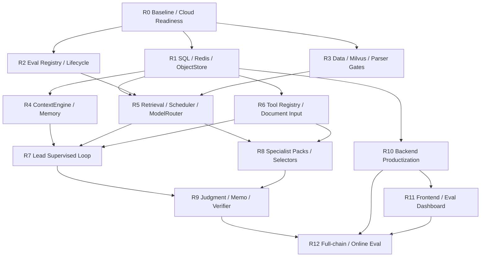

# 09-11 剩余工作全量拆分与完成合同

日期：2026-06-14

## 目的

本文不是新增一个方向文档，而是把 `09`、`10`、`11` 已经确定但尚未完全落地的内容合并成可执行、可验收、可追责的完成合同。后续如果某个问题没有解决，必须归入本文某个 `R` 项的失败门控；除非用户新增需求，不再用“09-11 里还有某块没做”作为模糊说法。

## 当前真实状态

上一轮完成的是 P0-P9 的运行桥接和部分 runtime gate：

- Java Task Gateway / Python bridge worker 已能跑通创建任务、队列、worker 执行、回写状态、Docker file/Redis 与 JDBC/Redis smoke。
- Workbench backend diagnostic case 已能触发当前 Python graph。
- Product surface / ClaimCard / diagnostic gate 做过针对性修复。
- 初版 SQL eval store、path registry、resource scheduler 已存在，但不是完整企业级运行底座。

这不等于 `09`、`10`、`11` 全部完成。完整完成必须通过本文 `R0-R12` 的所有门控。

## 2026-06-14 R0-R12 当前落地状态

本轮按本文 `R0-R12` 推进到 1-2 个真实 full-chain 激活 case 可验收状态。`scripts/runtime_bridge/run_r0_r11_readiness_gate.py` 继续作为 R0-R11 统一门控，R12 使用 Workbench 后端链路、Eval Store 和 Workbench artifact inspector 做真实 case 验收。最新本地报告：

- `reports/quality/r0_r11_readiness_local_milvus_bound/r0_r11_readiness_report.json`
- status: `pass`
- gate count: `13`
- failed gate count: `0`
- cloud gap count: `0`

已落地范围：

- R0：baseline / runtime path / cloud handoff registry 可生成；报告只记录环境变量名，不保存 key。
- R1：`run_audit_store` 扩展为 SQL 审计源，覆盖 run、node、artifact、retrieval、tool、evidence、ClaimCard、gap、gate、reflection、repair、model、resource、report、context、upload、parsed input 等表；新增 content-addressed object store ref。
- R2：Eval Store 扩展到 registry、case membership、eval run、node/metric result、failure/gold/annotation/judge/dashboard snapshot；R12 真实 case 已写入 case result、latency/cost metric、failure/quality queue、gold candidate 和 dashboard snapshot。
- R3：本地 data-processing / index asset / retrieval quality gates 已可执行；603 家 Milvus 已从云端 parquet export 重建到 Windows-native Milvus Lite，并通过 runtime path registry、`sec_milvus_semantic_search` 真实查询和 R3 parity/query smoke。该库只作为 typed semantic recall supplement，不作为 exact-value authority。
- R4：新增 `ContextEngine`，支持 resolve / select / compress / inject / write_memory，并带 memory 状态和 no-direct-fact-authority gate。
- R5：新增 retrieval quality audit、CUDA BGE queue / CPU spillover scheduler audit、agent coalescer 基础策略；本机 RTX 4060 Laptop GPU 已验证 bge-m3 CUDA 加载和 3-slot queue + CPU spillover。
- R6：新增 Tool Capability Registry、writer 工具权限 gate、文档输入解析到 provenance-gated artifact；多模态接口保留为 capability，不假装当前 DeepSeek 已支持。
- R7：新增 ResearchObjectiveContract、LeadReviewCheckpoint、TargetedRepairPlan，second pass 固定为 Lead 指定 targeted repair。2026-06-15 追加 scoped public web gap repair：`issuer_official` / `product_surface` / `local_filing` / `market_proxy` / `capital_ownership` / `supply_chain` 六类 gap classifier、allowlisted adapters、真实 web execution、context/ClaimCard/bounded-gap writeback 已通过 fixture/live smoke。
- R8：新增 role-specific evidence selector，按 fundamental、product/technology、market、capital/macro、risk 配额选择证据并输出 dropped taxonomy / cap reason。
- R9：新增 MemoLogicPlan 和 writer-no-new-facts validation，Memo Writer 只消费 verified inputs，不查 DB、不联网、不新增事实。
- R10：Java gateway 补齐 cancel/resume/SSE/worker callback；resume 会清空旧 memo/evidence/error 并重置 progress；Java -> queue -> Python worker -> callback smoke 覆盖 resume/SSE；R10 load smoke 覆盖 8 task / 3 worker / SSE / resume / run_audit / object store 压力，p95 约 2.1s。
- R11：Workbench 后端新增 eval dashboard endpoint，React 前端新增 EvalDashboardPanel，Vite React entry 可生产构建；artifact inspector 已识别 R12 vNext multi-case eval root，可从 eval root 下钻到 case score、memo、ClaimCards、typed gaps、gate matrix、run_audit、context memory、checkpoints 和 rendered answer。
- R12：已跑 2 个 diagnostic full-chain 激活 case，覆盖 AI infrastructure 和 healthcare product/regulatory gap，走 Java gateway -> Python worker -> Workbench eval -> Eval Store。首轮暴露 healthcare product revenue deterministic dimension 误归 fundamentals，已修复 `financial_metric:revenue + product_or_segment` 的产品/业务线维度绑定并重跑通过。

本轮验证：

- `python -m pytest tests/test_d_series_fact_selection.py tests/test_multi_agent_real_llm_chain_eval.py -q`：`32 passed`
- `python -m pytest tests/test_workbench_artifacts.py tests/test_workbench_backend.py::test_workbench_backend_lists_and_starts_controlled_eval_runner tests/test_workbench_backend.py::test_workbench_backend_starts_diagnostic_probe_eval_runner_without_strict -q`：`8 passed`
- `python scripts/runtime_bridge/run_r0_r11_readiness_gate.py --include-cloud-gates --output-dir reports/quality/r0_r11_readiness_local_milvus_bound`：`pass`
- `python scripts/runtime_bridge/run_r5_gpu_bge_scheduler_smoke.py --cuda-slots 3 --task-count 6 --device auto --run-model-smoke --require-cuda --output-dir reports/quality/r5_gpu_bge_scheduler_smoke`：`pass`
- `python scripts/runtime_bridge/run_r10_backend_load_sla_smoke.py --tasks 8 --workers 3 --audit-rows 24 --output-dir reports/quality/r10_backend_load_sla_smoke`：`pass`
- `python scripts/runtime_bridge/smoke_java_python_bridge.py --task-mode workbench_eval --eval-id agent_graph_vnext_diagnostic_probe --limit 2 --run-id r12_activation_diagnostic_probe_milvus_bound_20260614_r2 --bge-device cuda --worker-run-timeout-s 3600`：`SUCCESS`，Workbench summary `2/2 pass`
- `python scripts/runtime_bridge/run_r12_eval_runtime_loop_gate.py --workbench-summary reports/quality/workbench_eval/r12_activation_diagnostic_probe_milvus_bound_20260614_r2_agent_graph_vnext_diagnostic_probe.json --output-path reports/quality/r12_eval_runtime_loop_gate/r12_eval_runtime_loop_gate_report.json`：`pass`
- Workbench artifact inspection summary: `reports/quality/r12_workbench_trace_verification/r12_workbench_artifact_inspection_summary.json`，status `pass`
- R11 前端构建在上一轮已通过；本轮仅补 Workbench vNext eval artifact inspector 与相关后端/测试，未重跑 Vite build。

仍不属于本轮完成的部分：

- R12 只完成 1-2 个 full-chain 激活 case；12-case successor、10-20 case broader release gate 和最终 release readiness report 尚未执行。
- R5/R10 当前是本地高并发 smoke，不等于云端/生产级 SLA load test；后续仍需按真实 worker pool、provider latency、token/cost、DB/ObjectStore 写入压力和失败恢复做 broader gate。
- Milvus 已 runtime 可用，但仍只能作为 typed semantic recall supplement，不能作为 exact-value authority。
- R12 输出质量审计仍提示高 token 成本、Memo Writer/Verifier 成本高、product specialist visible rows 偏少；这些进入 eval failure/quality queue，作为下一轮质量/成本优化，而不是本轮 release gate 阻断项。

## 编号映射

| 完成项 | 覆盖旧文档 | 覆盖范围 |
| --- | --- | --- |
| R0 | 12 P0, 10 B0, 11 EV0 | 冻结 baseline、云端/本地资源清单、完成口径 |
| R1 | 10 B3/B7, 11 EV2, 12 P1/P2 | SQL / Redis / ObjectStore / artifact store 底座 |
| R2 | 11 EV1/EV5/EV6/EV7 | Eval Registry、Failure/Gold 生命周期、judge 审计 |
| R3 | 05, 10 storage boundary, 11 E0/E4 | Milvus、数据资产、chunk/table/parser/index 质量评测 |
| R4 | 10 B9/B10/B11, 11 E2 | ContextEngine、memory runtime、上下文注入审计 |
| R5 | 09 L6/L7, 11 E4 | retrieval/rerank/role-visible ledger、BGE 队列、ModelRouter |
| R6 | 09 L8/L9, 10 uploaded files, 11 E5/E10 | Tool Capability Registry、文档/多模态输入解析、工具权限 |
| R7 | 09 L1/L2/L3, 11 E3/E6 | Research Lead 常驻监督、LeadReviewCheckpoint、TargetedRepairPlan |
| R8 | 09 L4, 07/08 P/K, 11 E7 | specialist packs、role-specific selector、产品/市场/资本证据配额 |
| R9 | 09 L5, Fundamental/Judgment, 11 E8/E9/E10 | JudgmentState、MemoLogicPlan、Memo Writer、Verifier |
| R10 | 10 B1/B2/B4/B5/B6/B8 | Java/Spring 或 Java shell parity、worker pool、SSE、恢复、压测 |
| R11 | 10 F1, 11 dashboard | 前端/Workbench trace、report、eval dashboard |
| R12 | 11 E11/E12, 12 P10 | full-chain regression、online eval、release gate |

## 完成口径

`09-11` 只有在以下条件同时满足时才算完成：

1. `R0-R12` 每项都有代码、schema、文档、测试或明确 resource-blocked 记录。
2. 没有 runtime 依赖 per-run JSON fallback 绕过 SQL / Redis / object-store / eval gate；临时 JSON 只能作为 artifact mirror 或 debug export。
3. 每次 full-chain run 可追溯到 `run_id`、`case_id`、`node_execution`、`tool_call`、`model_call`、`evidence_row`、`claim_card`、`gap`、`gate_result`、`context_snapshot`、`data_snapshot_id`、`artifact_uri`。
4. Research Lead 不再只是首轮派单，而是在 checkpoint 后能审核是否满足原始研究目标，并发起 targeted repair 或暴露 bounded/commercial gap。
5. Memo Writer 只负责表达，不具备检索、数据库、联网事实生成权限。
6. Eval 不是临时脚本，而是有 registry、dataset version、node/chain metric、failure lifecycle、gold lifecycle、dashboard/replay 的系统。

## R0 Baseline Freeze / Cloud Readiness

目标：冻结当前 P0-P9 已完成状态，建立本地/云端资源边界，避免后续实施时混淆“已经有雏形”和“已经产品化”。

执行步骤：

1. 生成 `baseline_status_20260614`：记录 git commit、Python/Java/Docker 版本、当前 `.env` 变量名清单、D/Z 盘数据根、Milvus 云端状态、Workbench smoke 结果。
2. 建立 `runtime_path_registry` 的强制检查：脚本在启动时必须显示使用 D 盘代码根、Z 盘数据根、云端或本地 Milvus 连接模式，不能隐式拼路径。
3. 把 P0-P9 既有 smoke、diagnostic case、JDBC/Redis bridge、product surface gate 注册到 Eval Registry 的初始目录。
4. 写出 cloud handoff checklist：Milvus 连接参数、collection/schema、603家公司数据快照、GPU BGE 并发预算、需要云端跑的 full-chain/压测范围。

通过门控：

- 本地 `path registry + runtime bridge + current diagnostic case` 全部 pass。
- 生成一份资源清单，明确哪些项目本地可做、哪些必须等云端。
- 没有硬编码 D/Z/Milvus host；路径和连接都通过配置或 registry 解析。

云端依赖：

- 需要用户开云端后核对 Milvus collection 和 GPU profile，但 R0 的本地冻结部分不等云端。

## R1 Storage Foundation: SQL / Redis / ObjectStore

目标：把运行记录底座补成企业 agent 平台可用形态，避免再出现无法复现 full-chain、无法追溯节点输出的问题。

执行步骤：

1. 设计并落地 SQL migrations，至少覆盖：
   - `research_runs`
   - `node_executions`
   - `graph_checkpoints`
   - `artifact_refs`
   - `retrieval_tasks`
   - `tool_calls`
   - `model_calls`
   - `evidence_rows`
   - `claim_cards`
   - `gap_cards`
   - `gate_results`
   - `reflection_events`
   - `repair_tasks`
   - `reports`
   - `resource_usage`
   - `context_snapshots`
   - `eval_*` 外键占位
2. 增加 object-store abstraction：本地文件、MinIO、云端对象存储使用同一 `artifact_uri` 合同；大文本、原始文件、报告、trace export 不塞进 SQL 大字段。
3. Redis 只承担队列、状态缓存、SSE stream、semaphore、heartbeat、rate limit，不作为最终审计源。
4. 给 Workbench / Java Gateway / Python graph 统一写入 `run_id`、`case_id`、`node`、`input_digest`、`output_digest`、`code_commit`、`data_snapshot_id`、`artifact_uri`。
5. 建立 artifact-to-SQL parity test：同一 run 从 SQL 读出的 row/count/ref 必须与 graph artifacts 一致。

通过门控：

- 新 run 不依赖旧 per-run JSON 才能复盘核心审计链条。
- `run_audit_store` 可按 `run_id` 查到节点、模型调用、工具调用、证据、ClaimCard、gap、gate、artifact。
- Redis 清空后，已完成 run 的审计信息仍可从 SQL + object store 还原。
- 任一节点失败必须写入失败态、error digest 和可定位 artifact。

云端依赖：

- 不依赖云端。若本机 MySQL/Postgres/Docker 资源不足，必须先优化 migration、batch insert、索引和写入方式，再记录 resource-blocked。

## R2 Eval Registry / Dataset / Failure / Gold Lifecycle

目标：把 11 文档中的 eval 体系从文档变成长期运行系统，而不是每次临时加一个脚本。

执行步骤：

1. 建立 Eval Registry，收编当前 `docs/eval`、`scripts/eval`、`fixtures`、`eval_sets`、Workbench eval runner、G11/K8/P-series cases。
2. 给每个 eval pack 标注：
   - case family
   - dataset version
   - intended layer: E0-E12
   - command
   - required data snapshot
   - model/provider requirement
   - current / active_regression / diagnostic_only / superseded / deprecated
3. 落 SQL eval tables：
   - `eval_case_registry`
   - `eval_dataset_version`
   - `eval_case_membership`
   - `eval_run`
   - `eval_case_result`
   - `eval_node_result`
   - `eval_metric_result`
   - `eval_failure_event`
   - `eval_annotation`
   - `eval_gold_promotion`
   - `eval_judge_run`
4. 实现 failure lifecycle：`observed -> triaged -> root_caused -> regression_case_added -> fixed -> monitored -> retired`。
5. 实现 gold lifecycle：`candidate -> reviewed -> active_regression -> gold -> stale -> deprecated`。
6. LLM-as-judge 只做可审计 evaluator：保存 judge prompt digest、rubric version、judge model、input mapping、解释、latency、token/cost、人审抽样。

通过门控：

- 任一 eval run 都能写入 SQL，并能按 commit/model/data_snapshot/case_family 对比。
- 新发现 failure 必须能转为 regression case 或明确 retired/deprecated。
- 通过的优质 case 能进入 gold 候选，但必须带 criteria version 和人工/规则审核记录。
- 没有 eval pack 只存在散落命令或聊天记录里。

云端依赖：

- 初始 registry/SQL 本地可做；full-chain/large-case 结果等 R12 或云端资源。

## R3 Data / Index / Milvus / Parser Quality Gates

目标：补上以前没系统关注的召回、chunk、表格抽取、结构化抽取、Milvus parity 和数据资产质量评测。

执行步骤：

1. 接入云端 Milvus 最新 603 家公司 collection，读取 schema、collection stats、index params、vector dims、data snapshot id。
2. 做 Milvus parity：
   - 公司覆盖
   - filing/document coverage
   - chunk count
   - vector count
   - metadata completeness
   - embedding model/version
   - query smoke
3. 如果云端 collection 过旧或 schema 不符合当前 source/gate 合同，先生成 rebuild plan，不盲目覆盖。
4. 建立 E0 data asset eval：
   - chunk 是否截断关键表格/句子
   - table extractor 的行列保真
   - SEC/FSD/8-K/product/public-source parser 的字段正确率
   - source provenance / as-of / unit / period completeness
   - target-in-index ceiling
5. 建立 E4 retrieval/rerank eval：
   - target-in-candidates
   - BM25/ObjectBM25/BGE/Hybrid pre-rerank recall
   - post-rerank hit/precision
   - role-visible recall
   - dropped-row taxonomy
   - route budget cap audit

通过门控：

- Milvus 可用时，必须作为 typed semantic recall supplement 接入，不可作为 exact-value authority。
- Milvus 不可用时，必须写 `milvus_unavailable` gap 和 skipped observation，不允许 silent fallback。
- 每个 full-chain eval 都输出 retrieval budget audit 和 role-visible audit。
- parser/chunker/table eval 出现质量问题时，不能用下游 memo 或 LLM repair 掩盖。

云端依赖：

- Milvus 603 collection 需要用户开云端。
- 大规模 embedding/rebuild 和 GPU BGE 压测需要云端；小样本 parser/chunker eval 本地可做。

## R4 ContextEngine / Memory Runtime

目标：让上下文管理从隐式 prompt 拼接升级为可审计、可压缩、可回放、可失效的 ContextEngine。

执行步骤：

1. 实现 ContextEngine facade：
   - `resolve`
   - `select`
   - `compress`
   - `inject`
   - `write`
   - `consolidate`
   - `invalidate`
   - `retrieve`
2. 定义 context taxonomy：
   - user/session context
   - run objective context
   - source inventory context
   - role context
   - evidence context
   - claim/gap/gate context
   - research memory
   - report artifact context
3. 写入 SQL：
   - `context_snapshots`
   - `context_events`
   - `context_injection_plans`
   - `context_artifact_refs`
   - `research_memory_entries`
   - `memory_consolidation_jobs`
   - `prompt_packs`
4. 规定每个 agent 可见上下文：
   - Research Lead 可看 objective、inventory、capability、coverage、specialist summary、gaps、audit。
   - Specialist 只看 role bundle、role context、bounded evidence，不看其他 specialist private chain。
   - Memo Writer 只看 JudgmentState、MemoLogicPlan、verified ClaimCards、bounded gaps、report artifact refs。
5. memory state 机：
   - `candidate`
   - `reviewed`
   - `active`
   - `stale`
   - `superseded`
   - `revoked`
6. 加 memory-to-ledger drilldown parity：任何 memory 不能直接支持财务 claim，必须能钻回 claim/gap/derived metric/evidence/gate。

通过门控：

- 同一 run 可以重放 context injection plan。
- 任一 prompt 可解释“为什么注入这些上下文、为什么没注入另一些上下文”。
- 上下文压缩不能删除 source boundary、period、unit、citation、gap type。
- stale/superseded memory 不会进入新 run 的 active prompt。

云端依赖：

- 不依赖云端。若后续把 research memory 同步到 Milvus/graph DB，再在 R3/R12 扩展 parity。

## R5 Retrieval / Rerank / Resource Scheduler / ModelRouter

目标：修复检索预算和角色可见证据的问题，同时降低 token 和 GPU 资源浪费。

执行步骤：

1. 在 retrieval task 层写入：
   - source route
   - query variant
   - pre-rerank candidates
   - BGE candidates
   - post-rerank rows
   - role-visible rows
   - cap reason
   - dropped-row taxonomy
2. 实现 role-specific selector quotas：
   - Fundamental: financial statement, FSD, 10-K/10-Q tables, peer rows, derived metrics
   - Product/Technology: product spec, product KPI, product page, ordering/public buyer observer, patent/tech proxy
   - Market/Valuation: price/volume/event window/valuation proxy/market snapshot
   - Capital/Ownership/Macro: debt, credit, offering, 13F, insider, macro/vertical driver
   - Risk/Counter-thesis: risk factor, litigation/regulatory, source conflict, unsupported claim
3. 实现 BGE resource scheduler：
   - CUDA resident model semaphore
   - route priority
   - CPU spillover threshold
   - queue wait audit
   - cache hit audit
   - latency/device audit
4. 实现 ModelRouter：
   - exact/deterministic task 不调用强模型
   - schema validation/repair 用小模型或 deterministic parser
   - Research Lead / adjudication / final memo 使用高档模型
   - low-risk specialist 可合并或跳过
5. 实现 AgentCoalescer：
   - 对低复杂度或同 source family 的 specialist 合并调用
   - 对没有足够 evidence 的 specialist 不做空跑，改写 bounded gap

通过门控：

- Product rows 不再出现上游候选很多、specialist 只看到极少行而没有明确 cap reason 的情况。
- 每个 full-chain run 都有 retrieval recall/rerank/role-visible audit。
- GPU 忙时任务排队，不一开始全部 fallback CPU。
- Token/cost 按 agent/node/model/source 归因。

云端依赖：

- CUDA 并发和较大 BGE 压测需要云端；本地先实现 semaphore、queue、audit 和小样本验证。

## R6 Tool Capability Registry / Document & Multimodal Input Pipeline

目标：把工具调用能力从“查数/检索”扩展成企业场景可用的输入解析、分析 artifact、输出渲染、多模态预处理，并明确各 agent 权限。

执行步骤：

1. Tool Capability Registry 收录：
   - database query
   - SEC/FSD/public source retrieval
   - live web search/fetch/snapshot
   - PDF/DOCX/Excel/Markdown/PPT parser
   - image/video/audio preprocess
   - chart/table/knowledge graph/mind map generation
   - report renderer: PDF/DOCX/Excel/Markdown/PPT
2. 每个 tool 声明：
   - owner agent
   - allowed nodes
   - input schema
   - output artifact schema
   - source boundary
   - provenance requirement
   - audit fields
   - forbidden use
3. Document input pipeline：
   - upload -> checksum -> object store -> parser -> parsed artifact -> provenance -> optional evidence candidate -> gate
4. Multimodal pipeline：
   - image OCR/layout/vision caption
   - video keyframe/audio transcript
   - model provider abstraction，当前 DeepSeek 不支持多模态时保留可替换接口
5. Output artifact tools：
   - Memo Writer 只能调用 renderer，不调用事实检索。
   - Report generation 保存 artifact refs，并和 run/report/eval 绑定。

通过门控：

- 用户上传 PDF/DOCX/Excel 等文件可成为 provenance-gated `UserProvidedEvidencePack`，不是散落 prompt 文本。
- 工具调用都写 `tool_call` 和 artifact ref。
- live web rows 默认 context-only，必须经过 snapshot + parser + authority gate 才能进入 claim。
- 不允许伪装身份、绕过登录/资质、fake order 或违反网站访问规则。

云端依赖：

- 基础文档解析本地可做；大规模 OCR/video 或多模态模型可等云端/模型接口替换。

## R7 Research Lead Supervised Loop

目标：把 Research Lead 从“一次性派单”升级为 supervising analyst。

执行步骤：

1. 实现 `ResearchObjectiveContract`：
   - core question
   - required dimensions
   - minimum evidence requirements
   - source family plan
   - forbidden claims
   - mandatory second-pass triggers
   - memo intent
2. 实现 `LeadReviewCheckpoint` 同步 barrier，读取：
   - ResearchObjectiveContract
   - retrieval_plan
   - tool_call_ledger
   - retrieval_budget_audit
   - bounded_evidence_rows
   - FundamentalStatementPack
   - ProductSpecPack
   - CapitalMacroExposurePack
   - ClaimCards
   - GapLedger
   - source_capability_router
   - run_audit_store
3. Lead 对每个维度输出：
   - `sufficient`
   - `retrievable_gap`
   - `bounded_gap`
   - `commercial_gap`
   - `not_material`
4. 只有 `retrievable_gap` 触发 targeted repair。
5. 实现 `TargetedRepairPlan`：
   - DB/artifact/SEC/web route
   - specialist or lead tool
   - allowed/forbidden source
   - expected claim type
   - promotion gate
   - not-found gap
   - resource profile
6. Second pass 不再是泛化二次模型调用，而是 Lead 指定的 targeted repair + delta audit。

通过门控：

- Lead 必须回答“原始研究目标是否被回答、每个必答维度证据是否足够、缺口是哪类”。
- Targeted repair 找到的新证据必须通过 promotion gate 才能提权。
- 找不到时写 bounded/commercial gap，不允许弱 proxy 兜底。
- Lead checkpoint 的决策可通过 SQL/trace replay。

云端依赖：

- 不依赖云端；真实 full-chain 质量验证在 R12。

## R8 Specialist Packs / Role-Specific Evidence Selectors

目标：把专家 agent 升级成次级 agent，并让每个专家拿到适合本角色的证据、pack 和边界。

执行步骤：

1. Fundamental specialist：
   - `FundamentalStatementPack`
   - income statement / balance sheet / cash flow
   - peer comparison
   - industry focus metrics
   - derived ratios
   - accounting line-item change analysis
2. Product/Technology specialist：
   - `ProductSpecPack`
   - ProductModel / ProductSpec / ProductGenerationEdge
   - CompetitiveComparableEdge
   - ChannelOffer
   - FieldInquiryNote
   - public buyer observer boundary
3. Market/Valuation specialist：
   - market snapshot
   - event windows
   - valuation proxy
   - stock reaction vs company-disclosed facts
4. Capital/Ownership/Macro specialist：
   - `CapitalMacroExposurePack`
   - debt/credit/offering/13F/13D-G/Form 3/4/5/proxy
   - macro/vertical official object
   - company exposure bridge
5. Risk/Counter-thesis specialist：
   - risk factors
   - regulatory/litigation
   - source conflicts
   - unsupported core thesis detection
6. 每个 specialist 输出 gated ClaimCards + bounded gaps，而不是自由文本摘要。

通过门控：

- 每个 specialist 的输入证据都能解释 source authority、period、unit、product/segment binding 和 claim boundary。
- 产品/市场/资本不会因为证据弱就直接写强结论。
- Fundamental analysis 不再孤立看公司自身，而是常态化结合同行、行业、产品线和现金流/资本开支。
- Specialist outputs 能被 LeadReviewCheckpoint 和 JudgmentState 逐项消费。

云端依赖：

- 大规模 product/web/public source refresh 可等云端；pack schema、selector、quota、门控本地可做。

## R9 JudgmentState / MemoLogicPlan / Verifier

目标：把输出从证据拼贴升级为分析判断，但保持写作器没有事实发明权限。

执行步骤：

1. JudgmentState 作为 Memo Writer 前的确定性/审计对象：
   - dimension judgments
   - supported thesis
   - counter-thesis
   - confidence
   - evidence refs
   - gap refs
   - commercial boundary
2. MemoLogicPlan 由 Research Lead 或 adjudicator 生成：
   - report intent
   - opening answer
   - section order
   - dimension narrative
   - required citations
   - caveats and gap placement
   - what not to say
3. Memo Writer 输入只允许：
   - JudgmentState
   - MemoLogicPlan
   - verified ClaimCards
   - bounded gaps
   - report style config
4. Memo surface 要求：
   - 先给自然语言核心判断
   - 分维度解释原因
   - 每个关键判断带证据
   - 明确边界和缺口
   - 不把 driver 当清单逐条堆砌
   - 正文 citation 使用短引用，如 `[C1]`；原始 evidence refs 进入 evidence index / artifact，不直接打断正文
   - 不把 `business_mechanism`、`financial_bridge`、`counter_read`、`ClaimCard`、`gap_id` 这类内部字段名渲染成用户可见小标题
5. Verifier 检查：
   - unsupported claim
   - source-boundary misuse
   - numeric conflict
   - citation missing
   - gap hidden
   - commercial tracker claim misuse

通过门控：

- Memo 中每个强判断都能回到 ClaimCard / JudgmentState / gate。
- Memo Writer 没有检索、DB、web 工具权限。
- Verifier 发现核心 thesis unsupported 时必须退回 Lead/Judgment，而不是让 writer 自修事实。
- 输出风格达到“自然语言 + 证据分点 + 总结 + 建议/边界”的项目标准。
- Eval surface readability gate 通过：无 raw artifact ref、无 `机制/财务桥` 内部字段 dump、无 pipe-joined schema 拼接、语言与用户请求匹配。

云端依赖：

- 不依赖云端；真实质量验证依赖 R12 的 full-chain cases 和模型预算。

## R10 Backend Productization / Java-Spring Parity / Worker Runtime

目标：把当前 Java shell + Python bridge 升级到真实产品后端路径，保持 Python agent 能被 Java/前端稳定调用。

执行步骤：

1. 明确 B0 选择：不是 FastAPI vs Java 二选一，而是 Java API gateway + Python worker 通路必须真实可用；Spring Boot 可分阶段替换 JDK-only shell。
2. API：
   - `POST /api/research/tasks`
   - `GET /api/research/tasks/{task_id}`
   - `GET /api/research/tasks/{task_id}/events`
   - `POST /api/research/tasks/{task_id}/cancel`
   - `POST /api/research/tasks/{task_id}/resume`
3. Run Manager：
   - create
   - inspect
   - progress
   - event replay
   - report
   - cancel
   - resume
4. Worker pool：
   - Redis/MQ queue
   - concurrency limit
   - heartbeat
   - stuck-run recovery
   - retry/backoff
   - timeout
   - idempotency key
5. Backend DB 对齐 R1。
6. Docker Compose：
   - Java API
   - Python worker
   - DB
   - Redis
   - optional MinIO
   - optional Milvus/local connector
7. Load/SLA tests：
   - exact value
   - focused memo
   - deep research
   - batch graph jobs
   - p95 latency
   - queue wait
   - success rate
   - error rate
   - token cost
   - BGE/LLM concurrency

通过门控：

- 前端或 curl 通过 Java API 发起任务，Python worker 执行 LangGraph，结果回写 SQL，前端轮询/SSE 能看到状态和最终 memo。
- kill worker 后 run 能进入 recoverable/failed/cancelled，而不是卡死。
- Redis 清空不丢审计；DB/object store 可恢复完成状态。
- load test 失败要指出瓶颈：DB、Redis、worker、LLM、BGE、I/O、token，而不是只给总失败。

云端依赖：

- 本地可以完成功能和小压测；较高并发/GPU scheduler 压测等云端。

## R11 Frontend / Workbench Trace / Eval Dashboard

目标：让用户能看见和审计 agent 运行，而不只是在终端或 JSON 里翻结果。

执行步骤：

1. Run list：
   - status
   - case/query
   - model/provider
   - cost/latency
   - data snapshot
2. Run detail：
   - event timeline
   - graph nodes
   - node inputs/outputs digest
   - model/tool calls
   - artifacts
3. Evidence viewer：
   - evidence rows
   - source authority
   - citation
   - period/unit
   - source boundary
4. ClaimCard viewer：
   - supported/contradicted/unsupported
   - evidence refs
   - gate status
5. Gap viewer：
   - retrievable/bounded/commercial/parser/conflict/source-boundary
   - repair attempts
6. Context viewer：
   - context snapshots
   - injection plans
   - memory state
7. Report viewer/export：
   - Markdown/PDF/DOCX/Excel refs
8. Eval dashboard：
   - eval run list
   - case result
   - node metrics
   - retrieval audit
   - failure queue
   - gold queue
   - latency/cost trends
   - compare by commit/model/data snapshot

通过门控：

- 一个 full-chain run 可以从前端定位到：为什么这么答、用了什么证据、哪里缺口、哪个节点失败或修复。
- Eval dashboard 能回答“这次比上次差在哪里”，而不是只显示 pass/fail。
- 报告导出 artifact 与 run/report/eval 绑定。

云端依赖：

- 不依赖云端；如果需要浏览器/容器资源，先本地小样本验证。

## R12 Full-chain Regression / Online Eval / Release Gate

目标：在 R1-R11 完成后跑完整链路验收，形成可上线状态。

执行步骤：

1. 先跑 1-2 个全链路激活 case：
   - 必须覆盖 Lead supervised loop
   - retrieval/rerank audit
   - specialist packs
   - targeted repair
   - JudgmentState
   - MemoLogicPlan
   - verifier
   - backend SQL/Redis/object store
   - frontend trace
   - eval store
2. 修复根因，不用 fallback 遮盖。
3. 再跑 12-case G11 successor：
   - exact
   - focused
   - standard
   - deep research
   - product/public/web
   - capital/macro
   - multi-turn
   - document upload
   - Milvus available/unavailable boundary
4. 再跑 10-20 case broader gate：
   - 半导体/AI infra
   - consumer electronics
   - SaaS
   - bank/financials
   - energy/utilities
   - pharma/medtech
   - auto
   - retail/CPG
5. Online eval skeleton：
   - production run sampling
   - user feedback hook
   - failure-to-regression workflow
   - gold promotion workflow
   - cost/latency monitor
6. 生成 release readiness report。

通过门控：

- Full-chain pass 不是只看最终 memo，而是 `E0-E12` 分层指标全过或明确 bounded/commercial/resource gap。
- 任一失败都进入 failure lifecycle。
- 任一优质输出可以被提名 gold，但必须带审核记录。
- Release report 包含剩余 commercial/data-provider 缺口和资源缺口，不混作代码未完成。

云端依赖：

- 建议等云端 Milvus/GPU 打开后执行完整 12case 和 10-20case；本地先跑 1-2 case 诊断。

## 并行与依赖关系

可并行：

- R1 与 R2 可并行启动。
- R3 的本地 parser/chunker eval 可与云端 Milvus 核对并行。
- R6 的文档输入和工具权限可与 R4/R5 并行。
- R10 后端 productization 可在 R7-R9 之前启动，但不能在 R1 audit store 未完成时宣称闭环。
- R11 前端可先做 mock/API contract，再接真实后端。

严格依赖：

- R7 依赖 R4/R5/R6 的至少最小可用合同。
- R9 依赖 R7/R8 输出 JudgmentState/MemoLogicPlan/ClaimCards。
- R12 必须等 R1-R11 至少达到各自 gate 后才算 release-grade full-chain。

## 云端打开后第一批动作

1. 只读核对云端 Milvus：collection、schema、row/vector count、metadata、index params、embedding version、603 家覆盖。
2. 生成 Milvus parity report；若不匹配当前 schema，先给 rebuild/backfill plan，不直接覆盖。
3. 核对 GPU BGE 并发：常驻模型数、queue wait、CPU spillover 阈值、cache 命中。
4. 跑 R3 小样本 Milvus query smoke。
5. 跑 R5 scheduler smoke。
6. 再决定是否进入 R12 的 1-2 个 full-chain 激活 case。

## 禁止做法

- 不因为脚本慢就默认降级到最小数据库、最小 eval 或 JSON fallback；先优化算法、批处理、索引、并发和资源调度。
- 不用 live web / public proxy 直接支撑销售、份额、订单、处方量、POS sell-through 等强 claim。
- 不让 Memo Writer 自己查 DB、联网、补事实。
- 不让 Milvus 变成 exact-value authority。
- 不让 Redis 成为最终审计源。
- 不把失败 case 留在聊天记录里；必须进 failure lifecycle。
- 不把 commercial gap 堆成垃圾堆；公开/免费/可得路径找不到后，明确记录 source tried、boundary、not-found gap 和商业数据需求。

## 下一步执行顺序

在用户开云端前，本地优先做：

1. R0 baseline freeze。
2. R1 SQL/ObjectStore/Redis audit foundation。
3. R2 Eval Registry + lifecycle skeleton。
4. R4 ContextEngine 最小可用。
5. R6 Tool registry + document input parser skeleton。
6. R10 Java API / Python worker 与 R1 audit store 对齐。

用户开云端后立即做：

1. R3 Milvus parity。
2. R5 CUDA BGE queue / scheduler smoke。
3. R12 1-2 个 full-chain 激活 case。

之后推进：

1. R7 Lead supervised loop。
2. R8 specialist packs / selectors。
3. R9 Judgment / Memo / Verifier。
4. R11 frontend trace/eval dashboard。
5. R12 12case + 10-20case + release readiness。
