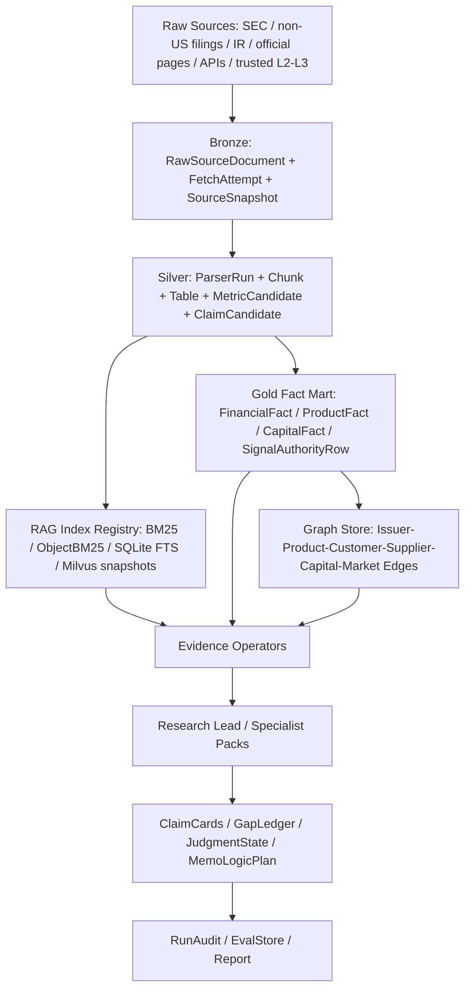

# 24. 原始披露到 RAG / 数据库全链路复盘与数据底座规划

更新时间：2026-06-26

## 目的

本文接在 23 文档之后，专门从数据底座视角复盘：

```text
原始 SEC / 非美市场披露
 -> 下载与原始文件湖
 -> chunk / table / metric / claim 解析
 -> structured fact / source-role runtime rows
 -> BM25 / ObjectBM25 / SQLite FTS / Milvus 召回层
 -> SQL / ObjectStore / run audit / eval / graph 数据库层
 -> Research Lead / specialist / Memo Writer 可消费对象
```

这不是重新定义 source authority，而是把 23 已定义的 source roles、authority gate 和信号提权规则接回到“数据到底从哪里来、怎么被解析、怎么被索引、怎么进入数据库和图谱、怎么被 agent 正确消费”的主链路。

## 当前事实快照

以下数字来自当前本地仓库和 `data/manifests` / runtime config 的审计，目的是确认数据底座现状，不作为新的质量结论。

| 层 | 当前状态 | 关键证据 |
| --- | --- | --- |
| Raw disclosure lake | `data/raw_private` 约 12.9GB，包含 `sec`、`sec_filings`、`sec_8k_earnings`、`sec_tier1_sp500_annual`、`sec_tier2_supply_chain_annual`、`structured_financial_facts`、`global_public_disclosures`、`company_ir` 等入口 | 本地目录审计 |
| SEC 全源配置 | tier1/tier2 SEC full-source config 覆盖 588 家；含 10-K/10-Q/8-K/6-K 路线 | `tier1_tier2_sec_full_source_download_config_summary_v0_1.json` |
| SEC structured facts | CompanyFacts/submissions 已下载 588 家；financial fact rows `2,790,261`，submission rows `6,605`；10-K/10-Q/20-F/40-F 均有覆盖 | `sec_structured_facts_download_summary_v0_1.json` |
| SEC structured runtime facts | 财报一级/二级重点科目 runtime rows `10,146`，覆盖 `587/603`；包含 revenue、assets、liabilities、cash、CFO、capex proxy、inventory、AR/AP、deferred revenue、short-term debt 等 | `sec_financial_statement_metric_runtime_summary_v0_1.json` |
| Tier2 SEC staging assets | 77 家、226 条 filing records，30,600 chunks / evidence rows，48,977 tables，421,828 metrics，240,694 claims，711,499 SQLite FTS records；chunk quality pass | `tier2_supply_chain_sec_annual_staging_assets_summary_v0_2.json` |
| 非美披露 | 任务层覆盖 15 家 / 69 tasks；DART 已下载清洗 18 份；JP IR fallback 后下载 8 份；HKEX/TW/JP 多数仍有 no matching document candidate 或 fallback 问题 | `tier2_global_public_disclosure_*_summary_v0_1.json` |
| 非美 L1 财报 facts | 非美 consolidated financial statement exact rows `88`，覆盖 `16/16` target tickers | `non_us_l1_financial_statement_metric_runtime_summary_v0_1.json` |
| 非美 product KPI local disclosure | runtime rows `70`，覆盖 `11/15` target tickers；剩余主要是 geography-only、percentage/mix-only、无 exact product table、stale document | `non_us_product_kpi_local_disclosure_runtime_summary_v0_1.json` |
| Processed chunks / evidence / objects | chunks 约 2.26GB；evidence objects 约 1.44GB；structured objects 约 8.68GB | 本地目录审计 |
| Lexical / object retrieval | BM25 / ObjectBM25 index 约 13.6GB；对象检索支持 pickle / slim records / DuckDB / SQLite FTS 多路径 | `data/indexes/bm25`、`tests/test_bm25_retriever.py` |
| Milvus semantic supplement | 本地 Milvus Lite `available`，collection `fin_ab_20260614...`，`662,908` vectors，`581` indexed tickers，vector kinds 包括 narrative/table/paraphrase/relationship context；只允许 semantic recall supplement | `configs/runtime/milvus_runtime_603_local_v0_1.json` |
| Source authority mart | `7,181` rows；L1 `4,107`、L2 `2,092`、L3 `562`；exact company fact authority `2,925`，bounded thesis driver authority `4,256` | `r18_source_authority_data_mart_summary_v0_1.json` |
| Product / customer / relationship graph | ProductProfile `603/603`；Product/Business-KPI `443/603`；CustomerDeployment `531/603`；ProductRelationshipGraph `8,187` nodes / `25,251` edges / `741` parser-backed relationship edges | `second_third_layer_depth_parity_summary_v0_1.json`、`product_relationship_graph_summary_v0_1.json` |
| Runtime audit DB | `run_audit_store` 已有 SQLite schema，覆盖 run、node、artifact、retrieval、tool、evidence、claim、gap、gate、reflection、repair、model、resource、report、context、uploaded/parsed input 等表 | `src/sec_agent/run_audit_store.py` |
| D-series governance DB | `d_series_database_store` 已有 D1-D11 governance schema/backfill/parity/reader，覆盖 claim/gap/gate、entity master、raw source provenance、as-of vintage、reconciliation、metric/product ontology、source capability、derived metrics、analyst memory | `src/sec_agent/d_series_database_store.py` |
| Path / object store | runtime path registry 已支持 D/Z 多根、ObjectStore root、Workbench private root、Milvus local/cloud config；ObjectStore 已有 content-addressed local/MinIO-compatible ref | `src/sec_agent/runtime_bridge/paths.py`、`object_store.py` |

## 当前链路整理

### 1. 原始披露入口

当前原始披露入口分三类：

- SEC 原文披露：10-K、10-Q、8-K、20-F、40-F、6-K、annual / interim / earnings routes，主体在 `data/raw_private/sec*` 与 `scripts/data_sec/*`。
- SEC 结构化接口：CompanyFacts、Submissions、Financial Statement Data Sets、capital-market submission metadata，主体在 `data/raw_private/structured_financial_facts`、`data/staging/structured_financial_facts` 和 `scripts/data_expansion/build_sec_*`。
- 非美与公司 IR：DART、HKEX/CNINFO、TW MOPS、JP EDINET / company IR fallback、EU regulated annual report 等，主体在 `data/raw_private/global_public_disclosures`、`company_ir` 和 `tier2_global_public_disclosure_*` manifests。

当前 SEC 原文 + structured facts 的覆盖强度明显高于非美 disclosure。非美已具备 parser-backed rows，但下载、locator、IR fallback、PDF 表格解析和 local exchange route 仍没有达到 SEC 这条线的稳定程度。

### 2. 解析与结构化层

现有解析产物已经分成：

- narrative chunks：给 BM25 / Milvus / Memo 引用使用。
- table chunks / tables：给 table parser、metric extraction、ObjectBM25 使用。
- metric candidates：value / unit / period / concept / table / citation 级候选。
- claim candidates：句子和段落级业务/风险/管理层表述。
- runtime exact rows：SEC financial statements、non-US L1 financial facts、product/business KPI、industry operating metrics、capital/funding/ownership、source authority rows。

问题不在于“完全没有结构化”，而在于这些层目前主要靠大量 JSONL/summary 串起来，统一的 `raw_document_id -> parser_run_id -> parsed_object_id -> runtime_row_id -> evidence_id -> claim_id` 血缘主键还不够强。

### 3. RAG / 检索层

当前检索层有四种口径：

- BM25：主 lexical recall。
- ObjectBM25：结构化对象、表格、exact-value 候选 recall。
- SQLite FTS / DuckDB record store：大规模记录快速过滤和低内存读取。
- Milvus：typed semantic recall supplement，尤其用于 paraphrase、relationship、hard-to-keyword filing text。

边界已经明确：Milvus 不承担 exact-value authority；BM25/Milvus 命中也只是找到候选证据，不能绕过 parser/verifier/authority gate。

当前缺口是检索 index registry 与 source provenance 尚未成为统一主账本。一个 RAG hit 应该能稳定显示：

```text
retrieval_index_snapshot_id
 -> record_id / vector_id
 -> parsed_object_id
 -> parser_run_id
 -> raw_document_id / source_snapshot_id
 -> authority row / forbidden claim boundary
```

现在这些信息部分存在，但分散在 index 目录、JSONL、manifest summary、run audit artifact 和 source authority mart。

### 4. 数据库 / 存储层

当前数据库能力分两条线：

- run-time audit：`run_audit_store` 记录一次 agent run 内发生了什么。
- governance materialization：`d_series_database_store` 把 D1-D11 的 artifacts 回填为 SQLite 表，并提供 reader。

这两条线解决了“某次 run 能否复盘”和“治理 artifact 是否可 SQL 化”的问题，但还没有完全解决“600+ 公司长期可用的研究数据仓库”问题。

换句话说，当前 `data/manifests/*.jsonl` 仍承担了大量事实主表职责。下一阶段不应继续让所有新数据只堆在 manifests 里，而应建立长期数据账本：

- raw source / fetch / parser run ledger。
- structured fact mart。
- source authority mart。
- product / capital / ownership / market / macro graph tables。
- retrieval index snapshot registry。
- eval / data quality / release gate tables。

### 5. Agent 可消费层

当前 graph 已经可以消费：

- `FundamentalStatementPack` / `FundamentalPeerStatementPanel`。
- `product_evidence_rows`、`public_source_context_rows`。
- `source_capability_router`、`source_authority_coverage`。
- `claim_evidence_ledger`、`typed_gap_ledger`。
- `relationship_graph_observation`。
- `JudgmentState`、`MemoLogicPlan`。

但 source matrix、exact-slot coverage、product graph、non-US rows、capital/funding rows、RAG index lineage 并未全部以“一个 Research Lead 可以稳定规划和追问”的统一 contract 注入。结果是：数据存在，但 agent 在 full-chain 中不一定知道应该怎么查、查到的 row 属于什么层级、能支撑什么结论、缺口到底是公开源边界还是 parser/route debt。

## 核心问题判断

### 问题一：数据不少，但主账本仍分散

当前最强的数据面来自 SEC 原文、SEC structured facts、financial statement runtime rows、source authority mart、product profile/spec/KPI rows、capital/ownership context rows 和 Milvus/BM25 indexes。它们已经能支撑较强的事实底稿。

但数据主账本分散在：

- `data/raw_private`
- `data/staging`
- `data/processed_private`
- `data/indexes`
- `data/manifests`
- `data/workbench_private`
- `Z:/FIN_Insight_Agent_artifacts`
- run artifact 输出目录

下一步必须把“文件在哪里”和“数据库里怎么查”统一，否则继续扩数据会变成一堆难以审计的 JSONL 和临时输出。

### 问题二：SEC 链路强，非美披露和 IR/PDF 表格链路弱

SEC structured facts + SEC 原文解析已经有比较完整的 raw -> parsed -> index -> runtime rows。非美 disclosure 目前有突破，但仍有这些弱点：

- local exchange / IR locator 不稳定。
- PDF annual report 表格 parser 不够统一。
- 语言、币种、会计准则、表格布局差异导致 value/unit/period/product binding 难度高。
- 非美 product KPI 仍有 4/15 target tickers uncovered，且更多非美扩容公司还没有达到 SEC 同等处理强度。

因此非美不能只靠“公司 IR fallback 搜到了 PDF”算完成，必须进入统一 raw source provenance + parser run ledger + local disclosure fact mart。

### 问题三：RAG 索引不是事实库

BM25、ObjectBM25、SQLite FTS、Milvus 都应该服务于 recall，而不是成为事实主库。事实主库必须是 structured rows / authority rows / graph edges。

RAG 的目标应该是：

```text
先用数据库/图谱确定查什么
 -> 再用 BM25/ObjectBM25/Milvus 找原文上下文和补证据
 -> 命中结果回到 parser/verifier/authority gate
 -> 最终进入 ClaimCard / GapLedger
```

不是：

```text
把一切页面塞进向量库
 -> 让模型从 chunk 里自由判断
```

### 问题四：产品、客户部署、资本图谱已有原料，但缺统一图谱数据库

当前 ProductRelationshipGraph 已经有 8,187 nodes / 25,251 edges，ProductProfile 也达到 603/603。但下一步要让它真正支持深度投研，需要把以下对象从“manifest 文件”升级为长期图谱对象：

- Issuer / Security / Segment。
- ProductFamily / ProductSlot / SKU / Spec / Generation。
- Customer / Supplier / Channel / Platform / Project。
- Deployment / Order / Tender / Contract / Config availability。
- Competitive / Substitute / Complement / Upstream / Downstream edges。
- DebtInstrument / CreditFacility / Ownership / Insider / Offering / LiquidityDriver。
- EvidenceSupportEdge：每条边由哪些 raw source / parser row / authority row 支撑。

CustomerDeployment 不应独立在产品图之外；它应是 `Product/Issuer -> Customer/Counterparty/Platform` 的核心边。

### 问题五：未来数据库不能只补 run audit

run audit 已能解决“这次 agent 做了什么”。但数据基座还需要解决：

- 这个公司有哪些披露文件？
- 每个披露文件解析出哪些表、科目、产品、客户、资本事件？
- 哪些 row 能提权，哪些只能做 context / lead / gap？
- 哪些 row 已进入 RAG index / Milvus collection？
- 某个结论从 memo 追溯到哪条 DB row、哪个 parser run、哪个 raw file？
- 数据更新后，哪些 ClaimCard / eval case / graph edge 需要重跑？

因此后续数据库要从 run audit 扩到 data warehouse + graph + retrieval registry。

## 目标数据架构



## 目标表与对象

### Bronze：原始披露与来源账本

| 对象 | 作用 |
| --- | --- |
| `raw_source_document` | 原始文件或网页快照；记录 issuer、source_role、source_url/raw_path、checksum、as_of、fetched_at、document_type、form_type、period |
| `raw_fetch_attempt` | 记录 locator/fetcher 的每次尝试、HTTP status、download status、blocked/not found/retry reason |
| `source_snapshot` | 对网页/API/IR 页面保存可复跑快照，避免只保存 URL |
| `source_license_policy` | robots / rate limit / terms / no-store / citation policy |
| `source_route_registry_snapshot` | 某次数据构建用的 route contract 和 parser version |

### Silver：解析与候选对象

| 对象 | 作用 |
| --- | --- |
| `parser_run` | parser/chunker/table extractor 的版本、输入、输出、错误、耗时、row counts |
| `parsed_chunk` | narrative / table / section chunks，带 section、form、period、source offsets |
| `parsed_table` | 表格结构、header、row/column/cell、页码或 HTML locator |
| `metric_candidate` | value/unit/period/entity/product/segment/citation 候选，不保证可提权 |
| `claim_candidate` | 句子/段落关系候选，不保证可提权 |
| `parser_rejection` | 不能提权的原因，如 region-only、percentage-only、period mismatch、sentence relation weak |

### Gold：研究事实与信号主表

| 对象 | 作用 |
| --- | --- |
| `financial_statement_fact` | SEC/non-US 三大表和重点科目 exact fact |
| `fundamental_peer_metric` | 同行业/可比公司同口径财务分析输入 |
| `product_profile_slot` | 公司披露或官方产品页支持的产品/业务槽位 |
| `product_spec_fact` | 产品参数、架构、代际、benchmark，technical authority |
| `product_kpi_fact` | 公司披露的 product/category/product-line KPI exact rows |
| `industry_operating_metric_fact` | AUM、ARR、capacity、MW、contracts、subscribers、volume 等行业 KPI exact rows |
| `customer_deployment_event` | 官方客户/订单/部署/项目/OEM/config availability 事件 |
| `supply_chain_relationship_fact` | 官方供应链/客户/上下游关系 |
| `capital_market_event` | offering、13D/G、Form 3/4/5、proxy、buyback、debt/credit event |
| `ownership_context` | 13F/N-PORT/holder/insider 滞后持仓或事件 context |
| `market_liquidity_snapshot` | price/volume/short interest/rates/credit spread/factor flow 等资金面 |
| `macro_industry_driver` | FRED/EIA/FDIC/BLS/BEA/Census/协会/监管指标 |
| `source_authority_row` | 每条 fact/signal 的 authority、allowed_claim_types、forbidden_claim_types |

### Graph：关系图谱

| 节点 / 边 | 作用 |
| --- | --- |
| `issuer -> product_family -> product_slot` | 公司产品和业务槽位 |
| `product_slot -> spec / architecture / generation` | 产品参数、代际、架构演进 |
| `product_slot -> competes_with / substitutes / complements` | 竞品、替代、互补关系 |
| `issuer/product -> customer/deployment/channel/platform` | 客户部署、订单、渠道、配置可得性 |
| `supplier -> component -> issuer/product` | 供应链上下游 |
| `issuer -> segment -> financial/product KPI` | 产品/业务线与财务桥接 |
| `issuer -> debt/credit/offering/ownership/liquidity` | 投融资、资本结构、持仓和市场资金面 |
| `edge -> evidence_support` | 每条边的 raw source、parser row、authority row、citation |

### Retrieval Registry：索引账本

| 对象 | 作用 |
| --- | --- |
| `retrieval_corpus_snapshot` | 本次索引使用哪些 chunk/object/runtime rows |
| `retrieval_index_snapshot` | BM25/ObjectBM25/SQLite FTS 的路径、record count、build version、checksum |
| `vector_collection_snapshot` | Milvus collection、embedding model、dim、vector count、source tiers、claim boundary |
| `retrieval_record_lineage` | record_id/vector_id -> parsed_object_id/runtime_row_id/raw_document_id |
| `retrieval_eval_result` | target-in-candidates、pre/post-rerank、role-visible rows、dropped reason |

## 2026-06-27 RD0 落地状态

RD0 已落地为机器可读 inventory 生成器：

- 模块：`src/sec_agent/raw_disclosure_data_inventory.py`
- 脚本：`scripts/data_expansion/build_raw_disclosure_rag_database_inventory.py`
- 原始披露 / 数据资产 inventory：`data/manifests/raw_disclosure_data_inventory_v0_1.jsonl`
- RAG index inventory：`data/manifests/rag_index_inventory_v0_1.jsonl`
- runtime database inventory：`data/manifests/runtime_database_inventory_v0_1.jsonl`
- summary：`data/manifests/raw_disclosure_rag_database_inventory_summary_v0_1.json`
- 报告：`docs/internal/vnext_20260610/rd0_raw_disclosure_rag_database_inventory.zh-CN.md`

最新生成结果：

| 指标 | 数值 |
| --- | ---: |
| raw disclosure inventory rows | `31` |
| RAG index inventory rows | `19` |
| runtime database inventory rows | `11` |
| RAG records total | `6,386,029` |
| database table count total | `18` |
| missing required path count | `0` |
| missing optional configured path count | `1` |

解释：

- `missing_optional_configured_path_count=1` 是 `data/object_store`，当前标记为 `configured_root_may_be_empty`，不构成 RD0 阻断；后续 RD1/RD3 做 ObjectStore/Gold Mart 接入时再决定是否创建本地目录或改为 MinIO。
- RD0 inventory 不提权任何数据，只记录资产存在、规模、schema hint、主键、lineage status 和 authority boundary。
- RD0 仍是 inventory freeze，不代表 raw source provenance / parser run ledger / graph DB 已完成；这些进入 RD1-RD5。

## 2026-06-27 RD1 落地状态

RD1 已落地为 Bronze Raw Source Provenance Store：

- 模块：`src/sec_agent/raw_source_provenance_store.py`
- 脚本：`scripts/data_expansion/build_raw_source_provenance_store.py`
- raw source document ledger：`data/manifests/raw_source_documents_v0_1.jsonl`
- fetch attempt ledger：`data/manifests/raw_fetch_attempts_v0_1.jsonl`
- source snapshot ledger：`data/manifests/source_snapshots_v0_1.jsonl`
- runtime row source lineage：`data/manifests/runtime_row_source_lineage_v0_1.jsonl`
- summary：`data/manifests/raw_source_provenance_summary_v0_1.json`
- 报告：`docs/internal/vnext_20260610/rd1_raw_source_provenance_store.zh-CN.md`

最新生成结果：

| 指标 | 数值 |
| --- | ---: |
| raw source documents | `27,720` |
| fetch attempts | `34,580` |
| source snapshots | `27,720` |
| runtime row lineage rows | `71,004` |
| runtime manifests covered | `43` |
| exact-authority lineage rows | `27,881` |
| exact-authority unresolved rows | `0` |
| unresolved runtime lineage rows | `0` |
| URL-only context lineage rows | `35,587` |

解释：

- RD1 把 raw metadata、raw files、runtime-declared URLs、source-route attempts 和 runtime-ready rows 统一进 `raw_source_document / raw_fetch_attempt / source_snapshot / runtime_row_source_lineage` 四类账本。
- `matched_raw_document=34,929`，`matched_derived_structured_source_document=386`，`runtime_declared_source_document=35,689`。
- 首次真实构建暴露 `capital_funding_ownership_context_rows_v0_1` 中 `386` 条 SEC `sec_financial_statement_data_sets` 派生 CapitalStructure rows 缺少 `source_url/raw_path`。本轮没有降级跳过，而是新增严格 resolver：按 `source_id + ticker` 回连本地 SEC CompanyFacts raw API response，最终 exact-authority unresolved 降为 `0`。
- 后续复核发现上一次 RD1 全量重建曾在写完 `raw_source_documents` 后超时，导致 documents 与 lineage/summary 时间戳不一致。本轮新增 `sec_companyfacts_by_ticker:<ticker>` 持久 external key，并用 existing-documents lineage repair 重新生成 lineage/summary；`companyfacts_external_key_document_count=588`，RD1 summary 重新回到 `pass`。
- `url_only_no_local_snapshot=19,966` 说明大量 L2/L3 bounded context rows 当前能追到 URL，但没有本地可回放快照；这不是 exact-authority 阻断，但 RD2/RD5/RD7 需要继续把重要 URL-only source 纳入 fetch/cache/replay gate。
- RD1 不新增事实提权；URL-only rows 只能保持原 authority boundary，不得因为进入 provenance ledger 而升级为 exact evidence。

## 2026-06-27 RD2 落地状态

RD2 已落地为 Silver Parser / Chunk / Table / Metric Ledger：

- 模块：`src/sec_agent/parser_quality_ledger.py`
- 脚本：`scripts/data_expansion/build_parser_quality_ledger.py`
- parser run ledger：`data/manifests/parser_run_ledger_v0_1.jsonl`
- parser output artifact ledger：`data/manifests/parser_output_artifact_ledger_v0_1.jsonl`
- parser rejection taxonomy：`data/manifests/parser_rejection_taxonomy_v0_1.jsonl`
- summary：`data/manifests/parser_quality_summary_v0_1.json`
- 报告：`docs/internal/vnext_20260610/rd2_parser_chunk_table_metric_ledger.zh-CN.md`

最新生成结果：

| 指标 | 数值 |
| --- | ---: |
| status | `pass_with_recorded_rejections` |
| parser runs | `52` |
| parser output artifacts | `217` |
| rejection taxonomy rows | `38` |
| missing declared outputs | `0` |
| declared chunks | `161,455` |
| declared tables | `374,536` |
| declared metric candidates | `7,974,456` |
| declared claim candidates | `2,459,906` |
| declared runtime rows | `19,715` |
| declared context rows | `6,556` |
| recorded rejections | `30,557` |

解释：

- RD2 把 chunk build、structured object extraction、financial statement runtime parser、Product-KPI runtime parser、industry operating metric parser、customer/product/market/source context parser 的 summary 与 rowset 统一登记成 `parser_run / parser_output_artifact / parser_rejection_taxonomy` 三类账本。
- 真实构建中暴露两个工程问题并已修复：一是历史 download/smoke/source-plan summary 被误纳入 parser ledger；二是旧云端 summary 中 `/root/autodl-tmp/FIN_Insight_Agent/...` 绝对路径在本地需要重定位到当前 repo。修复后 missing declared output 为 `0`。
- `pass_with_recorded_rejections` 不是放宽门槛，而是表示 parser accepted outputs 完整、同时把 rejection reason 入账；rejection rows 仍只能作为质量/缺口审计，不能进入 accepted evidence。
- GB 级 JSONL rowset 以 summary 声明 row count 为准，不为 ledger 重扫全量文件；需要逐行质量审计时另起 targeted audit。

## 2026-06-27 RD3 落地状态

RD3 已落地为 Gold Fact / Signal Mart，并同步写入 SQLite mirror：

- 模块：`src/sec_agent/gold_fact_signal_mart.py`
- 脚本：`scripts/data_expansion/build_gold_fact_signal_mart.py`
- Gold mart rows：`data/manifests/gold_fact_signal_mart_rows_v0_1.jsonl`
- source rowset ledger：`data/manifests/gold_fact_signal_mart_source_rowsets_v0_1.jsonl`
- SQLite mirror：`data/workbench_private/research_data/gold_fact_signal_mart_v0_1.sqlite`
- summary：`data/manifests/gold_fact_signal_mart_summary_v0_1.json`
- 报告：`docs/internal/vnext_20260610/rd3_gold_fact_signal_mart.zh-CN.md`

最新生成结果：

| 指标 | 数值 |
| --- | ---: |
| status | `pass` |
| rows | `74,894` |
| companies | `603` |
| source rowsets | `17` |
| missing source rowsets | `0` |
| SQLite rows | `74,894` |
| exact company fact authority | `30,722` |
| bounded thesis driver authority | `44,147` |
| planning / gap only | `25` |

按事实域拆分：

| domain | rows |
| --- | ---: |
| `financial_statement_fact` | `15,849` |
| `product_kpi_fact` | `7,455` |
| `product_profile_or_spec_fact` | `16,292` |
| `industry_operating_metric_fact` | `1,923` |
| `customer_deployment_or_order_signal` | `370` |
| `capital_funding_ownership_fact` | `25,055` |
| `market_liquidity_signal` | `603` |
| `macro_industry_driver_signal` | `92` |
| `regulated_or_official_api_signal` | `74` |
| `source_authority` | `7,181` |

解释：

- RD3 把 SEC/非美三大表与重点科目、Product-KPI、product profile/spec、industry operating slot、customer/order/deployment context、capital/funding/ownership、SEC filing-event context、market liquidity、macro/regulatory API context 和 source-authority mart 统一成一个 research fact/signal row contract。
- 每行保留 `source_rowset_path`、`source_row_id`、`fact_domain`、`support_surface`、`authority_mode`、`can_enter_evidence_bundle`、allowed/forbidden claims、citation、parser status、source role 和原始 payload compact JSON。
- SQLite mirror 建立 `gold_fact_signal_mart` 主表，并对 `ticker`、`fact_domain`、`authority_mode`、`source_role`、`support_surface` 建索引，后续 Research Lead / specialist 可以从 DB 查询而不是扫散装 JSONL。
- 本轮真实构建暴露并修复一个 authority 推断问题：部分 SEC capital-market event/context rows 没有 `runtime_ready_context` 布尔字段，但有 parser-pass、allowed claims 和 boundary，应该作为 bounded thesis-driver signal，而不是 gap-only；同时保留 R18 source-authority 中 `25` 条 `can_enter_evidence_bundle=false` 的 public-order gap rows 为 `planning_or_gap_only`。
- RD3 不改变原始 authority。Product spec、customer deployment、market liquidity、macro/context rows 可以支持 thesis driver，但不能冒充产品销量、ASP、份额、sell-through、backlog 或收入 exact。

## 2026-06-27 RD4 落地状态

RD4 已落地为 Research Graph Store v0.1，并同步写入 SQLite mirror：

- 模块：`src/sec_agent/research_graph_store.py`
- 脚本：`scripts/data_expansion/build_research_graph_store.py`
- graph nodes：`data/manifests/research_graph_nodes_v0_1.jsonl`
- graph edges：`data/manifests/research_graph_edges_v0_1.jsonl`
- evidence support：`data/manifests/research_graph_evidence_support_v0_1.jsonl`
- SQLite mirror：`data/workbench_private/research_data/research_graph_store_v0_1.sqlite`
- summary：`data/manifests/research_graph_summary_v0_1.json`
- 报告：`docs/internal/vnext_20260610/rd4_research_graph_store.zh-CN.md`

最新生成结果：

| 指标 | 数值 |
| --- | ---: |
| status | `pass` |
| nodes | `26,538` |
| edges | `100,145` |
| evidence support rows | `113,199` |
| dangling edges | `0` |
| unsupported edges | `0` |
| SQLite nodes / edges / support | `26,538 / 100,145 / 113,199` |
| exact authority edges | `30,722` |
| bounded thesis-driver edges | `69,333` |
| planning / gap-only edges | `90` |

关键边类型：

| edge type | rows |
| --- | ---: |
| `HAS_FINANCIAL_STATEMENT_FACT` | `15,849` |
| `HAS_PRODUCT_KPI_FACT` | `7,455` |
| `HAS_PRODUCT_PROFILE_OR_SPEC` | `16,292` |
| `HAS_CUSTOMER_DEPLOYMENT_OR_ORDER_SIGNAL` | `370` |
| `HAS_CAPITAL_FUNDING_OWNERSHIP_FACT` | `25,055` |
| `HAS_MARKET_LIQUIDITY_SIGNAL` | `603` |
| `HAS_SOURCE_AUTHORITY_ROW` | `7,181` |
| ProductRelationshipGraph 原边 | `25,251` |

解释：

- RD4 合并已有 ProductRelationshipGraph 与 RD3 Gold Mart，把公司、产品、产品族、客户/交易对手、fact/signal type 接成可 SQL 查询的图谱节点/边。
- 每条边都有 evidence-support row。能回连 Gold Mart 的支持行为 `gold_mart_row`；已有 graph evidence_ref 但未映射到 Gold Mart 的行为 `source_evidence_ref_only`；结构性 taxonomy 边无外部 evidence_ref 时标为 `structural_graph_topology_no_external_ref`。
- 本轮真实构建先暴露 `140` 条 no-ticker Gold Mart rows 生成 dangling `unknown_issuer` 起点，已补 `unknown_issuer` 节点；最终 dangling edge 为 `0`。
- 还暴露 `3,597` 条 ProductRelationshipGraph 原边无 evidence_ref，其中 `3,532` 条为 `HAS_PRODUCT_SLOT` / `FAMILY_HAS_PRODUCT_SLOT` 结构性 taxonomy 边，保留为结构图边；`65` 条 production/dependency/modelled relationship 缺 direct evidence_ref，已降为 `planning_or_gap_only`，不进入 evidence bundle。
- RD4 不新增事实提权；图边 authority 继承 RD3 Gold Mart 或原 ProductRelationshipGraph 边界。Memo/ClaimCard 不能只因为图边存在就推断销量、ASP、份额、订单值、backlog 或实时资金流。

## 2026-06-27 RD5 落地状态

RD5 已落地为 RAG Index Registry / Retrieval Parity，并同步写入 SQLite mirror：

- 模块：`src/sec_agent/retrieval_index_registry.py`
- 脚本：`scripts/data_expansion/build_retrieval_index_registry.py`
- index snapshot registry：`data/manifests/retrieval_index_snapshot_registry_v0_1.jsonl`
- source lineage registry：`data/manifests/retrieval_index_source_lineage_v0_1.jsonl`
- SQLite mirror：`data/workbench_private/research_data/retrieval_index_registry_v0_1.sqlite`
- summary：`data/manifests/retrieval_index_registry_summary_v0_1.json`
- 报告：`docs/internal/vnext_20260610/rd5_retrieval_index_registry.zh-CN.md`

最新生成结果：

| 指标 | 数值 |
| --- | ---: |
| status | `pass` |
| index snapshots | `22` |
| source lineage rows | `23` |
| total declared records | `12,584,655` |
| missing source artifacts | `0` |
| missing record-file snapshots | `0` |
| SQLite snapshots / lineage | `22 / 23` |

按 index family 拆分：

| index family | snapshots |
| --- | ---: |
| `bm25_lexical` | `10` |
| `object_bm25_or_fts` | `7` |
| `sqlite_fts_object` | `2` |
| `dense_embedding` | `2` |
| `milvus_semantic` | `1` |

解释：

- RD5 把 BM25、ObjectBM25、SQLite FTS、dense numpy/faiss 和 accepted 603-company Milvus Lite 都登记为 retrieval index snapshot；record files 包括 `records.jsonl`、`bm25.pkl`、`records.sqlite`、`records.duckdb`、`faiss.index`、`embeddings.npy` 等实际物化文件。
- 每条 lineage 会尽量回连 RD2 `parser_output_artifact_ledger` 和 parser run ids。当前 `matched_parser_artifact=20`，`no_parser_artifact_match=3`；其中 2 条是 Milvus parquet export / rebuild summary lineage，不是 parser 输出，另 1 条是旧 8-K BM25 metadata 指向的 cloud evidence path 本地已缺失，但其 `records.jsonl` 自带 SEC `source_url/local_path` 且 raw filing 可本地重定位，因此标为 `source_artifact_missing_but_record_snapshot_has_raw_trace`，不作为 unresolved source gap。
- `record_snapshot_without_verified_raw_trace=1` 是 staging Tier1 BM25：源 evidence artifact 和 parser ledger 可用，但 records 中引用的 staging raw html 没有随本地 raw lake 完整保留。这不阻断 RD5，因为 retrieval source artifact 可追；但 RD7 的 replay/cache gate 需要把 staging raw replay 纳入关注。
- RD5 不改变 authority。检索索引只能作为 recall / semantic supplement；任意 BM25/Milvus hit 进入 ClaimCard 前仍必须回到 parser / Gold Mart / graph support / authority gate，不能绕过 exact-value 或 thesis-driver 边界。

## 2026-06-27 RD6 落地状态

RD6 已落地为 Agent Runtime Consumption Contract，并同步写入 SQLite mirror：

- 模块：`src/sec_agent/agent_runtime_consumption_contract.py`
- 脚本：`scripts/data_expansion/build_agent_runtime_consumption_contract.py`
- Agent data briefs：`data/manifests/agent_runtime_data_brief_v0_1.jsonl`
- Role-specific EvidencePack registry：`data/manifests/role_specific_evidence_pack_registry_v0_1.jsonl`
- SQLite mirror：`data/workbench_private/research_data/agent_runtime_consumption_contract_v0_1.sqlite`
- summary：`data/manifests/agent_runtime_consumption_contract_summary_v0_1.json`
- 报告：`docs/internal/vnext_20260610/rd6_agent_runtime_consumption_contract.zh-CN.md`

最新生成结果：

| 指标 | 数值 |
| --- | ---: |
| status | `pass` |
| company data briefs | `603` |
| role EvidencePacks | `3,618` |
| expected role EvidencePacks | `3,618` |
| selected evidence refs | `80,656` |
| gap refs | `25` |
| invalid selected gap rows | `0` |
| SQLite briefs / packs | `603 / 3,618` |

解释：

- 每家公司生成一条 compact `AgentDataBrief`，包含 exact fact、bounded signal、planning gap、fact domain、authority mode、source layer、graph edge 和 RD0-RD5 digest。Research Lead 可以先读 brief 再规划 retrieval / repair，而不是靠 prompt 记忆或散扫 JSONL。
- 每家公司生成 6 个 role-specific EvidencePack：fundamental、product/technology、industry/supply-chain、market/valuation、capital/ownership/macro、risk/counterevidence。Pack 只包含可进入 evidence bundle 的 Gold Mart refs；`planning_or_gap_only` rows 只进入 gap summary。
- 本轮真实构建中 `pack_status_counts={"pass":3618}`，说明 603 公司在当前 Gold Mart/Graph Store 口径下每个角色都有可消费的证据包；这不等于每个维度都有同等深度，只代表 Research Lead / specialist 不再从散装数据盲查。
- Memo Writer 输入边界被固化为 `JudgmentState + MemoLogicPlan + verified ClaimCards + bounded gaps + role_evidence_pack_refs`；禁止直接消费 raw retrieval rows、tool observations、unverified snippets 或把 `planning_or_gap_only` rows 写成证据。

## 2026-06-27 RD7 落地状态

RD7 已落地为 Data Quality / Release Eval Gate，并同步写入 SQLite mirror：

- 模块：`src/sec_agent/data_quality_release_eval_gate.py`
- 脚本：`scripts/data_expansion/build_data_quality_release_eval_gate.py`
- gate rows：`data/manifests/data_quality_release_eval_gate_rows_v0_1.jsonl`
- SQLite mirror：`data/workbench_private/research_data/data_quality_release_eval_gate_v0_1.sqlite`
- summary：`data/manifests/data_quality_release_eval_gate_summary_v0_1.json`
- 报告：`docs/internal/vnext_20260610/rd7_data_quality_release_eval_gate.zh-CN.md`

最新生成结果：

| 指标 | 数值 |
| --- | ---: |
| status | `pass_with_warnings` |
| release decision | `release_allowed_with_recorded_warnings` |
| gate rows | `47` |
| pass / warn / fail | `42 / 5 / 0` |
| SQLite gate rows | `47` |

5 个 warning：

| gate | observed | 含义 |
| --- | ---: | --- |
| `rd1_raw_source_provenance.url_only_context_lineage_count` | `35,587` | URL 可追，但未全部缓存为本地可回放 snapshot；不能提权，只能作为 replay/cache debt。 |
| `rd2_parser_quality.parser_status_counts.unknown` | `10` | 部分历史 parser summary 仍缺明确 pass/fail 状态；不影响 accepted artifact 完整性，但需要后续 parser ledger 清理。 |
| `rd4_research_graph_store.modelled_relationship_without_direct_evidence_ref` | `65` | 模型化关系边缺 direct evidence ref，已保持 bounded/planning，不进入 evidence bundle。 |
| `rd5_retrieval_index_registry.record_snapshot_without_verified_raw_trace` | `1` | staging Tier1 BM25 records 有 source artifact/parser ledger，但 records 引用的 raw html 没有完整本地 replay。 |
| `rd5_retrieval_index_registry.no_parser_artifact_match` | `3` | 2 条 Milvus summary/parquet lineage 和 1 条 legacy 8-K raw-trace lineage 不直接映射 parser artifact。 |

解释：

- RD7 固化 data lineage gate、parser quality gate、index parity gate、authority misuse gate、graph edge evidence gate 和 runtime consumption gate。
- hard gate 已全部通过：RD1 exact-authority unresolved `0`，RD2 missing declared output `0`，RD3/4/5/6 SQLite parity 通过，RD4 dangling/unsupported edge `0`，RD6 planning/gap row selected violation `0`。
- RD7 不把 warning 藏起来；后续 full-chain / eval registry 必须把 URL-only replay、parser unknown、模型化关系边和 retrieval raw-trace debt 展示给 Research Lead，而不是让 Memo Writer 用安全话术掩盖。

## 2026-06-27 ProductIntelligenceGraph v0.1 落地状态

RD0-RD7 解决的是“数据底座可信、可追、可查”。本轮开始把底座升级为 Research Lead / Product Specialist 可直接消费的研究对象层，先落 ProductIntelligenceGraph v0.1。

- 模块：`src/sec_agent/product_intelligence_graph.py`
- 脚本：`scripts/data_expansion/build_product_intelligence_graph.py`
- nodes：`data/manifests/product_intelligence_graph_nodes_v0_1.jsonl`
- edges：`data/manifests/product_intelligence_graph_edges_v0_1.jsonl`
- company packs：`data/manifests/product_intelligence_company_pack_v0_1.jsonl`
- gap ledger：`data/manifests/product_intelligence_gap_ledger_v0_1.jsonl`
- SQLite mirror：`data/workbench_private/research_data/product_intelligence_graph_v0_1.sqlite`
- summary：`data/manifests/product_intelligence_graph_summary_v0_1.json`
- 报告：`docs/internal/vnext_20260610/product_intelligence_graph_v0_1.zh-CN.md`

最新生成结果：

| 指标 | 数值 |
| --- | ---: |
| status | `pass` |
| companies / packs | `603 / 603` |
| nodes | `36,046` |
| edges | `71,034` |
| evidence-bundle eligible edges | `67,343` |
| gap rows | `1,140` |
| SQLite nodes / edges / packs / gaps | `36,046 / 71,034 / 603 / 1,140` |
| dangling edges | `0` |
| invalid evidence edges | `0` |

按 authority type 拆分：

| authority type | edges |
| --- | ---: |
| `product_profile_authority` | `27,740` |
| `product_taxonomy_context` | `20,889` |
| `exact_product_kpi_authority` | `14,910` |
| `competitive_context_candidate` | `3,420` |
| `industry_operating_metric_authority` | `1,923` |
| `deployment_signal_authority` | `1,201` |
| `technical_fact_authority` | `484` |
| `supply_chain_signal` | `221` |
| `template_context_edge` | `127` |
| `channel_presence_signal` | `99` |
| `regulated_product_context_signal` | `20` |

gap ledger 当前分布：

| gap reason | rows | 解释 |
| --- | ---: | --- |
| `technical_spec_exact_slot_absent` | `572` | 有产品 profile/surface，但没有严格 technical spec row；对软件/服务/金融等可能只是 not-applicable 或低优先级，对硬件/半导体/工业/医疗器械则是后续 deep adapter 候选。 |
| `deployment_channel_supply_chain_signal_absent` | `404` | 未找到可入图的客户部署、渠道、供应链或公开订单信号；后续 Research Lead 可按 case 触发 targeted repair。 |
| `product_kpi_or_operating_metric_absent` | `164` | 没有公司披露的 product-KPI exact 或行业 operating metric exact；不能用产品页、规格、部署信号冒充收入、销量、ASP、份额或 backlog。 |

解释：

- ProductIntelligenceGraph v0.1 不重新抽事实，而是把现有 `company_product_slots`、`product_relationship_graph`、RD3 Gold Mart 中的 product/profile/spec/KPI/customer/channel/supply-chain rows 归一化成统一图谱和 company pack。
- `Product-KPI exact` 仍保持严格。产品规格、架构、官方产品页、客户部署、公开订单、渠道和供应链信号可以支持 bounded thesis-driver，但不能升级为销量、收入、ASP、份额、sell-through、inventory 或 backlog。
- `template_context_edge` 明确不能进入 evidence bundle；same-family `COMPETES_WITH` 只是 comparable candidate，不证明 win/loss、定价压力或份额变化。
- 603 家公司都已有 ProductIntelligence company pack；其中 `18` 家当前无 soft gap，`585` 家有至少一个软 gap。这里的 gap 是 Research Lead 的检索/repair 指令来源，不是 Memo Writer 的安全话术素材。

## 2026-06-27 ProductIntelligence runtime 接入状态

PIG v0.1 已从离线 graph / SQLite / JSONL pack 接进 agent runtime：

- Adapter：`src/sec_agent/product_intelligence_runtime.py`
- Product Specialist：`ProductSpecPack` 现在可消费 PIG company pack 转出的 product slot、exact KPI、official product/spec context、customer deployment、supply-chain、competitive comparable 和 gap rows。
- Supply-chain Specialist：可见 PIG 中可入 evidence bundle 的 supply-chain / deployment / competitive relationship rows，但仍保留 context-only boundary。
- Specialist repair prompt：`known_evidence_refs` 和 compact repair payload 已包含 `customer_deployment_signals`、`supply_chain_signals`。
- Research Lead：`supervising_analyst.product_bridge_pack` 已接入 PIG exact KPI、official product context、customer deployment context 和 product relationship context，coverage 中显式暴露 `has_product_intelligence_graph`、`has_technical_spec_context`、`has_customer_deployment_signal`、`has_supply_chain_signal`、`has_competitive_context`。
- Research Lead lane policy：`research_lead_plan` / `validate_activation_plan` 会根据最终 `agent_activation_plan` 的 product specialist、relationship/supply-chain lane、`company_product_evidence_graph` / `public_source_context` / `live_public_web_context` source family、GPU/AI server/spec/customer deployment 等 query terms 和 ticker scope 写入 `product_intelligence_runtime_autoload` 与 `product_intelligence_runtime_policy`。该 policy 会进入 checkpoint / routing trace，便于审计“为什么这次可以自动加载 PIG”。
- Router intent：产品技术意图不再只识别 `product/产品`，已加入 GPU、accelerator、AI server、Blackwell/Hopper/H100/B200/MI300/TPU、architecture、benchmark、customer deployment、竞品/供应链等真实投研问法，避免 Research Lead 因词面过窄漏激活 Product Specialist。

边界：

- 默认不盲目按 ticker 自动加载本地全量 PIG DB；runtime 需要显式传入 company pack，或设置 `product_intelligence_runtime_autoload=true`。
- `product_intelligence_runtime_autoload=true` 只能由显式 operator override 或 Research Lead lane policy 触发；无 ticker scope、无 product/relationship lane 时保持关闭。
- Product Specialist 的 bounded evidence 先保留本轮检索/注入的 `product_evidence_rows`、`public_source_context_rows` 和相关 `context_rows`，再追加 PIG autoload 扩展行，避免本轮高优先级证据被本地 pack 挤掉。
- `exact_product_kpi_authority` / `industry_operating_metric_authority` 可进入 product KPI refs。
- spec/profile/customer deployment/supply-chain/competitive/channel/gap 只能进入 bounded thesis-driver 或 gap planning，不得证明销量、收入、ASP、份额、sell-through、inventory、backlog、order value、shipment 或 allocation。

验收：

- targeted regression：`tests/test_product_intelligence_graph.py tests/test_product_spec_pack.py tests/test_supervising_analyst_pack.py tests/test_multi_agent_specialist_llm.py tests/test_data_quality_release_eval_gate.py tests/test_multi_agent_langgraph_routing.py`，`92 passed`。
- real-pack smoke：
  - `NVDA`：`45` 条 PIG runtime rows，ProductSpecPack `pass`，customer deployment `5`、supply-chain `3`、competitive comparable `1`，Research Lead product bridge coverage 全部触发。
  - `000660.KS`：`39` 条 PIG runtime rows，ProductSpecPack `pass`，product KPI refs `2`、supply-chain `3`、competitive comparable `2`，Research Lead product bridge company KPI count `2`。
- lane-policy smoke：
  - `ai_semis_nvda_blackwell_competition`：Research Lead autoload `enabled`，reason codes 为 `product_specialist_active`、`product_source_family_allowed`、`relationship_lane_with_product_context`；Product Specialist request 可见 `24` 条 bounded rows；Research Lead product bridge 有 official context `16`、customer deployment `3`、relationship context `6`。
  - `ai_semis_memory_supply_chain_hynix`：Research Lead autoload `enabled`，Product Specialist request 可见 `16` 条 bounded rows；Research Lead product bridge 有 company-disclosed product KPI、technical spec context、supply-chain 和 competitive context，但无 customer deployment signal，按公开源边界保留。

## 2026-06-27 ProductEvidencePack v0.2：AI/Semis 六层产品深度包

PIG v0.1 解决“产品层数据分散”的问题，但仍容易让下游把“没有 SKU revenue / shipment”误读成“产品层没有判断依据”。本轮新增 `ProductEvidencePack v0.2`，先在 V1 Semiconductors / AI Infrastructure 落地，把产品证据拆成六个独立层：

1. `product_profile`：公司卖什么，产品 / 服务 / 业务线 / family / slot。
2. `product_spec_architecture`：规格、参数、架构、代际、技术能力。
3. `customer_deployment_adoption`：客户部署、采用、公开订单、官方 case study、供应链 / partner 事件。
4. `product_performance_proxy`：benchmark、developer ecosystem、OpenAlex / PatentsView、渠道可得性、技术/生态 proxy。
5. `product_kpi_exact`：公司披露的 revenue、shipment、delivery、backlog、ASP、capacity、utilization、ARR/RPO 等 exact row。
6. `product_relationship_graph`：竞争、替代、上下游、客户部署、渠道、供应链 read-through。

新增产物：

- 模块：`src/sec_agent/product_intelligence_depth.py`
- 脚本：`scripts/data_expansion/build_ai_semis_product_evidence_pack_v0_2.py`
- strict follow-up 脚本：`scripts/data_expansion/build_ai_semis_product_depth_followup_rows.py`
- packs：`data/manifests/ai_semis_product_evidence_pack_v0_2.jsonl`
- gate：`data/manifests/ai_semis_product_depth_gate_v0_2.json`
- strict follow-up queue：`data/manifests/ai_semis_product_depth_gap_queue_v0_2.jsonl`
- targeted follow-up rows：
  - `data/manifests/ai_semis_product_spec_followup_context_rows_v0_1.jsonl`
  - `data/manifests/ai_semis_customer_deployment_followup_context_rows_v0_1.jsonl`
  - `data/manifests/ai_semis_product_performance_proxy_followup_context_rows_v0_1.jsonl`
  - `data/manifests/ai_semis_product_depth_followup_attempts_v0_1.jsonl`

核心规则：

- `Product-KPI exact` 继续严格，只接受 `value/unit/period/product/citation` rows；产品页、规格、新闻、部署、benchmark、渠道、OpenAlex 等不能冒充收入、销量、ASP、份额、sell-through、inventory、backlog 或订单金额。
- 规格、架构、部署、渠道、developer ecosystem、OpenAlex、供应链、竞争关系可以作为 bounded thesis-driver，支撑“产品能力 / 采用 / 需求方向 / 竞争位置 / read-through 路径”判断。
- `route gate`、`seed_available_not_materialized`、`not_materialized` 都只作为 repair 指令，不计入 evidence depth。
- CustomerDeployment 不再是孤立维度，而是产品图谱中的 `Company/Product -> deployed_by / ordered_by / adopted_by / configured_in / distributed_by -> Customer/Channel/Platform` 边。

V1 AI/Semis 初始 v0.2 构建结果：

- company count：`53`
- main depth gate：`pass`
- `depth_status_counts`：`pass=45`，`pass_with_public_boundary=8`
- strict depth：`pass=45`，`needs_strict_depth_followup=8`
- layer coverage：
  - `product_profile`：`53/53 detailed_profile_ready`
  - `product_spec_architecture`：`23/53 evidence_ready`
  - `customer_deployment_adoption`：`41/53 evidence_ready`
  - `product_performance_proxy`：`25/53 evidence_ready`
  - `product_kpi_exact`：`40/53 exact_or_operating_metric_ready`
  - `product_relationship_graph`：`52/53 evidence_ready`

`pass_with_public_boundary` 的 `8` 家公司为 `005930.KS`、`2308.TW`、`2317.TW`、`ACLS`、`ETN`、`LSCC`、`MCHP`、`TXN`。它们已有非宽泛产品包，但未到 strict depth：主要缺官方规格/技术页 parser row、customer deployment/adoption row、developer/research/channel proxy、Product-KPI exact 或 parser-backed relationship edge。LSCC 当前只有详细产品/业务 profile + exact/operating KPI，官方产品页普通 requests 返回 `403`，后续需要 browser-rendered fetch 或替代官方文档源。

2026-06-27 strict follow-up 深挖后终态：

- follow-up target：`9` 个公开源目标 / `8` 家公司。
- admitted rows：`9`，覆盖 `8/8` 家 follow-up 公司；失败目标 `0`。
- parser status：`verified_public_html_text=8`，`verified_public_pdf_text=1`。
- 新增 row 分布：
  - `product_spec_architecture=7`：Samsung HBM3E、Delta data-center infrastructure、Axcelis Purion、Eaton SEC issuer-disclosed power-management architecture、Lattice SEC low-power FPGA product families、Microchip PolarFire FPGA PDF、TI MCU/processor overview。
  - `customer_deployment_adoption=1`：Lattice SEC issuer-disclosed end-market/adoption context。
  - `product_performance_proxy=1`：NVIDIA Newsroom 对 Foxconn AI factory / AI server buildout 的 trusted official deployment proxy。
- 重建后 `ai_semis_product_depth_gate_v0_2`：
  - `depth_status_counts`：`pass=53`
  - `strict_depth_status_counts`：`pass=53`
  - `gap_queue_count=0`
  - layer coverage：`product_spec_architecture evidence_ready=30/53`，`customer_deployment_adoption evidence_ready=42/53`，`product_performance_proxy evidence_ready=26/53`，`product_relationship_graph evidence_ready=53/53`，`product_kpi_exact exact_or_operating_metric_ready=40/53`。

解释：strict follow-up 清空后不代表每家公司每一层都满，也不代表 Product-KPI exact 全覆盖。它只代表 V1 AI/Semis 每家公司已有足够的独立产品证据角色进入深度产品分析；缺失的 SKU revenue、shipment、ASP、share、backlog、sell-through 等仍按 Product-KPI exact / commercial tracker / public boundary 暴露，不用规格、部署、新闻或 proxy 冒充。

Runtime 接入：

- Research Lead：`supervising_analyst.product_bridge_pack` 新增 `product_evidence_pack_ref`、`has_product_evidence_pack` 和 layer status coverage。
- Product Specialist：`build_agent_data_view("product_technology_analyst")` 新增 `product_evidence_pack_ref` 与 role-context policy，要求先看 ProductEvidencePack，再写 ProductSpecPack / ClaimCards。
- Memo Writer：仍不直接消费 raw rows；必须通过 Research Lead / MemoLogicPlan 使用 pack 摘要和边界。

验收：

- `python scripts/data_expansion/build_ai_semis_product_depth_followup_rows.py --timeout 20`：`admitted_row_count=9`，`failed_target_count=0`。
- `python scripts/data_expansion/build_ai_semis_product_evidence_pack_v0_2.py --strict`：main gate `pass`。
- `python -m pytest tests/test_ai_semis_product_depth_followup_rows.py tests/test_ai_semis_product_evidence_pack.py -q`：`7 passed`。
- `python -m pytest tests/test_ai_semis_product_depth_followup_rows.py tests/test_ai_semis_product_evidence_pack.py tests/test_product_intelligence_graph.py tests/test_product_spec_pack.py tests/test_supervising_analyst_pack.py tests/test_multi_agent_langgraph_routing.py -q`：`47 passed`。

## 2026-06-27 DimensionEvidencePortfolio：Research Lead 维度证据地图

RD0-RD7、PIG v0.1 和 ProductEvidencePack v0.2 已经把数据底座、产品图谱和产品深度包做出来，但如果 Research Lead 仍只靠 query contract / source inventory / prompt 记忆分派任务，full-chain 中仍会出现“数据存在但没有被 Specialist/ClaimCard 承接”的断层。

本轮新增 `DimensionEvidencePortfolio`：

- 模块：`src/sec_agent/dimension_evidence_portfolio.py`
- 接入点：
  - `supervising_analyst_pack.dimension_evidence_portfolio`
  - `supervising_analyst_pack.dimension_evidence_portfolio_ref`
  - `ResearchLeadSynthesisPlan.dimension_evidence_portfolio_ref`
  - `build_agent_data_view(...).dimension_evidence_portfolio_ref`
  - `LeadReviewCheckpoint.dimension_evidence_portfolio_ref`
  - `MemoLogicPlan.dimension_evidence_portfolio_ref`

维度：

- `fundamentals`
- `product_and_production`
- `capital_and_financing`
- `competition_and_market_position`
- `industry_supply_chain`
- `risk_and_counterevidence`

关键规则：

- Product-KPI exact 继续严格，只有 `value/unit/period/product/citation` 的公司披露或 source-specific parser row 能证明产品经营 exact fact。
- 产品规格、架构、客户部署、benchmark、渠道可得性、供应链边和竞品关系是独立产品证据角色，可以支撑 bounded thesis driver，但不能冒充 SKU revenue、shipment、ASP、share、sell-through、backlog 或 order value。
- LeadReviewCheckpoint 现在会识别“portfolio 显示维度已有可用 pack，但没有 ClaimCard 承接”的情况，并标为 `retrievable_gap`，要求 Research Lead targeted repair 或重新激活 specialist；这解决了旧链路中 Research Lead 第一轮派单后存在感过低的问题。
- Memo Writer 只消费 MemoLogicPlan / JudgmentState / verified ClaimCards / bounded gaps，不消费 raw retrieval rows、tool observations 或 portfolio 内部大对象。

验收：

- `python -m py_compile src/sec_agent/dimension_evidence_portfolio.py src/sec_agent/supervising_analyst.py src/sec_agent/multi_agent_runtime.py src/sec_agent/lead_supervision.py src/sec_agent/memo_logic_plan.py src/sec_agent/langgraph_orchestrator.py`
- `python -m pytest tests/test_dimension_evidence_portfolio.py tests/test_supervising_analyst_pack.py -q`：`7 passed`
- `python -m pytest tests/test_ai_semis_product_evidence_pack.py tests/test_runtime_bridge_contracts.py tests/test_source_authority_coverage.py -q`：`21 passed`
- `python -m pytest tests/test_multi_agent_langgraph_routing.py tests/test_public_web_gap_repair.py -q`：`43 passed`

## 下一步执行规划

### RD0：全链路 Data Inventory Freeze

目标：先把当前 raw / processed / index / manifest / DB / graph / eval artifact 统一盘点成机器可读 inventory。

产物：

- `data/manifests/raw_disclosure_data_inventory_v0_1.jsonl`
- `data/manifests/rag_index_inventory_v0_1.jsonl`
- `data/manifests/runtime_database_inventory_v0_1.jsonl`
- 文档版 inventory report。

通过条件：

- 603 公司每家公司能看到 SEC / non-US / IR / API / product / capital / market 数据可得状态。
- 每个主要 JSONL / index / DB 都有 owner stage、schema version、row count、primary key、source lineage、是否 mainline。
- 不能再出现“有数据但不知道 agent 是否能查到”的未分类状态。

### RD1：Bronze Raw Source Provenance Store

目标：把 SEC / non-US / IR / official web / API / L2-L3 source 的原始来源统一进 raw source ledger。

通过条件：

- 每个 runtime-ready row 都能追到 raw file / URL snapshot / API response / fetch attempt。
- 非美文件不再只靠 fallback summary；必须有 source route、download/fetch status、parser status。
- 失败必须区分 source unavailable、credential/access、locator miss、parser miss、public boundary。

### RD2：Silver Parser / Chunk / Table / Metric Ledger

目标：让 chunk、table、metric candidate、claim candidate 的质量进入数据库和 eval，而不是只看最终 memo。

通过条件：

- SEC 与非美 disclosure 的 chunk/table parser 都记录 parser version、input checksum、row count、drop reason。
- 表格抽取有 cell/row/column/key binding audit。
- Product-KPI、financial statement、capital event、customer deployment 的 rejection reason 可按公司/行业聚合。
- 检索失败时能判断是 parser/chunk/table 问题，而不是只怪 reranker。

### RD3：Gold Fact / Signal Mart

目标：把目前分散在 `data/manifests` 的 exact rows、bounded signal rows、authority rows 合并成长期研究事实层。

通过条件：

- 三大表 / 产品 KPI / 产品规格 / 客户部署 / 资本事件 / ownership / market liquidity / macro driver 都有统一 row contract。
- 每行都有 authority mode、allowed claim、forbidden claim、citation、source lineage。
- closeout / boundary / reroute rows 不得进入 evidence bundle，只能进入 planning/gap ledger。

### RD4：Graph Store v0.1

目标：把 ProductRelationshipGraph 与资本/融资/持仓/客户/供应链图谱从文件升级为可查询图谱层。

通过条件：

- 每条产品、客户、竞品、上下游、资本、持仓、市场流动性边都有 evidence support edge。
- CustomerDeployment 作为产品图谱核心边，而不是独立 side table。
- Research Lead 能用图谱回答“该公司产品在哪条链上、谁是客户/竞品/供应商、缺什么 exact data”。

### RD5：RAG Index Registry 与 Retrieval Parity

目标：统一 BM25/ObjectBM25/SQLite FTS/Milvus index snapshot 与 DB lineage。

通过条件：

- 任意 retrieval hit 可追到 raw source、parser run、authority row。
- Milvus vector rows 与 indexed tickers / source tiers / vector kinds 有 parity check。
- DB structured rows 与 RAG record rows 不互相漂移。
- Research Lead 先读 data/graph inventory 再发 retrieval plan，避免盲搜。

### RD6：Agent Runtime Consumption Contract

目标：把数据底座变成 Research Lead 和各 specialist 的稳定输入。

通过条件：

- Research Lead prompt / state 中有 compact data inventory brief：每家公司有哪些 L1/L2/L3、哪些 exact facts、哪些 bounded signals、哪些 commercial gaps。
- Specialist 看到的是 role-specific EvidencePack，而不是混杂 JSONL rows。
- Memo Writer 不接触 raw retrieval，只消费 `JudgmentState + MemoLogicPlan + verified ClaimCards + bounded gaps`。

### RD7：Data Quality / Release Eval Gate

目标：把数据底座纳入 11 文档的 eval runtime。

通过条件：

- 新增 data lineage gate、parser quality gate、index parity gate、authority misuse gate、graph edge evidence gate。
- full-chain case 失败能归因到 raw fetch、parser、RAG recall、rerank、selector、specialist、lead review、writer、verifier。
- 高质量 case 和失败 case 都能沉淀到 eval registry，而不是散在临时报告。

## 近期优先级

下一步不应马上扩大爬虫范围，也不应先重写 agent graph。建议顺序：

1. 做 RD0：生成当前全链路 inventory，把所有 raw / processed / index / manifest / DB / graph asset 分类。
2. 做 RD1/RD2 的最小但真实主链：先让 SEC + non-US disclosure 的 raw source 和 parser run 血缘可查。
3. 做 RD3：把现有 source authority mart、financial facts、product profile/spec/KPI、customer deployment、capital/liquidity rows 统一映射成 Gold Fact / Signal Mart contract。
4. 做 RD4：把 Product Intelligence Graph 与资本/融资/持仓图谱接成同一个 evidence-backed graph store。
5. 做 RD5/RD6：让 Research Lead 基于 inventory + graph + fact mart 规划，而不是主要靠 prompt 记忆和散装 rows。
6. 最后做 full-chain case：优先 AI/Semis，因为产品规格、客户部署、供应链、capex、资本市场和竞争图谱都能同时被激活。

## 禁止事项

- 不把 Milvus 当事实库或 exact-value authority。
- 不把 URL、搜索结果、blocked page、snippet、attempt-only row 写成 evidence row。
- 不用 closeout / boundary rows 伪装数据补齐。
- 不把非美 IR PDF 下载成功等同于 parser-backed fact 完成。
- 不继续让新增数据只进入零散 JSONL 而没有主键、血缘、authority 和数据库登记。
- 不把 Product-KPI exact gate 放松为“产品页存在”或“业务段描述存在”。产品规格、架构、客户部署可以提权为 thesis driver，但不能冒充销量、收入、ASP、份额、sell-through 或 backlog。

## 与 23 / 405 的关系

- 23 定义“什么 source / signal 可以支撑什么 claim，以及不能支撑什么 claim”。
- 405 审计了产品智能图谱当前已有原料，并提出 ProductIntelligenceGraph v0.1。
- 本文 24 定义这些数据从原始披露、RAG、数据库到 agent runtime 的底座链路。后续 ProductIntelligenceGraph、Capital/Funding graph、Research Lead planning 和 eval release gate 都应落在本文的数据账本之上。
