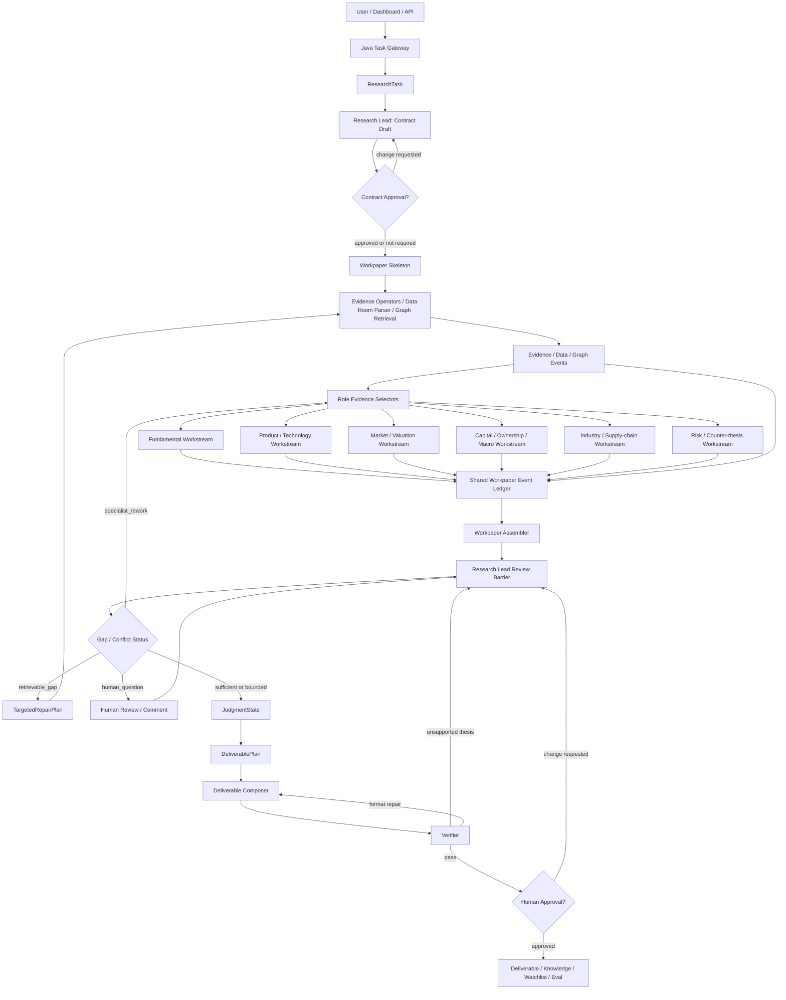

# R52：B 端协作型 Agent Graph 与企业工作流嵌入技术方案

日期：2026-06-28

状态：技术方案草案。本文承接 `R51` B 端 PRD，定义协作型 multi-agent graph 如何运行、agent 如何嵌入企业工作流、Research Lead / specialist / human reviewer 如何协作，以及需要落地的 runtime artifact、event、permission、checkpoint 和 eval 合同。本文不实现代码。

关联文档：

- `docs/product/PRD_20260628_b2b_financial_research_workbench.zh-CN.md`
- `docs/architecture/agent_graph_vnext/09_lead_supervised_closed_loop_research_framework.zh-CN.md`
- `docs/architecture/agent_graph_vnext/25_agent_runtime_reference_stack_and_harness_context_engine_draft.zh-CN.md`

## 1. 核心判断

当前项目已经有 Research Lead、LeadReviewCheckpoint、TargetedRepairPlan、DimensionEvidencePortfolio、ProductIntelligenceGraph 和 Java Task Gateway 等基础件，但运行形态仍偏：

```text
主 agent 拆题
 -> 并发调用几个 specialist
 -> 一次 review / second pass
 -> 写作器输出
```

这更像固定流水线，不像机构研究团队协作。R52 的目标是把它升级成：

```text
Research Lead 常驻监督
+ Shared Workpaper Event Ledger
+ Specialist Workstreams
+ Human Review / Approval
+ Deliverable Composer
+ Eval / Audit
```

核心设计选择：

1. 以 `WorkpaperPack` 为协作中心，不以聊天历史为中心。
2. agent 间通信使用结构化 artifact / event，不使用自由 agent-to-agent chat。
3. Research Lead 是 supervising analyst，负责目标、分派、审查、repair、合并和写作计划。
4. Specialist 是角色工作流，不是独立黑盒 agent；它们只能写 role-scoped contribution。
5. Human reviewer 是一等节点，可以审批、评论、退回、修改、冻结和批准。
6. Java 后端负责企业工作流、任务、权限、审批、SSE、队列和 trace；Python/LangGraph 负责研究执行。
7. SQL run/eval store + ObjectStore artifact refs 是审计主账本；Redis 只做 transient 协调。

### 1.1 防退化原则

R52 不能退化成：

```text
Research Lead 派单
 -> specialist 并发跑一轮
 -> Research Lead repair 一次
 -> writer 拼接输出
```

这只是带底稿记录的 fixed fanout，不是协作型 graph。

R52 的目标状态应是：

```text
Research Objective Contract
 -> hypothesis / workstream / dependency graph
 -> evidence discovery
 -> specialist contribution
 -> cross-specialist challenge
 -> lead checkpoint
 -> targeted repair / rework / split task
 -> thesis vs counter-thesis adjudication
 -> human review
 -> reopened workpaper if needed
 -> deliverable plan
 -> final output
```

因此 `WorkpaperEvent` 不只是审计日志，也必须能驱动后续动作。Research Lead 不是一次性 planner，而是持续在线的研究主编；specialist 不是一次性 worker，而是围绕同一份底稿持续贡献、质疑、补证、重写的 workstream。

## 2. 企业工作流嵌入方式

B 端用户不应该只在聊天框里输入问题。agent 应嵌入以下企业工作流：

```text
Workspace / Project
 -> Research Task
 -> Research Objective Contract
 -> Data Room / Source Scope
 -> Evidence Workbench
 -> Shared Workpaper
 -> Lead Review
 -> Human Review
 -> Deliverable Studio
 -> Knowledge Base / Watchlist / Eval
```

### 2.1 Workspace / Project

每个机构或团队有 workspace。每个 workspace 下有：

- research projects；
- users / roles / permissions；
- private data rooms；
- company / industry watchlists；
- template registry；
- source policy；
- cost and model budget；
- audit / eval dashboard。

### 2.2 Research Task

任务不只是一次 prompt，而是可追踪工作单：

```text
task_id
workspace_id
project_id
requester
owner / reviewer
task_type
target_entities
time_range
source_policy
artifact_policy
human_review_policy
cost_latency_budget
status
```

任务类型从 R51 PRD 继承：

- 财报/业绩点评；
- 公司深度初稿；
- 同行/竞品/产品对比；
- 事件影响分析；
- 供应链 read-through；
- 资本市场/资金面分析；
- 投研观点到量化因子验证；
- 尽调 data room 初筛；
- watchlist 定期更新；
- 客户版 brief / 投委会 memo / deck 生成。

### 2.3 Human Review Policy

任务创建时就要确定 human-in-the-loop 策略：

| 策略 | 适用场景 | 人工介入 |
| --- | --- | --- |
| `auto_draft` | 低风险内部草稿、focused answer | 完成后 review |
| `contract_approval_required` | 深度报告、客户材料、尽调 | ResearchObjectiveContract 需人工批准 |
| `lead_review_required` | 高风险判断、缺口较多、外部交付 | LeadReview 后人工确认是否继续 |
| `deliverable_approval_required` | 客户版 Word/PPT/PDF | 交付物必须人工批准 |
| `quant_approval_required` | Research-to-Quant | dataset build / backtest / paper trading 阶段前人工批准 |

### 2.4 工作流产品入口

agent 在 B 端不应只作为聊天框存在，而应嵌入以下产品入口：

| 入口 | 用户动作 | agent 角色 |
| --- | --- | --- |
| Dashboard | 查看任务、watchlist、待审批、异动 | 创建任务、更新状态、推送 review item |
| Company Workspace | 查看单公司历史底稿、数据、图谱、报告 | 复用历史 workpaper、对比新旧证据、触发更新 |
| Project Workspace | 管理一个项目下多家公司、多交付物 | 维护项目级 source policy、peer universe、deliverable set |
| Data Room | 上传 PDF/Word/Excel/PPT/网页快照/内部纪要 | 解析输入、生成 artifact refs、进入 evidence workbench |
| Evidence Workbench | 审查证据、引用、source boundary | 暴露 parser-backed rows、gap、rejection、provenance |
| Workpaper | 协同编辑底稿和 section | specialist 写 section，Lead 审查，human 评论和退回 |
| Graph View | 查看公司、产品、客户、供应链、资金和事件关系 | 提供图谱推理、关系边证据、反证和边界 |
| Deliverable Studio | 生成 memo、PPT、Word、MD、PDF、Excel appendix | Composer 只消费 approved Workpaper 和 DeliverablePlan |
| Review Queue | 审批合同、section、gap、交付物、quant 阶段 | graph 暂停、等待、恢复、记录审批事件 |
| Eval / Audit | 查看 run、token、时延、失败、gold/failure lifecycle | 形成可追责质量闭环 |

典型任务应从“研究任务入口”开始，而不是从自由 prompt 开始：

```text
任务类型：公司深度 / 财报点评 / 产品对比 / 行业跟踪 / 投委会材料 / 量化因子提炼
研究对象：ticker / company / industry / product family / peer universe
研究目的：例如判断 Blackwell 周期是否已被充分定价
输出格式：内部 memo / PPT 摘要 / Word 报告 / dashboard brief
数据范围：本地知识库 / SEC / 非美披露 / 官网 / public web repair / data room
审批要求：contract / section / gap / deliverable / quant stage 是否需要 human approval
```

这一步生成 `ResearchTask` 和 `ResearchObjectiveContract`，后续所有 agent 行为都围绕该 contract 和 Workpaper 运行。

## 3. 新 Graph 总览

建议 R52 的 graph 分成 10 个阶段：

```text
0 Task Intake
1 Contract Draft / Approval
2 Evidence Operations
3 Specialist Workstreams
4 Workpaper Assembly
5 Lead Review Barrier
6 Targeted Repair / Rework
7 Judgment / Decision State
8 Deliverable Plan / Composer
9 Verifier / Human Approval
10 Knowledge / Watchlist / Eval Closeout
```



## 4. Shared Workpaper Event Ledger

R52 的关键不是让 agent 互相聊天，而是让所有参与者围绕共享底稿写入结构化事件。

### 4.1 WorkpaperPack

`WorkpaperPack` 是任务级协作对象：

```text
workpaper_id
task_id
contract_ref
template_type
status
sections
dimension_status
evidence_refs
claim_refs
gap_refs
graph_refs
review_comments
approval_state
version
```

它不是最终报告，而是可审计研究底稿。

### 4.2 Event Ledger

所有 agent、工具和人工操作只 append event，不直接覆盖上游事实：

```text
event_id
task_id
workpaper_id
actor_type: human | research_lead | specialist | evidence_operator | verifier | system
actor_id
event_type
payload_ref
source_refs
target_section
created_at
depends_on
permission_scope
status
```

核心事件类型：

| Event | 由谁写 | 用途 |
| --- | --- | --- |
| `TaskCreated` | Java backend | 创建任务 |
| `ContractProposed` | Research Lead | 提出研究合同 |
| `ContractApproved` / `ContractChangeRequested` | Human / policy | 审批或退回 |
| `EvidenceRequest` | Research Lead / Specialist via Lead | 请求补证据 |
| `EvidenceAdded` | Evidence Operator | 写入 evidence/data/graph refs |
| `WorkpaperSectionDrafted` | Specialist | 写入维度底稿 |
| `GapQuestionRaised` | Specialist / Lead | 提出缺口 |
| `CounterThesisRaised` | Risk / Specialist | 提出反方 |
| `ConflictDetected` | Lead / Verifier | 标记证据或结论冲突 |
| `ReviewCommentAdded` | Human / Lead | 评论和修改要求 |
| `TargetedRepairRequested` | Research Lead | 发起 repair |
| `TargetedRepairCompleted` | Evidence Operator | repair 结果 |
| `JudgmentStateCreated` | Research Lead | 形成判断状态 |
| `DeliverablePlanCreated` | Research Lead | 指导交付物生成 |
| `DeliverableGenerated` | Composer | 生成交付物 |
| `VerifierFindingRaised` | Verifier | 事实/引用/格式问题 |
| `HumanApprovalDecision` | Human | 批准、退回、冻结 |
| `KnowledgeCommitted` | System | 入库和 watchlist 更新 |
| `EvalResultAttached` | Eval runner | 质量评测 |

### 4.3 Projection

UI 和 agent 不直接读完整事件流，而是读 projection：

- `CurrentWorkpaperView`：当前底稿。
- `DimensionEvidenceView`：每个维度证据状态。
- `GapBoardView`：缺口板。
- `ReviewQueueView`：待人工处理事项。
- `TraceTimelineView`：执行轨迹。
- `DeliverableView`：可交付物和版本。

### 4.4 Event 作为调度触发器

`WorkpaperEvent` 不能只是日志。它应同时承担：

1. 审计记录：谁在什么时候写入了什么事实、判断、缺口、评论或审批。
2. 状态迁移：section / gap / workstream / task 的状态变化。
3. 调度触发：某些事件会触发 LeadReview、targeted repair、specialist rework、human review 或 verifier rerun。
4. projection source：由事件 replay 得到当前 Workpaper、gap board、review queue 和 trace timeline。

示例：

```text
Product Specialist 写入 GapQuestionRaised(customer_deployment_missing)
 -> Research Lead 分类为 retrievable_gap
 -> TargetedRepairRequested(official_customer_case / cloud_instance / OEM_config)
 -> Evidence Operator 写入 EvidenceAdded
 -> Product Specialist 写入 WorkpaperSectionDrafted(delta)
 -> LeadReview Delta Audit
```

```text
Fundamental Specialist 写入 ClaimCardCreated(capex_growth)
 -> Product Specialist 写入 ConflictDetected(product_return_unclear)
 -> Capital Specialist 被触发补 debt / lease / cash flow / ROIC
 -> Research Lead 在 JudgmentBarrier 合并 capex thesis 和反证
```

```text
Verifier 写入 VerifierFindingRaised(missing_counter_thesis)
 -> Research Lead 重新打开 Risk / Counter-thesis Workstream
 -> 不允许 Deliverable Composer 直接补一段免责声明过关
```

因此事件流本身是 collaborative graph 的运行总线。

### 4.5 WorkpaperPack 作为当前任务操作状态

`WorkpaperPack` 是从事件流投影出的当前任务操作状态，不是最终报告，也不是原始聊天记录。它应聚合：

```text
ResearchObjectiveContract
target universe / peer universe / product family scope
dimension evidence portfolio
ClaimCards
GapLedger
SectionDrafts
CounterThesisNotes
ConflictNotices
JudgmentState
DeliverablePlan
ReviewComments
ApprovalDecisions
artifact refs
trace refs
```

写作器、前端、review queue 和 verifier 默认读取 projection，不直接读取全部 event。审计、回放、debug、失败归因时再读取完整 event ledger。

## 5. Agent 职责与通信边界

### 5.1 Research Lead

Research Lead 是研究主编，职责是：

- 生成 ResearchObjectiveContract；
- 选择 playbook / task template；
- 决定哪些 specialist 和 evidence operators 激活；
- 读取 DimensionEvidencePortfolio、PublicEvidenceCoverageProfile、WorkpaperPack；
- 审计目标覆盖、证据充分性、gap 和冲突；
- 发起 TargetedRepairPlan；
- 合并 specialist contributions；
- 生成 JudgmentState 和 DeliverablePlan；
- 决定是否需要 human review。

Research Lead 可以请求工具，但不直接写 final fact；所有工具结果必须通过 Evidence Operator / source authority gate 成为 artifact 或 evidence row。

### 5.2 Evidence Operators

Evidence Operators 是取数和解析执行器：

- public source / filing / SQL / RAG / graph retrieval；
- Data Room parsing；
- web fetch / snapshot / parser；
- table / metric / document extraction；
- source authority / provenance / rejection ledger。

它们不写判断，只输出：

- `EvidenceAdded`；
- `ParserRejected`；
- `SourceBoundaryRecorded`；
- `AttemptGapRecorded`。

### 5.3 Specialists

Specialist 是 role workstream，不是独立 researcher。默认不能直接调工具，只能消费 role-scoped EvidencePack / DimensionEvidencePortfolio projection。

建议第一组 specialist：

- Fundamental Analyst；
- Product / Technology Analyst；
- Market / Valuation Analyst；
- Capital / Ownership / Macro Analyst；
- Industry / Supply-chain Analyst；
- Risk / Counter-thesis Analyst；
- Data Room Analyst；
- Quant Translator，后续 R53 深拆。

输出只能是结构化贡献：

```text
WorkpaperSectionDraft
ClaimCandidate
GapQuestion
CounterThesisNote
EvidenceSufficiencyAssessment
RepairSuggestion
ForbiddenClaimWarning
```

Specialist 若发现缺口，不能自己联网乱查；必须写 `GapQuestionRaised` 或 `RepairSuggestion`，由 LeadReviewCheckpoint 决定是否 repair。

### 5.4 Cross-specialist Structured Communication

specialist 之间需要协作，但不应自由聊天。协作通过结构化事件进行：

| Event | 发送方 | 接收方 | 用途 |
| --- | --- | --- | --- |
| `QuestionToRole` | Specialist / Lead | Specialist | 请求另一角色解释某个证据或缺口 |
| `ChallengeToClaim` | Specialist / Risk / Verifier | Lead / Claim owner | 质疑某个 claim 的证据、边界或逻辑 |
| `DependencyRequest` | Specialist | Lead | 声明自己的判断依赖另一个 workstream |
| `ReworkDirective` | Lead | Specialist | 要求重写 section、补反证或降权 |
| `ConflictNotice` | Specialist / Lead / Verifier | Lead | 标记证据或结论冲突 |
| `CounterThesisRequest` | Lead / Human | Risk | 要求建立反方论证 |

例子：

```text
Product Specialist -> QuestionToRole(Fundamental):
如果 Blackwell 出货强，应该在哪些财报科目或 segment 体现？

Fundamental Specialist -> WorkpaperEvent(ResponseToRole):
主要观察 Data Center revenue、inventory、purchase obligations、gross margin、customer concentration。

Research Lead -> ReworkDirective(Product):
补 Blackwell 客户部署和供应链瓶颈，不要只写产品规格。
```

这类结构化通信进入 event ledger，可被审计、重放和评测。禁止把它实现成不可追踪的 agent 私聊。

### 5.5 Deliverable Composer

Deliverable Composer 替代旧 `Memo Writer` 的产品语义。它只负责表达和文件生成：

- Markdown / Word / PPT / PDF / Excel appendix；
- 图谱图 / 时间线 / 表格；
- 内部版和客户版；
- citation rendering；
- format repair。

禁止：

- 不检索；
- 不查 DB；
- 不联网；
- 不新增事实；
- 不把 raw retrieval row 写入正文。

输入只能是：

```text
approved or review-ready WorkpaperPack
JudgmentState
DeliverablePlan
verified ClaimCards
bounded GapRegister
artifact refs
```

### 5.6 Verifier / Editor

Verifier 做事实、引用、边界、格式和交付物质量检查。

允许：

- inspect rendered artifact；
- inspect citation / evidence / provenance；
- raise verifier findings；
- request format repair；
- send unsupported thesis back to LeadReview。

禁止：

- 不取新证据；
- 不修事实；
- 不越过 LeadReview 改判断。

### 5.7 Human Reviewer

Human reviewer 是正式 actor：

- approval / reject / request changes；
- edit Workpaper section；
- downrank evidence；
- approve Contract / Deliverable / Quant stage；
- freeze or retire factor / thesis；
- annotate failure / gold。

人工修改必须写入 event ledger，不得只改最终文档。

### 5.8 Lead 的多轮主编职责

Research Lead 在 R52 中至少有七个 checkpoint，而不是只在开头和结尾出现：

| Checkpoint | Lead 判断 | 可能动作 |
| --- | --- | --- |
| Contract Checkpoint | 研究问题是否拆对，范围是否可执行 | 修改 contract、要求 human approval |
| Evidence Coverage Checkpoint | 必要维度是否有证据，source boundary 是否清楚 | 开 evidence operator、调整 source route |
| Specialist Cross-review Checkpoint | 各角色是否互相挑战，是否存在未解释冲突 | 发 `QuestionToRole`、`ChallengeToClaim`、`ReworkDirective` |
| Gap / Repair Checkpoint | gap 是 retrievable、bounded、commercial 还是 not material | targeted repair、bounded gap、停止修补 |
| Thesis Adjudication Checkpoint | 正反观点是否平衡，核心判断是否有支撑 | 生成 JudgmentState 或退回 workstream |
| Deliverable Plan Checkpoint | writer 应按什么逻辑组织，而不是拼 ClaimCard | 生成 DeliverablePlan、确定读者和格式 |
| Human Review Checkpoint | 人的评论是否需要重开底稿或降权 | return-to-lead、section rework、approval |

这保证 Lead 是持续监督的 `supervising analyst`，不是一次性分发任务的 router。

## 6. Async / Sync 协作机制

### 6.1 异步阶段

适合异步并发：

- evidence fetch / parse；
- Data Room ingestion；
- role-specific retrieval / pack loading；
- specialist section drafting；
- graph expansion；
- source coverage inspection；
- background watchlist update。

每个异步任务必须有：

```text
subtask_id
parent_task_id
actor
input_artifact_refs
output_event_type
timeout
retry_policy
cost_budget
resource_class
```

### 6.2 同步屏障

必须同步 barrier：

1. `ContractApprovalBarrier`：高风险任务先确认研究合同。
2. `EvidenceFreezeBarrier`：进入 specialist 前冻结一版 evidence bundle，可后续 repair 增量更新。
3. `LeadReviewBarrier`：第一轮 specialist 后统一审查。
4. `JudgmentBarrier`：形成 JudgmentState 前处理冲突和关键 gap。
5. `DeliverableApprovalBarrier`：外部交付或客户版必须人工确认。
6. `QuantApprovalBarrier`：dataset build / backtest / paper trading 前必须人工确认，R53 细化。

### 6.3 Repair Loop

repair 不再是自由 second pass。它必须由 LeadReview 生成：

```text
TargetedRepairPlan
 -> Evidence Operator / Specialist Rework
 -> Delta Evidence / Delta Workpaper Event
 -> LeadReview Delta Audit
```

约束：

- 最多 N 轮，默认 2 轮；
- 每轮必须说明新增了什么 authority-bearing evidence；
- 没有增量则停止；
- commercial gap 不触发公开源 repair；
- bounded gap 只记录边界，不继续烧 token。

### 6.4 Workstream 状态机

每个 specialist workstream 应是可中断、可重开、可退回的状态机：

```text
not_started
waiting_for_evidence
drafting
waiting_for_dependency
cross_review
lead_rework_requested
repair_waiting
revised
sufficient
bounded_gap
commercial_gap
approved
retired
```

状态变化必须由 `WorkpaperEvent` 驱动。比如：

- `EvidenceAdded` 可以把 `waiting_for_evidence` 推到 `drafting`。
- `QuestionToRole` 可以把接收方推到 `waiting_for_dependency`。
- `ReworkDirective` 可以把 section 从 `sufficient` 退回 `lead_rework_requested`。
- `HumanApprovalDecision(change_requested)` 可以把 deliverable 退回 `LeadReviewBarrier`。

### 6.5 企业流程嵌入后的运行形态

完整运行形态应支持：

```text
可中断：等待审批、等待数据、等待人工评论时暂停。
可恢复：审批或补数据后从 checkpoint 继续，不重跑全链路。
可评论：human 对 contract / section / claim / gap / deliverable 写评论。
可退回：Lead 或 human 可以把单个 section 退回给指定 specialist。
可追责：每条 claim、gap、审批和文件输出都有 actor / event / evidence refs。
可复用：历史 Workpaper 可作为同公司、同行业、watchlist 更新的上下文。
可监控：watchlist 触发的更新写入同一任务体系，而不是新开孤立聊天。
```

## 7. Context 与权限

ContextEngine 是所有节点上下文注入入口。

### 7.1 Context 分层

| 层 | 内容 | 谁能看 |
| --- | --- | --- |
| Task Contract | 研究问题、维度、source policy、输出格式 | 全部节点 |
| Workpaper Projection | 当前底稿、section status、gap board | Lead / relevant specialist / human |
| Evidence Portfolio | DimensionEvidencePortfolio、EvidencePack refs | Lead 全量，specialist role-scoped |
| Private Scratch | 节点临时推理摘要 | 仅节点内部，不进 final evidence |
| Approval / Review | 人工评论、审批、修改要求 | Lead / human / affected node |
| Deliverable Inputs | JudgmentState、DeliverablePlan、verified refs | Composer / Verifier |

### 7.2 Tool 权限

| Actor | 可用工具 | 禁止 |
| --- | --- | --- |
| Research Lead | coverage inspect、artifact inspect、targeted repair request、DB query request | 直接写 final fact、直接生成最终交付物 |
| Evidence Operator | fetch、parse、SQL/RAG/Milvus、document parser、snapshot | 写判断 |
| Specialist | role pack inspect、workpaper section write | 任意检索、联网、DB 查数 |
| Deliverable Composer | report rendering、chart/table/graph rendering | 检索、DB、web、事实补充 |
| Verifier | artifact/citation/provenance inspect | 新证据获取、改写事实 |
| Human | review/comment/approval/edit | 无审计的直接覆盖 |

### 7.3 A2A / MCP 边界

- 内部 specialist 协作不用 A2A。内部需要共享 source authority、workpaper state 和 audit ledger，不适合 opaque external-agent 协议。
- MCP 用于工具标准化和外部数据源接入，但工具输出仍要进入本地 authority gate。
- A2A 只保留为未来对外暴露 FinSight agent capability 或接入外部专业 agent。

### 7.4 ContextEngine Contract

25 文档中的 ContextEngine 草案在 R52 中收敛为节点上下文治理合同。ContextEngine 不是简单压缩器，而是所有节点上下文选择、压缩、注入和记忆治理的唯一入口。

建议接口：

```text
resolve(run_state, scope)
select(context_snapshots, target_node, role, token_budget)
compress(selection, policy)
inject(selection, target_node)
write_memory(candidate)
consolidate(memory_candidates)
retrieve(query, scope, freshness, authority_boundary)
invalidate(memory_id | context_snapshot_id, reason)
```

约束：

- Research Lead 可读取全局 contract、coverage、evidence portfolio、gap ledger 和 Workpaper projection。
- specialist 只能读取 role-scoped EvidencePack、相关 Workpaper section、必要 dependency event。
- Deliverable Composer 只能读取 `JudgmentState`、`DeliverablePlan`、approved/review-ready `WorkpaperPack` 和 verified refs。
- Context 压缩不得丢失 `source_boundary`、`period`、`unit`、`citation`、`gap_type`、`evidence_refs`、`claim_refs`。
- memory 只能作为 planning context，不能直接支撑 financial / product exact claim。
- 每次 context injection plan 必须写入 run audit，支持 replay 和 failure attribution。

## 8. 状态机

### 8.1 ResearchTask 状态

```text
created
contract_drafting
contract_review
collecting_evidence
specialist_working
lead_review
repairing
judgment_ready
drafting_deliverable
verifying
human_review
approved
rejected
failed
cancelled
archived
```

### 8.2 Workpaper 状态

```text
skeleton
evidence_attached
section_drafting
lead_review_ready
needs_repair
judgment_ready
deliverable_ready
approved
superseded
archived
```

### 8.3 Section 状态

```text
not_started
evidence_missing
drafted
needs_repair
sufficient
bounded_gap
commercial_gap
not_material
approved
```

### 8.4 Gap 状态

```text
observed
classified
repair_planned
repair_running
repaired
bounded
commercial
not_material
retired
```

## 9. Java / Python / DB 映射

### 9.1 Java 后端

Java 后端负责企业产品层：

- task API；
- workspace / project / permission；
- event ledger API；
- approval / comment / review queue；
- SSE / notification；
- queue and worker dispatch；
- object-store refs；
- eval dashboard API。

Java 不重写 Research Lead / specialist 逻辑。

### 9.2 Python / LangGraph

Python 负责研究执行：

- Research Lead；
- Evidence Operators；
- specialist workstreams；
- Workpaper assembler；
- LeadReview；
- TargetedRepair；
- JudgmentState；
- DeliverablePlan；
- Verifier logic；
- eval runners。

### 9.3 SQL / ObjectStore / Redis

| Store | 用途 |
| --- | --- |
| SQL Run Store | task、node、event、artifact refs、tool calls、model calls、approval、eval |
| ObjectStore | parsed docs、workpaper versions、rendered deliverables、large artifacts |
| Redis / MQ | transient queue、locks、worker heartbeat、resource semaphore |
| LangGraph checkpoint | graph-local resumable state |
| Eval Store | case、node result、metric、failure/gold lifecycle |

### 9.4 FinSightResearchRuntimeFacade

25 文档中的 harness 升级方向在 R52 中收敛为 `FinSightResearchRuntimeFacade`。它不是 agent，也不直接生成研究判断，而是 Java backend、Workbench、CLI/controller、future MCP/A2A 暴露层共同调用的可审计执行门面。

建议接口：

```text
start_run(payload) -> run_id / task_id
resume_run(run_id, resume_payload)
cancel_run(run_id)
get_run_state(run_id)
get_trace(run_id, filters)
get_artifacts(run_id)
explain_evidence(run_id, claim_id | evidence_id | dimension)
inspect_coverage(run_id, dimension | ticker | source_role)
run_eval(eval_id, dataset_version, profile)
replay_node(run_id, node_id, input_snapshot_id)
```

边界：

- Facade 可以调 LangGraph、MCP tools、DB、ObjectStore、Eval runner。
- Facade 不直接生成投研结论。
- Facade 输出必须是 typed artifact refs、trace events、run state、evidence/gap/gate refs。
- Memo / Deliverable Composer 不能通过 facade 补事实；只有 Research Lead / LeadReview 可以发起 targeted repair。
- Java task layer 通过 facade 调 Python runtime，避免多套入口导致 trace、permission、eval 分裂。

## 10. Eval Gate

R52 不只评最终 memo，要评协作行为。

### 10.1 Collaboration Eval

- Research Lead 是否产出完整 contract。
- Specialist 是否只消费 role-scoped evidence。
- Specialist 是否把缺口写成 GapQuestion，而不是编结论。
- LeadReview 是否发现未承接 pack / conflict / retrievable gap。
- Repair 是否有 delta evidence。
- Human review 是否被记录和执行。
- Deliverable 是否只消费 approved inputs。

### 10.2 Workpaper Eval

- section completeness；
- dimension coverage；
- evidence refs coverage；
- unsupported claim rate；
- gap classification accuracy；
- counter-thesis coverage；
- human edit distance；
- approval pass rate。

### 10.3 Workflow Eval

- time to first workpaper；
- time to review-ready deliverable；
- queue wait；
- model cost by phase；
- repair loop count；
- approval cycle count；
- failed run recovery。

### 10.4 Observability / Export Boundary

25 文档中的 Langfuse / Phoenix / OpenTelemetry 方向在 R52 中只作为 export / dashboard / debug 辅助。FinSight 的审计主账本仍是本地 SQL run/eval store + ObjectStore artifact refs。

默认 span / event 应覆盖：

- run / task / user request；
- Research Lead planning；
- retrieval plan / retrieval route / rerank；
- source adapter / fetch / parser / verifier；
- MCP tool call；
- ContextEngine resolve / select / compress / inject；
- model call / token / latency / cost；
- BGE queue / CUDA slot / CPU spillover；
- specialist workstream execution；
- LeadReviewCheckpoint / targeted repair / rework；
- JudgmentState / DeliverablePlan / Deliverable Composer / Verifier；
- frontend trace view / user feedback / manual annotation。

通过条件：

- SQL trace 能独立复盘，不依赖外部 observability vendor。
- OTel / Langfuse / Phoenix export 不得丢失 source authority、gap type、event actor、artifact refs。
- export failure 不得影响本地 run/eval 审计。

## 11. 迁移路径

### R52.0 Contract

冻结 schema：

- ResearchTask；
- WorkpaperPack；
- WorkpaperEvent；
- WorkpaperSection；
- ReviewComment；
- ApprovalDecision；
- DeliverablePlan。

通过条件：

- schema 能表达 R51 PRD 的 B0-B6 任务；
- 不包含 private chain-of-thought；
- 能链接 RD/PIG/DEP/evidence refs。

### R52.1 Event Ledger / Projection

实现 append-only event ledger 和 projection：

- CurrentWorkpaperView；
- GapBoardView；
- ReviewQueueView；
- TraceTimelineView。

通过条件：

- 任意 section 修改可追溯；
- human comment / approval 可追溯；
- projection 可由 event replay 重建。

### R52.2 Workpaper Builder

把现有 ClaimCards / JudgmentState / DimensionEvidencePortfolio / ProductEvidencePack 投影到 WorkpaperPack。

通过条件：

- 财报点评、公司深度、产品对比三个模板可生成 workpaper skeleton；
- Workpaper section status 能区分 sufficient / retrievable_gap / bounded_gap / commercial_gap / not_material。

### R52.3 Collaborative Graph Runtime

把 LangGraph 从 fixed fanout 改成 workpaper-event-driven：

- Research Lead writes contract；
- evidence operators write EvidenceAdded；
- specialists write WorkpaperSectionDrafted；
- LeadReview writes TargetedRepairRequested / JudgmentStateCreated；
- Composer writes DeliverableGenerated。

通过条件：

- 至少 2 个 specialist 异步写入同一 Workpaper；
- 至少 1 个 specialist 通过 `QuestionToRole` / `ChallengeToClaim` / `DependencyRequest` 触发另一 workstream；
- LeadReview 能基于 Workpaper events 触发 targeted repair、specialist rework 或 human question；
- human comment / change request 能暂停 graph，并从对应 checkpoint resume；
- WorkpaperEvent replay 后能重建 lead checkpoint 前后的状态差异；
- no direct writer-from-raw-evidence path。

### R52.4 Human Review API / UI

接入 human review：

- contract approval；
- section comments；
- evidence downgrade；
- deliverable approval；
- return-to-lead。

通过条件：

- Java API 能写 approval events；
- Python graph 能在 approval barrier 暂停 / resume；
- UI 能看到 review queue 和 trace。

### R52.5 Tool / Permission Hardening

将工具权限绑定 actor：

- Lead can request repair；
- specialist cannot fetch；
- composer cannot retrieve；
- verifier cannot fetch new evidence。

通过条件：

- deterministic permission tests；
- forbidden tool-call attempts fail closed；
- tool outputs always artifact refs / bounded rows。

### R52.6 Eval / Release Gate

建立 R52 协作型 graph eval：

- 3 个 deterministic workflow cases；
- 2 个 human approval cases；
- 2 个 repair loop cases；
- 1 个 forbidden writer-tool case；
- 1 个 projection replay case。

通过条件：

- `git diff --check`；
- schema tests；
- event replay tests；
- graph smoke；
- no hidden raw evidence to composer。

### R52.7 Runtime Facade / ContextEngine

把 25 文档中 harness 和 ContextEngine 草案落入 R52 runtime：

- 新增或改造 `FinSightResearchRuntimeFacade`；
- 所有 Java / Workbench / controller research run 入口走 facade；
- ContextEngine 成为 Research Lead、specialist、Composer、Verifier 的统一 context injection 入口；
- context injection plan 写入 run audit。

通过条件：

- 同一 task 可通过 Java API、Workbench 或 CLI/controller 入口获得一致 run state / trace / artifact refs；
- forbidden context leakage tests：specialist 看不到非 role scope，Composer 看不到 raw retrieval rows；
- node replay 能使用保存的 context injection plan 复现输入快照。

### R52.8 Observability Export

把 SQL run/eval store 的关键 trace 导出到可选 observability 面板：

- OpenTelemetry span export；
- Langfuse / Phoenix optional export adapter；
- eval dashboard parity check。

通过条件：

- 本地 SQL 主账本与 export 计数一致；
- export 缺失时本地审计仍完整；
- trace 中能看见 task、event、tool、context、model、repair、approval、deliverable 的链路。

## 12. 与 R53 的接口

R53 Research-to-Quant 不应单独建一套 workflow。它应复用 R52：

```text
Research Workpaper
 -> Quant Translator Specialist
 -> FactorHypothesis Event
 -> Human Quant Approval Barrier
 -> DatasetBuild / Backtest / PaperTrading Events
 -> FactorCard
 -> Workpaper / Watchlist Feedback
```

R52 只定义协作底座；R53 定义 quant artifacts、point-in-time data、回测和 paper trading。

## 13. 与二级市场 / 资本反馈层的接口

25 文档中的 `Secondary Market / Capital Feedback Layer` 已进入 R51 PRD 的产品证据范围，但不应塞进 R52 协作底座实现。R52 只要求 Workpaper / DimensionEvidencePortfolio 能承载这些 pack；具体数据源、parser、graph edge 和 full-chain case 应拆成后续技术计划。

后续建议单独拆 `R54 SecondaryMarketCapitalFeedback`：

```text
SecondaryMarketCapitalFlowPack
OwnershipAndHolderPack
CreditFundingPack
CorporateActionPack
LiquidityAndPositioningPack
ValuationPriceInPack
ExpectationNarrativePack
EventCatalystPack
PolicyRegulatoryPack
CrossAssetReadThroughPack
DerivativesMarketSignalPack
```

R52 侧只保留接口要求：

- Workpaper section 能承载 market expectation / positioning / price-in / capital feedback。
- Research Lead 能把这些信号和 Fundamental / Product / Industry Evidence 分开裁决。
- Verifier / eval 防止二级市场、期权、期货、short、13F 等信号冒充基本面 exact fact。
- Deliverable Composer 必须写清信号边界和滞后性。

## 14. 25 文档吸收与归档映射

25 文档已经从“讨论草案”收敛为以下主线：

| 25 内容 | 当前承接位置 | 状态 |
| --- | --- | --- |
| Graph / Research Lead / specialist 协作方向 | 本文 R52 | 已吸收 |
| Harness 升级为 runtime facade | 本文 `9.4`、`R52.7` | 已吸收为执行项 |
| Hermes-style ContextEngine | 本文 `7.4`、`R52.7` | 已吸收为执行项 |
| MCP / A2A 分工 | 本文 `7.3` | 已吸收 |
| Durable execution | 本文 `8`、`9`、`R52.1-R52.4` | 已吸收 |
| Observability / eval / export | 本文 `10.4`、`R52.8`，11 文档为 eval source of truth | 已吸收为执行项 |
| Java 后端技术栈 | 10/12/13 文档和本文 `9` | 已吸收 |
| Public Evidence 数据工程方法 | R48 checklist、R51 PRD、RD/R/PIG 数据主线 | 已吸收，25 仅保留历史出处 |
| Secondary Market / Capital Feedback | R51 PRD；后续 `R54` 技术计划 | 已吸收为产品范围，技术实现待拆 |
| 外部参考出处 | 25 文档 | 保留为归档参考 |

因此 25 文档可以从 active draft 归档为 historical reference。后续 R52 实现不再以 25 作为主 source of truth；使用本文、R51 PRD、11 eval 文档、10 backend/frontend 文档和后续 R54 技术计划。

## 15. 开放问题

1. 第一版 event ledger 用现有 SQL store 直接扩表，还是先用 JSONL/ObjectStore prototype 再迁 SQL？
2. WorkpaperPack 是否需要版本化 diff，还是先按 event replay 重建即可？
3. Human approval barrier 是直接用 Java SSE / API 实现，还是先用 CLI / Workbench 页面模拟？
4. Specialist 是否允许在某些任务类型下请求 tool，而不是只能经 LeadReview？
5. Workpaper event payload 是否统一 JSON schema registry，还是每类 event 单独 schema？
6. R52 是否先在财报点评和公司深度两个模板试运行，再扩产品对比和 quant？

## 16. 当前结论

- 协作型 agent graph 的中心应是 `Shared Workpaper Event Ledger`，不是 agent-to-agent chat。
- `WorkpaperEvent` 不是纯日志，而是审计、状态迁移、调度触发和 projection source。
- Research Lead 是常驻 supervising analyst，负责合同、证据覆盖、cross-review、repair、rework、正反观点裁决、deliverable plan 和 human review resume。
- Specialist 只写 role-scoped structured contribution，不直接查新事实。
- Specialist 之间通过 `QuestionToRole`、`ChallengeToClaim`、`DependencyRequest`、`ReworkDirective` 等结构化事件协作，不做不可审计私聊。
- Human reviewer 是正式 graph actor，审批和评论必须进入 event ledger。
- Deliverable Composer 只消费 Workpaper / JudgmentState / DeliverablePlan，不再承担事实补查。
- Java 后端嵌入企业工作流，Python/LangGraph 执行研究逻辑。
- `FinSightResearchRuntimeFacade` 和 `ContextEngine` 是 R52 runtime 的统一入口和上下文治理层。
- MCP 用于工具标准化，A2A 暂不进入内部 specialist 协作。
- 25 文档归档为历史参考；未完成的二级市场 / 资本反馈数据源实现另拆 R54。
