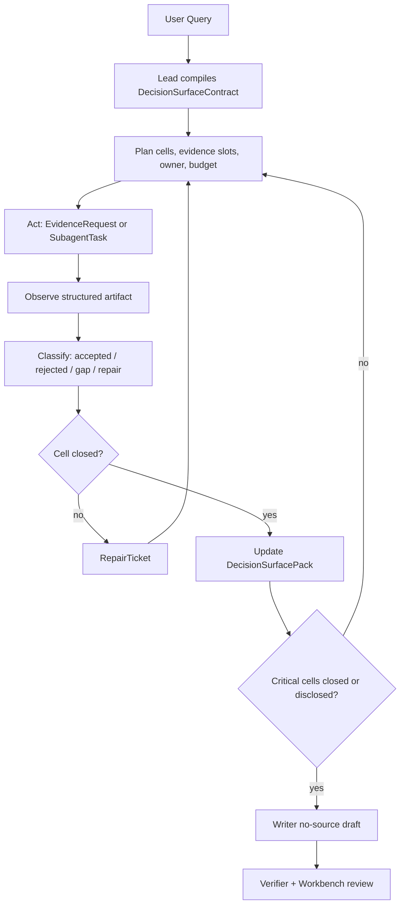

# TECH_01：Agentic Research Loop 与 Decision Surface Contract

日期：2026-07-09

状态：技术合同草案。本文把 PRD 中的 `Agentic Research Operating System`、bounded ReAct、DecisionSurfaceContract / DecisionSurfacePack、RepairTicket 和 writer no-source 主干落成工程边界；不表示 runtime 已实现。

## 1. 要解决的问题

P36 证明当前系统不是没有数据、工具或 agent，而是缺少贯穿全链路的研究主干：

```text
User question
 -> decision cells
 -> evidence requirements
 -> tool/search/parser/numeric actions
 -> domain judgments
 -> aggregate adjudication
 -> writer-allowed package
 -> verifier/workbench review
```

旧形态更接近 one-shot node graph：Lead 一次性理解问题，specialist 一次性回答，writer 汇总。新形态必须是 bounded agentic research：每个关键 decision cell 可以经历多轮 `plan -> act -> observe -> classify -> repair/stop`，但每轮都受预算、权限、Evidence Gate 和 trace 约束。

## 2. 设计原则

- 产品需要 ReAct 行为，不需要暴露或持久化原始 CoT。
- 系统记录 `reasoning_summary`、`action_rationale`、`observation_summary`、`failure_type`、`stop_reason`，不把 private scratchpad 当共享事实。
- Lead 是 research controller + 主审，不是万能补源 agent。
- Writer 是 presentation agent，不是 source hunter。
- 所有 claim 必须能回到 `decision_surface_cell_id`。
- 所有 repair 必须 typed，并回到来源节点或最有权限 agent。

## 3. Loop 分层：task-level vs cell-level

`AgenticResearchLoop` 分两层，不允许混成一个“万能 agent 自己想办法补完”的黑箱：

- Task-level loop：由 Lead 控制，负责理解用户问题、定义 research objective、编译 `DecisionSurfaceContract`、规划 10-20 个核心 decision cells、分配 owner、裁决 gap、决定 stop / repair / writer handoff。
- Cell-level loop：由 Evidence / SourceHunter / Parser / Numeric / Domain Operator 等最有权限的 agent 或工具执行，负责围绕单个 cell 的 evidence requirement 做 `plan -> act -> observe -> classify -> repair/stop`。
- Lead 可以发起 repair、重写 cell、调整证据要求、裁决是否可披露 gap，但不直接扮演万能补源 agent。
- Writer 不能发起 cell-level source repair，也不能把未闭环材料写成事实结论。

因此 repair 的默认路径不是 Lead 自己补完，而是按 gap 来源回到对应 owner：检索 gap 回 `TECH_02/03`，数值 gap 回 `TECH_04`，业务投影 gap 回 `TECH_05`，上下文或 handoff gap 回 `TECH_07/08`，artifact/provenance gap 回 `TECH_09`。

## 4. 核心对象

### 4.1 AgenticResearchLoop

任务级研究循环：

```text
compile DecisionSurfaceContract
 -> dispatch EvidenceRequest / SubagentTask
 -> observe EvidenceResponse / DomainCellJudgmentPack / RepairResult
 -> update DecisionSurfacePack
 -> decide repair / typed gap / human review / writer handoff
```

必备字段：

- `loop_id`
- `task_run_id`
- `decision_surface_id`
- `current_phase`
- `open_cell_ids`
- `closed_cell_ids`
- `active_repair_ticket_ids`
- `budget_state`
- `stop_condition`
- `case_control_memory_ref`

### 4.2 ReActStep

每轮可审计行动记录：

- `step_id`
- `loop_id`
- `actor_role`
- `target_cell_ids`
- `plan_summary`
- `action_type`
- `action_rationale`
- `tool_invocation_refs`
- `observation_refs`
- `observation_summary`
- `classification`
- `failure_type`
- `next_action`
- `stop_reason`

`classification` 只能是：`accepted`、`rejected`、`typed_gap`、`commercial_gap`、`needs_source`、`needs_parser`、`needs_repair`、`human_review`、`stop_budget`。

### 4.3 DecisionSurfaceContract

Lead 的主输出合同：

- `decision_surface_id`
- `user_question`
- `research_objective`
- `universe`
- `as_of`
- `output_language`
- `deliverable_type`
- `chain_segments`
- `universal_cell_archetype_refs`
- `sector_cell_pack_refs`
- `report_type_pack_refs`
- `case_cell_instance_policy`
- `decision_cells`
- `evidence_requirements`
- `repair_policy`
- `writer_forbidden_tools`
- `supplement_boundary_policy`
- `human_clarification_policy`

### 4.4 DecisionSurfaceCell

最小可审计研究单元：

- `cell_id`
- `chain_segment_id`
- `cell_question`
- `business_decision_role`
- `cell_archetype_id`
- `cell_instance_id`
- `required_evidence_slots`
- `acceptable_proxy`
- `source_policy`
- `numeric_audit_policy`
- `owner_agent`
- `cell_status`
- `next_action`
- `accepted_evidence_refs`
- `rejected_candidate_refs`
- `numeric_trace_refs`
- `gap_refs`
- `cell_conclusion`
- `confidence_vector`
- `what_would_change_program_refs`
- `repair_route`

### 4.5 DecisionSurfacePack

Writer 可消费的唯一主包：

- `decision_surface_id`
- `cell_rows`
- `thesis_path`
- `counter_thesis`
- `evidence_quality_summary`
- `numeric_trace_refs`
- `cell_dependency_edges`
- `what_would_change_program_refs`
- `typed_gaps`
- `commercial_gaps`
- `writer_brief`
- `allowed_citation_refs`
- `forbidden_claims`

Pack 内只能包含已通过 Evidence Gate / Numeric Gate / Lead adjudication 的 material。P36 supervisor supplement rows 在未转成 accepted runtime rows 前只能作为 `supervisor_supplement_only`。

### 4.6 RepairTicket

Repair 不能是自然语言 TODO，必须是路由对象：

- `repair_ticket_id`
- `cell_id`
- `gap_type`
- `source_agent`
- `owner_agent`
- `reason`
- `required_evidence`
- `allowed_tools`
- `budget`
- `stop_condition`
- `previous_rejections`
- `writer_forbidden_claims`
- `return_contract`

## 5. DecisionSurfaceCell 粒度规则

第一版 deep research case 建议控制在 10-20 个核心 cells。每个 cell 应回答一个投资 / 经营判断问题，而不是一个孤立事实查询问题。

可接受 cell 的判断规则：

- cell 必须有明确 `business_decision_role`，例如“判断 AI server OEM 是否捕获到利润池”，而不是“查 Dell AI server 收入”。
- cell 必须能绑定 1-3 个主证据 slot，最多再加 0-2 个 counter / proxy slot；超过这个范围通常说明 cell 太粗。
- cell 必须能路由到清晰 owner，例如 Evidence、Numeric、Domain Operator、Risk Operator 或 Lead adjudication；如果 owner 不清，通常说明 cell 问题定义不稳。
- cell 过粗的信号：无法写出可验收证据、无法定 stop condition、writer 可以绕过它直接写 generic memo。
- cell 过细的信号：只对应一个事实行、一个表格单元格或一个 source lookup，缺少业务判断角色。
- cell 采用 `cell_archetype_id + cell_instance_id`：前者沉淀跨 case / sector 的泛化模板，后者记录本次 company / sector / question 的具体化。
- sector 适配应通过 sector cell pack 扩展，而不是把所有行业压进同一个 global cell list。

### 5.1 2026-07-10 追加：Cell 泛化策略

`DecisionSurfaceCell` 不应一次性把所有行业 cell 定死，也不应完全靠 case-by-case 随手增删。第一版采用四层 composition，其中 sector 与 report type 是正交适配轴：

```text
Universal Research Responsibility Skeleton
  + Sector Cell Pack
  + Report-Type Pack
  + bounded Case Cell Instance
  -> DecisionSurfaceContract
```

四层职责：

- `Universal Research Responsibility Skeleton`：沉淀跨行业稳定的研究责任，例如 user judgment、business mechanism、demand realness、revenue / profit capture、capital-market price-in、risk / counterevidence、what-would-change 和 gap disclosure；它不是所有报告共用的固定标题列表。
- `Sector Cell Pack`：面向热门行业做行业适配，例如 AI infrastructure、software、consumer、financials、healthcare、energy、industrials。Sector pack 可以增加行业专属 cell、约束 source policy、定义常见 proxy 和 forbidden claims。
- `Report-Type Pack`：表达 company comparison / initiation、earnings event update、valuation / price-in、policy shock、counter-thesis 等任务形态的必答结构、时间边界和 stop rule；它与 sector pack 正交组合。
- `Case Cell Instance`：针对本次 company / sector / user question 做裁剪、实例化和少量特殊 cell 补充；case instance 不能直接污染 universal archetype，除非在多 case calibration 中反复出现。

治理规则：

- Calibration input 由两组 WorkBuddy 样本组成：P35 的 9 个 AI/Semis HTML，以及 P38 的 12 个多行业/多 report-type HTML + trajectory。后者覆盖 SaaS、银行、医药、零售、能源、公用事业、工业、网络安全、财报事件、估值、政策冲击和纯反证。
- WorkBuddy 12-case audit 证明 `12/12` 存在多轮 model/tool loop，但只作为 external calibration；其报告事实不得直接晋升 FIN runtime evidence。
- 由于 WorkBuddy prompts 已预先要求 Decision Surface、What-Would-Change 和 gap 等结构，这些 surface 的出现必须标为 `prompt_required`，不得宣称为样本独立发现。只有跨 prompt 自发出现或体现明显 sector/report-type 差异的模式，才可标为 `independently_observed` 或 `reviewer_inferred`。
- WorkBuddy 样本由 DeepSeek V4 生成，不能默认视为成熟 agent/reference output。外部样本先经过语义质量、claim support、numeric、tool usefulness、repair causality 和 context yield 复审，再进入 `DefectAndPatternCandidateMatrix`；每条观察必须记录 `retain / improve / redesign / reject` 建议和独立 corroboration requirement。
- 2026-07-11 复审已完成：12 个 case 直接 pack promotion 为 0；20 个候选中 4 个 `retain_with_independent_evidence`、16 个 `redesign_then_pack`。可进入后续 registry 设计的是研究责任、行业机制、report-type scaffold 和 presentation contract；WorkBuddy facts、values、rankings、valuation outputs、source strategy 和 trajectory 均不得进入 fixture。
- 重复出现且有投资 / 经营判断价值的 candidate，只有经人工 rubric 裁决、版本化审批和 FIN shadow compiler comparison 后，才可晋升到 report-type pack、sector pack 或 universal registry。
- 只服务一次事实查询的 cell 应降级为 `evidence_slot`，不得保留为 decision cell。
- 过粗、无 owner、无 stop condition、writer 可绕过的 cell 应拆分或删除。
- 新增 / 修改 / 废弃 cell 必须保留版本、理由、适用 sector、示例 case 和回滚路径。

建议生命周期：

```text
case_proposed
  -> pattern_candidate
  -> report_type_candidate / sector_candidate / universal_candidate
  -> reviewer_confirmed
  -> versioned_pack_accepted
  -> deprecated / superseded
```

这个策略的目标是让 cell 有泛化能力，同时保留 sector 差异。AI infrastructure first-case cells 只是 `ai_infra` sector pack 的初始样例，不是全行业默认答案。

## 6. `cell_status` 与 `next_action`

`cell_status` 描述 cell 当前证据状态，`next_action` 描述下一步控制动作，两者分离，避免把“还缺什么”和“谁去做什么”混在一个字段里。

建议第一版枚举：

```text
cell_status:
  open
  evidence_partial
  accepted
  typed_gap
  commercial_gap
  human_review
  writer_ready
  rejected

next_action:
  none
  request_evidence
  request_sourcehunter
  request_parser
  request_numeric_trace
  request_specialist
  lead_reframe
  writer_blocker
  ask_user
  stop
```

示例：一个 cell 可以是 `cell_status=evidence_partial` 且 `next_action=request_parser`；也可以是 `cell_status=typed_gap` 且 `next_action=writer_blocker`，表示允许披露 gap，但禁止 writer 把 gap 写成事实。

## 7. Lead 权限边界

Lead 是研究项目经理 + 主审，不是万能补源 agent。Lead 拥有：

- 编译 / 修订 `DecisionSurfaceContract`；
- 定义 cell、evidence slot、owner、budget、stop condition；
- 分派 `EvidenceRequest` / `SubagentTask`；
- 消费 TECH_02/04 的 PromotionDecision/NumericGate，裁决 Case 是否继续 repair、bounded disclosure、human review 或 stop；Lead 不写 evidence accepted/rejected head；
- 生成 writer-allowed `DecisionSurfacePack`；
- 面向用户追问解释本次研究路径、证据边界和未闭环点。

Lead 不拥有：

- 绕过 Evidence Gate 直接晋升 web supplement；
- 绕过 Numeric Gate 直接确认 exact value row；
- 代替 SourceHunter / Parser / Domain Operator 私自完成所有 repair；
- 要求 writer 补源或把 writer 变成事实发现 agent。

Lead-local repair 只限控制面修正，例如重写 cell、拆分过粗 cell、合并过细 cell、调整 owner 或放宽 / 收紧 source policy。

## 8. Follow-up Answerability Contract

为了支持用户追问，Lead 必须保留一个可答复的 Case 控制面，而不是只把材料丢给 writer。长期 Institutional Memory 由 TECH_03 registry 保存，Lead 只持有当前控制摘要与 exact refs：

- `CaseControlStateRef`：用户问题、scope、as_of、universe、关键假设、输出语言和 accountable owner。
- `DecisionSurfacePack`：每个 cell 的状态、结论、gap、what_would_change。
- `EvidenceLedgerRef`：TECH_02 accepted / rejected / supervisor_supplement_only 的 exact decision refs。
- `RepairTicketLedger`：哪些 gap 试过、失败原因、下一步 owner。
- `TraceSummary`：可审计的 ReAct trace 摘要，不包含私有 CoT。

Lead 对追问至少应能回答：为什么这样拆 cells、哪些证据支撑当前结论、哪些证据被拒绝、哪些 gap 仍未闭环、如果要继续研究应从哪个 ticket 开始、哪些 claim 不能写进最终报告。

## 9. ReAct Trace 不等于 CoT

本系统需要的是可审计 trajectory，不是暴露模型原始思维链。持久化字段应是：

- `plan_summary`
- `action_rationale`
- `tool_invocation_refs`
- `observation_summary`
- `classification`
- `failure_type`
- `next_action`
- `stop_reason`

不得把 private scratchpad、raw chain-of-thought 或模型内部长推理直接写入共享上下文、证据 ledger、artifact 或 Workbench。需要解释时，由模型生成面向审计的简明 `reasoning_summary`。

## 10. 第一版 AI infrastructure cell 示例

以下是 AI infrastructure deep research case 的 first-case cell set 示例，不是全行业通用 cell 定稿。它的作用是给 T1/T5/T9 fixture 一个可讨论的 10-20 cell 粒度基准。

| `cell_archetype_id` | `cell_question` | 主要 owner |
| --- | --- | --- |
| `ai_infra.demand.capex_pool_realness` | hyperscaler / enterprise AI capex 是否真实转化为可交付需求，而不是 announcement backlog | Lead + Evidence |
| `ai_infra.accelerator.nvidia_value_capture` | NVIDIA 在 GPU / networking / software bundle 中的收入和利润质量是否仍然主导 | Fundamental + Numeric |
| `ai_infra.accelerator.second_source_share` | AMD / internal ASIC 是否形成实质 second-source pressure | Product + Competitive |
| `ai_infra.server_oem.margin_capture` | Dell / HPE / SMCI 等 server OEM 是否只拿到低毛利 pass-through，还是能捕获集成利润 | Fundamental + Numeric |
| `ai_infra.cloud_customer.capex_deployment_readthrough` | cloud capex 指引、depreciation、capacity deployment 是否支持上游收入持续性 | Market + Evidence |
| `ai_infra.networking.attach_rate` | InfiniBand / Ethernet / optical networking attach rate 是否成为下一段瓶颈和利润池 | Product + Numeric |
| `ai_infra.hbm.supply_bottleneck` | HBM 供给、良率、ASP 与合同结构是否把价值转移给 memory vendor | Product + Evidence |
| `ai_infra.foundry_packaging.cowos_capacity_rent` | TSMC CoWoS / advanced packaging 产能是否限制 GPU 出货并形成议价权 | Parser + Domain |
| `ai_infra.memory.vendor_competition` | Micron / SK hynix / Samsung 的 HBM 竞争是否改变利润分配 | Competitive + Numeric |
| `ai_infra.semicap.lagged_readthrough` | ASML / AMAT / LRCX / KLA 等设备商是否受益于 HBM、packaging、foundry 扩产的滞后传导 | Market + Fundamental |
| `ai_infra.power_thermal.constraint` | power、cooling、datacenter site availability 是否成为需求兑现约束 | Evidence + Risk |
| `ai_infra.capital_market.priced_in` | 当前股价、valuation multiple、ownership / crowding 是否已反映大部分 AI upside | Market + Capital |
| `ai_infra.risk.export_control_geopolitics` | export control、China restriction、customer concentration 是否改变可持续性判断 | Risk |
| `ai_infra.risk.capex_digest_cycle` | capex digestion、over-ordering、double booking 是否构成 counter-thesis | Risk + Evidence |
| `ai_infra.what_would_change.monitoring_triggers` | 哪些指标变化会推翻 thesis 或触发后续更新 | Lead + Domain |

## 11. 状态机



## 12. 与其他 TECH 的边界

| 下游 | TECH_01 输出 | 下游负责 |
| --- | --- | --- |
| `TECH_02` | `EvidenceRequest`、cell source policy、stop condition | 执行 agentic search、工具选择、SourceHunter、Evidence Gate |
| `TECH_03` | metadata requirements、source role、KB layer boundary | RAG / KB / DocumentMetadataIndex / repair cache |
| `TECH_04` | numeric audit policy、metric intent | parser、row selector、NumericProgramTrace |
| `TECH_05` | decision cells、business role | domain cell packs、specialist/operator judgment |
| `TECH_06` | loop state objects | durable state、checkpoint、permission、HITL |
| `TECH_07` | CaseControlStateRef / exact owner refs / role requirement | context pack、skills、compaction governance |
| `TECH_08` | SubagentTask contract | handoff、artifact-only communication |
| `TECH_09` | cell IDs and pack refs | provenance、Workbench review、artifact consistency |
| `TECH_10` | expected trajectory | trajectory / execution / provenance eval |

## 13. 第一批 fixture

1. AI infrastructure five-chain `DecisionSurfaceContract` fixture。
2. `DecisionSurfaceCell` `cell_status` / `next_action` transition fixture。
3. `RepairTicket` routing fixture：evidence / parser / specialist / lead / writer blocker。
4. `DecisionSurfacePack -> MemoLogicPlan` projection fixture。
5. Verifier gate：decision-surface query 不得退回 generic memo-only。
6. AI infrastructure 10-20 cell granularity fixture：验证 cell 不过粗、不退化为事实查询、可映射 owner 和 evidence slots。
7. WorkBuddy 21-sample defect/pattern calibration fixture：P38 12-case 已完成 semantic/structured-trajectory re-audit；下一步只把 reviewer-approved candidate definitions 编译成 versioned fixtures，并继续对 P35 9-case 做同等级复审。不得用 12-case 报告值填充 fixture evidence。

## 14. 验收标准

- Lead 能输出稳定 `DecisionSurfaceContract`。
- 每个关键 cell 有 `cell_status`、`next_action`、required evidence、owner、stop condition。
- 每个 cell 能说明自己来自 universal archetype、sector pack 或 case instance，并保留版本与适用边界。
- 至少一个 cell 能经历 repair loop 并保留 ReActStep ledger。
- Writer input 只来自 `DecisionSurfacePack`。
- Workbench / Verifier 能按 `decision_surface_cell_id` 追溯和拒绝。

## 15. 2026-07-10 Active What-Would-Change Control Contract

`what_would_change` 不只是 cell 结尾的一句边界说明。它是一项独立的反事实研究与证伪程序：围绕当前判断识别哪些变量一旦变化会加强、削弱或推翻结论，并允许这些变量触发 EvidenceRequest、NumericProgramTrace、RepairTicket、operator resume 和 cell re-adjudication。

Task-level 规则：

- Lead 要求每个 material cell 至少声明一个决定性变量或明确 `not_applicable`。
- Primary operator 提出变量与业务因果关系；Risk / Counterevidence operator 作为默认 challenger 检查遗漏、反向情景和 falsifier。
- Evidence / SourceHunter / Parser / Numeric 负责实际取证或计算；Lead 和 Writer 不私自补源。
- 如果 What-Would-Change 研究得到新的 accepted evidence，必须生成新 `cell_version` 并重新进入 adjudication；不能静默修改已冻结主结论。
- 如果没有找到可用证据，必须保留 attempt-backed gap、不能推断项和后续 monitoring trigger。

`WhatWouldChangeProgram` 至少包含：

- `wwc_program_id`
- `cell_id`
- `current_judgment_version`
- `decisive_variables`
- `causal_rationale`
- `strengthen_conditions`
- `weaken_conditions`
- `overturn_conditions`
- `counterfactual_test_ids`
- `evidence_request_refs`
- `attempt_ledger_refs`
- `observation_refs`
- `directional_assessment`
- `remaining_gap_refs`
- `monitoring_trigger_ids`
- `re_adjudication_status`
- `presentation_section_policy`

成品表达规则：`What Would Change` 必须是 Workpaper / memo / dashboard 中的独立章节或 panel，不并入主结论段。它可以引用当前主结论并说明哪些证据会改变判断；只有完成 re-adjudication 的新 cell version 才能正式修改主结论。

展示的是 `causal_rationale`、`action_rationale`、`evidence sought`、`attempt summary`、`observation summary`、`directional assessment` 和 `remaining uncertainty`，不是模型原始 private CoT。

## 16. 当前边界

本文是 contract draft。当前代码尚未实现完整 DecisionSurface runtime，不得据此运行 paid writer、模型对比或 broad full-chain。

## 17. 2026-07-11 TaskModeRouter / Mode Contract

所有用户请求先生成版本化 `TaskModeDecision`，不能默认进入完整 specialist fanout。对象至少包含 requested/recommended/selected mode、classification reasons、complexity/materiality、required provenance、latency/cost budget、mandatory gates、allowed actors/tools、upgrade/downgrade conditions、user override 和 decision version。

支持 `quick_answer`、`focused_memo`、`deep_research_workpaper`、`watchlist_monitoring`、`research_to_quant`。Quick Answer 仍需 citation/gap/authority/trace，但可省略跨领域 fanout；出现多 cell dependency、material conflict、targeted repair、private Data Room 或正式交付要求时应升级。升级必须复用已验收 observations，不重复搜索；降级不能绕过已触发的 hard gate。TECH_06 执行 mode-specific budget/runtime，TECH_10 评估误路由、无效 fanout 和单位研究产出。

## 18. 2026-07-11 Gap / Workpaper / Pack-Level LeadReview

`GapRecord` 是缺口身份，至少记录 gap/cell/slot、type、materiality、claim impact、first detected、current owner、public/commercial/permission boundary、attempt refs、status、resolution、reopen/supersession。`RepairTicket` 是一次有 owner/budget/stop condition 的行动；`RepairAttempt` 是 durable execution。多个 agents 对同一 entity/period/slot 的同义 gap 必须去重，repair 失败不能创建新的平行 gap。

`WorkpaperPack` 是任务级协作当前态，由 append-only `WorkpaperEventLedger` 投影，聚合 task/contract、sections、DecisionSurface versions、evidence/gap/judgment、counter-thesis、review/approval、deliverable plan 和 artifact refs。`DecisionSurfacePack` 是其中 writer-eligible 的结构化判断组件，不取代 section、comment、approval 和 event history。旧 R52 object 通过 adapter/migration 接入，不能与 vNext 建第二套主账本。

单 cell adjudication 后必须进入 `DecisionSurfaceAssembly`：检查 required-cell closure、跨 cell conflict、dependency invalidation、thesis/counter-thesis、numeric/period consistency、typed gaps、narrative completeness 和 audience/disclosure。Lead 输出 `LeadReviewDecision=approve_for_writer|repair_required|human_review_required|bounded_release|reject`；只有对应 exact pack/version 的 `WriterAdmissionDecision` 才能冻结 `FrozenDecisionSurfaceSnapshot`。Lead 不能把 hard evidence/numeric fail 改成 accepted，也不能用 supervisor supplement 补齐 admission。

## 19. 2026-07-12 InstitutionalResearchCase Business Contract

根据 2026-07-12 PRD 和 TECH_00 Owner Constitution，TECH_01 是 `InstitutionalResearchCase` 研究业务语义的唯一 writer。Case 是 aggregate identity/ref graph，不直接持有大 payload，也不接管 Evidence、Numeric、Judgment、Review 的业务真相。

`InstitutionalResearchCase` 至少包含：

- `case_id / case_version / tenant_id / project_id`；
- `case_type / task_mode / lifecycle_status`；
- `CaseControlStateRef`：user question、scope、as_of、universe、language、audience、accountable owner、关键假设；
- current `DecisionSurfaceContract/Pack`、Workpaper、LeadReview、WriterAdmission heads；
- Evidence/Numeric/Judgment/Review/Artifact/Memory/Monitoring refs；
- open gap/repair/review/refresh refs；
- parent/follow-up/fork/supersedes/superseded-by refs；
- permission/retention/config policy refs。

### 19.1 Case 研究生命周期

```text
initiated -> planning -> researching -> assembling -> lead_review
 -> writer_admitted / bounded_closed / waiting_human
 -> released_internal / released_client
 -> monitoring -> refresh_required -> refreshing
 -> superseded / archived
```

这是研究业务状态，不替代 TECH_06 的 TaskRun/WorkUnit execution state。一个 Case 可以包含多个 TaskRun；一个 TaskRun 失败不自动使 Case failed；Case 是否 bounded closed、refresh required 或 superseded 由 TECH_01 的 Case policy/Lead 决定，并由 TECH_06 持久化命令和事件。`released_internal / released_client` 是对 TECH_09 ReleaseRecord/DecisionAttestation 的只读聚合状态，TECH_01 不创建 release business head。

### 19.2 CaseControlState 与 current heads

`CaseControlState` immutable/versioned，只保存控制摘要和 stable refs，不保存长 PDF、raw rows、private scratchpad 或无限聊天。每次 scope/as-of/universe/accountable owner/critical assumption 变化都生成新 Case version，并记录 affected cells、是否要求 recompile、是否使 writer admission/approval stale。

Point 01 `CaseControlSummaryVersion` 是 CaseControlState 的 M0-M2 bounded projection；`DecisionSurfaceContractVersion / CellVersion / EvidenceSlotVersion` 是本 TECH 对象的 shadow versions；`CompileTimeGapVersion` 仅表示 planning/compiler gap，是 GapRecord 的子类型，不得承载 TECH_02/04/05/09 的 runtime evidence/numeric/judgment/review gaps。

Current head 只能由对应 business owner 的 accepted version 推进：

- DecisionSurface/Gap/Workpaper/LeadReview：TECH_01；
- PromotionDecision：TECH_02；
- NumericProgram/Fact：TECH_04；
- Judgment/WWC：TECH_05；
- Review/Artifact/Release：TECH_09；
- Monitoring/ThesisDelta：TECH_11。

TECH_01 只聚合 refs 和 usability，不复制这些对象的业务内容或创建平行 head。

### 19.3 Follow-up / Refresh / Supersession

- `FollowUpRequest`：默认复用同一 Case identity，声明 target cells、new question、scope delta 和 expected answerability；只有研究目标实质改变时 fork 新 Case。
- `RefreshRequest`：绑定 trigger observation、old heads、affected-cell candidates、as-of delta 和 desired freshness；先做 dependency impact，再创建 targeted WorkUnits。
- `CaseSupersessionDecision`：记录 old/new case heads、原因、continued-use policy、artifact/approval impact 和 archive policy；禁止静默覆盖历史。
- reviewer correction 必须形成 versioned correction/repair input，并写入 TECH_03 memory candidate；不得只改最终 prose。

### 19.4 Cross-module commands / events

TECH_01 产生业务 command：`CreateResearchCase`、`AdvanceCaseControl`、`ReopenCells`、`RequestCaseRefresh`、`CloseCaseBounded`、`SupersedeCase`。TECH_06 校验 expected version、permission 和 idempotency 后写 durable event；TECH_01 projection 根据 event 重建 Case current view。

最小业务 events：`RESEARCH_CASE_CREATED`、`CASE_CONTROL_ADVANCED`、`CASE_CELLS_REOPENED`、`CASE_REFRESH_REQUESTED`、`CASE_BOUNDED_CLOSED`、`CASE_SUPERSEDED`。事件必须携带 case/version、causation、changed refs、affected cells、actor snapshot ref 和 policy/config refs。

### 19.5 R2-R4 acceptance fixtures

1. Follow-up 从 Case refs 恢复旧 cell/evidence/judgment，而不是依赖完整聊天。
2. Reviewer 拒绝错误 row 后，后续 Case version 不再静默复用该 row，并产生 targeted repair。
3. 新季度 source revision 只 reopen affected cells，非相关 cells 保持 compatible。
4. Case head 变化向 TECH_09 发出 artifact/approval impact request，并由 TECH_11 保留 monitoring causation。
5. PIT replay 能解释某一历史 as-of 下当时的 CaseControl、证据、判断、gap 和批准状态。

### 19.6 Research assignment / case responsibility

TECH_01 拥有 `CaseRoleAssignmentVersion` 和 `ResearchAssignmentVersion` 的研究业务语义：case accountable owner、Lead、cell owner、contributor/challenger、start/due/priority、scope、delegation ref、status、handoff 和 supersession。TECH_09 拥有 review/approval assignment，TECH_06 持久化 assignment events、notification jobs 和 SLA timers。

Assignment 不授予隐含工具、数据或审批权限；实际能力仍由 TECH_06 PermissionSnapshot 决定。人员离职、角色变更或 delegation expiry 产生新 assignment version 和 unresolved-owner event，不改写历史 ActorSnapshot。

本节只定义研究语义，状态仍为 `documented / contract_draft`；不表示 Case aggregate 已进入 runtime。

## 20. FIN 0.1.3 Search-to-Research Admission Boundary（2026-08-08）

真实 S1-08 DELL current-search 证明，能 terminalize、能返回 typed gap 或拥有固定 Cell 结构，都不等于 Agentic Research 已具备研究输入。TECH_01 的 Lead 在创建可执行 WorkUnit 前必须消费 TECH_02/03/10 共同签发的 `SearchQualityCard`，至少包含：

- provider capability 的 `declared/configured/operational/replay_proven/live_proven` 状态；
- required Evidence Slot 的 first-opportunity、attempt/capture、candidate-or-gap 与 stop reason；
- evaluator-only target-in-pool、required-slot recall、currentness、source diversity、reconciliation、false-promotion 和 selected-pack coverage；
- canonical source、role binding、本地 snapshot 与 accepted Evidence 的分账；
- 未闭合 slot 的真实 owner：provider/locator/parser/date/relationship/commercial/permission 或研究判断。

准入规则：

1. required target 尚未进入候选池时，相关 Cell 保持 `needs_source` 或 attempt-backed `typed_gap`；Lead 不得用模型自由叙事、历史 RAG hit 或通用方法模板将其推进为 supported judgment。
2. ranking 未准入时，Lead 不得读取虚构的 reranker winner；target-in-pool 通过后才可消费 selected Evidence Pack。
3. 动态 DecisionSurface 的 10–20 Cell 是产品覆盖目标，不是固定调用次数。WorkUnit 数和工具预算由 material open cells、dependency/conflict、repair value 和 stop condition决定，不能把“9 次 Provider 调用”写成产品质量代理。
4. S3 repair 只处理 judgment、cross-cell synthesis、counter-thesis、WWC 和 bounded follow-up。provider/locator/parser/candidate ceiling 退回 TECH_02/03；numeric authority 退回 TECH_04；模型 family autonomy 退回 TECH_08/10。
5. WriterAdmission 必须同时看到 SearchQualityCard、DecisionSurfacePack、material gaps 和内容质量门；完整链无异常但证据单薄或报告模板化仍不得进入 R2。

FIN 0.1.3 当前投影为：S1-08 v3 只有 zero-call engineering pass，最近 DELL live target-in-pool 为 0；S3-01–05 仅为 minimum engineering anchor，S3-06–09 尚未开始。因此本节是准入合同更新，不表示动态研究或内容质量已经通过。

## 21. FIN 0.1.3 Dynamic Research Successor Runtime Projection（2026-08-11）

S3 不再把已有五个孤立组件当作五项能力计数，而以一个 successor 连接它们：

1. `DecisionSurface` 的开放问题编译为具有 `business_role / why_material / downstream_decision` 的动态 cell；DELL／MU／NVDA 当前共 `38` 个 cell，不绑定固定 Agent 调用次数。
2. 只有 material、可检索且具 typed slot 的 gap 才能生成 canonical `EvidenceRequest`；当前五个 repair request 全为 `shadow / not_admitted / one-tool-call ceiling / no fallback`。
3. source observation 必须先落为 `accepted / rejected / typed_gap`。只有 accepted observation 可以使目标 cell 与传递依赖进入 `needs_readjudication`；它本身不得直接改写 Judgment。
4. re-adjudication 必须精确覆盖受影响 cell。changed Judgment 必须引用新 Evidence；未变化 Judgment 也必须给出 lineage-bound 处置。
5. Writer 前先编译 mechanism／WWC，再执行信息经济投影；L1 hard truth 与 L2–L4 内容 finding 分账，不能用表达评分覆盖事实错误。

该 Runtime 已在 zero-call scope 下形成三案程序和真实 DELL 无原文质量投影，但没有执行自然 planner、source tool、DeepSeek 或 post-repair report。formal S3 仍由 RC-P36-157／165／172 阻断；下一步只能先做一次 canary 必要性、价值、成本和风险决策。
