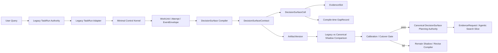

# Point 01：Control Spine / DecisionSurface Spine Runtime Migration 完整规划草稿

日期：2026-07-11

状态：`point01_execution_points_rebaselined_v1_3 / m1_1_m1_2_m2_1_m2_2_fixture_proven / milestones_m1_m2_open / legacy_authoritative / no_runtime_cutover`

## 1. 规划结论

第一阶段不采用“完整 Control Spine 全部做完后再做研究能力”，也不采用“直接把 DecisionSurface 塞入旧 orchestrator”。暂定路线是：

> 先实现 DecisionSurface 必需的最薄 Control Kernel；第一个完整业务 migration slice 是 DecisionSurface Planning Shadow Lane；shadow gate 通过后先切换 DecisionSurface planning objects，再扩展 Control Spine 承载 Evidence / ReAct execution loop。

简化顺序：

```text
Minimal Control Kernel
  -> DecisionSurface Planning Shadow
  -> Shadow Comparison / Calibration
  -> DecisionSurface Lane Cutover
  -> Agentic Control Execution Lane
  -> Evidence / Repair / Domain / Writer downstream migration
  -> Legacy read-only / retirement
```

这里的“先”分成两种：

- 工程依赖先后：Minimal Control Kernel 先；
- 第一条完整业务验收链：DecisionSurface Planning Spine 先。

## 2. 目标架构



目标状态不是立即替换全部旧 runtime，而是建立一条 lane-scoped canonical path：

```text
legacy_authoritative
  -> shadow_canonical
  -> canonical_authoritative_for_lane
  -> canonical_authoritative_global
  -> legacy_read_only
  -> legacy_retired
```

任何阶段都只允许一个 authoritative writer。Shadow 可以保存比较产物，但不能影响旧 runtime 输出。

## 3. 第一阶段对象范围

### 3.1 Minimal Control Kernel

| Canonical object | 第一阶段职责 | 暂不承担 |
| --- | --- | --- |
| `TaskRun` | 通过 legacy binding 获得稳定任务身份 | 不接管所有旧 task 写入 |
| `WorkUnit` | 表示一次逻辑 DecisionSurface compile 工作 | 不承担全局 queue/worker 调度 |
| `Attempt` | 区分重试、resume 和物理执行 | 不实现复杂 dead-letter 运维面 |
| `EventEnvelope` | append-only 状态变化、因果和版本 | 不迁移所有旧 event family |
| `ArtifactVersion` | 保存 immutable DecisionSurface artifact | 不迁移所有旧 deliverable |

### 3.2 DecisionSurface Planning Spine

| Canonical object | 第一阶段职责 | 暂不承担 |
| --- | --- | --- |
| `DecisionSurfaceContract` | 用户问题、范围、方法、cell 集合的顶层合同 | 不给 writer 直接消费 |
| `DecisionSurfaceCell` | 一个可裁决的投资/经营判断问题 | 不执行取证 |
| `EvidenceSlot` | 声明 cell 需要的证据、source policy 和 forbidden substitution | 不等于 EvidenceRequest |
| `GapRecord` | 记录 compile-time ambiguity / route / commercial gap | 第一阶段不自动 repair |

### 3.3 第一阶段明确不实现的对象

- `EvidenceRequest`、`CandidateBundle`、`PromotionDecision`；
- `RepairTicket`、`RepairAttempt`；
- `DomainCellJudgmentPack`、`DecisionSurfacePack`；
- `LeadReviewDecision`、`WriterAdmission`；
- 完整 `ContextSnapshot / ContextInjectionPlan`；
- distributed queue、lease、heartbeat、复杂 HITL；
- paid model/full-chain/release path。

这些不代表不需要，而是进入后续 migration slice。

## 4. 最小落地方案

最小方案必须是真实可执行的 vertical slice，不只是 schema 文件。

### 4.1 输入

- 一个 legacy `task_id / run_id`；
- 原始用户问题；
- entity、period、language 等已有 query contract 信息；
- 可选 sector pack / case fixture；
- compiler policy version。

### 4.2 执行

```text
LegacyTaskRunAdapter.bind()
  -> RuntimeFacade.create_work_unit()
  -> RuntimeFacade.start_attempt()
  -> DecisionSurfaceCompiler.compile()
  -> validate contract/cells/slots/gaps
  -> write immutable artifact version
  -> append completion/failure events
  -> build shadow comparison
```

### 4.3 输出

- 1 个 `DecisionSurfaceContract`；
- 10-20 个核心 `DecisionSurfaceCell`；
- 每个 cell 的 1-N 个 `EvidenceSlot`；
- 0-N 个 compile-time `GapRecord`；
- 1 个 immutable `ArtifactVersion`；
- 完整 WorkUnit/Attempt/EventEnvelope ledger；
- 旧 required items / dimensions 与新 cells 的 comparison rows。

### 4.4 MVP compiler

MVP 同时保留两个实现接口：

- `DeterministicFixtureDecisionSurfaceCompiler`：用于 schema、state、replay 和 gate；
- `ModelDecisionSurfaceCompiler` protocol：后续接入 Research Lead 模型，但第一版不要求 paid run。

Deterministic fixture pass 只证明工程链，不证明模型理解质量。模型节点通过后也只证明 node-level consumption，不代表 full-chain。

### 4.5 MVP anchor 与 calibration corpus

P36 AI infrastructure 仍是最小 vertical slice 的 anchor：

- 只使用用户问题、Node01 plan、Node09 gap 和人工五链条 rubric；
- 不把 supervisor supplement 当 runtime evidence；
- 不执行 source、RAG、DB、parser、specialist 或 writer；
- 比较旧 dimensions/required items、新 DecisionSurface 和人工 calibration surface。

但 P36 不再是 M3 唯一 calibration case。M3 同时使用：

- 首批四个 FIN shadow positive cases：AI/Semis、SaaS、Healthcare、Banks；
- 三个 negative controls：relationship graph 越权、parser gap 误判 source absent、commercial tracker boundary；
- WorkBuddy 12-case 只作为外部 `DefectAndPatternCandidateMatrix` 和 report-surface/trajectory improvement input，不作为成熟参考或 FIN shadow runtime pass。

## 5. 完整技术实现路线

### M0：Migration Readiness Freeze

目标：实现前固定当前行为和边界。

交付：

- `SCHEMA_01` + Point01 canonical registry v0.2；
- `DB_01` logical store/transaction boundary；
- `API_01` RuntimeFacade command/event contract；
- `MIGRATION_01` + Point01 legacy mapping v0.2；
- first-slice ADR；
- SQL migration policy；
- event namespace；
- test fixtures；
- feature flag / lane policy；
- rollback protocol。

Gate：

- 新旧 ID 可稳定映射；
- 无第二个 authoritative writer；
- P36 fixture 输入冻结；
- fast contract baseline 可复现。

### M1：Minimal Control Kernel

目标：只实现 DecisionSurface 所需的 durable execution primitive。

交付：

- canonical store migration；
- `RuntimeFacade` 最小 API；
- WorkUnit/Attempt 状态机；
- append-only EventEnvelope；
- immutable ArtifactVersion；
- idempotency key；
- optimistic concurrency / stale-write rejection；
- legacy TaskRun binding。

Gate：

- repeated command 不重复创建逻辑 WorkUnit；
- 一个 WorkUnit 可有多个 Attempt；
- state version 不可倒退；
- artifact 不可原地覆盖；
- replay 不重新调用外部系统。

### M2：DecisionSurface Planning Shadow Lane

目标：在不影响旧链的情况下生成 canonical planning objects。

交付：

- DecisionSurface compiler interface；
- contract/cell/slot/gap validators；
- deterministic fixture compiler；
- legacy research objective adapter；
- canonical artifact serializer；
- feature flag：`decision_surface_shadow_v0_1`。

Gate：

- 10-20 个核心 cells；
- cell 是判断问题，不是事实 lookup；
- 每个 cell 有 owner、slot、stop rule；
- slot 有 entity/period/source policy/forbidden substitution；
- Lead compiler 不检索、不补源、不写最终结论。

### M3：Shadow Comparison / Calibration

目标：证明新规划优于或至少不弱于旧 required-item/dimension 规划。

交付：

- `LegacyRequiredItemComparator`；
- cell coverage / duplication / granularity audit；
- P36 five-chain calibration evaluator；
- multi-sector / multi-report-type pattern matrix；
- pattern provenance classification：`prompt_required / independently_observed / reviewer_inferred`；
- candidate adjudication：`universal_candidate / sector_candidate / report_type_candidate / case_only / evidence_slot_candidate / reject`；
- missing/extra/merged/split mapping rows；
- reviewer surface；
- failure attribution。

Gate：

- P36 required decision chains 无 material omission；
- 事实查询正确降级为 EvidenceSlot；
- generic dimension 不能冒充 cell；
- duplicate/ownerless/unanswerable cell 在阈值内；
- reviewer 能追溯 query -> contract -> cell -> slot。
- WorkBuddy prompt 中预先要求的结构不得被当作独立发现；
- 只有 reviewer-confirmed candidates 才能进入 versioned pack registry；
- M3 评价的是 FIN compiler 的 shadow output，不是 WorkBuddy 报告本身的质量。

### M4：DecisionSurface Planning Cutover

目标：只对批准 lane 让 DecisionSurface planning objects 成为 canonical authority。

交付：

- lane-scoped cutover decision；
- canonical read API；
- legacy required-item projection adapter；
- Workbench read-only DecisionSurface projection；
- cutover/rollback runbook；
- source-of-truth ledger 更新。

Gate：

- writer 和 specialist 仍不能越界读取未批准对象；
- legacy consumers 可从 canonical projection 读取兼容 payload；
- 关闭 feature flag 可回退旧规划；
- no dual authoritative writes；
- approval 绑定 schema/policy/artifact hash。

### M5：Agentic Control Execution Lane

目标：把 Control Kernel 扩成 Evidence/ReAct 所需的完整 lane runtime。

新增：

- queue / lease / heartbeat；
- cancel / retry / resume / replay / fork；
- checkpoint；
- permission snapshot；
- budget / stop behavior；
- dead-letter；
- durable HITL；
- dependency-aware selective invalidation。

Gate：

- crash/restart 可恢复；
- stale pack 更新触发 dependency-aware action；
- replay boundary 不重复网页/API/外部写；
- poison WorkUnit 不无限重试；
- permission policy 可审计历史快照。

### M6：Evidence / Repair Downstream Migration

目标：让 EvidenceSlot 进入真实 Agentic Search。

```text
EvidenceSlot
  -> EvidenceRequest
  -> WorkUnit / Attempt
  -> CandidateBundle
  -> PromotionDecision
  -> GapRecord / RepairTicket
```

此阶段由 Point 02-05 的完整规划继续细化，包括 metadata-first retrieval、neighbor/table expansion、Evidence Gate、numeric trace、domain operator 和 LeadReview。

### M7：Globalization / Legacy Decommission

目标：在多 case/sector 验证后，扩大 canonical authority 并清理旧写路径。

交付：

- multi-case calibration；
- legacy writes disabled；
- read-only compatibility views；
- historical replay validation；
- archive candidates；
- decommission manifest；
- operational SLO / alerting。

Gate：

- active runtime/test/doc 无旧写入口；
- historical artifacts 可回放；
- migration parity 和 reviewer acceptance 达标；
- rollback window 结束并有正式批准。

## 6. 代码与模块边界

暂定目录，不在现有大文件中继续堆职责：

```text
src/sec_agent/control_plane/
  contracts.py
  runtime_facade.py
  state_machine.py
  event_store.py
  artifact_store.py

src/sec_agent/decision_surface/
  contracts.py
  compiler.py
  validators.py
  comparison.py
  repository.py

src/sec_agent/adapters/legacy/
  task_run_adapter.py
  research_objective_adapter.py
  required_item_projection.py
  workbench_projection.py

scripts/migrations/
scripts/engineering/
tests/contract/
tests/fixture_integration/
```

现有 `r53_r60_runtime_task_spine.py`、`multi_agent_runtime.py` 和 `langgraph_orchestrator.py` 作为 legacy producer/consumer，通过 adapter 接入；不把 canonical 实现继续写进这些大文件。

## 7. SQL / Store 初步设计

2026-07-12 freeze note：本节保留为规划来源；Point 01 M0-M2 的正式 store/transaction contract 由 `DB_01_point01_canonical_store_transaction_boundary.zh-CN.md` supersede。发生冲突时以 DB_01 为准。

第一阶段建议独立 canonical schema/table namespace：

```text
canonical_task_run_bindings
canonical_work_units
canonical_attempts
canonical_events
canonical_artifact_versions

decision_surface_contracts
decision_surface_cells
decision_surface_evidence_slots
canonical_gap_records

legacy_canonical_identity_map
shadow_comparison_records
migration_cutover_decisions
```

约束：

- events append-only；
- artifact/version immutable；
- current state 是 projection，不是审计 source；
- payload 大对象进入 object store，SQL 保存 identity/hash/ref；
- foreign key 绑定 TaskRun/WorkUnit/Attempt/ArtifactVersion；
- tenant/permission/license 字段不可后补；
- schema migration forward-only，rollback 使用 compatibility path，不做 destructive down migration。

`legacy_canonical_identity_map`、`shadow_comparison_records` 和 `migration_cutover_decisions` 是迁移控制记录，不新增产品层 canonical object。

## 8. API / Command 初步设计

2026-07-12 freeze note：本节保留为规划来源；正式 command/result/error/event/idempotency/replay contract 由 `API_01_point01_runtime_command_event_contract.zh-CN.md` supersede。

### RuntimeFacade

```text
bind_legacy_task_run()
create_work_unit()
start_attempt()
append_event()
complete_attempt()
fail_attempt()
record_artifact_version()
get_work_unit_state()
replay_projection()
```

### DecisionSurfaceService

```text
compile_shadow_surface()
validate_surface()
get_surface_version()
compare_with_legacy_plan()
submit_calibration_review()
request_lane_cutover()
rollback_lane_cutover()
```

Command 必须带：actor、idempotency key、expected state version、permission snapshot ref、causation/correlation id 和 schema version。

## 9. Event Namespace

第一阶段至少需要：

```text
LEGACY_TASK_RUN_BOUND
WORK_UNIT_CREATED
ATTEMPT_STARTED
DECISION_SURFACE_COMPILE_REQUESTED
DECISION_SURFACE_COMPILED
DECISION_SURFACE_VALIDATION_FAILED
ARTIFACT_VERSION_RECORDED
SHADOW_COMPARISON_COMPLETED
CUTOVER_REQUESTED
CUTOVER_APPROVED
CUTOVER_REJECTED
CUTOVER_ROLLED_BACK
ATTEMPT_FAILED
WORK_UNIT_COMPLETED
```

所有事件使用 TECH_06 已讨论的统一 EventEnvelope，必须记录 causation、correlation、state version 和 payload ref。

## 10. Adapter 清单

2026-07-12 freeze note：adapter 的 authority、mapping mode、information loss、cutover/rollback gate 由 `MIGRATION_01_point01_legacy_canonical_cutover.zh-CN.md` 和 `point01_legacy_mapping_matrix_v0_2.json` 冻结。

第一阶段：

- `LegacyTaskRunAdapter`；
- `LegacyResearchObjectiveAdapter`；
- `LegacyRequiredItemComparator`；
- `LegacyArtifactProjectionAdapter`；
- `LegacyWorkbenchReadProjectionAdapter`。

Cutover 后补充：

- `CanonicalDecisionSurfaceToLegacyRequiredItemProjection`；
- `CanonicalEventToLegacyAuditProjection`。

Adapter 原则：

- inbound 只做身份、字段和语义转换，不新增业务事实；
- outbound 只做兼容 projection，不回写 canonical truth；
- 每次转换记录 source version、target version、loss fields 和 adapter version；
- adapter 失败必须 typed failure，不静默丢字段。

## 11. Test / Eval 规划

### Fast contract

- schema/ID/version；
- state transition；
- idempotency；
- stale write；
- event causation；
- adapter field/loss mapping；
- cell/slot/gap validators。

### Fixture integration

- SQLite transaction；
- legacy TaskRun binding；
- WorkUnit retry/resume；
- artifact immutability；
- P36 deterministic compile；
- shadow comparison；
- rollback。

### Local-data integration

- 只验证 adapter 能读取当前 legacy store；
- 不把本地数据结果定义为合同 truth；
- 必须绑定 data snapshot/version。

### Model/node eval

- compiler output 对人工 cell rubric 的 coverage；
- granularity、duplication、owner、slot 和 stop rule；
- 禁止 raw CoT 持久化，只保存结构化 trajectory；
- node-level pass 不提升为 full-chain pass。

### Full-chain

第一点完成前不运行。只有 DecisionSurface planning cutover、Evidence/Domain/Writer consumer 全部接入后才定义新 full-chain gate。

## 12. Observability

第一阶段需要可查询：

- 每个 WorkUnit/Attempt 状态和耗时；
- compiler policy/model/skill version；
- 输入 query/legacy objective hash；
- cell/slot/gap 数量；
- validation failure；
- legacy vs canonical missing/extra/split/merge；
- token/cost（若使用模型）；
- artifact hash；
- cutover/rollback actor 和原因。

不得保存 raw private CoT。需要保存的是 plan/action/observation/classification/stop reason 等结构化 trajectory。

## 13. 安全与权限

- Shadow lane 默认 read-only 读取 legacy task/query；
- 不允许调用 retrieval/web/DB/model，除非对应 WorkUnit 获得 capability grant；
- compiler 不得补源；
- writer 不得读取 shadow objects；
- Workbench 首先只读展示；
- tenant、case、source license 和 permission snapshot 随事件保存；
- cutover/rollback 需要独立 approval capability；
- artifact hash 与批准 hash 必须一致。

## 14. Rollout / Rollback

Rollout 单位不是“整个系统”，而是：

```text
object family + runtime lane + case/sector scope + schema/policy version
```

示例：

```text
DecisionSurface planning
  + shadow lane
  + AI infrastructure calibration cases
  + schema v0.1
  + compiler policy v0.1
```

Rollback：

- shadow 阶段：关闭 feature flag；
- lane cutover 后：恢复 legacy projection 为 authority，canonical artifact 保留审计；
- 禁止删除 canonical history；
- rollback 生成 EventEnvelope 和 CutoverDecision 新版本；
- 数据 schema 不做破坏性回滚。

## 15. 主要风险

| 风险 | 影响 | 预防 |
| --- | --- | --- |
| Control 先做过重 | 长期只有基础设施，没有研究质量提升 | 第一条完整验收链固定为 DecisionSurface |
| DecisionSurface 临时接旧 state | 再造状态模型 | Minimal Control Kernel 先行 |
| Shadow 变成事实双写 | source of truth 不清 | shadow 永不影响旧输出，authority 显式登记 |
| Cell 过粗/过细 | 后续 Evidence/Workbench 不可用 | 10-20 核心 cells + calibration rubric |
| Adapter 隐藏信息损失 | cutover 后行为漂移 | loss fields 和 adapter version 强制记录 |
| 过早接 writer | shadow 规划被误用成证据 | WriterAdmission 明确禁止 |
| 只用 P36 过拟合 | 多行业泛化不足 | M3 同时使用跨行业、跨 report-type calibration；M7 再验证运行时全球化 |
| 继续扩展大文件 | 复杂度进一步恶化 | 新 package + characterization tests |

## 16. Definition of Done

第一点不以“写出 schema”完成，而以以下条件完成：

1. Minimal Control Kernel 可 durable 执行和回放 DecisionSurface compile；
2. P36 anchor 与首批跨行业/跨 report-type shadow DecisionSurface 通过人工/确定性 calibration；
3. legacy 与 canonical 差异可解释；
4. lane-scoped cutover 和 rollback 演练通过；
5. DecisionSurface planning objects 成为批准 lane 的唯一 authority；
6. 旧 required-item/dimension 写路径在该 lane 停止，保留只读 projection；
7. EvidenceRequest slice 可以无临时状态地消费 EvidenceSlot；
8. 测试、trace、permission、artifact 和 Project OS 证据齐全；
9. 未借此宣称 Evidence/Domain/Writer/full-chain 已完成。

## 17. 历史待对齐决策清单

本节保留 2026-07-11 提问原貌。第 1-8 项的当前决策以第 18 节及第 22 节 frozen prerequisite contracts 为准，不再作为未决 blocker 重复解释。

以下暂定方案需要在实施前逐项确认：

1. 第一阶段 canonical store 是单独 SQLite schema、现有 S1 DB 新 namespace，还是目标 PostgreSQL schema；
2. TaskRun 第一阶段仅 binding，还是对新 lane 同时成为 canonical authority；
3. DecisionSurface compiler 首个 model adapter 使用哪个 provider/本地模型，以及何时允许 node-level paid run；
4. P36 是否作为唯一首批 case，还是同时加入 1-2 个不同 sector case 防止过拟合；
5. Workbench shadow surface 第一阶段是否需要 UI，还是 JSON/API/reviewer report 足够；
6. M4 planning cutover 是 case-scoped、sector-scoped 还是 feature-flag user scoped；
7. 旧 required-item/dimension projection 的兼容期限；
8. 第一阶段 SLO、数据保留和 rollback window。

## 18. 2026-07-11 第一轮决策确认

### 18.1 Canonical store：SQLite-first，PostgreSQL-compatible

状态：`conditionally_resolved`。

本机审计：

- CPU：Intel i9-13980HX，24 cores / 32 logical processors；
- RAM：15.63 GB，审计时可用约 3.02 GB；
- disk free：C 约 1.27 GB、D 约 31.47 GB、Z 约 14.01 GB；
- PostgreSQL/psql 本机服务未安装；
- Docker executable 存在，但 Docker service 未启动；
- 当前 compose 只有 Workbench，没有 PostgreSQL service；
- 当前 `data/` 约 73.27 GB，其中 indexes 27.26 GB、staging 16.41 GB、processed_private 13.99 GB、raw_private 12.79 GB。

本机 SQLite WAL 临时基准：

- 100,000 event rows 单事务插入约 0.62 秒；
- 约 161,161 rows/s；
- 1,000 次 task-indexed reads 约 0.24 秒；
- DB 大小约 17.98 MB。

决策：

```text
第一阶段 runtime/fixture backend = SQLite WAL
logical schema / repository contract = PostgreSQL-compatible
production target option = PostgreSQL
PostgreSQL parity benchmark = M4 cutover 前硬门
```

实现要求：

- canonical domain/service 不直接依赖 `sqlite3.Connection`；
- 定义 `CanonicalStore` / repository ports；
- `SQLiteCanonicalStore` 与未来 `PostgresCanonicalStore` 使用相同 conformance suite；
- 禁止在 domain 层使用 `INSERT OR REPLACE`、PRAGMA、SQLite 隐式类型等专有语义；
- JSON、bool、timestamp、upsert、locking 和 transaction 由 backend adapter 处理；
- schema migration 分 backend DDL，但共享 logical schema version；
- M4 前在清理磁盘/释放内存后做 PostgreSQL container 短时 benchmark、concurrency、transaction 和 replay parity；
- 本轮不启动 Docker/PostgreSQL，避免在仅约 3 GB 可用内存下与本地模型/索引竞争。

### 18.2 TaskRun authority

状态：`resolved_for_M1_M3`。

决策：第一阶段 `TaskRun` 仅做 legacy binding。旧 task ledger 保持 authoritative；canonical WorkUnit/Attempt/Event/Artifact 只服务 DecisionSurface shadow lane。M4 只切 DecisionSurface planning authority，不自动切全局 TaskRun authority。

### 18.3 DecisionSurface compiler model

状态：`resolved_with_gate`。

决策：

- 第一阶段 deterministic fixture compiler 先行；
- 首个 runtime model adapter 以 DeepSeek V4 Pro / Flash 为主；
- provider interface 保持中立，不把 DeepSeek 字段写入 canonical contracts；
- 后续允许 GPT API model adapter 和单节点强模型对比；
- paid run 必须在 deterministic schema/state/calibration gate 通过后，仅运行 DecisionSurface Compiler node；
- model output 不进入 writer，不构成 full-chain 或 product acceptance；
- provider、model、prompt/skill、token budget、input artifact 和 output artifact version 必须进入 trace。

### 18.4 Calibration case 选择

状态：`resolved_for_M1_M3_shadow_calibration`。

初步 case inventory：

- 50-case vNext catalog；
- 17 个 full-chain/multiturn cases；
- 10 个 real-LLM chain cases；
- 9 个 layered-agent-quality cases；
- 12 个 retrieval A/B cases；
- 8 个 industry lane、每个 lane 3 个 case；
- P33 multicase goldset 15 cases。

现有 P33 readiness 的关键事实：15 个 cases 中 runtime contract ready 15，但 artifact ready 仅 1、fresh all-specialist pass 为 0、blocking cases 为 15。多行业 catalog/rubric 存在，不等于已证明 agent 泛化。

因此 calibration case 不在本轮直接指定为 P36 + SaaS + Healthcare。选择前新增两项审计：

1. `HistoricalCasePerformanceAudit`：按 case、版本、模型、数据 snapshot、node、artifact、human review 和 failure attribution 建可比矩阵；区分 catalog-only、fixture-proven、node-pass、full-chain、human-accepted。
2. `SectorReportArchetypeAudit`：研究不同行业/话题的公开投研报告结构，提取判断链、常见 section、关键 metric、what-would-change、commercial gap 和 source family，反推 sector cell pack / evidence slot / domain operator 的配套设计。

Case 选择 gate：

- 至少覆盖一种供应链/资本密集型、一种订阅/平台型、一种监管/里程碑型机制；
- 有人工 rubric 或可建立 reviewer-ready rubric；
- 能暴露不同 evidence/commercial gap；
- 不以历史 pass 数量代替内容质量；
- 不运行新的 paid/full-chain 来“补齐”审计证据。

2026-07-11 审计完成后冻结：

- 历史目录/source memberships 122 条，去重 case 137 个；
- 15 个 Humanmade Gold cases 已有 no-paid artifact packs，其中 14 个是 gold-exemplar-backed，不是 live runtime evidence；
- AI/Semis 有 case-specific pack，并有 1 个 no-paid fresh-specialist fixture pass；
- 真实 node-level fresh specialist、explicit full-chain accepted、human-accepted 的跨行业可比 case 仍为 0；
- 旧 SEC benchmark 的 cross-industry10 `mean_score_pct=0.88`、combined40 `mean_score_pct=0.884` 且 deterministic gates 通过，可复用为 retrieval / exact-value / bounded synthesis regression baseline，但不是当前 DecisionSurface / agentic-research runtime 的泛化证明；
- P20/P30/P33/P36 的新 multi-agent 证据仍集中在 AI/Semis，分别存在 diagnostic pass、material defects、writer/verifier fail 和 manual-complete/runtime-fail 边界。

首批 positive calibration cases：

1. `ai_semis_dell_nvda_anchor_v0_1`：供应链/资本密集型 anchor；
2. `v3_software_cloud_developer_products_financial_product_bridge_001`：订阅/平台型 shadow；
3. `v4_pharma_biotech_medtech_financial_product_bridge_001`：监管/里程碑型 shadow；
4. `v6_banks_financials_capital_markets_financial_product_bridge_001`：资产负债表/信用本体 stress shadow。

首批 negative controls：

- `negative_relationship_graph_not_financial_fact_v0_1`；
- `negative_parser_gap_not_public_source_absent_v0_1`；
- `negative_commercial_tracker_boundary_v0_1`。

第一轮只做 deterministic compiler、sector required-cell、forbidden-substitution、legacy projection diff 和人工 cell-granularity calibration。通过 gate 后允许 DecisionSurface Compiler 单节点 paid comparison；不允许 full-chain，不进入 Writer。

### 18.5 Workbench shadow surface

状态：`resolved_for_M1_M3`。

决策：第一阶段不做正式 UI。交付 JSON artifact、read API、Markdown reviewer report 和 legacy-vs-canonical comparison。Schema 与 review action 稳定后再进入正式 Workbench decision-cell surface。

### 18.6 Cutover scope

状态：`provisionally_resolved`。

决策：第一次 cutover 使用 `case-scoped + feature flag + schema/policy version`；通过额外 gate 后才扩大到 sector、tenant/user cohort 和 global default。

### 18.7 Legacy projection compatibility

状态：`provisionally_resolved`。

决策：两个 stable release cycles 或 60 天，以较长者为准；同时要求 active consumer 为 0、historical replay pass、rollback window 结束。历史 reader 可长期保留，legacy writer 必须退出。

### 18.8 SLO / Retention / Rollback

状态：`policy_direction_resolved_values_versioned`。

Retention 不再使用统一“7 年”。采用 `record_class + jurisdiction + tenant policy`：

- audit/event/approval/cutover metadata：默认设计基线 6 年；
- 受中国证券/期货客户、交易或特定业务规则约束的 records：policy 可提升到 20 年或更长；
- model raw prompt/response：开发默认 90 天，可按隐私 policy 缩短；
- shadow comparison：180 天；
- debug logs：30 天；
- raw private CoT：不保存；
- legal hold / unresolved matter：到期后也不得自动删除。

个人项目阶段采用 development retention profile，但 schema 必须支持 retention class、legal hold、deletion approval、audit trail、export 和 tenant override。是否真正满足某一持牌机构法规必须在部署地区、业务身份和数据类型明确后做正式 legal/compliance review。

规划参考：

- SEC Rule 17a-4 electronic recordkeeping guidance：WORM 或可重建原始记录的完整时间戳 audit-trail，并按适用期限保存；
- FINRA Rule 4511：未另行规定期限的 FINRA books and records 至少保存六年；
- 中国金融企业业务档案规则：应按业务类型建立保管期限表，电子档案不得短于同类纸质档案；
- 中国部分证券/期货客户、交易和业务资料规则存在不少于二十年的期限；
- 个人数据仍遵循 purpose limitation / storage limitation，不能因审计目标无限保存全部模型原始 payload。

参考链接：

- https://www.sec.gov/investment/amendments-electronic-recordkeeping-requirements-broker-dealers
- https://www.finra.org/rules-guidance/rulebooks/finra-rules/4511
- https://dag.nanjing.gov.cn/ywgf/gjbzgf/202103/t20210316_2849564.html
- https://www.csrc.gov.cn/csrc/c106256/c1654011/content.shtml
- https://ico.org.uk/for-organisations/uk-gdpr-guidance-and-resources/data-protection-principles/a-guide-to-the-data-protection-principles/storage-limitation/

SLO 暂定：fixture compile p95 < 2s；model compile p95 < 60s；idempotency/stale-write/writer-leakage violations 为 0。Rollback 暂定 case 30 天、sector 60 天、global 至少两个 release cycles。

## 19. 历史 Case 与跨行业报告审计产物

- `data/manifests/historical_case_performance_audit_v0_1.json`
- `data/manifests/sector_report_archetype_audit_v0_1.json`
- `data/manifests/calibration_case_selection_v0_1.json`
- `docs/architecture/repository/HISTORICAL_CASE_PERFORMANCE_AUDIT_20260711.zh-CN.md`
- `docs/architecture/repository/SECTOR_REPORT_ARCHETYPE_AUDIT_20260711.zh-CN.md`
- `docs/architecture/repository/CALIBRATION_CASE_SELECTION_20260711.zh-CN.md`
- `data/manifests/workbuddy_multisector_calibration_audit_v0_1.json`
- `docs/architecture/repository/WORKBUDDY_MULTISECTOR_CALIBRATION_AUDIT_20260711.zh-CN.md`

跨行业报告审计确认：DecisionSurface 必须采用 `universal archetype + sector cell pack + case instance`，且 report type 与 sector 是正交轴。Banks、Healthcare、Retail、Energy/Industrial、Technology/SaaS、AI infrastructure 需要不同 mechanism、metric ontology、source policy、commercial-gap policy 和 valuation method。

WorkBuddy 12-case follow-up 只形成以下观察，不构成成熟方案确认：

- 12/12 有完整 HTML 和 trajectory，12/12 存在多轮 model/tool loop；
- 共 200 次 model calls、399 次 tool calls、98 次 WebSearch，平均每 case 约 5.89 分钟；
- 报告 surface 服从度 10/12 全满足，T01/T03 缺明确 data-gap surface；
- 222 个外链中 primary/government/issuer links 30 个，约 13.5%，且 0/12 有机器可读 claim-to-observation lineage；
- 2 个 case 出现 artifact complete / trajectory degraded；
- 同一 T04 prompt 的两个完成版本 source-domain Jaccard 约 4.4%，repeatability 必须进入 TECH_10；
- 这些样本只提供 bounded loop、report-type variation 和失败模式的候选线索；默认处理是改进、重设计或拒绝，不是吸收。Writer no-source、Evidence Gate、NumericProgramTrace 和 runtime evidence promotion 边界仍由 FIN 独立合同决定。

### 19.1 WorkBuddy 12-case 改进基线合同

这 12 个 case 由 DeepSeek V4 生成，按 non-strong calibration model 输出处理。其首要作用是暴露跨行业、跨议题缺陷并校准 Point 01，不是提供成熟参考实现。处理顺序固定为：

```text
External calibration samples
  -> pre-matrix semantic re-audit
  -> DefectAndPatternCandidateMatrix
  -> provenance / prompt-leakage labeling
  -> retain / improve / redesign / reject adjudication
  -> independent rubric corroboration
  -> versioned registry candidates
  -> deterministic compiler fixtures
  -> FIN shadow compiler comparison
  -> M3 gate
  -> approved lane-scoped pack snapshot
```

`DefectAndPatternCandidateMatrix` 是 calibration analysis artifact，不是第一阶段 canonical runtime object。每条观察默认状态为 `unverified_requires_improvement_review`，必须回答“哪里有效、哪里错误、为什么、FIN 应如何改进、需要什么独立证据”。只有通过人工裁决、独立 rubric 和 FIN shadow comparison 的候选，才能进入 `UniversalCellArchetypeRegistry`、`SectorCellPackRegistry` 或 `ReportTypePackRegistry`。

上一轮审计主要覆盖 artifact/trace 存在性、调用计数、surface 关键词、链接域、6 个数字 spot checks、4 个 visual smoke 和一组重复运行；没有系统覆盖 cell 语义质量、完整 claim-source entailment、numeric/unit/period、source conflict、tool usefulness、repair causality、context yield、handoff/version 或 chart data binding。因此正式 matrix 前必须回看 HTML 与结构化 trace observation，补做这些维度；不得因 `12/12 agentic_loop_observed` 或 `10/12 surface pass` 推断成熟度。

| 12-case 观察 | Point 01 改进位置 | 下游 owner | 不得做的事 |
| --- | --- | --- | --- |
| 行业机制、关键指标和判断链不同 | M2 compiler 输入合同；M3 pattern matrix | TECH_01、TECH_05；PRD 跨行业适配能力 | 复制某份报告标题作为全局骨架 |
| company comparison、event update、valuation、policy shock、counter-thesis 的结构不同 | M2 `report_type_pack_refs`；M3 report-type calibration | TECH_01；PRD task mode | 把 report type 与 sector 合并成单一模板 |
| 12/12 出现多轮 model/tool loop | M5 control-lane requirement evidence | TECH_06、TECH_08；PRD agentic research workflow | 视为 M1-M4 runtime 已实现 |
| 来源 authority、claim lineage 和 numeric binding 不足 | M6 downstream acceptance constraints | TECH_02、03、04、09 | 把 WorkBuddy 外链或结论晋升为 FIN evidence |
| 大上下文、缓存率和重复研究成本 | 非功能约束与后续 runtime budget fixture | TECH_07、TECH_10；PRD AIE | 用总 token 高低代替研究产出质量 |
| HTML、表格、图表和 Decision Surface 可扫读 | 产品 surface calibration | TECH_09；PRD Workbench/Deliverable Studio | 在 Point 01 第一阶段提前建设完整 UI |
| artifact complete / trajectory degraded | durable state 与 eval fixture | TECH_06、TECH_10 | 只按最终 HTML 存在判定 pass |
| 同 prompt 来源集合高度波动 | M3 planning stability 的辅助检查；完整研究 repeatability eval | TECH_10 | 要求逐字/逐来源完全一致，或忽略 material variance |

对 PRD 只能形成待验证的产品能力假设和边界；对 TECH_01 形成待验证对象/编译候选；对 TECH_02-10 形成缺陷、negative fixture 和改进要求。WorkBuddy 的具体事实、标题顺序、工具选择、原始 reasoning 以及未审计轨迹模式均不进入 FIN runtime source of truth。

### 19.2 Point 01 内的正式分层

Point 01 最终采用四层 planning composition：

```text
Universal Research Responsibility Skeleton
  + Sector Cell Pack
  + Report-Type Pack
  + bounded Case-Specific Delta
  -> DecisionSurfaceContract
```

- Universal 层只固定跨研究任务稳定的责任，例如用户判断、业务机制、需求真实性、财务捕获、资本市场定价、反证、What-Would-Change 和 gap disclosure；不固定所有报告必须使用同一组标题。
- Sector 层拥有行业机制、metric ontology、source policy、forbidden substitution、commercial-gap policy 和 valuation conventions。
- Report-Type 层拥有 initiation/comparison、event update、valuation/price-in、policy shock、counter-thesis 等任务特有的必答结构和时间边界。
- Case delta 由 Lead 在预算和治理规则内提出；默认是 provisional instance，只有多 case 重复、人工确认和版本化审批后才可晋升。

12-case 语义与结构化轨迹复审已于 2026-07-11 完成。结果：直接晋升 `0`；pack candidates `20`，其中 `4` 个只能 `retain_with_independent_evidence`，`16` 个必须 `redesign_then_pack`。维度均值显示机制/cell/artifact 较强，但 evidence/numeric/tool/repair/context 明显不合格：sector mechanism `4.50/5`、decision-cell semantics `4.58/5`、artifact usability `4.08/5`；evidence binding `2.00/5`、numeric integrity `1.42/5`、tool grounding `1.50/5`、repair/reflection `1.17/5`、context efficiency `1.00/5`。

正式拟编译范围分为：

- universal：研究责任骨架、机制到财务捕获、Active What-Would-Change、Counterevidence/Falsification、Gap Boundary；
- report type：Peer Comparison、Earnings Event Update、Valuation/Price-in、Policy Shock、Counter-thesis；
- sector：SaaS/AI、Banks、Healthcare/Pharma、Retail、Energy、Utilities/Power、Industrials、Cybersecurity、Auto Policy Transmission delta；
- presentation：Decision Surface report surface pack，由 TECH_09 拥有。

这些仍只是拟实现 pack 内容，不是 WorkBuddy pattern promotion。进入 M2 fixture 前必须删去所有 WorkBuddy facts/values/rankings，补 FIN schema、source/numeric policy、独立 rubric 和 deterministic fixtures；M3 仍评价 FIN compiler shadow output。

### 19.3 专家 / Skill 配置变体与平台替代压力

2026-07-12 新增 `WB-S01B`、`WB-S02B` 两个能力配置变体。它们不覆盖原始 WB-S01/S02，也不把 WorkBuddy 输出晋升为 FIN Gold；用途是分离观察 model、expert prompt、Skill 和 tool route 对同题结果的影响。

- `WB-S01B`：领域配置显著改善四层传导、What-Would-Change 和 gap surface，并出现 NeoData 失败后的工具恢复；但仍只有一个可观察 Agent，source-open 与 claim-local lineage 为零，且发生跨期/指标语义合并和 credential trace 暴露。
- `WB-S02B`：`us-stock-analysis + earnings-tracker + deep-research` 把银行报告扩展到 23 张表、2 个 SVG 决策图和显式 MISSING/STALE；同时修正 Wells Fargo asset-cap freshness。代价是模型调用和累计输入上升，且 route 从结构化金融查询切成 12 次 WebSearch，仍未打开来源或写后修复。
- `WB-S02B` 的 2024 存款成本比较来自低权威 search snippet。JPM 官方 2024 年报显示 total deposit rate 为 2.08%，不是报告的 0.25%；这类错误不是简单缺数，而是 metric definition / entity / period category failure。

Point 01 因此新增一条校准规则：`selected capability != context-injected capability != invoked capability != accepted output capability`。Compiler fixture 和后续 EvalRun 必须记录四者，不能根据 UI badge 或报告结构推断 subagent/tool 已执行。

平台替代压力也纳入规划：通用 Agent 平台已经对零售/prosumer 研究、通用分析师初稿、公开网页公司比较和漂亮 HTML/dashboard 形成当前压力，并可能继续进入小型顾问和标准化公司监控。FIN 的目标不能退化为“另一个会搜索和写报告的 Agent”；差异化必须落在 claim-local provenance、NumericProgramTrace、point-in-time accepted memory、私有/商业数据、durable review/approval 和跨 memo/model/deck/dashboard 一致性。

对应产物：

- `configs/engineering_handoff/workbuddy_expert_variant_review_v0_1.json`
- `data/manifests/workbuddy_expert_variant_audit_v0_1.json`
- `docs/architecture/repository/WORKBUDDY_EXPERT_VARIANT_AB_AUDIT_20260712.zh-CN.md`

## 20. 修订记录

| 日期 | 版本 | 内容 |
| --- | --- | --- |
| 2026-07-11 | full blueprint v0.1 | 固定 Minimal Control Kernel + DecisionSurface Planning first business slice；补齐 M0-M7、对象、SQL、API、event、adapter、test、security、rollout、rollback、DoD 和待决策项。 |
| 2026-07-11 | decision resolution v0.2 | 根据本机资源、SQLite benchmark、模型策略、历史 case 初审和金融记录保留规则，确认 SQLite-first/PostgreSQL-compatible、TaskRun binding、DeepSeek-first/GPT-ready、case audit prerequisite、no-UI shadow、case-scoped cutover 和 policy-driven retention。 |
| 2026-07-11 | calibration audit v0.3 | 完成历史 case maturity、旧/新 runtime generation、跨行业报告 archetype 和首批 positive/negative calibration 选择；明确 exemplar-backed artifact、diagnostic pass 与当前 runtime 泛化证明不可混用。 |
| 2026-07-11 | WorkBuddy multisector v0.4 | 纳入 12 个多行业/多任务 HTML 与 trajectory，确认 bounded ReAct、报告表面、source-authority/lineage/AIE/repeatability 差异，并把同 prompt repeatability 纳入 TECH_10。 |
| 2026-07-11 | calibration absorption v0.5 | 明确 12-case 首先进入 M2/M3 pattern candidate 与 shadow calibration，而非直接生成正式 pack；固定 PRD/TECH/Point 01 分层吸收路径和四层 planning composition。 |
| 2026-07-11 | defect-baseline correction v0.6 | 明确 WorkBuddy 使用 DeepSeek V4，不能作为成熟强模型参考；将默认动作从吸收改为语义复审、缺陷诊断、改进/重设计/拒绝和独立验证。 |
| 2026-07-11 | semantic trajectory reaudit v0.7 | 完成 12-case 语义/结构化轨迹复审；0 个直接晋升，形成 20 个 pack candidates 和 12 类全局拒绝模式，固定只吸收改进后机制、不继承事实/数字/估值/轨迹。 |
| 2026-07-12 | expert variant calibration v0.8 | 新增 WB-S01B/S02B A/B 变体，区分 selected/context-injected/invoked/accepted capability，并把通用 Agent 平台替代压力纳入 Point 01 与后续评测。 |
| 2026-07-12 | institutional case compatibility v0.9 | 根据新版 PRD 与 TECH_00/01/06，为首 slice 增加 ResearchCase identity、Actor/Event/Artifact ref 和纵向 fixture 兼容；不扩大为完整 Memory/Review/OA/Monitoring 实现。 |
| 2026-07-12 | prerequisite contract freeze v1.0 | 冻结 SCHEMA_01、DB_01、API_01、MIGRATION_01 及 Point01 registry/mapping v0.2；修正 v0.1 joint owner，不执行 migration/runtime/cutover。 |
| 2026-07-12 | TECH/PRD alignment audit v1.1 | 完成 15-object/10-mapping/15-table machine audit及语义审计；修复 migration/control specialization、artifact envelope 和 shadow calibration review 命名；仍未 implementation admitted。 |
| 2026-07-12 | M0 foundation v1.2 | 完成 ADR、test manifest、feature flag、rollback runbook/admission；实现隔离 canonical_runtime schemas/store/object store/RuntimeFacade 最小路径和 contract tests。31 个 focused/adjacent tests 通过；legacy 仍 authoritative，不含 compiler model、Evidence/Writer 或 cutover。 |
| 2026-07-12 | execution-point rebaseline v1.3 | 将现有成果重归档为 M1.1/M1.2、M2.1/M2.2 fixture proven；M1 retry/multi-attempt 与 M2 完整 execution matrix 继续开放；M3-M7 拆为 Mx.0-Mx.n，统一 skeleton/fixture/full/calibrated maturity，只有最终 closeout gate 可宣布 milestone complete。 |
| 2026-07-12 | M1.1/M1.2/M1.3/M1.4 + M1.5 machine gate v1.4 | 增加 SQLite DB_01 parent/scope/event/binding constraints、legacy bridge restart recovery/integrity/outbox/replay drill，并实现 bounded retry/multi-attempt、retryable nonterminal state、lease/input-head stale-commit checks 与 SQLite transaction-conflict taxonomy；ephemeral PostgreSQL conformance 与 rollback/recovery drill 均通过，M1.5 仅因 human reviewer approval 严格 fail-closed，M1 不 complete。 |
| 2026-07-12 | M1.5 reviewer-approved closeout v1.5 | 人工 reviewer 已在当前审计窗口明确批准；初始 M1 closeout replay 为 55 个 focused/adjacent tests。M2.0-M2.4 增加 16 个 contract tests 后按当前 fixed-hash inputs 重跑为 71 passed；compileall、ephemeral PostgreSQL logical conformance 与 rollback/recovery drill 均通过。M1 现为 complete；仅开放 M2 compiler/pack shadow slices，legacy TaskRun 仍 authoritative、DecisionSurface 仍 shadow-only。 |
| 2026-07-12 | M2.0 child-contract design freeze v1.0 | 新增 machine-readable M2.1-M2.10 child-contract manifest 与 deterministic lint：10 个唯一 owner、29 条无环依赖、compiler/pack/adapter/validator/trace/gate inputs/outputs 已冻结；M2.8 admission fail-closed，未运行模型。M2.0 尚待跨 owner design review 校准，M2 milestone 仍 open。 |
| 2026-07-12 | M2.0 Codex multi-perspective design review v1.1 | 通过 schema、runtime/replay、authority/model admission、research/evidence policy、acceptance/calibration 五个职责视角审阅 M2 contracts。发现并修复 5 项 producer/dependency/admission/lint 缺口；manifest 现有 31 条无环依赖，lint 验证 external provider、single producer 与 transitive dependency closure。该审阅由单一 Codex agent 结构化执行，不冒充独立 human/multi-person sign-off；待用户确认其 calibration disposition。 |
| 2026-07-12 | M2.0 user-confirmed calibration + M2.1 full validator v1.2 | 当前线程 human reviewer 明确接受 M2.0 审阅结论。M2.1 新增 strict full validator、versioned policy、可重放正/负 schema corpus fixture：10–20 cell、DAG、owner、slot、stop/source/forbidden 与 Cell/Slot/Gap 全量 shape 均 fail-close；不破坏既有一-cell fixture mode。 |
| 2026-07-12 | M2.3/M2.4 versioned pack lifecycle and selection v1.3 | M2.3 实现 immutable version、freshness、supersession、snapshot replay 和 Universal/Sector/Report-Type/Case Delta shadow registry；AI/Semis、SaaS、Healthcare、Banks calibration pass。M2.4 实现 deterministic query/sector/report/case intent selection，保留 reason/reject/conflict；4 行业 × 3 report-type grid pass。 |
| 2026-07-12 | M2.5-M2.7 upstream compiler inputs + M2.2 readiness v1.4 | M2.5 完成四行业 10-cell composition（merge/split/dedupe、fact-to-slot、WWC/counterevidence）；M2.6 完成 sector evidence ontology/typed-gap compile；M2.7 完成 legacy semantic merge/split/downgrade 与 information-loss review。三者都保持 no-model/no-external/shadow-only。M2.2 full serializer 已获得实施准入，但尚未实现；必须先冻结完整 artifact envelope/lineage/readback contract 后再写 serializer。 |
| 2026-07-12 | M1 fixed-hash replay refresh after M2.5-M2.7 v1.5 | M1 closeout runner 的 shared contract directory 现包含 M2.5-M2.7 新增 11 个 fast-contract tests，重跑为 82 passed；M1.0-M1.5 gate、compileall、ephemeral PostgreSQL conformance、rollback/recovery 与 reviewer approval 均保持 pass，`M1_complete` 不变。 |
| 2026-07-12 | M2.2/M2.8/M2.9/M2.10 deterministic shadow closeout v1.6 | M2.2 实现完整 versioned artifact envelope、case-delta/selection/composition/slot-gap/legacy lineage、atomic shadow commit、readback equality 和 v1/v2 replay；M2.8 实现 DeepSeek-first/GPT-ready protocol、prompt snapshot、preflight/permission admission 与 structured-repair trace，但 policy hard-denied 且 adapter 调用为 0；M2.9 以四行业串联 WorkUnit/Attempt/event/artifact/readback/replay，flag-off 与 admitted-model boundary fail-close；M2.10 aggregate gate 通过。M2 仅在 no-model deterministic Planning Shadow 范围 complete，legacy authoritative 不变。 |
| 2026-07-12 | M1 fixed-hash replay refresh after M2 closeout v1.7 | M2.2/M2.8/M2.9/M2.10 新增 13 个 fast-contract tests，shared M1 closeout replay 更新为 95 passed；M1.0-M1.5、compileall、ephemeral PostgreSQL conformance、rollback/recovery 与 reviewer approval 均保持 pass，`M1_complete` 不变。 |
| 2026-07-12 | M3 deterministic comparison/calibration v1.8 | 实现 M3.0 lint、M3.1 semantic legacy mapping、M3.2 cell audit、M3.3 P36 five-chain、M3.4 four-sector matrix、M3.5 three negative controls、M3.6 provenance adjudication 与 M3.7 reviewer trace。M3.1-M3.7 machine fixtures 全 pass；当前线程 human reviewer 已确认 M3.0 审阅并签发 `approve_m3_shadow_calibration_only`，M3.8 已为 `pass / M3_complete`。该 M3 closeout 不执行 M4 authority switch。shared M1 closeout replay 因新增 14 个 M3 fast-contract tests 更新为 109 passed，M1 complete 不变。 |
| 2026-07-12 | M4 case-scoped planning cutover v1.9 | M4.0 形成 authority/rollback design freeze 和结构化五职责审阅；M4.1-M4.7 在 temporary store 实现 case-only eligibility、四 digest approval bind、canonical read/read-only legacy projection、atomic decision/control/event switch、read-only Workbench、kill-switch rollback/recovery、tenant isolation 与 M1 PostgreSQL conformance reference。`RuntimeFacade` read view 从 CaseControlSummaryVersion 解析 authority。后续 v2.1 已记录 M4.0 human acceptance 及 M4.8 execution-evidence hardening；未切换任何真实 runtime lane，legacy TaskRun authority 不变。 |
| 2026-07-12 | M1 fixed-hash replay refresh after M4 v2.0 | M4 新增 14 个 fast-contract tests；在更新后的 Point01 plan fixed hash 下，M1.0-M1.5、compileall、ephemeral PostgreSQL logical conformance、rollback/recovery 与 reviewer approval 均保持 pass，shared M1 closeout replay 为 `123 passed`，`M1_complete` 不变。 |
| 2026-07-12 | M4.0 human review acceptance and M4.8 execution-evidence hardening v2.1 | 当前线程 human reviewer 已接受 M4.0 design review。M4.8 closeout 除 human case/lane/rollback receipt 外，新增同一 persistent Case 的 execution receipt：必须证明 `legacy -> canonical_for_lane -> legacy`、四个 authority events 和 append-only decision refs；因此不可能只靠填写 approval config 宣称 pilot 已完成。仓库未发现可识别 Point01 persistent canonical store，未执行真实切换。 |
| 2026-07-12 | M4 real-pilot blocker repair + synthetic read-only preflight v2.2 | 当前线程 human reviewer 拒绝真实 persistent Case mutation，直到 M4 blocker 修复。实现 store identity、exact contract/artifact/comparison ref+digest binding、execute-time expiry/revocation resolver recheck、approved contract version read lock 和 approval/execution alignment gate；创建 ignored、isolated non-production synthetic persistent Case，backup snapshot/read-only preflight pass，authority 保持 `legacy -> legacy`、消费者为 0。真实 pilot、业务 Case mutation 与 M4 complete 仍未授权。 |
| 2026-07-12 | M4 isolated synthetic persistent mutation pilot v2.3 | 当前线程 user 明确批准单次 isolated synthetic persistent Case pilot。新 v3 SQLite store 在 zero-consumer preflight 与 pre-mutation backup 后执行 `legacy -> canonical_for_lane -> legacy`；request/execute/rollback decision v1/v2/v3 和四事件均落库，insert contract v2 后 canonical read 仍锁定获批 v1。pre-mutation backup 恢复到独立路径后 fingerprint 与 baseline 相同且无 pilot events；post-rollback source 保留 append-only pilot history。业务 Case、Evidence/Writer/provider/full-chain 未运行。M4 human acceptance 仍 pending，不能标记 complete。 |
| 2026-07-12 | M4 synthetic store-backed closeout accepted v2.4 | 当前线程 user 已接受 isolated synthetic persistent pilot。新增 synthetic closeout gate 重新执行 M4.0-M4.7 deterministic fixtures，并从 persistent source store 与新恢复的 baseline store 回查 exact refs/digests、approval registry identity、decision v1/v2/v3、四事件顺序/真实版本、authority `legacy -> canonical_for_lane -> legacy`、获批 v1 read lock 与 baseline zero-event restore；结果 `pass / M4_complete_nonproduction_synthetic_pilot`。该 closeout 绝不授权业务 Case mutation、legacy TaskRun authority 改变、Evidence/Writer/provider/full-chain 或更广 cutover。 |
| 2026-07-12 | M5.0 human-approved design + M5.1 scheduler control plane v2.5 | 当前线程 user 批准 `approve_m5_durable_harness_design_freeze_only`。M5.1 在 temporary SQLite store 实现 priority queue、atomic claim、worker/lease fencing token、heartbeat、expired-lease reclaim、queued/active cancellation、worker-loss read-only visibility 和 replay；不启动 worker/service，不接入 provider/tool/Evidence/Writer/full-chain，也不触及业务 Case 或 legacy authority。 |
| 2026-07-12 | M1 fixed-hash replay refresh after M5.1 v2.6 | M5.1 扩展 WorkUnit/Attempt 的 queue/lease-fencing schema 后，checked-in JSON Schema bundle 曾暂时落后；full contract suite 正确 fail-closed。已用 runtime schema exporter 重建 bundle，schema regression 通过，M1 closeout 重跑为 `137 passed`，PostgreSQL conformance、rollback/recovery 与 reviewer approval 均保持 pass，`M1_complete` 不变。 |
| 2026-07-12 | M5.2-M5.6 temporary-store control planes v2.7 | M5.2-M5.5 已补齐 recovery/checkpoint/security/budget control；M5.6 新增 durable HITL approval receipt、restart-safe pause/review queue、exact-scope resume、新 fencing token 和 registry-revocation invalidation。均只在 temporary SQLite store fixture 内验证；不启动 worker/service 或外部执行。M5.7-M5.9 仍待完成，M5 不 complete。 |
| 2026-07-13 | M5.9 audit remediation and local synthetic calibration v2.8 | 修复 M5.9 完整 pytest manifest/closeout package digest/receipt bind；CapabilityGrant/security admission、budget reservation/ledger/stop、HITL registry/review queue 均改为 append-only SQLite authority 并有空 seed 重启回归。M5.7 新增 semantic impact/context-block/recompile/review resolution。local synthetic process restart、worker loss、transaction interruption、concurrent budget/security、HITL interruption 与 observability incident drills 均为 pass；新增独立 full/calibrated human receipt 模板，只有其绑定当前 package digest 后 gate 才可转 pass。当前 M5 仍 fail-closed，不 complete。 |
| 2026-07-13 | M5 independent-audit P0 remediation v2.9 | Capability admission 已移入实际 checkpoint mutation transaction，并在其中读取 exact persisted grant version/revocation；Budget checkpoint reservation 增加 durable pending-operation/reconciliation，覆盖 artifact 已提交而 reservation 尚未 consumed 的旧 crash point。M5.7 ambiguous resolution 只接受 canonical HITL registry 的 exact approval id/ref/snapshot+decision+delta+action scope digest，expiry/revocation/伪造 receipt 全部 fail-closed。calibration 改为真实 child-process worker A claim 后 `os._exit`、worker B 独立 reopen/reclaim、uncommitted SQLite transaction `os._exit` 无 partial row；M5.9 改为逐项语义 validator，错误 exit code、伪造 receipt/calibration evidence 均不能通过。M5 suite `63 passed`、六项校准均 pass；M5 仅可标记为 `M5_local_synthetic_calibration_candidate`，不得填写 full-closeout receipt。此次 fresh M1 gate 因本机 Docker Desktop engine unavailable 而 fail-closed，故 M5 aggregate gate 还同时等待可复跑的 M1 PostgreSQL conformance；M5 不 complete。 |
| 2026-07-13 | M5 full closeout + M6.0 design freeze v3.0 | Docker-backed PostgreSQL/M1 conformance 已恢复通过；总 reviewer `william（工号003）` 对稳定的 92-file package digest `d4f5dd41cc1ed98ddcb9d9a03ce383d009868f59acd9881039b2d08f147568e2` 签发 full/calibrated receipt，M5 aggregate gate 为 `pass / M5_complete_temporary_store_full_calibrated_reviewed`（manifest `64 passed`）。随后仅冻结 M6.0 的 TECH_02-05/07/08 artifact owner、dataflow、bounded repair feedback 与 no-compound-writer 合同；lint 为 pass，M6.1-M6.10 仍未实施。 |
| 2026-07-13 | M6.1 Cell/Slot -> EvidenceRequest v3.1 | 在结构化 cross-owner 职责审阅、明确其非多人独立签字限制，并取得当前线程 user 的 M6.1 限定授权后，新增纯 deterministic EvidenceRequest compiler。它只读取 exact Contract/Cell/Slot version，digest 绑定 parent refs 与 policy；四行业 issuer numeric request、relationship context-only request 与 lineage/policy/requester 负例均 pass。没有持久化 request、Tool Registry lookup/execution、provider/network、parser/promotion、Evidence/Writer/full-chain 或 authority mutation。 |
| 2026-07-13 | M6.2 Tool Registry + bounded planner v3.2 | 在同样的 role-separated review 与 user M6.2 限定授权后，新增 immutable ToolRegistrySnapshot 与 nonexecuting ToolSelectionPlan compiler。registry 覆盖 capability/source authority/support boundary/cost/latency/failure/fallback/permission/forbidden claims；planner 以 authority→cost 顺序选择 primary/fallback，绑定 permission snapshot、声明 M5.4 later admission，并对 commercial gap、budget 与 permission 路径 fail-close。fixture pass，但未执行任何 route，因此 M6.2 仍是 skeleton+fixture proof，不是 Agentic Search runtime closeout。 |
| 2026-07-13 | M6.3 CandidateBundle metadata fixture v3.3 | 在职责分离审阅并使用当前线程 user 的 M6 剩余 deterministic 实施授权后，新增 CandidateBundle compiler。它只消费 supplied、fixture-only、digest-bound metadata snapshot，按 M6.2 selected route、source policy、scope、authority、top-K/candidate limit 构造 top-K seed/neighbor section/table context refs；缺元数据或缺 required kind 只能成为 typed retrieval exhaustion。fixture/contract tests 均通过，但没有 RAG/SQL/graph retrieval、tool invocation、document-content read、parser/numeric/promotion 或持久化。因此仅为 metadata contract skeleton+fixture proof，不是实际 recall/rerank calibration。 |

## 21. 2026-07-12 InstitutionalResearchCase Compatibility Amendment

新版 PRD 已把 `InstitutionalResearchCase` 定为产品 aggregate identity，TECH_00/01/06 已冻结业务 owner 与执行 owner。Point 01 仍保持 Minimal Control Kernel + DecisionSurface Planning Shadow 范围，只增加阻止后续 identity 重做的最薄兼容面。

### 21.1 第一阶段新增兼容字段

- `InstitutionalResearchCaseId / CaseVersion`：作为 legacy TaskRun binding、DecisionSurfaceContract 和 ArtifactVersion 的稳定父 identity；
- `CaseControlSummaryRef`：只保存 query/scope/as-of/universe/language/accountable owner/config refs 的 immutable 摘要；
- `ActorSnapshotRef`：EventEnvelope 预留调用者/Agent/服务身份与权限快照引用；
- `business_object_ref / policy_config_refs`：所有 planning artifact/event 可追到 owner object 和版本；
- `MemoryCandidateRef / ReviewImpactRef / MonitoringImpactRef`：只允许 nullable reference，不实现 promotion、review 或 monitoring runtime。

### 21.2 M0-M2 范围保持不变

第一阶段仍不实现 EvidenceRequest、CandidateBundle、PromotionDecision、NumericProgram、DomainJudgment、LeadReview、完整 Workpaper、Institutional Memory Registry、DecisionAttestation、OA/SSO/SCIM、ArtifactConsistency、Watchlist 或 R4 runtime。

`InstitutionalResearchCase` 在 Point 01 只是 identity/binding 和 future-compatible projection；不能因字段存在就宣称纵向 Case lifecycle 已完成。

### 21.3 新增 compatibility fixtures

1. **Follow-up locate**：给定 case_id 和 target cell，可定位旧 DecisionSurface version，不依赖聊天 transcript。
2. **Reviewer correction invalidation**：输入 correction event ref 后，shadow comparison 标出 affected cell/slot，不执行自动 repair。
3. **Quarterly affected-cell set**：输入 source revision/period delta，产生 deterministic affected-cell candidate set，不执行新检索。
4. **Artifact stale reference**：上游 planning artifact head 变化后，可将 downstream placeholder ref 标为 impact-pending，不实现正式 release invalidation。
5. **Actor/event integrity**：所有 state-mutating event 具有 case/version、actor snapshot ref、causation 和 before/after state version。

### 21.4 Gate 修订

M1/M2 除原 Gate 外增加：

- 相同 Case 的 legacy binding 稳定且幂等；
- CaseVersion、TaskRun version 和 ArtifactVersion 不得混为一个 version；
- shadow lane 不成为 Case business authority；
- Memory/Review/Monitoring placeholder 不允许 auto-promote 或改变旧 runtime 输出；
- future compatibility fields 必须 PostgreSQL-compatible，且不把 SQLite-specific behavior 写入 contract。

本 amendment 不代表 Point 01 已批准实施，也不改变 `no_runtime_cutover / no_paid_full_chain` 边界。

## 22. 2026-07-12 Point 01 Prerequisite Contract Freeze

用户已确认先冻结 Point 01 实施前置事项。以下文档成为 M0-M2 source of truth：

| Contract | Frozen responsibility | Machine-readable artifact |
| --- | --- | --- |
| `SCHEMA_01_point01_canonical_object_registry.zh-CN.md` | first-slice objects、identity、version、writer/persistence owner、invariants | `point01_canonical_object_registry_v0_2.json` |
| `DB_01_point01_canonical_store_transaction_boundary.zh-CN.md` | SQLite-first/PostgreSQL-compatible logical tables、transactions、ObjectStore、retention | future DDL/repository conformance implementation |
| `API_01_point01_runtime_command_event_contract.zh-CN.md` | RuntimeFacade commands、results、errors、events、idempotency、replay | future schemas/Pydantic implementation |
| `MIGRATION_01_point01_legacy_canonical_cutover.zh-CN.md` | authority、mapping、shadow、M4 cutover、rollback/retirement | `point01_legacy_mapping_matrix_v0_2.json` |

Frozen digests and change policy：`configs/engineering_handoff/point01_prerequisite_contract_freeze_manifest_v1_0.json`。任一 frozen artifact hash 变化必须生成新 manifest version、重跑 alignment audit，并评估 implementation impact。

### 22.1 Freeze decisions

1. `InstitutionalResearchCase` is canonical identity only in M0-M2；full lifecycle not implemented。
2. Legacy TaskRun remains authoritative；canonical `LegacyTaskRunBinding` is binding only。
3. Canonical WorkUnit/Attempt/Event/Artifact execute only DecisionSurface shadow lane。
4. DecisionSurface Contract/Cell/Slot/CompileGap remain shadow through M3；M4 cutover is case-scoped planning authority only。
5. Evidence/Numeric/Judgment/Memory/Review/Release/OA/Monitoring runtime remains excluded。
6. Store is SQLite WAL first through repository port；PostgreSQL parity is M4 hard gate。
7. Shadow failure is visible；no silent legacy fallback written as canonical success。
8. Rollback is a new authority decision/version；no destructive down migration or history deletion。

### 22.2 v0.1 treatment

`canonical_object_registry_v0_1.json` and `legacy_object_mapping_matrix_v0_1.json` remain historical full-chain engineering handoff inputs。For Point 01 M0-M2, their joint owner fields and broad 28-object scope are superseded by v0.2 first-slice registry/mapping；they are not modified or deleted。

### 22.3 Implementation admission

Implementation may start only after：

- both v0.2 JSON files parse and cross-reference valid object IDs；
- SCHEMA/DB/API/MIGRATION no-conflict audit passes；
- Point 01 TECH alignment audit passes；
- first-slice ADR、feature flag、test manifest and rollback drill plan reference exact contract versions；
- Project OS records `implementation_admitted` separately。

This freeze does not itself admit paid model/full-chain execution, does not create schema/tables, and does not change any runtime source of truth。

## 23. 2026-07-12 TECH / PRD Alignment Audit Result

对齐审计状态：`pass_after_repair`。完整报告：`docs/architecture/repository/POINT01_TECH_PRD_SPLIT_ALIGNMENT_AUDIT_20260712.zh-CN.md`。

通过项：15/15 object IDs/names/tables unique；15/15 mapping refs valid；0 compound/missing business writer；DB_01 table coverage 15/15；PRD core capability 无 Point scope 越权。

审计当时未通过 implementation admission 的剩余项为：first-slice ADR、executable schema/Pydantic、SQLite DDL/repository、RuntimeFacade protocols、test manifest/fixtures、feature flag/rollback drill 和 Project OS admission。该缺口现由第 24 节的 M0 foundation result supersede；不得因此跳过 M1/M2 独立 gate。

## 24. 2026-07-12 M0 Foundation Implementation Result

上一节的 admission 缺口已经在限定范围内关闭：

- `ADR_01_point01_m0_canonical_control_kernel.zh-CN.md`；
- `point01_m0_test_manifest_v1_0.json`；
- `point01_feature_flags_v1_0.json`；
- `RUNBOOK_01_point01_m0_rollback_drill.zh-CN.md` 及 result；
- `point01_m0_implementation_admission_v1_0.json`；
- `src/sec_agent/canonical_runtime/` 下的 Pydantic schemas、repository/object-store protocols、SQLite WAL adapter、minimal RuntimeFacade 与 schema export；
- `configs/engineering_handoff/point01_generated_json_schemas_v1_0.json`；
- `tests/contract/test_point01_*.py`。

验证：Point01 contract tests 与 `runtime_bridge`、legacy runtime spine 相邻回归共 `31 passed`。该状态只提升为 `M0 foundation fixture proven`，不提升 M1/M2：

1. legacy TaskRun 仍 authoritative，canonical feature flag 默认 `off`，只允许显式 `shadow`；
2. 已实现 create Case、create WorkUnit、start Attempt、atomic shadow bundle commit、event/outbox、idempotency、CAS、replay 和 kill switch 的最小路径；
3. API_01 中 bind-only、fail/cancel、comparison/review/cutover 等 M1-M4 command 仍待后续 slice；
4. DecisionSurface model compiler、12-case pack compilation、Evidence/Numeric/Judgment/Writer/Review/Monitoring 均未实现；
5. 未执行 paid model、full-chain、migration 或 runtime cutover。

## 25. 2026-07-12 M1.1 / M1.2 RuntimeFacade Fixture Result

本结果最初记录为 “M1A lifecycle closeout”，现按第 26 节重归档为 M1.1/M1.2 `fixture_proven`。它在 M0 的隔离 canonical shadow kernel 内补齐 compiler 之前的最小执行生命周期与只读恢复面，而非完成整个 M1：

- 新增 `bind_legacy_task_run`、`complete_attempt`、`fail_attempt`、`cancel_work_unit`；失败记录 typed failure、retryability 和 terminal reason，所有终态均保留 append-only history/event/outbox。
- 新增 `get_case_execution_view`、`get_work_unit_execution_view`、`get_artifact_version`；view 分离 execution/input/output/artifact，planning authority 固定仍为 `legacy`；artifact payload 可选读取且校验 digest，不返回本机绝对路径。
- `replay_projection` 现在从 compact event payload 重建 Case/WorkUnit/Attempt/artifact projection，未知 state-mutating event fail closed，且不调用模型、web、tool、API 或外部写操作。
- `LegacyTaskRunBinding` 维持每个 normalized legacy identity 单一 active binding；cross-Case 冲突为 typed `legacy_binding_conflict`。canonical command 失败继续 fail closed，绝不 mutation legacy spine。

验证：

```text
python -m pytest -q -m fast_contract tests/contract tests/test_runtime_bridge_contracts.py tests/test_r53_r60_runtime_task_spine.py
35 passed
```

初始状态最多为 M1.1/M1.2 `fixture_proven`。后续 M1.1 已补齐 SQLite DB_01 full constraint coverage 并通过 ephemeral PostgreSQL logical conformance sample，M1.2 已补齐 local legacy bridge restart/recovery drill。M1.5 已取得并记录人工 reviewer approval，fixed-hash closeout gate 已通过并将 M1 标为 complete。下一执行动作仅可进入 M2.0 compiler/pack/quality 子项设计冻结；仍不得进入 M3、cutover、Evidence/Numeric/Judgment/Writer/Workbench UI、paid LLM 或 full-chain。

## 26. 2026-07-12 Execution-Point Governance and M1-M7 Rebaseline

本节 supersede 第 5 节的粗粒度执行状态语义，但不替代第 5 节对 M0-M7 完整目标的定义。第 5 节回答“milestone 最终要交付什么”；本节回答“允许怎样分步实现、每一步到了什么成熟度、谁有权宣布完成”。

### 26.1 双轴成熟度与完成权限

每个 `Mx.y` 同时维护两条轴：

```text
design_maturity:
  draft -> reviewed -> frozen

implementation_maturity:
  not_started -> skeleton -> fixture_proven
  -> full_implemented -> calibrated -> accepted
```

阶段定义：

| Stage | 必须证明 | 不能宣称 |
| --- | --- | --- |
| `skeleton` | 对象、接口、状态名和失败边界存在，可被独立 import/instantiate | 行为正确、集成完成、milestone pass |
| `fixture_proven` | hermetic deterministic fixture 覆盖 success/failure/boundary，且无越权外部调用 | 真实 case 泛化、完整实现、runtime acceptance |
| `full_implemented` | execution point 设计中的全部功能、异常、持久化、权限、观测和 integration contract 已实现 | 跨行业/生产稳定，除非 calibration 已完成 |
| `calibrated` | 在预先声明的 positive/negative cases、阈值、人工或运行环境中达到 acceptance target | 整个 Mx complete，除非最终 closeout gate 通过 |

强制规则：

1. 完整设计路线必须在执行前达到 `reviewed/frozen`；“最小验证成功后补全”是补全实现，不是验证后才临时设计完整目标。
2. class、schema、fixture、单 case、测试通过或文件名包含 `M2/M3`，均不能提升整个 milestone。
3. 每个 `Mx.y` 可独立从 skeleton 晋升，但不得跳过其 fixture/full/calibrated gate。
4. 只有 `Mx.final milestone closeout gate` 能写 `Mx=complete`；其他执行点最多写自己的 maturity。
5. closeout 必须写入 Point 01、Project OS capability ledger、worklog 和 machine-readable gate result；缺一不可。
6. 任何 authority/cutover milestone 还必须有显式 human approval、artifact/policy hash 和 rollback proof。

### 26.2 M1 重新归档与开放项

| Point | 完整责任 | Skeleton | Fixture | Full | Calibrated | 当前状态 |
| --- | --- | --- | --- | --- | --- | --- |
| M1.0 | Control Kernel child design freeze | repository/API/store ports | contract cross-reference audit | child specs 无冲突且 owner 单一 | architecture/reviewer sign-off | `design_frozen_for_first_slice` |
| M1.1 | canonical store/event/artifact foundation | tables/models/ports | append-only、CAS、idempotency、object failure、replay fixtures | transaction/outbox/version semantics 与 DB_01 全覆盖 | SQLite stress + future PostgreSQL conformance sample | `full_implemented / calibrated_container_sample` |
| M1.2 | lifecycle/read/recovery | create/bind/start/finish/fail/cancel/read APIs | legal/illegal transition、digest、kill switch、read/replay fixtures | 所有 API_01 M1 lifecycle/read errors 和 projections 完整 | legacy bridge regression + crash/recovery cases | `full_implemented / calibrated_local_fixture` |
| M1.3 | retry/multi-attempt | `retryable` field 和 attempt_no schema | 同一 WorkUnit 失败后启动 Attempt N+1，旧 Attempt immutable | retry policy、max attempts、retry budget、terminal/nonterminal semantics | transient/permanent/poison failure matrix | `full_implemented / calibrated_local_fixture` |
| M1.4 | concurrency/transaction conformance | expected_state_version/CAS | concurrent stale winner/loser、lock timeout、orphan object fixture | lease/input-head/stale commit、transaction conflict taxonomy | bounded concurrency/load profile | `full_implemented / calibrated_local_fixture` |
| M1.5 | M1 milestone closeout | closeout schema | machine gate aggregates M1.1-M1.4 | all required points `full_implemented` | required stress/recovery matrix accepted + human reviewer approval | `complete / reviewer_approved` |

M1.1/M1.2/M1.3/M1.4 已完成 local deterministic implementation：SQLite DB_01 现校验 case scope、Attempt/Artifact/Cell/Slot/Gap parent/version、Event actor/work-unit/attempt 与 active binding identity；restart recovery 会校验 SQLite integrity/event-outbox/artifact/replay 与 legacy authority；`retryable` 现在将 WorkUnit 置为显式 `retryable_failed` 非终态，并允许同一 WorkUnit 产生不可变 Attempt N+1；lease/input-head/stale-commit 和 SQLite lock timeout 均有 typed deterministic coverage。M1.1 的 ephemeral PostgreSQL logical conformance sample、M1 rollback/recovery drill 与人工 reviewer approval 均已通过；重跑 M1.5 fixed-hash gate 后 `M1_complete`。因此仅可进入 M2.0 子项设计冻结；M3 及其后续、authority/cutover、paid model/full-chain、Evidence/Writer 仍未获准。

### 26.3 M2 完整 Execution Matrix 与现有成果归档

| Point | 完整责任 | Skeleton | Fixture | Full | Calibrated | 当前状态 |
| --- | --- | --- | --- | --- | --- | --- |
| M2.0 | compiler/pack/quality child design freeze | object/interface map | design lint + owner/dependency audit | compiler、pack、adapter、validator、trace 和 gate child contracts frozen | cross-owner design review | `full_implemented / calibrated_user_confirmed` |
| M2.1 | CompilerInput/Cell/Slot/Gap schema 与 shape validator | Pydantic objects | parent/case/dependency/duplicate fail-closed | 10-20 cell policy、cycle、owner、slot、stop/source/forbidden policy validator | positive/negative schema corpus | `full_implemented / calibrated_local_schema_corpus` |
| M2.2 | deterministic assembler、serializer、readback | seed-to-object assembler | deterministic digest、atomic commit、readback | case delta、all pack refs、observation/lineage、artifact serializer 完整无信息丢失 | multi-version/replay corpus | `full_implemented / calibrated_atomic_readback_multiversion_corpus` |
| M2.3 | Pack Registry 与 resolution | registry interface | exact version/freshness/supersession fixture | Universal + Sector + Report-Type + Case Delta registry lifecycle | AI/Semis、SaaS、Healthcare、Banks pack coverage | `full_implemented / calibrated_four_sector_registry_corpus` |
| M2.4 | Pack selection engine | selection decision schema | deterministic classification fixture | query/sector/report-type/case intent -> pack selection，含 reason/reject/conflict | multi-sector/report-type accuracy rubric | `full_implemented / calibrated_multi_sector_report_type_rubric` |
| M2.5 | Cell composition engine | compose interface | merge/split/dedupe/fact-to-slot fixtures | 10-20 material judgment cells、dependencies、owner、WWC/counterevidence responsibility | four positive cases + adversarial prompts | `full_implemented / calibrated_four_sector_adversarial_corpus` |
| M2.6 | EvidenceSlot/stop/source policy compiler | slot seed schema | required slot、period/entity、forbidden substitution failures | sector ontology/source policy/commercial-gap policy resolution | parser-gap、relationship-overreach、commercial-data negative controls | `full_implemented / calibrated_four_sector_policy_corpus` |
| M2.7 | Legacy objective migration adapter | pure adapter | identity/input preservation fixture | semantic merge/split/downgrade mapping；旧事实查询不得一对一冒充 cell | legacy case corpus parity + information-loss review | `full_implemented / calibrated_four_case_information_loss_review` |
| M2.8 | model adapter、admission、trace | Protocol/admission placeholder | denied-path fixture | DeepSeek-first/GPT-ready adapter protocol、prompt/context snapshot、structured output repair、budget/provider/permission refs | explicit-approved scoped node runs and model comparison | `full_implemented / calibrated_denied_path_no_model_execution` |
| M2.9 | shadow orchestration/integration | compiler facade wiring | one-case assemble -> validate -> commit -> replay | WorkUnit/Attempt/events/artifact/error/repair integration，flag off/shadow semantics | P36 + SaaS + Healthcare + Banks shadow runs | `full_implemented / calibrated_four_sector_shadow_replay` |
| M2.10 | M2 milestone closeout | closeout schema | aggregate gate can detect all missing points | M2.1-M2.9 required points full，no material contract gap | four positives + three negatives accepted；Lead 不检索/补源/写结论 | `complete / deterministic_shadow_scope_only` |

M2.0 已由 `configs/engineering_handoff/point01_m2_design_freeze_manifest_v1_0.json` 冻结 M2.1-M2.10 的唯一 owner、输入、输出、依赖和 acceptance boundary，并由 `scripts/engineering/run_point01_m2_design_lint.py` fail-close 检查 object 多 owner、缺失 child、未知/自引用/环依赖、M2.10 覆盖不足、M2.8 model admission 与 authority boundary。Codex 已按 schema、runtime/replay、authority/model admission、research/evidence policy、acceptance/calibration 五个职责视角完成结构化审阅，记录于 `configs/engineering_handoff/point01_m2_cross_owner_design_review_v1_0.json`。审阅修复了 M2.2 pack-resolution dependency、M2.4 intent producer、M2.6 source-authority policy producer、M2.9 denied-model orchestration 与 lint producer/consumer closure 五项缺口；当前有 31 条无环 dependencies。当前线程 human reviewer 已明确接受该审阅结论，M2.0 calibration 为 accepted；这不改变 legacy authority 或 M2 milestone 状态。

M2.1 现由 `CompilerInputValidationPolicy`、`validate_compiler_input_full()` 与 `validate_decision_surface_bundle_full()` 提供 full validator，并由 `configs/engineering_handoff/point01_m2_1_compiler_input_validation_policy_v1_0.json` 冻结 10–20 material cells、allowed owner/materiality/source/acceptance roles 和 forbidden-substitution 要求。`scripts/engineering/run_point01_m2_1_compiler_validation_fixture.py` 重放一组 10-cell DAG 正例及数量、cycle、duplicate/unknown dependency、owner/source/forbidden、Gap 负例。原 `compile_deterministic_fixture()` 与 basic validator 继续仅为 fixture compatibility，不得冒充 full compiler。

M2.3 现由 `PlanningPackRegistry` 提供 immutable pack versions、exact read、freshness、supersession ledger 与 deterministic snapshot replay；它只接受 reviewed runtime candidate 或 provisional case delta，拒绝 document-only promotion。`run_point01_m2_3_pack_registry_fixture.py` 覆盖 Universal、Sector、Report-Type、Case Delta 生命周期，四行业 pack resolution、stale/superseded exact-version rejection 与 snapshot replay。它是 in-memory shadow planning registry，不是生产持久 registry，也不写 legacy TaskRun。

M2.4 现由 `PackSelectionEngine` 将 query/sector/report-type/case intent 映射为 versioned `PackResolution`，并保留 explicit/query-derived reasons、rejections 和 conflicts。`run_point01_m2_4_pack_selection_fixture.py` 覆盖 AI/Semis、SaaS、Healthcare、Banks × initiation/event_update/valuation_price_in 的 12 个正例及 ambiguity/missing-intent 负例；它不调用模型、不检索证据、不生成 cells。

M2.5 现由 `CellCompositionEngine` 消费 selected pack refs 与 versioned archetypes，确定性输出 10–20 个 material `ComposedDecisionCell`。它对 merge contract、slot contract、selected-pack coverage、dependency merge key 和 owner/WWC/counterevidence fail-close，并输出 fact-to-slot mapping、merge/split/dedupe lineage。`run_point01_m2_5_cell_composition_fixture.py` 覆盖 AI/Semis、SaaS、Healthcare、Banks 四个 10-cell 正例及 merge conflict、missing dependency、unselected pack 三类负例；不调用模型、网络、Evidence/Writer 或 legacy write。

M2.6 现由 `EvidenceSlotPolicyCompiler` 将 sector ontology 与 cell slot 编译为 `CompiledEvidenceSlotPolicy` 和显式 `CompileTimeGapSeed`。issuer/parser 缺口与 commercial-only metric 分别产生 typed gap；relationship graph 只能 bounded context，越权 primary 及 forbidden-substitution 缺失均 fail-close。`run_point01_m2_6_evidence_slot_policy_fixture.py` 覆盖四行业 ready slot、parser gap、relationship overreach 和 commercial gap；不以 public proxy 静默替代 exact/commercial fact。

M2.7 现由 `adapt_legacy_objective_semantically()` 在不写 legacy state 的前提下保留 legacy required-item identity，并强制每个旧 item 映射为 semantic merge、split 或 downgrade，带 information-loss tags/review。direct equivalence、mapping coverage 缺失、错误的 merge/split/downgrade contract 均 fail-close。`run_point01_m2_7_legacy_semantic_mapping_fixture.py` 覆盖 AI/Semis、SaaS、Healthcare、Banks 四个 migration plan；legacy TaskRun/required items 仍是 authoritative input/history，不被新 cell 取代。

M2.2 现由 `DecisionSurfaceBundleAssembler`、`DecisionSurfaceArtifactSerializer` 和 `DecisionSurfaceReadbackVerifier` 完整实现。它先强制 M2.1 full input/bundle validation，再把 M2.3 immutable `PackResolution` snapshot、M2.4 selection reason/reject/conflict、M2.5 cell/fact/WWC/counter lineage、M2.6 compiled slot/typed gap 和 M2.7 legacy semantic migration/information-loss review 放进 versioned `DecisionSurfaceArtifactEnvelope`。commit 经既有 M1 transaction 一次性写 Contract/Cell/Slot/Gap、Artifact 与 events；readback 检查 object digest、envelope digest、canonical rows 与 replay，并支持同一 contract 的 v1/v2 historical read。case-delta 缺失、selection mismatch、typed-gap drop、legacy direct equivalence 与 object-store failure 都 fail-close；不得复用一-cell fixture 冒充完整 serializer，不得改变 legacy authority。

M2.8 现由 `CompilerModelAdmissionService` 提供 DeepSeek-first/GPT-ready provider-neutral protocol、prompt-context snapshot、provider/budget/permission/feature/approval admission decision 和 structured-output repair trace。当前 policy 的 `model_execution_permitted=false` 是硬约束：即使其它 preflight 模拟为 pass，也会产生 `policy_model_execution_disabled` denied decision，adapter 调用数为 0。它闭合 no-model admission/trace contract，不替代未来显式批准的 scoped provider node 或 model comparison。

M2.9 现由 `ShadowCompilerOrchestrator` 将 M2.2 envelope、M2.8 denied proposal 与 M1 RuntimeFacade 的 WorkUnit/Attempt/event/artifact/readback/replay 串联。AI/Semis、SaaS、Healthcare、Banks 四个 case 均通过 shadow commit/replay；flag-off 在任何写入前 skip，伪造 admitted model status 在写入前 fail-close。它不读取 Evidence、写 Writer、调用 provider 或改变 legacy TaskRun authority。

M2.10 `run_point01_m2_closeout_gate.py` 重跑 M2.0 design lint 和 M2.1-M2.9 required runners，并聚合四行业正例、pack/lineage、evidence/typed-gap、legacy/direct-equivalence 三类负例、Lead boundary、feature-off 与 no-model evidence。aggregate result 为 `pass / M2_complete`，只表示 deterministic DecisionSurface Planning Shadow 的 M2 scope complete；M3 comparison、M4 cutover、paid model/full-chain、Evidence/Writer 仍未获准。

现有 `planning_service.py` 与 `shadow_compiler.py` 的预填 bundle 继续只属于 fixture compatibility；完整 M2.2 artifact 由 `full_serializer.py` 管理，`legacy_objective_adapter.py` 的原 pure adapter 继续保留且 M2.7 semantic mapping 不改变 legacy authority。M2 complete 不表示模型已经根据用户问题生成 DecisionSurface：当前 complete 的是 deterministic pack/selection/composition/serialization/orchestration shadow path；model proposal 仍由 M2.8 hard-denied，单个一-cell fixture 仍不满足跨行业或完整 serializer gate。

### 26.4 M3 Shadow Comparison / Calibration Execution Points

| Point | 完整责任 | Skeleton | Fixture | Full | Calibrated | 当前状态 |
| --- | --- | --- | --- | --- | --- | --- |
| M3.0 | comparison/calibration design freeze | comparator/eval/reviewer object map | rubric schema lint | metric、case、threshold、provenance、owner frozen | reviewer sign-off | `complete / user_confirmed_design_review` |
| M3.1 | LegacyRequiredItemComparator | mapping row interface | missing/extra/merged/split hermetic fixture | semantic coverage mapping，不以数量相等代替语义 | historical legacy case sample | `full_implemented / deterministic_semantic_mapping_fixture` |
| M3.2 | cell coverage/granularity/duplication audit | metric calculators | ownerless/lookup/duplicate/unanswerable negatives | materiality-weighted coverage、granularity、dependency audit | threshold tuning on calibration corpus | `full_implemented / deterministic_quality_and_negative_fixture` |
| M3.3 | P36 five-chain evaluator | five-chain rubric | deterministic known-pass/fail fixture | chain/cell/slot/WWC/counterevidence coverage + failure attribution | P36 reviewer acceptance | `full_implemented / deterministic_P36_rubric_fixture_human_accepted` |
| M3.4 | multi-sector/report-type matrix | case registry | AI/Semis/SaaS/Healthcare/Banks load fixture | sector/report-type mechanisms、ontology、valuation/source-policy deltas | four positives meet predeclared thresholds | `full_implemented / deterministic_four_sector_matrix_fixture` |
| M3.5 | negative controls | typed negative schema | relationship/parser/commercial three fixtures | false promotion、source-absent、commercial substitute fail closed | zero material escape target | `full_implemented / deterministic_three_family_fail_closed_fixture` |
| M3.6 | provenance/adjudication/pack promotion | candidate/provenance objects | prompt_required/observed/inferred fixture | reviewer-confirmed promotion and reject lifecycle | WorkBuddy-derived candidates independently corroborated | `full_implemented / deterministic_provenance_fixture_human_accepted` |
| M3.7 | reviewer surface/failure attribution | read model | query->contract->cell->slot trace fixture | review actions、reason、owner、supersession、affected cells | reviewer workflow dogfood | `full_implemented / human_accepted_shadow_review_workflow` |
| M3.8 | M3 milestone closeout | closeout schema | aggregate missing-gate fixture | M3.1-M3.7 full | positives/negatives/reviewer accepted | `complete / deterministic_shadow_comparison_calibration_only` |

当前 `count_parity` helper 只能登记为 M3.1 skeleton candidate；它没有 semantic mapping，不能算 M3 fixture pass。

M3 当前实现只校准 FIN compiler 的 deterministic shadow output。`LegacyRequiredItemComparator` 强制 merge/split/downgrade 语义映射和 materiality-weighted coverage，明确把事实 lookup 降级为 EvidenceSlot；`CellCoverageGranularityAuditor` 拒绝 ownerless、lookup、generic-dimension、duplicate、unanswerable、无 WWC 或无 counterevidence owner 的 cells；`P36FiveChainEvaluator` 固定检查 Accelerator、Server OEM、Foundry/Packaging、HBM、Semicap 的 cell/slot/WWC/counterevidence 并给 failure attribution。它不读取 P36 supervisor supplement，也不把它当作 runtime evidence。

`MultiSectorCalibrationMatrix` 已跑 AI/Semis、SaaS、Healthcare、Banks 的四行业机制、ontology 与 source-policy-delta fixture；`NegativeControlVerifier` 对 relationship scope overreach、parser gap 被误称 public-source absent、commercial tracker proxy substitution 三类控制均为 reject，material escape 为 0。`PatternCandidateAdjudicator` 将 `prompt_required` 和未独立 corroborate 的 WorkBuddy candidate 拒绝在 pack promotion 之前；当前只有 `reviewed_runtime_candidate` 的候选资格，未写入 M2 registry。`ShadowComparisonReviewService` 已能 materialize query -> contract -> cell -> evidence slot trace 和 append-only accept/reject/needs-source/needs-parser/supersede actions，但 fixture reviewer 不是 human sign-off，review actions 也不改变 legacy authority。

当前线程 human 已确认 M3.0 structured design review，并以 `approve_m3_shadow_calibration_only` 批准 M3 audit package；`run_point01_m3_closeout_gate.py` 已重跑为 `pass / M3_complete`。该完成只覆盖 deterministic shadow comparison/calibration，仍不授权 Evidence/Writer runtime、provider/model execution 或 full-chain；它只解除进入 M4 case-scoped planning cutover engineering 的前置门。

### 26.5 M4 Planning Cutover Execution Points

| Point | 完整责任 | Skeleton | Fixture | Full | Calibrated | 当前状态 |
| --- | --- | --- | --- | --- | --- | --- |
| M4.0 | cutover/rollback design freeze | authority state map | transition lint | lane/case/user scope、approval、hash、rollback contracts frozen | security/reviewer sign-off | `full_implemented / human_design_review_accepted` |
| M4.1 | lane eligibility/config | feature/lane schema | ineligible lane denied | case/sector/feature-flag scope resolution | approved pilot scopes | `full_implemented / deterministic_case_scope_fixture` |
| M4.2 | cutover decision/approval | LaneCutoverDecision interface | missing/stale approval fixture | append-only request/decision、artifact+policy+schema hash binding | HITL approval drill | `full_implemented / deterministic_hash_bound_fixture_approval` |
| M4.3 | canonical read + legacy projection | adapter/read interface | round-trip fixture | canonical planning read and loss-audited legacy payload projection | existing consumer compatibility suite | `full_implemented / deterministic_read_only_projection_fixture` |
| M4.4 | authority switch transaction | transaction skeleton | stale/duplicate/split-brain fixture | atomic authority projection + event/outbox，single writer | concurrent cutover drill | `full_implemented / deterministic_atomic_case_transaction_fixture` |
| M4.5 | Workbench read-only projection | surface contract | shadow/canonical labels fixture | cell/slot/gap/version/authority visibility | reviewer usability acceptance | `full_implemented / deterministic_read_only_surface_fixture` |
| M4.6 | rollback/recovery | rollback command | kill-switch/revert fixture | new decision/version rollback，无历史删除 | rollback window drill | `full_implemented / deterministic_kill_switch_rollback_fixture` |
| M4.7 | PostgreSQL/security consistency | repository adapter skeleton | conformance smoke | PostgreSQL parity、permission/tenant isolation、backup/recovery | load/failover/security tests | `full_implemented / deterministic_isolation_recovery_plus_m1_postgresql_reference` |
| M4.8 | M4 milestone closeout | closeout schema | store-backed missing/tampered approval、execution JSON、backup、event/version gate | exact persistent-store/entity binding、approval registry identity、approved-version read lock、synthetic persistent mutation/rollback、baseline restore verification | accepted synthetic case-scoped pilot + executed rollback + store-backed closeout evidence | `complete / M4_complete_nonproduction_synthetic_pilot` |

M4 新增的 `PlanningLaneCutoverService` 不把 authority 写入 `InstitutionalResearchCase` identity，而是 append-only 地创建新的 `CaseControlSummaryVersion`：`planning_authority=legacy -> canonical_for_lane -> legacy`。`LaneCutoverDecision` 也以 requested/executed/rolled_back version 记录，authority control、CaseControlSummary、event 与 outbox 在同一个 transaction 发布；同一 scope 不存在 dual authoritative writer。旧 required items 只由 `LegacyRequiredItemProjection` read-only compatibility adapter 映射，并强制 information-loss tags；它不写 legacy TaskRun。

M4 feature flag `decision_surface_planning_cutover_v1_0` 默认 off，只允许 `case_scoped`，且仅 allowlist `planning_authority_cutover` 和 `planning_authority_read_projection`。M4.1-M4.7 temporary-store fixture 已验证 ineligible lane、expired/hash-mismatched approval、tenant cross-read、stale/duplicate request、read-only Workbench authority label、PLANNING_AUTHORITY_CHANGED 及 kill-switch rollback。M4.6 唯一的 kill-switch write bypass 是有 reason 的 rollback control transaction；它创建新版本、保留 event/artifact history，普通 mutation 仍 fail-closed。

业务 persistent Case mutation 的授权状态仍为 `rejected_pending_repair`，但 isolated synthetic pilot 已由当前线程 user 单独授权、执行并接受：`implementation_repair_status=passed`、`synthetic_preflight_status=passed`、`pilot_execution_status=passed`、`human_acceptance_status=accepted`、`milestone_status=M4_complete_nonproduction_synthetic_pilot` 必须与 business Case 状态分开读取。修复后，`LaneCutoverRequest` / approval receipt 都绑定 store identity、exact contract/artifact/comparison refs 与 digests、唯一 `approval_id` 与 `approval_registry_ref`；resolver 返回的 receipt identity 与 registry 不一致即 fail-closed。`execute_cutover` 在同一 transaction 内重新解析 store 实体并复核 expiry/revocation，human receipt 缺 authoritative revocation resolver 时 fail-closed；canonical read 在 authority 为 canonical 时只读取获批 contract version，而不读取后续最新版本。四类 authority event 记录真实的 decision/CaseControl state-version 变化，不能再使用固定 `0 -> 1`。

M4.8 closeout 现在要求显式给出 persistent store path 与 backup snapshot path，并从 store 重算 Case scope、exact contract/artifact/comparison digests、decision v1/v2/v3、approval/registry identity、四个 event 的顺序及版本、最终 `legacy` authority；gate 会把 backup 恢复到新路径、重开库、校验 integrity/authority/exact refs，并比较 fingerprint。两份字段一致的手填 JSON、错误 store/backup、缺事件、事件乱序或错误版本均 fail-closed。synthetic v3 pilot 已完成并由当前线程 user 接受：source 的 append-only history 包含四个 pilot event，pre-mutation backup 在新路径恢复后则匹配记录的 baseline fingerprint 且没有 pilot event；这两种 fingerprint 不相同是预期的时间点差异。`run_point01_m4_synthetic_closeout_gate.py` 的独立回查结果为 `pass / M4_complete_nonproduction_synthetic_pilot`。此状态只关闭 non-production synthetic 技术 pilot，业务 Case 仍不得 mutation。

### 26.6 M5 Agentic Control Execution Lane Points

| Point | 完整责任 | Skeleton | Fixture | Full | Calibrated | 当前状态 |
| --- | --- | --- | --- | --- | --- | --- |
| M5.0 | durable harness child design freeze | state/event/permission map | design lint | RuntimeFacade、queue、checkpoint、HITL、budget contracts frozen | ops/security review | `complete / human_ops_security_design_approved_only` |
| M5.1 | queue/lease/heartbeat/cancel | interfaces | lease expiry/duplicate worker fixture | durable scheduling、ownership、cancel propagation | concurrency/worker-loss profile | `full_implemented / deterministic_temporary_store_control_plane_fixture` |
| M5.2 | retry/resume/replay/fork/dead-letter | state skeleton | retry/poison/replay boundary fixtures | max attempts、resume/fork causality、dead letter inspection | crash matrix | `full_implemented / deterministic_temporary_store_recovery_control_plane_fixture` |
| M5.3 | checkpoint/artifact versioning | checkpoint schema | immutable version fixture | transactional checkpoint、supersession、stale-write protection | long-running recovery drill | `full_implemented / deterministic_temporary_store_checkpoint_artifact_fixture` |
| M5.4 | capability security/sandbox | CapabilityGrant interface | deny/path/network/tool fixtures | permission snapshot、tool scope、tenant/privacy enforcement | adversarial security suite | `full_implemented / deterministic_temporary_store_admission_fixture` |
| M5.5 | budget/stop behavior | budget schema | token/tool/time stop fixtures | hierarchical budgets、reservation/refund、typed stop | cost/SLO calibration | `full_implemented / deterministic_temporary_store_budget_fixture` |
| M5.6 | durable HITL/approval invalidation | approval schema | pause/resume/stale approval fixture | approval persistence、scope/hash binding、invalidation | reviewer interruption drill | `full_implemented / deterministic_temporary_store_hitl_fixture` |
| M5.7 | parallel snapshot/selective invalidation | dependency/delta schema | irrelevant/rebase/cancel fixtures | snapshot isolation、impact classifier、context recompilation | parallel multi-agent stress cases | `full_implemented / deterministic_temporary_store_parallel_context_fixture` |
| M5.8 | streaming/tracing/operations | event stream skeleton | ordered/idempotent stream fixture | correlation/causation、metrics、alerts、admin inspection | observability incident drill | `full_implemented / deterministic_temporary_store_observability_fixture` |
| M5.9 | M5 milestone closeout | closeout schema | aggregate failure fixture | full pytest manifest、source/policy/fixture/schema/test digest、semantic validation of all local synthetic calibrations | independent human full/calibrated review | `complete / M5_complete_temporary_store_full_calibrated_reviewed` |

M5.0 的 human ops/security receipt 只批准 durable-harness 设计；当前线程 user 已继续授权 M5.1-M5.8 的受控 temporary-store 代码实现，以及 M5.9 的 fail-closed closeout gate。M5.4 的 CapabilityGrant authority 与每一 admission decision、M5.5 的 reservation/refund/consume/terminal-stop ledger、M5.6 的 registry/review-queue authority 都已写入 append-only canonical SQLite；重启实例必须从 store 而非 constructor seed 重建权限与读模型。Capability admission 必须与被保护 checkpoint mutation 处于同一 SQLite transaction 并重读 persisted grant。M5.5 checkpoint operation 的 pending reservation 必须由 committed artifact facts reconciliation，不能由进程内回调判定。M5.7 以 `ContextRequirement` 计算 affected blocks，delta 必须有 material/immaterial/ambiguous assessment，material rebase 会实际产生带 replacement refs 的新 immutable snapshot；ambiguous resolution 必须以 canonical HITL registry 的 active、未过期、未撤销且精确绑定 snapshot/decision/delta/action scope 的 receipt 解析。local synthetic drills 覆盖真实 child-process restart/worker loss/transaction crash、budget crash reconciliation、concurrent budget/security、HITL interruption 与 observability incident；它们不启动 worker/queue service，也不授权 provider、external tool、Evidence/Writer、full-chain、business Case mutation、legacy TaskRun authority change 或更广 cutover。

M5.8 的 `ObservabilityOpsService` 以 canonical events 为真源，投影带 source-event/correlation/causation 的 persistent trace spans；cursor stream 不重放已确认 event，raw reasoning/prompt/secret annotation 在持久化前拒绝或 redaction，threshold alert 和 metrics 通过 store-backed admin read model 审阅。M5.9 `run_point01_m5_closeout_gate.py` 会固定完整 `test_point01_m5*.py` manifest、runtime/policy/fixture/result/schema/test source digest，并以每项明确的 semantic validator 回查 calibration：真实子进程 exit code/reclaim/fencing/无 partial row、budget reconciliation、精确 concurrency outcomes、HITL interruption、authoritative ambiguous receipt/rebase、observability incident。非空或错误的 JSON evidence 不得通过。Docker 恢复后 PostgreSQL conformance 与 M1 fixed-hash gate 已重跑为 pass；总 reviewer `william（工号003）` 已对稳定 digest `d4f5dd41cc1ed98ddcb9d9a03ce383d009868f59acd9881039b2d08f147568e2` 签发 exact full/calibrated receipt，随后 M5 gate 实测 `pass / M5_complete_temporary_store_full_calibrated_reviewed`，manifest `64 passed`。该固定 closeout evidence 只表示 temporary-store M5 milestone；之后如修改其受 package 约束的输入，必须形成新的 package 并重新审阅，绝不自动扩大 runtime authority。

### 26.7 M6 Evidence / Repair Downstream Migration Points

| Point | 完整责任 | Skeleton | Fixture | Full | Calibrated | 当前状态 |
| --- | --- | --- | --- | --- | --- | --- |
| M6.0 | TECH_02-05/07/08 migration design freeze | owner/dataflow map | no-compound-writer audit | Evidence/Parser/Numeric/Operator/Context/Handoff child contracts frozen | cross-owner review | `design_frozen_deterministic_no_runtime_implementation` |
| M6.1 | Cell -> EvidenceRequest compilation | request schema | entity/period/policy/forbidden fixtures | slot-bound request compiler、typed dependencies | multi-sector request corpus | `full_implemented / deterministic_multisector_request_fixture` |
| M6.2 | Tool Registry + bounded planner | registry/state machine skeleton | tool select/fallback/stop fixtures | cost/authority/permission-aware Agentic Search loop | route success/cost calibration | `partial_real_bounded_sec_metadata_success / one_consumed_one_shot_receipt` |
| M6.3 | RAG/DB candidate and context expansion | CandidateBundle interface | topK/neighbor/table fixtures | metadata-first recall、rerank、neighbor/section/table expansion、retrieval exhaustion typing | slot-level precision/recall corpus | `partial_real_single_document_observation + v5_artifact_contract_accepted_no_downstream_authority / not_full_or_calibrated` |
| M6.4 | SourceHunter/RepairTicket loop | repair schema | internal-gap/external-source/commercial stop fixtures | origin-agent routing、official-first、attempt ledger、bounded repair | known P36 supplement runtimeization cases | `partial_real_receipt_bound_terminal_repair_stop / no_sourcehunter` |
| M6.5 | parser/table/numeric trace | object/trace interfaces | unit/scale/row/period negatives | layout/table lineage、exact row selector、NumericProgramTrace | SEC/IR/non-US/scan/table corpus | `partial_real_single_document_observation + v5_artifact_contract_accepted_no_downstream_authority / not_full_or_calibrated` |
| M6.6 | Evidence Gate promotion | status/gate interface | hard-rule/semantic/conflict fixtures | deterministic hard gate + evidence agent suggestion + Lead/Human authority | false-promotion and citation-lineage targets | `skeleton_and_fixture_proven / deterministic_non_authoritative_evidence_gate` |
| M6.7 | domain operators/judgment | task/judgment pack schema | role-specific fixture | evidence-to-mechanism-to-judgment、WWC/counterevidence、confidence | multi-sector analyst rubric | `not_started` |
| M6.8 | Lead repair/context/provenance | RepairTicket/ContextRequirement links | clarification/reassignment/context fixtures | source-agent repair、ContextEngine injection、claim->tool->observation lineage | follow-up/repair continuity cases | `not_started` |
| M6.9 | end-to-end downstream calibration | case/eval manifest | one deterministic chain fixture | P36 + cross-sector no-paid node chain | scoped model/dogfood only after admission | `not_started` |
| M6.10 | M6 milestone closeout | closeout schema | missing-owner/gate detector | M6.1-M6.9 full | evidence/numeric/operator/research acceptance | `blocked` |

M6.0 已以 `point01_m6_0_migration_design_freeze_manifest_v1_0.json` 固定：DecisionSurface Contract/Cell/Slot、GapRecord 与 ContextSnapshot 仅可 exact-version read；`EvidenceRequest`、ToolSelectionPlan/ToolInvocationReceipt、CandidateBundle、RepairTicket/RepairAttempt、ParserCandidate/NormalizedNumericFact/NumericProgramTrace、EvidencePromotionDecision、DomainJudgmentPack、ContextRequirement/ContextInjectionPlan/LeadRepairDecision 各有唯一 designated write owner。数据流只允许 `Cell/Slot -> EvidenceRequest -> ToolSelectionPlan -> CandidateBundle -> Parser/Numeric -> Evidence Gate -> Domain Judgment -> Context/Handoff`；RepairTicket 仅可携带 origin request、attempt budget 与 stop reason 反馈为新的 bounded ToolSelectionPlan，不能改写任何已有 request、candidate、parser/numeric、promotion、judgment 或 planning input。M6.0 lint 的 `M6.1-M6.9 not_implemented` 是 design-freeze 时刻的基线；M6.1-M6.6 已在独立 implementation review/policy/fixture 中推进，M6.7-M6.9 仍未实施、M6.10 blocked。generic external execution（包括泛化 external tool/network）仍禁止；唯一已获例外的 NVDA `data.sec.gov` metadata pilot 已在 2026-07-13 15:47 北京时间消费 fixed canonical approval store 中的 exact package/scope digest-bound、atomically one-shot receipt，并成功返回 HTTP 200。该 receipt 已 consumed，不能续期、复制、换 store 或重放以再发请求。任何后续公开文档读取仍需新的 exact package/scope digest-bound receipt、合规 User-Agent 与单独人工批准。Evidence/Writer runtime、full-chain、paid model、business Case mutation、legacy authority change 与 compound writer 均未获准。

M6.1 `EvidenceRequestCompiler` 只能接受 exact `DecisionSurfaceContractVersion`、`DecisionSurfaceCellVersion` 和 `EvidenceSlotVersion`，逐项校验 Contract→Cell、Cell→Slot 的 tenant/project/case 与 parent version；不会从自由搜索词构造请求。请求 digest 绑定三项 version refs、M6.1 policy、entity/period/metric、forbidden substitutions、metadata/numeric binding、route/top-k/budget/stop contract。`issuer_metric` 映射为 `numeric_fact` 并强制 row-label/unit/period/source-coordinate；`relationship_signal` 仅映射为 context，`commercial_tracker_metric` 仅映射为 typed gap evidence。route/top-k/budget 均是给 M6.2 的 declarative field，不代表 Tool Registry lookup、capability admission 或 execution。当前 four-sector fixture 与 lineage/policy/requester negative tests 均通过；M6.1 不持久化 EvidenceRequest、不检索/解析/晋升证据，也不允许 Domain Judgment、Context injection、Writer 或 full-chain。

M6.2 `ToolRegistrySnapshot` 记录每个工具的 capability、input/output schema、source role/authority/rank、can/cannot support、cost/latency、failure/fallback、permission 与 forbidden claim，snapshot digest 对 registry entries 固定。`BoundedToolPlanner` 只从 request 的 declared preferred/fallback route 产生 `SELECT_TOOL` 与 `FALLBACK_OR_STOP` plan steps：numeric request 先筛最小 authority，再按 cost 排序；relationship context 仅进入 relationship metadata route；commercial gap、tool-call budget=0、无 eligible route 或 planning allowlist 不满足时都产生 typed stop，不会自由搜索或公有代理替代。每个 selected step 是 `not_executed`，并附 `required_m5_4_capability_check`。窄执行器仍只允许 synthetic NVDA Case、`issuer_disclosure_metadata_tool`、`data.sec.gov/submissions/CIK0001045810.json`、一次调用、零 fallback/retry，不放宽 generic planner。审计整改后，local pilot store 不再拥有授权能力：fixed canonical approval store 的 total-reviewer receipt 必须 exact 绑定 package/manifest/scope digest、nonce、expiry 与唯一 approval id，并在任何 HTTP send 前的原子 transaction 中消费；复制或更换 `--store-root` 无法恢复调用权。local lifecycle 为 `prepared -> send_authorized -> send_started -> terminal`；`send_started` 在 HTTP 前持久化，HTTP 返回后但 budget consume/terminal write 前的 child-process exit、budget 写失败或 terminal 写失败均由 restart reconciliation 保守变为 `outcome_unknown` 并绝不重发。每次实际 protected mutation 均重读 M5.4 grant；pre-send denial/refusal 会 refund。SEC User-Agent 要求应用标识、非 placeholder 联系方式与最低长度，receipt 仅保存 SHA-256 fingerprint。total reviewer `william（003）` 的 exact one-shot receipt 已在 2026-07-13 15:47 北京时间消费；唯一 `data.sec.gov` request 返回 HTTP 200，形成 `tool_invocation_a80a2cc063561dcca1c1e3c6:v4`，budget=consumed、fallback/retry=0。receipt 只保存 filing header metadata/digest，不是 CandidateBundle/NumericFact/正式 Evidence。M6.2 当前为 `partial_real_bounded_sec_metadata_success / one_consumed_one_shot_receipt`，不得称完成 Agentic Search。

M6.3 `CandidateBundleCompiler` 只接受 exact `EvidenceRequest`、与其 request id/digest 对齐的 nonexecuting `ToolSelectionPlan`，以及 `fixture_only=true` 的 immutable `CandidateMetadataSnapshot`。每行 metadata 都必须同时匹配 selected route、request source policy、entity/period 和 evidence-role minimum authority；然后稳定按 authority→metadata rank→candidate id 排序，并受 request top-K/candidate limit 限制。numeric request 必须保留 top-K seed、neighbor section 与 table context；relationship context 无 table 强制项；commercial typed stop 只能产生 `not_attempted_typed_stop`，不检索公共代理。没有合格 metadata 或缺 required kind 时输出 typed `retrieval_exhausted`，不会产生虚构候选或 Evidence。当前仅为 supplied metadata fixture contract：不调用 RAG/SQL/graph、ToolInvocation、provider/network、document-content read、parser/numeric/Evidence Gate、store persistence、judgment/context/Writer/full-chain 或 authority mutation；实际 recall/rerank 与 slot-level precision/recall corpus 仍需独立 approval。

M6.4 `RepairTicketRouter` 只将 M6.3 typed gap 转为 exact-origin `RepairTicket`：ticket 固定 origin request/bundle id/digest、gap classification、source policy、declared route scope、attempt budget 和 stop reason。internal metadata/context gap 可在一个 policy-bounded budget 内复用原 request declared routes；external source exhausted、commercial license required 和 input-contract violation 都是 terminal、budget=0 stop。`RepairAttemptPlanner` 只记录 immutable `planned_not_executed` attempt，并指定 M6.2 为 future ToolSelectionPlan owner，不会创建/改写 plan 或执行 SourceHunter。它不调用 M5.4/M5.5、tool/provider/network、parser/promotion/persistence 或 authority mutation。

M6.5 `ParserNumericFixtureCompiler` 只从已通过的 CandidateBundle table-context ref 和 supplied fixture observation 构造 unpromoted `ParserCandidate`、`NormalizedNumericFact` 和 `NumericProgramTrace`。row label、unit、period、source coordinate、scale 与 decimal parse 都进入 digest-bound trace；unit/scale/period/coordinate mismatch fail-closed。它不读取 document content、不启动 parser/OCR/网络/provider、不持久化 numeric fact，也不做 Evidence Gate promotion、judgment/context/Writer/full-chain 或 authority mutation；SEC/IR/non-US/scan/table corpus 与 live parser admission 仍待独立审批。

在 `approve_m6_2_5_real_bounded_sec_metadata_pilot_only` 的更窄执行授权下，M6.3 已消费 exact、successful、single-call 的 M6.2 terminal receipt，并在同一 isolated temporary SQLite store 写入 `candidate_bundle_5716ecd622b8d8558d8b:v1`。由于该 SEC submissions receipt 只有 filing header metadata，它被固定为缺 period binding、neighbor section 和 table context 的 `retrieval_exhausted` typed exhaustion，candidate count=0，禁止虚构候选、table 或 numeric fact，且没有新的网络/工具调用。M6.4 继而写入 `repair_ticket_4d16c591107d82a6ab62:v1`，`attempt_budget=0`、`terminal=true`；不得产生 SourceHunter/fallback/retry attempt。M6.5 再以同一 bundle/ticket/receipt chain 写入 `parser_numeric_stop_f6084fb175bb7a917be0:v1`，parser/fact/trace count 均为 `0`，不得创建 ParserCandidate、NormalizedNumericFact 或 NumericProgramTrace。这三项均有 exact-version/digest 重读、append-only event、idempotent replay、wrong/missing ref fail-closed regression；真实链只证明系统能诚实地停止，仍不得将其称为 live RAG/recall、SourceHunter、live parser、numeric extraction、Evidence promotion 或 M6 complete。

原 positive package `8bf39724... / 3d7fc60f... / da47cba1...` 已由 parser root-cause audit 明确标为 `superseded_pending_parser_repair_and_package_refreeze`，不得用于 receipt registration 或 live send。根因是旧 extractor 只在全文件检查 heading/unit、按字面 period 匹配且把 `$` 当作 value column；它既不能把多行 `Year Ended` + `Jan` header 归一到 ISO date，也无法区分 MD&A 摘要与正式财务报表。修复后的 parser 保留 rowspan/colspan logical grid，要求独立且紧邻表格的 exact heading/unit context、`consolidated_primary_financial_statement` role、`Year Ended` semantic group、month-name/month-abbreviation→ISO period，以及同一 period group 内唯一 numeric cell 与 currency marker 绑定。xbrl concept hint 只随 lineage 携带或作辅助，不可取代 table/row/period/unit/source-coordinate 选择。

当前 refrozen package 的状态是 `package_refrozen_pending_total_reviewer_reapproval_no_receipt`，不是 registration 或 live send 授权。固定目标仍为 NVIDIA/NVDA、CIK `0001045810`、accession `0001045810-25-000023` 的 `10-K`，路径 `/Archives/edgar/data/1045810/000104581025000023/nvda-20250126.htm`；selector 为 Consolidated Statements of Income / In millions, except per share data / Revenue / Year Ended January 26, 2025。actual-shape sanitized fixture 和 reviewer-side read-only local compatibility gate 均证明正式报表 table `21` 被唯一选中，输出为 `USD_millions`、period `2025-01-26`、post-parse value `130497`；本地 source 仅记录 SHA-256 `dae19486be264fd26eb00a7f920dc641041a261c81bc8c03b678eea947de4856`，无 raw document 持久化。blind oracle 没有进入 policy/runtime request/parser/selector，只有独立 post-parse result 可供 reviewer 对照。wrong-table、duplicate-table、malformed colspan、month mismatch、currency-only cell、send-started/no-resend 和 downstream promotion/Writer/M6.7 均为 fail-closed regression。

新的 package ref 为 `point01-m6-3-5-nvda-10k-positive-retrieval-parser-package-v2-parser-repaired`，package digest `c190b420ec316595b541f4df3de04168d0cc0a88d5f52bae5523dbc162c4b39c`、manifest digest `ed4067fc83f9b46d78588c678c0ee7611a6bd2049003e096b98f353e5f6e20c6`、scope digest `8a3a55399aa855782a78ad905d707cc8a3b0680f3a57ffadd02b3da6b9ddd29c`。manifest 已绑定 design lint/test、actual-shape gate/test 与 sanitized fixture；raw local source 和 mutable receipt template 明确排除。当前 authority policy 将 receipt registration 标为 `not_authorized_pending_total_reviewer_reapproval`，runner 在读取 User-Agent、创建 store 或发送 HTTP 前 fail-closed。仍禁止 network、receipt registration、Evidence promotion、Writer、Domain Judgment、M6.7、provider/model/full-chain、业务 Case mutation 与 legacy authority change；完成审批后也必须用这三个新 digest、new nonce、UTC expiry 和新的 process-local User-Agent scope 再次单独申请。

（2026-07-13 authority-package self-invalidation repair；本段 supersede 上述 c190b420 package 的 receipt authority 描述。）parser repair 被接受，但 c190b420 package 中的 mutable `receipt_registration_authorization` 会在审批后改写并自我失效，故不得用于 receipt。新 immutable authority policy 只固定 `requires_external_exact_digest_total_reviewer_decision` 与 `requires_active_exact_receipt_in_fixed_approval_store`；human receipt 是 package 外、append-only fixed-store object，精确绑定 package/manifest/scope digest、nonce、UTC expiry、william（003）和 resolved-path store identity。registration 前后 package hash 回归相同；wrong package/scope/reviewer/expiry、missing receipt 和 copied store 均 fail-closed；runner 只读 preflight active exact receipt，executor 仍于 HTTP 前 atomic consume。新 package ref 为 `point01-m6-3-5-nvda-10k-positive-retrieval-parser-package-v3-immutable-authority-boundary`，package `7d2a5b40ad765a8de655c1d0fbd73e82130ed58e1be659cb5899aa5871054ca5`、manifest `8970c0aae48d9059ed11d8ec8efc54882a8cbc74e32ee4f29f5932c792b714f3`、scope `ad5df001105162f36528c217457464df65ff5e4e1778c55134412a50296ee1b0`。状态为 `package_frozen_external_total_reviewer_decision_required`：不登记 receipt、不设 runtime User-Agent、不发网，直至 total reviewer 对这三个 digest 的 package-external receipt 作出独立决定。

（2026-07-13 exact receipt registration + read-only preflight；本段 supersede 上述 v3 的“no receipt”状态。）total reviewer 已只对 v3 exact package 批准 receipt 登记和只读 preflight。fixed approval store 中的 `approval_point01_m6_3_5_nvda_10k_revenue_parser_repaired_global_one_shot:v1` 为 william（003）的 active、unconsumed、scope-exact receipt；expiry 为 `2026-07-13T12:53:53Z`，nonce 仅保留审计摘要（prefix `86d0623f…`、SHA-256 `373f2994a26519a76b72ad980759340d10f00e917c4f13e0cb899b3629257b92`）。登记前、只读 preflight 内和登记后重算的 package/manifest/scope digest 均保持上述 v3 值，fixed store identity 为 `a62079db4293d7430a2c912fdb5cbec0446cf2eb442a1e5c623d64ac545ddd01`。本步骤没有 materialize/persist User-Agent 明文，external/network/tool call、parser、numeric、live send 均为 `0`，receipt 未消费。当前状态为 `receipt_registered_preflight_only_live_send_separately_pending`；下一步只能等待新的 `approve_m6_3_5_single_fixed_nvda_10k_live_get_only`，不得自动发送或进入 M6.4、M6.6、M6.7/Writer/Judgment/full-chain。

（2026-07-13 preflight 后 incident；本段 supersede 上述 receipt 的 active/unconsumed 与 next-step 状态。）在登记后运行 broader M6 regression 时，既有测试 `test_no_active_exact_receipt_denies_execute_live_before_local_store_or_send` 错误地直接调用 production global approval runner 的 `execute_live=True` 分支；该测试原本假设没有 active receipt，未隔离 fixed approval store。一旦 v3 receipt 存在，它便以测试环境变量进入真实 executor，原子消费 receipt 并发送了 **1 次未经本轮授权的** `www.sec.gov` exact Archives GET。结果为 HTTP `200`、fallback/retry `0`、raw document 未持久化；local temporary store 产生 unpromoted/non-citable candidate、parser、fact、trace，但该结果不得作为已批准的 M6.3/M6.5 live pilot 或下游输入。receipt 当前为 `consumed:v2`，后续只读 preflight 正确 `fail_closed: global_approval_not_active:consumed`。这暴露 package-included regression 没有把 global receipt/store 注入为临时 fake authority 的 P0 控制隔离缺陷；当前状态必须为 `incident_open_unapproved_test_induced_live_get_receipt_consumed`。禁止重放、续期、补发或将结果晋升；必须先由总审计窗口处理 incident，并在新的 package/receipt 前修复测试隔离与重做完整审计。

（2026-07-13 incident remediation + v4 refreeze；不删除、不追认上一段 incident。）在 `approve_incident_remediation_test_runtime_isolation_only` 的严格范围内，修复 ownership 位于 runner/test/transport seam：importable deterministic package builder 不再解析 production fixed approval store、实例化真实 HTTP client 或进入 live executor；freeze/preflight library path 必须显式注入 authority/store，缺失 authority/client 时在 receipt lookup、local runtime store 或 send 之前 fail-closed。默认 `SingleCallSecDocumentClient` transport 为 fail-closed，`requests.Session()` 只允许显式 CLI `--execute-live` entrypoint 且已先通过 fixed-store exact active receipt、process-local User-Agent scope 与 admission checks 时创建。contract/fixture tests 一律使用 temporary injected authority store 与 fake non-network client；active canary receipt、missing injected dependency、default transport、fake positive/unknown/crash/retry 和 production store suite 前后 fingerprint 均加入回归。旧 v3 package `7d2a5b40…`、consumed receipt 与 HTTP 200/quarantine artifacts 仅作不可变事故证据。新 package ref 为 `point01-m6-3-5-nvda-10k-positive-retrieval-parser-package-v4-incident-isolation-refreeze`，package `724bb947df735fc5392c038a978bdc6135a434baad66538b747b43279fe2cd0c`、manifest `18f510b0a0adb20b9e56b6f4d55498728dea0928f9b0f0c3cb3537085fc7e6ea`、scope `db2da6cf08a16d69636f61c680263440a6b7d7bd2d1f5f1a3c72d11b0362faf6`；status 只能是 `incident_remediated_refrozen_pending_total_reviewer`。isolated `29 passed`、full M6 `89 passed`、SQLite/RuntimeFacade `28 passed`、design lint、actual-shape gate、compileall、diff check 均 pass，全部 external/network/model/tool=0；production fixed store database/approval-row fingerprints 前后不变。不得登记 receipt、设置或复用 User-Agent、发网，且 M6.3/M6.5 live、M6.4、M6.6、M6.7、Evidence/Writer/Judgment、provider/model/full-chain、业务 Case mutation、legacy authority change 均持续 blocked，直至总审计窗口独立复核 v4 package。

（2026-07-13 v4 exact receipt registration + single read-only preflight；本段只 supersede 上段 receipt-status。）总审计窗口在准确 v4 package/ref/digest、incident evidence 保留与 test/runtime isolation 独立复核后，批准 `incident_remediation_accepted_approve_v4_exact_receipt_registration_preflight_only`。登记前 pure hash check 确认 package `724bb947df735fc5392c038a978bdc6135a434baad66538b747b43279fe2cd0c`、manifest `18f510b0a0adb20b9e56b6f4d55498728dea0928f9b0f0c3cb3537085fc7e6ea`、scope `db2da6cf08a16d69636f61c680263440a6b7d7bd2d1f5f1a3c72d11b0362faf6` 无漂移。fixed store append-only 登记新的 `approval_point01_m6_3_5_nvda_10k_incident_isolation_refreeze_global_one_shot:v1`，准确 reviewer=william（003）、store identity=`a62079db4293d7430a2c912fdb5cbec0446cf2eb442a1e5c623d64ac545ddd01`、expiry=`2026-07-13T13:40:55Z`；nonce 仅审计 SHA-256=`5c6d235a71510cfc928920887d61b5b27da5e9a275cc6a2dec48d3014c5ea511`。一次专用 read-only preflight 通过 exact receipt/reviewer/store/scope、active-unconsumed 和 before/after digest stability，external/network/tool/model/store-write 均 `0`，没有 User-Agent 明文、real transport 或 live send。状态只能为 `v4_receipt_registered_preflight_pass_live_send_pending`；不得因 receipt/preflight 标记 live pilot、M6.3/M6.5 full/calibrated 或 M6 complete。此刻起禁止 pytest、contract suite、fixture/compileall runner 或其他可能载入 live entrypoint 的命令。唯一后续申请对象才是明确的 single fixed NVDA 10-K live GET；在新批准前继续禁止 `--execute-live`、网络、M6.4/M6.6/M6.7、promotion、Writer/Judgment、model/provider/full-chain、业务 Case mutation 和 legacy authority change。

（2026-07-13 v4 single fixed NVDA 10-K live GET；本段只 supersede 上段 send-status。）总审计窗口以 `approve_m6_3_5_v4_single_fixed_nvda_10k_live_get_only` 明确批准唯一入口、唯一 host/path、one-call/no-retry/no-fallback 与 receipt v1。live 前只读确认通过 current UTC expiry、active/unconsumed、exact package/manifest/scope/reviewer/store identity 和 one-call policy，随后 explicit CLI 在 send 前原子消费 receipt。唯一 GET 返回 HTTP `200`，external/tool=`1/1`、retry/fallback/model=`0/0/0`，fixed receipt 终态为 `approval_point01_m6_3_5_nvda_10k_incident_isolation_refreeze_global_one_shot:v2 / consumed`。内存响应仅持久化非 raw 的 source metadata/hash（SHA-256 `dae19486be264fd26eb00a7f920dc641041a261c81bc8c03b678eea947de4856`、bytes `2067520`），没有 raw HTML 或 User-Agent 明文。isolated temporary canonical store 的 invocation lifecycle 和 unpromoted/non-citable candidate/parser/fact/trace 各一条，store writes=`9`；唯一值为 formal `table[21]/row[3]/period_group[3:9]/value_column[4]` 的 Revenue `130497 USD_millions`、period `2025-01-26`。v3 incident response/artifacts 未被作为 input 或 positive evidence；hash 同值只反映这次独立 fixed GET 命中同一固定公开文档。该 pilot 只证明一文档一次性 retrieval/parser 终态可审计，**不**证明 M6.3/M6.5 full/calibrated、Evidence promotion、M6 complete 或下游 authority。执行后停止，等待 live artifact 审计；M6.4/M6.6/M6.7、promotion、Writer/Judgment、provider/model/full-chain、业务 Case mutation、legacy authority change 均继续禁止。

（2026-07-13 v5 live-artifact contract/security/provenance repair；本段 supersede v4 artifact 的导出/消费资格，不删除或改写 v4 原始证据。）live artifact 审计发现 v4 JSON 仍含 raw global nonce、误用 package-freeze `result_version/execution_state`、混合 static authority boundary 与 execution-time authorization，并以 request/plan-only `invocation_id` 与 v3 incident 碰撞。整改后，future one-shot authority 与 SEC metadata/document invocation 只持久化 nonce SHA-256；文档 execution instance 绑定 active receipt digest、approval id/version、WorkUnit/Attempt、task correlation 和 local-store identity，candidate/parser/fact/trace 显式引用该 instance。live terminal result 独立为 `finsight_point01_m6_3_5_live_terminal_result_v1_0`，严格分为 `package_authority_boundary`、`execution_authorization_snapshot`、`execution_outcome`；静态 package 禁止不再覆盖已授权 send 的实际 outcome。v4 JSON 与 temporary SQLite 标记为 restricted/quarantined、Git ignored、不可导出/下游消费且保留至人工 retention 决定；另生成不含 raw nonce/User-Agent/HTML 的 superseding projection，source/request/plan digest 可审计复用但 execution instance 改为 `sec_document_execution_3c3b66f7de8d0771befa60fd`。v5 package ref 为 `point01-m6-3-5-nvda-10k-positive-retrieval-parser-package-v5-artifact-contract-remediation-refreeze`，package `a8210e702e2a7147513537916c505baec92dc0ff7526139c7eb557f19cdfbd23`、manifest `272eb312f635e88da37254b6853b15709a18cdb8ec9cade66541b6fc269b3faa`、scope `bcec5108da71785c7b21c52ea8d671ef8f18e330c962324bc3f44f0935545236`，状态仅为 `artifact_contract_remediated_refrozen_pending_total_reviewer`。定向 `19 passed`、M6 `92 passed`、SQLite/Facade `28 passed`、design lint、actual-shape、compileall、diff check 与 secret scan 均 pass；fixed approval store database SHA/content fingerprint 前后不变，且 repair external/network/tool/model 均为 0。不得登记 v5 receipt、发网、重跑 live、promotion、M6.4/M6.6/M6.7 或任何下游；v4 行为最多记录为 `single authorized source/parser behavior observed`，不得称 M6.3/M6.5 full/calibrated 或 M6 complete。

（2026-07-13 v5 artifact-contract reviewer acceptance；本段 supersede 上段 v5 的 reviewer-status only。）total reviewer 以 `conditional_approve_m6_3_5_v5_artifact_contract_remediation_audit_only` 独立接受 RC-P38-011 的 v5 修复及 sanitized projection。package-external read-only acceptance receipt 精确绑定 package `a8210e702e2a7147513537916c505baec92dc0ff7526139c7eb557f19cdfbd23`、manifest `272eb312f635e88da37254b6853b15709a18cdb8ec9cade66541b6fc269b3faa`、scope `bcec5108da71785c7b21c52ea8d671ef8f18e330c962324bc3f44f0935545236` 与 projection SHA-256 `27e4b30b086ded648c26b6fbf20ca0c1e811297755c0328fa4f7338d72d7dbbe`。receipt SHA-256 为 `50b7440680b2339d6bf9749aaa310bdaa891eb12736d65e80e58ec61fce82e87`，仅证明 `remediated_v5_artifact_contract_independently_accepted_no_downstream_authority`：它不是 execution/live receipt、不包含 nonce/User-Agent、没有 canonical-store 写入，且 package manifest 明确排除该 receipt；复算前后 package 值完全一致、包含该 receipt 的 exportable secret scan 通过。v4 restricted 原始 JSON/SQLite 继续保留、Git ignored、不可 stage/publish/ingest；sanitized projection 仍是 non-citable audit-only。M6.3/M6.5 仅为 partial single-document observation，M6、Point 01 均未 complete。下一 execution point 仅获准进入 `M6.3R.0 local retrieval/rerank/context-expansion design freeze`；禁止实际 local retrieval、network、SourceHunter、promotion、parser/numeric、Context/Writer、model/full-chain、业务 Case 或 legacy authority mutation，完成设计后必须停下审计。

（2026-07-13 M6.3R.0 local retrieval/rerank/context-expansion design freeze；仅静态设计，pending total-reviewer audit。）本点把现有 KB/SQLite FTS/graph 资产与 M6.3 `CandidateBundle` 之间的未来责任冻结为：exact EvidenceRequest/ToolSelectionPlan/immutable adapter snapshot → metadata filter → bounded recall → deterministic non-model rerank → diversity selection → 同文档 section/table/page/row neighbor expansion → nonpersistent CandidateBundle-compatible projection 或 typed retrieval exhaustion。固定 `candidate_top_k=50`、`rerank_top_k=20`、`evidence_candidate_top_k=8`，并规定 per-source artifact=2、identical content=1、可用时两 source families、总 neighbor expansion=32；prev/next/parent section、table、prev/next page 和 prev/next row 均须保留 source/parser/index-or-graph coordinate 与 snapshot digest。`src/sec_agent/retrieval_plan.py` 只复用 metadata planning；BM25/ObjectBM25、relationship graph 与 index registry 仅列为 future read-only adapter candidates；research graph builder、runtime source context store、archived facet retriever 均拒绝 direct reuse；Hybrid RRF/Dense 因 model.encode 资源边界 deferred；当前没有可直接使用的 canonical SQL recall，后续只能定义 interface、不得新建 store。设计明确 no second state model、no persistence/promotion/context ingestion，并把 `M6.3R.1 skeleton → R.2 fixture → R.3 separately-approved local read-only full → R.4 precision/recall calibration` 分层。slot-level corpus、negative cases、diversity/neighbor stop 和 typed exhaustion 也已列入。设计 lint `pass`、静态 contract `4 passed`、compileall pass；adapter/network/tool/model/canonical-store/evidence-promotion=0。该点只可标为 `design_frozen_pending_total_reviewer_audit`，不得自动进入 M6.3R.1 或任何 local retrieval execution。

（2026-07-13 M6.3R.0 Top-K policy 与 SQL adapter inventory 审计整改；本段 supersede 上段的 fixed-cap/SQL-inventory 结论，仍只允许静态设计。）总 reviewer 以 `reject_and_repair_m6_3r_0_topk_policy_and_sql_adapter_inventory` 退回原 `50/20/8` 全局 caps 与 “generic SQL none_registered” 盘点。整改后，Top-K 从 `EvidenceRequest.topk_policy`、evidence role、source type 和 versioned profile 按请求解析；默认 CandidateBundle/rerank/future Evidence Gate input 为 `50/20/5`，标准 allowed bounds 分别为 `20-50`、`8-20`、`1-5`。source-role 可经显式 profile/version/authority 降低数量，agent 不得自由上调；任何上调必须另有 profile/version/authority/package review 且不能超过硬上限。审计 projection 必须同时记录 requested/resolved policy、profile、source-role、clamp/reject reason 及分离的 CandidateBundle ids 与 evidence-gate ids。deterministic `local_lexical_metadata_reranker:v1` 只作 zero-model baseline；future model reranker 必须走单独 profile、资源授权和执行入口。

SQL/MCP/D-series inventory 已逐项固化：`ledger_store.query_ledger_facts` 是 DuckDB `read_only=True` 的 exact-value SQL candidate，M6.3R.3 才可在 pinned immutable snapshot、M6.2 ToolRegistry/`ToolInvocationReceipt`、exact entity/period/unit/scale/form/source-tier/lineage/row-selector/numeric validation 后输出 unpromoted candidate row；绝不 direct promotion。`mcp_contracts.sec_query_exact_value_ledger` 可复用 typed boundary，但 `mcp_tool_registry._invoke_ledger` direct handler 因绕过 receipt 且有 relaxed filter fallback 而禁止复用。D-series readers 只限治理/历史 candidate context，不能作为 issuer exact fact；`d_series_fact_selection.build_pre_memo_fact_selection` 是 downstream governed selection，明确排除出 retrieval。M6.3R.3 full scope 已加入 bounded exact-value ledger SQL lane，仍需 future separate approval。静态 lint `pass`、contract `8 passed`、compileall pass；adapter/network/tool/model/store/promotion/parser/sourcehunter 均 `0`。状态为 `design_repair_pending_total_reviewer_audit`，不得进入 R.1 或执行任何 local retrieval。

（2026-07-13 M6.3R.0 接受与 M6.3R.1 skeleton；本段 supersede 上段的 R.1 权限状态。）total reviewer 独立复核后接受 M6.3R.0 repair 为 `design_repair_independently_accepted`，但不提升 M6.3/M6.5 full/calibrated 或 M6 complete。仅批准 `M6.3R.1 skeleton`：新增 immutable `TopKPolicyRequest/Profile/Resolution/Audit`、versioned legacy `EvidenceRequestTopKPolicy(top_k,candidate_limit)` mapping、`LocalAdapterSnapshot/LocalRetrievalQuery/LocalRecallCandidate/DeterministicRerankDecision/NeighborExpansionPlan`、injected-only read-only adapter protocols，以及只能映射到既有 `CandidateBundle` 的 ephemeral CandidateBundle/EvidenceGate projections。resolver 强制 profile/version/evidence-role/source-type、standard `50/20/5` bounds、lowering profile、capacity insufficient/rejected、no-agent-raise 与 audit digest；legacy field 不会静默解释为三层容量，也不改写 M6.1 request/digest。exact-value SQL shape 在此只要求 pinned snapshot、exact filters、`ToolInvocationReceipt` ref 与 no-relaxed-fallback，绝不读取 DuckDB 或 direct handler。

R.1 contract gate 与 schema export 记录 schema hashes，M6.3R.0/R.1/canonical contract tests 为 `22 passed`，compileall pass；adapter/network/tool/model/provider/store/promotion/parser/sourcehunter 全部 `0`。R.1 仅为 skeleton，状态 `skeleton_implemented_pending_total_reviewer_audit`；不得进入 R.2 fixture、任何 local index/graph/SQL read、ToolInvocation、network/model、Evidence promotion、SourceHunter、Context/Writer/full-chain、receipt/production store 或业务/legacy mutation。R.2 fixture plan 必须在后续单独审批。

（2026-07-13 M6.3R.1 scoped verification count correction；本段只 supersede 上段 test-count。）补齐 owner mapping 与 R.2 fixture-plan regression 后，M6.3R.0 design、M6.3R.1 skeleton 与 canonical schema-export scoped suite 为 `24 passed in 1.50s`；R0 lint、R1 schema-hash gate、compileall 与 Project OS JSONL parse 均 pass，所有 execution-side counts 仍为 `0`。M6.3R.1 仍只为 `skeleton_implemented_pending_total_reviewer_audit`，不进入 R.2 或任何实际本地检索。

（2026-07-13 M6.3R.1 authority/legacy/digest/scope owned repair；本段 supersede 前两段的 R.1 contract qualification，仍待 total reviewer audit。）独立最小探针确认旧 skeleton 存在四个 bypass：agent 可在无 override 时自行填 profile/role/source；legacy bridge 未消费完整 M6.1 request，真实 issuer `3/12`、relationship `5/12`、commercial `1/1` 未得到明确 mapping/terminal；snapshot/query/projection digest 可被 64-hex 外观值或 replay payload 伪造；candidate/gate projection 没有完整绑定 adapter/snapshot/entity/period/source-policy/route/evidence-role/kind 或稳定唯一 subset。整改后 `agent` 从 R.1 request origin 移除，profile/route/source-type 只能由完整 immutable `EvidenceRequest` 与 injected frozen `LegacyTopKMappingRegistry` 的 exact compiler-policy/ref/version/digest 决定。registry 将 `3/12→12/8/3`、`5/12→12/8/5` 作为显式 lowering profile，将 `1/1→typed_commercial_gap/commercial_gap_not_retrieval`，绝不把商业 gap 伪装成 retrieval。所有 SHA-256 ref 采用 64-hex 合同；`TopKPolicyAuditDecision`、`LocalRetrievalQuery`、`CandidateBundleProjection`、`EvidenceGateCandidateProjection` 在 `model_validate` replay 时重算 canonical digest/id。snapshot 加 registry/admission binding；supplied candidate 固定为 `fixture_supplied_not_retrieved`，并绑定 adapter/kind/snapshot/entity/period/source-policy/route/source-role/evidence-role/kind。future SQL candidate 增加 metric/row/unit/scale/form/source-tier/source+parser lineage；Gate ids 必须 stable、unique、eligible subset 且 hard cap≤5。此点仍不会读取任何 index/graph/SQL、不会 ToolInvocation/network/model/store/parser/promotion；完成态仅为 `skeleton_repaired_pending_total_reviewer_audit`，不得进入 R.2。

（2026-07-14 M6.3R.1 exact-value SQL request/plan/scope repair；本段 supersede 上段 SQL contract qualification，仍待 total reviewer audit。）第二轮独立探针确认旧 SQL shape 只做 candidate→caller-supplied filter binding：在合法 Revenue/USD_millions request 下仍可裸填错误 metric、row、unit/scale、form 或 source tier。因此 R.1 新增版本化 `ExactValueSqlBindingPolicy`、typed `ToolSelectionPlanScopeReference` 与 create-owned `ExactValueSqlExecutionScope`。metric 只能由 immutable M6.1 `metric_intent` 映射，unit/scale 只能由 request unit 的 versioned normalization 映射，row/form/source-tier 只能来自 immutable route policy；缺 mapping 输出 `typed_policy_upgrade_required`。scope 将 full request、plan ref/digest、snapshot ref/digest、policy、derived filters 与 filter-selector contract digest 一并 canonical-hash，并在 replay 重算。`ToolInvocationReceiptReference` 同时精确绑定 request、plan、snapshot、execution-scope 和 filter-selector digest；R.1 仍明确 `registry_not_read`、`not_admitted` / `required_not_invoked`，不把任意 digest 冒充已验证 plan/receipt。`LocalRetrievalQuery` 不再接受裸 filters，仅保留 derived read-only view。wrong metric/unit/scale/row/form/source-tier、receipt plan/snapshot/scope/filter digest 和 replay tamper 均 fail-closed；manifest 分开声明 request/plan→filter 与 candidate→filter 两层验证。此修复仍为 skeleton-only，所有 index/graph/SQL/tool/network/model/store/parser/promotion/SourceHunter 调用和写入必须为 `0`；R.1 状态严格为 `rejected_pending_exact_sql_scope_repair`，不得进入 R.2、M6.3 full/calibrated 或 M6 milestone closeout。

（2026-07-14 M6.3R.1 final acceptance + M6.3R.2 fixture tranche；本段 supersede 上段的 R.1 status and R.2 prohibition。）总 reviewer 接受 R.1 为 `skeleton_independently_accepted_non_authoritative`，并只授权 R.2 sanitized immutable fixture。R.1 的 self-signed `ExactValueSqlBindingPolicy` 在 `registry_not_read/not_admitted` skeleton 中仍可 resolve，但不得被解释为 registry-verified、authority-admitted 或可执行 policy；这是 R.2/R.3 必须保留的 residual risk。R.2 新增 immutable fixture corpus/admission/evaluation contracts：每行精确绑定 request、Top-K audit/registry、snapshot、source/parser digest、scope 元数据与 `fixture_supplied_not_retrieved`。矩阵覆盖 BM25/ObjectBM25/relationship/SQL-row metadata、section/table/page/row lineage、`12/8/3`、`12/8/5`、commercial `1/1` terminal、hard filtering、stable deterministic rerank、source/content cap、diversity、empty/table/boundary exhaustion 与 replay/over-cap negative。SQL fixture 只接受 pinned R.1 policy path/ref/version/canonical digest `75fff84e…ef820f` 和 raw SHA-256；alternate self-signed policy 固定为 `not_fixture_admitted`。产出只可为 nonpersistent/nonpromoted/non-citable/non-judgment CandidateBundle/EvidenceGate projections，所有 adapter/index/graph/SQL/source read、ToolInvocation、receipt、network/model/provider、parser/numeric、promotion、store write、Context/Writer/full-chain 均为 0。当前 R.2 为 `fixture_implemented_pending_total_reviewer_audit`；不得进入 R.3 或宣称 M6.3/M6 complete。

（2026-07-14 M6.3R.2 oracle/diversity/neighbor/rerank owned repair；本段 supersede 上段的 R.2 qualification，仍待 total-reviewer audit。）独立审计证明旧 fixture gate 存在四个 owned bypass：entry 内 `expected_outcome` 会直接决定 typed reason；neighbor 把 page/row/section 坐标混为无方向集合；source-family diversity 只声明未执行；Gate candidates 在 rerank 后又按 metadata 重新选集合。整改后，evaluator entry 完全移除 expected outcome，新增独立、exact corpus-bound `LocalRetrievalFixtureOracle`，Harness 不导入/不读取它，且 oracle mutation 不会改变 actual result。typed exhaustion 只由固定 classifier 给出。relation 现精确绑定 `previous/next section`、`parent`、`table`、`previous/next page`、`previous/next row` 的方向化 seed field，并同时验证 relation、seed field、expected coordinate、neighbor coordinate 与 lineage；required neighbor failure 必须 terminal typed exhaustion。duplicate filter 后的 eligible pool 在 capacity>=2 且 family>=2 时执行 deterministic `first_pass_per_source_family_then_ranked_fill`；single family/capacity=1 才可 not-applicable。Gate set 必须由 deterministic rerank top-N 先确定，再按 stable bundle order 输出 subset，禁止 metadata rank 改写成员。R.2 产生独立 corpus/oracle/package/gate manifests；四类审计 probe 均有 deterministic negative。该修复仍只使用 sanitized metadata；adapter/index/graph/SQL/source read、ToolInvocation、receipt、network/model/provider、parser/numeric、promotion、store write、Context/Writer/full-chain 均为 0。当前状态严格为 `fixture_repaired_pending_total_reviewer_audit`；R.3、M6.3 full/calibrated、M6 complete 均继续 blocked。

（2026-07-14 M6.3R.2 independent acceptance 与 M1–M5-A0 retro-audit hold；本段 supersede 前段的 R.2 audit status only。）total reviewer 已接受 R.2 sanitized fixture/evaluator root-cause repair 为 `fixture_proven`：R2/R1/canonical/R0 联合回归 `60 passed`，oracle mutation isolation、directional neighbor、source-family diversity、rerank-to-Gate-set 四类独立对抗 probe 均通过；corpus/oracle/package digests 分别为 `abb410357234d4abc6871eb8b1ba84d2370dd675908cd671a3478ffaa956608b`、`bfd970d8da45be53c9282d2bac131319c521c8b778d006214ed0ae5c5fb0191c`、`c24154688f5fa01cca7a46cab8b7acc70e4f27cdd5c12722679313fd1da4db14`。该接受不构成 M6.3 real retrieval、M6.5 parser runtime、M6.6 promotion、M6 或 Point01 complete。R.3、任何真实 adapter/index/graph/SQL/source read、network/tool/model/provider、Evidence/Writer/full-chain、store write、production cutover、业务 Case mutation 继续禁止。

在继续 M6 前，冻结 `M1–M5-A0 adversarial retro-audit design`：`POINT_01_M1_M5_ADVERSARIAL_RETRO_AUDIT_A0_DESIGN_FREEZE_20260714.zh-CN.md` 与 `point01_m1_m5_adversarial_retro_audit_design_freeze_v1_0.json` 将 M1–M5 的限定性 historical claim、现有证据、成熟度、authority boundary、自证循环风险及 17 个 probe 固定。矩阵涵盖 oracle/expected leakage、digest/package、fixture/runtime、test-induced production access、retry/multi-attempt、transaction/idempotency、stale write/fencing、snapshot/replay、HITL expiry/revocation、rollback/kill-switch、cross-case 和 legacy authority。后续只能按 `M1-A1 -> stop -> M2-A1 -> stop -> M3-A1 -> stop -> M4-A1 -> stop -> M5-A1 -> stop` 执行；每段均须 total reviewer disposition，禁止一次性绿灯。A0 本身是 docs/config 静态冻结，不运行 runtime、数据库、网络、测试或 mutation，状态仅为 `design_frozen_pending_total_reviewer_audit`，不授权 M1-A1 或 R.3。

（2026-07-14 M1-A1 independent adversarial audit；本段不 supersede M1 historical closeout，且必须等待 total reviewer。）在 total reviewer 明确授权后，M1-A1 已以全新、显式注入的 temporary SQLite roots 执行 `A0-M1-P01..P04`。actual module 与 immutable post-execution oracle 分离；actual 不导入 oracle、不会读取 expected disposition、没有 ambient/fixed authority path。审计 package `point01-m1-a1-isolated-adversarial-audit-package-v1` 固定 package digest `c0ab20eb33c0ac4b06874705388f93723b143a12b4d6d21f52efbaf77d609d9c`、fixture corpus digest `1a6c71b33c74c7fcd461fd0945622a4677215c7b18d7a66fac478e85607ba519`、oracle policy digest `7302c86a707ff8009f7303ba68fb5f7f4cd22601d04151f0ee5e12b257305ddf`。P01 验证 package/event/artifact/replay tamper typed stop；P02 验证 retry N+1、idempotency、stale state/old attempt/budget terminal 与 scheduler lease owner fence；P03 验证 test path 只使用 injected temporary store；P04 验证 cross-case legacy binding conflict、authority retained、event sequence tamper detection 与 reopen recovery projection equality。专用 gate `pass`、M1 broader scoped regression `39 passed`；fixed approval DB SHA-256 before/after 都是 `ae48eea1eec25ae96143a49266c991365fe9974d1c282d3d5579ccd56ab561f4`，network/tool/model/provider/real transport/PostgreSQL schema write 均 `0`。状态严格为 `retain_pending_total_reviewer_M1_A1_review`：这不是 `M1_complete` 重申、不自动授权 M2-A1，也不改变 M6/R3 hold；必须先停下交 total reviewer 复核 package、oracle、gate、staged paths 与 fingerprint。

（2026-07-14 M1-A1 audit-harness reject-and-repair；本段 supersede 上段 A1 package/status，不改 M1 runtime。）total reviewer 发现旧 A1 package 在 gate 后因可变主计划/治理文档和 oracle 格式变化而自失效，P03 没有真实 store/transport access detection，P01/P04 只做内存 tamper 判断而未进入实际 validator。初版 A1 因而标记 `audit_rejected_pending_harness_repair`，这不是 M1 defect conclusion。修复后 package 只冻结 immutable execution inputs 与 staged historical evidence bytes；post-run plan/context/worklog/ledger 被排除，且 package loader 对所有 input 用 Git index bytes 重验、对实际 execution inputs 同时要求 working tree 等于 staged。最终 refreeze package digest `91cc1f89d98d6b8a1b94339986f58537e5f0dbb2e0dc56ab4b4acdcebe4358e0`，`package_current_verify_before/after=pass`。新 `M1AuditAccessCanary` 实际拦截 store/object-store/SQLite/transport constructors，negative fixed path、ambient/unallowlisted path 与 HTTPS constructor 各 `1` 次且均 typed fail-closed；scoped M1 regression 在同一 canary 下 `35 passed`。P01/P04 改为 cloned temporary SQLite 上真实 update payload digest/sequence，均被 append-only trigger 以 `IntegrityError:append_only_table` 拒绝；如果 future write 可通过，probe 会强制真实 replay/recovery，否则 gate 将 runtime bypass fail-closed。targeted `5 passed`，fixed approval DB SHA-256 before/after 保持 `ae48eea1eec25ae96143a49266c991365fe9974d1c282d3d5579ccd56ab561f4`，network/tool/model/provider/real transport/PostgreSQL schema write=0。当前只可写 `audit_harness_repaired_refrozen_pending_total_reviewer`，M1 historical claim 仍 `retained_pending_M1_A1`；不得 M2-A1/M6/R3 或任何下游 authority，等待新的 total-review disposition。

M6.6 `FixtureEvidenceGate` 只接受 non-admitted exact request、fixture-only CandidateBundle 和 unpromoted parser/fact/trace。decision schema 只允许 `fixture_accepted_for_gate_simulation`、`context_only`、`rejected`、`typed_gap`、`commercial_gap`；不包含 bare `accepted`。每个 decision 固定 `decision_scope=deterministic_fixture_only`，并且 `runtime_promotion_authorized`、`writer_citable`、`domain_judgment_eligible`、`persistence_authorized` 都为 false，Lead/Human 恒为 `approval_required_not_executed`。entity/period/unit/scale/source authority/lineage/numeric trace/forbidden substitution/conflict 都是不可被 semantic suggestion 覆盖的 hard rule；relationship 只能 context-only，commercial gap 不得公有代理，conflict 只能 typed gap。Writer、DomainJudgment、ContextInjection 的 consumer firewall 一律 fail-closed。此为 gate simulation，不是正式 EvidencePromotionDecision 持久化或 M6.7 input；不得运行模型、工具、网络、真实 source read、Lead/Human approval、Evidence/Writer/full-chain 或 authority mutation。

### 26.8 M7 Globalization / Legacy Decommission Points

| Point | 完整责任 | Skeleton | Fixture | Full | Calibrated | 当前状态 |
| --- | --- | --- | --- | --- | --- | --- |
| M7.0 | global rollout/decommission design freeze | scope/dependency map | retirement readiness lint | tenant/sector/store/ops/decommission plan frozen | architecture/security/business sign-off | `not_started` |
| M7.1 | pack/skill/policy registry lifecycle | registry interfaces | version/supersession fixture | universal/sector/report/tenant packs、skills、policies lifecycle | portfolio coverage audit | `not_started` |
| M7.2 | tenant/security/retention/license | policy schema | tenant isolation/TTL/license fixtures | RBAC/SSO-ready boundaries、retention/legal hold/forget/license enforcement | compliance assessment | `not_started` |
| M7.3 | production data/runtime infrastructure | backend adapters | PostgreSQL/object/queue parity smoke | migrations、HA、backup、encryption、capacity/SLO | load/failover/restore calibration | `not_started` |
| M7.4 | legacy backfill/identity reconciliation | mapping jobs | sampled parity fixture | complete backfill、conflict ledger、artifact/event reconciliation | statistical + reviewer audit | `not_started` |
| M7.5 | progressive rollout/migration | rollout controls | case/sector/user flag fixture | canary、dual-read compare、stop/rollback、release board | pilot cohorts meet targets | `not_started` |
| M7.6 | legacy write freeze/decommission | freeze switch | denied-write/read-only fixture | write owner retirement、archive/read/replay path、dependency removal | two stable release cycles/rollback window | `not_started` |
| M7.7 | SLO/DR/security/compliance | metric/runbook skeleton | incident/restore/security fixtures | production observability、DR、audit export、incident response | formal drills and thresholds | `not_started` |
| M7.8 | product/enterprise acceptance | acceptance protocol | reviewer workflow fixture | client-ready workflow、OA integration boundary、support/admin operations | institutional pilot acceptance | `not_started` |
| M7.9 | M7 milestone closeout | final closeout schema | incomplete retirement detector | M7.1-M7.8 full、legacy dependencies classified | release/security/compliance/product accepted | `blocked` |

### 26.9 Final Milestone Closeout Gate

任何 `Mx` 只有同时满足以下条件才可标记 `complete`：

1. `Mx.0` design frozen，且没有 unresolved owner/authority conflict；
2. 所有 required execution points 至少 `full_implemented`；标为 calibration-required 的 point 必须 `calibrated`；
3. success、negative、failure、rollback、permission、replay 和 migration fixtures 全部通过；
4. 对应 TECH/PRD acceptance 可追溯，没有用下游 gate 隐藏 owned root cause；
5. capability ledger 有独立 closeout row，machine gate result 固定 artifact/config/code hashes；
6. human/reviewer/approval gate 按 milestone 风险完成；
7. rollback/recovery 路径已实际演练；
8. 明确记录未做事项，且不存在与 `complete` 冲突的 material gap。

只有 `M1.5 / M2.10 / M3.8 / M4.8 / M5.9 / M6.10 / M7.9` 可宣布相应 milestone complete。任何中间 point、最小可验证路线、单节点 run、deterministic fixture 或测试总数都没有该权限。

### 2026-07-14 RC-P38-024 Phase A：transport isolation 根因修复与 repair package 冻结（待独立审核）

此前唯一 M2-A1 baseline 已在实际 compiler/shadow 前 fail-closed；其已消费 receipt 不得重放。Phase A 的 fresh `python -I` 子进程 bisect 确认三层事实必须分开：

1. 修复前，`canonical_runtime.__init__ → receipt_bound_candidate_bundle → bounded_sec_metadata_execution → requests` 会使纯本地 planning import 不必要拥有 transport 模块；
2. 这不是 pytest/外层进程污染才会发生的问题：干净子进程也可复现旧 import chain；
3. 原 canary 又将 module presence/alias 误写为 transport constructor attempt，导致没有 constructor/connect/request 的运行也被误判。

修复使用 lazy public exports 消除 canonical runtime bootstrap 的 M6 transport ownership；M2 actual runner 改为仅含 stdlib 的 supervisor，以 `python -I` clean child 执行，并在 harness/compiler import 前安装 canary。canary 现分别记录 `transport_module_loaded/preloaded_alias`（仅 context）与 constructor、socket/HTTP connect、request、success（hard-fail）；真实 `requests.Session`、socket connect、`urlopen` negative 均在联网前阻断。repair package=`11f4cd9267e56e9c6c33eaeb32119194731d76dbe0040e34b441e6daf66bd7cd`，gate=`52cd13eda74affc99352a14a3ffff322e96b992b252c40d9dd6335d9f9e181fe`，状态仅 `repair_package_frozen_pending_independent_review_phase_b_blocked`。该 package 不签发 admission/receipt，也不重跑 baseline。

本时点必须并存两类状态，不能覆盖旧 closeout：

| milestone | scoped/milestone 状态 | operational qualification 状态 |
|---|---|---|
| M2 | `complete_deterministic_shadow` | `fail_closed_pending_transport_isolation_repair_review` |
| M3–M5 | 原 scoped closeout 保留 | `adversarial_operational_requalification_pending` |

Phase A 之后只能等待 independent review 决定是否进入 Phase B 的 **fresh** baseline authority；旧 admission、nonce、receipt 和临时 evidence 都不可续写、复用或作为成功证据。M3、M6、网络/模型/tool/provider、production/business/legacy mutation 和 full-chain 继续 blocked。

### 2026-07-16 M2-A1 Phase B0：operational-qualification v2.4 refreeze（待独立审核；无 authority）

total reviewer 接受 RC-P38-024 的 Phase-A 分类/repair package/gate 后，仅授权 Phase B0 refreeze，不授权 fresh admission、receipt registration/consumption、baseline rerun 或其余 15 个 scenario。v2.4 immutable execution-ready package=`be4b8e787ebe788cefe1c868010b73395401b42b0f1810b996b01e5bfeacc553`、package gate=`d8dbebdf61c9674f0204cb7c6c3a482a5fdb59dd54cdf7231230aa77bf5ddf45`；它以 Git-index bytes 绑定 Phase-A classification=`537801…e0b71`、repair package=`11f4cd…bd7cd`、repair gate=`52cd13…181fe`，以及 clean-child、canary、harness、receipt lifecycle、oracle/reviewer、policy/corpus/matrix、实际 compiler/shadow inputs 与 tests。v2.3 package=`ff5476…b318`、旧 blueprint=`683f3d…e485f` 和 failed actual=`934fb16…795d7` 均显式标为 `historical_only_expired_consumed_or_non_replayable`。

ReceiptExecutionPlan compatibility assessment v1.1=`c393d3c8229f6ecba88e62d47bbfe6257671b781e7f205ff5ef4e8b155fc9eb2`、gate=`a0db8eb6b3641202692809e99fb4b4ad57615719ed116d74f44786715db4642c`，维持 16 场/P01-P02-P03=`4/6/6`、baseline-first、每场独立 JIT admission+single-use receipt、fail-fast/no retry/no replay；但因 P03 transport contract 已从 module presence 改为 constructor/connect/request 的分层语义，旧 plan 不得用于 v2.4。baseline blueprint v1.1=`6a6ec4f4ddd0a663b15b133758793ae858fead459a2b14cbbae077c36ea24a50`、gate=`82b4157cffd814fffe3560e4a4df0c4175d1ec23a7eb56c8bc16f2d2f61316d7`，唯一目标仍为 `p01-baseline-separated-input`；所有 admission/receipt/nonce/expiry/dynamic digest 保持 `unresolved_not_active`，registrar/executor=`do_not_invoke`，其余 15 场 blocked。

新增回归证明 lazy `canonical_runtime` public exports 不加载 transport；父进程即使预加载 `requests`，`python -I` clean child 仍在 business harness import 前安装 canary 且 transport context=0；显式 import M6 transport-owning service 可以记录 module context，但无 admission 时 `requests.Session` constructor 被 hard-fail，connect/request/success=0。M2-A1 targeted=`59 passed`，M2 runtime/planning/serializer/shadow adjacent=`40 passed`，compileall 与 staged diff 检查通过。fixed approval DB SHA-256 before/after=`ae48eea…561f4`；new authority/receipt/namespace/actual/network/tool/model/provider/fixed-store-write 均=0。旧 v2.3 restricted namespace 保留为历史审计证据，不能删除以伪造旧 package 的可用性。

M2 必须保持 `milestone_scope_status=complete_deterministic_shadow` 与 `operational_qualification_status=pending_superseding_package_and_baseline_requalification`；M3–M5 的 scoped closeout 不变、但 adversarial operational requalification 仍 pending。本 execution point 只可标记 `phase_b0_refrozen_pending_independent_review`，不得宣布 M2-A1/M2/M3–M5/M6 或 Point 01 complete。下一步必须由 total reviewer 对这组 exact v2.4 artifacts 独立审核后，才可能另行决定 single fresh baseline JIT window。

### 2026-07-16 M2-A1 Phase B0.1：v2.4 production-preflight / cross-gate repair（待独立审核；无 authority）

total reviewer 拒绝初版 B0，因为 v2.4 package 只能由 freeze script 自证、production `preflight_exact_execution()` 仍按 v2.3 schema 拒绝，plan/blueprint 未绑定 package/plan gates，且 authority templates 只是字符串。B0.1 在 production receipt module 内加入严格 v2.4 schema dispatcher：package schema、admission schema、receipt schema 与 payload field-set 必须成套匹配；未知字段或 v2.3/v2.4 混合 fail-closed。production preflight 现会在任何 ledger/namespace/runtime write 前验证 Phase-A artifact digest、clean-child/runner/canary/registrar Git-index hash、transport policy、supersedes/non-replay 与 cross-gate contract；missing admission 的唯一正常终态为 `package_admission_required`。

新的 immutable package=`615a73da64eff69a56a13b42d6c59c892820f15c4de7dc3a2be3c425d2aee68e`、package gate=`14b09fe4900b7cfddc6c2862449ba308094c58e9556ae3d6c154833560e273f8`；plan=`b10ccce186912fb1a34f8c714269e813d07929f1d1ac0457b207ab6c709f9b15`、plan gate=`d7d88be750dd82b18316e3e1528b4f0abe9ecdc5aaddcb3de09b1da504b66a76`；baseline blueprint=`09ee9176a8090f1c42885fb2fab33c118a2d7b41cab2b66d694e478ff0b873a8`、blueprint gate=`42814b706de7095ca42e3016fd12f3e36dbd8ae8fd0e6bff81139478cb501e22`。plan 绑定 package gate；blueprint 同时绑定 package/plan gate 与 Phase-A 三 digest；admission、authority wrapper、single-use receipt 改为完整 runtime field-set 的 `unresolved_not_active` templates，而 registrar/executor 仍为 `do_not_invoke`。

无副作用 production-path tests 覆盖：v2.4 missing admission、synthetic exact admission 的只读 preflight、v2.3 admission 拒绝、package/plan/repair-gate tamper、unknown/mixed schema、pre-consume staged drift、post-consume drift 的 synthetic `outcome_unknown`（无 runtime/output）与 v2.4 entrypoint identity；`9 passed`，原 v2.4 static/isolation=`4 passed`。测试中的 ledger/receipt 仅为 `tmp_path` synthetic fixture，非 reviewer authority，未运行任一 16-scenario actual；new admission/real receipt/namespace/actual/network/tool/model/provider/fixed/business/legacy mutation=0。fixed approval DB fingerprint 仍为 `ae48eea1eec25ae96143a49266c991365fe9974d1c282d3d5579ccd56ab561f4`。

状态仅 `phase_b0_1_production_schema_repair_refrozen_pending_independent_review`。它 supersedes B0 初版 artifacts，**不**签发 admission/receipt、**不**重跑 baseline，也不改变 M2 `complete_deterministic_shadow` 的 scoped history 或 M2 operational qualification pending 状态；M3–M7、full-chain、外部工具/模型、业务/legacy mutation 继续 blocked。

### 2026-07-16 M2-A1 v2.4 单次 baseline JIT：parent dispatch pre-consume incident

total reviewer 放行唯一 JIT window 后，fresh v2.4 admission=`1906d86bb5a419cceaa3a83cf27ef5ca5cd85e23b263a6818db322d22c7f054c`、authority wrapper=`07757f63f73d0084271352a0a10a4ef0b0d3c68087bc581cad67dc8bd3ea565a`、receipt=`596fcf570a7abc1d4344ec6db354a4670e1c8a59e48f97396d5bf27c2401b870` 已严格绑定 v2.4 package/gates/plan/gates/blueprint/gate、Phase-A digests、reviewer、namespace 与唯一 baseline。registrar preflight pass 并只写入 `REGISTERED`。

运行停止在 parent-to-child CLI dispatch：`run_point01_m2_a1_actual_audit_v2_4.py` 的 `argparse.REMAINDER` 将 delimiter `--` 一并转交，clean child 在参数解析阶段拒绝，发生于 receipt consume、runtime/output materialization、harness import 和 actual 之前。不得为规避 frozen parent 改走 direct child。ledger event sequence 仅 `REGISTERED`，receipt=active-unconsumed 但 quarantine/no-replay；actual/oracle/reviewer/consume/runtime-output/network/model/tool/provider/fixed store/business/legacy mutation=0，fixed DB SHA-256 before/after 未变。incident=`a59076a127c0b76902dc362aee94980427660fbc695b47e9c94fd73228cb9a18`。

本次 failure 不可 retrospective authorize、不可 retry/replay/renew 或启动第二场。需要 total reviewer 单独决定 receipt expiry/disposition 与 package-owned parent CLI dispatch repair/refreeze；此前 M2 operational qualification、M3–M7 与 final closeout 均 blocked。
### 2026-07-14 M1-A1 package identity / verification-source repair（supersedes M1-A1 的 package-authority parts）

total reviewer 发现 `91cc…` package 可通过改写 `input_bytes_source`/input hash 而保留旧 digest 的方式绕开 gate；这不构成 M1 runtime defect。M1-A1 audit package 现升级为 v1.1 canonical identity schema：所有 authority/verification 字段进入 payload digest，validator 首先重算 digest，source 固定为 `git_index`，删除 working-tree fallback；另引入 package-external total-reviewer admission，必须精确绑定 package ref/digest、scope、authority boundary 与 reviewer identity。新 package `c5169899e84a8eb0d99e49b3dbaa3dca0b963d9423364816605df8a49775bcf7` 的 staged-byte verification=`pass`，但没有 reviewer admission 时 gate 必须 `fail_closed / M1_A1_audit_rejected_pending_package_identity_repair`、actual probe=0。source/file-hash/source+hash保留旧 digest 三个对抗负例均 `package_digest_mismatch`；自签 digest 则因 missing/stale admission fail-closed。targeted `8 passed`；只在 synthetic admission test 中，canary scoped M1=`35 passed`、payload/sequence cloned-store tamper 均 `IntegrityError:append_only_table`、fixed DB hash 不变、external counts=0。当前不得 retain M1 或进入 M2-A1/M6/R3；下一步仅可由 total reviewer 对 exact package 登记 external admission 后再重跑 actual audit。

### 2026-07-14 M1-A1 exact external admission 单次 audit rerun（pending independent review）

total reviewer `william/003/total_reviewer` 已以 `point01-m1-a1-total-reviewer-package-admission:v1` 对 v1.1 exact package 作 package-external admission；admission digest=`f05e33dcff4d053d38ea7daf37b62514b430500de497f27d5892eeaaa9f18628`。执行封套没有修改 package input：登记前/后均从 Git index 重建并验证 package=`c5169899e84a8eb0d99e49b3dbaa3dca0b963d9423364816605df8a49775bcf7`；execution working bytes 均等于 staged，三个 historical evidence 的 working diff 不进入实际路径。append-only execution receipt 先消费一次性运行权后，isolated temporary SQLite 执行 P01–P04 与 scoped M1 regression；receipt=`point01-m1-a1-exact-admitted-execution:m1_a1_exact_admitted_rerun_29fceae7a4914314bf2c80e6683e5acc`，receipt digest=`c362e590fb7966b3afc1fb66e21043771ae29a5fcf21226f67c3e546ab215771`，terminal=`completed`，不得重试。actual/oracle P01–P04 全部 pass，scoped regression=`35 passed`，gate digest=`009e0ea96f20c43346ba373c2a68acc1d016f3c11a60131739efd31f6f37b4df`；fixed approval DB hash before/after 均为 `ae48eea1eec25ae96143a49266c991365fe9974d1c282d3d5579ccd56ab561f4`，network/tool/model/provider/real transport/PostgreSQL schema write 均为 0。P03 canary 的 fixed/ambient/transport negative 各一次 typed stop；P01/P04 cloned-store tamper 由真实 append-only trigger 拒绝。本段只记录一次 audit rerun `completed_pending_independent_review`，**不重新声明 M1 retained/M1 complete**，也不授权 M2-A1、M6/R3 或任何下游权限；必须停止等待 independent total-reviewer disposition。

### 2026-07-14 M1-A1 reviewer closeout 与 M2-A1 design/package freeze

total reviewer 已以 package-external acceptance receipt 接受 M1-A1 单次 rerun：receipt digest=`b925d2937bb4bd71fa52d33484445bf47b9629a4379f4c84d759e2d9f1a0ec6c`，final reviewer closeout gate=`pass`、result digest=`87eaf8ba806b370cb07cec7b60ac7ec5a6ec45e8a472675e22fbe2baa06854cd`。因此 M1-A1 可标记 `complete_historical_claim_retained_without_authority_expansion`；M1 historical claim 仅保留为 `full_calibrated_sqlite_first_postgresql_compatible_control_slice`，authority 仍为 `legacy_taskrun_authoritative_no_compiler_or_cutover`。它不重新消费 receipt、不扩大 runtime 或 production authority。

随后仅冻结 M2-A1 independent adversarial audit design/package：package=`5e464a22aa77723cc15febb8d5a80357d4bc3fac1137da54dbdf25c49ae2a35c`，gate=`968b5bd0e557c61312976a4e55930722fcb39e688bdc2041a95c44531e64871d`。该 package 使用 Git-index bytes 固定 compiler、pack/selection、serializer、legacy mapping、model admission、feature flag、shadow boundary 和 contract tests；四行业 sanitized actual-input corpus 与 expected-cell oracle 物理分离，oracle 标记 runtime forbidden。A0-M2-P01/P02/P03 的 owner、typed stop、future fixed/ambient/model/network/tool canary 以及 package-external admission + single-use receipt 都已预留。**本轮 compiler/shadow fixture、pytest、model、network/tool/provider、store write、业务/legacy mutation 均为 0，actual M2-A1 probes 尚未授权**；必须停下等待独立 reviewer。

### 2026-07-14 M2-A1 design/package full-contract repair（supersedes 初版 M2-A1 package only）

total reviewer 认为初版 M2-A1 只有 contract 名称/sector 标签和通用预期，不能作为 future actual audit 的冻结合同；这不是 M2 runtime defect 结论。初版 package `5e464a…2a35c` 保留为拒绝证据，状态为 `design_package_rejected_pending_full_contract_repair`。整改包 `point01-m2-a1-independent-adversarial-audit-package-v2-full-contract` 使用 Git-index bytes 固定 package digest=`34a6877a084bc85aa28d160082661db7d1fc9ca04f44d576afe6bb5d5acc5d89`，gate digest=`02d83a8cdce1dbb983efae05a0982a5229802f5e72136e84f7c015b87d5c7ee8`，状态仅 `design_package_repaired_pending_independent_review`。

v1.1 corpus 为 ai semis、SaaS、healthcare、banks 各自提供完整 sanitized synthetic `CaseScope`/`CompilerInputSeed`/`LegacyResearchObjective`/`PackVersionMetadata`，包括可被既有 adapter 消费的 query、UTC as-of、universe、legacy required-items、versioned pack refs 和 pack metadata；不含业务 Case 或 expected output。独立 oracle 为每行业定义 sector pack/version、archetype、required/forbidden cell、slot role、owner、cell range、semantic-loss/tag 及禁止断言；actual runner 禁止 import/read/hash/receive oracle，且必须先冻结 immutable actual result digest，再运行 oracle evaluator。P01/P02/P03 已细化到 scenario：oracle path/hash/mutation、versioned/stale/lineage/selector/envelope replay、feature/model/fixed/ambient/provider/transport；每条有 input mutation、owner、typed stop、actual assertion 和 oracle assertion。future canary 固定 oracle/store/transport/model 接口和 open/read/write/constructor counters。

package identity 还 bind A0 digest、fixed approval DB fingerprint、canonical/business absence manifest、authority boundary、corpus/oracle/matrix digest、package-external admission 和 single-use receipt requirement；static validator 先验 package digest，再验 Git-index hashes，source/hash/A0/fingerprint/corpus-oracle-matrix/authority/actual flag tamper 均 fail-closed。静态 regression `5 passed`，并且 compiler/shadow、model、network/tool/provider、store open/write、business/legacy mutation 均为 `0`。**此处没有 M2 actual admission：future A0-M2-P01/P02/P03 前必须以 actual runner/oracle evaluator/canary/test/exact staged bytes 重新冻结 executable package，再取得 total reviewer exact admission 与 single-use receipt；M3、M6/R3 继续 blocked。**

### 2026-07-14 M2-A1 executable audit harness/package freeze（pending exact admission）

total reviewer 已批准 M2-A1 v1.1 design contract 的下一层工作：实现并冻结 executable audit harness，但仍不得运行 A0-M2-P01/P02/P03 actual probes。`M2A1ActualRunner` 只接受 corpus case、policy/pack refs、显式 temporary root 与 injected canary；它不接收/读取/hash/import oracle，现阶段 actual entrypoint 恒定 typed stop `m2_a1_actual_probes_not_authorized`。assembly 明确先调用 `adapt_legacy_research_objective()` 并要求其 empty `PackSelectionDecision`，随后仅由 `CompilerInputSeed.pack_selection` 与 adapter output 合成 strict `CompilerInputContract`；tenant/project/case/query/as-of/universe/language/policy/required cells/pack selection 必须逐项一致，禁止把 seed 直接当成 assembled contract。

actual terminal record 先形成 immutable digest，独立 evaluator 才读取 oracle；reviewer gate 同时要求 exact package、actual digest、oracle verdict、zero forbidden counts 与 single-use receipt。oracle/store/ambient-path/transport/model canary 均为 injected no-I/O fail-closed guard；receipt wrapper 在本阶段不持久化、不登记、也不消费。Git-index executable package `point01-m2-a1-executable-adversarial-audit-package-v1` 的 digest=`1a51d745f14751a19add0d0f72d5296879fdab95d0ee84f837b481ddd9cf2061`，freeze gate digest=`294a2206001bd552fc75644e089636297fb87ffa0102d54c41dcf5db4b2d70e7`，状态只能为 `executable_package_frozen_pending_exact_admission`；gate 正确返回 `package_admission_required`。assembly/boundary/static package regressions 合计 `13 passed`；compiler/shadow actual、model/network/tool/provider、canonical/fixed/business/legacy store open/write、PostgreSQL write、业务/legacy mutation 均为 `0`。fixed approval DB fingerprint 仅作为 digest-bound input，未打开。**该 freeze 不授权 admission、receipt 或 actual execution；必须停下由 total reviewer 先给 exact external package admission，之后再单独审查 single-use receipt，不能自动进入 P01/P02/P03、M3 或 M6/R3。**

### 2026-07-14 M2-A1 v1 rejection / v2 execution-ready refreeze（pending exact admission）

total reviewer 已否决 v1 `1a51d745…`，状态为 `executable_harness_skeleton_frozen_rejected_pending_full_actual_implementation`；v1 不得登记 admission、receipt 或运行。v2 改为 immutable `external_admission_gated` package + package-external exact admission + 独立 temporary SQLite one-shot receipt ledger：只有 exact package/scope/boundary/reviewer/expiry/nonce digest 全匹配，receipt 才能在 runtime import 前 atomic consume，并以 terminal event 收尾。v2 package ref=`point01-m2-a1-execution-ready-adversarial-audit-package-v2`，package=`453088e5015a612a3859d6b925f25133f6a05df7e52b85936958796b4bd69314`，gate=`7b28f0655a0d5b44d965827acdcdb9162062d0f82de7da6a6655304024136d42`，状态只能为 `execution_ready_package_frozen_pending_exact_admission`。

future runner 仅在 admission/receipt 之后才 import 并调用真实 adapter→registry→selection→planning→shadow→serializer→orchestration path；store/object root 只允许 explicit temporary root。v2 16-scenario matrix 将 runner `scenario_id/input_ref/mutation` 与 reviewer expected stop/oracle 分离；actual terminal projection、post-terminal independent oracle 和 reviewer gate 依次验证 digest、owner/slot/semantic/replay、negative exact stop/P03 counters、scenario coverage/receipt terminal。canary 对 SQLite/object store/file/oracle/provider import/socket/HTTP/subprocess 做 constructor-level patch，不再依赖调用方自报。boundary/static tests=`10 passed`；本轮 compiler/shadow actual、model/network/tool/provider、external transport、fixed/production/business/legacy store open/write、PG write、业务/legacy mutation均=0，fixed DB 只 bind fingerprint、未打开。此处不是 M2-A1/M2/M3/M6-R3 或 full/calibrated completion；下一步只等待 total reviewer 对 v2 exact package 的 admission review，不得自动登记 receipt 或运行 P01-P03。

### 2026-07-14 M2-A1 v2.1 execution-admission preflight repair（pending exact admission）

total reviewer 发现 v2 actual 入口可在保留 package 字段时运行已漂移代码、替换 corpus/matrix，且接受调用者任意 temporary/ledger/output 路径；P03 还通过直接调用 canary reject 方法自报成功。该问题没有执行 actual、也不构成 M2 runtime 成功或失败结论。v2.1 package=`7773472a998c2559a95f68110dc7cd708bba96b985efcb01a942371a79818f50`，gate=`19e57d5512f71879792267c2eb8d6ab0afd32f9c890c7bfc3dd94c8866d1e75d`，状态只能为 `execution_preflight_repaired_package_frozen_pending_exact_admission`。

该 package 在任何 mkdir/SQLite/receipt/runtime import 前以 package-external deterministic preflight 重算 canonical package digest，验证 37 Git-index inputs、CRLF-tolerant working/index equivalence、exact admission、fixed-store fingerprint 及 exact corpus/matrix/policy binding；run root/ledger/output 仅由 package+admission+receipt 派生，CLI 不再收 caller path。P03 negative 改用真实 file/SQLite/env/provider/socket access，canary 新增 socket/HTTP/preloaded alias/reparse fail-closed。targeted static/boundary=`15 passed`，连同 no-I/O M2-A1 harness regression=`18 passed`；本轮 admission/receipt/P01-P03/compiler/shadow/model/network/tool/provider/store/PG/business/legacy mutation均为0，fixed DB 未打开。不得登记 admission、receipt 或执行 actual；只等待 total reviewer 审查此 exact v2.1 package，M3/M6-R3 继续 blocked。

### 2026-07-14 M2-A1 v2.2 receipt-lifecycle repair（pending exact admission）

total reviewer 进一步否决 v2.1 进入 exact admission：CLI 没有 registrar 或 receipt payload，executor 会先创建 run/authority/runtime/output 和空 SQLite，之后必然以 `receipt_not_registered` 终止；外部预登记又会与 `exist_ok=False` 冲突。因此 v2.2 将可激活生命周期固定为两阶段且不改变 immutable package：registrar 仅从 exact package/admission/receipt/scenario 推导 root，创建 `authority/ledger`、写 `REGISTERED` event；executor 以 SQLite `mode=rw` 无创建打开既有 ledger，原子写 `CONSUMED_BEFORE_RUN` 后才创建 runtime/output 并 import M2。回执精确绑定 package/admission、nonce hash、expiry、reviewer、scope、authority boundary、staging namespace 和 scenario；重复 consumption、missing ledger、expiry/tamper/binding mismatch 都在 runtime/output/M2 import 前 fail-closed。consume 后崩溃只能追加 `outcome_unknown` terminal，绝不重新激活或重放。

v2.2 package ref=`point01-m2-a1-receipt-lifecycle-adversarial-audit-package-v2-2`，package=`19d70b9fd0c89bd3e7945454a5d7bcc70ff4b2fb26b6d4118ef84543096973f0`，gate=`d4e39a3cef3c14965b1419ea7b1354a543e524cb8939d85b9286d1feb1a84344`，状态严格为 `receipt_lifecycle_repaired_package_frozen_pending_exact_admission`。package 固定 41 个 Git-index inputs，包括 registrar/executor/no-create ledger、lifecycle policy 和纯合成 lifecycle/broader harness tests；无 I/O M2-A1 regression=`33 passed`。本轮没有 external admission、真实 receipt registration/consumption、P01/P02/P03、compiler/shadow、model/network/tool/provider、fixed/production/business/legacy store open/write、PostgreSQL write 或业务/legacy mutation；fixed approval DB 未打开。不得把本次修复记为 M2-A1/M2 completion，下一步只能由 total reviewer 审核 v2.2 exact package 是否可进入独立 admission 过程，M3/M6-R3 继续 blocked。

### 2026-07-14 M2-A1 v2.3 receipt-invariants repair（pending exact admission）

审计确认 v2.2 的 materialization 仅依赖 caller order、register 未在 authority API 内 bind scenario、consume 后 staged-tree reverify 太晚。v2.3 将 atomic `CONSUMED_BEFORE_RUN` event 中的 `M2A1ConsumptionGrant` 设为唯一 runtime/output capability：grant digest、consumed receipt state、same-ledger event、admission/package/scenario/run-root/preflight 都必须 exact；registered-only 或 caller-forged grant 在任何 mkdir 前 typed stop。authority API 的 `register()` 以独立 expected executable package digest 复核 receipt，且把 expected scenario 传入 receipt validator；错误 scenario/package 不能再通过 API。

未来 executor 的固定顺序是：preflight → existing-ledger no-create open → atomic consume → staged execution-tree reverify → grant/state verify → runtime/output mkdir → canary/harness import → execute。reverify 或 grant verify 失败时 receipt 仍为 spent，唯一收尾为 `outcome_unknown`；不会创建 runtime/output 或 import M2。新 package ref=`point01-m2-a1-receipt-invariants-adversarial-audit-package-v2-3`，package=`ff5476b9a8c4d9a82a11b163039e118922b09c945a0d53ff9df031b7c268b318`，gate=`904d1030c7110281acc4963ec0a615da3db0b0ce9e4a68b0d6aaf80971549243`，41 Git-index inputs；no-I/O lifecycle/static/boundary/assembly/harness suite=`37 passed in 76.22s`，py_compile pass。external admission/真实 receipt/P01–P03/compiler/shadow/model/network/tool/provider/fixed/production/business/legacy store/PG/业务/legacy mutation均为0，fixed DB未打开。状态仅 `receipt_invariants_repaired_package_frozen_pending_exact_admission`；v2.2 package 已 superseded，不得用于 admission，M3/M6-R3 继续 blocked。

### 2026-07-14 M2-A1 v2.3 external package admission artifact（receipt-plan pending）

total reviewer 已对 exact v2.3 package 批准 **external admission artifact only**。package-external runtime-compatible admission 的 digest=`3b15556e5d71f7ad69725af4794703578115c9ed376b2ab0e010a1e57943fdef`；authority wrapper digest=`ff483ea47a72a5738bd60227ca360cca7d372efa0c274087bc142e127a4a8fec`；verification digest=`4e09d56e47cfc6ea73929ac120dabb186f0701eae3be8f2cfd575e550633e468`。wrapper 仅持久化 nonce SHA-256，不含 raw nonce/User-Agent，精确绑定 package=`ff5476…b318`、gate=`904d…9243`、scope/boundary、william/003/total_reviewer、namespace identity 和 fixed fingerprint；expiry=`2026-07-13T23:45:32.089653Z`。static gate 验证 Git-index staged package、41 input hashes、artifact digest、expiry 与 namespace absent 均 pass；authority/namespace tamper negatives fail-closed，tests=`2 passed`。

此批准**不是** execution receipt、registration/consumption 或 actual execution authority。runtime namespace 未创建，receipt/actual/compiler/shadow/network/model/tool/provider/fixed/production/business/legacy store/PG/business Case/legacy mutation均=0。后续必须另取 receipt-plan approval，且不可因本 admission artifact 自动进入 M3 或 M6-R3。

### 2026-07-14 M2-A1 ReceiptExecutionPlan v1.0（design frozen；pending baseline authority）

total reviewer 接受 admission artifact integrity 后，只授权 receipt-plan design。plan=`9a0e16878bb899b853e2d91d84a5771d69b4b7d49cd37a490cc20d2de7ca4f5a`、gate=`7e6ab5fc460678a506e7f5cd7cf71d7ff1f5c826b5abc1e6589a4c38e1878fa1`。该计划固定 matrix 16 场为 P01=4、P02=6、P03=6；`p01-baseline-separated-input` 是 sequence 1 的唯一 baseline，actual/oracle/reviewer/fingerprint/counter 独立 checkpoint 通过前，不能申请下一 authority。P01/P02/P03 每组末尾都有 checkpoint，任何 actual/oracle/reviewer/lineage/counter/fingerprint/expiry failure 都 terminal stop，不 retry/replay，也不发后续 authority。

由于 ledger 的 `admission_digest UNIQUE`，计划明确拒绝 `one admission + sixteen receipts`：每个 future scenario 必须 just-in-time 使用独立 exact admission + single-use receipt pair，bind package/gate/scenario/reviewer/scope/boundary/namespace/unique IDs+digests/nonce SHA/expiry/terminal state；不得批量预生成。before/after evidence 固定包括 staged/working bytes、fixed fingerprint、namespace/run root、receipt events、runtime/output、actual/oracle/reviewer digests 和 counters。actual runner、oracle evaluator 与 reviewer gate 输入严格分离；authority/runtime/output immutable，closeout 前 cleanup 禁止。当前 admission artifacts 仅为 `artifact_integrity_accepted_execution_unused_expiry_pending_or_expired`，其 expiry/digest/nonce 不可改写或复用。plan tests=`2 passed`，全部 authority/runtime/actual/external count=0。下一步只可等待 total reviewer 审核 baseline single-scenario authority pair；M3/M6-R3 继续 blocked。

### 2026-07-14 M2-A1 baseline authority blueprint v1.0（design frozen；not active）

total reviewer 已接受 ReceiptExecutionPlan，但本轮仅进一步授权 baseline authority blueprint。blueprint=`683f3df509735466c33394e3771dded3c0c1bb129ab1c53462902f7b6b5e485f`、gate=`4554d3082da20a1e04ba4d04125808a6ea9c935c918f022a8f84e366c813702e`，唯一绑定 `p01-baseline-separated-input`（`m2-a1-ai-semis-input`/`mutation=none`/sequence 1）；另外 15 场明确 blocked。它精确绑定 package=`ff5476…b318`、package gate=`904d…9243`、plan=`9a0e…4f5a`、plan gate=`7e6a…8fa1`、william/003、scope/boundary/namespace。

blueprint 中的 admission、authority wrapper、`M2A1ExecutionReceipt` 和 registrar/executor command 都只是 runtime-field-compatible 的 `<unresolved_*_not_active>` 模板，不能生成或验证为有效 authority。future JIT 仅定义 30m admission / 15m receipt（receipt 不得晚于 admission）以及 `issue → verify → register → preflight → consume → reverify → grant_verify → materialize → execute` 顺序；等待审批期间严禁预生成 active pair。旧三份 admission artifacts 现为 `expired_execution_unused`，不得 amend/reuse/register。actual/oracle/reviewer 仍严格隔离，异常仅可 `outcome_unknown`/fail-fast/no retry/no replay。静态 tests=`3 passed`，所有 authority/runtime/actual/external count=0，fixed DB hash 不变、namespace absent。**本段不授权 issue/register/execute；必须再次独立审核后才可能批准唯一 baseline JIT window，M3/M6-R3 继续 blocked。**

### 2026-07-14 M2-A1 单次 baseline JIT 实际执行（terminal fail-closed；待 root-cause review）

total reviewer 随后仅批准冻结 baseline `p01-baseline-separated-input`（`m2-a1-ai-semis-input` / `mutation=none`）的一次即时 issue/register/execute window。新 admission/authority/receipt 均为 package 外对象，分别绑定 package=`ff5476…b318`、blueprint=`683f…485f`、exact scenario、william/003、scope/boundary/namespace；actual 前完成 immutable preflight、`REGISTERED → CONSUMED_BEFORE_RUN → TERMINAL` 事件序列和 staged-tree reverify。receipt 已消费，不得 retry/replay/renew 或进入任何后续 scenario。

baseline 没有通过：actual digest=`934fb16b76f1e1b19371603f0d69c2e3e25c9357c8427c84e1e626b1247795d7`，在 compiler/shadow 执行前由真实 `M2A1AuditCanary.assert_no_preloaded_transport_or_provider_modules()` 拒绝运行进程中已存在的 `requests/urllib3` 模块别名（97 项），terminal typed stop=`shadow_scope_violation`。network request/success、tool、model、provider、socket/HTTP connect、store open/read/write 均为 0；canary 的 network transport count=1 仅表示 preloaded-alias fail-closed 侦测，并非网络调用。actual 的 cell/pack/semantic/assertion 为空；随后独立 oracle=`mismatch / baseline_actual_not_succeeded`，reviewer gate=`fail_closed`。fixed approval DB SHA-256 before/after 均为 `ae48eea…561f4`，未打开；临时 D:\\temp authority/ledger/runtime/output 是 restricted audit evidence，禁止进入 Git 或下游。

当前状态严格为 `M2_A1_baseline_actual_reviewer_fail_closed_pending_owned_root_cause_triage`。本次只证明 transport isolation hard stop 真实生效，不构成 baseline、M2-A1、M2、M3 或 M6-R3 成功。必须先由 total reviewer 确定 executor bootstrap/import-boundary 的修复范围，再以新 package/admission/receipt 重申请；不得使用本次 consumed receipt，也不得实施或申请其余 15 个 scenarios。

### 2026-07-16 M2-A1 Phase B0.2：v2.4 pre-consume dispatch incident 收尾与 v2.5 refreeze（待独立审核；无新 authority）

v2.4 唯一 JIT 窗口的 parent CLI 在 `consume_before_run` 前因 `argparse.REMAINDER` 原样转发 delimiter 而终止；该窗口永久关闭，不得 retry、direct-child fallback、renew 或复用 v2.4 admission/receipt。receipt 与 admission 实际 expiry 后，仅对 exact historical ledger 追加 `EXPIRED_UNCONSUMED`：receipt digest 保持 `596fcf570a7abc1d4344ec6db354a4670e1c8a59e48f97396d5bf27c2401b870`，event digest=`5063a93c5b91050b32970d1ffc59a9e98f765df56bbcff67670a2beab6f95c74`，terminal artifact=`adf5a8f229e70f5aa6f7e27e31b2fb9699bcf470f64fd8ee2a6a3c3fadcedef6`。无 consume、runtime/output、actual/oracle/reviewer、network/tool/model/provider 或 fixed/business/legacy mutation。

v2.5 将 parent argv 限定为最多一个 leading `--`；有/无 separator 只会产生相同 child argv，unknown、duplicate separator、missing value 均在 child 和 authority 前 fail-closed。v2.5 package 将 parent、clean child、registrar 和 frozen JIT orchestrator 均纳入 Git-index binding；production validator 同时检验 Phase-A、historical incident 和 expired-unconsumed evidence。新的 v2.5 package/plan/blueprint 仅为 `pending_dispatch_repair_refreeze_and_fresh_baseline`，全部 dynamic authority template 仍 unresolved，commands=`do_not_invoke`，16 场维持 P01/P02/P03=`4/6/6`、baseline-first 和其余15场 blocked。M2 仍保持 `milestone_scope_status=complete_deterministic_shadow`；M3–M5 scoped closeout 保留但 adversarial operational requalification pending。不得以本段宣称 baseline、M2 operational qualification、M2/M3–M5/M6 或 Point 01 complete。

### 2026-07-16 M2-A1 Phase B0.3：冻结 human-approved JIT 入口 v2.6（待独立审核；无 active authority）

total reviewer 指出 v2.5 虽把 JIT runner 纳入 package hash，却仍是永久 reject stub；审批后若修改它会使 package 失效，若另建外部 orchestrator 又会重现未冻结入口。因此 B0.3 在 package input 内实现默认拒绝的 `run_point01_m2_a1_v2_6_frozen_jit_window.py`：仅显式 `--execute-approved-window --approval <path>` 可进入未来活动路径；无 flag、缺/错 approval、schema、digest、expiry、reviewer、scenario、package/gate、plan/gate、blueprint/gate、Phase-A、incident/terminal binding 均在 admission/receipt/namespace/runtime 前 fail-closed。package-external `HumanJITWindowApproval` 只定义 exact binding、唯一 scenario、william/003、30m/15m TTL、single-use/no retry/replay/renewal 与 canonical approval digest；blueprint 中仍为 unresolved/not-active template，未生成 nonce、active approval/admission/receipt。

v2.6 package=`b967edcdb5b472bab4531c0603e14a397fc2e9364c9830090ba763463d9fdee2` / gate=`c39cd7f3e7674ee57ec84eeeef19b459369b0b494b8203cbc0ad1ccc8bbe6dbb`，plan=`f06cb482cf30aa0466b3bd8425db7fea140a86e78f613ffa0ac87b35be47dc8b` / gate=`24dba2134b3c96da19837f2569390f97b14136e1c8fffb1150f047d4f2fe6512`，baseline blueprint=`199f0a01ab79255e44207137ab9e692f34a0c337014ca3e069224944043c2cb5` / gate=`5a5ee2094ba1c6409747699dd9b7843a3c1bc1728604ef662bbc7176c8d7138c`。production package validator 与 orchestrator dry-run missing-approval gate 都通过；human approval binding、wrong reviewer/cross-gate/package/TTL/expiry、default/missing approval 均 fail-closed，synthetic exact approval 只能走 read-only dry-run，全部 authority/receipt/namespace/runtime/actual/network/tool/model/provider/store-write=0。v2.4/v2.5 authority 永久 historical non-replayable；M2 operational qualification 保持 `pending_frozen_jit_entry_independent_review_and_fresh_baseline`，不授权 baseline、其余15场、M3–M7、full-chain 或业务/legacy mutation。

**B0.3 final staged-byte addendum（supersedes the preliminary B0.3 digest row above）**：增加 v2.5 historical admission cannot activate v2.6 的 production-preflight regression 后，以最终 staged test bytes 重新冻结：package=`e85ceffb0922ceda99e105b519a7f2dac19d5e5bdcea357925ee451d066ad4ed` / gate=`a07b44b7c0bc4970730abc57d61ba9978119fa34cbe1c29a237af909eef329c7`，plan=`4f50ef334f594aba5d073fab6e11caefafa91b1391b4a9b96da959b1e44c0c4e` / gate=`8e28d55fe88e720a992862a13f6f0a8b81a9fc7b8f75e6c4aff143eff2000b77`，blueprint=`d9e7dcba8b03e5099451efb6413a113a8e2866cbf30cca88df499414c9958cb7` / gate=`7399e04a5de9752590f2ec1e93f8abf3235ddd73d7614de090bb9102d514c091`。v2.5 schema admission 在任何 run-root/ledger/runtime write 前收到 `admission_schema_version_mismatch`；所有 15 个 B0.3/v2.5/v2.4 定向 contract tests pass。当前状态、权限边界与 pending independent review 均不变。

### 2026-07-17 M2-A1 Phase B0.5：append-only event source 与 frozen operational proof（待独立审核）

v2.7 不能作为可执行 authority package：event SQLite 表虽有唯一 event type，但未由数据库拒绝 UPDATE/DELETE；消费、grant verification、terminal/recovery 读取 payload 时也未重算 `payload_digest`。B0.5 将 event history 定义为 authority source of truth，receipt row 仅为可变 lifecycle projection。

- SQLite schema 必须有 `point01_m2_a1_execution_receipt_events_no_update` / `_no_delete` 的 `RAISE(ABORT)` trigger；缺 trigger 或 trigger 语义错误即 open fail-closed。
- REGISTERED、CONSUMED_BEFORE_RUN、TERMINAL 的读/重放/终态 prerequisite 必须验证 `canonical_digest(payload_json)==payload_digest`，并逐层核验 human approval、admission、prior/consumed receipt、grant、actual/oracle/reviewer digest。
- v2.8 package-bound `execute_v2_8_frozen_lifecycle_core` 的 test-only adapter 明确为 `synthetic_nonhuman_fixture`；它不能生成 HumanJITWindowApproval，也不接触 fixed store、network、model、tool/provider 或业务 Case。真实 local child subprocess 覆盖 happy / corrupt actual / real reviewer failure / post-consume crash-reconcile；success terminal 只能接受已验证的 immutable actual、独立 oracle 和 real preterminal reviewer。

冻结 artifacts：package `36d39bf4d7d3cf39c32bc96d8027c922514f54d0eb7e4ef64ea0b98bd9f17ac8`，package gate `f928dc473ff3d402b54b759ddb5b1bde5994956a1081a7708c80f44f60719f96`；plan `f2cff5864bdc993d93f61b302df13921dc80a20127226b7716b51c472ee56627` / gate `ebf6d5ce24386f8bd521a51f00575931a213c7a3233a90adbfd8cf199a0aaeb0`；baseline blueprint `a73dea79c0baad0c939a671f1bc9179e0be6b11f951e5fb4f7d9d505e855f89d` / gate `2f9c4f76fcfcb4be99bffdef1d7f567af3ca79186428400812449ae7e8fdc9ba`。

状态固定为 `B0.5_repaired_refrozen_pending_independent_review`。这是 operational proof repair，不是 baseline 重跑、Step 2、M2 operational qualification 或 M2/M3-M7 closeout；v2.7 和此前 authority 只保留 rejected/historical non-replayable evidence。

### 2026-07-17 M2-A1 Phase B0.6：精确 SQLite trigger 合同与可激活 v2.9 authority package（待独立审核）

total reviewer 对 B0.5 保持 conditional approval、拒绝进入 Step 2：旧 trigger validator 只检查名称、动作片段和 `RAISE(ABORT)` 文本，能接受同名 `WHEN 0` trigger；而 v2.8 的 `--execute-approved-window` 是永久拒绝 stub，不能由未来 package-external approval 激活。B0.6 只修复这两个 owned defect。

- `M2A1ReceiptLedger` 现在以 SQLite 存入 `sqlite_master` 的规范化 DDL 作为精确 append-only contract；只豁免 SQLite 删除最外层 terminal semicolon 的存储差异，不删除任何语义 token。缺 trigger、`WHEN 0`、错误 action/table、错误 `RAISE(ABORT, message)` 都在 open-existing 的任何 lifecycle read/write 前 fail-closed。该边界是 application-controlled SQLite 的 append-only enforcement 加 payload-digest drift detection，**不宣称**可抵抗拥有数据库文件任意写权限的恶意管理员。
- v2.9 将 default-deny JIT、authority-only registrar、stdlib parent、`python -I` clean child 与 receipt/event/oracle/reviewer 所有执行路径一起冻结；只有 future exact `HumanJITWindowApproval` 的 package/gate/plan/gate/blueprint/gate/Phase-A/incident/scenario/reviewer/expiry binding 全部通过，才可创建 v2.9 admission/receipt。B0.6 没有生成该 approval，synthetic nonhuman fixture 也不能带 production activation flag。

冻结 artifacts：package `5a107d4b1b7f66a3028609f3d419106e6ba2c5664db9781f3b1e2243a391251b`，package gate `0d9500bc69f5d80030933dc086b5cefc388613baabb625e4e9ccc6b2d07ea7b0`；plan `98c618ee8c0fe6a3fe9ac2a7eeb760327911521f1bd0593e9ceecf9dffbdb5e7` / gate `5c73aab9b1287948251a9f3167cccc399eb16ff61584c6c62904947c34d77143`；baseline blueprint `d3a2b4e96aff1eb90384c72bd51a1ef441e27cbe316ccbb4bd405e15939e9655` / gate `1627507c6d9d42187899b681e7979be3f6a61c2f68b15a0f319f8f3076f074c9`。v2.7/v2.8/v2.9 定向 contract suite=`22 passed`，包含 exact test-only external authority 的 read-only dry-run 与 expired approval fail-closed；没有 authority/receipt/namespace/runtime/baseline/external/model/tool/provider/fixed-business write。

状态只能为 `B0.6_repaired_refrozen_pending_independent_review`。v2.8 仅为 `synthetic_proof_only_non_replayable`；不得签 active approval、不得 baseline、不得执行其余 15 场或 Step 2–5，也不得改变 M2 deterministic-shadow scoped closeout、M3–M5 scoped closeout 或 M6 hold。

### 2026-07-17 M2-A1 Phase B0.7：authority 分类、同图 proof 与 terminal-artifact 闭环（待独立审核）

B0.6 审计确认 v2.9 static freeze 成立，但拒绝 Step 2：test helper 可伪装 `HumanJITWindowApproval`；production dependency graph 未经同图运行；transport routing 同时留下 v2.7/v2.9；且 `StopIteration` 或 terminal 后 artifact 写入失败可能使 consumed receipt 没有安全终态或留下 success terminal 但缺审计 artifact。B0.7 只修这些 owned defects。

- v2.10 production authority 使用独立 `ProductionHumanJITWindowApprovalV2_10` schema，固定 `authority_class=production_human_total_reviewer`，并将 `review_receipt_id/digest`、`actor_id=003`、`decision_source` 与所有 package/gate/plan/gate/blueprint/gate/Phase-A/incident/scenario binding 纳入 approval digest。production CLI 在任何 artifact/path 前拒绝旧 human、test、synthetic 与 nonhuman schema；synthetic fixture 使用不同 schema，只能进入 injected temporary-root adapter。共享 core 的输入是已分类的 `ValidatedAuthorityContext`，两类 adapter 不可互换。
- `execute_approved_window_core` 以真实 temporary SQLite ledger、local child、independent oracle、real reviewer 执行 happy / corrupt actual / reviewer failure / child-exit 四支。仅 happy 产生 `REGISTERED → CONSUMED_BEFORE_RUN → TERMINAL succeeded`；其他分支均 append `outcome_unknown` 且 replay 被拒。oracle/reviewer JSON 在 terminal 前 immutable write + readback + digest verify；post-consume 的所有普通异常（含 missing-oracle `StopIteration`、OSError）统一走 outcome_unknown，不吞 `KeyboardInterrupt/SystemExit`。terminal 后 closeout 只可幂等重建。
- package 的 `transport_isolation.runtime_hash_bindings` 与 `executable_authority_contract.entries` 统一为同一组 v2.10 orchestrator/registrar/parent/clean-child 路径；v2.7/v2.9 仅为 historical superseded evidence。SQLite trigger normalized-DDL digest 被写入 package/gate，且边界仍明确为 application-controlled SQLite enforcement + payload-digest drift detection，而非恶意文件管理员防护。

冻结 artifacts：package `667bda3783bffcb55a770c5988574fb9117b8bae0106ad1db1ff5a4b7267a177` / gate `6cb11b86eaa06ef9c1c6279d46a34618a63a13b2476d06340b20d537f8750f1b`；plan `fcde99f18615e1498cdf0056ccb84260c5a6a26def8b52317e39f56c245d981f` / gate `c1e475a0bb7c8502d4e825a4bd197a5f520fa6c66d40349758a9f5086083b640`；baseline blueprint `972a232b1a08ba86766f2824ed9f342d37e4ba169aa7d68c16fde66f077abda2` / gate `c8a38f4b89362575640741d3ef7eebf32769e2f87df80c310b2974e9f6b1ebd1`。B0.5/B0.7 focused suite=`22 passed`；fixed approval DB SHA-256 保持 `ae48eea1eec25ae96143a49266c991365fe9974d1c282d3d5579ccd56ab561f4`；formal v2.10 namespace absent，external/network/model/tool/provider/fixed-store write 均为 0。

状态只能为 `B0.7_repaired_refrozen_pending_independent_review`。不得签 active baseline approval、不得执行 baseline 或其余 15 场、不得进入 Step 2–5、M3–M7、provider/full-chain、production cutover、商业数据、真实业务 Case mutation 或 fixed/secret store 写入；M2 的 `milestone_scope_status=complete_deterministic_shadow` 保持，`operational_qualification_status` 仍为 pending independent review。

#### 2026-07-17 B0.7 P0-A/P0-B 定向 repair/refreeze（待独立复核）

上一轮 v2.10 静态包不接受为 execution proof：`review_receipt_id/digest` 仅是 approval 内自报字段，且 production callback 可替换整条 lifecycle。此次只修这两个 owned defect，不新增 B0.8/B0.9，也不签发任何 active authority。

- 新建 package-external immutable `ProductionReviewerDecisionReceiptV2_10`；production preflight 必须解析该 receipt artifact、重算 digest，并核验 actor=`003`、reviewer=`william/003/total_reviewer`、decision/source、package/gate/plan/gate/blueprint/gate、scenario/scope/boundary/namespace 与 expiry。缺 receipt、digest/actor/package 漂移均在 admission、namespace 或 runtime 创建前 fail-closed。
- 删除 production lifecycle callback。v2.10 唯一 kernel 拥有 `REGISTERED → CONSUMED_BEFORE_RUN → parent/clean-child leaf → immutable actual → oracle artifact → reviewer artifact → TERMINAL`；production 与 synthetic 仅可提供已分类 authority、隔离 root 与 leaf fixture。temporary four-branch execution 真实经过 v2.10 parent/clean child；corrupt actual、reviewer fail、child exit 与首次 reopen 故障均写 durable `outcome_unknown` 并拒绝 replay。
- superseding package / gate：`789684d17a1e928f829869db60b2ef2ce4eac49d0dbee7cff377edc879b72e02` / `52d388be0666e25f23587129059c8edb1b9a323ad86d88768b030b69c5fd82b3`；plan / gate：`5ad5fcd297fde6c9dc9dfc43b19c8caade50ceb523dda77014d8b439a1a6f2fa` / `98a5d7eceabc84808023a44e34af6b3f8a3c085a1f888205dfc7bec2c58209b4`；blueprint / gate：`20244a5b289507b492299e449bbfede881d420926921132395e2ad752cbe7cac` / `89109d721a457874df243b0775db458c5552fb11d27c20799ed5268651f47d96`。先前 `667bda…` family 仅保留 rejected/superseded audit evidence。
- 定向 pytest=`26 passed`；package gate 走 production validator；fixed approval DB SHA-256 仍为 `ae48eea1eec25ae96143a49266c991365fe9974d1c282d3d5579ccd56ab561f4`；formal v2.10 namespace、active approval/admission/receipt、baseline 与 external/network/model/tool/provider/fixed-store write 均为 0。

状态仍严格是 `B0.7_repaired_refrozen_pending_independent_review`；不得据此进入 M2 operational baseline / Step 2。

### 2026-07-16 M2-A1 Phase B0.4：approval lineage 与 preterminal terminal-order repair（待独立审核）

审计指出 B0.3 存在两项 P0：human approval digest 未进入 admission/receipt/ledger 的持久 authority chain；JIT 在 immutable actual、oracle、reviewer 审核前可能写入 success terminal。B0.4 新增 v2.7 admission/receipt schema，要求 `human_approval_digest` 在 admission、receipt、grant 及 `REGISTERED/CONSUMED_BEFORE_RUN/TERMINAL` append-only payload 全链一致；缺失、错值、receipt/admission/event 篡改均 fail-closed。成功 terminal 的固定顺序变更为 `actual schema+digest+package/scenario/counter validation → independent oracle → preterminal reviewer → terminal append`；任何 post-consume exception、invalid actual 或 oracle/reviewer fail 仅允许 `outcome_unknown`，不允许 success/retry/replay。

冻结 v2.7 package=`0335e114950db227ac67d8dbb16e554626fec194d8acb8c84d0f29f90ccd1367` / package gate=`94141daa3125caebb3aac0eaff946603bad37727fdf3fd22d83e7728a847e3e9`、plan=`aef546dff1f8dfe52f6899020f905ad4ea7a291c51f77a9d0e7f2699f634498a` / plan gate=`5299072f44e250bd24da8c17e4c607766cebd07f7e61c70d24377496c31f6f11`、baseline blueprint=`dc05bd0d537c0dc88e47b2e9669f0bb338099720e89109d0584e51f759c58aa2` / blueprint gate=`146a87afdb6654da8c06b150eb4927b3a8cb3b1c2746c2fb2d0a9635abe3d147`。专用 synthetic temporary-root subprocess/SQLite chain 证明 `REGISTERED → CONSUMED_BEFORE_RUN → TERMINAL`、human digest binding、tamper stop、invalid actual/reviewer failure outcome_unknown、single-use no replay；回归=`5 passed`，无 active human approval/admission/receipt/baseline、无 fixed DB open/write、无 network/model/tool/provider/业务 Case。状态只能为 `B0.4_repaired_refrozen_pending_independent_review`；v2.3–v2.6 authority 永久 historical non-replayable，**不得进入 Step 2 或任何 baseline 重跑**。

## Release Consumption / Foundation Alpha Closeout Contract（2026-07-17）

Point 01 的 consuming release 固定为：

```yaml
release_id: REL-FND-001
release_name: Foundation 0.1
release_channel: foundation_alpha
target_product_maturity: L1_contract_pass
production_readiness: not_admitted
legacy_global_authority: retained
```

Point 01 不再承担 FIN 0.1 的完整 Evidence/Numeric/Judgment/Writer/Workbench 产品闭环。其关闭定义为 `POINT01_FOUNDATION_ALPHA_COMPLETE`，只证明 Control + DecisionSurface Foundation Alpha 能被下一纵向版本消费。

最终 P01-G1 至 P01-G5 必须证明：

1. `P01-G1`：canonical objects/store/API/event 和 legacy binding 稳定，no dual authoritative writes；
2. `P01-G2`：一个声明范围内的 M2 operational baseline 和 wrong package/approval、stale input/version drift、unauthorized transport 三个最高价值负例通过；其余 operational scenarios 转 backlog；
3. `P01-G3`：Point 02 handoff manifest、exact schema/API/policy digests 和 admission preflight 冻结；
4. `P01-G4`：fast/component/operational/release profiles 与 contract_maturity/runtime_proof/operational_qualification/production_readiness 四轴状态统一；
5. `P01-G5`：Foundation Alpha release evidence、rollback 和 deferred backlog 完整，并保持 production not admitted、legacy authority retained。

除非存在真实数据破坏、权限绕过或 foundation 核心路径不可执行的新证据，B0.7 是 Step 2 前最后一个 B0 repair 包；不得继续以 B0.8/B0.9 扩大防御性工程。M6.7-M6.9 的完整 Evidence/Domain/Context/Research downstream 和原 M7 global decommission 不再作为 `REL-FND-001` 的 blocker，转交 FIN 0.1 对应 Point 03-07 或后续 release track。

Point 01 的 `scope_complete` 不等于 FIN 产品 L2/L3/L4，不授权 paid/full-chain、production cutover、商业数据支出或真实业务 Case mutation。下一 consumer 为 `REL-PROD-001 / FIN 0.1 Internal Alpha`。

### 2026-07-17 P01-G2.0：operational qualification tranche 冻结（待独立 execution authority；零执行）

B0.7 已独立接受为 `L2_static_package_plus_synthetic_same_kernel_execution_proof`：它证明 v2.10 的 package-external reviewer receipt resolver、classified authority 和唯一 event-backed lifecycle kernel 的静态/合成执行边界，但**不**构成真实 operational baseline、M2 operational qualification、production readiness 或 Point 01 closeout。B0.7 不再新增 B0.8/B0.9；下一个 execution point 固定为 P01-G2.0 tranche freeze。

本 tranche manifest/gate 精确绑定下列 v2.10 family、application-controlled SQLite append-only trigger DDL、79 个 Git-index input hashes、fixed approval DB fingerprint `ae48eea1eec25ae96143a49266c991365fe9974d1c282d3d5579ccd56ab561f4`，且保持 `legacy_authority=retained`、`production_readiness=not_admitted`：

- package / package gate：`789684d17a1e928f829869db60b2ef2ce4eac49d0dbee7cff377edc879b72e02` / `52d388be0666e25f23587129059c8edb1b9a323ad86d88768b030b69c5fd82b3`；
- plan / plan gate：`5ad5fcd297fde6c9dc9dfc43b19c8caade50ceb523dda77014d8b439a1a6f2fa` / `98a5d7eceabc84808023a44e34af6b3f8a3c085a1f888205dfc7bec2c58209b4`；
- blueprint / blueprint gate：`20244a5b289507b492299e449bbfede881d420926921132395e2ad752cbe7cac` / `89109d721a457874df243b0775db458c5552fb11d27c20799ed5268651f47d96`；
- trigger DDL digest：`346e369dcf91e9b169fb4d0452c57993e219b052377223ca71bfe8756c41ff58`。

本 tranche 只预定义四个 future case。每一项都必须在将来的独立 total-reviewer decision 下获得**各自** JIT admission + single-use receipt；不得共享 nonce/receipt，禁止 retry、replay、renew，且 receipt 只能由 exact future authority 注册并在 pre-runtime 原子消费。

| P01-G2 case | 来源/输入 | 唯一允许的终态 | 固定计数与停止规则 |
|---|---|---|---|
| `g2-baseline` | `p01-baseline-separated-input` / `m2-a1-ai-semis-input` / mutation=`none` | `succeeded`，仅在 immutable actual、独立 oracle 和 reviewer gate 全通过后 | one admission、one register、one consume、one terminal；任一失败或 `outcome_unknown` 立即停止本 tranche，**不得继续负例或自动修复** |
| `g2-wrong-package-or-approval` | P01 authority-path slot 的 package/approval mismatch guard（本 tranche 对该 slot 的明确 override） | `pre_authority_typed_deny:package_or_approval_mismatch` | valid baseline authority/receipt consume=0，authority/path/runtime write=0；typed deny 后停止该 case |
| `g2-stale-input-version-drift` | `p02-stale-or-superseded-pack` | `typed_stop:superseded_pack_version_or_pack_not_fresh` | 独立 authority；actual 前或 validation 时停止；不得 retry/replay/renew |
| `g2-unauthorized-transport` | `p03-network-tool-transport` | `typed_stop:shadow_scope_violation` | network/tool attempt 允许仅作为 canary detection；network/tool success=0，且不得 fallback |

每个 case 的 future immutable evidence 必须包括 before/after fixed fingerprint、staged-byte verification、authority/receipt event sequence、actual/oracle/reviewer artifact digests、counter snapshot 与 restricted retention/cleanup ref。任何 digest、expiry、binding、counter、terminal、oracle 或 reviewer 偏差均为 fail-fast；不得从 cleanup、rollback 或 typed stop 推导出下一场授权。

为把范围固定为 4/16，以下 12 个 original operational scenarios 被命名保留在 regression backlog，禁止删除或在此 tranche 中执行：`p01-oracle-hash-access`、`p01-oracle-mutation-invariance`、`p02-artifact-envelope-replay-mismatch`、`p02-parent-or-digest-mismatch`、`p02-selector-conflict`、`p02-unversioned-pack-ref`、`p02-valid-versioned-baseline`、`p03-ambient-resolver`、`p03-feature-off`、`p03-fixed-store-path`、`p03-model-denied`、`p03-provider-constructor`。`p01-oracle-path-access` 在本 tranche 仅被 **wrong package/approval pre-authority guard** 覆盖；它不能被解释为完成 oracle-path regression，扩大 tranche 前须重新评估。

本轮只生成 package-external reviewer decision receipt 的 **unresolved/not-active template** 与 canonical-digest input 说明；未 materialize receipt、未创建 nonce/expiry、未登记 ledger 或 formal namespace。冻结结果为 `P01_G2_0_TRANCHE_FROZEN_PENDING_INDEPENDENT_EXECUTION_AUTHORITY`；不授权任何 scenario、M3-M7、full-chain、外部模型/网络/tool/provider success、business Case mutation 或 legacy global authority change。

#### P01-G2.0 v1.1 authority / coverage repair（待独立复审；零执行）

独立审计拒绝了上段 v1.0 manifest 作为 execution-authority 依据：v2.10 blueprint `20244a…7cac` 只为 `p01-baseline-separated-input` 冻结 future authority，且 `all_other_scenarios.authority_issue_forbidden=true`。因此 v1.0 为 stale/transport 规划 admission、receipt、namespace 或 runtime 是越权；同时 supplemental `g2-wrong-package-or-approval` 被写成原始 `p01-oracle-path-access`，造成原 16 场 coverage 语义遗漏。v1.0 tranche/gate `8df521…047f` / `cfe1f3…4a87` 仅保留为 rejected audit evidence，不可申请 execution authority。

v1.1 只修 authority/coverage 模型，不修改 B0.7/v2.10 family、不新增 B0.8/B0.9、不执行任何 case。新的 tranche/gate 为 `aeeccb1525d693f1dc19eb42a6f9666fed3ebf4a3b3f578f73fd8dc22678f861` / `32cc169081b9e4158894925d4fb207824c28bc17e408190e6cce900de950b7a5`，保持 v2.10 staged inputs=`79/79`、trigger/fixed-store binding 不变，并新增以下不可绕过规则：

- 只有 baseline `p01-baseline-separated-input` 是 original selected case，未来才可在独立审批下取得 one admission、one receipt、one formal namespace、one runtime materialization 与 one terminal lifecycle；其 non-success 仍停止全部后续 probe。
- `g2-wrong-package-or-approval` 是 **supplemental pre-authority probe**，没有 `source_matrix_scenario_id`；它绝不冒充 `p01-oracle-path-access`，也永不获得 authority、receipt、namespace、runtime 或 terminal lifecycle write。
- `p02-stale-or-superseded-pack` 和 `p03-network-tool-transport` 仍是 selected original semantics，但只在 pack/version admission preflight 和 canary/permission preflight typed-stop；同样没有 valid authority、receipt、namespace、runtime/shadow artifact 或 terminal lifecycle write。transport 只记录 permission-probe observation，network/tool success 永为 0。
- original matrix coverage 固定为 `3 selected + 13 deferred = 16`；deferred 必须包含 `p01-oracle-path-access`。tranche 外另记录 `1 supplemental`，不参与 original matrix 算术。
- negative artifact refs 只能是 immutable pre-authority deny/probe、input/package binding、permission/canary observation 和 reviewer comparison；不得列 future admission/receipt/runtime artifacts。

新的 package-external template 仅适用于 future `g2-baseline`，仍是 unresolved/not-active。当前状态不变：`P01_G2_0_TRANCHE_FROZEN_PENDING_INDEPENDENT_EXECUTION_AUTHORITY`；不得执行、签发或登记任何 authority，也不得进入 P01-G2.1、M3-M7 或其它受限 runtime。

#### 2026-07-17 P01-G2.1 exact operational tranche：baseline child failure，fail-fast 停止（待独立复核）

在 total-reviewer 已委托的唯一 P01-G2.1 窗口内，execution package / gate `7ded46ddadb54a697877e3426bab8b9ab868bab0ceb7c2cd735a7349b15339e1` / `6bf29f9397d82d1e2b540c2520cb1f85f9f51c2886e28ba77169e5c23668340d` 已先完成 v1.1 tranche/gate、v2.10 six-family digest、79 staged inputs、trigger DDL、fixed approval DB hash 与 formal namespace absence 的只读 preflight。baseline 通过唯一 v2.10 production kernel 注册并原子消费 single-use receipt；clean-child 返回非零，kernel 按既有 contract 写入 `outcome_unknown`，没有重试或补发。

- outer authority / v2 reviewer receipt / human approval digest：`a1d1b0609901e80b759004a82c7ee4c492ac9864583a3fc7665e19ac5c77e07d` / `4de88c9cb2379a657acd18c0a3856d1d71dc61dd504dcb20c2b0ff4f6c60d583` / `f3ab4e60ab791a9c1c88b140fb60b1165042feaf8e037ceed0d34e941d1d3ff5`；
- append-only sequence：`REGISTERED → CONSUMED_BEFORE_RUN → TERMINAL(outcome_unknown)`；terminal digest=`13785b7d5d0bdee2459842d1eaa7137eccdbd747aa969f36aa309970194daf8c`；baseline result digest=`58de7732bfeffee09d80f93fb997aa898727c7ea84e29d8c844f7607b92a858b`；
- failure reason 仅可记录为 `v2_10_actual_leaf_nonzero_after_consume`。adapter 只保留 child return code、没有持久化 captured stdout/stderr，故不得把具体 child root cause 伪造成已知结论；
- baseline stop rule 已触发：三项 negative 均未执行，其 authority/admission/receipt/namespace/runtime/terminal-lifecycle counts 均为 0；actual/oracle/reviewer artifact 均不存在；
- fixed approval DB before/after 都为 `ae48eea1eec25ae96143a49266c991365fe9974d1c282d3d5579ccd56ab561f4`；network/tool/model/provider success、业务 Case mutation 与 legacy authority change 均为 0。isolated roots 与 consumed receipt 必须保留，禁止 cleanup、replay、renew 或自动 repair。

当前状态是 `P01_G2_1_BASELINE_FAILED_STOPPED_PENDING_INDEPENDENT_REVIEW`，不是 P01-G2、M2、Point01 或 production-ready 通过。下一步只能等待独立审计先界定 child failure forensic/repair scope。

#### 2026-07-17 P01-G2.1-R1：child failure forensic repair（仅取证修复，待独立复核）

独立审计已接受本次 incident containment，同时拒绝 P01-G2.1 operational qualification。R1 只修最早的可观测性缺口：production adapter 对未来 nonzero clean-child 必须在 parent 返回前写入 `ChildExecutionIncidentEnvelope`，其中只保留 argv shape digest、stdout/stderr digest、限长脱敏 excerpt、stage/returncode、可得 exception 分类与 receipt/admission/authority 引用；禁止将 raw stdout/stderr、环境变量、User-Agent、token、credential 或用户数据写入 Git、Workbench 或下游上下文。

- 本次既有 execution package/gate、baseline result、terminal、consumed receipt、isolated authority root 和 ledger 都是 immutable historical inputs；不得重写 `TERMINAL(outcome_unknown)`。R1 用独立 immutable reconciliation artifact 关联历史 terminal，明确 historical stdout/stderr 当时未持久化，不能反推 root cause；
- 未来 envelope digest/ref 会作为 `outcome_unknown` terminal 的 exact payload 字段；若 instrumentation 写入失败，必须保持 fail-closed，不能吞掉原 child failure 或改写为 success；
- 历史计数固定拆分为 `baseline_attempt_count=1`、`baseline_success_count=0`、`actual_artifact_count=0`、`receipt_registration_count=1`、`receipt_consume_count=1`、`runtime_materialization_count=1`、`terminal_outcome_unknown_count=1`、`negative_case_execution_count=0`；不得用 `baseline_execution_count=1` 暗示 success；
- R1 deterministic fixture 只使用 copied/sanitized temporary root 与本地 Python failed-child，不打开 current formal ledger/namespace/fixed DB，也不运行网络、tool、model、provider、migration 或 business mutation。静态代码观察只能是 hypothesis，只有该 fixture 的可复现证据才可提升为 root cause。

R1 状态只能为 `P01_G2_1_R1_FORENSIC_REPAIR_PENDING_INDEPENDENT_REVIEW`。在独立复核前，禁止 fresh operational authority/admission/receipt、baseline/negative rerun、replay/renew、Step 3-5、P01-G5、FIN 0.1 entry、paid/full-chain、production cutover 和真实业务 Case mutation。

#### 2026-07-17 P01-G2.1-R1.1：incident envelope sanitization contract repair（待独立复核）

R1 独立复核确认 historical reconciliation、future terminal envelope link 与 fail-closed/replay-deny 方向正确，但拒绝其 sanitization contract：`--flag=value` 会把 value 纳入 argv-shape digest，JSON quoted credential、`User-Agent` header 与 arbitrary `source_refs` 仍可能持久化秘密。因此 R1 package/gate 仅保留为 rejected audit evidence，R1.1 不重跑任何 operational case，只修上述最早入口。

- argv shape 只持久化 long flag name、short-option/interpreter/separator/positional 的类别与参数数量；所有 flag value、path、receipt/scenario/output value 都不能改变 digest。source refs 在 child spawn 前按 exact schema 校验：只允许 `attempt_ref`、`receipt_id` 和三个 lowercase SHA-256 digest，拒绝额外 key、路径、URL、空白/换行、`=` header/credential 形状、oversize 或 digest drift；
- excerpt 明确为 **bounded supported-shape sanitizer**，覆盖 quoted JSON、key/value、headers（含 Authorization、Cookie、Proxy-Authorization、User-Agent）、Bearer、URL query credential、path 与 email；raw streams 绝不持久化。不能安全分类的敏感行整行替换，且不宣称可证明移除所有秘密；
- 新 R1.1 reconciliation/package/gate 必须精确绑定被拒 R1 package/gate/reconciliation、historical terminal/counts 与 Git-index inputs。旧 R1 immutable artifacts 保留，不能被解释为 accepted closeout；
- 更新 Project OS 必须使用实际 occurred/recorded 时间，先前名义 `21:00` R1 ledger 条目由 R1.1 correction supersede，不可作为未来事件或 accepted evidence。

当前状态只能为 `P01_G2_1_R1_1_SANITIZATION_REPAIR_PENDING_INDEPENDENT_REVIEW`。禁止 fresh authority/admission/receipt、baseline/negative rerun、historical ledger 写入、网络/tool/model/provider success、fixed store 打开或写入、Step 3-5、P01-G5、FIN 0.1 entry 与真实业务 mutation。

#### 2026-07-17 P01-G2.1-R1.1 acceptance 后的唯一 pre-baseline root-cause diagnostic（待独立复核）

R1.1 已接受为 bounded forensic patch，自动 repair 预算至此耗尽；本段不是新的 audit/package/gate family。唯一允许的隔离 clean-process diagnostic 以 Git 中的 sanitized M2-A1 synthetic corpus、placeholder digest 和 `M2A1AuditCanary` 复现 production actual 代码路径，不创建 human authority/admission/receipt ledger，也不读取或写入 historical authority root、consumed ledger 或 fixed DB。

- baseline `m2-a1-ai-semis-input` 首个确定性失败是 `full_compiler_input_invalid:forbidden_substitutions_required:*`：legacy adapter 没有将 evidence-role 的禁止替代边界写入 `EvidenceSlotSeed`，而 M2.1 policy 要求其非空。已作一次最小 current-path 修复：`issuer_metric -> relationship_graph_only`、`relationship_signal -> issuer_metric_substitute`、`commercial_tracker_metric -> public_proxy_as_exact`；explicit legacy values仍优先，未知 role fail-closed。
- 修复后的同一隔离复现不再触发上述 full validation，而是在下一独立前置条件 `case_delta_pack_lineage_missing` 停止。该项未获本轮修复授权，不能以额外 default、fallback 或第二个 repair 继续推进。
- 对当前 public runner 的独立 serialization probe 证明前一错误会被写为 immutable `typed_stop=compiler_input_full_validation_failed`，不是 child nonzero。因此它是 future baseline 的确定性主链缺陷，却不足以反推历史 `v2_10_actual_leaf_nonzero_after_consume` 的具体原因；历史 stdout/stderr 当时未持久化，classification 必须保持 `historical_root_cause_inconclusive_user_decision_required`。

当前状态只能为 `P01_G2_PRE_BASELINE_ROOT_CAUSE_DIAGNOSTIC_PENDING_INDEPENDENT_REVIEW`。不得申请 fresh operational receipt 或重跑 baseline；三个 negative、Step 3-5、P01-G5、FIN 0.1 entry、paid/full-chain、网络/tool/model/provider、fixed/business store write 与真实业务 mutation 继续禁止。

#### 2026-07-17 P01-G2 case-instance pack lineage product repair（待独立复核）

用户只授权修复 AI-semis Foundation Alpha baseline `m2-a1-ai-semis-input` 的 `case_delta_pack_lineage_missing`，不允许关闭 `require_case_delta_lineage`、接受空 lineage、补无语义占位 ref，或扩展 SaaS/healthcare/banks fixture。实现复用既有 `PlanningPackVersion(scope_kind="case_delta")`、`PlanningPackRegistry`、`PackSelectionEngine`、compiler input 与 full serializer；没有新增平行 `CaseInstancePack` 类型、milestone/package/gate family，也没有处理 historical child nonzero。

- 正式 case-instance version 为 `pack-case-m2-a1-ai-semis-no-override:v1`；promotion=`provisional_case_delta`，freshness=`2026-07-14T00:00:00Z..2026-12-31T00:00:00Z`，source policy=`official_first`，payload digest=`71d9a25e7973db55ec0a99295e90d51d9acb2ed87c988b548d4e8089d00d28b9`。
- payload 的 `override_mode=no_override`，并 canonical-bind exact `case_id`、pack version、三层 base refs（universal=`pack-universal-research:v1`、sector=`pack-sector-ai-semis:v3`、report type=`pack-report-initiation:v2`）、decision/source ref、空 additions/removals/overrides 与 payload digest。seed、metadata、registry resolution、selection reason、composition `origin_pack_refs` 与 serialized lineage 使用同一 case-delta ref。
- metadata validator 拒绝 missing payload、case_id drift、base-pack drift、decision/source 缺失与 payload/pack digest mismatch；移除 case-delta ref 仍 typed fail-closed。该变化不触碰上一轮 accepted forbidden-substitution mapping。
- 仅运行 deterministic/component tests；authority/admission/receipt/baseline/negative tranche/network/tool/model/provider/fixed-business store write 均为 0。四份 FIN 0.1 stable contracts SHA-256 未变。

完成状态只能为 `P01_G2_CASE_INSTANCE_PACK_LINEAGE_REPAIR_PENDING_INDEPENDENT_REVIEW`。不得消耗最后一次 operational baseline，必须停止等待独立复核。

#### 2026-07-17 P01-G2 final operational baseline candidate freeze（待 exact digest 审批）

case-instance lineage repair 获条件接受后，只在既有 P01-G2.1 execution package / gate / admission-preflight family 内冻结了一份新的 **候选**，没有新增 milestone、package family 或 gate family。候选未来范围严格是一次 `m2-a1-ai-semis-input` operational baseline；不含 approval、admission、single-use receipt、baseline 或三个 negative case 的执行。

- candidate manifest=`bda9f0abb3efb56b65ab1868982ed92a677df62d1e8dc6eed6a6660e250fa1e4`，candidate package=`bba3ce4bc30467b4997e2be71803e8bf01608411dae6dc0a27a60f6a02ac75f9`，静态 preflight=`e9c24dae75f2ecc9f50c431365ad3ec8f2efbdc37ee06297977d730dbb2e643b`，gate=`755c2decbe0aaf808d19f0e4a13e076ebc5e4b95afbb91a09a1dd5c814235c33`；
- manifest 从 Git index 逐项重算并验证 100/100 当前 execution 输入；它保留旧 P01-G2.1 / tranche / v2.10 family 作为 historical binding，同时把 P01 outer execution contract 纳入当前 inventory，重新冻结当前的 79 项 v2 inventory，显式以候选替代已发生 staged drift 的 8 项 source/test/corpus 输入，绝不改写旧 manifest 或 historical terminal；
- candidate 精确绑定 case-instance pack ref `pack-case-m2-a1-ai-semis-no-override:v1` 与 payload digest `71d9a25e7973db55ec0a99295e90d51d9acb2ed87c988b548d4e8089d00d28b9`、four FIN 0.1 stable contract digests、trigger DDL 和 fixed approval DB fingerprint；
- authority/admission/receipt/baseline/negative/formal namespace/runtime/network/tool/model/provider/fixed-business write counts 均为 0。下一步只能由独立 reviewer 对这四个 exact digests 批准；禁止自行签发或使用任何 historical consumed/expired receipt；
- P2 deferred backlog：generic `PlanningPackRegistry` 未来仍可能接纳 payload-less `case_delta`。当前 AI-semis assembly path 已 fail-closed，因此不阻断本 candidate，也不在本轮扩大 registry hardening。

完成状态只能为 `P01_G2_FINAL_BASELINE_CANDIDATE_FREEZE_PENDING_EXACT_DIGEST_APPROVAL`。不得执行 baseline 或 negative case，直到取得新的 exact-digest 审批。

#### 2026-07-17 P01-G2 final baseline authorized pre-execution validation：fail-closed（未执行）

total reviewer 已对 candidate manifest/package/preflight/gate 的 exact digests 授权一次 fresh authority/receipt 与一次 baseline；但在任何 authority、admission、receipt、formal namespace、runtime 或外部调用发生前，read-only production-path validation 发现 candidate 与唯一冻结 execution entry 之间没有可执行的 authority bridge：

- candidate 四个 canonical digest、100/100 Git-index/working input、四份 stable contracts 及 fixed approval DB fingerprint 都正确；
- candidate 不能通过 `execution_package_contract()`，真实结果为 `execution_package_schema_invalid`；它是 current-staged candidate contract，而不是 M2A1 v2.10 production execution-package schema；
- `run_point01_p01_g2_1_execute_tranche.py` 仍将 `PACKAGE_PATH`、`V2_PATHS` 与 authority issuance 固定到 historical P01/v2.10 artifacts，不能接收 candidate four-digest binding；
- historical v2.10 package 的真实 `_verify_index_and_working_inputs()` 在第一项 current drift 即返回 `execution_git_index_hash_mismatch:configs/engineering_handoff/point01_m2_a1_adversarial_input_corpus_v1_1.json`。candidate 已记录共 8 项 historical-v2 input drift，但没有、也不应静默成为 v2.10 production package 的 schema/authority substitute。

因此本次 exact-digest authorization 没有被消费：没有生成 HumanApproval/admission/receipt，baseline 与三个 negative 都未运行，所有 network/tool/model/provider/fixed-business-store-write/legacy-authority counts 均为 `0`。状态固定为 `P01_G2_FINAL_OPERATIONAL_BASELINE_PREEXECUTION_FAIL_CLOSED_USER_DECISION_REQUIRED`。后续必须先经独立审计决定是否允许一个最小的 candidate-to-production execution-authority bridge repair/refreeze；不得用外部未冻结 runner、改写已批准 candidate input，或复用任一 historical consumed/expired receipt 绕过该停机。

#### 2026-07-17 P01-G2 candidate→production execution bridge（P1 repair/refreeze，待独立复核）

独立审计将上段 stop 校正为 P1 current-path compatibility blocker：未发生越权、数据破坏、证据伪造、秘密泄漏或外部副作用，authority/admission/receipt/namespace/runtime/baseline 均为 0，最后一次 operational attempt 没有消耗。只允许一次最小 bridge repair，且 candidate manifest/package/preflight/gate 四个已批准 artifact 的 bytes 不可变。

- 新外层 bridge 保持既有 `P01_G2_1_PACKAGE_SCHEMA`，只增加严格的 `candidate_bound_baseline_only_v2_10` mode；它分别 exact-bind candidate 四个 digest、candidate 100-input manifest、AI-semis case-instance pack/payload、stable FIN contracts、fixed DB fingerprint 与 baseline case/scenario。它不能让 candidate 伪装成 execution schema，历史 P01 四 case mode 不变。
- 新内层 v2.10 package 复用现有 receipt lifecycle、authority contract、transport boundary 与 production kernel，仅将 `input_file_sha256` 换成 candidate 的 current 100-item inventory，并重新绑定 corpus/matrix/policy canonical digests、entry hashes 和一个未创建的隔离 namespace。production `preflight_exact_execution(..., admission=None)` 已通过所有 schema/input/fixed checks，且只在 admission 缺失处返回 `package_admission_required`。
- 新 runner 明确接收 executable package path 与 expected digest，先验 outer bridge 和 derived v2 artifacts；不会再硬编码 historical `PACKAGE_PATH`。未来的 explicit execution 分支只能解析 package-external approval/receipt，再委派既有 v2.10 production kernel；本轮未调用该分支。
- bridge manifest/package/preflight/gate：`d7904fb4ec7da8578abd7d47914c5ce073fa55d7035e6c58703ca29829525a6d` / `06a3ef6b5f1d8677e79e81676131ae3b8e83fcd87f9ccaeb9ed911100360f879` / `0ad2c6f8e5c3d157dc0cf2adbbe7d7fadf1f8f894be4c755e2e33cd8e8fad659` / `cf35d48b1200d1d3b7df661add38335f89f77a6158d1115a6bcf1df4244a2b38`；derived v2 package=`4ca222da5dd5ab7991d258d49eb30a377e6c8f82e1a0885d8912567324d3d5e8`。

当前状态只能是 `P01_G2_FINAL_BASELINE_EXECUTABLE_BRIDGE_REFREEZE_PENDING_INDEPENDENT_REVIEW`。bridge 未创建 approval/admission/receipt/namespace/runtime，也未运行 baseline 或 negative；network/tool/model/provider/fixed-business-store-write 均为 0。不得再开第二个 bridge/R1.1；若独立复核拒绝当前 exact refreeze，须交由用户裁决。

#### 2026-07-17 P01-G2 final candidate-bound baseline：已消费的一次执行失败并停止

total reviewer 对 bridge manifest/package/preflight/gate（`d7904fb4…25a6d` / `06a3ef6b…0f879` / `0ad2c6f8…ad659` / `cf35d48b…a2b38`）及其内层 v2.10 family 给出一次 exact execution 授权后，运行器在创建 authority 前重验 candidate 四件套、105 个 staged 输入、stable contracts、fixed DB 指纹与未创建 namespace，均通过。随后仅为 `m2-a1-ai-semis-input` / `p01-baseline-separated-input` 生成一组 package-external reviewer decision、HumanApproval、admission 与 single-use receipt。

- receipt 仅消费一次；isolated formal namespace 中只有一个 run root；没有执行三个 negative、没有 retry/replay/renewal。
- 真实事件顺序为 `REGISTERED → CONSUMED_BEFORE_RUN → TERMINAL(outcome_unknown)`；所有 event payload digest 已读回重算一致。
- child 在 `production_actual_clean_child` 返回 code `1`；仅持久化 bounded/redacted `ChildExecutionIncidentEnvelope`，没有 actual、oracle 或 reviewer artifact，也没有 success terminal。
- fixed approval DB 前后仍为 `ae48eea1eec25ae96143a49266c991365fe9974d1c282d3d5579ccd56ab561f4`；network/tool/model/provider success、fixed/business write、legacy authority change 和真实业务 Case mutation 均为 `0`。

因此唯一执行机会已经消耗，完成状态只能是 `P01_G2_FINAL_BASELINE_FAILED_USER_DECISION_REQUIRED`。本记录不将非零 child 自动归因为既有静态 package-path 假设；当前可确认的是 receipt-bound child failure，具体 root cause 仍须由用户裁决后的独立、受限诊断/整改路线证明。不得重试、续签、补发 receipt、运行 negative，或进入 P01-G3、Step 3-5、P01-G5、FIN 0.1 entry。

#### 2026-07-18 Point 01 Foundation Alpha 范围重定义与合同收口（supersession）

经用户选择 scope downgrade/defer operational qualification，Point 01 的最终窄状态改为 `POINT01_FOUNDATION_ALPHA_CONTRACT_RUNTIME_PROOF_COMPLETE`。它保留已通过的 canonical/control、deterministic shadow、fail-closed 与 rollback 合同证明；它**不**表示此前的广义 `POINT01_FOUNDATION_ALPHA_COMPLETE`，不代表 M2 operational qualification、FIN 0.1 release、production readiness 或 legacy authority cutover。

| Gate | 收口 disposition | 允许解释 | 明确不允许解释 |
| --- | --- | --- | --- |
| `P01-G1` | `historical_contract_runtime_proof_retained` | canonical objects/store/API/event/legacy binding 的既有窄证明保留 | production authority 已迁移 |
| `P01-G2` | `failed_single_operational_attempt_consumed_and_deferred_to_REL_PROD_001_RG1` | 唯一 receipt-bound baseline 已 fail-closed 并保留取证 | `pass`、重试、续签、替换 receipt 或 operational qualification |
| `P01-G3` | `handoff_manifest_complete_only` | exact schema/API/policy 和 consumer handoff 已冻结 | Point 02 runtime 已实施 |
| `P01-G4` | `state_axes_test_profile_and_deferred_debt_complete_only` | contract/runtime/operational/production 四轴及 test profile 已对齐 | operational debt 已消失 |
| `P01-G5` | `narrow_scope_closeout_issued_not_POINT01_FOUNDATION_ALPHA_COMPLETE` | Foundation Alpha contract/runtime proof 交接完成 | 旧 Foundation Alpha complete 或 FIN 0.1 release |

机器 source of truth 为 `configs/releases/point01_foundation_alpha_scope_closeout_decision_v1_0.json`。它精确绑定已消费但失败的 terminal/incident evidence、active ReleaseContract v1.2、detailed backlog v1.1、schema/API/policy digest 和 rollback target。根因记录保持诚实：顶层 runner 收到 candidate-bound package，而 clean-child leaf 仍以 `PACKAGE_PATH` 固定 historical v2.10 manifest；此前 bridge 验收没有端到端验证 entry→adapter→subprocess→clean-child identity。该静态传播缺口已确认，但截断的脱敏 stderr 不能证明唯一动态异常根因。

`P02.0` 因此仅获得 `fixture_shadow_internal_development_only` 准入；不等于 FIN 0.1 release 或任何 operational 执行权限。`REL-PROD-001 / RG1_vertical_path` 在 `P07.5` 前必须不可绕过地补齐：(1) exact package entry→adapter→subprocess→clean-child identity invariant，(2) one bounded operational vertical run，(3) persisted actual/oracle/reviewer/Workbench results。期间 `operational_qualification=not_qualified_deferred_to_REL_PROD_001_RG1`、`production_readiness=not_admitted`、`legacy_global_authority=retained`；已消费 receipt 永久不可重放、续签或替换。
