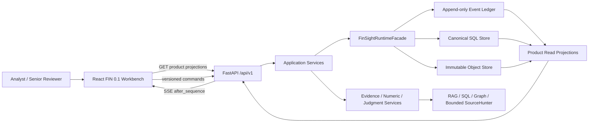
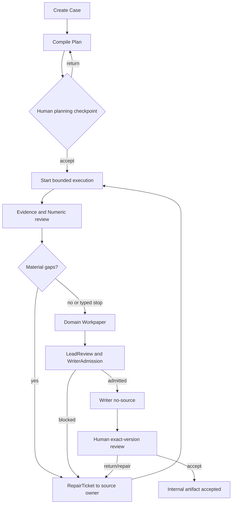

# REL-PROD-001：FIN 0.1 Internal Alpha 产品与工程详设

日期：2026-07-17
状态：`detailed_design_v1 / fixture_shadow_internal_development_admitted / FIN_0_1_release_blocked_by_RG1_vertical_path`

> 2026-07-31 阶段归属增量：S1–S4-T06 的真实执行显示，Case transfer、shared Runtime 架构、proof hermeticity 与 release engineering 必须分离。T05/T06 以 honest block 终态关闭，不能再用更多 Case live 修复来代替架构或 release 工作；T07 只做 current-worktree regression 和一次有界 NVDA revalidation，T08–T10 做 calibration/Human/closeout，S5 做 hermetic candidate、Git/rollback 和 RG1–RG5，完整 contract compiler 与 DELL/MU transfer completion 进入 FIN 0.2。本文的 L1、三案 R2、NVDA R3 和 release gate 未降低；当前只能形成 blocked candidate。详细边界以 `docs/architecture/repository/FIN_0_1_S1_TO_S5_STAGE_BOUNDARY_REBASELINE_20260731.zh-CN.md` 为准，机器可检验的任务归属以 `configs/releases/fin_ia_0_1_s1_to_s4_t06_stage_boundary_and_task_ownership_rebaseline_v1_0.json` 为准。

> 2026-07-25 验收增量：本文新增 `fin01.agent_acceptance.layered_hard_integrity_and_quality:v1` 的 runtime、artifact 与 stage 处置详设。机器合同见 `configs/releases/fin_ia_0_1_layered_agent_acceptance_standard_v1_0.json`。

## 0. 本文是什么

本文是 `REL-PROD-001 / FIN 0.1 Internal Alpha` 的详细设计和执行 source of truth。它把 PRD、TECH_01-10 和 Release 概设转换成可直接开发、测试和审批的说明。

上位概设 `RELEASE_FIN_IA_0_1_EXECUTION_PLAN_20260717.zh-CN.md` 只回答版本目标、范围、Point 顺序和 release gates；本文必须回答：

1. 用户在哪个页面完成什么动作；
2. 前端调用哪个 API，提交哪些版本和权限信息；
3. 后端调用哪个 RuntimeFacade command，读写哪个 canonical object；
4. 成功、等待、缺口、冲突和失败分别如何投影；
5. 每个 Point 需要改哪些代码、生成哪些 artifact、运行哪些测试；
6. `skeleton / fixture / full / calibrated` 各证明什么；
7. 什么条件阻断当前版本，什么进入 deferred backlog；
8. 失败时如何回滚且不改变 legacy global authority。

本文不表示 runtime 或 UI 已实现，也不授权 paid LLM、broad full-chain、生产 cutover、商业数据支出或真实客户数据。Point 01 已以 `POINT01_FOUNDATION_ALPHA_CONTRACT_RUNTIME_PROOF_COMPLETE` 开放仅限 fixture/shadow/internal development 的准入；FIN 0.1 release 仍要求 P07.5 的 RG1-RG5，且 RG1 必须补齐 entry-to-clean-child identity、一次 bounded operational vertical run 与 actual/oracle/reviewer/Workbench 结果。

机器可读执行清单：`configs/releases/fin_ia_0_1_detailed_execution_backlog_v1_1.json`（v1.0 保留为 historical/superseded）；Point 01 scope-closeout source 为 `configs/releases/point01_foundation_alpha_scope_closeout_decision_v1_0.json`。

## 1. 名词和责任边界

| 名词 | 在 FIN 0.1 中的准确含义 | 不代表什么 |
| --- | --- | --- |
| ResearchCase | 一项机构研究工作的稳定 identity、版本和 current heads | 一次聊天或一个模型 run |
| DecisionSurface | 需要回答的 10-20 个判断单元及其证据需求 | 六个固定标题或普通提纲 |
| EvidenceSlot | 某个 cell 为形成判断必须获得的证据合同 | 搜索关键词 |
| Candidate | RAG/SQL/graph/web 返回、尚未晋升的候选 | 可引用事实 |
| Evidence | 通过硬规则和语义分类、拥有 lineage 的材料 | reranker top-1 |
| NumericProgramTrace | 数字输入、单位、期间、公式、结果和复算记录 | LLM 心算说明 |
| Workpaper | 按 cell 组织的判断、证据、反方、缺口和 WWC | 搜索结果摘要或最终报告 |
| RepairTicket | 对一个已识别 gap 的有 owner、有预算、有 stop rule 的行动 | Lead/Writer 自由补源 |
| LeadReview | 对 coverage、冲突、故事线和 writer boundary 的 pack-level 审核 | Lead 覆盖 Evidence Gate 的硬失败 |
| WriterAdmission | Writer 可以消费的 exact pack/version boundary | Writer 自行搜索或取数 |
| Product surface | 用户能完成动作并看到状态的浏览器界面 | JSON、日志或静态截图 |
| Internal Alpha | 内部 analyst/senior 可重复使用的受限产品 | 客户可用、生产 SLA 或 enterprise security complete |

## 2. 当前代码基线与迁移判断

### 2.1 可以复用

- `apps/workbench/frontend`：React 19、TypeScript、Vite、Lucide 和现有样式基座；
- `apps/workbench/backend/app.py`：FastAPI app、SSE、run inspection 和部分 R53-R60 Workbench endpoints；
- `src/sec_agent/canonical_runtime`：Point 01 的 canonical models、store、RuntimeFacade、durable scheduler、checkpoint、permission、budget、HITL 和 event 基座；
- 现有 RAG、SQL exact-value、relationship/product graph、market/capital packs 和 bounded official-source adapters；
- P33-P36 fixture、人工 gold/workpaper 审计和 WorkBuddy 跨行业 calibration 结果。

### 2.2 不能直接当成 FIN 0.1 已实现

- 当前 `main.tsx` 约 3512 行，是多个历史功能的单文件应用；没有 FIN 0.1 route/module boundary；
- 当前 `app.py` 约 1115 行，主要 endpoints 仍是 generic run 或 `/api/r53-r60/*` projection；
- Point 01 Case/DecisionSurface objects 的 authority 和状态只证明 Foundation Alpha 边界，不等于 FIN 0.1 产品 workflow；
- M6 Evidence/Parser/Gate 多数结果仍是 skeleton/fixture/non-authoritative；
- 现有 memo、Workbench fixture 和 supervisor supplement 不得直接晋升为 release evidence。

### 2.3 迁移策略

采用同一 Workbench 内的增量迁移：

```text
现有 React/Vite app
  -> FIN 0.1 AppShell 和 /tasks、/cases routes
  -> 旧 panel 作为 legacy route/adapter 保留
  -> 新 route 只消费 /api/v1 product projections
  -> release 通过后再决定 archive 哪些 legacy panels
```

不建立第二套前端，不允许前端直接读 SQLite、run directory 或 Python object，不允许新 `/api/v1` 继续把所有逻辑写进 `app.py`。

## 3. 目标系统架构



### 3.1 单一真相原则

- TECH_01 写 ResearchCase/DecisionSurface 业务语义；
- TECH_02-05 分别写 Evidence orchestration/promotion、addressable candidates、Numeric、Domain Judgment；
- TECH_06 负责 command admission、durable execution、event、artifact envelope 和 state projection；
- TECH_09 写 review、presentation、artifact release 和 provenance 业务语义；
- 前端只提交 command、读取 projection，不写业务真相；
- `/api/v1` application service 只编排 owner，不复制 owner 规则。

### 3.2 新 lane authority

FIN 0.1 只对 feature-flagged internal Case lane 建立 canonical product path。legacy global authority 保留。任何 cutover 都必须 case-scoped、可回滚且不能产生 canonical/legacy 双 authoritative write。

## 4. 信息架构与路由

### 4.1 路由表

| Route | Surface | 主要对象 | 用户主要动作 |
| --- | --- | --- | --- |
| `/tasks` | Dashboard / Task Center | `TaskCenterRow[]` | 搜索、筛选、建 Case、打开 Case |
| `/cases/new` | New Research Task | `CreateCaseDraft` | 填问题、对象、as-of、语言、source policy、预算、reviewer |
| `/cases/:caseId/overview` | Case Overview / Plan | `CaseWorkspaceProjection` | 看状态、编辑 Objective、发起 plan compile、接受/退回计划 |
| `/cases/:caseId/decision-surface` | Decision Surface | `DecisionSurfaceView` | 查看/拆分/合并/增删 cell，审 owner/slot/stop rule |
| `/cases/:caseId/evidence` | Evidence & Numeric | `EvidenceWorkbenchView`、`NumericAuditView` | 筛选 candidate/promotion/gap，查看数值 lineage，reject/request repair |
| `/cases/:caseId/workpaper` | Workpaper & Repair | `WorkpaperView`、`RepairQueueView` | 审 judgment/counterevidence/WWC，创建和跟踪 repair，LeadReview |
| `/cases/:caseId/deliverable` | Deliverable & Review | `DeliverableReviewView` | 生成/打开 HTML/Markdown，comment/return/accept exact version |
| `/cases/:caseId/activity` | Activity & Trace | `ActivityTraceView` | 看 WorkUnit/Attempt/event，cancel/resume，按 claim/source 双向追溯 |

浏览器刷新必须能根据 URL 和 canonical current head 恢复页面。页面状态不能只保存在 React memory。

### 4.2 全局 App Shell

桌面布局固定为：

```text
Top bar: Case title | as-of | stage | evidence health | budget | run controls
Left nav: Tasks / Overview / Decision Surface / Evidence / Workpaper / Deliverable / Activity
Main canvas: 当前 surface
Right inspector: 当前 cell/evidence/number/claim/trace 的上下文详情
```

App Shell 必须提供：全局加载状态、Case version、未保存/版本冲突提示、permission denied、网络中断重连、当前 actor、Help/diagnostic trace id。不得用营销 hero、装饰型大卡片或嵌套卡片代替密集研究工作区。

## 5. 页面详设

### 5.1 Task Center

**输入**：`GET /api/v1/cases`。
**默认排序**：`awaiting_review > failed/typed_stop > running > updated_at desc`。
**列**：Case、对象、as-of、当前 stage、cell coverage、evidence health、待审数、运行状态、更新时间、owner。
**筛选**：状态、owner、sector、review state、has blocker、日期。
**动作**：New Case、Open、Resume、Archive；Archive 首版只允许已 terminal Case。
**空状态**：显示 New Case command，不展示样例假数据。
**失败状态**：显示 error code、trace id、retryability 和 next action。

### 5.2 New Research Task

必填字段：`research_question`、`entities/universe`、`as_of`、`language`、`output_target=internal_workpaper`。
可选字段：sector hint、source policy、time/tool/model budget、reviewer、special instructions。
校验：as-of 必须含时区；entity 必须完成 resolution 或明确 unresolved；不得在表单写入 API key；paid/model/network 默认 disabled。
提交成功：创建 Case v1 和 CaseControlSummary v1，跳转 Overview；不自动启动搜索。

### 5.3 Overview / Plan

显示 Objective、scope、as-of、Case owners、source/budget policy、current heads 和 stage history。
`Compile Plan` 生成 DecisionSurface candidate；`Accept Plan` 前必须显示：cell 数量、六个 mandatory families coverage、required slots、owners、forbidden substitutions、budget estimate、unresolved compile gaps。
Reviewer 可编辑 decision question、materiality、owner、slot required flag 和 stop rule；每次修改创建新 version，不覆盖旧版。
若 mandatory risk/numeric/writer boundary 被删除，UI 必须阻断并显示具体缺失项。

### 5.4 Decision Surface

主视图使用可排序 matrix，不使用自由白板作为唯一视图。每行一个 cell，至少显示：

- cell id/version、family、decision question、owner、materiality；
- evidence slot coverage；
- evidence quality、numeric sanity、judgment status、gap/repair status；
- counterevidence、WWC 状态；
- dependency、stale/superseded 标记和 next action。

点击 cell 打开 inspector，展示 EvidenceSlots、forbidden substitutions、dependencies、history。拆分/合并 cell 必须生成新 contract version，并在执行开始后走 impact assessment，不能原地修改正在运行的 input。

### 5.5 Evidence & Numeric

左侧按 cell/slot 筛选；中间显示 candidate 列表；右侧显示 source、chunk/section/table context、promotion reason、numeric trace。
Candidate badge 固定为 `candidate / accepted / context_only / rejected / typed_gap / commercial_gap`。
用户动作：Open source、Expand neighbor/section/table、Reject、Request repair、Mark reviewer-sensitive。
UI 不提供“强制 accepted”按钮。硬失败不能被 analyst/Lead override；只能修复来源或提交 waiver/human review 路径。
Numeric Drawer 必须显示 original value、normalized value、currency/unit/scale、period、table/row/column、formula inputs/result、sanity checks 和 supersession。

### 5.6 Workpaper & Repair

Workpaper 以 cell 为主，不按 agent 输出顺序拼接。每个 cell section 显示 conclusion、mechanism、evidence refs、numeric refs、counterevidence、confidence vector、gap、WWC。
Repair Queue 列：gap、materiality、impact、owner、attempts、budget、status、stop reason、affected cells。
`Request Repair` 必须选择 gap type 和目标 owner；Lead 可 triage/stop/reopen，但不能代替 Evidence/Parser/Domain owner 完成工作。
LeadReview 面板显示 coverage、cross-cell conflict、storyline、hard omission 和 WriterAdmission status。

### 5.7 Deliverable & Review

Deliverable 页面分为内容预览、claim list、comments/review、version history。
Writer 只消费 exact `DecisionSurfacePack + WriterBrief + approved refs + typed gaps`。生成按钮在 WriterAdmission 缺失、artifact input stale 或 material blocker 未处理时 disabled，并解释原因。
ReviewAction 类型：comment、return、request_repair、accept。每个 action 绑定 actor、target type/id/version/hash、timestamp 和 reason。
Accept 只接受当前 exact artifact version；新版本产生后旧接受自动显示 superseded，不迁移批准。

### 5.8 Activity & Trace

Activity 按 sequence 显示 WorkUnit、Attempt、tool/model stage、pause/resume/cancel、typed stop 和 repair causation。
Trace 提供两条方向：`claim -> cell -> evidence -> observation/tool -> parser/numeric -> gate`，以及 `source -> affected facts/claims/artifacts`。
默认不展示 raw CoT、完整 prompt、secret 或未脱敏 observation；展示结构化 action/observation summary 和 refs。

## 6. 端到端用户流程

### 6.1 主流程



### 6.2 局部恢复

当新 evidence 或 artifact head 变化时：

1. Runtime 先标记受影响 WorkUnit 为 `head_advanced_unassessed`；
2. dependency/impact evaluator 给出 continue、recompile/rebase、cancel/recreate 或 human review；
3. 前端显示 affected cells/blocks 和原因；
4. 只有新 ContextInjectionPlan/WorkUnit version 可恢复；
5. 旧 attempt 不得写入新 head。

### 6.3 Same-Case follow-up

首版只允许针对当前 Case 的 bounded follow-up，例如“为什么判断需求是真的”“哪项证据最弱”“什么会改变观点”。系统复用 exact CaseControlMemory/DecisionSurfacePack 和 as-of，不自动刷新外部源；若问题需要新数据，创建 RepairTicket 或明确 refresh_not_supported，而不是静默联网。

## 7. Product Read Models

这些对象是 UI projection，不是新的 business source of truth。

| Read model | 必备字段 | 来源 |
| --- | --- | --- |
| `TaskCenterRow` | case/version、title、entities、as_of、stage、run/review/blocker counts、owner、updated_at | TECH_01/06/09 projections |
| `CaseWorkspaceProjection` | objective、policy/budget、current heads、stage、owners、warnings、available actions | Case + Runtime + Review |
| `DecisionSurfaceView` | contract version、cells、slot coverage、status vectors、dependencies、history | TECH_01 + downstream summaries |
| `EvidenceWorkbenchView` | cell/slot candidates、promotion、authority、citation、gap、review actions | TECH_02/03/09 |
| `NumericAuditView` | facts、trace、formula、sanity、lineage、promotion | TECH_04/09 |
| `WorkpaperView` | cell judgments、counterevidence、WWC、confidence、refs、gaps | TECH_05/09 |
| `RepairQueueView` | GapRecord、ticket/attempt、owner、budget、stop、impact | TECH_01/02/04/05/06 |
| `DeliverableReviewView` | artifact/version/hash、presentation sections、claims、comments、attestations | TECH_09/06 |
| `ActivityTraceView` | execution view、events、causation、trace nodes/edges、redaction | TECH_06/09 |
| `QualitySummaryView` | RG status、R outcome、known gaps、review/time/cost/rollback | TECH_10 |

所有 read model 必须返回 `projection_version`、`source_head_refs`、`generated_at` 和 `stale`。前端不得把 projection 当作可写 canonical object。

## 8. API 详细合同

### 8.1 通用规则

- Base path：`/api/v1`；
- GET 返回 projection；POST 提交 command；不使用 PUT 覆盖 immutable version；
- mutation 必须携带 `Idempotency-Key` 和 `If-Match`/expected state version；
- tenant/project/actor/permission 由受信任的 server-side internal session/profile 解析，不能由浏览器任意声明；
- 成功 mutation 返回 `ResultEnvelope` 和新 projection link；
- 冲突返回 409，包含 current/expected version、affected object 和 reload/rebase next action；
- 所有错误包含 `error_code`、`message`、`trace_id`、`retryable`、`next_action`。

### 8.2 Case / Planning API

| Method / path | 用途 | Request | Response |
| --- | --- | --- | --- |
| `GET /cases` | Task Center 列表 | filters/cursor/limit | `TaskCenterRow[]` |
| `POST /cases` | 创建 Case | question/entities/as_of/language/policies/budget/reviewer | `ResultEnvelope + case_ref` |
| `GET /cases/{case_id}` | Case workspace | include=heads/actions | `CaseWorkspaceProjection` |
| `POST /cases/{case_id}/plan/compile` | 编译计划 | case_version/pack refs/compiler policy | candidate contract ref |
| `GET /cases/{case_id}/decision-surface` | 读取 matrix | exact/latest head | `DecisionSurfaceView` |
| `POST /cases/{case_id}/decision-surface/revisions` | 修改 cell/slot | base contract version + patch operations | new contract version |
| `POST /cases/{case_id}/plan-decisions` | accept/return | target contract/version/hash + reason | planning decision/event |

### 8.3 Execution API

| Method / path | 用途 |
| --- | --- |
| `POST /cases/{case_id}/runs` | 按 accepted plan 创建 WorkUnits 并启动 bounded run |
| `GET /cases/{case_id}/execution` | CaseExecutionView |
| `GET /cases/{case_id}/events?after_sequence=N` | cursor event page |
| `GET /cases/{case_id}/events/stream?after_sequence=N` | SSE reconnect stream |
| `POST /work-units/{id}/cancel` | 版本化 cancel command |
| `POST /work-units/{id}/resume` | exact checkpoint/context resume |
| `POST /work-units/{id}/retry` | 仅 retryable typed failure，创建新 Attempt |

### 8.4 Evidence / Numeric API

| Method / path | 用途 |
| --- | --- |
| `GET /cases/{case_id}/evidence` | 按 cell/slot/status/source/filter 返回 EvidenceWorkbenchView |
| `GET /evidence/candidates/{candidate_id}` | candidate + neighbor/section/table context |
| `POST /evidence/candidates/{candidate_id}/review-actions` | reject/reviewer-sensitive/request repair；无 force accept |
| `POST /cells/{cell_id}/evidence-expansions` | neighbor/section/table/metadata-filtered requery |
| `GET /cases/{case_id}/numeric` | NumericAuditView |
| `GET /numeric/traces/{trace_id}` | exact NumericProgramTrace |
| `POST /numeric/facts/{fact_id}/review-actions` | flag ambiguity/request parser repair |

### 8.5 Workpaper / Repair / Lead API

| Method / path | 用途 |
| --- | --- |
| `GET /cases/{case_id}/workpaper` | WorkpaperView |
| `GET /cases/{case_id}/repairs` | RepairQueueView |
| `POST /cases/{case_id}/repairs` | 从 exact GapRecord 创建 RepairTicket |
| `POST /repairs/{ticket_id}/decisions` | triage/stop/reopen/reassign within policy |
| `POST /cases/{case_id}/lead-reviews` | 创建 pack-level LeadReviewDecision |
| `POST /cases/{case_id}/writer-admissions` | exact pack/brief admission；hard blocker 时拒绝 |
| `POST /cases/{case_id}/followups` | bounded same-Case question |

### 8.6 Deliverable / Review / Trace API

| Method / path | 用途 |
| --- | --- |
| `POST /cases/{case_id}/deliverables` | writer no-source 生成 HTML/Markdown version |
| `GET /cases/{case_id}/deliverables` | artifact list/current head |
| `GET /artifacts/{artifact_id}/versions/{version}` | exact artifact/manifest |
| `POST /artifacts/{artifact_id}/versions/{version}/review-actions` | comment/return/request repair/accept |
| `GET /cases/{case_id}/reviews` | Review Queue / comments / attestations |
| `GET /cases/{case_id}/trace` | TraceGraphView，支持 claim/source start node |
| `GET /cases/{case_id}/quality` | QualitySummaryView |

## 9. 状态、事件与持久化

### 9.1 产品 stage projection

现有 Point 01 `CaseStatus` 只覆盖 foundation/planning authority，不应直接扩展成所有 UI stage。FIN 0.1 新增只读 `CaseWorkflowProjection.stage`：

```text
draft
planning
planning_review
ready_to_run
researching
evidence_review
judgment_review
writer_blocked
deliverable_review
accepted_internal
paused
failed_attention_required
archived
```

该 stage 由 current heads、WorkUnit states、review decisions 和 blockers 计算，不能由前端任意设置。Foundation authority 状态与产品 workflow stage 分开显示。

### 9.2 UI action eligibility

每个 projection 返回 `available_actions[]`，元素至少包含：`action_type`、`enabled`、`disabled_reason`、`required_role`、`expected_state_version`、`target_ref`。前端不得根据按钮名称自行推断权限或状态。

### 9.3 Event 类型

FIN 0.1 至少消费以下事件族：

- Case：`CASE_CREATED`、`CASE_CONTROL_REVISED`、`CASE_ARCHIVED`；
- Planning：`PLAN_COMPILED`、`PLAN_REVISED`、`PLAN_ACCEPTED`、`PLAN_RETURNED`；
- Execution：`WORK_UNIT_QUEUED/STARTED/PAUSED/RESUMED/SUCCEEDED/FAILED/CANCELLED`；
- Evidence/Numeric：`CANDIDATE_BUNDLE_CREATED`、`EVIDENCE_DECIDED`、`NUMERIC_TRACE_CREATED`、`GAP_RECORDED`；
- Repair/Judgment：`REPAIR_REQUESTED/ATTEMPTED/STOPPED/RESOLVED`、`JUDGMENT_VERSION_CREATED`；
- Lead/Writer：`LEAD_REVIEW_RECORDED`、`WRITER_ADMISSION_GRANTED/REJECTED`；
- Artifact/Review：`ARTIFACT_VERSION_CREATED`、`REVIEW_ACTION_RECORDED`、`ARTIFACT_ACCEPTED/SUPERSEDED`。

每个事件必须使用 TECH_06 EventEnvelope，包含 sequence、actor、causation/correlation、state before/after、payload ref/digest。SSE 只投影 event summary，不承担 durable truth。

### 9.4 SQL / ObjectStore

- SQL：identity、version metadata、current-head projection、event、review/action、idempotency、permission/budget refs；
- ObjectStore：DecisionSurface payload、CandidateBundle、NumericProgramTrace、WorkpaperPack、WriterBrief、HTML/Markdown、Trace graph snapshot；
- 大 payload 不进入 SSE 或 TaskCenter list；
- current head 是 projection，历史 ArtifactVersion 不删除、不覆盖；
- SQLite 作为 Internal Alpha store，repository/protocol 保持 PostgreSQL compatible；
- 本 release 不执行 production PostgreSQL cutover。

## 10. 前端工程详设

### 10.1 目标目录

```text
apps/workbench/frontend/vite/src/
  app/
    App.tsx
    router.tsx
    queryClient.ts
    SessionContext.tsx
  api/
    client.ts
    errors.ts
    generated.ts
    sse.ts
  features/
    task-center/
    case-overview/
    decision-surface/
    evidence-numeric/
    workpaper-repair/
    deliverable-review/
    activity-trace/
  shared/
    components/
    status/
    tables/
    inspector/
    formatting/
    test/
  styles/
```

现有 `main.tsx` 只保留 root bootstrap；历史 panels 移到 `features/legacy-*` 或独立 legacy route。禁止一次大重写后再接 backend；按 route 逐个迁移。

### 10.2 依赖和状态

- 路由：引入与 React 19 兼容的 `react-router-dom`，实际版本在 Point 02.0 lockfile freeze；
- server state：引入 `@tanstack/react-query`，query key 必须包含 case/version/projection；
- API types：从 FastAPI OpenAPI 生成 TypeScript types，CI 检查 drift；
- local state：仅保存筛选、未提交表单和 inspector selection；
- durable state：全部来自 API；
- icons：继续使用 Lucide；
- 首版不引入大型 UI framework，复用现有 CSS tokens并逐步模块化。

### 10.3 Mutation 规则

所有 mutation hook 必须：

1. 生成或复用 idempotency key；
2. 携带 exact target/version/expected state；
3. 禁止 optimistic authoritative state；可显示 pending，但成功前不假设新 head；
4. 409 时失效相关 query，显示 current/expected diff 和 reload/rebase；
5. 202/queued 时订阅 SSE 或 polling；
6. terminal event 后重新拉取 projection。

### 10.4 可用性和可访问性

- 1024px 和 1440px 为 release viewport；
- 表格固定列宽/最小宽度，动态内容不能挤压关键动作；
- 主要动作可键盘完成，focus 可见；
- 状态不能只靠颜色；
- 长文本、表格和 trace 支持复制 ref，但不暴露 secret/raw prompt；
- loading skeleton 不改变稳定布局；
- error/empty/permission/stale/superseded 都有组件级 fixture。

## 11. 后端工程详设

### 11.1 目标目录

```text
apps/workbench/backend/
  app.py                     # app composition only
  api/v1/
    cases.py
    planning.py
    execution.py
    evidence.py
    numeric.py
    workpaper.py
    deliverables.py
    reviews.py
    traces.py
    quality.py
    dependencies.py
    errors.py
  application/
    case_service.py
    planning_service.py
    execution_service.py
    evidence_service.py
    review_service.py
    projection_service.py
```

业务规则继续位于 `src/sec_agent` 对应 owner；backend application service 只负责 session/permission 解析、command envelope、service orchestration 和 DTO projection。

### 11.2 API 版本和兼容

- `/api/r53-r60/*` 与 generic `/api/runs/*` 在 FIN 0.1 期间保持 legacy；
- 新产品只消费 `/api/v1/*`；
- 不允许 `/api/v1` 把 legacy response 原样透传后命名为 canonical；
- API schema 变更必须更新 OpenAPI snapshot、generated frontend types 和 compatibility fixture；
- breaking change 在 Internal Alpha 也必须升 schema version，不静默改字段。

### 11.3 Projection 构建

ProjectionService 读取 exact canonical heads，校验 digest 后组装 UI read model。缺少 payload、digest mismatch、cross-tenant ref 或 unknown schema 时 fail-closed，不用空对象掩盖。Task list 不加载完整 payload；detail route 按需展开。

### 11.4 外部调用边界

API request 不直接执行长时间 retrieval/model/tool。它只创建 WorkUnit 并返回 queued result。worker/runner 使用 M5 capability、budget、lease 和 checkpoint 合同。外部 tool/model/network 未获得独立 permission/budget 时必须生成 typed stop，不在 HTTP request 内 fallback。

## 12. 身份、权限与责任

### 12.1 Internal Alpha 角色

| 角色 | 可做 | 不可做 |
| --- | --- | --- |
| Analyst | 建 Case、编辑 draft plan、启动受限 run、reject candidate、request repair、comment | override hard gate、签发 final acceptance、编辑 canonical evidence/numeric |
| Senior Reviewer | accept/return plan、审 Workpaper/Lead result、comment/return/request repair/accept artifact | 把 hard fail 改 accepted、伪造 source、复用旧 artifact approval |
| Lead Agent | compile/revise plan suggestion、dispatch、triage、pack-level review | 私有搜索、万能补源、override gate、最终 human accept |
| Evidence Agent | semantic classify、提出 repair | hard-rule override、直接写 memo |
| Writer | 使用 admitted pack 生成 artifact | 搜索、SQL、graph、SourceHunter、补数字 |
| Local Admin | 配置 internal profile/feature flag、看 ops | 代替 research reviewer 接受判断 |

Internal Alpha 暂不做 SSO/OA，但必须使用 server-configured local identity profile 生成 immutable ActorSnapshot。浏览器不得提交任意 actor/role 伪装审批者。

### 12.2 Review exactness

每次 review/approval 必须绑定 `target_type + target_id + target_version + content_hash + actor_snapshot + permission_snapshot`。target superseded、hash 不同、permission revoked 或 approval expired 时自动失效，不能迁移到新版本。

## 13. 错误与用户可见 next action

| Typed error | HTTP / UI | 用户 next action |
| --- | --- | --- |
| `validation_error` | 422，字段级提示 | 修正输入 |
| `permission_denied` | 403 | 联系管理员或选择允许动作，不重试 |
| `state_version_conflict` | 409 | reload diff，rebase 或取消本次编辑 |
| `stale_input` | 409/typed stop | 查看新 head，创建新 WorkUnit/version |
| `budget_exhausted` | 409/terminal | Lead 缩小范围或 human 调整预算 |
| `retrieval_exhausted` | 200 projection typed gap | neighbor/requery/SourceHunter 或披露 gap |
| `parser_gap` | 200 projection typed gap | parser repair，不写 source absent |
| `commercial_gap` | 200 projection terminal gap | 披露商业数据边界 |
| `writer_blocked` | 409 | 回到 LeadReview/Repair Queue |
| `artifact_superseded` | 409 | 打开 current version，旧 review 保留审计 |
| `internal_error` | 500 + trace id | 保持原状态，管理员查 trace；不自动重放 mutation |

### 13.1 Agent 分层校验、状态与恢复合同

Agent node validator 必须先判断错误属于哪一层，再决定是否 terminalize；不能继续把“字段过长”或“表达不够紧凑”统一映射为 `failed/failed/failed`。

| 层 | validator 输入 | canonical 记录 | 允许继续 |
| --- | --- | --- | --- |
| `L1 硬完整性` | Evidence/Fact/Claim/Numeric authority，scope/period/unit/attribution，canonical IDs，permission/tool/source boundary，process/terminal receipts，真实容量 envelope | typed hard failure code、earliest owner、restricted safe observation、原子 terminal truth | 否 |
| `L2 可恢复协议` | schema/cardinality/enum/representation、request-validator parity、可安全解析的格式 | retained output ref、recoverable subtype、repair owner、no-fact-change assertion | 是；若需要猜测事实、身份或权威则升级 L1 |
| `L3 分析质量` | relevance/causality/counterevidence/gap/WWC/material gain rubric | versioned quality finding、score、evidence refs、review disposition | 是；可进入 Writer/Verifier 和 paired review |
| `L4 用户适配与交付` | verbosity/tone/density/audience/rendering/review burden | profile-specific finding、controlled-edit receipt | 是 |

建议的 execution projection 增加：

```text
succeeded
succeeded_with_quality_findings
recoverable_partial
failed_attention_required
```

`succeeded_with_quality_findings` 只能用于所有必需节点与 Artifact 完成、L1 通过且仅有 L3/L4 finding 的 Run。`recoverable_partial` 表示已保留的节点输出仍有效，但 downstream node 或 Artifact 尚未完成；它不是 product-complete，也不能自动解锁依赖完整 Artifact 的任务。历史 canonical terminal truth 不回写；新分类通过独立 reassessment/ref 解释，未来行为必须经 versioned runtime alignment 后生效。

#### 13.1.1 字符、token 与容量

每个 text field 可同时有：

- `quality_target`：超过时记录 L3/L4 finding；
- `provider_wire_hard_bytes`：超过时属于 L1 transport capacity；
- `canonical_storage_hard_bytes`：超过时属于 L1 storage capacity；
- `security_redaction_hard_bytes`：无法安全持久化时属于 L1；
- `node_output_token_budget`：若耗尽导致 truncated/incomplete JSON 或必需字段缺失，属于 L1/L2 unrecoverable。

普通 per-field/aggregate 字符上限没有独立安全依据时不得作为 terminal hard gate。禁止 silent trim/drop、事实改写式摘要、captured-output rewrite 或把本地编辑后的正文标成 Provider 原始输出。受控编辑必须产生 source digest、edited digest、规则/actor、事实不变断言和 exact lineage receipt。

#### 13.1.2 模型与本地 deterministic owner

Provider-visible 合同优先只包含 scoped judgment atoms、closed aliases、refs、enums 和短 rationale。以下字段归本地确定性 owner：

- canonical Case/Run/Cell/Fact/Claim/WWC/Artifact IDs；
- dependency/conflict/gap 的结构骨架、排序、cardinality 与 cross-cell lineage；
- alias-to-canonical exact expansion；
- scope、epistemic、Numeric、permission 和 writer no-source 校验；
- Artifact manifest、terminal transaction 和 review binding。

同一 versioned contract 必须生成或驱动 Prompt schema、本地 validator、fake Provider 正负 fixtures 和 telemetry subtype；不得再维护互相漂移的手写副本。真实验证顺序固定为 `single-node canary -> bounded coherent exact-live -> paired comparison -> independent owner review`。

#### 13.1.3 Artifact 与 stage acceptance

验收记录至少分开：

1. `engineering_integrity`：runtime、identity、lineage、边界与 deterministic contract；
2. `product_completeness`：一条 coherent current-version exact Run 产生全部任务要求的 Artifact；
3. `research_quality`：四层 artifact review 和同输入 baseline comparison；
4. `owner_acceptance`：授权 owner 绑定 exact artifact version/digest。

跨 Run 的 evidence composition 只能提高单项 capability maturity，不能合成一套不存在的 Run/Artifact，也不能替代 product completeness、paired comparison 或 owner acceptance。L3/L4 债务可带 owner、截止点和 profile disposition 后前移；L1 缺陷、缺失的任务级 Artifact、未完成的 comparison 或未发生的 owner acceptance 不得通过改名为 quality debt 放行。

## 14. Point 02-07 详细执行拆分

每个 execution point 都必须能够提供四类 maturity 证据，但四类 maturity 不是逐项串行审批流水线。当前版本列车只要求每个 EP 达到当周 overlay 声明的 `current_train_required_stage`；未满足最终 Point closeout gate 时仍不能写 `Point complete`。

| Stage | 必须产生 | 不能证明 |
| --- | --- | --- |
| skeleton | schema、interface、route、empty/fail-closed path、owner boundary | 真实 workflow 可用 |
| fixture | deterministic 正负例、component UI/API、固定 artifact | 真实依赖/Case 质量 |
| full | 本 Point 声明范围内真实 store/service/adapter/UI 路径 | Anchor calibrated 或 release ready |
| calibrated | Anchor/regression/human review 与目标 metric | production readiness |

执行语义由 `configs/releases/fin_ia_0_1_vertical_release_train_overlay_v1_0.json` 补充：

- Point/backlog 负责能力归属和最终 closeout；overlay 负责四周版本列车的实际依赖顺序；
- downstream skeleton/fixture 可以消费 upstream 的 exact tranche artifact，downstream full 只能消费 overlay 明确允许的 upstream full subset；
- tranche artifact 必须带 schema/version/digest/producer/consumer，不能靠聊天记忆或默认路径传递；
- integration probe 必须穿过真实产品 entry 和实际 consumer seam；纯常量比较、只 parse manifest 或只测 producer 不算跨 owner 证明；
- 一个 EP 可以在 W1 先交付 3-cell full subset，在 W2/W3 扩为 Point closeout 所需的 10-20 cell calibrated evidence；前者不能冒充后者；
- review finding 必须引用当前 tranche 的 acceptance、RG1-RG5 或 P0 数据/权限/证据安全底线。未来路径 hardening 不得持续阻塞当前用户工作流。

### 14.1 Point 02：Case / Plan / Product Entry

| EP | 内容 | 主要输出 | Point 02 closeout 必需 |
| --- | --- | --- | --- |
| `P02.0` | 冻结 child plan、OpenAPI、route、projection、feature flag、authority/rollback | schema/API/UI map | 是 |
| `P02.1` | Case/TaskCenter application service 和 `/api/v1/cases` | Case create/list/detail | 是 |
| `P02.2` | React AppShell、router、query client、generated types、error/status primitives | 可导航 frontend shell | 是 |
| `P02.3` | New Case、Task Center、Overview | F01/F02 UI | 是 |
| `P02.4` | Plan compiler adapter、DecisionSurface read/revision/decision API 和 UI | F03 planning checkpoint | 是 |
| `P02.5` | WorkUnit create/cancel/resume、event projection/SSE 和 Activity UI | F04 execution visibility | 是 |
| `P02.6` | 3-cell thin vertical 后扩展为 10-20 cell P36 plan；SaaS/Bank structural fixtures | calibrated Point 02 evidence | 是 |

Point 02 full acceptance：用户从 UI 创建 Case、编译并修改计划、接受 plan、启动/取消一个 bounded WorkUnit、刷新页面恢复状态；无 JSON 手工操作；legacy authority 未改变。

### 14.2 Point 03：Evidence Addressing / Retrieval / Repair

| EP | 内容 | 主要输出 | Closeout 必需 |
| --- | --- | --- | --- |
| `P03.0` | 冻结 EvidenceRequest/CandidateBundle/Gap/SourceHunter API 和 top-K policy | contract package | 是 |
| `P03.1` | 从 exact slot 编译 EvidenceRequest，接入 Tool Registry/Planner 和 permission/budget | request/plan/runtime receipt | 是 |
| `P03.2` | 接 internal RAG/SQL/graph，metadata filter、rerank、neighbor/section/table expansion | CandidateBundle | 是 |
| `P03.3` | Evidence Workbench projection、filter、candidate inspector、reject/request repair UI | F05/F06 surface | 是 |
| `P03.4` | SourceHunter trigger、supervisor supplement ledger、typed/commercial gap、bounded RepairTicket | repair/source boundary | 是 |
| `P03.5` | P36 代表 slots full run；retrieval precision/coverage、one neighbor/table repair 校准 | Point 03 closeout | 是 |

Point 03 不以“有 top-K”通过；必须证明每个 required slot 有 CandidateBundle、RejectedCandidateLedger 或 attempt-backed gap，且 supplement 不冒充 runtime evidence。

### 14.3 Point 04：Parser / Numeric / Promotion

| EP | 内容 | 主要输出 | Closeout 必需 |
| --- | --- | --- | --- |
| `P04.0` | 冻结 ParserCandidate/Fact/Trace/Promotion/FactTable schema 和 source profiles | contract package | 是 |
| `P04.1` | SEC structured fact + table fact normalization、row/unit/period/scale/coordinate | NormalizedNumericFact | 是 |
| `P04.2` | 基础 derived metrics、cell-scoped metric、NumericProgramTrace 执行与复算 | trace/registry | 是 |
| `P04.3` | deterministic hard gate + semantic suggestion + conflict/false-promotion controls | PromotionDecision | 是 |
| `P04.4` | Numeric Drawer/Fact Table/API、ambiguity and repair actions | F07 surface | 是 |
| `P04.5` | P36 material numbers + unit/scale/period/row negative corpus 校准 | Point 04 closeout | 是 |

Point 04 release invariant：100% material numbers 有 trace 或明确 estimate/cannot-infer/commercial-gap；零已知 false promotion。

### 14.4 Point 05：Judgment / Workpaper / Repair / Lead

| EP | 内容 | 主要输出 | Closeout 必需 |
| --- | --- | --- | --- |
| `P05.0` | 冻结 DomainOperatorTask/CellEvidencePack/Judgment/Workpaper/LeadReview/WWC contract | contract package | 是 |
| `P05.1` | domain projection、operator activation、bounded loop 和 judgment status/confidence | DomainCellJudgmentPack | 是 |
| `P05.2` | 按 cell 聚合 Workpaper、counter-thesis、WWC program、dependency mechanism | WorkpaperPack | 是 |
| `P05.3` | Gap dedupe、RepairTicket/Attempt lifecycle、source-owner routing、resume | repair closure/stop | 是 |
| `P05.4` | cross-cell conflict/coverage/story LeadReview、WriterBrief/Admission | LeadReviewDecision | 是 |
| `P05.5` | same-Case follow-up context compile、bounded answer 和 refresh-needed stop | F14 path | 是 |
| `P05.6` | Workpaper/Repair/Lead/follow-up UI 与 P36 full 10-20 cells reviewer calibration | Point 05 closeout | 是 |

Point 05 不接受 specialist prose 直接拼 memo；全部 required cells 必须 accepted、typed/commercial gap 或 human review terminal。

### 14.5 Point 06：Writer / Deliverable / Review / Provenance

| EP | 内容 | 主要输出 | Closeout 必需 |
| --- | --- | --- | --- |
| `P06.0` | 冻结 WriterAdmission/Presentation/Artifact/Review/Trace schema 和 rendering boundary | contract package | 是 |
| `P06.1` | WriterBrief exact input compiler、writer no-source sandbox 和 blocker | admitted writer run | 是 |
| `P06.2` | CanonicalPresentationModel、HTML/Markdown renderer、version/hash consistency | artifact versions | 是 |
| `P06.3` | ReviewAction/DecisionAttestation、comments、return/repair/accept exact version | review ledger | 是 |
| `P06.4` | material claim bidirectional provenance、redaction、TraceGraph projection | trace manifest | 是 |
| `P06.5` | Deliverable/Review/Trace UI 整合、P36 artifact review、HTML/MD parity | Point 06 closeout | 是 |

Writer 的 source/tool/SQL/graph call count 必须为 0。新 artifact version 不继承旧接受。

### 14.6 Point 07：Dogfood / Eval / Release

| EP | 内容 | 主要输出 | Closeout 必需 |
| --- | --- | --- | --- |
| `P07.0` | 冻结 release candidate、exact code/config/schema/prompt/data refs 和 test manifest | RC manifest | 是 |
| `P07.1` | P36 完整 internal dogfood 与 senior review | Anchor R2 evidence | 是 |
| `P07.2` | SaaS/Bank structural regression，不继承 WorkBuddy facts | regression evidence | 是 |
| `P07.3` | time-to-workpaper、review burden、repeated work、cost、UI performance/accessibility | RG4 evidence | 是 |
| `P07.4` | rollback drill、known-gap/deferred ledger、release note | RG5 evidence | 是 |
| `P07.5` | 独立运行 RG1-RG5，签发 ReleaseGateDecision | FIN 0.1 closeout | 是 |

只有 `P07.5` 可以宣布 `FIN_0_1_INTERNAL_ALPHA_RELEASED`；仍保持 `production_readiness=not_admitted`。

## 15. 测试详设

### 15.1 Fast

- Python schema/serialization/pure policy；
- TypeScript typecheck、Vite build、OpenAPI generated type drift；
- route, reducer, status/error components；
- writer no-source、promotion hard fail、numeric sanity、idempotency/version conflict；
- 每次提交运行，外部调用和 persistent business mutation 为 0。

### 15.2 Component

- FastAPI route -> application service -> RuntimeFacade -> SQLite/ObjectStore projection；
- React component 使用 mocked HTTP，不直接 mock business owner internals；
- SSE reconnect/duplicate cursor；
- stale/superseded/permission/budget/typed-gap negative cases；
- 每个 Point 合并前运行。

### 15.3 Operational

- 一个 bounded internal Case；
- 一个 RAG、一个 SQL、一个 graph、一个 official-source route，权限不足则 typed stop；
- one repair/resume、one cancel、one stale rebase、one rollback；
- 需独立 permission/budget approval；不默认 paid model/full-chain。

### 15.4 Release / Browser E2E

Playwright 覆盖：

```text
create Case
 -> compile/edit/accept plan
 -> start run and observe activity
 -> inspect evidence and numeric trace
 -> reject one candidate and request repair
 -> inspect workpaper/WWC
 -> LeadReview/WriterAdmission
 -> generate HTML/Markdown
 -> comment/return or accept exact artifact
 -> trace one material claim
 -> ask one bounded follow-up
```

在 1024x768 和 1440x900 检查关键控件无遮挡、表格不破坏布局、error/typed gap 可见。E2E 使用固定 internal fixture/approved bounded Case；不得用测试脚本直接改数据库跳过 UI action。

## 16. 四周执行节奏与并行关系

四周从 `REL-FND-001` entry gate 通过后的下一个工作日开始，不把等待 gate 的时间算入产品列车。

| 周次 | WS-A Research Control & Product | WS-B Integrity & Judgment | WS-C Workbench & Quality | 周末必须可演示 |
| --- | --- | --- | --- | --- |
| W1 | P02 AppShell/Case/Plan/Activity | P03 request/retrieval thin path | Task/Plan/Evidence UI primitives | UI 建 Case、审 plan、跑 3-cell thin path、看 candidate |
| W2 | execution/state hardening | P03 full + P04 Numeric + P05 judgment skeleton | Evidence/Numeric/Workpaper UI | 10-20 cells 有 evidence/numeric/judgment terminal projection |
| W3 | repair/resume/follow-up | P05 full、LeadReview、Writer boundary | P06 deliverable/review/trace | P36 从 Case 到可审 HTML/Markdown 完整运行 |
| W4 | blocker/root-cause/rollback only | regression and data-quality fixes | P07 E2E/dogfood/release evidence | RG1-RG5 candidate；不加新功能 |

本表只给周级方向。每个 execution point 的 first-consuming tranche、当周 maturity、integration probe 和 deferred 项，以 vertical release train overlay 为机器可读执行源。

### 16.1 时间不足时的取舍顺序

可减：非 material slots、source provider breadth、图表数量、视觉 polish、第二个外部 source fallback。
不可减：Task/Case/Plan UI、Evidence/Numeric gate、Workpaper/Repair、Lead/Writer boundary、Human Review、material provenance、rollback、P36 六个 families。
若 W2 末仍没有 3-cell full vertical，停止横向扩功能，集中修最早 faulty artifact；不靠增加 defensive gate 或继续写 fixture 假装扎实。

## 17. Definition of Ready / Done

### 17.1 Point 02 开发准入（不是发布准入）

- `REL-FND-001 = POINT01_FOUNDATION_ALPHA_CONTRACT_RUNTIME_PROOF_COMPLETE`，且 `operational_qualification=not_qualified_deferred_to_REL_PROD_001_RG1`；
- ReleaseContract v1.2、FeatureScope、本文和 backlog v1.1 digest 冻结；
- feature flag、rollback target、local identity profile、SQLite path、object store path 明确；
- P36 input/as-of/supplement boundary、SaaS/Bank structural fixture 冻结；
- `/api/v1` OpenAPI baseline 和 frontend dependency decision 经 review；
- model/tool/network 默认为 disabled，任何开启单独批准；当前准入仅允许 fixture/shadow/internal development，不创建 operational authority/receipt。

### 17.2 FIN 0.1 Done

- 15 个 feature IDs 和 7 个 surfaces 全部存在且浏览器 E2E 可操作；
- P36 10-20 required cells 终态，六个 families 无 hard omission；
- Anchor R2、SaaS/Bank structural regression 通过；
- material numeric trace 和 claim provenance 100%；
- known false promotion=0，writer source/tool calls=0；
- 一轮真实 senior review、一次 repair/resume、一次 follow-up、一次 rollback；
- exact ReleaseEvidenceManifest 和 ReleaseGateDecision；
- `production_readiness=not_admitted`、legacy global authority retained。

## 18. 明确 deferred 与后续决策

不阻断 FIN 0.1：移动端、客户级 visual system、SSO/OA、Data Room、R4 monitoring、PPT/Word/Excel/PDF、完整估值/consensus、实时市场/衍生品、多租户 production。
必须在 Point 02.0 冻结但当前不替用户暗定：frontend router/query/openapi 工具的 exact version、local identity profile 管理方式、SQLite/ObjectStore release path、Case-scoped feature flag 名称、Playwright fixture seed 和 API pagination limits。

上述项目是技术选择，不改变产品范围；执行者必须在 P02.0 写 ADR/lockfile/schema，不得在实现中静默决定。

## 19. Traceability

- 产品来源：PRD B0、B2、B3 bounded、B7，Feature `P001-F01`-`F15`；
- 技术 owner：TECH_01-10；TECH_11 deferred；
- Foundation：Point 01 canonical registry、RuntimeFacade、durable harness；
- Release 概设：`RELEASE_FIN_IA_0_1_EXECUTION_PLAN_20260717.zh-CN.md`；
- Machine backlog：`configs/releases/fin_ia_0_1_detailed_execution_backlog_v1_0.json`；
- Release gate：RG1-RG5。

## 20. 下一步唯一入口：P02.0 启动 Runbook

本节不是建议列表，而是 `REL-FND-001` narrow scope closeout 后必须按顺序执行的首个工作包。`P02.0` 不实现业务功能；它把 Point 02 的代码入口、authority、依赖、API 和验收冻结到足以安全并行开发。当前仅允许 fixture/shadow/internal development；不得把本节视为 FIN 0.1 release admission，或绕过 RG1 operational vertical-path debt。执行者不得跳过本节直接修改 `main.tsx`、新增临时 API 或创建第二套 Case 状态。

| 顺序 | Owner | 必须读取 | 实际动作 | 必须产出 | 通过标准 | 失败时 |
| --- | --- | --- | --- | --- | --- | --- |
| T01 | Release owner | Point 01 scope-closeout decision、ReleaseContract v1.2、FeatureScope、本文、backlog v1.1 | 校验 fixture/shadow/internal development entry，记录 exact Git/config/schema refs、RG1 debt 和 legacy authority head | `point02_entry_preflight.json` | narrow closeout 已写入；production 仍 not admitted；legacy authority retained；RG1 debt 已登记 | 任何试图把开发准入当 release/operational authority 时停止 |
| T02 | TECH_06 | Point 01 RuntimeFacade/store/object-store/feature flags | 冻结 FIN 0.1 new lane authority、SQLite/ObjectStore 路径、transaction boundary、rollback target | `ADR_POINT02_AUTHORITY_ROLLBACK.md` | 所有写入只经 RuntimeFacade；rollback 可恢复 legacy head | authority 或 rollback 不唯一则 stop |
| T03 | TECH_01 + TECH_06 | canonical registry、TECH_01/06 | 选择 Point 02 使用的 Case、Objective、DecisionSurface、Cell、WorkUnit、Event、Artifact 版本；标明 create/read/update owner | `point02_canonical_object_subset_v1.json` | 每对象只有一个 authority，legacy projection 只读 | 出现平行 object/state model 则 reject |
| T04 | TECH_09 | 第 4-7、12-13 节 | 冻结 8 routes、10 read models、action eligibility、typed error 和 empty/loading/stale/permission 状态 | `point02_route_surface_map_v1.json` | 每条 route 的 query/action/state/owner 均完整 | 只写页面名称或 mock-only 状态则 reject |
| T05 | TECH_06 + TECH_09 | 现有 `package.json`、Vite/React code | 选择 router、query/cache、OpenAPI type generation、component/E2E test 工具的 exact versions，并确认 license/build | lockfile + `ADR_POINT02_FRONTEND_DEPS.md` | clean install/typecheck/build 可复现 | 依赖未锁定、重复 state library 或 build 不可复现则 stop |
| T06 | TECH_01 + TECH_06 | 第 7-9、11 节 | 发布 `/api/v1` Case/Planning/Execution/Activity OpenAPI baseline，定义 idempotency、expected version、pagination、SSE cursor 和 typed error | `openapi_fin_0_1_p02_v1.yaml` + generated TS types | schema lint；TS generation 无手写漂移；forbidden direct-store route tests pass | 前端需读取文件/DB，或 mutation 无版本合同则 reject |
| T07 | TECH_10 | P36 case contract、SaaS/Bank structural fixtures、测试第 15 节 | 冻结 seed、expected structural outputs、negative corpus、fast/component/operational/browser test manifests | `point02_fixture_and_test_manifest_v1.json` | P36 3-cell thin + 10-20-cell target、SaaS/Bank 结构测试均有 owner/oracle | 继承 WorkBuddy facts、fixture 无 oracle 或需 paid/full-chain 才能执行则 reject |
| T08 | TECH_01/06/09/10 reviewer | T01-T07 全部产物 | 做 cross-owner review：功能、route、read model、command、event、store、test、rollback 逐项映射 | `point02_cross_owner_review_v1.json` | 无 owner gap、循环依赖、并行 source of truth 或隐含 authority | 发 RepairTicket 回到对应 owner，不由 reviewer 临时补实现 |
| T09 | Release owner | T01-T08 exact digests | 运行 `P02.0` closeout gate，签发 immutable decision | `P02_0_CLOSEOUT_DECISION.json` | 仅 `P02.1` 与 `P02.2` 变为 ready；其他 EP 仍按依赖 blocked | 任何 gate fail 时保持 Point 02 not started |

### 20.1 P02.0 既有冻结证据与 VT0 修复状态（2026-07-18）

`P02.0` 已产生一组 `contract and dependency freeze` 证据：`data/manifests/point02_entry_preflight_v1_0.json`、`ADR_POINT02_AUTHORITY_ROLLBACK_20260718.md`、`configs/releases/point02_*_v1_0.json`、`data/manifests/point02_cross_owner_review_v1_0.json` 与 `data/manifests/point02_closeout_decision_v1_0.json`。独立复核发现 route action、canonical command/read model、OpenAPI operation/schema 和 owner set 尚未逐项闭合，因此既有 closeout 只保留为 historical candidate evidence，当前不得视为已批准的 P02.0 closeout。

本次 T05 是 `design_pinned_not_installed_no_network`：router/query/OpenAPI/test 依赖只定义版本族与后续 exact-lock 时点，未安装、未联网，也没有 clean-install/build 证据。T09 只把 `P02.1`、`P02.2` 标为 `ready_for_skeleton_fixture_internal_development_only`；它们仍需新的 execution approval，不能据此启动 runtime、operational profile、browser profile 或 release。

下一步只能在原 `P02.0` 内执行一次 bounded set-closure repair；不得新建 milestone、package family 或 gate family。修复失败时保持 `P02.0 not approved`，不启动 `P02.1/P02.2`，也不自动派生第二轮 repair。VT0 独立复核通过后的第一批并行只包含：

1. `P02.1`：后端 Case/TaskCenter application service；
2. `P02.2`：前端 AppShell/router/typed API/state primitives。

二者的后续实施均须先获得独立 execution approval；二者都完成 fixture stage 后，才允许启动 `P02.3` 和 `P02.4`。`P02.5` 必须等待 Case、AppShell、DecisionSurface 三者的 versioned contracts；`P02.6` 只做 Point 02 closeout，不能提前拿 skeleton/fixture 宣布完成。
