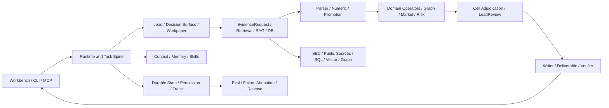
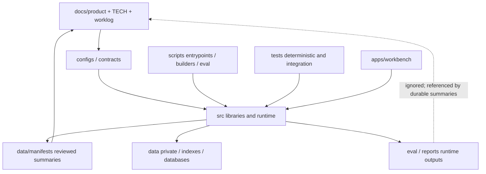

# FinSight Repository Architecture Map

生成方式：`python scripts/engineering/build_repository_architecture_inventory.py`。

Schema：`finsight_repository_architecture_inventory_v0_1`；digest：`e1b9986df60747c9fa928d11be6e749a6cb3d26aae9f09484d6efea458fa2581`。

## 1. 使用边界

本图由静态 AST import、文档/配置路径引用和文件元数据生成。动态 import、字符串拼接路径、外部 scheduler 和人工运行命令可能无法完全识别；`review_candidate` 只表示需要人工审查，不等于可删除。

## 2. 仓库摘要

- 节点：1732；引用边：7486。
- Python parse errors：0。
- stable entrypoint 可达节点：934。
- 缺失 stable entrypoints：0。
- review candidates：0。

| Kind | Files |
| --- | ---: |
| `app` | 25 |
| `archive` | 6 |
| `build_config` | 9 |
| `config` | 91 |
| `documentation` | 780 |
| `script` | 310 |
| `source` | 216 |
| `test` | 295 |

| Classification | Files |
| --- | ---: |
| `active_script` | 279 |
| `active_source` | 316 |
| `archived` | 9 |
| `canonical_contract` | 16 |
| `historical_audit` | 632 |
| `legacy_compatible` | 27 |
| `manual_entrypoint` | 2 |
| `phase_fixture` | 36 |
| `product_surface` | 25 |
| `runtime_config` | 91 |
| `superseded_compatible` | 4 |
| `test_asset` | 295 |

## 3. 功能关系图

## 4. 目录与引用职责

## 5. 复杂度热点

| Path | Lines | Bytes | Incoming | Tests | Classification |
| --- | ---: | ---: | ---: | ---: | --- |
| `scripts/cloud/sec_agent_interactive.py` | 10794 | 482022 | 58 | 9 | `active_script` |
| `src/sec_agent/langgraph_orchestrator.py` | 9290 | 462987 | 125 | 24 | `active_source` |
| `src/sec_agent/multi_agent_runtime.py` | 8963 | 418321 | 81 | 13 | `active_source` |
| `src/sec_agent/memo_llm.py` | 7279 | 358915 | 54 | 5 | `active_source` |
| `scripts/eval_multi_agent/eval_multi_agent_real_llm_chain.py` | 6317 | 290002 | 41 | 4 | `active_script` |
| `src/sec_agent/multi_agent_contracts.py` | 5238 | 253147 | 60 | 4 | `active_source` |
| `src/sec_agent/specialist_llm.py` | 4331 | 185114 | 55 | 4 | `active_source` |
| `src/sec_agent/humanmade_gold_set_runtime.py` | 4137 | 209318 | 24 | 5 | `active_source` |
| `scripts/eval_sec_benchmark/run_sec_eval_synthesis_qwen9b_backend.py` | 3799 | 174643 | 7 | 4 | `active_script` |
| `src/sec_agent/p34_lane_quality_runtime.py` | 3545 | 177315 | 29 | 5 | `phase_fixture` |
| `apps/workbench/frontend/vite/src/main.tsx` | 3512 | 132181 | 13 | 0 | `product_surface` |
| `src/sec_agent/research_lead_llm.py` | 3272 | 152955 | 28 | 1 | `active_source` |
| `scripts/data_expansion/build_product_taxonomy_kpi_parser.py` | 2875 | 130021 | 4 | 1 | `active_script` |
| `scripts/eval_retrieval/eval_milvus_retrieval_ab.py` | 2291 | 99245 | 10 | 1 | `active_script` |
| `scripts/data_expansion/build_broad_official_careers_context_rows.py` | 2236 | 98514 | 11 | 1 | `active_script` |
| `src/sec_agent/r53_r60_research_to_quant_lab.py` | 2218 | 96864 | 23 | 3 | `legacy_compatible` |
| `scripts/eval_sec_benchmark/run_sec_benchmark_eval.py` | 1985 | 83203 | 10 | 3 | `active_script` |
| `src/sec_agent/r53_r60_data_ingestion_retrieval_control_plane.py` | 1959 | 92214 | 10 | 2 | `legacy_compatible` |
| `src/sec_agent/r53_r60_quality_engineering_online_eval.py` | 1922 | 83024 | 8 | 2 | `legacy_compatible` |
| `apps/workbench/frontend/package-lock.json` | 1872 | 61629 | 2 | 0 | `product_surface` |

复杂文件不是自动 archive 候选。超过阈值的核心 runtime 应优先拆 pure contracts、selectors、state transitions 和 adapters，并以 characterization tests 保护行为。

## 6. 数据、RAG、向量与数据库资产

| Asset type | Count |
| --- | ---: |
| `database` | 78 |
| `index_artifact` | 40 |
| `lexical_index` | 19 |
| `manifest` | 497 |
| `vector_index_or_metadata` | 3 |

完整路径、大小和 metadata 位于 `data/manifests/repository_architecture_inventory_v0_1.json` 的 `data_assets`。私有 raw data、索引和数据库不进入 Git；这里只跟踪元数据和可复现入口。

## 7. Review Candidates

以下仅表示静态图中没有稳定入口可达、test 或其他引用。动态调用仍需人工确认。

| Path | Kind | Classification | Incoming |
| --- | --- | --- | ---: |
| _none_ | | | 0 |

## 8. 持续维护规则

1. 新增/移动 source、script、test、TECH 或 manifest 后重跑 inventory builder。
2. CI 比较 inventory digest、parse errors、stable entrypoint 缺失和新增 review candidates。
3. archive 前必须有零 runtime/test/doc 引用、替代入口、迁移说明和 targeted tests。
4. generated outputs 只保留 summary/manifest/ref，不把 raw eval、index、database 或 private data 加入 Git。
5. 单文件超过 warning threshold 时创建 complexity debt；超过 critical threshold 时原则上禁止继续堆新职责，除非有明确例外和拆分计划。
