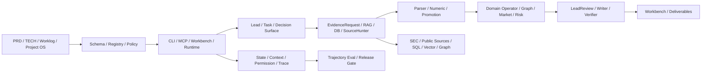

# FinSight-Agent 项目深度审计与 PRD/TECH 对齐

日期：2026-07-11

状态：`audit_completed_with_open_contract_and_test_isolation_gaps`

## 1. 审计目标与边界

本轮根据 PRD、TECH_00-11、P32-P36 工作记录和 Project OS，对仓库做静态结构、测试、数据资产、复杂度、清理和 vNext 对齐审计。

本轮没有运行 paid LLM、true full-chain、外部 source ingestion、parser promotion 或生产 Workbench replay。文档、fixture、旧 R53-R60 slice 和本地数据资产不自动等于 vNext runtime 已消费新合同。

## 2. 仓库整理结果

### 2.1 已清理

- 删除仓库内 `.tmp_*`、`tmp/`、`.pytest_cache/`、`.ruff_cache/` 和递归 `__pycache__/`。
- 共清理 69 个生成目标，释放约 1.46 GB。
- 未删除 `eval/`、`reports/`、数据库、RAG/index、Milvus、raw/private data 或历史审计证据。

### 2.2 已归档

以下 v0.1 检索原型无当前 runtime/test/package export 引用，已迁入 `archive/code/v0_1_retrieval_prototypes/`：

- `src/eval/multifacet_retrieval_eval.py`
- `src/eval/object_verifier.py`
- `src/indexing/build_dense_index.py`
- `src/retrieval/facet_aware_retriever.py`

归档保留迁移说明，不允许 active runtime 反向依赖 archive。`HybridRRFRetriever`、8-K parser、connector 和当前 Workbench 运维脚本因仍有导出、入口或兼容价值而保留。

### 2.3 未执行的高风险清理

- 未根据文件名、版本号或静态不可达结果批量删除代码。
- 未清理大型数据资产；它们需要 lineage、freshness、authority 和复现入口审计后再决定 supersession。
- 未重写历史 worklog 或 fixture，因为它们是当前问题追溯链的一部分。

## 3. 可维护引用图

新增 `repository_architecture_inventory.py`，扫描 Python AST import、文档/配置路径引用、前后端/Java 文件、stable entrypoint reachability、数据资产元数据和复杂度热点。

当前自动图包含：

- 1,690 个代码、脚本、测试、文档、配置、应用和 archive 节点；
- 7,302 条 `python_import` / `path_reference` 边；
- 885 个从稳定入口可达的对象；
- 0 个 Python parse error；
- 0 个缺失 stable entrypoint；
- 0 个未裁决 review candidate；2 个手工入口和 4 个 superseded-compatible skill 已显式登记；
- 完整边表位于 `data/manifests/repository_architecture_inventory_v0_1.json`。

自动图必须在新增、移动、归档 source/script/test/TECH 或 manifest 后重建。它能回答“谁静态引用谁”，但动态 import、外部 scheduler、运行时对象消费仍需 trace 补足。

## 4. 当前代码已落能力

| 能力域 | 已有代表性实现 | 当前成熟度判断 |
| --- | --- | --- |
| 入口与产品面 | CLI、graph runner、context session CLI、MCP server、Workbench backend/frontend | 可运行资产存在；新 vNext 对象未统一投射 |
| 调度与多 agent | LangGraph orchestrator、multi-agent runtime、Research Lead、specialist、aggregate、writer、verifier | 旧 role/memo-slot 链成熟度高于 DecisionSurface-first 链 |
| 工具与权限 | tool registry/controller、MCP contracts、sandbox/approval fixtures | 局部实现；ToolGateway 尚未成为所有调用的唯一门面 |
| 检索与数据 | SEC/8-K、BM25/ObjectBM25/FTS/dense/Milvus、source route、exact-value ledger | 召回资产丰富；metadata filter、reranker、table/numeric promotion 未统一闭环 |
| 图谱与领域 pack | ProductIntelligenceGraph、relationship graph、capital macro、secondary market | 关系和上下文丰富；价值捕获、利润质量、风险传导 projection 不足 |
| Context/Memory/Skill | ContextEngine、method registry、skill prompts、session/resume fixtures | 局部消费；TTL/revocation/compaction governance 尚未统一 |
| Workpaper/Review | append-only events、ClaimCard、typed gap、review actions、deliverable/dashboard | 产品面已有；decision-cell review 和跨 artifact consistency 未 runtime 化 |
| Eval/Project OS | 大量 deterministic/eval runners、gold fixtures、capability/root-cause ledgers | 资产丰富但分散；尚未形成统一 trajectory quality/release ledger |

结论：项目不是“没有实现”，而是多个时代的局部能力并存。下一阶段的主要工作不是再增加 persona，而是把现有能力迁入 stable object graph，并消除第二套状态模型。

## 5. 测试审计

### 5.1 结果

- collection：1,949 tests。
- full local pytest：1,938 passed，12 failed，用时约 9 分 11 秒。
- 新 repository inventory/guard targeted tests：3 passed。
- 12 个失败均未指向本轮归档的四个原型模块。

### 5.2 失败分组

| 分组 | 影响 | 处理原则 |
| --- | --- | --- |
| D-series reconciliation / pre-memo conflict semantics | accepted fact 与 conflict blocking 合同漂移 | 先冻结 canonical contract，再改实现或预期 |
| Fundamental summary type | `line_item_count` 类型不一致 | 统一 schema 与序列化类型 |
| Gate registry unit normalization | shares 与 USD 冲突未按旧预期触发 | 审查 unit taxonomy，不降低 hard gate |
| Agent registry source families | relationship graph 新增后旧测试仍期待旧列表 | 明确版本兼容与 supersession |
| Memo renderer internal fields | 中文输出暴露内部证据边界/判断计划字段 | 确定客户 surface 与 reviewer surface 的分离合同 |
| Specialist selector tests | 本地真实数据挤占 fixture，source family 扩展改变排序 | 建 hermetic fixture store，分离 local-data integration tests |
| Deep-research quota | 预期 32，当前实现 48 | 将 budget policy 版本化 |
| Chain performance | 5/7，通过项外仍有 deep relationship 和 safety block 失败 | 保留为 release blocker，不用放宽阈值掩盖 |

当前测试体系把 hermetic contract tests、依赖本地 75 GB 数据的 integration tests 和较重 chain eval 混在同一个默认 pytest 面中。后续需引入 `fast_contract`、`local_data_integration`、`frontend_e2e`、`paid_model`、`full_chain` 等 marker，并让默认 CI 对外部数据状态不敏感。

## 6. 数据、RAG、向量库和数据库成果

### 6.1 物理资产

- `data/` 约 75 GB、11,706 个文件。
- 自动 inventory 识别 78 个数据库、40 个 index artifact、19 个 lexical index、3 个 vector/Milvus artifact，以及 488 个 manifest。
- 这些数字包含历史/分阶段资产，不表示全部 freshness、authority 或 runtime consumer 均已通过。

### 6.2 已沉淀成果

- RD0：31 类 raw disclosure inventory、19 个 RAG index inventory、11 个 runtime database inventory；required path 0 missing；声明约 638.6 万条 RAG records。
- Retrieval registry：22 个 index snapshots、23 条 source lineage，声明约 1,258.5 万 records；20 条 parser artifact matched，3 条 no match，1 个 records snapshot 缺 verified raw trace。
- Milvus Lite：历史 inventory 声明 581 个 indexed tickers、662,908 vectors、BGE-M3 1024 维，含 narrative/table/paraphrase/relationship；它是 semantic recall 层，不是 exact-value authority。
- ProductIntelligenceGraph：603 公司、36,046 nodes、71,034 edges；18 pack pass、585 pass_with_gaps、1,140 gaps。
- Research graph：26,538 nodes、100,145 edges、113,199 support rows；仍有 modeled relationship 和 structural topology 的 authority 边界。
- Capital/macro：603 issuer pack，含 ownership、debt、credit facility 和大量 typed/source gaps；13F 天然滞后，不能等价实时 positioning。

### 6.3 关键质量判断

1. Chunk 是 retrieval unit，不是 evidence unit。
2. BM25/dense/Milvus/graph 返回 candidate，不自动返回 accepted evidence。
3. 当前 SEC 长文本固定切片可作 baseline，但 table/header/footnote、neighbor expansion、unit/scale 和 row lineage 仍需专门审计。
4. 数据库“能查到行”不等于选对 entity/period/segment/unit/row，也不等于 NumericProgramTrace 可复算。
5. 新 parser 工具是否替换旧资产，必须以同 source 的 extraction diff、table lineage、unit audit 和 retrieval eval 决定，不能全量盲重建。

## 7. PRD/TECH 对齐结论

| vNext 要求 | 当前状态 | 审计结论 |
| --- | --- | --- |
| DecisionSurface-first Agentic Research | `contract_draft / runtime_partial` | Lead/specialist/aggregate 仍主要消费旧 role、dimension、memo-slot 对象 |
| Agentic Search + bounded ReAct | `contract_draft / partial fixtures` | 工具与路由存在，统一 planner/observation/fallback/stop loop 未贯穿 |
| Evidence Gate | `partial` | 硬规则散落；accepted/context/rejected/typed/commercial 五态未成为统一 promotion source of truth |
| DocumentMetadataIndex | `asset-rich / contract_partial` | 索引多，但 metadata-first filter、neighbor/section/table expansion 不统一 |
| NumericProgramTrace | `partial` | exact rows/derived metrics 存在；跨 source 的 row/unit/scale/period audit 不完整 |
| Domain evidence operators | `runtime_partial` | 专家和 graph pack 存在；五链条 cell projection 与 adjudication 缺失 |
| Durable Harness | `legacy/fixture partial` | task/event/checkpoint/permission 有资产；统一 WorkUnit/Attempt/replay/fork 语义未落地 |
| Context governance | `runtime_partial` | ContextEngine 存在；snapshot/injection plan/compaction/freshness/revocation 未成为唯一入口 |
| Subagents-as-tools | `contract_draft` | 当前仍有 one-shot role node 特征；handoff、delta proposal、selective invalidation 未统一 runtime 化 |
| Provenance/Workbench/Artifacts | `product_partial` | claim/review/deliverable 面存在；decision cell 和跨 memo/PPT/Excel/dashboard 一致性缺失 |
| Trajectory eval/self-improvement | `assets-rich / fragmented` | eval 多但未统一 subject、failure attribution、patch approval 和 release gate |
| Watchlist/monitoring | `contract_draft / not_runtime` | TECH_11 已定义，长期增量观测、去重、抑制、通知未实现 |

最关键缺口仍与 P36 一致：数据和局部能力没有按用户问题的 decision cells 进入 runtime payload。此次整理不关闭任何 P36 blocker。

## 8. 复杂度与安全冗余

当前超过 4,000 行的核心热点包括 `sec_agent_interactive.py`、`langgraph_orchestrator.py`、`multi_agent_runtime.py`、`memo_llm.py`、`multi_agent_contracts.py`、`specialist_llm.py` 和 `humanmade_gold_set_runtime.py`。这些文件不应继续承接新的对象所有权。

新增 code-health guard 执行以下约束：

- stable entrypoint 缺失、Python parse error、active runtime 依赖 archive 直接失败；
- 新增未登记的 4,000 行热点失败；既有热点只能在 grandfathered budget 内，不得继续无界增长；
- tracked `.env`、tmp、private index/database 和指定 runtime output 失败；
- 1,500 行以上文件给 warning，要求优先拆 pure contract、selector、state transition 和 adapter；
- archive 必须有替代入口、零 active dependency、迁移说明和 targeted test。

未来新增安全冗余应放在统一边界：ToolGateway permission snapshot、Evidence hard gate、artifact immutable version、idempotency/stale-write guard、tenant/data-license policy 和 release hash；不要在每个 agent 私自复制一套检查。

## 9. 后续工程基线

在进入 vNext 实现前，应先把以下内容冻结为同一套 canonical object model：

1. TaskRun / WorkUnit / Attempt / Event / ArtifactVersion。
2. DecisionSurfaceContract / Cell / EvidenceSlot / GapRecord / RepairTicket。
3. EvidenceRequest / CandidateBundle / PromotionDecision / NumericTrace。
4. ContextSnapshot / SelectionDecision / InjectionPlan。
5. DomainCellJudgmentPack / DecisionSurfacePack / LeadReviewDecision / WriterAdmission。
6. ReviewAction / Approval / ReleaseTransaction / EvalSubject / FailureAttribution。

旧代码应通过 adapter 迁移到这些对象，不同时再造第二套数据库状态、prompt payload 和 Workbench DTO。每个迁移 slice 必须有 schema、owner、producer/consumer、permission、idempotency、fixture、trace 和 supersession 证据。

## 10. Source of truth

- 产品范围：`docs/product/PRD_20260628_b2b_financial_research_workbench.zh-CN.md`。
- 技术 owner：`docs/architecture/agent_graph_vnext/TECH_00_agentic_research_technical_index.zh-CN.md` 与 TECH_01-11。
- 覆盖矩阵：`TECH_00A_prd_tech_runtime_product_surface_coverage_matrix.zh-CN.md`。
- 当前 blocker：`docs/project_os/root_cause_issue_ledger.jsonl`。
- 自动结构图：`REPOSITORY_ARCHITECTURE_MAP.zh-CN.md` 与 machine-readable inventory。
- 历史过程：`docs/worklog/` 和 `docs/internal/`，不得反向覆盖 canonical PRD/TECH。
