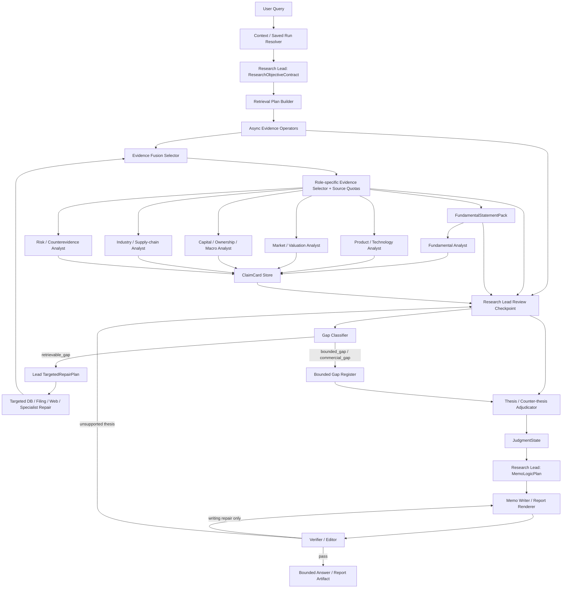

# Research Lead 常驻监督闭环框架

更新时间：2026-06-14

本文档记录 2026-06-14 关于下一阶段 Agent Graph / 反思机制 / Memo Surface / 检索与模型资源调度的新增讨论。后续继续讨论时直接在本文档上增补或修订，避免后续设计漂移。

## 背景

前序 G1-G11、D-series、K-series 和 309 轮已经完成：

- Agent Graph vNext 的 source family、reflection second pass、web policy、playbook、shared context、async barrier、Milvus switch 和 G11 full-chain gate。
- D-series evidence-governed runtime：Claim/Gaps/Gates/Entity/Provenance/Vintage/Reconciliation/Ontology/DerivedMetric/AnalystView/DB materialization。
- K-series product / capital / macro edge-pack：ProductSpecPack、CapitalMacroExposurePack、public buyer observer、K8 pack boundary gate。
- Memo surface 初版升级：ClaimCards -> thesis_driver_pack -> analyst_depth_gate -> dimension memo。
- FundamentalStatementPack / JudgmentState：三大表、派生指标、同行同口径、行业重点财务指标进入 fundamental analyst 和 memo governance。
- R7 诊断发现：全局 SEC candidate / rerank budget 不是主要瓶颈，product specialist 两个 deep case 都只看到 `4` 行，是 role-specific evidence visibility 问题。

当前新问题不是“没有反思”，而是反思仍偏 gate/checklist。它能防弱证据乱提权、能发现 source boundary，但没有充分回到 Research Lead 最初制定的研究目标审计：

- 原问题的核心判断是否被回答？
- 每个维度证据是否足够支持判断？
- 哪些缺口按当前公开/本地数据源应该能找出来但没有找出来？
- 哪些缺口确实只能暴露为 bounded gap / commercial gap？
- Memo Writer 应按什么逻辑组织，而不是把 ClaimCard 拼成报告？

## 新设计总述

Research Lead 从“一次性派单员”升级为“研究主编 / supervising analyst”。它不只在第一轮分派任务，而是常驻在研究闭环中：

```text
Plan
 -> Retrieve
 -> Specialist
 -> Lead Review
 -> Targeted Repair
 -> JudgmentState
 -> Lead MemoLogicPlan
 -> Memo Writer
 -> Verifier
```

核心职责变化：

- Research Lead：定义研究目标、审计检索和专家输出、区分 retrievable / bounded / commercial gap、发起 targeted repair、最终生成 MemoLogicPlan。
- Specialist agents：只在 bounded evidence bundle 内做角色分析，输出 ClaimCards / ProductSpecPack / CapitalMacroExposurePack 等结构化证据卡。
- Evidence operators：只取数和返回可审计 rows，不写判断。
- Reflection / Lead Review：从“下游检查”升级为“对照目标合同做覆盖审计”。
- Memo Writer：只负责自然语言表达、报告格式和文件生成，不新增事实、不检索、不补证据。
- Verifier / Editor：最后检查事实、引用、边界、语言、格式；若发现 unsupported thesis，返回 Lead Review，而不是让 Memo Writer 自己修事实。

## 新 Graph 草案



## ResearchObjectiveContract

Research Lead 第一轮仍负责拆题和分派，但必须产出明确合同：

- `core_question`：用户真正要判断的问题。
- `required_dimensions`：基本面、产品/产线、投融资/资本结构、竞争/市场、行业/供应链、风险/反证等。
- `minimum_evidence_requirements`：每个维度最低需要什么证据才允许写成判断。
- `source_family_plan`：每个维度应优先查哪些 source family。
- `forbidden_claims`：禁止由 proxy / context / semantic supplement 支撑的 claim。
- `mandatory_second_pass_triggers`：哪些缺口出现时必须二次检索或明确暴露。
- `memo_intent`：最终输出应是快速回答、分维度 memo、深度报告、表格/附件还是文件制品。

## LeadReviewCheckpoint

第一轮检索和 specialist 结束后插入同步 barrier。Research Lead 读取：

- `ResearchObjectiveContract`
- `retrieval_plan`
- `tool_call_ledger`
- `retrieval_budget_audit`
- `bounded_evidence_rows`
- `FundamentalStatementPack`
- `ProductSpecPack`
- `CapitalMacroExposurePack`
- `ClaimCards`
- `GapLedger`
- `source_capability_router`
- `run_audit_store`

Lead 对每个维度打状态：

- `sufficient`：证据足够，允许进入 judgment。
- `retrievable_gap`：公开源/本地库理论上能找到，但这轮没查到、没送到或没查对。
- `bounded_gap`：公开源查不到、公司没披露、或 source boundary 不允许提权，只能暴露。
- `commercial_gap`：需要 IDC、IQVIA、S&P Mobility、POS、consensus、channel tracker 等商业数据。
- `not_material`：对当前问题不是核心维度，可降级或不写。

只有 `retrievable_gap` 触发 second pass。Second pass 不再是“再调用一次模型”，而是 Lead 指定的 targeted repair。

## TargetedRepairPlan

Lead 发起 repair 时必须声明：

- 查哪个 DB / artifact / SEC route / public source / web scope。
- 激活哪个 specialist 或是否由 Lead 自己执行轻量查询。
- 允许的 source class 和 forbidden source class。
- 期望补哪类 claim。
- 什么 gate 过后可以提权。
- 找不到时写成什么 gap。
- 是否允许 CPU rerank，还是必须等待 CUDA rerank。

禁止行为：

- 不能用 weak proxy 兜底。
- 不能把 public web snippet 直接写入 ClaimCard。
- 不能让 Memo Writer 自行补事实。
- 不能把 commercial tracker gap 改写成公开证据结论。

## FundamentalStatementPack / JudgmentState 的位置

新增设计必须把 309 轮新增的基本面链路作为一等节点，而不是隐藏在 fundamental analyst 内部。

基本面链路：

```text
D6 Reconciliation
 -> D10 DerivedMetricLayer
 -> FundamentalStatementPack
 -> Fundamental Analyst
 -> ClaimCards
 -> Thesis / Counter-thesis
 -> JudgmentState
 -> Lead MemoLogicPlan
 -> Memo Writer
```

LeadReviewCheckpoint 必须读取 `FundamentalStatementPack` 和 `JudgmentState`：

- `FundamentalStatementPack` 审计三大表、期间变化、同行同口径比较、行业重点财务指标、产品/资本桥接是否覆盖。
- `JudgmentState` 审计当前 thesis 是否已经从 ClaimCards 变成维度判断，而不是证据堆叠。
- 如果基本面缺三表、缺同行、缺产品收入桥、缺 capex/cash/debt/OCF/FCF，Lead 判断是 `retrievable_gap` 还是 `bounded_gap`。

基本面维度不再只看几条 revenue claim，而是以财务事实治理层和 pack 为核心。

## Role-specific Evidence Selector 与配额

R7 诊断证明：全局检索候选和 rerank surface 不是主要瓶颈，问题是检索结果没有按角色充分流入专家。因此 Evidence Fusion 后必须增加 role-specific selector。

### Product / Technology Analyst

优先输入：

- company product evidence graph
- 产品收入 / 产品 KPI
- ProductSpecPack
- 产品页、规格页、公开订货/渠道页
- 10-K / 10-Q product table

最低要求：

- 产品/segment/product KPI 行不足时不能静默通过，必须回 Lead Review。
- 若公开产品规格或订货页可得但未查，应标记为 `retrievable_gap`。
- 若真实销量、份额、渠道库存需要商业 tracker，应标记为 `commercial_gap`。

禁止：

- 不能用行业 proxy 直接证明公司产品销量/份额。
- 不能把电商/渠道页面写成 sell-through 或库存事实。

### Market / Valuation Analyst

优先输入：

- market snapshot
- valuation multiples
- peer price action
- ownership / 13F context
- 公开估值指标

最低要求：

- 如果估值/市场维度只有 1 条 market snapshot，应标为 weak dimension，不能写成强判断。
- market context 只能解释反应和相对估值，不能替代基本面或产品证据。

### Capital / Ownership / Macro Analyst

优先输入：

- debt footnote
- credit facility
- offering
- 13F / 13D/G / Form 3/4/5 / proxy
- cash / debt / OCF / FCF / capex
- FRED / EIA / Census / FDIC macro bridge

最低要求：

- capex、debt、cash、OCF/FCF、ownership/macro exposure 至少要能说明“有 / 无 / 缺口”。
- 宏观和 ownership 数据必须通过 company exposure bridge 或 lag boundary，不得直接变成公司结论。

## MemoLogicPlan 与输出风格

Memo Writer 的输入从“自己理解 ClaimCards”改为：

- `MemoLogicPlan`
- `JudgmentState`
- verified `ClaimCards`
- `BoundedGapRegister`
- 格式要求

Memo Writer 不再负责检索、补证据或事实判断。它只负责自然语言表达、报告结构、表格和文件制品。唯一允许的工具是 PDF / MD / DOCX / Excel 等文件生成器或渲染器。

下一版输出风格参考 2026-06-14 讨论截图：不是模板报告，也不是纯聊天，而是自然语言 + 带证据的分点推理 + 总结 + 建议。

建议默认格式：

```text
核心判断
用 2-4 句话直接回答问题，说明结论强弱和最大约束。

为什么
1. 基本面：判断 + 关键数值 + 证据引用 + 边界
2. 产品/产线：判断 + 产品事实 + 缺口
3. 投融资/资本开支：判断 + capex/cash/debt/OCF/FCF
4. 竞争/行业：判断 + 同行/市场位置 + 不能证明什么
5. 风险/反证：哪些证据会推翻当前判断

结论边界
哪些是公开证据能支持的，哪些需要商业 tracker / 人工调研。

下一步
建议继续查什么，什么数据会改变判断。
```

内部字段如 `business_mechanism`、`financial_bridge`、`counter_read` 可以留在 `MemoLogicPlan` 和 audit artifact 中，但不应机械翻译成用户可见的“机制 / 财务桥 / 反证边界”模板。

## BGE / Rerank 资源调度

当前并发异步扇出时，为避免显存不足，BGE rerank 走 CPU 是保守但低效。下一阶段先做小规模资源调度雏形，而不是等 Java 后端阶段再处理。

目标：

```text
RerankRequest
 -> InferenceResourceScheduler
 -> CUDA queue: max_active_models = 3 or 4
 -> CPU spillover queue: only low-priority / latency-tolerant tasks
 -> result cache
 -> Evidence Fusion
```

调度策略：

- 高优先级 route 优先排 CUDA：SEC primary filing、exact-value supporting text、product/capital targeted repair。
- 低优先级 route 可走 CPU 或延后：background industry/context、非关键 broad recall。
- 如果 CUDA 等待超过阈值，再按任务优先级决定继续等 CUDA 还是 CPU spillover。
- 同一 query / doc set 做 rerank cache，避免 second pass 重排同一批候选。
- 本地小显存可设 `max_active_cuda_jobs=3`；云端 24G/32G/96G 只调整 capacity，不改 graph contract。

这不是最终并发架构，只是当前测试和本地开发阶段的可控雏形。

## Token / 模型动态调度

当前 token 消耗仍高。需要在 graph 级别加入 `ModelRouter` 和 `AgentCoalescer`。

模型路由原则：

- Research Lead、Lead Review、Adjudicator 使用强模型，因为它们决定研究方向和判断。
- 简单 extraction、gap labeling、format repair、schema repair 可用 flash / cheaper model。
- Specialist 若只有少量证据或只是 gap，可以跳过 LLM，生成 deterministic gap card。
- Market + Capital 在轻量 case 可合并为 `MarketCapitalAnalyst`。
- Risk analyst 只有在主 thesis 足够强、用户要求反证、或 Lead Review 判断风险维度 material 时激活。
- Second pass 只修 `retrievable_gap`，不重跑全链路。

成本审计必须记录：

- 每个节点模型。
- token 输入 / 输出。
- 是否合并调用。
- 是否 skipped / deterministic。
- 每个 ClaimCard 的成本。
- second pass 是否新增 authority-bearing evidence。

## 下一阶段功能包

建议不要一次性混改，拆成以下功能包：

### L1 ResearchObjectiveContract

新增合同 schema、Lead 输出和 Plan Reflection 使用。

通过条件：

- 每个 case 都能列出 core question、required dimensions、最低证据要求、source boundary、second pass triggers。
- Contract 不包含 raw rows 或 private paths。

### L2 LeadReviewCheckpoint

新增同步 barrier，读取 retrieval / evidence / ClaimCards / packs / gaps / run audit，输出维度状态和 gap 分类。

通过条件：

- 能识别 product specialist 只看到 `4` 行这类 role-visible-row gap。
- 能区分 retrievable_gap / bounded_gap / commercial_gap。
- 不把 commercial gap 触发成公开源 repair。

### L3 TargetedRepairPlan

把 second pass 改成 Lead 指定的 repair plan。

通过条件：

- repair plan 记录 source、route、agent、claim type、promotion gate、not-found gap。
- 无 authority-bearing delta 时停止。
- repair 不会绕过 source boundary。

### L4 Role-specific Evidence Selector

修 product / market / capital 的 evidence selector 和配额。

通过条件：

- Product deep case 不再只有 `4` 行可见输入，除非 Lead Review 明确标为 bounded/commercial gap。
- Market weak snapshot 不能被写成强估值判断。
- Capital/macro 维度能给出 cash/debt/capex/OCF/FCF/ownership/macro exposure 的有无和缺口。

### L5 MemoLogicPlan / Memo Surface vNext

Research Lead 生成写作逻辑，Memo Writer 只负责自然语言和文件生成。

通过条件：

- 用户可见输出不再机械暴露内部 schema 字段。
- 每个分点有判断、证据和边界。
- Memo Writer 无检索 / DB / web 权限。

### L6 InferenceResourceScheduler

为 BGE/rerank 增加 CUDA queue、CPU spillover、cache 和 route priority。

通过条件：

- 本地可配置 `max_active_cuda_jobs`。
- 高优先级 targeted repair 优先拿 CUDA。
- CPU fallback 不再是唯一默认行为。
- scheduler 记录等待时间、设备、cache hit 和 rerank latency。

### L7 ModelRouter / AgentCoalescer

做 token 动态调度和 agent 合并/跳过。

通过条件：

- 每个节点记录模型选择原因。
- simple gap / schema repair 可走 cheaper model 或 deterministic。
- 轻量 case 能合并 market/capital 或跳过不 material 的 agent。
- 不因降模型破坏 source boundary 和 claim verification。

### L8 Tool Capability Registry

把当前“查数 / 检索 / 调数据库”工具扩展为完整工具能力注册表，并把每类工具的 agent 权限写入 graph contract。

工具分类：

- `data_retrieval`：SEC filing search、exact ledger、SQL / DuckDB / SQLite、market snapshot、industry snapshot、public source、relationship graph、Milvus / embedding / rerank。
- `input_parsing`：PDF、DOCX、Excel / CSV、Markdown、PPT、HTML、图片 OCR、图表识别、视频抽帧 / ASR / OCR。
- `analysis_artifact`：财务模型 workbook、可比公司表、产品规格矩阵、事件时间线、ClaimCard table、Gap table、知识图谱 / 关系图中间表示。
- `output_rendering`：Markdown、PDF、DOCX、Excel、PPT、HTML、Mermaid、Graphviz、思维导图、知识图谱线条图。
- `multimodal_preprocess`：图片/视频/音频解析模型适配、frame selection、OCR confidence、视觉表格抽取、source classification。

权限原则：

- Research Lead 可请求 `input_parsing`、artifact inspect、DB 查询、targeted retrieval / web repair，但不直接写最终事实。
- Evidence Operators 执行 data retrieval / input parsing / multimodal preprocess，输出可审计 rows / artifacts / provenance。
- Specialist 默认不能直接调工具，只消费 bounded packs；若发现缺口，只能向 LeadReviewCheckpoint 请求 repair。
- Memo Writer 只允许 `output_rendering`，以及受控的 report asset assembly；不允许检索、DB、联网、输入解析或新增事实。
- Verifier 只允许 inspect rendered artifact、citation、provenance、claim/gap stores；不得取新证据。

通过条件：

- 每个工具有 `capability_type`、`allowed_agents`、`execution_permission`、`source_boundary`、`artifact_outputs`、`provenance_required`、`secret_policy`。
- Memo Writer 拿不到 retrieval / DB / web / parsing 工具。
- Input parsing 输出必须进入 provenance / gate，不能直接变成 ClaimCard。
- 可视化和文档生成工具只能消费 verified ClaimCards / JudgmentState / MemoLogicPlan / GapRegister。

### L9 Document & Multimodal Input Pipeline

企业场景不能只接受对话输入。用户上传研报、公司公告、产品手册、合同、报价单、Excel 模型、截图、图片、视频或会议录音时，系统必须先解析，再进入 evidence governance。

输入管线：

```text
User File / URL / Image / Video
 -> InputParserOperator
 -> ParsedInputArtifact
 -> ArtifactProvenance
 -> UserProvidedEvidencePack
 -> Source / Authority / Citation Gate
 -> Evidence Fusion / Lead Review
```

文件解析对象：

- `ParsedTextBlock`：文本块、页码、段落、heading、坐标或 cell range。
- `ExtractedTable`：表格、sheet name、cell range、header mapping、unit / period hints。
- `ExtractedFigure`：图表、图片说明、OCR 文本、视觉分类。
- `ExtractedSlide`：PPT slide text、speaker notes、figure refs。
- `ExtractedMediaSegment`：视频/音频时间戳、ASR、关键帧、OCR、source frame refs。
- `UserProvidedEvidencePack`：将上述对象统一包装成用户提供证据，但默认不等于 authoritative company fact。

多模态模型接口保留：

- 当前 DeepSeek 主链不支持多模态时，可先用 deterministic parser / OCR / ASR / local vision parser。
- `ModelRouter` 需保留 `vision_model`、`document_ocr_model`、`video_parser_model`、`table_extraction_model` 的接口槽位。
- 当换成支持多模态的模型时，graph contract 不变，只替换 parser backend。

通过条件：

- PDF / DOCX / XLSX / CSV / Markdown 至少能生成可引用 `ParsedInputArtifact`。
- 图片输入至少能生成 OCR text、image provenance、confidence 和 unsupported/low-confidence gate。
- 视频输入至少支持抽帧 / ASR / timestamp provenance 的占位 contract；未实现时必须显式 blocked，不可假装解析。
- 用户上传文件不能绕过 source boundary；每个引用必须能回到页码、sheet/cell、slide、frame 或 timestamp。
- Report generation 可把 memo 输出为 MD / DOCX / PDF / Excel / PPT / Mermaid / Graphviz，但只消费 verified facts。

## 当前明确边界

- 本文档是下一阶段框架，不代表 runtime 已完成这些能力。
- FundamentalStatementPack / JudgmentState 已有初版 runtime 接入；LeadReviewCheckpoint 对它们的一等节点使用仍待实现。
- BGE scheduler / ModelRouter / AgentCoalescer 尚未实现。
- Memo Surface vNext 尚未替换当前渲染，只确定方向。
- Tool Capability Registry、Document / Multimodal Input Pipeline 尚未实现；当前工具仍主要覆盖检索、查数、artifact inspect 和 markdown 渲染。
- Web repair 仍必须遵守 02 文档的 allowlist / source class / claim scope。
- Milvus 仍是 typed semantic recall supplement，不是 exact-value authority。
