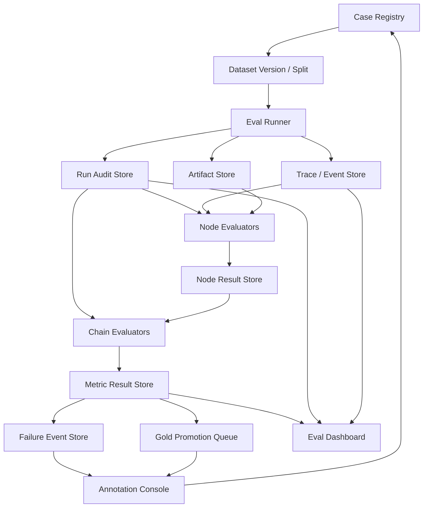

# Agent Eval Runtime 闭环框架

更新时间：2026-06-14

本文档作为 09 Research Lead closed loop 和 10 后端 / 前端 runtime 之后的评测体系闭环。目标不是再追加一个孤立 eval 脚本，而是把 FinSight 的评测、审计、回放、错误沉淀、gold set 晋级和线上监控统一成一个可持续运转的 Agent Eval Runtime。

## 外部参考

参考成熟 agent / RAG eval 项目的共性做法：

- LangSmith Evaluation: `https://docs.langchain.com/langsmith/evaluation`
  - 区分 offline evaluation 和 online evaluation。
  - 用 dataset、evaluator、experiment、feedback loop 管理迭代。
  - 支持 human review、code rules、LLM-as-judge、pairwise comparison。
- OpenAI Evals: `https://developers.openai.com/api/docs/guides/evals`
  - eval 由测试数据 schema 和 testing criteria / graders 构成。
  - 用 JSONL / file / eval run 管理 test inputs、ground truth 和运行结果。
- Phoenix Evaluation: `https://arize.com/docs/phoenix/evaluation/llm-evals`
  - 支持 deterministic code evaluator 和 LLM-as-judge。
  - eval 可运行在 traces、experiment results 或 dataset 上。
  - evaluator 自身也需要 tracing、explanation、timing 和 judge prompt 可审计。
- Ragas: `https://docs.ragas.io/en/stable/`
  - 强调从 vibe check 走向 systematic evaluation loop。
  - 覆盖 RAG context precision / recall / noise sensitivity / faithfulness、agent tool call accuracy / F1 / goal accuracy、cost analysis、多轮和 testset generation。

FinSight 可以吸收这些框架的工程结构，但不能直接照搬通用 RAG 指标。FinSight 的关键差异是：

- 研报结论必须落到 source authority、exact-value ledger、ClaimCard、GapLedger、gate history 和 source boundary。
- 好答案不是“语义相似”，而是研究目标被回答、证据足够、边界清楚、财务/产品/行业逻辑成立、结论能被复盘。
- memory、vector hit、analyst view、web snippet 都不能直接支撑 financial claim，必须 drill down 到 governed evidence。

## 当前评测体系审计

当前 repo 已经有不少评测资产，问题不是完全没有 eval，而是缺统一编排、统一指标表、统一样本生命周期和默认审计入口。

### 已有资产

评测框架和 rubric：

- `docs/eval/fin_agent_investment_research_quality_framework_v0_1.md`
- `docs/eval/fin_agent_layered_quality_execution_plan_v0_1.md`
- `configs/fin_agent_quality_rubric_v0_1.json`
- `docs/eval/fin_agent_full_chain_multiturn_eval_plan_v0_1.md`
- `docs/eval/sec_benchmark_v1.md`
- `docs/eval/sec_benchmark_v2_generalization_plan.md`
- `docs/eval/sec_agent_resume_closeout_eval_v1.md`

用例和样本：

- `tests/fixtures/*_cases_*.jsonl`
- `eval_sets/*.jsonl`
- `eval/sec_cases/test_cases_*.jsonl` 和 reviewed gold context / facts。
- `reports/model_runs/model_run_index.md` 记录大量模型、检索、full-chain 运行结果。

执行脚本：

- `scripts/eval_multi_agent/*`
- `scripts/eval_retrieval/*`
- `scripts/eval_sec_benchmark/*`
- `scripts/eval_context/*`
- `scripts/eval_query_planner/*`

运行审计和后端记录：

- `src/sec_agent/run_audit_store.py`
  - 已有 `run`、`node_execution`、`artifact_ref`、`evidence_row`、`claim_card`、`gap`、`gate_result`、`model_call` 八类表。
  - 记录 `run_id`、`case_id`、`code_commit`、`data_snapshot_id`、`input_digest`、`output_digest`、`artifact_uri`、`elapsed_ms`、model tokens 等。
- `src/sec_agent/llm_gateway.py`
  - 已记录 `latency_ms`、`input_tokens`、`output_tokens`、`total_tokens`、provider/model/role/profile、transport retry。
- `src/sec_agent/langgraph_orchestrator.py`
  - 已有 node checkpoint、`elapsed_ms`、artifact refs、recoverable state summary、checkpoint hydrate / inspect。
- Workbench backend 测试已覆盖 run report、native checkpoint inspect/resume、job elapsed。

### 当前优点

- 已有分层 gate 思路：S0-S10 从 chunk/retrieval 到 full-chain/multi-turn。
- 已有 deterministic gates：source boundary、citation、period、unit、numeric、metric mapping、claim support、commercial gap 等。
- 已有 SEC benchmark 的 reviewed gold / pipeline context / post-gate 体系。
- 已有 run audit store，可以作为后端 Eval Runtime 的起点。
- 已有模型运行 ledger 和 worklog，能追溯历史决策。
- 已经开始记录 token、latency、node elapsed、tool calls 和 row counts。

### 主要缺口

1. Eval 资产没有统一 registry。
   - case、dataset、fixture、runner、report、gold、failure sample 分散在 `tests/fixtures`、`eval_sets`、`docs/eval`、`reports` 和 worklog。
   - 很难回答“某个能力当前应该跑哪个 eval pack”。

2. Eval 结果没有统一 SQL schema。
   - `run_audit_store` 记录运行事实，但还没有 `eval_case_registry`、`eval_run`、`eval_node_result`、`eval_metric_result`、`eval_annotation`、`eval_failure_event`、`eval_gold_promotion` 这类评测治理表。

3. 检索 / 召回 / reranker 不是每轮默认审计项。
   - 309 轮才发现 product specialist visible rows 过少，说明此前更多看最终输出和预算 proxy，没有每次稳定记录 target-in-candidates、pre-rerank recall、post-rerank precision、role-visible recall、dropped-row reason。

4. 错误样本生命周期不稳定。
   - 失败 case 往往进入 worklog，但没有统一从 `failure -> root cause -> regression case -> active pack -> retired` 的状态机。

5. 好结果晋级 gold set 的规则不稳定。
   - reviewed gold、accepted diagnostic run、model_run ledger 已存在，但缺统一晋级条件、过期条件和 supersession 规则。

6. 09/10 新增能力缺对应 eval。
   - ResearchObjectiveContract、LeadReviewCheckpoint、TargetedRepairPlan、MemoLogicPlan、ContextEngine、context injection plan、BGE resource scheduler、ModelRouter、Tool Capability Registry 都需要进入 eval matrix。

7. 后端 runtime 指标还没有 SLA 化。
   - 已有 `elapsed_ms` / `latency_ms` / tokens，但还没有按 run type 记录 p50/p95/p99、queue wait、worker wait、provider wait、BGE wait、DB time、object-store time、cache hit、retry count、cancel/recovery success。

8. LLM-as-judge 还不是被审计的 judge。
   - 如果引入 judge，需要记录 judge prompt、judge model、input mapping、rubric version、explanation、latency、cost、human audit sampling；不能让 judge 成为新的黑箱。

9. 前端缺 eval trace 产品视图。
   - 10 文档已经要求 run/event/context/evidence/claim/gap/report viewer；11 文档需要补 eval dashboard 和样本治理视图。

## 目标状态

FinSight 的下一阶段评测体系要达到：

```text
每一次 run 都可复盘；
每一个 node 都有指标；
每一条 claim 都能 drill down；
每一个失败都能变成可治理样本；
每一个 gold 都有晋级、复核、过期和淘汰规则；
每一次模型 / prompt / retrieval / data / graph 改动都能回放对比。
```

最终产物应是：

```text
Eval Registry
 -> Dataset / Case Store
 -> Run Audit Store
 -> Trace / Context / Artifact Store
 -> Node Evaluators
 -> Chain Evaluators
 -> Dataset Curation Loop
 -> Gold / Failure Lifecycle
 -> Backend API + Frontend Eval Dashboard
```

## Eval Runtime 总体结构



核心原则：

- eval runner 只负责执行和收集，不能在失败时隐式降级。
- node evaluator 只评价本节点输入/输出，不要求下游修补。
- chain evaluator 评价端到端一致性、成本、可交付质量和多轮状态。
- failure / gold 都是数据资产，不是临时报告。
- online eval 采样进入 candidate pool，离线确认后才能进入 active regression 或 gold。

## Eval 分层矩阵

### E0 Data / Index / Source Asset Eval

评价对象：

- SEC / filing parser、structured objects、Exact-Value Ledger、BM25/ObjectBM25、Milvus、public source adapters、K/P/D-series materialization。

核心指标：

- parser error rate、chunk id uniqueness、table boundary validity、core item coverage。
- evidence object / chunk / BM25 / ObjectBM25 row parity。
- ledger hit rate、metric alias coverage、unit/period conflict rate。
- source provenance completeness、as-of/vintage completeness、license/robots status。
- materialization parity：artifact -> SQL / object store / vector store。

默认 gate：

- source asset 未通过时，不允许 full-chain 质量结论升级。

### E1 Backend Runtime / SLA Eval

评价对象：

- API、Run Manager、Redis queue、worker pool、DB、SSE、retry、cancel、resume、Docker Compose。

核心指标：

- run created -> queued -> started -> completed 的状态完整率。
- queue wait、worker wait、node elapsed、tool elapsed、provider latency、BGE wait、DB write/read time、object-store time。
- p50 / p95 / p99 latency by run type：exact lookup、focused answer、standard memo、deep research、batch eval。
- cancel success rate、resume success rate、timeout handling、retry classification、worker heartbeat recovery。
- tokens / cost / model calls by node、provider、case family。

默认 gate：

- 任何运行都必须写入 `run_id`、`case_id`、`code_commit`、`data_snapshot_id`、`node_execution`、`model_call` 和 artifact refs。
- Redis 只能做协调，最终审计源必须落 SQL / object store。

### E2 Context / Memory Eval

评价对象：

- `SecAgentContextManager`、ContextEngine、context snapshots、injection plans、prompt packs、D11 analyst memory、D-series DB reader。

核心指标：

- tenant / user / session isolation。
- context pack digest 可复现。
- injected / dropped context 有原因。
- token budget 合规。
- memory drilldown parity：memory -> analyst view -> claim/gap/derived refs -> evidence/provenance/vintage。
- stale / superseded memory 不进入 active context。

默认 gate：

- 每个 model call 必须可追溯实际注入的 context pack。
- memory / vector / analyst view 不能直接支撑 financial claim。

### E3 Research Lead / Planning Eval

评价对象：

- ResearchObjectiveContract、source plan、required dimensions、minimum evidence requirements、forbidden claims、agent activation。

核心指标：

- core question recognition。
- required dimension recall。
- source-family plan correctness。
- agent activation precision / recall。
- forbidden source / ticker / claim compliance。
- minimum evidence requirements 是否可执行。

默认 gate：

- Lead 偏题会导致下游全偏，因此 E3 是 hard gate。

### E4 Retrieval / Rerank / Role Visibility Eval

评价对象：

- retrieval route、BM25/ObjectBM25、BGE/Milvus、query expansion、rerank、role-specific selector。

核心指标：

- target-in-candidates@N。
- pre-rerank recall。
- post-rerank precision / nDCG / hit@K。
- ledger-first hit rate。
- role-visible recall：关键 evidence 是否真的进入对应 specialist。
- dropped-row taxonomy：budget cap、source policy、role quota、dedupe、stale、low authority。
- BGE device / queue wait / CPU spillover / cache hit。

默认 gate：

- 每次 full-chain 和 node-only eval 都要记录 retrieval budget audit，不允许事后才补。
- 如果 role-visible rows 太少，不能让 Memo Writer 背锅。

### E5 Evidence Operator / Tool Eval

评价对象：

- MCP tools、public source adapters、SEC/FRED/EIA/ClinicalTrials/openFDA/NHTSA/PatentsView/OpenAlex、web search、document parser。

核心指标：

- expected tool called。
- tool ownership valid。
- argument schema valid。
- source policy respected。
- tool output rows non-empty or typed gap。
- parser/gate/promoter status。
- retry reason 和 permanent failure reason 区分。

默认 gate：

- public web / public proxy 不能直接 promoted to ClaimCard。
- commercial gap 不能被弱 proxy 兜底。

### E6 Lead Review / Reflection / Targeted Repair Eval

评价对象：

- LeadReviewCheckpoint、GapClassifier、TargetedRepairPlan、second pass、repair delta audit。

核心指标：

- dimension status：sufficient / retrievable_gap / bounded_gap / commercial_gap / not_material。
- retrievable gap classification precision。
- repair plan route correctness。
- second-pass incremental evidence gain。
- no-gain stop correctness。
- bounded/commercial gap exposure quality。

默认 gate：

- 反思不是“再问一次模型”；必须有可审计 repair plan 和 delta。

### E7 Specialist / Sub-Agent Eval

评价对象：

- Fundamental、Product/Technology、Market/Valuation、Capital/Ownership/Macro、Industry/Supply-chain、Risk/Counterevidence、KG sub-agent。

核心指标：

- role input completeness。
- ClaimCard support validity。
- source boundary compliance。
- product spec / KPI / financial statement / capital pack consumption。
- unsupported claim exclusion。
- specialist token efficiency：tokens per supported ClaimCard。

默认 gate：

- Specialist 只能消费 bounded role evidence bundle，不得自行检索。

### E8 Judgment / Claim / Thesis Eval

评价对象：

- ClaimCard Store、FundamentalStatementPack、JudgmentState、Thesis/Counter-thesis Adjudicator、MemoLogicPlan。

核心指标：

- supported / contradicted / gap-exposed claim status accuracy。
- dimension judgment completeness。
- thesis vs counter-thesis balance。
- financial statement and peer metric reasoning。
- product/financial/industry bridge quality。
- unsupported claim leakage。

默认 gate：

- Memo Writer 的输入必须是 dimension-first plan，不是 ClaimCard 拼贴。

### E9 Memo Writer / Report Surface Eval

评价对象：

- Memo Writer、renderer、DOCX/PDF/Excel/MD export。

核心指标：

- direct answer density。
- thesis-led structure。
- evidence-to-thesis reasoning quality。
- risk/counterevidence balance。
- user language and format compliance。
- citation readability。
- no new fact / no retrieval / no DB tool use。
- memo chars per token、tokens per rendered claim。

默认 gate：

- 写作器只写自然语言和文件制品，不补事实。

### E10 Verifier / Safety / Boundary Eval

评价对象：

- deterministic gates、LLM verifier、source boundary verifier、numeric verifier、context leakage scanner。

核心指标：

- unsupported claim detection。
- false pass / false fail rate。
- citation validity。
- numeric/unit/period correctness。
- source-boundary compliance。
- private path / secret / raw trace leakage。

默认 gate：

- Verifier 不能新增观点；unsupported thesis 必须回 Lead Review。

### E11 Full-chain / Multi-turn / User Workflow Eval

评价对象：

- exact lookup、focused answer、standard memo、deep research、multi-turn、uploaded-file workflow、web-search workflow、backend run lifecycle。

核心指标：

- hard gate pass rate。
- answer quality weighted score。
- scope revision compliance。
- artifact reuse correctness。
- no unnecessary rerun。
- full replay reproducibility。
- cost / latency by workflow type。

默认 gate：

- full-chain 只在关键 node eval 稳定后跑批量。
- 新 case 先 smoke 1-2 个高信息量样本，再扩展。

### E12 Online Eval / Production Monitoring

评价对象：

- 用户真实请求、失败 run、cancel run、long-tail query、latency/cost outlier。

核心指标：

- sampled online quality score。
- error type distribution。
- latency/cost anomaly。
- retrievable gap miss。
- commercial gap exposure rate。
- user feedback / correction rate。

默认 gate：

- 线上样本默认进入 candidate pool；人工或规则复核后才能进入 active regression / gold。

## Eval 数据库草案

后端 B3 / B9 之后应补以下评测治理表：

- `eval_case_registry`
  - case_id、case_family、industry、tickers、query、mode、required_dimensions、expected_tools、expected_agents、source_policy、risk_tags、status。
- `eval_dataset_version`
  - dataset_id、version、split、purpose、owner、created_at、frozen_config_digest、status。
- `eval_case_membership`
  - dataset_id、version、case_id、split、weight、promotion_status。
- `eval_run`
  - eval_run_id、runner、dataset_id、dataset_version、code_commit、data_snapshot_id、model_profile、config_digest、started_at、finished_at、status。
- `eval_case_result`
  - eval_run_id、case_id、run_id、gate_status、score、failure_count、latency_ms、total_tokens、cost_estimate、artifact_uri。
- `eval_node_result`
  - eval_run_id、case_id、run_id、node、gate_status、score、elapsed_ms、input_digest、output_digest、context_pack_digest。
- `eval_metric_result`
  - eval_run_id、case_id、node、metric_name、metric_value、threshold、status、metric_version。
- `eval_failure_event`
  - failure_id、case_id、run_id、node、failure_type、root_cause_status、severity、artifact_refs、created_from。
- `eval_annotation`
  - annotation_id、case_id、artifact_ref、label_schema、labeler、label、rationale、created_at、supersedes。
- `eval_gold_promotion`
  - case_id、artifact_ref、promotion_status、reviewer、criteria_version、effective_from、expires_at、superseded_by。
- `eval_judge_run`
  - judge_run_id、judge_model、judge_prompt_digest、rubric_version、input_mapping_digest、latency_ms、tokens、explanation_uri。
- `eval_dashboard_snapshot`
  - dashboard_id、time_window、metric_summary、alert_status。

这些表不替代 `run_audit_store`，而是以 `run_id`、`case_id`、`artifact_ref` 关联到真实运行事实。

## Case / Gold / Failure 生命周期

### Case 状态机

```text
candidate
 -> reviewed
 -> active_regression
 -> gold
 -> stale
 -> deprecated
```

状态定义：

- `candidate`：来自线上失败、人工设计、synthetic generation 或历史 worklog。
- `reviewed`：schema、source policy、expected behavior 已人工确认。
- `active_regression`：进入常规 CI / local / cloud eval pack。
- `gold`：有人工认可或强 deterministic evidence，作为对比基线。
- `stale`：数据、filing、source policy、parser、business reality 变化后需要复核。
- `deprecated`：被新 case 覆盖或不再代表目标能力。

### Failure 状态机

```text
observed
 -> triaged
 -> root_caused
 -> regression_case_added
 -> fixed
 -> monitored
 -> retired
```

失败必须记录：

- failure type。
- node。
- expected vs actual。
- upstream artifact digest。
- 是否为 data ceiling / commercial gap / retrievable miss / prompt bug / parser bug / source policy bug / model failure。
- 修复后对应的 regression case。

### Gold 晋级条件

一个输出或 case 晋级 gold，至少满足：

- source refs 可追溯。
- ClaimCards / gaps / gates 通过。
- 关键数值和 period / unit / metric role 正确。
- 结论由 evidence-to-thesis chain 支撑。
- 风险和缺口表达合格。
- 无 private path、secret、raw internal trace 泄漏。
- gold criteria version、data snapshot、code commit、reviewer / review method 记录完整。

Gold 不是永久真理。出现以下情况必须复核或降级：

- 新 filing / amendment / restatement。
- data source adapter 改版。
- parser / metric ontology / source policy 改版。
- case 目标被新 09/10 graph contract 取代。

## Failure Taxonomy v0.1

默认失败类型：

- `planning_scope_error`
- `research_objective_contract_missing`
- `source_policy_violation`
- `retrieval_miss`
- `reranker_misrank`
- `role_visible_recall_gap`
- `tool_permission_violation`
- `tool_schema_error`
- `parser_or_adapter_gap`
- `ledger_missing`
- `reconciliation_conflict_unresolved`
- `context_injection_error`
- `memory_drilldown_missing`
- `lead_review_false_sufficient`
- `targeted_repair_no_delta`
- `commercial_gap_not_exposed`
- `weak_proxy_promoted`
- `specialist_unsupported_claim`
- `claimcard_evidence_mismatch`
- `financial_statement_reasoning_shallow`
- `product_financial_bridge_missing`
- `memo_surface_template_like`
- `memo_added_new_fact`
- `verifier_false_pass`
- `verifier_false_fail`
- `renderer_trace_leak`
- `latency_slo_breach`
- `token_cost_outlier`
- `queue_or_worker_failure`
- `non_reproducible_run`

## 每次 eval 必须输出什么

最小 artifacts：

- `eval_run_manifest.json`
- `eval_case_results.jsonl`
- `eval_node_results.jsonl`
- `eval_metric_results.jsonl`
- `failure_events.jsonl`
- `gold_candidates.jsonl`
- `run_audit_db` 或 SQL URI。
- `context_injection_audit.jsonl`，当该 eval 涉及模型调用。
- `retrieval_budget_audit.jsonl`，当该 eval 涉及检索。
- `model_call_ledger.jsonl`，当该 eval 涉及 LLM。
- `eval_summary.md`

最小字段：

- `eval_run_id`
- `case_id`
- `run_id`
- `node`
- `input_digest`
- `output_digest`
- `code_commit`
- `data_snapshot_id`
- `config_digest`
- `artifact_uri`
- `metric_name`
- `metric_value`
- `threshold`
- `status`
- `failure_type`
- `promotion_status`

## LLM-as-Judge 使用边界

允许用途：

- memo surface 质量。
- evidence-to-thesis chain 可读性。
- risk/counterevidence balance。
- explanation quality。
- pairwise comparison。

禁止用途：

- 替代 exact-value ledger。
- 替代 source boundary gate。
- 替代 period / unit / metric role deterministic check。
- 替代 parser/schema validation。
- 单独决定 gold promotion。

Judge 本身必须被审计：

- 记录 judge model、prompt digest、rubric version、input mapping、output schema、explanation、latency、tokens。
- 定期人工抽样校准 false pass / false fail。
- 对 judge prompt 改动也要跑 eval。

## 前端 Eval Dashboard

前端除了 run trace，还应有 eval 视图：

- Eval run list：dataset、runner、config、status、时间、成本、pass rate。
- Case result view：输入、期望、实际、失败类型、artifact refs。
- Node trace view：每个节点的 input/output digest、context pack、metrics、gate。
- Retrieval audit view：candidate / rerank / selected / role-visible row 分布。
- Failure queue：observed -> triaged -> root-caused -> fixed -> monitored。
- Gold queue：candidate -> reviewed -> active -> stale / deprecated。
- Trend view：不同 commit / model / prompt / data snapshot 的趋势。
- Cost / latency view：p50/p95/p99、queue wait、BGE wait、provider latency、tokens by node。

## 执行顺序

### A0：文档和现状统一

- 新增本 11 文档。
- 把现有 docs/eval、scripts/eval、fixtures、eval_sets、reports/model_runs 对齐到统一 taxonomy。
- 明确哪些旧 eval 是 current、superseded、diagnostic-only、deprecated。

通过条件：

- README 索引和 worklog 可找到 11 文档。
- master checklist 增加 Eval Runtime 待办。

### A1：Eval Registry v0

- 新增 `configs/eval_registry_v0_1.yaml` 或 SQL seed。
- 登记现有 eval packs、runner、dataset、case family、owner、run command、artifact policy。
- 不改 runner，先建立 catalog。

通过条件：

- 能回答“Research Lead / retrieval / product specialist / memo writer / full-chain 分别跑哪个 eval”。

### A2：Run Audit Store 扩展为 Eval Store

- 在 `run_audit_store` 外新增 eval tables，或新建 `eval_audit_store`。
- 关联 `run_id`、`case_id`、`code_commit`、`data_snapshot_id`、`artifact_uri`。
- 把现有 `chain_performance_summary`、`quality_audit`、`retrieval_ab`、`sec_benchmark_post_gates` 归一到 eval result rows。

通过条件：

- 一个 full-chain run 可以从 SQL 查出 node metrics、model calls、gate results、eval metrics 和 failure events。

### A3：Retrieval / Rerank 默认审计

- 每次检索写 `retrieval_candidate_ledger`、`rerank_ledger`、`role_visible_evidence_ledger`。
- 增加 gold-labeled retrieval/rerank eval cases。
- 让 `target_in_candidates`、`post_rerank_hit`、`role_visible_recall` 成为默认指标。

通过条件：

- 不再出现“输出浅，但不知道是上游检索还是写作器问题”的状态。

### A4：09 新 graph 节点评测

- 为 ResearchObjectiveContract、LeadReviewCheckpoint、TargetedRepairPlan、MemoLogicPlan 加 node-only eval。
- 为 ContextEngine 和 context injection plan 加 replay eval。
- 为 ModelRouter / AgentCoalescer 加成本质量 eval。

通过条件：

- Lead Review 能识别 retrievable gap / bounded gap / commercial gap。
- second pass 必须有 targeted repair plan 和 delta audit。

### A5：Failure / Gold Lifecycle

- 增加 failure queue 和 gold promotion queue。
- 从线上 / workbench / test 失败自动生成 candidate failure sample。
- 好结果进入 gold candidate，但必须复核。

通过条件：

- 每个新 bug 修复都至少生成或更新一个 regression case。
- 每个 gold 有 criteria version、data snapshot、review record、expiry policy。

### A6：Backend / Frontend 集成

- API 暴露 eval run、case result、failure queue、gold queue、metric trend。
- 前端展示 eval dashboard。
- CI / nightly / local smoke / cloud heavy eval 分层运行。

通过条件：

- 开发者能从 UI 或 API 追溯一次失败到 node、context、retrieval、claim、gate、model call 和 artifact。

## 首批应补的 eval packs

优先补：

1. `research_lead_objective_contract_v0_1`
   - 测 core question、required dimensions、minimum evidence requirements、forbidden claims。
2. `lead_review_checkpoint_gap_classifier_v0_1`
   - 测 sufficient / retrievable_gap / bounded_gap / commercial_gap 分类。
3. `targeted_repair_delta_v0_1`
   - 测 repair plan route、增量证据、no-gain stop。
4. `retrieval_role_visible_recall_v0_1`
   - 测 pre-rerank、post-rerank、role-visible row。
5. `context_injection_replay_v0_1`
   - 测 context pack digest、dropped items、memory drilldown。
6. `memo_logic_plan_to_surface_v0_1`
   - 测 Memo Writer 是否按维度写，不新增事实。
7. `backend_runtime_sla_v0_1`
   - 测 queue、worker、SSE、cancel、resume、p95、token/cost。
8. `gold_failure_lifecycle_v0_1`
   - 测 failure -> regression、gold -> stale / deprecated。

## 不应做的事

- 不要再靠“这轮感觉输出不错”来判断质量。
- 不要只加 full-chain case，不加 node-level root-cause eval。
- 不要让 LLM judge 替代 deterministic financial gates。
- 不要把线上失败只写进聊天或 worklog，不沉淀成 case。
- 不要把好结果永久锁成 gold，不设置 stale / supersession。
- 不要只看 token 总量，不看 tokens per supported claim / tokens per useful memo section。
- 不要把 Redis 状态当最终审计源。

## 最小闭环定义

11 文档闭环真正完成的标准：

```text
给定一个用户问题和一次 run，
系统能查到它属于哪个 eval case / dataset，
能重建每个节点看到的输入、context、检索结果、模型调用、输出和 gate，
能判断失败属于哪个 taxonomy，
能把失败沉淀为 regression case，
能把优秀结果晋级为有期限、有来源、有复核记录的 gold，
能在下一次模型、prompt、数据、graph、后端改动后自动对比。
```

这才是和 09/10 对齐的企业级 Agent Eval Runtime。
