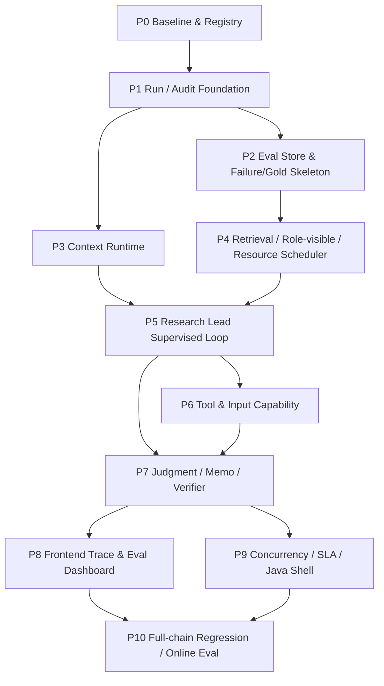

# 09-11 闭环后一体化执行计划

更新时间：2026-06-14

本文档把 09 Research Lead 常驻监督闭环、10 后端 / 前端 Runtime、11 Agent Eval Runtime 三个框架合并成下一阶段工程执行计划。

它不是按 09、10、11 各自排期，而是按可交付功能切片排期：每一步同时说明 Python agent runtime、后端 / 前端、评测体系如何一起推进，哪些可以并行，哪些必须同步屏障后再进入下一步。

## 核心原则

下一阶段目标不是“多加几个 agent 节点”或“单独做一个 Java 后端”，而是形成一个可审计的投研 Agent Runtime：

```text
用户请求
 -> Run Manager 创建 research run
 -> Python worker 执行 Research Lead supervised graph
 -> 每个节点写 run / context / retrieval / evidence / claim / gap / gate / model-call audit
 -> Eval Runtime 对节点和链路打分
 -> 前端展示 run trace / evidence / context / gap / report / eval
 -> 失败沉淀为 regression case，优秀结果晋级 gold candidate
```

执行原则：

- Eval 先行：任何新 agent 能力必须有 node-level eval，不等 full-chain 后才发现问题。
- 审计先行：任何模型调用、检索、repair、writer 输出都必须能回放输入、context、artifact refs 和 gate。
- 后端契约先行：Run / Event / Artifact / Eval schema 先稳定，再决定 FastAPI-only、Spring Boot shell 或双轨。
- 同步屏障清楚：Research Lead checkpoint、Evidence Fusion、LeadReview、MemoLogicPlan、Verifier 都是同步屏障；retrieval / specialist / tool calls 可以异步扇出。
- 不用弱兜底：找不到公开数据时暴露 bounded / commercial gap，不用 web snippet、memory 或 proxy 冒充事实。

## 工作流总图



## 工作流泳道

| 泳道 | 范围 | 默认技术 |
| --- | --- | --- |
| Python Agent Runtime | LangGraph、Research Lead、retrieval、specialists、ClaimCards、MemoLogicPlan、Verifier | Python |
| Backend Runtime | Run Manager、API、DB、Redis、SSE、worker pool、rate limit、cancel/resume | FastAPI first；Spring Boot shell 可并行或后补 |
| Eval Runtime | Eval Registry、node eval、chain eval、failure/gold lifecycle、judge audit | Python + SQL |
| Data / KG / Store | D-series SQL hardening、P/K registry、object store、Milvus semantic supplement | Python + SQL/ObjectStore/Milvus |
| Frontend / Workbench | run list、trace、evidence、context、claim/gap、report、eval dashboard | 现有 Workbench / 后续 Web UI |

## P0：Baseline、Registry 和技术路线冻结

目标：先把下一阶段“做什么、怎么验收、当前有哪些 eval / data / runner”整理成机器可读 registry，避免边做边漂移。

Python Agent：

- 不改主 graph。
- 盘点当前 09 L1-L9、10 B/F、11 EV 的实现状态。
- 输出 current / pending / superseded / diagnostic-only 清单。

Backend：

- 决定 B0：默认建议 `FastAPI first + Python worker + later Spring Boot parity`。
- 若用户明确要 Java P0，则 Spring Boot 实现 Run Manager API，Python worker 通过 Redis / DB payload 执行。
- 定义 run/event/artifact/eval schema 草案，不先上复杂微服务。

Eval：

- 实现 EV1 `Eval Registry` catalog。
- 登记当前 eval packs、fixtures、eval_sets、runner、命令、artifact policy、状态。
- 明确哪些旧 eval 是当前主线、哪些只是历史诊断。

可并行：

- D3/D4/D5/D11 DB hardening 设计可以并行，但不阻塞 P0。
- K5 offering / insider raw-material backfill 可以并行，但不得进入 runtime claim authority。

通过门控：

- E0 / EV1：Eval Registry 能回答每类能力对应跑哪个 eval。
- 文档和 registry 均能定位 09/10/11/12 的职责。
- `git status` 清洁；docs-only 不要求 runtime tests。

不通过处理：

- 如果 registry 无法归类旧 eval，先标 `unknown_legacy`，不得把它当 current gate。

## P1：Run / Audit Foundation

目标：把所有后续 agent 改动接到统一 run audit，不再只靠散落 JSON 和聊天记录复盘。

Python Agent：

- 扩展现有 `run_audit_store`，确保每次 graph run 都能物化：
  - `run`
  - `node_execution`
  - `artifact_ref`
  - `evidence_row`
  - `claim_card`
  - `gap`
  - `gate_result`
  - `model_call`
- 补 `retrieval_task`、`tool_call`、`context_snapshot`、`prompt_pack` 的最小 projection。
- 保留当前 per-run JSON artifacts，但 audit DB 成为默认复盘入口。

Backend：

- 实现 B1/B3 最小 Run Manager schema。
- API 最小接口：
  - `POST /api/runs`
  - `GET /api/runs/{run_id}`
  - `GET /api/runs/{run_id}/events`
  - `GET /api/runs/{run_id}/artifacts`
- 先允许本地 SQLite/Postgres 二选一；生产方向以 MySQL/Postgres 为主库。

Eval：

- E1 Backend Runtime / SLA Eval 最小版。
- 每个 run 必须有 `run_id`、`case_id`、`code_commit`、`data_snapshot_id`、`node_execution`、`model_call`。
- 添加 `backend_runtime_sla_v0_1` smoke，不要求高并发，只验证生命周期。

前端：

- Workbench 增加 run audit inspect 入口或继续复用已有 artifact inspect。

同步屏障：

- P1 过关前，不允许大规模改 L1-L5 graph；否则调试时会继续缺复盘底座。

通过门控：

- E1：single-run exact lookup / focused memo 都能写入 audit DB。
- E11：给定 `run_id` 能重建 node order、elapsed_ms、model token、artifact refs。
- 无 private path / secret 泄漏到用户输出。

不通过处理：

- 如果 graph 可以跑但 audit 不全，不能进入 P3/P5；先补 audit projection。

## P2：Eval Store 与 Failure / Gold 骨架

目标：把 11 的 Eval Runtime 从文档推进到最小 SQL / artifact contract，使后续每一步都有统一 gate。

Python Agent / Eval：

- 实现 EV2 最小 eval store：
  - `eval_case_registry`
  - `eval_dataset_version`
  - `eval_case_result`
  - `eval_node_result`
  - `eval_metric_result`
  - `eval_failure_event`
  - `eval_gold_promotion`
- 写 `eval_run_manifest.json`、`eval_case_results.jsonl`、`eval_node_results.jsonl`、`eval_metric_results.jsonl`、`failure_events.jsonl`。
- 先把现有 S1-S10 / G11 / retrieval A/B / SEC benchmark 的 summary 归一成 eval rows，不重写全部 runner。

Backend：

- Run detail API 增加 eval summary / metric result 查询。

Eval：

- EV5 / EV6 先落状态机字段，不急着做完整前端。
- failure 状态：`observed -> triaged -> root_caused -> regression_case_added -> fixed -> monitored -> retired`。
- gold 状态：`candidate -> reviewed -> active_regression -> gold -> stale -> deprecated`。

通过门控：

- E11：一个已有 G11 run 能转换成 eval case/node/metric rows。
- Failure event 至少能记录 failure_type、node、expected、actual、artifact_refs。
- Gold candidate 不能直接变 gold，必须有 criteria_version / data_snapshot / review method。

不通过处理：

- 如果旧 summary 字段不够，先写 adapter gap，不伪造 metric。

## P3：Context Runtime v0

目标：把 10 的 Context Runtime 接到运行系统，确保每次模型调用看到什么上下文可复盘。

Python Agent：

- 在现有 `SecAgentContextManager` 上封装 `ContextEngine` facade：
  - `resolve_user_session`
  - `select_context`
  - `build_injection_plan`
  - `compress_context`
  - `write_context_event`
  - `write_memory_candidate`
  - `invalidate_context`
  - `retrieve_memory`
- 输出 `context_pack_id`、`context_pack_digest`、`source_refs`、`allowed_claim_scope`、`dropped_items`、`compression_strategy`。
- D11 analyst view / research memory 只作为 index，不直接支撑 claim。

Backend：

- 落 B9/B10/B11 最小表：
  - `context_snapshots`
  - `context_events`
  - `context_injection_plans`
  - `prompt_packs`
  - `research_memory_entries`
- Redis 只 cache working set 和 injection plan，不作为最终审计源。

Eval：

- E2 Context / Memory Eval。
- 新增 `context_injection_replay_v0_1`。
- 检查 tenant/session isolation、token budget、drilldown parity、staleness。

前端：

- 暂时只提供 JSON inspect；完整 Context trace 留到 P8。

通过门控：

- 每个 model call 有 prompt/context digest。
- 给定 `run_id + node_id` 能重建该节点注入的 context summary。
- memory / vector / analyst view 不能直接进入 financial claim evidence refs。

不通过处理：

- 如果 context 超预算，必须记录 dropped_items 和策略；不能静默截断。

## P4：Retrieval / Role-visible / Resource Scheduler

目标：先解决“检索和 rerank 是否真的把证据送到正确 agent”的根因审计，再谈写作质量。

Python Agent：

- 实现 EV3 必需 ledgers：
  - `retrieval_candidate_ledger`
  - `rerank_ledger`
  - `role_visible_evidence_ledger`
  - `dropped_row_ledger`
- 修 L4 role-specific selector 和 quotas：
  - Product / Technology
  - Market / Valuation
  - Capital / Ownership / Macro
  - Fundamental
  - Industry / Supply-chain
  - Risk
- 实现 L6 `InferenceResourceScheduler`：
  - BGE CUDA queue
  - CPU spillover
  - route priority
  - rerank cache
  - latency/device audit
- 实现 L7 最小 `ModelRouter / AgentCoalescer`：
  - exact / deterministic 不调用大模型。
  - supporting agent 可用低成本模型或合并。
  - 记录 per-claim cost。

Backend：

- B2 Redis semaphore：
  - `llm:{provider}:semaphore`
  - `bge:cuda:semaphore`
  - `bge:cpu:queue`
- B3 `resource_usage` / `model_calls` / `retrieval_tasks` 入库。

Eval：

- E4 Retrieval / Rerank / Role Visibility Eval。
- E1 resource/SLA smoke。
- 新增 `retrieval_role_visible_recall_v0_1`。

可并行：

- Java/Spring Boot 可以并行实现 Redis semaphore API，但 Python worker 必须先遵守同一 resource contract。

通过门控：

- 每个 retrieval run 有 pre-rerank candidates、post-rerank rows、selected rows、role-visible rows。
- Product case 不再出现“全局候选很多，但 product specialist 只看到 4 行且无明确 dropped reason”。
- BGE device、queue wait、cache hit 可审计。
- Token/cost warning 能定位到 node / agent / claim。

不通过处理：

- 如果输出浅，先看 E4；E4 失败时不得只改 Memo Writer。

## P5：Research Lead Supervised Loop

目标：把 Research Lead 从一次性派单升级为常驻 supervising analyst。

Python Agent：

- L1 `ResearchObjectiveContract`：
  - core question
  - required dimensions
  - minimum evidence requirements
  - source-family plan
  - forbidden claims
  - mandatory second-pass triggers
- L2 `LeadReviewCheckpoint`：
  - 读取 retrieval audit、packs、ClaimCards、GapLedger、source capability、run audit store。
  - 对每个维度判定 `sufficient / retrievable_gap / bounded_gap / commercial_gap / not_material`。
- L3 `TargetedRepairPlan`：
  - route
  - source class
  - specialist / operator
  - expected claim type
  - promotion gate
  - not-found gap
- Lead 允许发起轻量 DB/artifact inspect；复杂查数仍交给 evidence operators。

Backend：

- `repair_tasks` 表和 run event：
  - `REFLECTION_TRIGGERED`
  - `REPAIR_STARTED`
  - `REPAIR_COMPLETED`
  - `REPAIR_NO_DELTA`
- SSE 能暴露 LeadReviewCheckpoint 状态。

Eval：

- E3 Research Lead / Planning Eval。
- E6 Lead Review / Reflection / Targeted Repair Eval。
- EV4 node eval：
  - `research_lead_objective_contract_v0_1`
  - `lead_review_checkpoint_gap_classifier_v0_1`
  - `targeted_repair_delta_v0_1`

同步屏障：

- LeadReviewCheckpoint 是同步 barrier；未通过不能进入 Judgment / Memo。

通过门控：

- ResearchObjectiveContract 能覆盖基本面、产品/产线、投融资/资本、竞争/市场、行业/供应链、风险/反证。
- LeadReview 能正确暴露 retrievable gap，而不是直接 bounded。
- Targeted repair 有 delta audit；无增益时停止并暴露 gap。
- Commercial gap 不被 public proxy 兜底。

不通过处理：

- Lead 误判 sufficient 时记录 `lead_review_false_sufficient` failure event，沉淀成 regression case。

## P6：Tool Capability 与 Document / Multimodal Input

目标：让工具调用和企业场景输入进入 runtime，但保持权限和证据边界。

Python Agent：

- L8 Tool Capability Registry：
  - data retrieval
  - database inspect
  - document parser
  - report renderer
  - graph / mindmap renderer
  - web search / web fetch
  - multimodal preprocess
- L9 Document & Multimodal Input Pipeline：
  - PDF / DOCX / Excel / MD / PPT
  - image OCR / layout parse
  - video transcript / keyframe extraction 预留
- 输出 `UserProvidedEvidencePack`，带 provenance / checksum / parser version / permission scope。

Backend：

- B3 tables：
  - `uploaded_files`
  - `parsed_input_artifacts`
  - `report_artifacts`
- API：
  - upload
  - parse status
  - artifact inspect
- Object store 接入原始文件和解析产物。

Eval：

- E5 Evidence Operator / Tool Eval。
- E2 Context / Memory Eval。
- E10 Safety / Boundary Eval。

前端：

- Upload center 最小版。

通过门控：

- 文件输入不能绕过 source policy。
- 文档解析结果有 page/table/cell/source refs。
- Memo Writer 仍不能调用检索工具，只能调用渲染工具。
- Web search 结果必须 snapshot-first / parser-gated，不直接 promoted。

不通过处理：

- Parser 未能定位 evidence refs 时，写 parser_failed / bounded gap，不写 supported claim。

## P7：Judgment / Memo / Verifier Surface vNext

目标：把输出从“证据拼贴”升级为自然语言的维度化研究判断。

Python Agent：

- L5 `MemoLogicPlan`：
  - stance
  - dimension ordering
  - evidence-to-thesis chain
  - risk hierarchy
  - what would change view
  - monitoring items
  - bounded/commercial gaps
- JudgmentState 保持 deterministic / governed，不信任模型自由生成的最终事实。
- Memo Writer：
  - 只消费 MemoLogicPlan、JudgmentState、verified ClaimCards、BoundedGapRegister。
  - 不检索、不查 DB、不写事实 memory。
- Verifier：
  - unsupported thesis 回 Lead Review。
  - writing-only repair 可回 Memo Writer。

Backend：

- `reports`、`report_artifacts`、`claim_cards`、`gate_results`、`reflection_events` 入库。
- 支持 MD / HTML / PDF / DOCX / Excel artifact refs。

Eval：

- E8 Judgment / Claim / Thesis Eval。
- E9 Memo Writer / Report Surface Eval。
- E10 Verifier / Safety / Boundary Eval。
- 新增 `memo_logic_plan_to_surface_v0_1`。

通过门控：

- Memo 以维度和判断组织，不逐条 driver 机械罗列。
- 基本面 section 使用三大表、派生指标、同行同口径、行业重点指标。
- 产品/产线 section 至少说明 product evidence / ProductSpecPack / product KPI 的存在或缺口。
- Writer 没有新增事实、ticker、source refs。
- Verifier false pass / false fail 进入 eval failure queue。

不通过处理：

- 如果 Memo 浅，但 E4/E5/E6 也失败，先修上游，不只改 writer prompt。

## P8：Frontend Trace 与 Eval Dashboard

目标：把研究过程和评测过程产品化，让用户和开发者能审计。

Backend：

- API 查询：
  - run list
  - run detail
  - events
  - artifacts
  - evidence
  - ClaimCards
  - gaps
  - context trace
  - eval result
  - failure queue
  - gold queue

Frontend：

- Run list。
- Run detail。
- Event timeline。
- Evidence viewer。
- ClaimCard viewer。
- Gap viewer。
- Context trace viewer。
- Report viewer。
- Eval dashboard。

Eval：

- EV8 frontend/backend eval dashboard surfaces。
- E1/E2/E11：API 返回的 trace 与 SQL / artifact refs 一致。

通过门控：

- 给定一个失败 case，前端能 drill down 到 node、context、retrieval、claim、gate、model call、failure type。
- 给定一个报告 claim，前端能 drill down 到 ClaimCard -> evidence/provenance/vintage。

不通过处理：

- UI 可先简陋，但数据链路不能缺。

## P9：Concurrency / SLA / Java Shell

目标：在 P1-P8 结构稳定后补并发、恢复、限流和 Java 后端表达。

Backend：

- B2/B4/B5/B6/B7/B8：
  - Redis queue
  - worker pool
  - SSE event stream
  - timeout / cancel
  - retry / backoff
  - worker heartbeat
  - Docker Compose
  - load testing
- Java / Spring Boot 路线：
  - 若 P0 决定 FastAPI first，则此阶段补 Spring Boot API parity / shell。
  - Java 负责 REST API、Redis、MySQL/Postgres、SSE、rate limit、thread pool、auth/admin。
  - Python worker 继续负责 LangGraph / parser / evidence gate / report generation。

Python Agent：

- Worker payload contract 稳定化。
- Checkpoint resume 和 cancel handling。

Eval：

- E1 Backend Runtime / SLA Eval。
- `backend_runtime_sla_v0_1` 扩展为 load test：
  - exact lookup
  - focused memo
  - standard memo
  - deep research
  - batch eval

通过门控：

- p95 queue wait / node elapsed / provider latency / BGE wait 可观测。
- cancel 和 resume 有真实 case。
- retry 不重试 source boundary / commercial gap / deterministic parser fail。
- Java shell 不重写 Python research runtime。

不通过处理：

- 如果 SLA 失败，先看 queue/worker/provider/BGE/DB 分项，不直接降模型质量。

## P10：Full-chain Regression、Online Eval 和持续治理

目标：真正形成“问题 -> run -> eval -> failure/gold -> regression -> dashboard”的闭环。

Python Agent / Eval：

- EV5 Failure lifecycle。
- EV6 Gold lifecycle。
- EV7 LLM-as-judge audit contract。
- E11 Full-chain / Multi-turn Eval。
- E12 Online Eval / Production Monitoring。

Backend / Frontend：

- Failure queue。
- Gold queue。
- Eval trend by commit / model / data snapshot / prompt profile。
- Online sample candidate pool。

执行策略：

- 每个新能力先跑 node eval。
- 每次 full-chain 先跑 1-2 个高信息量 case。
- 通过后再扩 10-20 case。
- 线上失败只进入 candidate pool；人工/规则复核后才能进入 active regression。

通过门控：

- 新 bug 修复必须生成或更新 regression case。
- 好结果晋级 gold 必须有 data snapshot、criteria version、review record、expiry policy。
- LLM-as-judge 只评价表达和 reasoning quality，不替代 deterministic financial gates。
- 一次 run 可以完整复盘到 case / dataset / node metrics / context / evidence / claim / gate / failure taxonomy。

不通过处理：

- 如果 full-chain fail，按 node eval 定位；不能用 full-chain prompt 大修掩盖上游问题。

## 并行计划

可以并行：

- P0 Eval Registry 与 B0 技术路线决策。
- P1 Run/Audit schema 与 P2 eval store adapter。
- P3 Context Runtime 与 P4 retrieval ledgers 的 schema 设计。
- P6 Tool/Input pipeline 与 P7 Memo surface 的接口设计。
- P8 前端 trace skeleton 与 P9 Java shell contract。
- D3/D4/D5/D11 DB hardening 与 K5 remaining raw-material hardening。

必须串行：

- P1 未通过前，不做大规模 graph 改动。
- P3 未通过前，不允许把 memory / context 作为 planning 默认输入。
- P4 未通过前，不判断 Memo Writer 是否主要负责输出浅。
- P5 未通过前，不进入 P7 full memo surface gate。
- P7 未通过前，不做 P10 批量 full-chain gold promotion。

## 推荐首轮实施顺序

第一批真正开工建议：

1. P0：Eval Registry + B0 技术路线。
2. P1：Run / Audit Foundation 扩展。
3. P2：Eval Store 最小 SQL / JSONL adapter。
4. P4：Retrieval / role-visible ledger，因为这是当前已知根因风险最高的区域。
5. P3：Context Runtime v0，可以和 P4 schema 并行，但默认注入要等 gate。
6. P5：Research Lead Objective / Review / Repair。
7. P7：MemoLogicPlan 和 Memo Surface。
8. P8/P9/P10：前端、并发、Java shell、full-chain governance。

这个顺序的理由：

- 先补审计和 eval，否则后续改动无法判断质量。
- 先补 retrieval/role-visible，否则输出浅会误判为 writer 问题。
- 再补 Lead supervised loop，让反思和 second pass 真正回到研究目标。
- 最后补 writer、前端、并发和 Java shell，避免产品层放大未治理的上游缺口。

## 最小通过定义

下一阶段第一轮可宣称闭环完成时，应满足：

- API / worker 可以创建并执行 research run。
- SQL / artifact 能复盘 run、node、context、retrieval、evidence、claim、gap、gate、model call。
- Eval Registry 能定位当前应该跑的 node / chain eval。
- Research Lead 产出 ResearchObjectiveContract，并在 LeadReviewCheckpoint 做 sufficient / gap 分类。
- Retrieval audit 能解释 target 是否进入 candidates、rerank、role-visible rows。
- TargetedRepairPlan 有 delta audit。
- Memo Writer 从 MemoLogicPlan 写作，不新增事实。
- 前端或 Workbench 能展示至少 run detail、event timeline、evidence/claim/gap/context/eval trace。
- Failure / Gold lifecycle 至少以 SQL/JSONL 形式存在。
- 新 1-2 个 full-chain case 通过 E1/E2/E3/E4/E6/E8/E9/E10/E11 核心 gates。

这时再扩全量 P/K、Java 后端完整化和更大规模 full-chain regression，才是稳的。
