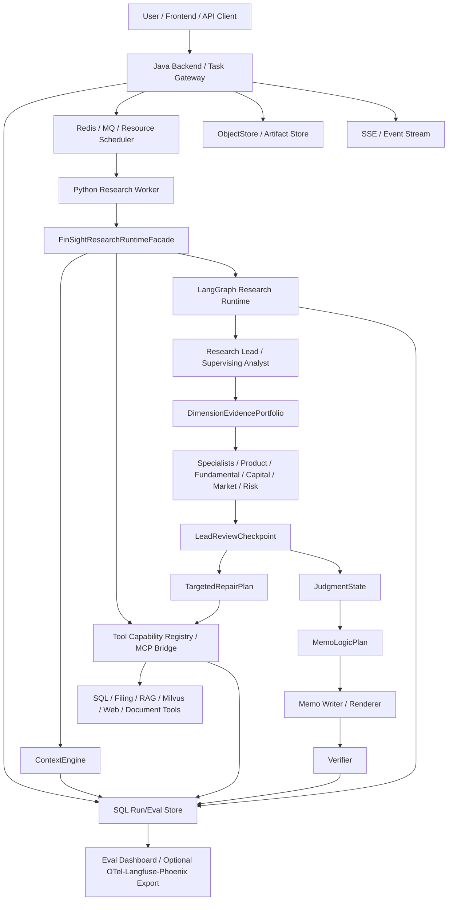

# Agent Runtime 参考架构草案：Graph / Harness / ContextEngine / MCP-A2A / Java 后端

更新时间：2026-06-28

状态：已归档参考。本文记录 2026-06-27 至 2026-06-28 关于新 Agent 架构参考、harness、Hermes / ContextEngine、MCP / A2A、durable execution、observability / eval、Java 后端技术栈、Public Evidence 数据工程方法和二级市场 / 资本反馈层的讨论草案。2026-06-28 已完成吸收审计：协作型 agent graph、runtime facade、ContextEngine、MCP/A2A、durable execution、observability/eval、Java/Python 分层已迁入 `26_b2b_collaborative_agent_graph_and_workflow_runtime.zh-CN.md`；B 端产品范围迁入 `docs/product/PRD_20260628_b2b_financial_research_workbench.zh-CN.md`；Public Evidence 数据工程方法由 R48/RD/R/PIG 主线承接；二级市场 / 资本反馈技术实现后续另拆 R54。后续实现不得以本文作为 active source of truth，本文仅保留外部参考和历史讨论出处。

## 归档映射

| 本文内容 | 当前 source of truth |
| --- | --- |
| 协作型 agent graph、Workpaper、event ledger、human review、Java/Python 分层 | `docs/architecture/agent_graph_vnext/26_b2b_collaborative_agent_graph_and_workflow_runtime.zh-CN.md` |
| B 端金融研究工作台产品范围、Workpaper 产品层、Capital Feedback Workpaper、Research-to-Quant 产品范围 | `docs/product/PRD_20260628_b2b_financial_research_workbench.zh-CN.md` |
| Public Evidence 数据工程方法、source-route/parser/authority/graph/eval 门控 | R48 checklist、RD/R/PIG 数据主线和后续数据源实现文档 |
| Eval / failure-gold lifecycle / observability 主账本 | `docs/architecture/agent_graph_vnext/11_agent_eval_runtime_framework.zh-CN.md` |
| Java 后端、前端、queue、SSE、trace、runtime bridge | `docs/architecture/agent_graph_vnext/10_backend_frontend_runtime_framework.zh-CN.md`、`12_integrated_execution_plan.zh-CN.md`、`13_09_11_remaining_full_completion_plan.zh-CN.md` |
| 二级市场 / 资本反馈数据源和 pack 技术实现 | 后续 `R54 SecondaryMarketCapitalFeedback` 技术计划 |
| 外部参考出处 | 本文保留 |

## 为什么新增本文

项目已经从早期 SEC RAG / 多 agent 串行执行，推进到：

- Research Lead 常驻监督闭环、LeadReviewCheckpoint、TargetedRepairPlan、MemoLogicPlan。
- RD0-RD7 原始披露 / RAG / 数据库主账本。
- ProductIntelligenceGraph、ProductEvidencePack、DimensionEvidencePortfolio。
- Java Task Gateway、Python worker、run audit / eval store、Workbench trace。
- 本地 `tool_harness`、`ContextEngine`、MCP registry、run/eval/object store 等基础件。

因此下一轮不应只画一个 agent graph，而要确定“企业级投研 agent runtime”怎么组织：

```text
业务研究图谱 / 数据底座
 -> Research Lead 监督型 agent graph
 -> Harness / runtime facade
 -> ContextEngine / memory / tool permissions
 -> Java backend / queue / worker / trace / frontend
 -> Eval / observability / replay / release gate
```

## 当前项目内事实

### Graph 与数据底座

- 09 文档定义了 Research Lead 从一次性派单员升级为 supervising analyst。
- 24 文档定义了 raw disclosure -> parser/chunk/table/metric -> Gold Fact / Signal Mart -> Research Graph Store -> Retrieval Index Registry -> Agent Runtime Consumption Contract -> Data Quality Release Gate。
- R43-R46 已把产品层、基本面层、资本层和 source authority 压成可供 Research Lead / specialist 消费的 ProductIntelligenceGraph / ProductEvidencePack / DimensionEvidencePortfolio。

### Harness

当前 `src/sec_agent/tool_harness.py` 仍是有效资产，但定位偏旧：

- 已有 `start_memo_analysis`、`revise_memo_scope`、`explain_evidence`、`inspect_coverage`、`reformat_answer`、`resume_analysis`、`get_session_state` 等会话级工具。
- 被 `scripts/cloud/sec_agent_tool_harness.py`、`scripts/cloud/sec_agent_tool_controller.py`、`scripts/eval_context/*` 和 `context_api.py` 使用。
- 当前 vNext 主线更多走 Workbench / LangGraph / Java bridge，harness 没有完全成为统一 runtime facade。

新的判断：harness 不应废弃，也不应只做 legacy 多轮工具。它应升级成 `FinSightResearchRuntimeFacade`，成为外部 controller、Java backend、Workbench、未来 MCP/A2A 暴露层共同调用的稳定门面。

### ContextEngine

当前 `src/sec_agent/context_engine.py` 已有：

- `resolve`
- `select`
- `compress`
- `inject`
- `write_memory`
- memory governance gate

缺口是：

- config-driven strategy selection 还不完整。
- `consolidate`、`invalidate`、`retrieve`、memory lifecycle 与 SQL/object-store 持久化还需要产品化。
- ContextEngine 还没有完全成为所有节点上下文注入的唯一入口。

### MCP

当前 `src/sec_agent/mcp_contracts.py`、`src/sec_agent/mcp_tool_registry.py`、`src/sec_agent/mcp_server.py` 已经提供 FinSight 内部 MCP-facing tool contracts。它们的方向是正确的，但后续需要从“工具可调用”升级到：

- 每个工具有 permission / source boundary / artifact output schema。
- 每次工具调用进入 run audit 和 eval。
- 工具返回 artifact refs / bounded rows，而不是无界文本。
- MCP 可作为标准化工具协议，但 FinSight 的 claim authority 仍由本地 gate 决定。

### Java 后端

10/12/13 文档和 P0-P9 已经证明 Java gateway 不是壳：

- 有 `POST /api/research/tasks`、`GET /api/research/tasks/{task_id}`、SSE、cancel、worker callback。
- Python worker 可从 file/Redis queue 取任务，执行 Workbench eval / LangGraph runtime。
- 后续应升级到 Spring Boot / Spring AI / Redis / SQL / ObjectStore / SSE / Eval dashboard 的产品化版本。

## 外部参考吸收

| 方向 | 可吸收内容 | 对 FinSight 的用法 | 参考出处 |
| --- | --- | --- | --- |
| LangGraph | long-running stateful graph、persistence、checkpointer/store、interrupt/HITL、event streaming | 保留 Python LangGraph 作为研究执行图；把 checkpoint、interrupt、resume、event stream 接入 Java task/run trace | `https://github.com/langchain-ai/langgraph`；`https://docs.langchain.com/oss/python/langgraph/persistence`；`https://docs.langchain.com/oss/python/langgraph/interrupts` |
| Microsoft Agent Framework | Python/.NET 双栈、生产级 agent / multi-agent workflow、durability、restartability、observability、HITL、OpenTelemetry | 作为“Java/.NET 后端如何承载生产 agent workflow”的参考，不迁移主 runtime；借鉴 workflow、middleware、telemetry、durable hosting 设计 | `https://github.com/microsoft/agent-framework` |
| Google ADK | code-first agent toolkit、workflow、local CLI/web UI、多 agent 目录、eval/deploy 思路 | 借鉴本地开发 UI、workflow samples、agent folder / runnable artifact 组织；不替换 FinSight 垂直数据图谱 | `https://github.com/google/adk-python` |
| Spring AI | Chain / Parallelization / Routing / Orchestrator-Workers / Evaluator-Optimizer 模式，MCP、structured output、model portability | Java 后端优先用 Spring Boot + Spring AI 承接 API、MCP client/server、prompt/model provider 管理；不要让 Java 重写 Python research graph | `https://docs.spring.io/spring-ai/reference/api/effective-agents.html`；`https://docs.spring.io/spring-ai/reference/api/mcp/mcp-overview.html` |
| Hermes Agent | ContextEngine 是可插拔接口，单一 active engine、config-driven selection、compress / token usage / lifecycle | FinSight ContextEngine 应成为统一 facade；支持策略插件，不把压缩逻辑硬编码到 gateway、Research Lead 或 writer | `https://github.com/NousResearch/hermes-agent/blob/main/website/docs/developer-guide/context-engine-plugin.md` |
| Code as Agent Harness | harness interface / mechanism / multi-agent scaling，把 code 作为 reasoning、tool use、memory、verification 的执行底座 | FinSight harness 应是可执行、可验证、可回放的 runtime facade，而不是 prompt 包装器 | `https://arxiv.org/abs/2605.18747` |
| Agentic Harness Engineering | component / experience / decision observability，把每次 harness 变更写成可验证合同 | 后续改 harness、工具、上下文、eval 时，要记录预测、trace、结果和可回滚组件，不再只看最终 memo | `https://arxiv.org/abs/2604.25850` |
| MCP | 标准化连接外部数据、工具和 workflows；server features 包含 resources/prompts/tools；支持 progress、cancel、logging；强调用户授权和工具安全 | 用于标准化 FinSight 工具与外部工具接入；不能绕过 source authority / evidence gate | `https://modelcontextprotocol.io/docs/getting-started/intro`；`https://modelcontextprotocol.io/specification/2025-06-18` |
| A2A | 让不同框架/服务器上的 agent 通过 Agent Card、JSON-RPC over HTTP(S)、SSE、async push 协作，同时不暴露内部 state/tools | 当前先不用于内部 specialist 协作；未来用于对外暴露 FinSight Research Agent 或接入外部专业 agent | `https://github.com/a2aproject/A2A`；`https://developers.googleblog.com/en/a2a-a-new-era-of-agent-interoperability/` |
| OpenAI Agents / Tools | Agents SDK、tools、guardrails、results/state、tracing/eval、MCP/connectors、file inputs、background/streaming | 作为工具、tracing、guardrail、file-input 能力设计参考；当前 DeepSeek/OpenAI provider 可通过模型路由抽象，不绑定单一供应商 | `https://developers.openai.com/tracks/building-agents` |
| Langfuse | trace、sessions、agent graph、latency/cost、datasets、experiments、LLM-as-judge、human annotation | 可选外部观测/评测 UI；FinSight SQL run/eval store 仍是审计主账本 | `https://langfuse.com/docs` |
| Phoenix / OpenInference | tracing、eval、datasets/experiments、OTLP、tool/retrieval/model span | 可选开源观测与评测面板；用于验证我们自己的 trace schema 是否缺关键 span | `https://arize.com/docs/phoenix` |
| Ragas | systematic eval loop、RAG metrics、agent tool-call metrics、datasets、test generation | 只能借鉴评测组织和部分指标；FinSight 需要自定义投研维度、ClaimCard、source boundary 和 gap metrics | `https://docs.ragas.io/en/stable/` |
| OpenTelemetry GenAI | GenAI / MCP / OpenAI 等语义约定与通用 tracing 方向 | 后续可把 SQL trace export 到 OTEL，但不得以外部 trace 取代本地可审计 run/eval DB | `https://opentelemetry.io/docs/specs/semconv/gen-ai/`；`https://opentelemetry.io/blog/2026/genai-observability/` |

## Public Evidence 数据工程方法

25 文档的 runtime 设计不能只规定 agent 怎么协作，还必须规定公开数据怎么进入研究系统。下一阶段 L2/L3 外部验证源、行业 playbook、关系图谱推理和持续 eval，统一按下面这条链路执行：

```text
Research Question
 -> Evidence Role
 -> Source Route
 -> Fetch / Snapshot / Attempt Ledger
 -> Parser / Entity Binding / Period Binding
 -> Authority Gate
 -> Fact Mart / Signal Mart / Graph Edge
 -> Role EvidencePack / DimensionEvidencePortfolio
 -> LeadReview / TargetedRepair / Eval Gate
 -> Memo / Thesis / Gap Disclosure
```

核心原则：

- 不按“网站清单”扩源，而按“证据角色”扩源。
- 不允许 route seed / URL seed / 搜索命中直接算 source coverage。
- 不允许 URL-only context 冒充 parser-backed evidence row。
- 公开源能支撑的内容必须进入结构化 row、graph edge 或 attempt-backed gap。
- 公开源找不到、无法稳定解析，或 source authority 不足时，必须写成 typed gap / commercial tracker gap，而不是用弱 proxy 填平。

### PublicEvidenceCoverageProfile

每家公司都应有机器可读的 `PublicEvidenceCoverageProfile`，用于 Research Lead 规划和 full-chain eval：

```text
company_id
ticker
primary_lane
secondary_lanes
product_families
l1_exact_fact_coverage
l2_official_regulatory_coverage
l3_proxy_signal_coverage
product_kpi_exact_coverage
product_spec_architecture_coverage
customer_deployment_coverage
supply_chain_relationship_coverage
capital_market_detail_coverage
macro_driver_coverage
source_route_attempts
parser_status
authority_boundary
commercial_gap_flags
public_gap_reasons
next_repair_routes
```

这个 profile 的作用不是要求 603 家公司每一项都有同等深度，而是让系统知道：

- 哪些维度已经有强事实。
- 哪些维度只有 bounded thesis signal。
- 哪些缺口理论上公开源可补但当前 route/parser 未打通。
- 哪些缺口属于公开源边界或商业 tracker 边界。
- Research Lead 下一轮应该查哪里、派给谁、期待什么 claim 类型。

### Evidence Role Matrix

L2/L3 扩源按证据角色组织，所有 source route 都必须写清可支持结论和 forbidden claims。

| 证据角色 | 公开源方向 | 可支持内容 | 禁止冒充 |
| --- | --- | --- | --- |
| L1 company disclosure / exact fact | SEC EDGAR APIs、20-F/6-K、非美交易所、DART/HKEX/MOPS/TDnet/company IR、公司年报/IR deck | revenue、三表、segment、debt、capex、company-disclosed product KPI exact | 没有 value/unit/period/product/citation 时不得作为 exact |
| Macro / industry cycle | FRED、BLS、BEA、Census、EIA、FDIC、Treasury Fiscal Data、CFTC | 行业周期、利率、能源、贸易、银行/地区经济暴露 | 不能直接证明公司产品销量、份额或 ASP |
| Government order / public procurement | USAspending、local tender、公开招投标、政府采购公告 | 客户/项目/合同存在、公共部门需求方向 | 不等于公司总订单、backlog、收入或客户 spend |
| Healthcare / regulated product | ClinicalTrials.gov、openFDA、FDA/CMS、NHTSA 等监管库 | pipeline、审批、召回、适应症、车型/监管风险 | 不等于处方量、销售额、真实市场份额 |
| Technology / R&D | PatentsView/USPTO、OpenAlex、论文/专利/标准组织 | 技术路线、研发方向、技术积累、topic exposure | 不等于商业成功或产品收入 |
| Developer / software ecosystem | GitHub、npm、PyPI、Hugging Face、App Store / iTunes Search | 开发者生态、采用 proxy、产品存在性、版本/包活跃度 | 不等于付费用户、ARR、收入、market share |
| Product spec / benchmark | 官方产品页、whitepaper、datasheet、MLPerf、SPEC、TOP500、OEM config | 产品参数、架构、代际、benchmark、竞品比较 | 不等于销量、ASP、sell-through、利润率 |
| Channel / availability / pricing proxy | 官方商城、Amazon/JD、Digi-Key/Mouser/Arrow、CDW、OEM 配置页 | 上架、报价、渠道可得性、配置可见性 | 不等于真实库存、出货量、ASP、渠道 sell-through |
| Capital / ownership / liquidity | SEC 13F、Form 3/4/5、13D/G、proxy、offering、FINRA short interest、基金持仓、交易量/流动性 | ownership、insider、融资事件、资金面、市场流动性、风险暴露 | 不等于基本面改善或机构一致预期 |

参考源记录：

- SEC EDGAR APIs: `https://www.sec.gov/search-filings/edgar-application-programming-interfaces`
- FRED: `https://fred.stlouisfed.org/docs/api/fred/`
- EIA: `https://www.eia.gov/opendata/`
- USAspending: `https://api.usaspending.gov/`
- ClinicalTrials.gov API: `https://clinicaltrials.gov/data-api/api`
- openFDA: `https://open.fda.gov/apis/`
- NHTSA vPIC: `https://vpic.nhtsa.dot.gov/api/`
- PatentsView / USPTO: `https://www.uspto.gov/ip-policy/economic-research/patentsview`
- OpenAlex: `https://developers.openalex.org/`
- GitHub REST API: `https://docs.github.com/en/rest`
- npm Registry API: `https://api-docs.npmjs.com/`
- Hugging Face Hub API: `https://huggingface.co/docs/hub/en/api`
- Apple Search API: `https://performance-partners.apple.com/search-api`
- MLCommons MLPerf: `https://mlcommons.org/benchmarks/`
- SPEC results: `https://www.spec.org/results/`
- FINRA short interest: `https://www.finra.org/finra-data/browse-catalog/equity-short-interest/data`
- Treasury Fiscal Data API: `https://fiscaldata.treasury.gov/api-documentation/`
- CFTC COT: `https://www.cftc.gov/MarketReports/CommitmentsofTraders/index.htm`
- Census API: `https://www.census.gov/data/developers.html`
- BLS API: `https://www.bls.gov/bls/api_features.htm`
- BEA API: `https://www.bea.gov/resources/for-developers`
- FDIC BankFind API: `https://api.fdic.gov/banks/docs`

### 行业 Playbook Contract

行业 playbook 不是行业知识科普，而是 Research Lead 的规划 schema。每个 vertical lane 至少要定义：

```text
lane_id
covered_tickers
company_categories
required_financial_metrics
required_product_or_service_slots
required_l2_source_roles
required_l3_source_roles
canonical_graph_edges
mandatory_peer_or_competitor_sets
forbidden_claims
commercial_tracker_boundaries
minimum_eval_cases
```

示例：

- AI/Semis：GPU/accelerator、HBM、CoWoS、networking、server OEM、power/cooling；关键边包括 `hyperscaler capex -> AI server demand -> GPU/HBM/CoWoS/power/cooling read-through`；缺 SKU revenue 时仍可分析规格、代际、部署、供应链和需求方向，但不能声称 H100/GB200 销售额。
- Banks：deposits、loan balance、NIM、credit cost、CET1、HTM/AFS、CRE exposure、deposit beta；关键边包括 `interest rate -> funding cost -> NIM -> deposit mix -> credit loss -> capital ratio`。
- Pharma/Biotech：pipeline、indication、trial phase、approval、label、safety/recall、commercialization partner；关键边包括 `clinical milestone -> approval probability -> addressable population -> launch/read-through`。
- SaaS/Software：ARR/RPO、retention、seat/workload adoption、developer ecosystem、marketplace/review、pricing tier、cloud consumption；关键边包括 `product adoption proxy -> workload expansion -> RPO/remaining obligation -> revenue durability`。
- Energy/Utilities：production、reserves、realized price、capacity、utilization、capex、debt maturity、regulatory rate case；关键边包括 `commodity / rate / regulation -> margin / capex / leverage / dividend capacity`。

### 图谱推理 Contract

关系图谱必须从“信息组织”升级为 Research Lead 的推理主通道。至少保留四类图：

| 图谱 | 主要节点 | 主要边 |
| --- | --- | --- |
| ProductGraph | Company、ProductFamily、Product、Spec、Generation、Benchmark | `generation_successor`、`competes_with`、`substitutes_for`、`complements`、`benchmark_better_than` |
| CustomerDeploymentGraph | Company、Product、Customer、Channel、Platform、Project、Contract | `deployed_by`、`ordered_by`、`adopted_by`、`configured_in`、`distributed_by`、`sold_through` |
| SupplyChainGraph | Supplier、Customer、Component、Capacity、Bottleneck、ManufacturingNode | `upstream_of`、`downstream_of`、`supply_constraint_for`、`read_through_to` |
| CapitalMacroGraph | Issuer、Security、Debt、Holder、Rate、MacroDriver、LiquiditySignal | `financed_by`、`held_by`、`sensitive_to`、`refinancing_risk_from`、`liquidity_pressure_from` |

每条边必须有：

```text
edge_type
direction
evidence_refs
source_role
authority_level
confidence
period_or_version
forbidden_claim_scope
```

例如：

- `GB200 generation_successor H100`：technical fact / product capability。
- `TPU substitutes_for GPU in selected workloads`：competitive thesis edge。
- `AWS capex read_through_to AI server/GPU demand`：capex / demand proxy edge。
- `USAspending award links PLTR to government customer`：government customer/order proxy edge。

### Data / Parser / Graph / Research Eval Gate

持续 eval 必须覆盖五层，不只评最终 memo：

1. Data source eval：fetch 是否成功，是否有 snapshot，是否只是 URL-only，是否有 attempt-backed gap。
2. Parser eval：是否抽出结构化 fields；表格是否错列；value/unit/period/product/citation 是否完整。
3. Authority eval：是否把 proxy 冒充 exact；是否把 ProductSpec/Deployment/Benchmark 写成 revenue/share/order。
4. Graph eval：边类型、方向、证据、置信度、forbidden scope 是否正确。
5. Research eval：Research Lead 是否发现缺口并触发 targeted repair；specialist 是否消费 role EvidencePack；Memo 是否输出判断、依据、反证、边界和投资含义，而不是证据堆叠或 gap-first 安全话术。

每个行业 playbook 至少配套：

- 3 个 deterministic parser cases。
- 3 个 graph reasoning cases。
- 3 个 full-chain research cases。
- 1 个 deliberate gap case。
- 1 个 forbidden promotion case。

这些 eval case 必须进入 11 文档定义的 failure/gold lifecycle；不允许只在聊天里人工看一次。

### 实施顺序

1. 冻结 `PublicEvidenceCoverageProfile` schema，并从现有 RD/PIG/SourceAuthority/DepthGate 产物生成 603 公司 baseline。
2. 先做 AI/Semis、Banks、Pharma、Auto、SaaS、Energy 六个代表行业 playbook。
3. 每个行业只补能产生 parser-backed row / graph edge / attempt-backed gap 的 source-route adapter。
4. 升级 graph edge v2，把同类可比、真实竞争、替代、互补、上下游、客户部署、capex read-through、资本敏感性分开。
5. 把 source-route、parser、authority、graph、Research Lead、Memo 输出全部纳入 eval gate。
6. 再跑 full-chain；如果上游 profile / graph / source route 不通过，不允许用 Memo Writer 或 prompt 调参掩盖。

## Secondary Market / Capital Feedback Layer 草案

当前项目已经较强地回答了“公司业务和财务事实是什么”。但如果目标是二级市场投研，还必须回答：

- 市场是否已经把好消息 price in。
- 资金是否拥挤。
- 股价、信用、融资窗口是否会反过来改变公司资本结构和战略空间。
- 宏观、政策、衍生品、跨资产信号是否改变估值和风险偏好。

因此 25 文档暂时把二级市场、资金面、预期面、资本反馈合并为草案层，不立即拆执行计划：

```text
Fundamental / Product / Industry Evidence
 -> 判断公司长期价值、业务质量和竞争力

Secondary Market / Capital Flow Evidence
 -> 判断市场是否愿意给这个价格、资金是否支持、风险是否拥挤

Credit / Corporate Action Evidence
 -> 判断公司资本成本、融资窗口、稀释、回购、并购和资本结构压力

Macro / Derivatives / Policy / Cross-Asset Evidence
 -> 判断外部流动性、风险偏好、行业 beta 和事件催化
```

### 建议 Pack

| Pack | 主要数据 | 回答的问题 | 当前项目基础 |
| --- | --- | --- | --- |
| `SecondaryMarketCapitalFlowPack` | 股价、成交额、换手率、相对收益、波动率、drawdown、市场反应 | 股价是否强、波动是否高、是否已经出现市场反应 | 已有 `market_liquidity_driver_context_rows_v0_1`，603/603 price/volume/return/volatility/drawdown；缺更完整成交额、换手率、free float、估值字段 |
| `OwnershipAndHolderPack` | 13F、N-PORT、ETF 持仓和权重、13D/G、大股东、insider Form 3/4/5 | 谁在持有、是否机构拥挤、是否被动资金推动、是否有 activist/insider 变化 | 已有 13F lagged ownership context 和 13D/G/Form 3/4/5 metadata；缺全量持仓明细、比例、ETF 权重和 insider transaction XML/parser |
| `CreditFundingPack` | 公司债收益率、credit spread、CDS、债务到期、可转债、loan / credit facility、评级 | 融资成本是否上升、债务市场是否更悲观、是否有流动性/再融资风险 | 已有 debt instrument / credit facility / working-capital rows；缺公司债市场价格、credit spread、评级、CDS 和可转债市场价格 |
| `CorporateActionPack` | buyback authorization / actual repurchase、S-1/S-3/424B、ATM、convertible、M&A、股权激励、insider 增减持 | 公司是否趁高股价融资、是否稀释、是否回购托底、管理层是否认为便宜 | 已有 offering / insider / proxy / 13D-G filing-event metadata；缺 offering terms、buyback amount、insider shares/price、proxy compensation/vote parser |
| `LiquidityAndPositioningPack` | ADV、turnover、bid-ask、free float、short interest、borrow cost、大宗交易、解禁、options OI/put-call/skew | 是否拥挤、是否容易交易、是否有逼空或流动性踩踏风险 | 已有价格波动与 drawdown；缺 FINRA short interest、borrow cost、bid-ask、free float、options positioning |
| `ValuationPriceInPack` | PE、PB、PS、EV/EBITDA、FCF yield、历史分位、同行估值、PEG、implied growth、DCF sensitivity、事件反应 | 好消息是否已反映、估值扩张来自基本面还是流动性、下修时杀业绩还是杀估值 | 财务事实和价格快照已有；缺稳定 shares/EV/market cap/历史估值分位/同行估值面板 |
| `ExpectationNarrativePack` | guidance、analyst revision、earnings surprise、新闻/政策、产品发布、订单/客户部署、行业会议、搜索/社媒低权重 proxy | 市场现在相信什么、叙事是否变化、预期上修还是下修 | 已有管理层披露、产品/部署/proxy；缺 consensus/revision/surprise，新闻和低权重社媒需严格边界 |
| `EventCatalystPack` | earnings date、investor day、产品发布、PDUFA/临床读数、股东大会、分红除权、指数调仓、可转债到期/回售/赎回 | 近期是否有催化剂、是否提前交易事件、是否有 sell-the-news 风险 | SEC filing dates 和部分 regulatory/product rows 已有；缺统一事件日历与行业事件 schema |
| `PolicyRegulatoryPack` | 产业政策、监管处罚、反垄断、医保控费、出口管制、补贴、利率/地产政策、再融资/减持规则 | 政策是否强化或压制公司逻辑，是否改变资金偏好 | 监管/政策源已有零散 route；缺按行业政策影响图谱和事件日历 |
| `CrossAssetReadThroughPack` | 同行业股票、上下游股票、ETF/板块、债券、汇率、商品、竞争对手、供应链公司 | 是公司 alpha 还是行业 beta，是否板块轮动，上下游是否提前反应 | Product/SupplyChain graph 已有；缺跨资产价格/行业 ETF/商品/汇率映射 |
| `DerivativesMarketSignalPack` | 股指/利率/商品 futures、VIX curve、CFTC COT、single-stock/ETF options OI/volume/IV/skew/put-call、implied move | 市场如何定价未来波动、宏观/商品预期和仓位拥挤 | 当前基本未物化；需新增 OCC/CME/CFTC/options/futures adapters |

### 公开源和边界

优先公开源：

- SEC：13F、N-PORT、13D/G、Form 3/4/5、S-1/S-3/424B、proxy、buyback / repurchase disclosure。
- FINRA：short interest。
- OCC：options volume / open interest。
- CFTC：Commitments of Traders。
- CME：delayed futures quotes / settlements。
- FRED / Treasury / EIA / CFTC：利率、信用、美元、能源、商品、宏观流动性。
- 价格快照：Yahoo / Nasdaq / Stooq 等只能作为 L3 market snapshot，必须标注非官方或延迟边界。

公开源可以支持：

- 滞后机构持仓和大股东 filing context。
- insider / beneficial ownership / offering filing event。
- 日频或延迟市场价格、波动、回撤、相对收益。
- 周频 COT 仓位、日频/延迟 futures curve、options volume/open interest。
- 公司披露的债务、credit facility、实际回购、股息、股权激励和融资事件。

公开源通常不能稳定支持：

- 实时资金流。
- 实时 ETF creation/redemption。
- 实时机构买卖。
- securities lending borrow cost。
- dealer gamma / exact gamma exposure。
- 实时 OPRA 全市场 options feed。
- 实时 futures order book。
- consensus estimate / revision / target price 聚合。

这些必须保留为 commercial data gap 或低权重 proxy，不得强行提权。

### Authority Boundary

二级市场和衍生品信号只能进入 market expectation / positioning / price-in / capital feedback 层，不能冒充基本面事实。

允许：

- “13F 显示某机构在上一报告期持有该股票，支持滞后机构持仓背景。”
- “FINRA short interest 上升可作为空头拥挤度信号。”
- “期权 IV / OI 显示事件前市场定价更高波动。”
- “原油期货上涨提高航空、化工等行业成本压力的背景。”
- “S-3 shelf / ATM / 424B filing event 表明公司具备或使用资本市场融资通道。”

禁止：

- “13F 持仓增加 = 当前资金正在流入。”
- “call OI 高 = 公司基本面改善。”
- “原油上涨 = 某公司利润一定下降 X%。”
- “offering metadata = 已融资金额/稀释比例。”
- “股价上涨 = 公司经营改善。”
- “short interest 高 = 必然发生 squeeze。”

### Graph Edge 草案

新增边类型建议：

```text
ticker -> held_by -> fund_or_institution
ticker -> included_in -> etf_or_index
ticker -> exposed_to -> passive_flow_exposure
ticker -> short_interest_signal -> market_positioning
ticker -> options_positioning_signal -> event_risk_pricing
ticker -> valued_by -> valuation_multiple
ticker -> affected_by -> buyback / offering / insider / index_rebalance
issuer -> financed_by -> debt / convertible / credit_facility
issuer -> refinancing_risk_from -> maturity_wall / rate_level / credit_spread
futures_contract -> input_cost_exposure -> industry_or_company
rate_future -> discount_rate_expectation -> growth_equities / banks / real_estate
commodity_future -> margin_pressure_or_demand_proxy -> industry_or_company
vix_curve -> volatility_regime -> equity_market_liquidity
cross_asset_peer -> read_through_to -> ticker_or_industry
policy_event -> valuation_or_funding_regime_shift -> industry_or_company
```

每条边必须有：

```text
edge_type
source_role
period
lag_policy
authority_level
confidence
forbidden_claim_scope
evidence_ref
```

### 和现有系统的关系

- `FundamentalStatementPack` 回答三表、利润、现金流、资产负债和经营质量。
- `ProductIntelligenceGraph` 回答产品、产线、客户部署、供应链和竞争关系。
- `DimensionEvidencePortfolio` 应新增 secondary-market / capital-feedback 维度，而不是把这些信号塞进 market specialist 的散装 rows。
- `Research Lead` 需要用这些 pack 判断：基本面是否支持、市场是否已经定价、资金是否拥挤、资本动作是否可能反向改变公司命运。
- `Memo Writer` 只能写经过 JudgmentState / MemoLogicPlan 组织后的二级市场判断，不能直接从 options / short / price rows 推投资建议。

### 初步实施优先级

讨论草案先不拆执行计划，但后续可按以下顺序收敛：

1. 定义 `SecondaryMarketCapitalFeedback Framework` 和 pack contracts。
2. 补 `ValuationPriceInPack`：shares、market cap、EV、multiples、peer/historical valuation。
3. 补 SEC capital action 细 parser：Form 3/4/5 XML、13D/G schedules、S-3/424B/offering terms、buyback、proxy。
4. 补 `FINRA short interest`、`13F / N-PORT ownership mart`。
5. 补 `OCC / CFTC / CME` 衍生品和 futures 日频/延迟/周频 proxy。
6. 补 CrossAsset / Macro / Policy graph mapping。
7. 把 secondary-market pack 纳入 LeadReview、TargetedRepair、forbidden-promotion eval 和 full-chain case。

## 目标架构草案



## Harness 升级方向

`SecAgentToolHarness` 下一步应演进成 `FinSightResearchRuntimeFacade`。它不是一个 agent，也不是另一个 writer，而是统一的可审计执行门面。

建议接口：

```text
start_run(payload) -> run_id/task_id
resume_run(run_id, resume_payload)
cancel_run(run_id)
get_run_state(run_id)
get_trace(run_id, filters)
get_artifacts(run_id)
explain_evidence(run_id, claim_id | evidence_id | dimension)
inspect_coverage(run_id, dimension | ticker | source_role)
run_eval(eval_id, dataset_version, profile)
replay_node(run_id, node_id, input_snapshot_id)
```

必须保持的边界：

- Facade 可以调 LangGraph、MCP tools、DB、ObjectStore、Eval runner。
- Facade 不直接生成投研结论。
- Facade 输出必须是 typed artifact refs、trace events、run state、evidence/gap/gate refs。
- Memo Writer 不通过 facade 补事实；Research Lead / LeadReview 才能触发 targeted repair。

## ContextEngine 升级方向

ContextEngine 应成为所有节点上下文选择和压缩的唯一入口，借鉴 Hermes 的“单一 active engine + config-driven selection”。

建议接口：

```text
resolve(run_state, scope)
select(context_snapshots, target_node, role, token_budget)
compress(selection, policy)
inject(selection, target_node)
write_memory(candidate)
consolidate(memory_candidates)
retrieve(query, scope, freshness, authority_boundary)
invalidate(memory_id | context_snapshot_id, reason)
```

FinSight 特殊要求：

- 压缩不得丢 `source_boundary`、`period`、`unit`、`citation`、`gap_type`、`evidence_refs`、`claim_refs`。
- memory 只能是 planning context，不能直接支撑 financial / product exact claim。
- Research Lead 可看全局 evidence portfolio 和 gap ledger；specialist 只看 role-scoped refs；Memo Writer 只看 verified judgment inputs。
- context injection plan 必须进入 run audit，支持 replay。

## MCP 与 A2A 分工

### MCP

当前应优先使用 MCP 做工具与数据源标准化：

- SEC / filing / ledger / SQL query。
- Milvus semantic supplement。
- public source fetch / parse / snapshot。
- document input parser。
- PDF / DOCX / XLSX / Markdown / graph renderer。
- source capability and coverage inspection。

MCP 工具准入条件：

- 有 JSON schema 输入输出。
- 有 permission scope。
- 有 source boundary / forbidden claims。
- 返回 artifact refs 或 bounded rows。
- 写入 tool_call_ledger / eval metrics。

### A2A

A2A 暂时不进入内部 Research Lead / specialist graph。原因：

- 内部协作需要共享强约束 state、source authority 和 ClaimCard/gap/gate，不适合把 specialist 封装成 opaque external agents。
- A2A 更适合未来 FinSight 对外暴露“投研 agent 服务”，或和外部 agent 平台协作。

可保留的未来入口：

- FinSightResearchAgent A2A server。
- Agent Card 暴露 capability、supported artifacts、SLA、auth、streaming。
- 外部 agent 只能拿 bounded output / artifact，不拿内部私有 chain-of-thought 或未验证 raw rows。

## Durable Execution 设计锚点

核心不是“LangGraph checkpoint 或 Java DB 二选一”，而是分层：

| 层 | 负责什么 | 主账本 |
| --- | --- | --- |
| Java task layer | 用户任务、权限、状态、SSE、cancel/resume、队列、worker 心跳 | SQL + Redis transient |
| Python graph layer | ResearchObjectiveContract、node state、checkpoint、specialist outputs、repair loops | LangGraph checkpoint + SQL artifact refs |
| Tool / parser layer | tool call、fetch attempt、parser output、source snapshot、runtime row lineage | SQL + ObjectStore |
| Eval layer | case、dataset、node result、metric、failure/gold lifecycle、judge audit | SQL Eval Store |
| Context layer | context snapshot、injection plan、memory state、invalidation | SQL + ObjectStore |

必须支持：

- run resume。
- node replay。
- idempotent tool call / artifact write。
- cancel and timeout。
- stuck worker recovery。
- queue wait / worker wait / provider wait / BGE wait 记录。
- failure 进入可治理队列，而不是只写日志。

## Observability / Eval 设计锚点

FinSight 的观测主账本仍应是本地 SQL run/eval store。外部平台只做 export / dashboard / debug 辅助。

默认 span / event 应覆盖：

- run / task / user request。
- Research Lead planning。
- retrieval plan / retrieval route / rerank。
- source adapter / fetch / parser / verifier。
- MCP tool call。
- ContextEngine resolve/select/compress/inject。
- model call / token / latency / cost。
- BGE queue / CUDA slot / CPU spillover。
- specialist execution。
- LeadReviewCheckpoint / targeted repair。
- JudgmentState / MemoLogicPlan / Memo Writer / Verifier。
- frontend trace view / user feedback / manual annotation。

Eval 必须覆盖：

- Data / parser / index source asset eval。
- Retrieval target-in-candidates、pre/post-rerank、role-visible recall。
- Tool call accuracy / source boundary misuse。
- Research Lead planning quality。
- specialist pack quality。
- Memo readability / thesis density / caveat balance。
- verifier factuality and forbidden-claim detection。
- latency / cost / concurrency / queue wait。
- failure/gold lifecycle。

## Java 后端技术栈建议

当前不建议重写 Python research runtime。Java 侧建议承担产品化和平台化：

| 能力 | 建议技术 |
| --- | --- |
| API / task gateway | Spring Boot Web / WebFlux；初期保留已跑通 JDK gateway 作为兼容 smoke |
| Auth / tenant / permissions | Spring Security |
| SQL store | MySQL/Postgres + Flyway/Liquibase + Spring Data JDBC/JPA |
| Queue / status / locks | Redis；后续可接 MQ |
| Event stream | SSE first；必要时 WebSocket |
| Artifact store | MinIO/S3-compatible ObjectStore |
| Worker bridge | Redis/MQ payload + Python worker callback |
| Observability | Micrometer + OpenTelemetry exporter；SQL run/eval store 仍为审计主账本 |
| MCP | Spring AI MCP client/server + 现有 Python MCP server 并存 |
| Eval dashboard | 后端 SQL API + 前端 trace/eval views |
| Load / integration test | JUnit/Testcontainers + Python deterministic eval runner |

不建议：

- 不要把 Research Lead / specialist 全部迁到 Java。
- 不要用 Spring AI 的通用 agent 抹掉 FinSight 的 source authority / ClaimCard / gap/gate。
- 不要把 Langfuse / Phoenix / LangSmith 作为唯一真相库。
- 不要在当前阶段把 A2A 用作内部 specialist 通信协议。

## 后续讨论待定项

1. `FinSightResearchRuntimeFacade` 是直接改造 `SecAgentToolHarness`，还是新增 facade 后逐步迁移旧 harness？
2. ContextEngine 是否需要插件目录和 config registry，还是先在 Python 内部用 strategy enum？
3. Java 后端升级时是否直接上 Spring Boot + Flyway + Redis + MySQL/Postgres，还是保留 JDK gateway 作为 local smoke fallback？
4. MCP 工具暴露给模型、Research Lead、Workbench、外部客户端的权限是否要分成四个 profile？
5. OTel/Langfuse/Phoenix 先做 export adapter，还是等 SQL eval dashboard 更稳定后再做？
6. A2A 是只做 future note，还是先写 Agent Card schema draft？
7. `PublicEvidenceCoverageProfile` 是否作为 RD8 / R48 的第一任务，还是先从 AI/Semis lane 手工补强后再抽象为全局 contract？
8. `SecondaryMarketCapitalFeedback` 是先作为 `DimensionEvidencePortfolio` 的新维度接入，还是先在 market/capital specialist 内部以 pack refs 方式试运行？
9. 衍生品和资金面公开源优先级：先补 FINRA/13F/N-PORT/SEC capital actions，还是同时补 OCC/CFTC/CME 的日频/周频 proxy？

## 当前结论

- 保留 Python / LangGraph 作为投研执行核心。
- 把 Research Lead supervised graph 和 DimensionEvidencePortfolio 作为下一轮 graph 主线。
- 所有 L2/L3 外部验证源扩展都必须走 `Evidence Role -> Source Route -> Parser -> Authority Gate -> Graph/EvidencePack -> Eval`，不再按网站清单或 URL seed 计入 coverage。
- 每家公司需要 `PublicEvidenceCoverageProfile`，让 Research Lead 能区分 strong fact、bounded thesis signal、retrievable gap、public-source boundary 和 commercial tracker gap。
- 新增 `Secondary Market / Capital Feedback Layer` 草案，明确二级市场资金面、预期面、信用融资、资本动作、宏观/政策/衍生品和跨资产信号是投研判断的一部分，但只能支持 market expectation / positioning / price-in / capital feedback，不能冒充公司基本面事实。
- 把 harness 升级成 runtime facade，让 Java backend、Workbench、controller、future MCP/A2A 都走同一可审计入口。
- ContextEngine 要从压缩工具升级为上下文治理层。
- MCP 用于工具和数据源标准化；A2A 暂缓到外部 agent interoperability。
- Durable execution 以 SQL run/eval store + LangGraph checkpoint + ObjectStore artifact refs 共同实现。
- Observability/eval 先以本地 SQL 可审计为准，再考虑 OTel/Langfuse/Phoenix export。
- Java 后端做真实产品化 task/runtime/trace/eval/frontend，不重写研究 agent。
