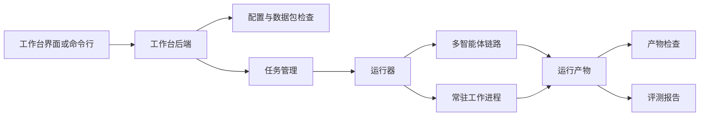

# 后端与评测运行时

本文说明 FinSight-Agent 的本地工作台后端和评测运行时。它们让项目不只是命令行研究脚本，而是具备任务管理、运行轨迹、模型调用量、耗时统计和评测报告的可观测后端雏形。

## 设计目标

后端和评测运行时解决四个问题：

1. 用统一入口启动单轮、多轮和评测任务。
2. 把运行配置、数据产物和环境变量隔离管理。
3. 记录节点轨迹、工具调用、模型调用量、耗时和错误。
4. 生成可复盘的评测报告，帮助判断当前链路是否可继续推进。

它不是生产级在线服务，但已经能支撑本地演示、诊断评测和工程复盘。

## 组件概览

| 组件 | 作用 |
| --- | --- |
| 工作台后端 | 提供本地任务、运行、评测和产物检查入口 |
| 配置与数据包检查 | 检查披露、市场、行业、关系、索引和模型路由是否就绪 |
| 任务管理 | 记录任务状态、开始时间、结束时间、错误和产物目录 |
| 运行器 | 启动单轮问答、多轮会话或评测命令 |
| 常驻工作进程 | 缓存披露清单、重排模型和向量数据库连接，降低冷启动 |
| 产物检查 | 读取运行目录中的摘要、台账、节点轨迹和最终答案 |
| 评测报告 | 汇总通过情况、耗时、模型调用量、工具轨迹和失败原因 |

## 运行任务

后端可以启动三类任务：

| 任务类型 | 用途 |
| --- | --- |
| 单轮任务 | 对一个用户问题运行完整研究链路 |
| 多轮任务 | 在同一会话中继续追问、收缩范围或检查证据 |
| 评测任务 | 按固定用例集运行链路并生成质量报告 |

任务启动后，后端会记录任务状态和运行目录。运行目录包含节点状态、工具台账、模型调用摘要、证据覆盖、备忘录和最终答案等产物。

## 可观测指标

当前后端和评测运行时重点记录：

- 每个任务是否通过。
- 每个案例耗时。
- 模型调用量。
- 工具调用次数和工具名。
- 检索返回行数和来源缺口。
- 二次检索是否发生以及是否有增益。
- 备忘录写作和校验是否修复。
- 最终答案是否保留证据边界。

这些指标用于回答两个问题：链路是否正确，以及链路是否值得继续扩展。

## 常驻工作进程

完整链路中，披露清单加载、重排模型加载和向量数据库连接可能带来明显冷启动成本。常驻工作进程用于缓存这些资源：

- 披露清单和项目清单。
- 重排模型和设备选择。
- 向量数据库连接。
- 常用检索上下文。

这样可以让后续任务复用已加载资源，减少重复初始化。当前常驻进程主要用于本地和云端诊断，不代表生产级服务。

## 评测运行时

评测运行时把用例、数据配置、模型路由和质量门控合在一起。一次评测通常会检查：

- 研究负责人是否正确分类问题和激活智能体。
- 公司范围与关系构建是否合理。
- 证据执行器是否真实调用工具。
- 覆盖检查是否正确保留缺口。
- 专家结论卡是否有证据支撑。
- 判断汇总和备忘录是否保留未解决缺口。
- 校验器是否阻断越界结论。
- 最终呈现是否对用户可读。

评测报告不是只看最终答案是否流畅，而是把每个关键节点拆开检查。

## 与工作台的关系

工作台是后端能力的本地产品化入口。它把过去分散的命令、配置和报告集中到一个可操作界面：

- 导入运行配置。
- 检查数据包是否可用。
- 启动数据准备或评测任务。
- 查看任务状态和错误。
- 检查运行产物和评测报告。

这对项目展示很重要：它说明系统已经从“研究脚本”推进到“可观测后端工作流”。

## 当前评测状态

最新公开评测摘要显示，扩展后的后端诊断链路已经完成 20 个真实风格案例，覆盖精确查询、聚焦回答、标准备忘录、行业深度、多轮追问、范围决策和缺口升级，结果全部通过。

这个结果说明当前后端可以支撑完整诊断评测，但不能直接等同于生产服务。主要原因是：

- 行业深度问题耗时和模型调用量仍高。
- 当前向量数据库路径不是生产级 GPU 索引服务。
- 多用户权限、队列、成本控制和服务治理尚未完整工程化。
- 部分数据源仍有覆盖缺口。

## 公开边界

后端文档不公开接口密钥、云端临时地址、私有数据路径或原始模型响应。公开仓库保留的是代码、配置模板、质量合同和可复现的结构检查入口。
