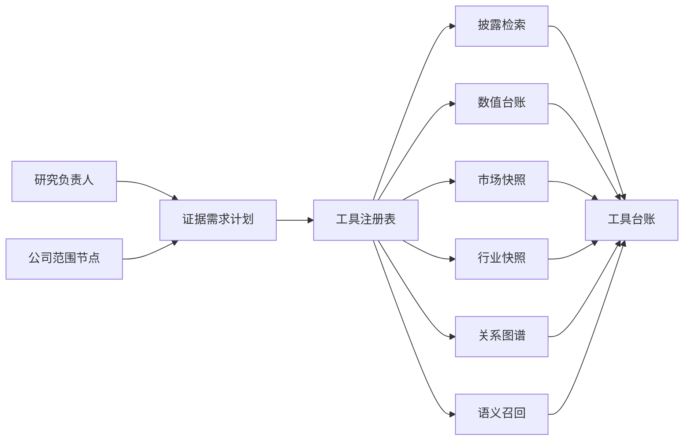

# 数据与工具权限模型

本文说明 FinSight-Agent 如何管理数据来源、工具调用和智能体权限。这个模型的目标是让系统能利用多源数据，同时避免模型越权取数、混用来源或把假设写成事实。

## 基本原则

1. 来源不同，能支持的结论不同。
2. 不是所有智能体都能调用工具。
3. 专家智能体只能看限定证据，不能自己扩大范围。
4. 备忘录写作器不能读取原始证据，只能读取已验证提纲。
5. 校验器不能新增观点，只能检查和定点修复。

## 证据来源边界

| 来源类型 | 能支持什么 | 不能支持什么 |
| --- | --- | --- |
| 公开披露文件 | 财务事实、业务描述、风险因素、管理层讨论 | 实时股价、市场一致预期、未披露客户关系 |
| 公司业绩材料 | 管理层解释、经营动量、指引口径 | 审计财务事实、第三方市场判断 |
| 精确数值台账 | 公司、期间、指标、单位明确的数值结论 | 台账不存在的指标或期间 |
| 市场快照 | 离线市场表现、相对收益、事件窗口和估值语境 | 实时行情、价格目标、公司经营事实 |
| 行业快照 | 宏观、行业、能源、利率、消费等背景 | 具体公司披露事实 |
| 关系图谱 | 同业、供应链、客户、基础设施和经济传导假设 | 未确认客户、供应商、合同或收入事实 |
| 语义召回 | 补充长文本和对象证据召回 | 独立事实校验或精确数值权威 |

最终答案必须保留这些边界。例如“市场上涨”不能推出“收入确认增长”；“可能的供应链暴露”不能写成“已确认客户关系”。

## 工具权限

| 智能体 | 工具权限 | 说明 |
| --- | --- | --- |
| 研究负责人 | 请求型 | 可以提出证据需求和范围建议，不能直接检索数据 |
| 公司范围与关系构建 | 请求型 | 可以请求关系图谱查询，输出范围计划和关系假设 |
| 证据执行器 | 受控执行 | 可以调用披露检索、数值台账、市场、行业、关系和语义召回工具 |
| 覆盖检查 | 编排型 | 可以建议二次检索或有边界回答 |
| 专家智能体 | 只读限定证据 | 不能调用检索工具，不能扩大公司范围 |
| 判断汇总器 | 只读限定证据 | 读取专家结论卡、缺口和约束，不新增事实 |
| 备忘录写作器 | 无工具权限 | 只读取已验证提纲和来源边界 |
| 校验器 | 只读检查 | 检查备忘录和证据边界，不新增观点 |
| 呈现器 | 无工具权限 | 只格式化已验证结果 |

这样设计的目的是把“谁能取证”和“谁能写结论”分开，降低幻觉和越界风险。

## 工具调用路径

真实工具调用通过工具注册表执行。模型不能直接读私有目录、数据库或索引文件。每次工具调用都应记录调用者、工具名、参数摘要、返回行数、来源缺口、耗时和预算状态。

## 检索路径选择

系统会根据问题类型选择不同证据路径：

| 问题类型 | 优先路径 |
| --- | --- |
| 精确查数 | 数值台账、结构化对象、披露表格 |
| 单公司基本面 | 披露检索、数值台账、业绩材料 |
| 市场反应 | 市场快照、披露和业绩材料作为背景 |
| 同业比较 | 多公司披露、数值台账、市场快照 |
| 行业深度 | 披露、行业快照、关系图谱、语义召回 |
| 供应链传导 | 关系图谱、行业快照、目标公司披露和候选公司披露 |
| 风险反证 | 风险段落、管理层讨论、市场/行业背景和缺口请求 |

向量召回主要用于补充复杂语义查询，不能替代精确数值台账和对象检索。精确查数问题应尽量绕开大模型写作路径，直接返回有来源边界的结果。

## 来源强度

关系和行业证据需要特别标注强度：

| 强度 | 含义 | 可写入答案的方式 |
| --- | --- | --- |
| 已验证 | 有披露、合同、公告或可靠来源支持 | 可以写成有来源的关系事实，但仍不能推出财务数值 |
| 推断 | 多条证据支持经济联系，但缺直接确认 | 写成经济传导或研究假设 |
| 假设 | 只有行业逻辑或弱证据 | 必须标注为待验证 |
| 来源缺口 | 当前知识库没有足够来源 | 作为缺口请求或边界说明 |

## 私有数据与公开仓库边界

公开仓库不保存：

- 私有披露原文或供应商数据。
- 生成索引、模型缓存和大体量运行产物。
- 接口密钥、令牌、密码或云端临时路径。
- 原始模型响应。

公开文档只说明数据合同、工具边界和复现方式。使用者需要用自己的公开披露、市场快照和行业数据生成同类产物，再通过配置接入。

## 当前边界

- 部分非美国公司披露解析仍需要按市场和监管源继续补齐。
- 全量估值字段覆盖不足，不能要求市场专家每次都给完整估值倍数分析。
- 当前关系图谱仍主要支持研究范围和传导假设，不等同于商业供应链数据库。
- 语义召回目前是补召回能力，不是生产级 GPU 向量索引服务。
