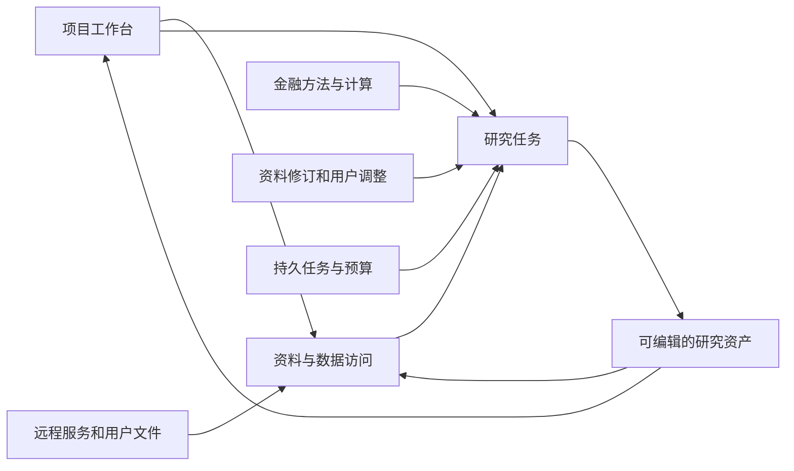

# FinSight 0.1.4 技术方案

2026-09-14 · 文档草案 v0.1 · E1/E2已有局部运行实现，E3方法消费已有真实对照、金融质量仍未接受；完整范围按执行路线推进，未整版验收。

[PRD](../product/fin_0_1_4_prd.zh-CN.md) · [执行路线](../engineering/fin_0_1_4_execution_roadmap.zh-CN.md) · [当前架构](../public/architecture.zh-CN.md)

## 1. 分工与数据流

跨公司资料研究适配：专家输入保留宿主财务目录的全部指标及每项 `observed_tickers`，不再按参考案例公司筛选；可见目录不授予查询或数值权威，查询仍检查期间、单位和来源。普通对话的研究方法工具独立于财务数据库配置，使仅有上传资料的任务也能读取既有方法。参考案例标识保持兼容。

多来源验证复用现有项目 BFF、SQLite、资料解析、原生 LangChain Agent、来源计算器和预算适配。七份真实原件的项目选择、任务快照、方法/正文工具及重开回读已有脚本模型证据；这不证明自主研究质量或完整任务费用。单 Agent 成本对照入口在 `tests/integration/test_multisource_cost_baseline.py`，默认关闭；运行资料、预算依据和结果保存在本地，不进入公共仓库。

内部记录 020整稿复核与责任修订：复用CaseArtifacts、原生case reviewer/repair与MCP。完整复核的read coverage只接受workpaper读取，全部claims不包含正文/反证/缺口；局部发现可先保存，revision_only维持原机械差异范围。作者通过既有PaperRevision更新受影响字段/引用，保留未改主张及计算源；新增指引不构成自动金融语义判定或新规则平台。本地保存稿链路通过，自主纠错质量未资格。

内部记录 018资料导航在TaskAttachmentStore投影层复用原块顺序，outline只列一次section并提供不可引用的原文预览；items内document_navigation给出块位置/总数及现有读取或视觉工具参数。字段不记录历史读状态，也不裁决缺口；section/leaf旧ID、来源正文和摘要保持。共享冻结本地树的导航与原件解析不变。

E3首个实现见内部记录 017：复用六项方法资源、现有MCP和Studio绑定，在同步专家允许request_method时追加现有方法指引，去除旧结构化入口发送前的提示重建。方法全文只作指导，不产生来源观察或额外权限，保存配置不被改写。真实Pro三臂证明全文可到达且可动态读取，但不能证明方法有效；同源可读分部表仍未查。下一责任点是现有资料导航与缺口检查，不引入新方法引擎。

工程治理使用Git/CI；执行、队列、事务、存储和观测优先使用成熟组件；FIN负责金融口径、来源权威、方法适用、研究优先级与交付。保留既有运行栈作为首选验证对象，不因为规划更新而整体重写。

2026-09-14 Owner要求案例随工程进度扩大并以成熟方案加速交付，具体顺序见执行路线§4。当前采用边界如下；候选不是已安装、已批准云上传或已通过FIN资格的组件：

| 能力 | 下一切片采用决定 | 何时才引入或替换 |
| --- | --- | --- |
| 研究状态、暂停、任务恢复 | 保留已锁定Agent Server/LangGraph，复用原生状态与checkpoint；PG/Redis承担现有运行职责 | 仅在真实故障/许可证明现用方案不能满足当前切片时比较成熟替代，不自研工作流或第二套恢复协议 |
| 存储、版本、并发 | 保留现有SQLite项目存储与PG预算事务；FIN只维护资产版本、金融权限与调用身份 | 跨机实际部署再资格化共享存储和迁移；不先新建元数据、锁或通用权限服务 |
| 模型工具和纠错 | 官方/现用SDK、MCP与原生作者/复核入口；新案例通过输入数据及配置复用现有入口 | 通用循环、重试和传输由组件拥有；FIN负责主张依据、财务计算、责任修订及停止边界。先取原件形成独立检查再看待审判断只是待验证方法，不能宣称已有效 |
| 解析和数据接入 | 先复用现用解析器、SEC连接和数据库驱动 | 若新真实PDF/表格暴露能力缺口，优先用Docling官方入口做原件对照；保留页/表定位及FIN口径映射，不另造解析平台 |
| 案例、运行比较与观测 | 现有pytest、运行记录、Git/CI继续使用；借鉴成熟数据集/实验/人工评价结构 | 当前记录方式妨碍多案例比较时优先小试LangSmith现有评测接口；先核定账号、费用、数据驻留与可退出性，不自动上传私有响应或部署第二套评测后端 |
| 自动资料同步 | 先复用当前显式导入/刷新入口交付版本变化 | 真正实施定时与失败恢复时先查现用运行服务能否承担；独立数据调度缺口再比较Prefect原生flow，不与研究运行栈重复拥有同一调度职责 |

官方资料于2026-09-14核对：[LangGraph持久化](https://docs.langchain.com/oss/python/langgraph/persistence)、[LangSmith评测概念](https://docs.langchain.com/langsmith/evaluation-concepts)、[Docling](https://docling-project.github.io/docling/)、[Prefect flows](https://docs.prefect.io/v3/concepts/flows)。资料证明候选能力存在，不证明锁定版本、当前账号许可或FIN质量。新增组件必须在当前产品案例证明减少自研/维护且适配可控，结论只保留采用者；自研例外沿用既有复杂度规范，写明成熟候选的实际失败和最小缺口，不新造审批系统。

箭头代表逻辑依赖，不预设新增微服务。先定义最小资产关系和访问接口，再按数据驻留、规模、权限及费用确定物理部署。

## 2. 主要模块与现有基础

| 技术域 | 复用基础 | 0.1.4主要变化 | 需求 |
| --- | --- | --- | --- |
| 项目与前端 | WorkspaceNavigation、DataLibrary、WorkingNotes、ReportVersions | 从单次任务扩展到持久项目，统一资产导航和编辑/同步状态 | P4、P8 |
| 数据接入与检索 | public_library、task_attachments、data_ports、source_hybrid、financial_facts | 增加远程访问与增量导入，统一来源、口径、权限和时点 | P2、P3 |
| 研究方法与Agent | research_graph、specialist_graph、现有方法与计算工具 | 局部方法选择、反证、纠错与有界委派，保留有效判断 | P1、P7 |
| 执行与恢复 | Agent Server、PostgreSQL、Redis、原生checkpoint/interrupt | 资格化多用户调度、跨worker一致性、取消/恢复与交付触发 | P5、P6 |
| 费用与观测 | 用量记录、usage_pricing、既有trace | 任务前预测、执行中预算、完成后对账与分组校准 | P6 |

现有模块路径以[命名图](repository/naming_and_entrypoints.zh-CN.md)和代码为准；方案不要求立即移动包名、替换数据库或改变旧任务标识。

## 3. 数据服务与资产模型

逻辑上维护工作区/项目、数据连接、来源及版本、结构化观测、计算、研究成果、任务和它们的引用关系。第一版只补当前切片所需字段，不预建通用元数据平台或图数据库。

接入覆盖同步保存、远程只读查询和文件导入。优先使用成熟连接器、数据库驱动、对象存储和托管检索；供应商适配层负责将来源标识、字段、时间、单位和权益映射到FIN语义。按内容版本增量处理，失败保留上个可用版本并显示状态。schema漂移、修订和删除不能静默忽略。

检索根据主体、期间、来源角色和任务问题过滤，再组合BM25/向量/重排；是否更换索引引擎由实测决定。数值和公式通过受控SQL/计算接口获取，保持表格、附注和原文定位；冲突保留各来源版本。远程查询使用有限权限和资源限制，不向模型暴露连接凭据或任意写权限。

每份资料区分业务时间、公开时间、同步时间和修订版本；方法另记生效/过渡及适用范围。历史时点查询不能使用未来信息，获取时间不能充当历史公开时间。刷新频率按来源和任务确定。

用户成果与来源共用目录和检索入口，但保留作者、内容类型、依据、状态及版本。官方原文只读，用户修订通过独立版本或调整层表达。正文保存优先于索引更新；后续任务读指定版本或明确等待同步，避免无提示使用旧版。新增依据触发受影响计算/判断重查，先采用直接引用关系，不实现泛化因果图平台。

## 4. 权限与同步

有效权限来自工作区/项目/资产规则与源系统权益的共同约束。身份必须贯穿SQL、检索、模型输入、缓存、报告、分享与导出，越权内容不能先送模型后再从界面隐藏。文档及行/列权限优先交给所选服务原生机制；FIN只补业务映射与验证。

数据和ACL分别同步；撤销访问时失效相关缓存/索引权限，无法确认权限时不返回内容。原件、用户成果和派生报告的授权关系要明确，分享报告不能自动开放私有底稿。并发编辑、删除/归档和跨任务引用需有一致行为。

Wind等服务的认证、环境、保存/再使用权限逐连接确认。可借鉴[官方接口](https://github.com/WindQuant/Official)、[Azure查询权限与同步](https://learn.microsoft.com/en-us/azure/search/search-document-level-access-overview)、[Databricks联合查询](https://docs.databricks.com/aws/en/sql/language-manual/sql-ref-federated-queries)，但没有选定云产品或完成Wind接入；托管服务不替代FIN时点/金融语义验证。

## 5. 研究、方法与上下文

大方法组织目标、重要性、证据路线与综合；局部方法提供适用条件、权威依据/版本、输入、验证步骤、反例和计算工具，作为大小skill的实际方法内容。按任务预配、交易特征与关键判断触发加载，不仅依赖模型识别自身错误。先验证直接提供方法是否有用，再验证自动选择。历史案例检索服务于机制比较与反证，保留时期、制度和商业模式差异。

专家只为独立问题委派，子预算计入父任务，父专家负责冲突整合。先核对原件再比较草稿是待验证候选，不直接作为已证实策略。确定性工具承担可计算校验，低成本模型承担通过资格验证的局部任务；关键矛盾与风险检查不能仅依赖低成本模型或自报置信度。

来源、计算、假设、已查路径和报告版本分别定位。阶段整理保留关键原文和可回读索引，摘要不自动具有事实权威；按工作阶段优先触发、窗口阈值兜底，记录缓存及整理开销。早期建立报告草稿，探索逐步更新它；接近资源边界后综合已有依据，不将单一信息缺口或生成式摘要当作终止全部交付的理由。

上下文恢复已接入现有LangChain请求投影：旧工具正文移出请求后，原位置保留原tool_call_id、实际读取工具及参数、观察到的完整引用ID。存在read_saved_result时直接定位保存结果；否则保留原读取动作/资料选择并使用当前执行绑定，现有专家图可回放已保存的成功观察。提示要求先取回所需原始记录再引用、计算或修复，不将导航ID或摘要当证据；不要求重新读取全部历史。工具首次返回、错误反馈及所有用户消息保持原样。

摘要仍在原始消息旁保存，由现有SummarizationMiddleware处理切分。原始总任务和最新被摘要覆盖的用户任务/纠正逐字保留；若最后一个公开操作也进入摘要范围，额外保留其公开说明及工具参数，排除私有推理。模型需按当前可用的目录/读取工具找到相关记录后继续未完成工作。这是提示和可用回读路径，不是已证明模型必然遵守的语义门禁，也不解决SDK进程内历史的跨进程恢复。

负责人委派schema说明和Lead方法要求将预查事实的主体、期间、单位、分母及已实现/指引身份保留为待核验上下文，允许专家据原件纠正。专家提交前逐项核对成功条件与正文派生指标的计算回执；引用修复优先按来源/主张定点读取，保留正确内容。Verifier同时检查多段证据组合后的句子、标题和表格是否丢失限定，不能因上游已提交或引用存在而接受。方法版本Lead7、finance3、verifier3；这是运行指引变化，仍需真实自主修复及研究质量验证。

## 6. 任务运行、成本与部署

E1私有存储采用独立预算数据库和`FIN_MODEL_BUDGET_POSTGRES_URI`；不再从原生服务管理连接隐式取预算权限。PG原生NOLOGIN组区分预算授权、可信worker和费用只读；宿主入口拒绝管理身份及扩额/删除权限。worker可读取库内研究原响应，费用视图按数据库登录与owner绑定汇总且不含正文；这不替代产品用户认证。预算和终态派发不可改写，当前保留原响应/调用身份/已知和未知费用，不提供自动删除。受限角色竞争及同集群新库dump/restore已有合成证据，恢复保留未知占用；跨机角色重建、活跃付费系统PITR/对账、加密和到期处置未资格。配置与实测见内部记录 009及[部署资格说明](../../deploy/qualification/README.md)。

沿用原生任务队列与checkpoint，FIN定义用户/任务/供应商容量、研究优先级和交付预留。验证长短任务公平性、同一项目冲突写入、重复提交、worker异常、重启与流重连。进程内锁不充当跨worker约束；共享状态优先用数据库事务/唯一约束和运行栈机制，不新增第二套锁与任务真相。

2026-09-14监督案例采用现有Lead图和LangGraph原生静态调试停点，在委派及每波成果之后由宿主检查；这不是新增审批服务或生产审批界面。Lead方法区分首波规模与整条交付深度，现有委派入口提前拒绝focused同时产生多份独立底稿，避免到最终交接才发现冲突。七份项目资料的实际入口预检发现完整内部元数据撑爆任务目标长度；入口现只注入文档导航字段，原件、完整出处和项目关系仍由既有资料工具保留。研究截止日使用现有FINSIGHT_RESEARCH_AS_OF绑定，不改历史来源基线。

实测边界：两次真实Lead决策已观察，未启动专家；原生图停点/重开可用，但同步SDK的_agentic_history仍为进程内状态，图checkpoint本身不保证模型精确会话恢复。第二次决策使用已保存原始消息作本地诊断恢复，不能外推为产品跨worker接续资格。正式分段监督需要把模型会话接入现有运行栈持久化，并验证原工具回复配对、未知调用不重发与费用连续性；不让Markdown台账承担调度职责。完整多Agent成本与金融质量仍待实际研究波次和下游复核验证。

2026-09-15负责人规划修复：系统提示与方法区分完整交付、当前波次及证据触发的后续调整，去除固定综合/Writer流程与自适应路线之间的提示冲突。当前运行通过Pydantic原生派生模型要求委派/交接的execution_plan及交接的问题覆盖；SDK展示与ToolNode验证使用同一schema，旧已存动作仍可按原合同读取。负责人经bootstrap的绑定来源端口复用专家MCP evidence lane，能在实际允许的local/uploads/web空间做目录、检索和原文预查，不能改run/branch、扩大权限或调用图片模型；外源日期未知保持待核验。源结果及回执保存在原生图状态/工具回复，预查不代替专家完整研究。

内部记录027进一步实际执行首波双专家：Lead来源回复复用专家已有语义投影，审计回执留在图/日志，不随正文重复送模型；任务调度回复仍保留task_id。MCP仅将已知的文档块定位错误转为原生ToolError，反馈从目录/检索复制真实node_id及分页参数，内部存储/完整性故障仍保持私有错误。该补丁本地通过，定位错误修复后未新增付费复验。

上下文与诊断入口必须对齐正式research_session配置。首波诊断漏传已有context_editing，需求专家超限；接回现有ClearToolUsesEdit后越过原停止位置，但仍出现重复读取、残缺引用ID与引文错配，18轮未完成修复。原生保存结果回读可用不等于Agent能有效利用。下一步复用现有工作笔记、结果回读及责任修订，验证引用保存和有针对性的纠错，不自建压缩/调度平台，也不以增加轮数替代质量改进。

修订阶段的上下文保留：续跑的task_context可能包含新的分析师要求，适配器仅省略与原交办完全相同的上下文，不能无条件删除它。被清理的工具结果保留实际回读参数和完整观察ID；若同一原始记录仍在另一个可见结果中，直接使用该结果。普通研究沿用LangChain ClearToolUsesEdit；当已有拒绝稿待修订时，保留上次提交之后读取的成功观察，直到下一次提交。完整观察相同仅保留最新一份，不按来源ID或相同参数合并不同期间、版本、窗口的内容；旧轮次控制反馈不重复注入。原始历史不修改，保留集仍受当前任务输入上限约束，不承诺无界容纳。

内部记录029真实验证：原失败需求稿续跑6次仍在两份/五份来源间交替回读；加入修订证据保留后，实测输入471882字符，诊断TokenBudgetBasis明确从360000调整至520000，2次自主局部修订通过原有引用校验，没有新增资料读取或宿主代填引用。该样本同时改变了上下文保留和必要输入额度，不是控制变量质量A/B；同步SDK会话仍由本地私有审计恢复，不是产品自动恢复资格。13条主张及正文未删，但原文引述、主张含义与新引文未全部同步，金融质量仍不接受。另3次独立财务复核发现正文计算缺回执，却漏查季度资本开支构成与全年指引组合的范围错误；复核提交成功也不是报告合格。

有来源端口时，新委派前需发生实际来源查询；这只保证检查过当前状态，不保证其后每个可得性断言正确。独立只读可合批最多四项，由原生ToolNode执行，不与规划变更混用。5次真实Lead调用已自行查目录、读两份原件、处理一次误拒绝并提交双底稿integrated路线，未提供人工正确计划；仍把查询接口不支持项扩大为原件无披露，故完整语义未接受。批量只读修复及接口能力/原件披露边界说明为事后本地验证，不假称已付费复验。模型会话跨进程持久化、全后代预算及完整研究质量仍开放。

区分排队、执行、暂停、等待用户、取消中和结束。浏览器断开不自动取消任务；暂停等待不长期占用执行容量。取消阻止新增工作，已发出的请求仍需结算；结果未知保留并对账，不自动重发或承诺外部服务绝对exactly-once。

费用口径以[成本模型](economics/research_cost_model.zh-CN.md)为唯一公式来源。为每个任务保存事前预测/版本、已知和在途费用、剩余必要工作与子任务预算；价格与行为参数分开更新，失败和未知不能省略。先采用分组统计校准，供应商账单与公开价估计分列。

部署先资格化现有Agent Server的锁定版本、许可、费用和退出成本。官方[架构](https://docs.langchain.com/langsmith/agent-server)与[独立部署说明](https://docs.langchain.com/langsmith/deploy-standalone-server)作为选型参考，不替代当前版本验证。若不满足试用要求再比较一个成熟替代路径。外网试用需要认证/TLS、持久存储、备份恢复和资源观测；不直接暴露开发noop接口，不预先承诺多机HA。

## 7. 验证、兼容与待决策

E2采用既有SQLite与`TaskAttachmentStore`，不新增存储服务/解析平台。内部记录 015进一步复用原生报告checkpoint、人工修改、导出与解析：项目保存API只接收选择标识和预期报告摘要，服务端验证原研究/目标项目权限及已完成报告快照；正文、解析文本、版本/确认状态与来源元数据同SQLite事务保存。确定性身份避免同状态重复建档，确认状态改变不复用旧草稿标记。后续任务副本/专家MCP/跨Agent保留project_research_artifact角色与原报告出处，不晋升NumericFact。当前是显式保存的Markdown成果与文本查找，不是新报告版本引擎、自动更新或向量索引。`/api/v1/projects`按认证owner保存索引，修订号+事务防旧窗口覆盖；项目文件由owner/project共同命名空间保存于独立`project-library`目录，复用原大小/数量限制。页面可查找文本、下载原件及选择用于新研究；BFF验证归属后复制原件和已解析页面到新任务，记录原项目/文件/摘要，原生元数据准备状态阻止中途失败误启动。目标SQLite批量原子提交不等同跨原生服务事务；异常草稿保留且不自动重试。现有研究资料工具、专家观察和跨Agent来源回读保留出处，属性仍为用户上传待核验；当前不是语义索引或完整模型质量验收。真实DeepSeek五回合资格复用现有图/MCP/SDK/PG保护，读取、三项计算、引用链通过；模型将未读分部组成表误写为未提供，修正公共专家提示与上传工具局部覆盖notice，没有新增披露裁决平台。修正后同源真实复验未再出现原未披露断言，但相关剩余表检查及完整语义仍未通过。旧浏览器整理保留，空服务端可显式导入。历史研究权限/版本不转移，副本内容不随项目变化自动更新；本地撤销已通过SQLite原项目状态、宿主私有库绑定和MCP标准middleware/模型派发入口传播到后续使用。新报告保存所选资料依赖，原始依据受限时禁止报告再次复用；旧成果无依赖记录不作自动补全。原件/checkpoint保留，不召回已发出内容，跨机仍待资格。见内部记录 016。另复用financial_facts.sec_snapshot/Requests与SQLite，实现owner/project下的SEC原件独立版本、重复提交不重复抓取、失败留存、摘要校验及原始观测浏览。大整数/小数以字符串投影，保留期间/单位/申报号/修订；filed日期筛选不等于完整PIT。官方源只读下载；已复用原financial_facts解析/SQLite/读取器，把选择版本复制到任务并绑定USD收入、营业利润与既有派生计算。任务绑定清单保留原件/财务库摘要及项目出处，损坏拒绝，不回落其他库。run_scope时点限制accepted_at，直接与派生查询排除同日未来修订；未关联申报身份、非10-K/10-Q和未支持期间不接纳，不推定未披露。完整历史PIT、更广标签/币种和修订表单仍开放，见内部记录 014。每项目12次更新，无定时同步和生产全局并发资格。见内部记录 013、内部记录 010、内部记录 011、内部记录 012。

内部记录 008流式与真实样本：沿用SDK的SSE传输/聚合，薄映射补DeepSeek原始usage及cache hit；缺必需字段保留预算占用。无终止字段的提前EOF保持未知；CaseModelAudit拒绝不完整输出，已知截断/中止仍先结算再拒绝接受。Pro当前价表纠正，一次真实非思考响应77输入/37输出估算0.001692元，PG保存后同checkpoint回放不再请求。原付费pytest因数值字符串格式失败保留，离线复核不产生新调用，行数偏差未消除；不是付费硬崩溃或金融全链资格。下一步验证PG原生角色/保留恢复，预算默认仍关闭。

先用模拟供应商验证故障、并发和预算，再做固定原件的局部金融判断，最后执行真实报告及追加资料更新。保留0.1.3和同条件通用Agent基线；数据可达、候选命中、金融判断与完整交付分别评价。已见案例用于开发，迁移验证另取公司/期间/相反条件，隐藏答案不得被实现过程读取。

变更通过隔离配置逐步接入。迁移保留旧任务、来源和报告标识，先验证读兼容与退出；未通过候选维持关闭，不因新文档改动生产模型或0.1.3数据。技术门槛在各工作包开始前确定，失败保持原证据并修复责任层。

尚待实践决定：后续远程数据服务与检索存储、更广金融映射、并发容量、模型路由、首批方法、更新时延目标、许可和服务器配置。仅为即将执行的切片补API/schema/部署细节；取舍和结果写回本节与执行路线。

内部记录 005原生资格已证明0.13.3队列/取消/接续、人工pause与双worker共享队列。保留Agent Server为执行owner。未完成节点在重启后重放，已完成checkpoint不重跑；每worker=1也能产生部署并发2。审计uuid和BFF回执不能当模型去重。不另造调度器；当前日志为lite模式，正式许可仍待核定。

内部记录 006共享预算/派发切片采用PG预算行锁及两张FIN业务表，网络调用不持锁；原生task身份绑定完整请求/价格/预算依据，未知不重发、不释放，已保存消息回放不再结算，探索不能耗用交付预留。真实PG竞争与原生重启已有合成证据。金额是固定价格下usage计算值，缺失usage保留占用，实算超预留如实记录；不是账单保证。

内部记录 007研究入口接入将同步负责人/专家、原生研究角色/交互专家/摘要及普通对话入口连到同一可选`ResearchBudget`。绑定从挂载host settings按thread核对owner和既有PG预算，子Agent不能自建额度。先保存SDK原始响应/usage再进行解析与接受；已知失败计费、回放不绕过校验。实际同步图和Writer工厂的MockTransport＋真实PG两场景已通过，后者4调用（含摘要/子专家）共计合成800 micro。未默认启用；数据库角色/保留策略、流式SDK/真实价格、跨研究总额和正式部署许可仍待资格，Hermes启用预算时拒绝未接入路径。

2026-09-13 E1局部采用：保留`SubmissionReceipts` → `LocalRecords` → SQLite事务的同机提交边界。真实进程竞争、派发后退出、保存响应后送达前退出均通过；无新生产控制代码。跨主机共享存储、Agent Server队列/取消、父子预算、真实认证及供应商语义未由此覆盖。Dockerfile固定0.13.3，官方当前部署资料已复核，但本账号许可/费用未证，不直接升级或外网部署。见内部记录 004。
