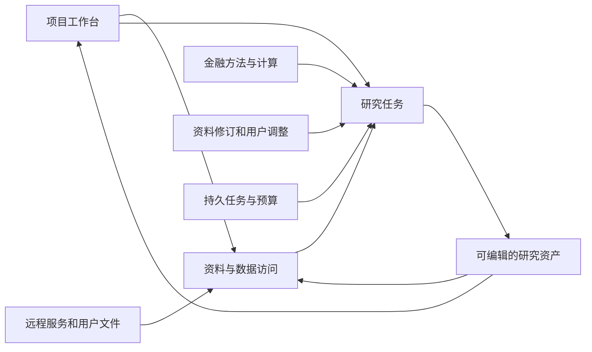

# FinSight 0.1.4 技术方案

041真实结果：同一专家一次响应实际使用str_replace修好原错误正文，新增桥接表9行两期数字/括号符号与原件一致，其他正文保留；局部修复通过。整稿仍未接受：正文新引用缩写、新增解释未补结构化绑定，所得税影响方向措辞不清，实际变更说明仍空。单次142499输入/1613输出、估费0.660237CNY，费用完整；本次空闲价与040高峰价不同，不把全部费用差归因于工程。去重后未触发模型自整理，所以真实checkpoint质量仍未验证。未启动下游或追加付费修订。

2026-09-15修订连续性修复（内部记录041）：adapter把本轮实际工具集合绑定进宿主动作回执，专家和Lead在任何工具/内存/候选变更前整批检查；上下文整理须使用checkpoint动作，连续两次违规进入既有解困/停止路径。旧batch不新增默认序列化字段，保留原摘要；旧候选从原调用记录中恢复仍未改变的编辑位置及来源，绝不执行历史拟稿。当前候选的待修字段未改则阻止仅填完成说明或改用整稿提交绕过；字段变化仍需独立金融复核。请求投影合并完全相同的任务/候选快照副本，保留首份全文、不同版本、最新交接及所有工具结果；这是确定性序列化处理，研究原文清理仍需已接受的阶段边界或作者checkpoint。完整1301项工程测试通过，真实局部修复结果见上。

2026-09-15真实接续验证（内部记录040）：单项检查说明更新已被真实模型使用，但模型未修改正文，原错误披露断言仍在，研究质量拒绝；原生图的提交接受状态不代表研究验收。阶段内整理已触发，却收到并执行了本轮未开放的修订动作：当前工具过滤尚缺返回动作的同范围执行校验。旧checkpoint没有新增的待修字段状态，恢复后不会自动补回历史失败请求。这些缺口须与整稿一致性复核一并解决；本轮未执行精准文本替换或实际上下文整理，不能据此宣称其真实效果通过。停止后续付费与下游执行。

2026-09-14 · 文档草案 v0.1 · E1/E2已有局部运行实现，E3方法消费已有真实对照、金融质量仍未接受；完整范围按执行路线推进，未整版验收。

[PRD](../product/fin_0_1_4_prd.zh-CN.md) · [执行路线](../engineering/fin_0_1_4_execution_roadmap.zh-CN.md) · [当前架构](../public/architecture.zh-CN.md)

## 1. 分工与数据流

跨公司资料研究适配：专家输入保留宿主财务目录的全部指标及每项 `observed_tickers`，不再按参考案例公司筛选；可见目录不授予查询或数值权威，查询仍检查期间、单位和来源。普通对话的研究方法工具独立于财务数据库配置，使仅有上传资料的任务也能读取既有方法。参考案例标识保持兼容。

多来源验证复用现有项目 BFF、SQLite、资料解析、原生 LangChain Agent、来源计算器和预算适配。七份真实原件的项目选择、任务快照、方法/正文工具及重开回读已有脚本模型证据；这不证明自主研究质量或完整任务费用。单 Agent 成本对照入口在 `tests/integration/test_multisource_cost_baseline.py`，默认关闭；运行资料、预算依据和结果保存在本地，不进入公共仓库。

内部记录 020整稿复核与责任修订：复用CaseArtifacts、原生case reviewer/repair与MCP。完整复核的read coverage只接受workpaper读取，全部claims不包含正文/反证/缺口；局部发现可先保存，revision_only维持原机械差异范围。作者通过既有PaperRevision更新受影响字段/引用，保留未改主张及计算源；新增指引不构成自动金融语义判定或新规则平台。本地保存稿链路通过，自主纠错质量未资格。

内部记录 018资料导航在TaskAttachmentStore投影层复用原块顺序，outline只列一次section并提供不可引用的原文预览；items内document_navigation给出块位置/总数及现有读取或视觉工具参数。字段不记录历史读状态，也不裁决缺口；section/leaf旧ID、来源正文和摘要保持。共享冻结本地树的导航与原件解析不变。

E3首个实现见内部记录 017：复用六项方法资源、现有MCP和Studio绑定，在同步专家允许request_method时追加现有方法指引，去除旧结构化入口发送前的提示重建。方法全文只作指导，不产生来源观察或额外权限，保存配置不被改写。真实Pro三臂证明全文可到达且可动态读取，但不能证明方法有效；同源可读分部表仍未查。下一责任点是现有资料导航与缺口检查，不引入新方法引擎。

工程治理使用Git/CI；执行、队列、事务、存储和观测优先使用成熟组件；FIN负责金融口径、来源权威、方法适用、研究优先级与交付。保留既有运行栈作为首选验证对象，不因为规划更新而整体重写。

2026-09-14 Owner要求案例随工程进度扩大并以成熟方案加速交付，具体顺序见执行路线§4。当前采用边界如下；候选不是已安装、已批准云上传或已通过FIN资格的组件：

| 能力 | 下一切片采用决定 | 何时才引入或替换 |
| --- | --- | --- |
| 研究状态、暂停、任务恢复 | 保留已锁定Agent Server/LangGraph，复用原生状态与checkpoint；PG/Redis承担现有运行职责 | 仅在真实故障/许可证明现用方案不能满足当前切片时比较成熟替代，不自研工作流或第二套恢复协议 |
| 存储、版本、并发 | 保留现有SQLite项目存储与PG预算事务；FIN只维护资产版本、金融权限与调用身份 | 跨机实际部署再资格化共享存储和迁移；不先新建元数据、锁或通用权限服务 |
| 模型工具和纠错 | 官方/现用SDK、MCP与原生作者/复核入口；新案例通过输入数据及配置复用现有入口 | 通用循环、重试和传输由组件拥有；FIN负责主张依据、财务计算、责任修订及停止边界。先取原件形成独立检查再看待审判断只是待验证方法，不能宣称已有效 |
| 解析和数据接入 | 先复用现用解析器、SEC连接和数据库驱动 | 若新真实PDF/表格暴露能力缺口，优先用Docling官方入口做原件对照；保留页/表定位及FIN口径映射，不另造解析平台 |
| 案例、运行比较与观测 | 现有pytest、运行记录、Git/CI继续使用；借鉴成熟数据集/实验/人工评价结构 | 当前记录方式妨碍多案例比较时优先小试LangSmith现有评测接口；先核定账号、费用、数据驻留与可退出性，不自动上传私有响应或部署第二套评测后端 |
| 自动资料同步 | 先复用当前显式导入/刷新入口交付版本变化 | 真正实施定时与失败恢复时先查现用运行服务能否承担；独立数据调度缺口再比较Prefect原生flow，不与研究运行栈重复拥有同一调度职责 |

官方资料于2026-09-14核对：[LangGraph持久化](https://docs.langchain.com/oss/python/langgraph/persistence)、[LangSmith评测概念](https://docs.langchain.com/langsmith/evaluation-concepts)、[Docling](https://docling-project.github.io/docling/)、[Prefect flows](https://docs.prefect.io/v3/concepts/flows)。资料证明候选能力存在，不证明锁定版本、当前账号许可或FIN质量。新增组件必须在当前产品案例证明减少自研/维护且适配可控，结论只保留采用者；自研例外沿用既有复杂度规范，写明成熟候选的实际失败和最小缺口，不新造审批系统。

箭头代表逻辑依赖，不预设新增微服务。先定义最小资产关系和访问接口，再按数据驻留、规模、权限及费用确定物理部署。

## 2. 主要模块与现有基础

| 技术域 | 复用基础 | 0.1.4主要变化 | 需求 |
| --- | --- | --- | --- |
| 项目与前端 | WorkspaceNavigation、DataLibrary、WorkingNotes、ReportVersions | 从单次任务扩展到持久项目，统一资产导航和编辑/同步状态 | P4、P8 |
| 数据接入与检索 | public_library、task_attachments、data_ports、source_hybrid、financial_facts | 增加远程访问与增量导入，统一来源、口径、权限和时点 | P2、P3 |
| 研究方法与Agent | research_graph、specialist_graph、现有方法与计算工具 | 局部方法选择、反证、纠错与有界委派，保留有效判断 | P1、P7 |
| 执行与恢复 | Agent Server、PostgreSQL、Redis、原生checkpoint/interrupt | 资格化多用户调度、跨worker一致性、取消/恢复与交付触发 | P5、P6 |
| 费用与观测 | 用量记录、usage_pricing、既有trace | 任务前预测、执行中预算、完成后对账与分组校准 | P6 |

现有模块路径以[命名图](repository/naming_and_entrypoints.zh-CN.md)和代码为准；方案不要求立即移动包名、替换数据库或改变旧任务标识。

## 3. 数据服务与资产模型

逻辑上维护工作区/项目、数据连接、来源及版本、结构化观测、计算、研究成果、任务和它们的引用关系。第一版只补当前切片所需字段，不预建通用元数据平台或图数据库。

接入覆盖同步保存、远程只读查询和文件导入。优先使用成熟连接器、数据库驱动、对象存储和托管检索；供应商适配层负责将来源标识、字段、时间、单位和权益映射到FIN语义。按内容版本增量处理，失败保留上个可用版本并显示状态。schema漂移、修订和删除不能静默忽略。

检索根据主体、期间、来源角色和任务问题过滤，再组合BM25/向量/重排；是否更换索引引擎由实测决定。数值和公式通过受控SQL/计算接口获取，保持表格、附注和原文定位；冲突保留各来源版本。远程查询使用有限权限和资源限制，不向模型暴露连接凭据或任意写权限。

每份资料区分业务时间、公开时间、同步时间和修订版本；方法另记生效/过渡及适用范围。历史时点查询不能使用未来信息，获取时间不能充当历史公开时间。刷新频率按来源和任务确定。

用户成果与来源共用目录和检索入口，但保留作者、内容类型、依据、状态及版本。官方原文只读，用户修订通过独立版本或调整层表达。正文保存优先于索引更新；后续任务读指定版本或明确等待同步，避免无提示使用旧版。新增依据触发受影响计算/判断重查，先采用直接引用关系，不实现泛化因果图平台。

## 4. 权限与同步

有效权限来自工作区/项目/资产规则与源系统权益的共同约束。身份必须贯穿SQL、检索、模型输入、缓存、报告、分享与导出，越权内容不能先送模型后再从界面隐藏。文档及行/列权限优先交给所选服务原生机制；FIN只补业务映射与验证。

数据和ACL分别同步；撤销访问时失效相关缓存/索引权限，无法确认权限时不返回内容。原件、用户成果和派生报告的授权关系要明确，分享报告不能自动开放私有底稿。并发编辑、删除/归档和跨任务引用需有一致行为。

Wind等服务的认证、环境、保存/再使用权限逐连接确认。可借鉴[官方接口](https://github.com/WindQuant/Official)、[Azure查询权限与同步](https://learn.microsoft.com/en-us/azure/search/search-document-level-access-overview)、[Databricks联合查询](https://docs.databricks.com/aws/en/sql/language-manual/sql-ref-federated-queries)，但没有选定云产品或完成Wind接入；托管服务不替代FIN时点/金融语义验证。

## 5. 研究、方法与上下文

大方法组织目标、重要性、证据路线与综合；局部方法提供适用条件、权威依据/版本、输入、验证步骤、反例和计算工具，作为大小skill的实际方法内容。按任务预配、交易特征与关键判断触发加载，不仅依赖模型识别自身错误。先验证直接提供方法是否有用，再验证自动选择。历史案例检索服务于机制比较与反证，保留时期、制度和商业模式差异。

专家只为独立问题委派，子预算计入父任务，父专家负责冲突整合。先核对原件再比较草稿是待验证候选，不直接作为已证实策略。确定性工具承担可计算校验，低成本模型承担通过资格验证的局部任务；关键矛盾与风险检查不能仅依赖低成本模型或自报置信度。

来源、计算、假设、已查路径和报告版本分别定位。阶段整理保留关键原文和可回读索引，摘要不自动具有事实权威；按工作阶段优先触发、窗口阈值兜底，记录缓存及整理开销。早期建立报告草稿，探索逐步更新它；接近资源边界后综合已有依据，不将单一信息缺口或生成式摘要当作终止全部交付的理由。

上下文恢复已接入现有LangChain请求投影：旧工具正文移出请求后，原位置保留原tool_call_id、实际读取工具及参数、观察到的完整引用ID。存在read_saved_result时直接定位保存结果；否则保留原读取动作/资料选择并使用当前执行绑定，现有专家图可回放已保存的成功观察。提示要求先取回所需原始记录再引用、计算或修复，不将导航ID或摘要当证据；不要求重新读取全部历史。工具首次返回、错误反馈及所有用户消息保持原样。

摘要仍在原始消息旁保存，由现有SummarizationMiddleware处理切分。原始总任务和最新被摘要覆盖的用户任务/纠正逐字保留；若最后一个公开操作也进入摘要范围，额外保留其公开说明及工具参数，排除私有推理。模型需按当前可用的目录/读取工具找到相关记录后继续未完成工作。这是提示和可用回读路径，不是已证明模型必然遵守的语义门禁，也不解决SDK进程内历史的跨进程恢复。

负责人委派schema说明和Lead方法要求将预查事实的主体、期间、单位、分母及已实现/指引身份保留为待核验上下文，允许专家据原件纠正。专家提交前逐项核对成功条件与正文派生指标的计算回执；引用修复优先按来源/主张定点读取，保留正确内容。Verifier同时检查多段证据组合后的句子、标题和表格是否丢失限定，不能因上游已提交或引用存在而接受。方法版本Lead7、finance3、verifier3；这是运行指引变化，仍需真实自主修复及研究质量验证。

### 5.1 专家团队分工与上下文交接：2026-09-15讨论记录

精确修订与反馈（039）：参考DeepSeek官方harness的[局部编辑](https://github.com/deepseek-ai/deepseek-harness/blob/master/packages/fs/tool-fs/src/edit.ts)与[错误恢复](https://github.com/deepseek-ai/deepseek-harness/blob/master/packages/fs/tool-fs/src/error.ts)，现有`ReviseWorkpaperAction`增加`op=str_replace`（JSON Pointer文本字段、唯一精确old_string、新片段new_string）和`op=upsert_coverage`（单项assessment按criterion更新）。不回显完整正文/旧检查数组；旧整字段操作兼容，候选版本摘要与原子JSON Patch、原主张身份/来源校验保留。失败返回逐项索引、字段、稳定原因、匹配数和恢复办法，明确整批未生效；候选已改但验收拒绝则分别说明。原生状态持续显示请求修订的字段是否仍未变动，最新报错不会覆盖这些位置；“字段变了”不等于语义修复完成。修订上下文明确旧completed笔记属于上一稿，全部交付要求仍需处理。保存失败动作离线翻译验证了编辑/反馈消费，未新增付费或证明模型自主修订成功。未读源、错误数字/期间与全文语义仍由研究检查处理，不能用文本替换替代金融审查。

必查原件范围：专家图新增可选`required_source_checks`，由可信调用方提供检查criterion、实际原件read selection、绑定完整读取窗口的原始引用ID及必核行项/期间/单位/限定；专家每轮可见未读取项。提交前原生校验要求对应的成功、可引用原文观察，以及`task_note.coverage`逐项说明和主张/正文位置。目录、搜索预览、失败或其他短窗口不能代替必读原文；同一引用已成功读取则可复用，不强迫重复取回。公开任务状态包含这些检查标准。全部默认空以兼容原调用方；当前在定点修订诊断由审阅者设定范围，Lead自动制定与产品全链传播仍待接入。此门禁证明原文进入观察、作者作出覆盖说明，不能证明逐行理解、财务推论正确或全文件不存在某数据。

038定点接续：同一AMZN专家保留旧6轮历史/原稿后新增6响应，首先读齐两项必查原件并承认表格已披露；计算格式错误一次后自主纠正。随后正文精确替换失败，作者只修反证等局部、正文旧错误仍在，补检查说明又出现JSON语法错误，达到本次异常上限停止。门禁未放行候选，未新增Lead/完整研究；公开价估算1.644273CNY/687615tokens、未知0。阅读改善不等于整稿修复合格。最大实际输入149125tokens但阈值检查点未触发，当前近似token估算需按中文/JSON实际usage校准，不能宣称140k精确触发。完整1280通过38跳过为工程结果；金融/长任务语义仍开放。

2026-09-15上下文与解困更新：当前research_session采用确定性阶段清理，并补充阶段内阈值检查点。专家以结构化工作状态记录已查结果/原引用与限定、被否定解释、缺口、下一步及最后任务详情；总任务始终由原交办提供。只有接受的阶段结束记录或显式检查点才允许移出此前未被保留的正文，全部已记录findings与问题处置的原始来源累计保留，当前共同核验资料及新工具返回保持。旧原件、ID、回执/历史不改，回读参数继续可用。笔记是作者自报状态，不赋予金融权威。

阶段内阈值默认`context_editing.checkpoint_trigger_tokens=140000`，可以改为272000后按实测调整。它是整理目标，不是供应商窗口容量声明；按LangChain对完整SDK请求（含工具定义）的token近似值触发，供应商实际usage另记。独立字符上限之前另留8192估计tokens的输入余量（当前以32768字符换算），如该限制先到则提前整理；输出仍受原TokenBudgetBasis约束，不因压缩增额。只有提供`UpdateResearchStateAction`的原生专家及助手消费此机制；其他角色保持既有策略，不能宣称全图统一自压缩已经实现。

接近阈值时由同一作者用一次正常、审计和根预算保护的工具调用自整理，未完成阶段保持working。先消费最新工具结果；笔记被接受后才做请求副本投影。原任务/用户与Lead交接、已记录发现的原始证据（含数字与限定）、计算、错误、最近一批阅读与最后任务详情保留；旧可回读正文换成原工具/参数/完整ID，依赖它引用、比较或计算前必须先回读。旧问题须保留或以原问题标识及来源明确处置，被否定解释不能静默丢失。每次投影来自完整历史，不递归摘要上一份摘要；仅移除旧控制计数等重复投影，不删除持久原记录。此实现保守保留研究逻辑和全部旧工作状态，不是任意长历史都能压缩到固定比例的承诺。

检查点无效最多允许两次连续作者尝试；接受后必要材料仍超限，则请求Lead检查具体负担，重复同一阻塞停止，不继续付费压缩、不重置任务计数或改名重跑。当前Lead可给有界恢复建议/明确停止，尚不自动提高额度或迁移整个会话；必要材料本身超限时仍需后续调度/资源策略。工程验证包括实际SDK模拟传输、成功状态记账、保持working的前后请求、未决问题丢失拒绝和一次Lead协助后停止；真实长程研究质量另行资格。

037真实资格边界：小例核心专家6次调用保存研究状态并提交机械接受底稿，纠正Lead的指引缺失判断；仍未实际委派助手，且把未充分读取的成本/非经营明细表写成文件未提供，金融不接受。本地入口遗漏auto导致standard全目录要求拒绝移交并扩派，已停止并修正新预检，不算有效完整闭环。20个已知响应/823255tokens/公开价估算2.665398CNY，未知0；最大单次63599tokens、阈值检查点0，不能据此声称140k实际压缩质量已通过。大例未启动，暂停同题付费修正。已有草稿引用和计算操作数来源另由确定性引用ID保护，不依赖作者笔记是否重复列出。

连续读取无新增观察会先明确提醒专家，再带着当前状态和真实资料导航进入Lead求助。Lead用原权限来源工具核查后给有预期进展的调整或停止；专家继续同一会话/任务，调用计数和根预算不重置。原生图中每次求助有界、反复失败停止，不能改名重跑。当前已验证工程和保存失败历史的投影，未新增真实模型资格；不是通用长上下文自压缩或任何研究必然收敛的证明。

当前实施状态补充：领域专家已可通过原生ToolNode调用有独立上下文的子问题专家，明确移交工作与保留的整合责任；最多一层、每领域最多四个子问题，沿用父任务数据范围及同一预算。助手底稿与原始成功观察按需回读，保留原始引用/期间/单位/回执，不复制私人历史或把助手计数冒充父计数。此为候选实现，正在验证下文设计要求；尚不能宣称真实负担下降或长期恢复合格。

当前Lead路径补充：新分层运行在独立研究复核后先读取当前状态，逐项处理原发现，并可提出复核遗漏的问题；有依据的异议仍保留给下游检查。修复只回派受影响底稿，作者回应不视为独立关闭；若声称修正但研究内容完全没变则停止。修订后Lead形成综合判断，后续检查实际成文。旧运行的历史路线仍可读取。语义是否有进展由研究检查判定，机械不变检测不能发现所有错误；当前有界修复最多两轮，不能替代模型反复错误时的人工诊断停止。

真实资格未通过：AMZN Q1小例在首专家反复回读四个原文块，达到决策上限停止，助手与成文阶段未执行。正常研究的早期工具正文清理仍可诱发上下文来回取回，原返修working set未覆盖；模型选择与上下文策略的影响尚未隔离。按用户停止条件暂停大例与进一步付费。不能把工程接线或模型成功返回视为研究闭环验收。

本轮完整候选沿用现有Lead综合、Writer和复核节点验证责任交接，尚未证明这些节点对所有简单任务都必要。Lead直接执笔与按需写作助手的职责选择、跨进程准确恢复和更细的成本调度仍需用真实结果判断，不能把增加节点数量本身当作优化成果。

原始讨论状态：以下为设计约束与候选方案，实施进展以上方补充为准；未通过部分不能在后续接续时当作已上线能力。用户明确要求拆分必须真实降低原执行者承担的任务与上下文，不能将大专家改名为负责人/助手后继续完成同一整包任务。

用户明确约束：

- 每次委派说明接走哪块工作，以及父Agent因此不再承担什么。子任务有独立可回答的问题、输入边界和完成条件；把原研究目标与全部材料原样下放不算有效拆分。
- 原始记录移出上下文时保留实际回读位置，需要时先恢复；总任务概览与最后未完成任务详情不丢失。任务/阶段交接不能清零既有调用次数、费用、失败和未知请求。
- 不以Agent数量或单次输入下降证明成功：检查子任务与父任务范围重叠、负责人重复分析、跨助手重复读取、单次输入峰值、总tokens/缓存/费用、返工及金融质量。案例随工程进度扩大，成熟运行栈优先。

当前建议（由本次对话提出，作为实施候选，尚未锁定固定拓扑）：领域专家负责人能自己研究，承担子问题界定、竞争解释、任务安排、证据冲突处理、领域综合判断和交付责任；不默认重读所有原件、重做所有下属计算或重写所有底稿。按独立研究子问题调用调查/分析助手，需要长底稿时调用写作助手；调查与分析可由同一助手完成。确定性检索、计算、格式/引用匹配继续交给工具。职责需覆盖调查、分析、表达和检查，不要求每个专家永久拥有同样的四个下属，也不默认允许无限嵌套委派。

候选交接方式：助手交付问题、判断、支持与反证、主体/期间/单位/分母/实际或预测、计算回执、来源身份与回读路径、未核实假设和未完成事项。负责人保留全局概览及与当前判断有关的内容，不把下属完整对话重新装回上下文；交接摘要没有事实权威。调查分析产物→综合判断→底稿→复核发现→定点修订，以版本化产物交接所需材料，完整原始记录仍可按权限读取。写作助手不得从表述缺口自行创造金融判断，证据不足须交回研究问题。

独立复核与返修候选：作者自检为交稿责任；重要交付的独立复核由runtime调度，其发现不能由作者自行删除或忽略，独立复核也不是不可质疑的真相。首轮在约定范围内检查后集中提交发现，保留已查/未查范围；基础错误可提前结束但不能声称全稿已审。发现含位置、依据、影响程度、责任归属和修复条件，区分事实错误、证据不足、推理分歧、任务遗漏和表达偏好。负责人按共同根因组织修复，同时更新关联主张、引用、标题、表格和正文，逐项说明接受/有据异议/未解决。复查集中于修订、影响范围和原未查项；未受影响的已审内容可复用，但新发现重大错误仍需处理，不冻结漏错以强行结束。

是否继续返修取决于实质进展和剩余质量风险，不以循环次数当合格标准。同类错误重复、核心解释反复推翻、无新证据争论，应回到补证据、收窄结论或交上层处理；表达偏好不无限阻塞，必要资料不可得如实限制结论。每次继续要有具体问题、预期收益、预算和停止行为。复核资源可共享实现，每次上下文独立；是否使用不同模型、助手规模及具体任务粒度仍待对照验证。

### 5.2 Research Lead全程参与和最终成文：待验证方向

用户2026-09-15提出：顶层研究负责人是否应增加中途参与，审阅最终各底稿、判断专家逻辑自洽性，确定最终写作基调并亲自写作。这里记录为用户提出的设计方向，不视为已确定“每项研究必须由Lead直接写全文”。

现有基础：lead_research_graph在collect_task_artifacts之后回到lead，提示要求逐波检查实际底稿与限制；SubmitResearchHandoffAction仍以简短交接说明为主，明确不在该动作写最终报告。focused/integrated/extended既有交付路线仍有效。不能宣称Lead当前已具备完整跨底稿主编能力，也不能说当前完全没有中途回访。

建议职责：关键证据出现、重大冲突/缺口影响整体判断、阶段底稿形成、最终成文前和实质返修后触发Lead参与，不逐次工具调用增加一轮Lead。Lead审阅每份底稿对总问题的贡献、内部逻辑和主要证据，识别跨稿期间/口径/因果冲突及遗漏，定点回读或安排补查，不重做所有领域调查。维护可追溯的整体主张、论证结构、证据强弱、反证、不确定性和结论边界；“基调”指表达应与证据力度一致，不能提前指定乐观/悲观结果。

最终写作保留两个待验证选项：较短且综合范围可控时由Lead在面向成文的独立阶段直接执笔；复杂长报告由Lead给出论证结构和关键结论，Writer据此成文，Lead审读最终文本。两者都使用经过领域处理的版本化产物与必要原文，不默认带入完整调度历史。复核时序按下节同日用户补充调整：主要独立研究复核位于Lead最终判断之前，成文后的检查聚焦实际文本是否忠实于判断、证据和限制，新增实质性综合判断须重新核验相关内容。该设计尚未替换当前focused/integrated/extended运行路线。比较重复工作、上下文峰值、遗漏、返修及合格交付总成本后再确定默认路径。

### 5.3 最终判断前复核、Lead上下文整理与主动纠错

2026-09-15用户进一步提出并要求作为设计方向保留：独立复核可以发生在Lead最终判断之前；出现复核问题后，Lead应整理自己的上下文并形成任务的最终判断；Lead及时参与、主动发现与安排解决问题是自主runtime的基础，不能日常依赖人工发现错误和安排返修。本节更新5.2原来偏重成文后复核的建议。完整路径仍待实施，当前仅完成下述A切片。

实施状态（A：当前有效研究状态交接）：复用CaseArtifacts当前修订视图、现有convergence节点和原生checkpoint。跨Agent目录保留原交办的目标/成功条件；现有综合、写作、复核节点收到当前底稿版本、相对基线改变的主张/正文字段、原发现、作者回应、未决数据请求和真实回读工具参数。发给节点的状态同时随产物历史保存；旧综合没有绑定版本或底稿已改变时，标为需要重新判断。版本相同不等于语义通过，作者回应不等于独立关闭；全文及原始来源仍按原工具读取，不复制私人执行历史。该切片不增加模型调用节点，不改变focused/integrated/extended路由，因此integrated仍没有Lead synthesis。定向工程组146项最终通过，另用已保存双底稿离线检查交办和回读；新增模型调用0。Lead逐项处置发现、主动回派及专家子问题分工仍待B/C切片，金融质量未重新验收。

候选主路径：专家阶段成果与Lead候选解释→独立复核底稿及候选论证→Lead整理当前研究状态→处理发现/定点补查或修复→形成证据约束的最终判断→直接或组织Writer成文。候选解释明确为可推翻的研究对象，复核不以Lead既有结论为接受标准；复核有任务范围、相关底稿/来源索引及独立原文读取能力。必要时研究过程中即可触发定向独立检查，不必等所有底稿结束。

“整理上下文”不是以缩短tokens为目标的压缩，也不是换一个Agent承接原大任务：以总任务和当前有效证据重建面向决策的工作状态，明确问题覆盖、当前有效的底稿/来源/计算版本、支持与反证、候选解释、复核发现及处理状态、失效或被推翻的旧判断、未解决事项、下一任务详情与剩余预算。旧错误和被替代内容在当前状态中标记失效，不能只追加一句纠正却让旧结论继续作为前提；完整原始记录、版本差异和定位仍保留。需要依赖相关原文时先按实际路径取回，不能把助手摘要或复核发现直接升格为事实。输入可以因必要证据增加而增大，必须有TokenBudgetBasis；不为降低输入暗中删除反证或未解决问题。

Lead对每项实质发现给出可追溯处理：接受并更新关联判断/任务；有原件依据地提出异议；或保持未解决并决定补查、限制结论或暂缓受影响交付。整理不是假设偏差已消除的保证，最终判断需说明哪些依据改变了旧看法、哪些分歧仍保留，不以模型自报已理解或双方一致作验收。

主动参与需要接入运行反馈，不能只写在prompt里。候选触发项包括阶段成果就绪、专家报告关键冲突/资料缺口、正文/引用/计算校验失败、重复读取且没有新增观察或产物进展、任务覆盖缺失、重要证据/版本变化以及预算不足以完成剩余必要工作。可机械识别的运行信号由现有图/工具/预算事件提供；语义冲突由专家、复核者和Lead检查成果共同识别，不假称runtime可以确定性判定金融真假。相关问题使依赖成果保持待处理，Lead收到问题和定位后按权限组织定点行动，不阻塞无关且独立的任务，不等待人类提供正确答案。

避免无限返工：每次行动绑定发现、预期新增证据或产物变化、成本及停止条件；跟踪同一问题是否取得实质进展，不能仅刷新Agent身份或任务名称重试。成功修复自动进入受影响范围的复查/综合；来源不可得则以有据限制交付，必要项不能满足则明确未完成。仅在缺少用户意图、权限或确实需要外部处理的状态时要求人工介入。未知付费请求仍不自动重发，已有预算/权限/停止边界不因追求自主而放松。

判断前独立研究复核不证明之后生成的最终文本正确。成文后保留与判断、原文和版本的一致性检查；原范围内已审事实可复用，新增主张、扩大结论范围或失去限定条件须定向再审。是否需要模型及检查粒度按变化和风险验证，不能预设每次再跑一轮完整独立研究。验收须在无宿主代改答案/中途扶正情况下观察Lead及时介入、失效判断不再被引用、必要问题被处理、重复成本受控及最终交付正确。

### 5.4 任务结果说明：B的输入与公开活动展示（B0已接入）

2026-09-15用户补充：Agent返回成果时应附任务状态说明，根据实际状态告知用户，也让负责人/Lead定位待修改位置。当前已有task_results的submitted/needs_attention、底稿reason_summary/open_gaps、失败handoff及部分校验位置；公开活动流可显示计划说明、候选正文、工具与任务事件。但这些尚未形成统一的任务结果说明，计划时发出的reason_summary不能当作工具执行后的完成记录。

B先补这一交接合同，再消费其决策信号。复用原生task/attempt、产物版本、checkpoint和公开事件投影，不新增状态数据库或专门的“汇报Agent”。同一记录供Lead读取和前端投影，公开界面称任务进展/结果说明；不读取或展示私有推理。

- runtime负责：任务/尝试/父子身份、实际运行阶段与终止原因、当前产物及版本、提交校验结果、实际问题/工具回执定位、费用已知/未知状态。模型不能用“已完成”覆盖执行失败、拒收或未知计费。
- Agent随现有提交或阶段交接补充：本次做成了什么；逐项对应原交办成功条件的完成/部分/未完成/不适用说明；研究限制；相对上版修改；问题的影响、依据和下一步建议。研究完成度和自报修复属于作者声明，必须与runtime事实、独立复核状态分别呈现。
- 需要后续处理的项目绑定现有task_id、attempt、artifact版本、claim_id/finding_id/来源ID或真实正文字段与引用位置，并说明影响范围、建议责任人和预期产物。无法定位应明确缺失，不编造路径；受限资源定位在后端按权限解析。Lead据此先读取受影响内容再判断，不能只读摘要作金融结论。
- 区分执行状态、任务覆盖和独立复核状态。例如“底稿已提交/仅部分任务完成/尚未独立复核”允许同时成立。后续复核或返修追加新状态并保留旧版归属，避免旧说明显示为当前状态；问题建议不自动变成调度命令。
- 正常提交、部分交付和暂停都返回已有事实及实际作者说明；异常、取消、超限或未知调用无法再生成说明时，由runtime投影已有记录并标注缺少作者说明，不能为了写汇报额外调用模型。长任务在有实质阶段成果/阻塞时更新，避免每次工具调用重新生成完整说明。

前端默认显示简短结果、当前状态、主要未决项和下一步；展开查看目标覆盖与来源/修改定位。Lead收到同一结构化记录的权限内必要内容，沿用A当前版本导航。测试集中在作者自报成功与执行失败冲突、部分交付不丢失、问题定位回读、版本更新、异常无额外模型调用，以及前端/Lead投影一致；随B相关测试验证，不单独付费重跑完整case。

2026-09-15实施状态（B0）：委派研究的专家提交及主动暂停schema已支持公开task_note；runtime从真实终态生成task_outcome，绑定task/run/attempt和原始产物摘要，保留作者覆盖、问题/主张/正文字段定位、变化、缺口及校验位置，检查不匹配目标/主张并明确提示。原生Lead返回工具结果、父任务checkpoint/尝试历史、公开事件和前端任务结果卡已接通；成功兄弟任务原记录在续跑中保留。前端按运行选择历史、漏收事件时回补并去重，标明这是该次交接记录，不替代后续复核或修订状态。作者未提供说明时显示缺失，不推定完成；新可选字段为空时不改变旧动作序列化和回执摘要。异常只投影已有执行事实，不生成额外模型请求；费用继续引用运行账本，未新增单任务估费权威。新结果卡支持390px，既有活动页1440/1024/390回归通过；原生Lead与专家暂停交接已有模拟图证据，无付费模型验证。当前定位在前端以编号/字段展示，没有新增点击跳转；主动回派、修订后自动更新问题生命周期及其他角色统一结果说明仍属于后续B，不宣称自主闭环完成。

## 6. 任务运行、成本与部署

E1私有存储采用独立预算数据库和`FIN_MODEL_BUDGET_POSTGRES_URI`；不再从原生服务管理连接隐式取预算权限。PG原生NOLOGIN组区分预算授权、可信worker和费用只读；宿主入口拒绝管理身份及扩额/删除权限。worker可读取库内研究原响应，费用视图按数据库登录与owner绑定汇总且不含正文；这不替代产品用户认证。预算和终态派发不可改写，当前保留原响应/调用身份/已知和未知费用，不提供自动删除。受限角色竞争及同集群新库dump/restore已有合成证据，恢复保留未知占用；跨机角色重建、活跃付费系统PITR/对账、加密和到期处置未资格。配置与实测见内部记录 009及[部署资格说明](../../deploy/qualification/README.md)。

沿用原生任务队列与checkpoint，FIN定义用户/任务/供应商容量、研究优先级和交付预留。验证长短任务公平性、同一项目冲突写入、重复提交、worker异常、重启与流重连。进程内锁不充当跨worker约束；共享状态优先用数据库事务/唯一约束和运行栈机制，不新增第二套锁与任务真相。

2026-09-14监督案例采用现有Lead图和LangGraph原生静态调试停点，在委派及每波成果之后由宿主检查；这不是新增审批服务或生产审批界面。Lead方法区分首波规模与整条交付深度，现有委派入口提前拒绝focused同时产生多份独立底稿，避免到最终交接才发现冲突。七份项目资料的实际入口预检发现完整内部元数据撑爆任务目标长度；入口现只注入文档导航字段，原件、完整出处和项目关系仍由既有资料工具保留。研究截止日使用现有FINSIGHT_RESEARCH_AS_OF绑定，不改历史来源基线。

实测边界：两次真实Lead决策已观察，未启动专家；原生图停点/重开可用，但同步SDK的_agentic_history仍为进程内状态，图checkpoint本身不保证模型精确会话恢复。第二次决策使用已保存原始消息作本地诊断恢复，不能外推为产品跨worker接续资格。正式分段监督需要把模型会话接入现有运行栈持久化，并验证原工具回复配对、未知调用不重发与费用连续性；不让Markdown台账承担调度职责。完整多Agent成本与金融质量仍待实际研究波次和下游复核验证。

2026-09-15负责人规划修复：系统提示与方法区分完整交付、当前波次及证据触发的后续调整，去除固定综合/Writer流程与自适应路线之间的提示冲突。当前运行通过Pydantic原生派生模型要求委派/交接的execution_plan及交接的问题覆盖；SDK展示与ToolNode验证使用同一schema，旧已存动作仍可按原合同读取。负责人经bootstrap的绑定来源端口复用专家MCP evidence lane，能在实际允许的local/uploads/web空间做目录、检索和原文预查，不能改run/branch、扩大权限或调用图片模型；外源日期未知保持待核验。源结果及回执保存在原生图状态/工具回复，预查不代替专家完整研究。

内部记录027进一步实际执行首波双专家：Lead来源回复复用专家已有语义投影，审计回执留在图/日志，不随正文重复送模型；任务调度回复仍保留task_id。MCP仅将已知的文档块定位错误转为原生ToolError，反馈从目录/检索复制真实node_id及分页参数，内部存储/完整性故障仍保持私有错误。该补丁本地通过，定位错误修复后未新增付费复验。

上下文与诊断入口必须对齐正式research_session配置。首波诊断漏传已有context_editing，需求专家超限；接回现有ClearToolUsesEdit后越过原停止位置，但仍出现重复读取、残缺引用ID与引文错配，18轮未完成修复。原生保存结果回读可用不等于Agent能有效利用。下一步复用现有工作笔记、结果回读及责任修订，验证引用保存和有针对性的纠错，不自建压缩/调度平台，也不以增加轮数替代质量改进。

修订阶段的上下文保留：续跑的task_context可能包含新的分析师要求，适配器仅省略与原交办完全相同的上下文，不能无条件删除它。被清理的工具结果保留实际回读参数和完整观察ID；若同一原始记录仍在另一个可见结果中，直接使用该结果。普通研究沿用LangChain ClearToolUsesEdit；当已有拒绝稿待修订时，保留上次提交之后读取的成功观察，直到下一次提交。完整观察相同仅保留最新一份，不按来源ID或相同参数合并不同期间、版本、窗口的内容；旧轮次控制反馈不重复注入。原始历史不修改，保留集仍受当前任务输入上限约束，不承诺无界容纳。

内部记录029真实验证：原失败需求稿续跑6次仍在两份/五份来源间交替回读；加入修订证据保留后，实测输入471882字符，诊断TokenBudgetBasis明确从360000调整至520000，2次自主局部修订通过原有引用校验，没有新增资料读取或宿主代填引用。该样本同时改变了上下文保留和必要输入额度，不是控制变量质量A/B；同步SDK会话仍由本地私有审计恢复，不是产品自动恢复资格。13条主张及正文未删，但原文引述、主张含义与新引文未全部同步，金融质量仍不接受。另3次独立财务复核发现正文计算缺回执，却漏查季度资本开支构成与全年指引组合的范围错误；复核提交成功也不是报告合格。

有来源端口时，新委派前需发生实际来源查询；这只保证检查过当前状态，不保证其后每个可得性断言正确。独立只读可合批最多四项，由原生ToolNode执行，不与规划变更混用。5次真实Lead调用已自行查目录、读两份原件、处理一次误拒绝并提交双底稿integrated路线，未提供人工正确计划；仍把查询接口不支持项扩大为原件无披露，故完整语义未接受。批量只读修复及接口能力/原件披露边界说明为事后本地验证，不假称已付费复验。模型会话跨进程持久化、全后代预算及完整研究质量仍开放。

区分排队、执行、暂停、等待用户、取消中和结束。浏览器断开不自动取消任务；暂停等待不长期占用执行容量。取消阻止新增工作，已发出的请求仍需结算；结果未知保留并对账，不自动重发或承诺外部服务绝对exactly-once。

费用口径以[成本模型](economics/research_cost_model.zh-CN.md)为唯一公式来源。为每个任务保存事前预测/版本、已知和在途费用、剩余必要工作与子任务预算；价格与行为参数分开更新，失败和未知不能省略。先采用分组统计校准，供应商账单与公开价估计分列。

部署先资格化现有Agent Server的锁定版本、许可、费用和退出成本。官方[架构](https://docs.langchain.com/langsmith/agent-server)与[独立部署说明](https://docs.langchain.com/langsmith/deploy-standalone-server)作为选型参考，不替代当前版本验证。若不满足试用要求再比较一个成熟替代路径。外网试用需要认证/TLS、持久存储、备份恢复和资源观测；不直接暴露开发noop接口，不预先承诺多机HA。

## 7. 验证、兼容与待决策

内部记录 042：正式 `research_session → research_convergence` 接入版本化底稿返修。原作者从本任务保存的 notebook、候选稿、必查范围、工作状态和对应模型回执恢复；私有会话仅按原作者与回执从现有私有审计取回，不送给复核或 Lead。历史不可取回或候选已被人工改写但尚未与原专家状态协调时，明确停止，不新建一个同名专家覆盖旧稿。原作者继续使用已有精准修改工具和任务说明，逐项回应 Lead 指派的问题。

runtime 根据实际 before/after 自动记录字段、主张及字符位置，并绑定版本摘要；前端任务说明显示实际修改位置，作者漏填 changes 不再使执行事实消失。作者的完成说明与 runtime 的位置变化均不是语义通过。正式图在作者提交后重新开放当前版本的资料视图，复用 Counter/Verifier 原生复核图，要求每个待关闭问题都有独立确认；旧版结果、漏确认或必要依赖未查明均不能放行。复核集中返回仍存在及新增的问题，Lead 再结合当前底稿和来源作修订、异议或停止决定；原有有界纠错上限及共享费用账本继续生效。独立确认记录进入原生 checkpoint 和成果交接历史。旧独立兼容图保留原行为。工程检查及当前保存案例的真实资格单列，不据此宣布整版研究质量通过。

042 真实资格止于初审未完成，尚未消费原作者续改及新版确认路径。Verifier 在相关正文仍处于有效上下文时漏检引用追溯和方向措辞，说明完整读取及正确核算不能替代正文语义覆盖；Counter 的定位引文两次不精确，当前反馈仅错误码，最终保存问题后已无提交额度。初审门禁阻止继续成文，但未把部分发现与运行障碍交给 Lead 分诊，仍不满足卡住时自主解困的要求。待修合同包括版本与字段绑定的复核覆盖、精确定位回读指引、未完成复核向 Lead 的受限交接；受限交接不得视为通过或直接进入成文。保留原生图与工具，不以新增角色或扩大调用上限替代根因修复。

内部记录 043：正式初审提交增加当前版本的公开检查记录，覆盖重要主张、正文引用追溯、数字与解释一致性、原问题及反证范围；检查绑定原文字段与来源，未查事项保持 incomplete。检查记录是复核者的可核对声明，不是 runtime 对金融正确性的证明。历史无检查记录的已提交复核不自动晋升新合同，旧图仍可读取。新版返修确认继续按待处理问题和受影响内容检查，不强制重跑全部初审。引文定位失败返回最多三个当前原文窗口和字段回读入口；相似匹配仅帮助定位，原精确引用门槛不变。最后一轮可直接把修正发现放入正式提交，避免只保存发现却没有交接。

043 实测后修正（仅离线验证）：检查目录明确给出文本路径；runtime 接受准确字段名、准确主张 ID 及在集合内唯一匹配的原文定位，规范化的是元数据，不重写金融引文。集合读取返回带分页的字段目录，预览不等于读完。Lead 分诊的公开发现与必处置项采用同一含复核角色前缀的 ID，包含 advisory，并明确候选未改、建议修复尚未执行；拒绝反馈列出预期、缺失和多余 ID。分诊调用触顶结束并由 runtime 返回未完成状态及实际错误，不伪造 Lead 决定。真实运行发生在这些修正之前：Lead 已被调用但解困未成功，初审金融漏检仍开放，不得将离线合同通过视为真实闭环通过。

044 实测边界：准确路径和发现 ID 修正已被真实请求消费，但独立复核漏检和 Lead 将未来修复作为当前补查前提仍存在。推理模式下输出上限包含 reasoning 与可见内容，复用非思考容量可能在提交工具动作前截断；本次 high 响应用满 12k 推理 tokens，不能据此评价最终研究能力。现有截断异常会中止并行复核并取消同级在途请求；拒绝半成品是必要条件，仍需补充节点未完成结果、停止新增派发及在途费用收尾。Lead 指令的当前候选与前置条件也需可核对，不能仅靠自然语言 notice 或正确 ID 证明可执行。以上为已复现的待修合同，未实施或验收；不增加 Agent 框架，不改历史 usage 与未知预留。

045 工程修复：初审与修订确认的并行复核共享一次运行的停止标志。预期截断、供应商错误与派发阻断由原生 middleware 转为 execution_error 未完成终态，截断内容不作为工具动作/正式答案；已承诺派发的同级请求仍可完成保存和结算，后续请求停止。保持原生编译子图、检查点与 SDK，不增加调度器；未知 usage 继续占用原预算，禁止自动补跑。程序错误和用户取消仍传播，不承诺进程崩溃或用户强制取消后的在途结算。Lead 初审补查需显式 current_candidate 前置条件及实际 candidate_versions，未来作者版本不能在当前阶段执行；字段合法仍不证明派工语义合理。124项相关离线回归通过，真实逐步续接与金融质量另验。

初审未完成且有可恢复原会话时，正式父图交给已有 Lead 决策角色。Lead 只收到公开发现、检查结果和工具失败；可为每个未完成复核者安排一次有界补查或停止，不能选择成文。补查复用原复核者消息与发现，已完成且满足当前合同的另一复核者不重复调用；寿命用量累加且共享根预算。再次未完成则停止，禁止自动循环加额度。Lead 分诊记录进入父 checkpoint 和进展流，部分已保存的 material 发现单独计数，不伪装成零问题或完整复核。

E2采用既有SQLite与`TaskAttachmentStore`，不新增存储服务/解析平台。内部记录 015进一步复用原生报告checkpoint、人工修改、导出与解析：项目保存API只接收选择标识和预期报告摘要，服务端验证原研究/目标项目权限及已完成报告快照；正文、解析文本、版本/确认状态与来源元数据同SQLite事务保存。确定性身份避免同状态重复建档，确认状态改变不复用旧草稿标记。后续任务副本/专家MCP/跨Agent保留project_research_artifact角色与原报告出处，不晋升NumericFact。当前是显式保存的Markdown成果与文本查找，不是新报告版本引擎、自动更新或向量索引。`/api/v1/projects`按认证owner保存索引，修订号+事务防旧窗口覆盖；项目文件由owner/project共同命名空间保存于独立`project-library`目录，复用原大小/数量限制。页面可查找文本、下载原件及选择用于新研究；BFF验证归属后复制原件和已解析页面到新任务，记录原项目/文件/摘要，原生元数据准备状态阻止中途失败误启动。目标SQLite批量原子提交不等同跨原生服务事务；异常草稿保留且不自动重试。现有研究资料工具、专家观察和跨Agent来源回读保留出处，属性仍为用户上传待核验；当前不是语义索引或完整模型质量验收。真实DeepSeek五回合资格复用现有图/MCP/SDK/PG保护，读取、三项计算、引用链通过；模型将未读分部组成表误写为未提供，修正公共专家提示与上传工具局部覆盖notice，没有新增披露裁决平台。修正后同源真实复验未再出现原未披露断言，但相关剩余表检查及完整语义仍未通过。旧浏览器整理保留，空服务端可显式导入。历史研究权限/版本不转移，副本内容不随项目变化自动更新；本地撤销已通过SQLite原项目状态、宿主私有库绑定和MCP标准middleware/模型派发入口传播到后续使用。新报告保存所选资料依赖，原始依据受限时禁止报告再次复用；旧成果无依赖记录不作自动补全。原件/checkpoint保留，不召回已发出内容，跨机仍待资格。见内部记录 016。另复用financial_facts.sec_snapshot/Requests与SQLite，实现owner/project下的SEC原件独立版本、重复提交不重复抓取、失败留存、摘要校验及原始观测浏览。大整数/小数以字符串投影，保留期间/单位/申报号/修订；filed日期筛选不等于完整PIT。官方源只读下载；已复用原financial_facts解析/SQLite/读取器，把选择版本复制到任务并绑定USD收入、营业利润与既有派生计算。任务绑定清单保留原件/财务库摘要及项目出处，损坏拒绝，不回落其他库。run_scope时点限制accepted_at，直接与派生查询排除同日未来修订；未关联申报身份、非10-K/10-Q和未支持期间不接纳，不推定未披露。完整历史PIT、更广标签/币种和修订表单仍开放，见内部记录 014。每项目12次更新，无定时同步和生产全局并发资格。见内部记录 013、内部记录 010、内部记录 011、内部记录 012。

内部记录 008流式与真实样本：沿用SDK的SSE传输/聚合，薄映射补DeepSeek原始usage及cache hit；缺必需字段保留预算占用。无终止字段的提前EOF保持未知；CaseModelAudit拒绝不完整输出，已知截断/中止仍先结算再拒绝接受。Pro当前价表纠正，一次真实非思考响应77输入/37输出估算0.001692元，PG保存后同checkpoint回放不再请求。原付费pytest因数值字符串格式失败保留，离线复核不产生新调用，行数偏差未消除；不是付费硬崩溃或金融全链资格。下一步验证PG原生角色/保留恢复，预算默认仍关闭。

先用模拟供应商验证故障、并发和预算，再做固定原件的局部金融判断，最后执行真实报告及追加资料更新。保留0.1.3和同条件通用Agent基线；数据可达、候选命中、金融判断与完整交付分别评价。已见案例用于开发，迁移验证另取公司/期间/相反条件，隐藏答案不得被实现过程读取。

变更通过隔离配置逐步接入。迁移保留旧任务、来源和报告标识，先验证读兼容与退出；未通过候选维持关闭，不因新文档改动生产模型或0.1.3数据。技术门槛在各工作包开始前确定，失败保持原证据并修复责任层。

尚待实践决定：后续远程数据服务与检索存储、更广金融映射、并发容量、模型路由、首批方法、更新时延目标、许可和服务器配置。仅为即将执行的切片补API/schema/部署细节；取舍和结果写回本节与执行路线。

内部记录 005原生资格已证明0.13.3队列/取消/接续、人工pause与双worker共享队列。保留Agent Server为执行owner。未完成节点在重启后重放，已完成checkpoint不重跑；每worker=1也能产生部署并发2。审计uuid和BFF回执不能当模型去重。不另造调度器；当前日志为lite模式，正式许可仍待核定。

内部记录 006共享预算/派发切片采用PG预算行锁及两张FIN业务表，网络调用不持锁；原生task身份绑定完整请求/价格/预算依据，未知不重发、不释放，已保存消息回放不再结算，探索不能耗用交付预留。真实PG竞争与原生重启已有合成证据。金额是固定价格下usage计算值，缺失usage保留占用，实算超预留如实记录；不是账单保证。

内部记录 007研究入口接入将同步负责人/专家、原生研究角色/交互专家/摘要及普通对话入口连到同一可选`ResearchBudget`。绑定从挂载host settings按thread核对owner和既有PG预算，子Agent不能自建额度。先保存SDK原始响应/usage再进行解析与接受；已知失败计费、回放不绕过校验。实际同步图和Writer工厂的MockTransport＋真实PG两场景已通过，后者4调用（含摘要/子专家）共计合成800 micro。未默认启用；数据库角色/保留策略、流式SDK/真实价格、跨研究总额和正式部署许可仍待资格，Hermes启用预算时拒绝未接入路径。

2026-09-13 E1局部采用：保留`SubmissionReceipts` → `LocalRecords` → SQLite事务的同机提交边界。真实进程竞争、派发后退出、保存响应后送达前退出均通过；无新生产控制代码。跨主机共享存储、Agent Server队列/取消、父子预算、真实认证及供应商语义未由此覆盖。Dockerfile固定0.13.3，官方当前部署资料已复核，但本账号许可/费用未证，不直接升级或外网部署。见内部记录 004。

045 逐步实测：保留原 Counter 已知截断请求的输入与工具历史，仅增诊断输出容量至32k；一响应使用72814tokens（推理18072）、实算0.539543CNY，native模型节点后暂停检查，再仅执行一批3工具后暂停。未截断，F1建议保存，F2表格空列引文错误拒绝并回原文；模型仍将缩写引用推测为可解析、正确计算税项却未落实正文核查。没有正式复核或作者修订，按重复错误停止规则不追加付费，不改默认模型。终态计数补修及供应商超时场景43项相关测试通过；单响应不能证明并行供应商真实故障恢复或金融基础能力资格。旧unknown用量与预留独立保留，完整研究闭环/小大案例未验收。

046 工程合同：初审以当前版本的重要结论、条件及关系段落为semantic_targets，分别返回正文表达/证据支持关系及一致、矛盾、歧义或不足；定位与覆盖校验不证明金融语义。作者与综合/写作角色共用自检指导。当前paper来源目录由runtime精确解析；省略号、缺失内容hash的node尾号只提供候选。模型确认需实际来源回读及简短理由，已确认预期来源也不消除原稿标识缺陷。runtime在提交时生成需修复交付标识的发现，保留来源候选、确认回执与底稿版本。source_checks支持digest/start/end原文选择，唯一连续表格块仅在所有非空标签、数值、符号相同时恢复空列布局；歧义/数值或符号变化不自动修复。所有实际兼容处理标记origin=runtime_compatibility_parse，保存方法、原输入、规范结果、来源摘要/偏移及操作状态；位于runtime状态与工具记录，独立于模型提交schema，模型原始响应不改写。引用身份、真实读取和文本匹配不等于金融含义核验。当前结构化段落合同用于初审；其他角色共用自检要求，不宣称全部角色输出接口已迁移。

原文选取还支持来源内唯一字面锚点，由runtime返回原始片段、摘要及字符偏移，避免模型手工计数。多处命中返回位置供进一步定位，不猜测选取；该操作同样标记为runtime兼容解析，不能当作模型金融判断。

检查结果文字允许简洁非空，质量约束由来源、版本、逐段覆盖及关系比较承担，不设置20字符填充门槛。原生schema失败反馈薄适配去掉整份参数重复回显，保留错误字段、原因和未执行说明；以runtime_compatibility_parse记录原反馈摘要与原调用定位，原AI参数完整保留。不自动修金融判断、不将校验错误转为接受。
