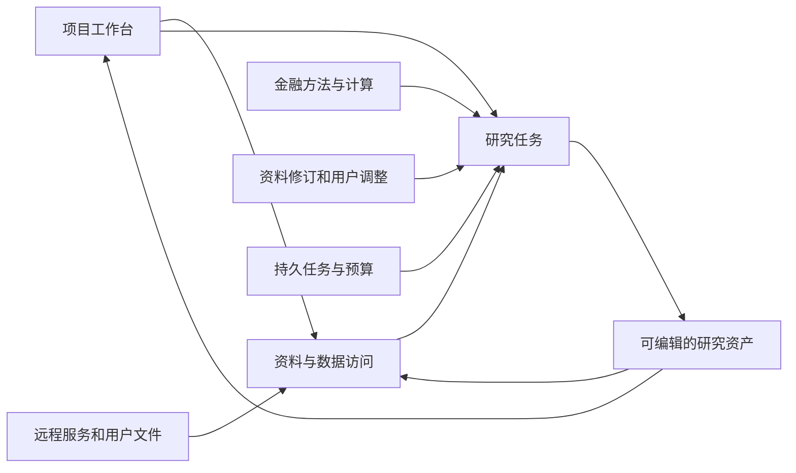

# FinSight 0.1.4 技术方案

2026-09-14 · 文档草案 v0.1 · E1/E2已有局部运行实现，E3方法消费已有真实对照、金融质量仍未接受；完整范围按执行路线推进，未整版验收。

[PRD](../product/fin_0_1_4_prd.zh-CN.md) · [执行路线](../engineering/fin_0_1_4_execution_roadmap.zh-CN.md) · [当前架构](../public/architecture.zh-CN.md)

## 1. 分工与数据流

E3首个实现见[017](../worklog/fin_0_1_4/017_e3_method_consumption_and_segment_boundary.md)：复用六项方法资源、现有MCP和Studio绑定，在同步专家允许request_method时追加现有方法指引，去除旧结构化入口发送前的提示重建。方法全文只作指导，不产生来源观察或额外权限，保存配置不被改写。真实Pro三臂证明全文可到达且可动态读取，但不能证明方法有效；同源可读分部表仍未查。下一责任点是现有资料导航与缺口检查，不引入新方法引擎。

工程治理使用Git/CI；执行、队列、事务、存储和观测优先使用成熟组件；FIN负责金融口径、来源权威、方法适用、研究优先级与交付。保留既有运行栈作为首选验证对象，不因为规划更新而整体重写。

箭头代表逻辑依赖，不预设新增微服务。先定义最小资产关系和访问接口，再按数据驻留、规模、权限及费用确定物理部署。

## 2. 主要模块与现有基础

| 技术域 | 复用基础 | 0.1.4主要变化 | 需求 |
| --- | --- | --- | --- |
| 项目与前端 | WorkspaceNavigation、DataLibrary、WorkingNotes、ReportVersions | 从单次任务扩展到持久项目，统一资产导航和编辑/同步状态 | P4、P8 |
| 数据接入与检索 | public_library、task_attachments、data_ports、source_hybrid、financial_facts | 增加远程访问与增量导入，统一来源、口径、权限和时点 | P2、P3 |
| 研究方法与Agent | research_graph、specialist_graph、现有方法与计算工具 | 局部方法选择、反证、纠错与有界委派，保留有效判断 | P1、P7 |
| 执行与恢复 | Agent Server、PostgreSQL、Redis、原生checkpoint/interrupt | 资格化多用户调度、跨worker一致性、取消/恢复与交付触发 | P5、P6 |
| 费用与观测 | 用量记录、usage_pricing、既有trace | 任务前预测、执行中预算、完成后对账与分组校准 | P6 |

现有模块路径以[命名图](repository/naming_and_entrypoints.zh-CN.md)和代码为准；方案不要求立即移动包名、替换数据库或改变旧任务标识。

## 3. 数据服务与资产模型

逻辑上维护工作区/项目、数据连接、来源及版本、结构化观测、计算、研究成果、任务和它们的引用关系。第一版只补当前切片所需字段，不预建通用元数据平台或图数据库。

接入覆盖同步保存、远程只读查询和文件导入。优先使用成熟连接器、数据库驱动、对象存储和托管检索；供应商适配层负责将来源标识、字段、时间、单位和权益映射到FIN语义。按内容版本增量处理，失败保留上个可用版本并显示状态。schema漂移、修订和删除不能静默忽略。

检索根据主体、期间、来源角色和任务问题过滤，再组合BM25/向量/重排；是否更换索引引擎由实测决定。数值和公式通过受控SQL/计算接口获取，保持表格、附注和原文定位；冲突保留各来源版本。远程查询使用有限权限和资源限制，不向模型暴露连接凭据或任意写权限。

每份资料区分业务时间、公开时间、同步时间和修订版本；方法另记生效/过渡及适用范围。历史时点查询不能使用未来信息，获取时间不能充当历史公开时间。刷新频率按来源和任务确定。

用户成果与来源共用目录和检索入口，但保留作者、内容类型、依据、状态及版本。官方原文只读，用户修订通过独立版本或调整层表达。正文保存优先于索引更新；后续任务读指定版本或明确等待同步，避免无提示使用旧版。新增依据触发受影响计算/判断重查，先采用直接引用关系，不实现泛化因果图平台。

## 4. 权限与同步

有效权限来自工作区/项目/资产规则与源系统权益的共同约束。身份必须贯穿SQL、检索、模型输入、缓存、报告、分享与导出，越权内容不能先送模型后再从界面隐藏。文档及行/列权限优先交给所选服务原生机制；FIN只补业务映射与验证。

数据和ACL分别同步；撤销访问时失效相关缓存/索引权限，无法确认权限时不返回内容。原件、用户成果和派生报告的授权关系要明确，分享报告不能自动开放私有底稿。并发编辑、删除/归档和跨任务引用需有一致行为。

Wind等服务的认证、环境、保存/再使用权限逐连接确认。可借鉴[官方接口](https://github.com/WindQuant/Official)、[Azure查询权限与同步](https://learn.microsoft.com/en-us/azure/search/search-document-level-access-overview)、[Databricks联合查询](https://docs.databricks.com/aws/en/sql/language-manual/sql-ref-federated-queries)，但没有选定云产品或完成Wind接入；托管服务不替代FIN时点/金融语义验证。

## 5. 研究、方法与上下文

大方法组织目标、重要性、证据路线与综合；局部方法提供适用条件、权威依据/版本、输入、验证步骤、反例和计算工具，作为大小skill的实际方法内容。按任务预配、交易特征与关键判断触发加载，不仅依赖模型识别自身错误。先验证直接提供方法是否有用，再验证自动选择。历史案例检索服务于机制比较与反证，保留时期、制度和商业模式差异。

专家只为独立问题委派，子预算计入父任务，父专家负责冲突整合。先核对原件再比较草稿是待验证候选，不直接作为已证实策略。确定性工具承担可计算校验，低成本模型承担通过资格验证的局部任务；关键矛盾与风险检查不能仅依赖低成本模型或自报置信度。

来源、计算、假设、已查路径和报告版本分别定位。阶段整理保留关键原文和可回读索引，摘要不自动具有事实权威；按工作阶段优先触发、窗口阈值兜底，记录缓存及整理开销。早期建立报告草稿，探索逐步更新它；接近资源边界后综合已有依据，不将单一信息缺口或生成式摘要当作终止全部交付的理由。

## 6. 任务运行、成本与部署

E1私有存储采用独立预算数据库和`FIN_MODEL_BUDGET_POSTGRES_URI`；不再从原生服务管理连接隐式取预算权限。PG原生NOLOGIN组区分预算授权、可信worker和费用只读；宿主入口拒绝管理身份及扩额/删除权限。worker可读取库内研究原响应，费用视图按数据库登录与owner绑定汇总且不含正文；这不替代产品用户认证。预算和终态派发不可改写，当前保留原响应/调用身份/已知和未知费用，不提供自动删除。受限角色竞争及同集群新库dump/restore已有合成证据，恢复保留未知占用；跨机角色重建、活跃付费系统PITR/对账、加密和到期处置未资格。配置与实测见[009](../worklog/fin_0_1_4/009_e1_private_budget_store_and_restore.md)及[部署资格说明](../../deploy/qualification/README.md)。

沿用原生任务队列与checkpoint，FIN定义用户/任务/供应商容量、研究优先级和交付预留。验证长短任务公平性、同一项目冲突写入、重复提交、worker异常、重启与流重连。进程内锁不充当跨worker约束；共享状态优先用数据库事务/唯一约束和运行栈机制，不新增第二套锁与任务真相。

区分排队、执行、暂停、等待用户、取消中和结束。浏览器断开不自动取消任务；暂停等待不长期占用执行容量。取消阻止新增工作，已发出的请求仍需结算；结果未知保留并对账，不自动重发或承诺外部服务绝对exactly-once。

费用口径以[成本模型](economics/research_cost_model.zh-CN.md)为唯一公式来源。为每个任务保存事前预测/版本、已知和在途费用、剩余必要工作与子任务预算；价格与行为参数分开更新，失败和未知不能省略。先采用分组统计校准，供应商账单与公开价估计分列。

部署先资格化现有Agent Server的锁定版本、许可、费用和退出成本。官方[架构](https://docs.langchain.com/langsmith/agent-server)与[独立部署说明](https://docs.langchain.com/langsmith/deploy-standalone-server)作为选型参考，不替代当前版本验证。若不满足试用要求再比较一个成熟替代路径。外网试用需要认证/TLS、持久存储、备份恢复和资源观测；不直接暴露开发noop接口，不预先承诺多机HA。

## 7. 验证、兼容与待决策

E2采用既有SQLite与`TaskAttachmentStore`，不新增存储服务/解析平台。[015](../worklog/fin_0_1_4/015_e2_project_report_versions_and_reuse.md)进一步复用原生报告checkpoint、人工修改、导出与解析：项目保存API只接收选择标识和预期报告摘要，服务端验证原研究/目标项目权限及已完成报告快照；正文、解析文本、版本/确认状态与来源元数据同SQLite事务保存。确定性身份避免同状态重复建档，确认状态改变不复用旧草稿标记。后续任务副本/专家MCP/跨Agent保留project_research_artifact角色与原报告出处，不晋升NumericFact。当前是显式保存的Markdown成果与文本查找，不是新报告版本引擎、自动更新或向量索引。`/api/v1/projects`按认证owner保存索引，修订号+事务防旧窗口覆盖；项目文件由owner/project共同命名空间保存于独立`project-library`目录，复用原大小/数量限制。页面可查找文本、下载原件及选择用于新研究；BFF验证归属后复制原件和已解析页面到新任务，记录原项目/文件/摘要，原生元数据准备状态阻止中途失败误启动。目标SQLite批量原子提交不等同跨原生服务事务；异常草稿保留且不自动重试。现有研究资料工具、专家观察和跨Agent来源回读保留出处，属性仍为用户上传待核验；当前不是语义索引或完整模型质量验收。真实DeepSeek五回合资格复用现有图/MCP/SDK/PG保护，读取、三项计算、引用链通过；模型将未读分部组成表误写为未提供，修正公共专家提示与上传工具局部覆盖notice，没有新增披露裁决平台。修正后同源真实复验未再出现原未披露断言，但相关剩余表检查及完整语义仍未通过。旧浏览器整理保留，空服务端可显式导入。历史研究权限/版本不转移，副本内容不随项目变化自动更新；本地撤销已通过SQLite原项目状态、宿主私有库绑定和MCP标准middleware/模型派发入口传播到后续使用。新报告保存所选资料依赖，原始依据受限时禁止报告再次复用；旧成果无依赖记录不作自动补全。原件/checkpoint保留，不召回已发出内容，跨机仍待资格。见[016](../worklog/fin_0_1_4/016_e2_project_asset_revocation.md)。另复用financial_facts.sec_snapshot/Requests与SQLite，实现owner/project下的SEC原件独立版本、重复提交不重复抓取、失败留存、摘要校验及原始观测浏览。大整数/小数以字符串投影，保留期间/单位/申报号/修订；filed日期筛选不等于完整PIT。官方源只读下载；已复用原financial_facts解析/SQLite/读取器，把选择版本复制到任务并绑定USD收入、营业利润与既有派生计算。任务绑定清单保留原件/财务库摘要及项目出处，损坏拒绝，不回落其他库。run_scope时点限制accepted_at，直接与派生查询排除同日未来修订；未关联申报身份、非10-K/10-Q和未支持期间不接纳，不推定未披露。完整历史PIT、更广标签/币种和修订表单仍开放，见[014](../worklog/fin_0_1_4/014_e2_sec_task_financial_mapping.md)。每项目12次更新，无定时同步和生产全局并发资格。见[013](../worklog/fin_0_1_4/013_e2_boundary_revalidation_and_sec_project_source.md)、[010](../worklog/fin_0_1_4/010_e2_persistent_projects_and_document_library.md)、[011](../worklog/fin_0_1_4/011_e2_project_materials_into_research.md)、[012](../worklog/fin_0_1_4/012_e2_live_project_source_qualification.md)。

[008流式与真实样本](../worklog/fin_0_1_4/008_e1_stream_usage_and_live_probe.md)：沿用SDK的SSE传输/聚合，薄映射补DeepSeek原始usage及cache hit；缺必需字段保留预算占用。无终止字段的提前EOF保持未知；CaseModelAudit拒绝不完整输出，已知截断/中止仍先结算再拒绝接受。Pro当前价表纠正，一次真实非思考响应77输入/37输出估算0.001692元，PG保存后同checkpoint回放不再请求。原付费pytest因数值字符串格式失败保留，离线复核不产生新调用，行数偏差未消除；不是付费硬崩溃或金融全链资格。下一步验证PG原生角色/保留恢复，预算默认仍关闭。

先用模拟供应商验证故障、并发和预算，再做固定原件的局部金融判断，最后执行真实报告及追加资料更新。保留0.1.3和同条件通用Agent基线；数据可达、候选命中、金融判断与完整交付分别评价。已见案例用于开发，迁移验证另取公司/期间/相反条件，隐藏答案不得被实现过程读取。

变更通过隔离配置逐步接入。迁移保留旧任务、来源和报告标识，先验证读兼容与退出；未通过候选维持关闭，不因新文档改动生产模型或0.1.3数据。技术门槛在各工作包开始前确定，失败保持原证据并修复责任层。

尚待实践决定：后续远程数据服务与检索存储、更广金融映射、并发容量、模型路由、首批方法、更新时延目标、许可和服务器配置。仅为即将执行的切片补API/schema/部署细节；取舍和结果写回本节与执行路线。

[005原生资格](../worklog/fin_0_1_4/005_e1_native_queue_and_recovery.md)已证明0.13.3队列/取消/接续、人工pause与双worker共享队列。保留Agent Server为执行owner。未完成节点在重启后重放，已完成checkpoint不重跑；每worker=1也能产生部署并发2。审计uuid和BFF回执不能当模型去重。不另造调度器；当前日志为lite模式，正式许可仍待核定。

[006共享预算/派发切片](../worklog/fin_0_1_4/006_e1_shared_budget_and_model_dispatch.md)采用PG预算行锁及两张FIN业务表，网络调用不持锁；原生task身份绑定完整请求/价格/预算依据，未知不重发、不释放，已保存消息回放不再结算，探索不能耗用交付预留。真实PG竞争与原生重启已有合成证据。金额是固定价格下usage计算值，缺失usage保留占用，实算超预留如实记录；不是账单保证。

[007研究入口接入](../worklog/fin_0_1_4/007_e1_research_budget_wiring.md)将同步负责人/专家、原生研究角色/交互专家/摘要及普通对话入口连到同一可选`ResearchBudget`。绑定从挂载host settings按thread核对owner和既有PG预算，子Agent不能自建额度。先保存SDK原始响应/usage再进行解析与接受；已知失败计费、回放不绕过校验。实际同步图和Writer工厂的MockTransport＋真实PG两场景已通过，后者4调用（含摘要/子专家）共计合成800 micro。未默认启用；数据库角色/保留策略、流式SDK/真实价格、跨研究总额和正式部署许可仍待资格，Hermes启用预算时拒绝未接入路径。

2026-09-13 E1局部采用：保留`SubmissionReceipts` → `LocalRecords` → SQLite事务的同机提交边界。真实进程竞争、派发后退出、保存响应后送达前退出均通过；无新生产控制代码。跨主机共享存储、Agent Server队列/取消、父子预算、真实认证及供应商语义未由此覆盖。Dockerfile固定0.13.3，官方当前部署资料已复核，但本账号许可/费用未证，不直接升级或外网部署。见[004](../worklog/fin_0_1_4/004_baseline_review_and_e1_process_qualification.md)。
