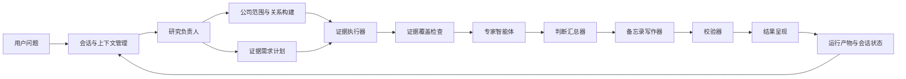

# FinSight-Agent 总体架构

本文面向公开读者，说明 FinSight-Agent 当前如何把一个开放式金融研究问题转成可检查、可复用、可校验的研究流程。这里不复述每轮实验历史，也不记录云端运行编号；历史过程放在工作日志和模型运行记录中。

## 设计目标

FinSight-Agent 的核心目标是让大模型参与研究判断和表达，但不能让它绕开证据边界。系统把一次投研回答拆成多个受约束步骤：

1. 判断用户到底在问什么。
2. 决定是否需要扩展公司范围。
3. 调用受控工具检索披露、市场、行业和关系证据。
4. 把数值、来源、期间和证据对象整理成可追溯产物。
5. 让不同专家智能体只基于限定证据形成结论卡。
6. 汇总成研究提纲，再写成备忘录。
7. 校验数值、来源、关系假设和结论强度是否匹配。
8. 保存会话状态和运行产物，支持追问和复查。

系统不做实时行情、自动交易或个性化投资建议。它适合做的是有证据边界的公开公司研究。

## 总体链路

这条链路的关键是：每个节点都产出结构化结果，下游节点读取这些结果继续工作，而不是让一个模型在长提示词里完成所有事情。

## 主要模块

| 模块 | 作用 |
| --- | --- |
| 会话与上下文管理 | 保存用户目标、当前研究范围、上一轮答案、证据引用和运行产物路径 |
| 研究负责人 | 判断问题类型、研究深度、公司范围、证据需求和智能体激活计划 |
| 公司范围与关系构建 | 基于公司清单和关系证据选择同业、上游、下游、基础设施或能源传导对象 |
| 证据执行器 | 调用披露检索、数值台账、市场快照、行业快照、关系图谱和语义召回工具 |
| 覆盖检查 | 判断证据是否足够，缺口是否可检索，是否需要二次检索或有边界回答 |
| 专家智能体 | 基本面、市场、行业/供应链和风险专家分别形成结论卡、反证和缺口请求 |
| 判断汇总器 | 汇总专家结论和未解决缺口，形成可写作的研究提纲 |
| 备忘录写作器 | 只基于已验证提纲写面向用户的研究备忘录 |
| 校验器 | 检查来源边界、数值引用、关系强度、缺证断言和修复是否收敛 |
| 呈现器 | 展示最终答案、关键证据、假设边界、缺口请求和可继续追问的状态 |
| 本地工作台 | 提供任务启动、运行轨迹、模型调用量、耗时和评测报告的可观测入口 |

## 数据如何进入系统

FinSight-Agent 当前按来源类型管理证据，而不是把所有文本混成一个长上下文。

| 来源 | 进入方式 | 主要用途 |
| --- | --- | --- |
| 公开披露文件 | 披露清单、切分文本、对象索引、关键词检索、语义召回 | 公司财务事实、业务描述、风险因素、管理层讨论 |
| 公司业绩材料 | 业绩公告和管理层口径检索 | 经营叙事、指引、管理层解释 |
| 精确数值台账 | 公司、期间、指标、单位和来源对象绑定 | 单指标查询、财务指标比较、数值校验 |
| 市场快照 | 离线价格、收益率、事件窗口和估值语境 | 市场反应和估值背景，不代表实时行情 |
| 行业快照 | 宏观、能源、利率、消费、行业主题等观察 | 行业背景和经济传导，不覆盖公司披露事实 |
| 关系图谱 | 同业、供应链、客户、基础设施和地区风险线索 | 构建研究范围和关系假设，不直接证明财务事实 |

来源边界会贯穿整个链路。比如，市场快照可以解释价格表现，但不能证明公司收入；关系图谱可以支持供应链假设，但不能把未确认关系写成真实客户或合同。

## 结构化产物

系统会在运行过程中产生多类可检查产物：

| 产物 | 用途 |
| --- | --- |
| 研究计划 | 记录问题类型、研究范围、证据需求、智能体激活和预算 |
| 公司范围计划 | 记录纳入公司、排除公司、关系强度和来源可用性 |
| 检索计划 | 记录要走哪些检索路径、每条路径的预算和边界 |
| 工具台账 | 记录哪个节点调用了什么工具、拿到多少证据、是否产生缺口 |
| 数值台账行 | 记录可追溯数值事实，支撑查数和财务比较 |
| 覆盖报告 | 记录哪些证据足够，哪些缺口可检索，哪些属于数据边界 |
| 专家结论卡 | 记录专家支持结论、反证、冲突、证据引用和缺口请求 |
| 判断提纲 | 记录最终备忘录应使用的核心判断、证据、风险和观察项 |
| 备忘录草稿 | 面向用户的研究回答，但仍需校验 |
| 校验报告 | 记录来源越界、数值漂移、关系误用和修复结果 |
| 呈现结果 | 用户看到的答案和边界说明 |

这些产物让系统可以审计，也让多轮追问不必每次从零开始。

## 控制边界

项目的工程边界有三条：

- **模型不能直接越权取数**：研究负责人和专家智能体不能直接扫私有文件或数据库，只能通过受控工具和限定证据工作。
- **写作不能新增事实**：备忘录写作器只读已验证的研究提纲和结论卡，不能自己补公司、数字或关系事实。
- **证据不足必须显式保留**：如果当前数据不支持某个结论，系统应输出缺口、假设或有边界回答，而不是让模型补写。

## 当前完成度

当前公开状态可以概括为：

- 603 家公司扩展资产已经进入后端诊断链路。
- 精确查询、聚焦回答、标准备忘录、行业深度、多轮追问、范围决策和缺口升级均已有真实风格评测覆盖。
- 本地工作台可以记录任务耗时、工具轨迹、模型调用量和评测报告。
- 系统仍不是生产服务：行业深度问题耗时较高，向量检索当前不是生产级 GPU 索引，权限、多用户队列、成本控制和服务治理还需要继续工程化。

更细的专题说明见：

- [多智能体协作机制](multi_agent_orchestration.zh-CN.md)
- [上下文与状态管理](context_and_state_management.zh-CN.md)
- [数据与工具权限模型](data_and_tool_access_model.zh-CN.md)
- [后端与评测运行时](backend_and_eval_runtime.zh-CN.md)
- [公开评测摘要](../eval/fin_agent_public_eval_summary.zh-CN.md)
