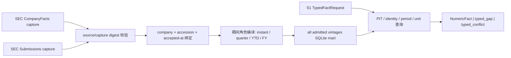

# FIN 0.1.3 S2 公司财务事实 Mart 与 PIT 精确查询

日期：2026-08-13
状态：`controlled_vertical_engineering_pass / natural_planner_research_and_UI_consumption_pending / S2_product_not_closed`

## 1. 为什么数据库是纵切前硬门

文本检索可以找到财报中的数字，但“找到一行数字”不等于取得金融事实权威。最终可交付数值还必须回答：哪个公司、哪个指标、哪个期间、何时公开、研究截至日当时是否可知、单位是什么、来自哪次申报、是否被后续申报修订。Embedding、reranker、PDF 表格片段或 Writer 都不能替代这些约束。

因此当前链路固定为：S1 把数值意图编译成 `TypedFactRequest`；S2 公司财务事实 mart 执行精确查询，并且只返回 `NumericFact`、`typed_gap` 或 `typed_conflict`；S3 只能分析或引用已授权的 `NumericFact`。叙事检索与 SQL/PIT 精确查询是并列路线，不是二选一。

## 2. 本轮替换的旧设计

旧 SQL 诊断只做到年度 `9/9`，current-quarter 为 `0/6`；旧表还会把一个 ticker／metric 压成一行，无法保存披露 vintage，并把 fact、signal、context 混在一起。该路线没有迁入当前实现。

新 mart 从三案 2026-08-06 已保存的 SEC CompanyFacts 与 Submissions capture 零网络构建：

“保存全部 vintage”严格指保存全部**已被当前 capture 绑定到 filing identity 的 vintage**。无法取得 `accepted_at` 或 accession 绑定的旧 CompanyFacts 行不会被猜测接纳；它们形成可审计的 source coverage 边界。

## 3. 当前事实模型

每条 `company_fact_observation` 至少保存：

- 公司身份：ticker、CIK、legal name；
- 指标身份：标准 metric、taxonomy、concept 与 concept priority；
- 数值身份：Decimal 文本、unit、unit family；
- 时间身份：period start/end、duration、instant／quarter-discrete／fiscal-YTD／fiscal-year、FY/FP；
- 披露时点：form、accession、filed-at、accepted-at、primary document；
- 血缘：CompanyFacts/Submissions ref、digest、capture time、citation URL；
- vintage：旧观测保留，并用 supersession 关系标记当前替代项。

当前直接指标共 12 类：收入、毛利、营业利润、净利润、稀释 EPS、经营现金流、资本开支、存货、应收、应付、现金及等价物、流通股数。毛利率、营业利润率和自由现金流由同期间、同 accession 的输入事实确定性计算，并保存 formula trace；不允许模型自由算术。

## 4. 期间与 PIT 规则

1. `research_as_of` 之前尚未 accepted 的 filing 一律不可见。
2. 明确历史期间请求，在当时可用的 vintage 中选择最新披露。
3. 开放式“当前季度＋最近财年”查询把 interim/instant 锁定在同一最新 10-Q accession，并单独选择最近 10-K；不能从不同 10-Q 拼出一个看似更完整的当前季度。
4. duration 事实严格区分 quarter-discrete 与 fiscal-YTD。Micron FY2026 Q3 的九个月 OCF 不得冒充单季度 OCF。
5. 同一最新 vintage 出现相同事实身份但数值冲突时返回 `typed_conflict`，不能任选一个。
6. 不支持的指标、缺失期间、错公司、错单位族均返回 typed gap，不从 narrative candidate 猜值。

实现时自然发现并修复了一项真实业务缺陷：第一版开放期间选择器按 period role 各自取最新，曾把 DELL/NVDA 最新 Q1 与上一财年的 Q3 YTD 混在一起。现在它按 disclosure cohort 选取，同一“当前季度”不会跨申报拼接。

## 5. 零网络工程结果

- SQLite：`data/workbench_private/fin_0_1_3_s2_company_financial_fact_mart/v1/company_financial_facts.sqlite`（private、不可提交）；
- 1,319 条 source-bound observation：DELL 390、MU 463、NVDA 466；
- period role：instant 386、fiscal year 217、quarter-discrete 406、fiscal-YTD 310；
- 591 条 superseded observation 仍被保留；
- 24/24 精确 qrel：最近财年 9/9，当前 interim 15/15；
- mutation 全通过：未来 filing 隔离、YTD/季度不混淆、跨案拒绝、同期间公式 trace、当前 disclosure cohort 不串期；
- 0 网络、0 模型调用。

DELL FY2027 Q1 例子：收入 `43,842,000,000 USD`、毛利 `7,782,000,000 USD`、经营现金流 `4,081,000,000 USD`、资本开支 `963,000,000 USD`；由同一 accession 确定性得到自由现金流 `3,118,000,000 USD` 和带输入 lineage 的毛利率。

机器结果见 `configs/financial_facts/fin_ia_0_1_3_s2_company_financial_fact_mart_result_v1_0.json`，当前 result digest 为 `e5c88e63...c0a8fb`。

## 6. 当前明确边界

- 这是 S2 数据库、查询执行器与 request-scoped backend 的 engineering pass，不是 S2 产品关闭。
- mart 已通过显式 Runtime path 挂入当前 Research Retrieval Service；它没有进入 Git 或 Runtime Resource Registry，也不与可写 Operations SQLite 混用。
- 当前消费者仍是工程侧提供受控 EvidenceRequest 的 backend API。S3 自然问题规划、报告综合和前端展示尚未消费，因此还没有证明用户可感知的数值能力。
- 当前只覆盖三个案例和已绑定的近年 SEC 10-K/10-Q；缺少历史 filing identity 的旧行不接纳。
- `total_debt` 尚未进入当前标准指标；DELL 当前 capture 没有可接纳 shares outstanding，MU 没有可接纳 accounts payable，均保留 typed gap。
- 市场价格、估值和行业数据属于独立 PIT market/industry mart，不混进公司报表事实表。
- metric-row、PDF 表格候选和 embedding 命中仍不拥有 NumericFact 权威。

## 7. 当前 Runtime 消费证明

真实 DELL request-scoped 诊断同时请求 `reported_results`、`cash_generation` 与 6 个标准指标：revenue、gross_margin、operating_income、operating_cash_flow、capital_expenditures、free_cash_flow。结果为：

- narrative lanes 2/2 非空、9 个去重候选；
- typed fact requests 6/6 store-ready、6/6 resolved、0 gap、0 conflict；
- FY2027 Q1 revenue=`43,842,000,000 USD`、operating cash flow=`4,081,000,000 USD`、capital expenditures=`963,000,000 USD`；
- 同一 accession 的确定性公式返回 free cash flow=`3,118,000,000 USD`，并保留输入 NumericFact ID、source digest 和 citation URL；
- 0 网络、0 模型调用。

该证明使用标准 metric ID。自然语言中的“资本开支／capital expenditure”等表达必须由 S3 规范成受控 ID `capital_expenditures`；S2 不以模糊词形扩大事实查询权限。未知指标继续 fail closed，而不是逐词增加数据库分支。

在后续 DELL 受控 S1/S2/S3 纵切中，同一产品服务进一步执行 5 个 EvidenceRequest 下的 7 个 typed fact request：7/7 resolved、0 gap、0 conflict，共物化 21 个 source-bound NumericFact。除上述收入、现金流、资本开支和自由现金流外，还覆盖营业利润、毛利、毛利率及最近财年 sibling，并继续保留 accession、accepted-at、期间、单位、citation、capture digest 与公式输入 lineage。该结果证明数据库已进入当前纵切，而不是留在离线构建脚本中；但 atoms 仍是受控输入，所以不等于自然用户问题或报告已消费。

## 8. 下一门

零调用纵切的工程部分已经完成。下一门是唯一一次最小自然 planner canary：模型只能选择 canonical facet、目标实体、metric ID 和产品意图；S2 仍独立执行 typed request。Canary 通过后，也必须继续验证 S3 是否在研究判断和引用中真实使用这些 NumericFact，并执行三案依赖回归；否则不能把当前 private mart 宣称为完整用户能力。未来更强 embedding、reranker 或生成模型可以减少检索和规划拐杖，但不能取消公司财务事实库、PIT、期间、单位、冲突和 lineage 这条金融控制面。

## 9. 2026-08-16 transcript 与同口径比较 successor

S1 将 Dell／TSMC 法说接回 current retrieval 后，S2 做了独立非回归。结果确认 current mart 的唯一来源仍是 digest-bound SEC CompanyFacts 与 Submissions，允许表单仅为 10-K／10-Q；S1 transcript、PDF metric row 和候选文本均不进入 S2 observation，也不获得 NumericFact 权威。

第一次重建 R1 虽然得到与现有库完全相同的 SQLite SHA 和 24/24 qrel，却被旧 mutation 判失败。根因不是数据变化，而是历史检查仍禁止上年同期 Q1；当前 executor 为了给 S3 提供合法同比，已经正确保留当前 10-Q 中的本期 Q1 与上年同期 Q1。successor 将门改为“保留同口径对比端点，同时禁止旧 Q3 YTD 混入”。

旧 v1.0 result 保持不可变；current builder 与 Workbench 构建入口使用 `fin_ia_0_1_3_s2_company_financial_fact_mart_result_v1_1.json`。v1.1 仍为 1,319 observations、9/9 最新财年、15/15 current interim，result digest=`0c25c917...95a1`。formal regression 见 `configs/financial_facts/fin_ia_0_1_3_s2_transcript_numeric_authority_regression_result_v1_0.json`。

该 successor 不关闭 `RC-S2-004`：产品收入、ASP、PVM、出货量、产品利润与公司／分部利润桥仍可能公开不可得。S2 不会为填满五单元而从法说叙事抽取一个伪 NumericFact。
