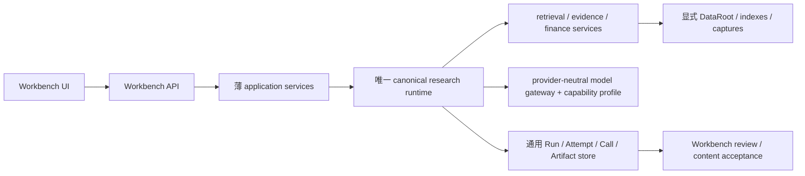

# FIN 0.1.3 干净基线、代码生命周期与 Workbench 切换方案

日期：2026-08-11

工作分支：`codex/fin013-clean-baseline`

工作树：`D:/FIN_Insight_Agent_fin013_rebaseline`

基准提交：`87a8276fcb26aafab066bd42852759cffcb41b46`

状态：Owner 已批准“禁止删除；允许移动、归档和重构”。迁移边界与第一轮 P0 基线切片已完成工程验证；批量移动仍须等待具体消费者和产品切换门核清。

## 1. 结论

当前代码并非全部都应继续留在 active 主干，但也不能按文件数量、文件名或修改时间直接搬走。现在已经能够把代码分成产品、运维、候选、评测和历史五类，并能说明当前产品真正执行了哪些模块。

新工作树不是另一套平行实现。它是 FIN 0.1.3 唯一 rebaseline 工作区；原仓库继续保留完整历史、私有数据和不可变运行证据。所有新实现先进入这个分支，经过 Workbench 产品切换门后，旧实现才能移动到版本归档。

本轮发现并已在第一切片中处理两个阻止“干净基线”成立的 P0：

1. `runtime_resource_registry` 把文本资源的 digest 绑定到旧 Windows CRLF 检出字节；干净工作树按 `.gitattributes` 检出 LF 后，内容未变却无法导入 Workbench。
2. Workbench 把代码根和数据根混成 `REPO_ROOT/data`；新工作树没有原仓库约 74 GiB 的 ignored/private 数据与索引，因此无法复用同一套本地研究资产。

二者都已有仓库内先例可复用：FIN 0.1.3 的局部 runner 已采用 universal-newline 文本摘要，`src/sec_agent/runtime_bridge/paths.py` 已定义 `FINSIGHT_DATA_ROOT` 等多根路径合同。正确做法是把现有能力提升到共享产品边界，而不是再造一套 helper。

另有一项历史 proof 债务被实证：`FIN 0.1.3 repair-closeout S0-02` 决策首次进入 Git 时，`shared_admission_ledger.py`、FIN 0.1.3 guarded search 和其测试本身的三个记录摘要已经与同提交 blob 不一致。新基线不重写旧决策，也不再要求今天的源码伪装成旧字节；历史测试改为读取决策诞生提交的 Git blob，并显式验证这三条 birth drift。

## 2. 当前代码究竟由谁使用

本轮同时使用 AST import 图、真实 Workbench import trace、配置/文本引用和 Git 版本节点交叉判断。

### 2.1 `src` 的执行归属

| 归属 | 文件数 | 含义 | 当前动作 |
| --- | ---: | --- | --- |
| Workbench 产品可达 | 119 | 当前产品导入闭包 | keep；逐步去除历史代际混装 |
| 数据/运维管道可达 | 132 | ingestion、index、capture、operator 等 | keep；不塞入在线产品 Runtime |
| 公开 CLI/MCP 可达 | 14 | 非 Workbench 的稳定入口 | keep；后续共享同一 canonical service |
| 仅 release runner 可达 | 99 | 尚未切入产品的候选或 attempt 专用实现 | promote/merge/archive 待逐组件裁决 |
| 仅测试可达 | 5 | 测试 helper 或 fixture runtime | test-only；不冒充产品能力 |
| 仅 eval 可达 | 5 | 离线评测 | eval-only |
| 未知静态消费者 | 13 | 可能为动态调用、遗留或 orphan | quarantine review；不是删除授权 |

99 个 release-only `src` 模块中：

- S1 检索与 Evidence 候选 62 个；
- S2 合同、Numeric 与 fixed-pack 候选 20 个；
- S3 动态研究候选 12 个；
- 其他候选 5 个。

这说明 S1–S3 并非“没做”，而是大量能力停在 proof/release 主线上，没有晋升到 Workbench 产品主线。

### 2.2 Workbench 当前实际混装

一次真实 `apps.workbench.backend.app` import 动态载入 173 个仓库模块。核心构成包括：

| 家族 | 动态/静态可达情况 | 问题 |
| --- | ---: | --- |
| Workbench API/application | 58 个左右 | 应作为常驻平台保留 |
| canonical runtime | 15 | 新控制面已进入，但并非唯一 Runtime |
| `r53_r60_*` 历史产品面 | 22 | 仍被 app 直接 import，不能现在归档 |
| FIN 0.1.2 binding/projection/review | 7 | 当前产品仍依赖旧版本绑定 |
| `sec_agent.workbench` | 12 | 应保留为运维/任务基础设施 |
| evidence/retrieval/source ingestion | 8 个左右 | 当前只覆盖部分本地研究能力 |

`app.py` 同时直接导入 canonical runtime、`langgraph_orchestrator`、S4 case runtime、FIN 0.1.2 projection/reviewer 和 `r53_r60` 路由。这不是合理的长期耦合，而是多代产品入口共居。

### 2.3 证明面膨胀

`scripts/releases` 有 359 个文件、约 103,867 行；其中 materialize 113、run 74、prepare 65、issue 54。它们多数把一次 attempt 的数据、权限和执行动作写成专用 Python。以后必须改为：

```text
一个通用 runner + 一个版本化合同 + 一条不可变 attempt 数据记录
```

而不是：

```text
每次失败 = 新 runner + 新 authority JSON + 新 result JSON + 新 test + 新 worklog
```

历史文件不删除、不改写；新基线开始停止继续复制这种模式。

## 3. 生命周期裁决规则

文件不能只凭 `mtime` 归档。版本归属至少同时看五项：

1. 首次引入它的 Git commit 和当时产品版本；
2. 最后一个真实产品消费者；
3. 是否已有功能等价的 successor；
4. 配置、测试、CLI、动态 import 和外部运维引用；
5. 移动后能否由 redirect/manifest 保留历史 digest 与复现路径。

五种动作定义如下：

| 动作 | 判定 | 例子 |
| --- | --- | --- |
| keep | 当前产品/运维真实使用且职责合理 | Workbench API、canonical runtime、ingestion/index operator |
| promote | 候选能力已通过产品门，应进入 canonical service/Workbench | 通过内容验收的 S1 Evidence Pack、S2 Numeric view、S3 dynamic research |
| merge | 多套实现负责同一长期能力 | newline digest、exact-once runner、provider profile、合同编译 |
| archive | 已有 successor 且所有消费者已切换 | FIN 0.1.2 projection、`r53_r60` 旧产品面、attempt 专用实现 |
| quarantine | 消费者或版本归属尚不清楚 | 13 个静态无消费者文件、动态脚本入口 |

归档目标按产品 lineage 建立：`archive/code/pre_fin_0_1/`、`archive/code/fin_0_1_1/`、`archive/code/fin_0_1_2/`、`archive/code/fin_0_1_3_attempts/`。目录可以先建立说明，但代码只有在 cutover 通过后才移动。

## 4. Workbench 的长期定位

Workbench 从现在起是常驻产品壳，也是开发、集成、回归和人工验收的唯一产品表面；不再把一次性 release runner 当作第二个产品。

目标调用关系：



长期禁止的结构：

- Workbench 为每个 S/T/attempt 直接 import 一个新模块；
- eval/release 脚本拥有一套与产品不同的编排；
- model prompt、validator、fake provider、renderer、terminal 和 UI 各自维护合同；
- 新工作树复制全部 private data；
- 仅 proof 通过就把候选标为产品能力。

## 5. 截图中六个问题的具体解决办法

| 原问题 | 具体改法 | 验收证据 |
| --- | --- | --- |
| proof 链与 Workbench 分离 | 候选能力只能通过 canonical service adapter 晋升；每个 S1–S3 能力必须有 Workbench route/service 消费测试 | 同一输入在 library、API、UI 三层得到同一 digest/Artifact；无 candidate-only shortcut |
| attempt 复制 runner/JSON/test/worklog | 建立一个声明式 exact-once runner；attempt 差异只放 spec/ledger/object store；Git 只保留小型索引和重大决策 | 新 attempt 不新增专用 Python；失败仍可按 Run/Attempt/Call ID 完整追溯 |
| 六处合同漂移 | 建立单一 compiled contract source，生成 model view、validator、fake fixture、renderer input、terminal schema 和 Workbench projection | 合同 mutation 在编译期失败；不再出现三字段/五字段错配 |
| 工程门早、金融质量门晚 | 每个真实 case 先做 Evidence Pack business autopsy，再做同输入 report quality 和 Workbench 人工审阅；shape/digest 只是一层 | 报告必须通过 L1、八维内容、paired、qualified-human；不能靠 9 Artifacts 数量过关 |
| 项目缺陷与 DS 缺陷混在一起 | provider-neutral core + `ModelCapabilityProfile`；失败强制分为 data/tool、project contract、model adherence、content quality | 同 Evidence Pack 可跨 Provider canary；核心 Runtime 不增加 DS 字段级分支 |
| Project OS/PRD 变流水账 | `current_context_pack` 只保留当前状态、决策和指针；完整历史留 append-only ledger，由索引查询 | 新 task 只需读短 checkpoint＋机器索引即可恢复，不依赖聊天记忆 |

另加两个本轮已实证的问题：

| 新问题 | 具体改法 | 验收证据 |
| --- | --- | --- |
| 文本 digest 绑定 CRLF | 把已存在的 universal-newline 等价规则提升到共享 registry；只容忍 CRLF/LF 传输差异，任意内容变化仍 fail closed | 原工作树与 LF 干净工作树均可加载同一 registry；字符 mutation 必须失败 |
| Workbench 数据绑定代码目录 | 复用 `RuntimePathRegistry`；代码根、primary data、secondary data、object store、workbench private 分开；新工作树只挂载旧数据根 | 新工作树通过 `FINSIGHT_DATA_ROOT` 使用既有 index/DB，系统状态显示每个根，不复制 74 GiB |

## 6. 切换与归档顺序

### Phase A：让干净工作树可运行

1. 修复共享 registry 的 CRLF/LF 等价验证。
2. 让 Workbench 复用 `RuntimePathRegistry`，先覆盖 store、local research、status 和 prompt/audit 输出。
3. 在新工作树绑定原仓库数据根，运行 Workbench smoke 与当前产品回归。

### Phase B：建立唯一产品 Runtime

1. 画出 Workbench 每条 route 到 service/runtime 的消费者图。
2. 将 S1、S2、S3 候选分别以 adapter 接到 canonical runtime，不把版本名写入长期接口。
3. 建立 library/API/UI 三层一致性与业务内容验收。

### Phase C：停止制造新债务

1. 新 attempt 统一走通用 runner 和 object store。
2. 新合同统一走 compiler。
3. `scripts/releases` 从“新增专用脚本”改成“调用通用 CLI 的历史 wrapper”；wrapper 在对应版本关闭后归档。

### Phase D：按版本归档旧代码

1. FIN 0.1.3 S1–S3 产品切换通过后，FIN 0.1.2 binding 移入 `archive/code/fin_0_1_2/`。
2. legacy route 的 Workbench 替代面通过后，`r53_r60_*` 移入其 Git 来源对应版本目录。
3. attempt-only S1/S2/S3 模块按“可复用内核已抽取、无 active consumer、历史复现 manifest 完整”后移入 `archive/code/fin_0_1_3_attempts/`。
4. 所有移动使用 Git rename，并保留 machine-readable redirect manifest；不删除历史。

### Phase E：恢复 FIN 0.1.3 产品任务

仓库与 Workbench 基线稳定后，才恢复暂停的 S3 合同处置；随后按真实三案例内容质量、Workbench dogfood 和 S5 release gate 收口，而不是回到逐 attempt 修补。

## 7. 当前禁止事项

- 不批量移动 99 个 release-only 或 13 个 unknown 模块。
- 不把旧数据复制进新工作树。
- 不因目录名字含 0.1.1/0.1.2 就直接归档。
- 不修改或删除 immutable failed run。
- 不新建第二套 Workbench、第二套 canonical runtime 或第二套路径注册表。
- 在产品主线恢复前，不继续签发新的 DeepSeek live。

机器摘要见 `configs/repository/fin_0_1_3_code_lifecycle_cutover_v1_0.json`。

## 8. 第一轮基线切片的实际结果

已完成的不是目录美化，而是四项产品边界修复：

1. 共享 resource registry 只把 LF/CRLF 视为同一 UTF-8 文本的检出差异；任何字符、键值、顺序或其他字节变化仍 fail closed。
2. 默认现行 registry 提升到已存在的 repair-closeout 31-resource successor；旧 registry 和旧决策保持不改写。
3. Workbench 的 code root、data root、object store、private runtime root 已分开；store、local research、job audit、prompt temp 和 system status 共同消费 `RuntimePathRegistry`。
4. 当前 projection/reviewer tests 直接验证注册成品，不再为了验证当前产品而读取 ignored `.codex_runtime` attempt；reviewer 的安全 surface validator 已晋升到产品 service，而不是继续寄居 release materializer。

验证结果：

- Workbench clean import：通过；
- Workbench／runtime／current projection／reviewer 组合回归：`143 passed`；
- runtime registry、active-suite historical semantics 与 shared-ledger：`29 passed`；
- S4 T03 本地检索、T05 DELL/MU/NVDA transfer 与 DELL fresh-proof 相邻回归：`19 + 8 passed`；
- clean worktree 挂载 `D:/FIN_Insight_Agent/data` 的 NVDA 本地检索：terminal=`success`，三个研究单元分别接受 `6/6/6`，共 `18 accepted / 13 rejected`，`1` 次 fake official identity、`6` 次本地检索、`0` 模型、`0` Provider、`0` live network；
- 无数据复制、无文件删除、无历史 run 改写、无 DeepSeek 调用。

这说明现在已经能够从干净代码基线运行 Workbench 和本地研究链，但不等于 99 个 release-only 候选已经产品化，也不等于可以立即搬走 FIN 0.1.2／`r53_r60`。下一阶段必须先完成 route → application service → canonical runtime → resource 的消费者图，再逐能力 promote，最后才执行带 redirect manifest 的 Git rename 归档。
