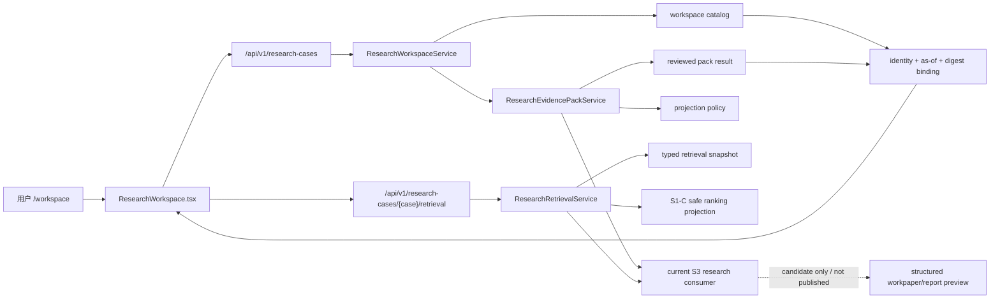
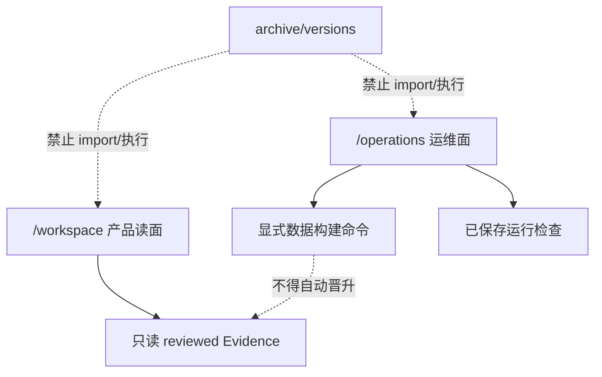

# FIN 0.1.3 当前基线代码图

日期：2026-08-12
状态：G01–G12 主线仓库基线通过；FIN 0.1.3 产品迭代尚未完成。

## 1. 当前产品是什么

当前唯一产品是一个本地只读研究工作台。它加载 DELL、MU、NVDA 三份已复核 Evidence Pack，并用 `CaseSubject + ResearchContext + CasePackBinding` 防止公司、期间、artifact 或 payload 串案。S1-A/S1-B 接入 `candidate_not_evidence` 的当前金融对象候选；S1-C 又接入同对象四路排名对照。排名投影剥离 gold identity，只用于审计候选，不替换 reviewed Pack。

DELL 当前 Pack 已从仅 SEC 扩展为 SEC＋Dell IR＋TSM IR（20 Evidence／14 gaps），MU/NVDA 仍保留旧 Pack；三案 Workbench Evidence 页面的结构化数值项仍为 0。当前代码图已经证明审证、类型化候选、官方 PDF 入库/晋升、按案例私有对象绑定、缺口可见，以及 reviewed Evidence＋S2 NumericFact 到结构化研究 preview 的零调用消费；它不证明 S1 全来源覆盖、DeepSeek 自然研究质量或完整投研内容验收。S2 NumericFact 通过独立 private mart 提供，不嵌入 transcript Evidence。



这条链没有模型调用、联网检索、自动证据晋升或写入研究事实的权限。

## 2. 唯一组合根

| 层 | 当前入口 | 职责 |
| --- | --- | --- |
| Backend composition | `apps/workbench/backend/app.py` | 只组装 workspace、operations、当前 API、重定向与 410 tombstone |
| Product application | `apps/workbench/backend/application/research_workspace_service.py` | Case 身份、as-of、版本和 Pack digest 绑定 |
| Evidence application | `apps/workbench/backend/application/research_evidence_pack_service.py` | 读取并校验三个 reviewed pack |
| Retrieval application | `apps/workbench/backend/application/research_retrieval_service.py` | 读取候选快照与 S1-C 安全投影、剥离 qrel identity、保持 candidate/Evidence 边界 |
| Product UI | `apps/workbench/frontend/vite/src/app/ResearchWorkspace.tsx` | 三案例工作区、证据与类型化检索候选展示 |
| Operator UI | `apps/workbench/frontend/vite/src/operations/OperationsConsole.tsx` | 系统状态、配置、数据构建和运行检查 |
| Runtime registry | `src/sec_agent/runtime_resource_registry.py` | R11 注册 10 项 current resource；支持 DELL v1.1 Pack/Workspace 组合并保持 MU/NVDA 私有对象不复制 |

后端只消费 Vite 生成的 `apps/workbench/frontend/dist/index.html`。缺少构建产物时 `/workspace` 与 `/operations` 返回 typed 503 `frontend_not_built`；源码目录中的历史 HTML 已归档，不能作为缓存式 fallback。

## 3. 活动领域与数据模块

| 目录 | 当前职责 | 明确不负责 |
| --- | --- | --- |
| `src/connectors/` | SEC 下载与 filing manifest | broad web search |
| `src/ingestion/` | filing/8-K 解析、section split 与有界 official-source capture | 研究判断或搜索摘要晋升 |
| `src/evidence/` | Evidence schema 与构建 | 未经 gate 的事实晋升 |
| `src/indexing/`、`src/retrieval/` | BM25 构建、provider-neutral 金融查询合同、父子金融对象、facet 编译、候选过滤/解释、同对象 sparse/dense/fusion/规则重排比较 | 已完成的金融 RAG、默认 dense/rerank 或 Evidence 晋升声明 |
| `src/sec_agent/market_snapshot.py` | 离线市场快照合同 | 实时行情 |
| `src/sec_agent/research/` | provider-neutral planner、reviewed Pack/PDF successor，以及 Evidence＋NumericFact 到判断/底稿/报告的 current consumer | 未经验收的自然研究质量或产品发布 |
| `src/sec_agent/runtime_bridge/` | code/data、只读 reviewed Evidence 与可写 state 的显式路径边界 | checkout-local 私有数据假设 |
| `src/sec_agent/workbench/` | 运维 profile、source bundle、data build、run inspection | 旧 ask/session/checkpoint 产品链 |

## 4. 数据构建链

`/operations` 只准入以下受维护族：

1. SEC filing：download → manifest → chunks。
2. SEC 8-K earnings：download → manifest → chunks。
3. Evidence Store、BM25 与类型化本地候选快照。
4. 离线市场快照：download/normalize → catalog → analytics → evidence pack → validate。
5. 行业来源快照。

脚本存在不代表网络、凭据或私有数据已就绪。每个步骤必须使用显式配置和 DataRoot；没有 admitted producer 的旧 object-BM25 步骤不在当前 catalog。

容器路径分为三类：`/app/data` 为普通数据构建根，`/app/reviewed-evidence` 为可只读挂载的 Evidence 对象根，`/app/state` 为可写 Operations SQLite/job state。Evidence 和 state 不再共用 `workbench_private` 写权限。

## 5. 产品和运维边界



旧 `/current`、`/next`、`/tasks`、`/cases` 只做 308 redirect；旧 r53-r60、FIN 0.1.2、Point02 API 返回 typed HTTP 410。它们的实现不在当前 import graph。

## 6. 活动规模和证明

机器生成清单：`configs/repository/fin_0_1_3_active_baseline_manifest_v1_0.json`。

- Python import graph：111 个文件。
- 前端 import graph：8 个文件。
- Runtime resources：10 个。
- Runtime detectors：4 个。
- archive/旧版本/attempt 的活动引用：0。
- unresolved local import：0。

验证命令：

```powershell
python scripts/engineering/verify_active_baseline.py --pretty
python scripts/engineering/build_archive_redirect_index.py --check
python -m pytest -q
```

S1-B 收口复证为：59 个 Python tests、TypeScript、Vite production build、无数据和真实数据挂载两种模式各 6 个 Playwright tests，以及 6,254 个仓库文件 secret scan 0 finding。真实数据移动端测试曾暴露长 lane ID/来源标签造成横向溢出，已在当前 Workbench 消费者中收敛，未通过放宽测试规避。

S1-C 收口复证为：活动图 72 Python / 7 frontend / 5 Runtime resources，65 个 Python tests、TypeScript、Vite production build，无数据和真实数据挂载桌面／移动各 6/6 Playwright tests，以及 6,265 files secret scan 0 findings。S1-C 两步也已进入 Operations 的 `Retrieval Eval` 受控构建族，避免结果由不可恢复的一次性脚本生成。

## 7. 历史与恢复

6,052 个历史/被替换文件的去向记录在 `archive/versions/FIN_0_1_3_REBASELINE_REDIRECT_INDEX.jsonl`。其中包含已经完成使命的一次性迁移程序、旧 HTML 原型和脱敏 fixture；每行均记录原路径、归档路径、推断版本、处置原因、当前替代物、证据分类、活动 import 禁令和 SHA256。156 个不适合跨平台检出的长路径已改为短对象路径，并由 `archive/versions/FIN_0_1_3_REBASELINE_PATH_MAP.jsonl` 可逆绑定回完整原路径。摘要以 Git canonical blob 为准，不受 Windows checkout 换行转换影响。

归档不是垃圾箱：历史失败和设计仍可审计。但归档也不是代码库的隐形第二主线；任何恢复必须通过版本中立 successor、当前测试、当前消费者和新的生命周期决策。

## 8. 当前完成边界

仓库工程基线已经合并远端 `main` 并完成 G12。复证目标为 `cd9990ac7ea4586cc55af0bc77f41c3f797399cb`，在第二份全新 clean-main 工作树上通过：44 个 Python tests、TypeScript、Vite build、无数据/挂载数据桌面与移动共 12 个 Playwright tests、三案业务验收、6,230 文件 secret scan、clean Docker build、无数据和只读 Evidence 挂载 smoke，以及原生 Compose 启动。

S0 仓库/运行时基线已关闭；S1-A/S1-B/S1-C 工程纵切和本轮 S1-D Dell/TSM 补源已完成，但 S1 总产品门仍未通过。当前 DELL Pack 与 S2 mart 已被 current S3 consumer 在零调用 R1 中消费并生成结构化 preview，干净 R2 已复现相同 input/deliverable digest；活动树不再只有 Planner，也没有复活归档报告 runner。当前下一门是唯一一次 DeepSeek 自然综合 canary。MU/NVDA 动态研究、S4 产品闭环和 S5 release 仍需分别验收。

这些门的唯一机器状态见 `configs/repository/fin_0_1_3_strict_mainline_rebaseline_acceptance_v1_0.json`。
