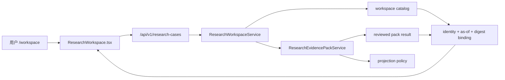
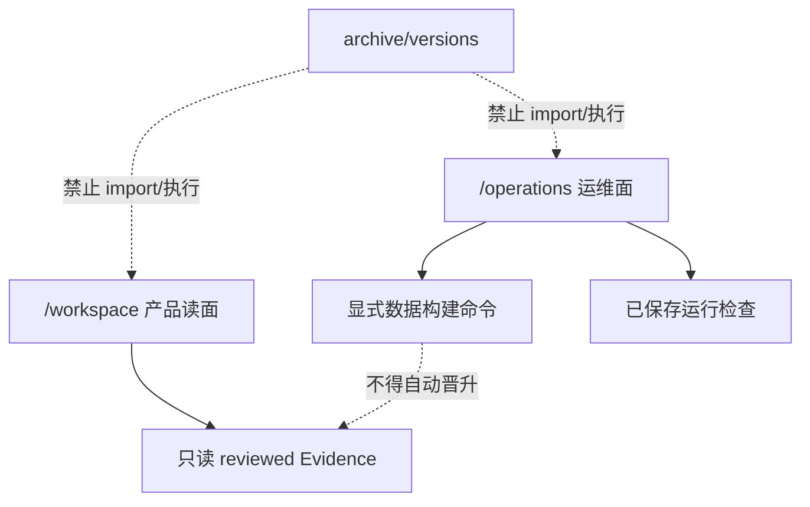

# FIN 0.1.3 当前基线代码图

日期：2026-08-12
状态：G01–G11 合并前验收通过；主线合并后复证前不得称为基线完成或 release complete。

## 1. 当前产品是什么

当前唯一产品是一个本地只读研究工作台。它加载 DELL、MU、NVDA 三份已复核 Evidence Pack，并用 `CaseSubject + ResearchContext + CasePackBinding` 防止公司、期间、artifact 或 payload 串案。

三份当前 Pack 均只来自 SEC，结构化数值项为 0。当前代码图因此只证明审证、来源边界和缺口可见，不证明数值事实、外源多样性或完整投研内容质量。



这条链没有模型调用、联网检索、自动证据晋升或写入研究事实的权限。

## 2. 唯一组合根

| 层 | 当前入口 | 职责 |
| --- | --- | --- |
| Backend composition | `apps/workbench/backend/app.py` | 只组装 workspace、operations、当前 API、重定向与 410 tombstone |
| Product application | `apps/workbench/backend/application/research_workspace_service.py` | Case 身份、as-of、版本和 Pack digest 绑定 |
| Evidence application | `apps/workbench/backend/application/research_evidence_pack_service.py` | 读取并校验三个 reviewed pack |
| Product UI | `apps/workbench/frontend/vite/src/app/ResearchWorkspace.tsx` | 三案例工作区和证据可读展示 |
| Operator UI | `apps/workbench/frontend/vite/src/operations/OperationsConsole.tsx` | 系统状态、配置、数据构建和运行检查 |
| Runtime registry | `src/sec_agent/runtime_resource_registry.py` | 只允许注册的三项 runtime resource |

## 3. 活动领域与数据模块

| 目录 | 当前职责 | 明确不负责 |
| --- | --- | --- |
| `src/connectors/` | SEC 下载与 filing manifest | broad web search |
| `src/ingestion/` | filing/8-K 解析与 section split | 研究判断 |
| `src/evidence/` | Evidence schema 与构建 | 未经 gate 的事实晋升 |
| `src/indexing/`、`src/retrieval/` | 当前 BM25/tokenization 基础 | 已完成的金融 RAG 平台声明 |
| `src/sec_agent/market_snapshot.py` | 离线市场快照合同 | 实时行情 |
| `src/sec_agent/research/` | reviewed pack 的稳定常量/摘要 | 动态 Agent planner |
| `src/sec_agent/runtime_bridge/` | code/data、只读 reviewed Evidence 与可写 state 的显式路径边界 | checkout-local 私有数据假设 |
| `src/sec_agent/workbench/` | 运维 profile、source bundle、data build、run inspection | 旧 ask/session/checkpoint 产品链 |

## 4. 数据构建链

`/operations` 只准入以下受维护族：

1. SEC filing：download → manifest → chunks。
2. SEC 8-K earnings：download → manifest → chunks。
3. Evidence Store 与 BM25。
4. 离线市场快照：download/normalize → catalog → analytics → evidence pack → validate。
5. 行业来源快照。

脚本存在不代表网络、凭据或私有数据已就绪。每个步骤必须使用显式配置和 DataRoot；没有 admitted producer 的旧 object-BM25 步骤不在当前 catalog。

容器路径分为三类：`/app/data` 为普通数据构建根，`/app/reviewed-evidence` 为可只读挂载的 Evidence 对象根，`/app/state` 为可写 Operations SQLite/job state。Evidence 和 state 不再共用 `workbench_private` 写权限。

## 5. 产品和运维边界



旧 `/current`、`/next`、`/tasks`、`/cases` 只做 308 redirect；旧 r53-r60、FIN 0.1.2、Point02 API 返回 typed HTTP 410。它们的实现不在当前 import graph。

## 6. 活动规模和证明

机器生成清单：`configs/repository/fin_0_1_3_active_baseline_manifest_v1_0.json`。

- Python import graph：58 个文件。
- 前端 import graph：7 个文件。
- Runtime resources：3 个。
- Runtime detectors：2 个。
- archive/旧版本/attempt 的活动引用：0。
- unresolved local import：0。

验证命令：

```powershell
python scripts/engineering/verify_active_baseline.py --pretty
python scripts/engineering/build_archive_redirect_index.py --check
python -m pytest -q
```

## 7. 历史与恢复

6,051 个历史/被替换文件的去向记录在 `archive/versions/FIN_0_1_3_REBASELINE_REDIRECT_INDEX.jsonl`。其中包含已经完成使命的一次性迁移程序、旧 HTML 原型和脱敏 fixture；每行均记录原路径、归档路径、推断版本、处置原因、当前替代物、证据分类、活动 import 禁令和 SHA256。156 个不适合跨平台检出的长路径已改为短对象路径，并由 `archive/versions/FIN_0_1_3_REBASELINE_PATH_MAP.jsonl` 可逆绑定回完整原路径；内容摘要没有改变。

归档不是垃圾箱：历史失败和设计仍可审计。但归档也不是代码库的隐形第二主线；任何恢复必须通过版本中立 successor、当前测试、当前消费者和新的生命周期决策。

## 8. 当前完成边界

工程纵切已经成立，但以下门通过前不能冻结/发布：

- 合并并推送 `main`；
- 从干净主线工作树完整复证并关闭 G12。

合并前已通过：43 个 Python tests、TypeScript、Vite build、无数据/挂载数据桌面与移动 Playwright、三案业务验收、6,230 文件 secret scan、无数据和只读 Evidence 挂载 Docker smoke。三案业务通过只限本文件第 1 节定义的 reviewed Evidence Workspace。

这些门的唯一机器状态见 `configs/repository/fin_0_1_3_strict_mainline_rebaseline_acceptance_v1_0.json`。
