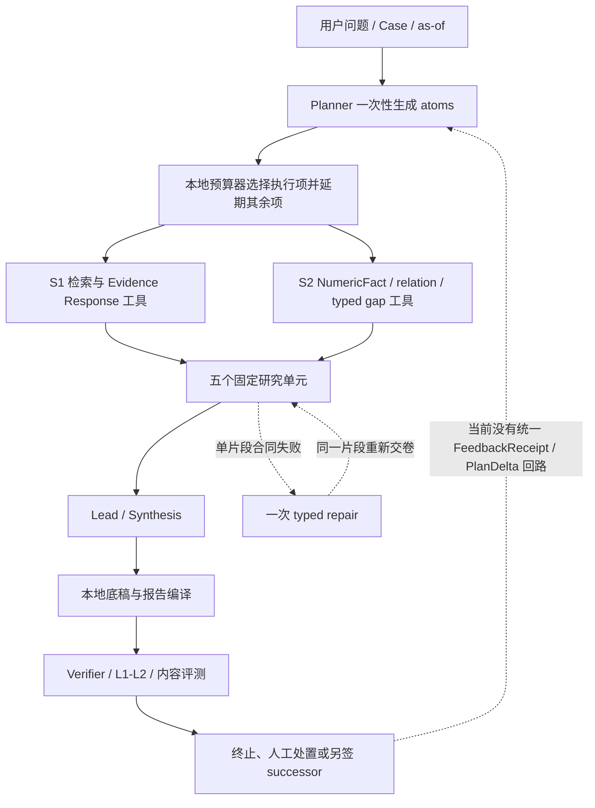

# FIN 0.1.3 Agent Runtime、反思循环与上下文连续性全链审计

更新时间：2026-08-20

状态：`architecture_audit_complete / zero_call_session_feedback_and_bounded_analysis_resume_implemented / generalized_loop_not_implemented`

机器合同：`configs/research/fin_ia_0_1_3_agent_runtime_reflection_context_continuity_contract_v1_0.json`

## 1. 结论先行

当前 FIN 已具备一条受控的研究工作流、一个有界 Provider／Tool loop、失败结果留存、节点级 successor 和一次片段级 typed repair；但它还不是一个具备通用反思、动态改计划、跨 Agent 协调和长上下文续跑能力的 Multi-agent Runtime。

更准确的产品现实是：

- **固定 workflow 已存在。** Planner、S1/S2、五研究单元、Synthesis、报告编译按照预先确定的拓扑运行。
- **局部 repair 已存在。** 某个交卷片段被 Validator 拒绝后，模型可看到一次结构化失败并重新提交同一片段。
- **真正自主循环尚不存在。** 检索方向错、证据不充分、反方不足、跨单元冲突或 Verifier 发现内容问题后，没有统一机制让责任 Agent 接收反馈、修改计划、重新取证和留下可重放的停止决定。
- **上下文连续性只完成了两个有界工程切片。** 当前已有统一 `AgentSession`／append-only event／checkpoint／resume 基础，并已把 R4 的真实可见分析片段编译成一次性 continuation checkpoint；但全任务 compaction、跨角色共享记忆、通用 PlanDelta／GraphDelta 和长任务自然恢复仍未证明。

这不是一个应该全归到 S3 Prompt 的问题。审计把责任拆为四个平面：基础设施／工具、Harness 控制、Agent 工作模式，以及 Skill×Graph 交叉层。只有最后两层需要模型主导的多轮反思；S1/S2 工具必须先在没有生成式 AI 的条件下可由人稳定使用。

## 2. 审计范围与证据

本次审计为只读和零模型审计，没有执行网络、检索、向量、Provider 或付费调用，也没有修改 Runtime 代码。主要证据包括：

- `src/sec_agent/research/planning.py`
- `src/sec_agent/research/bounded_finance_loop.py`
- `src/sec_agent/research/dynamic_truth_spine.py`
- `src/sec_agent/research/research_context.py`
- `src/sec_agent/research/five_cell_runtime.py`
- `scripts/research/run_s3_dynamic_single_cell_live.py`
- `scripts/research/run_s3_dynamic_five_cell_live.py`
- 当前 DELL/MU/NVDA Pack、S1 ProductReadiness、S2 NumericFact 和 S3 R1–R7 已保存结果
- Project OS、S1 独立评测、S3 current consumer、工作记录和根因账本

审计问题不是“代码里有没有 loop”这么简单，而是：失败是否到达正确责任节点、该节点能否改变后续动作、改变是否形成受控增量、长任务能否从不可变状态恢复，以及研究质量是否因此变好。

## 3. 四个责任平面

### 3.1 基础设施与工具平面

该平面包含：

- 来源发现、下载、重定向、capture 和传输；
- OCR、PDF／HTML／表格解析、清洗和日期识别；
- claim、metric row、context、SQL NumericFact 和关系对象；
- query 编译、BM25／dense／graph／SQL route、召回、重排和 Evidence Role；
- artifact 存储、内容寻址、lineage 和 Workbench 消费。

硬判断标准是：给它一份人工或 fixture 编写的合格 `EvidenceRequest / QueryFacetPlan`，它是否能稳定找到、排序、解释和追溯已知正确材料。若人按同一合同都查不到，原因就是基础设施／工具 failure，不能说是 DeepSeek 不会研究，也不能登记为公开信息 gap。

### 3.2 Harness 控制平面

Harness 负责：

- 身份、期间、单位、来源、引用和 lineage；
- Evidence、NumericFact、Gap 和最终交付的权限边界；
- Prompt／Tool Schema／Validator 的同源编译；
- TokenBudgetBasis、工具预算、exact-once 和停止条件；
- 把失败路由给最早责任节点；
- 保存事件、checkpoint、resume 和验收凭证。

Harness 不负责替模型写观点，不应在模型交卷失败时暗中拼出结论，也不能把排序靠前的 Candidate 自动晋升为 Evidence。

### 3.3 Agent 工作模式平面

该平面才负责研究上的多轮行为：

- 理解研究目标和决策面；
- 提出假设、反方和 EvidenceRequest；
- 根据返回材料判断“已知什么、还缺什么”；
- 在检索方向错误、证据不足或因果归因越界后修改计划；
- 协调各研究单元的依赖和冲突；
- 决定继续、暂停、升级人工或停止。

Agent 可以提出 `PlanDelta` 和 `GraphDelta`，但不能自己创造事实权限。

### 3.4 Skill 与 Graph 的交叉平面

Skill 和 Graph 同时影响 Harness 与 Agent：

- Harness 要决定当前角色、任务、gap 和决策面允许加载哪些 Pack，校验其版本、digest 和作用域；
- Agent 要真正消费研究方法，用图关系提出新的取证方向、修正机制假设或缩小结论；
- 选择必须动态、最小且可回放，不能把五套角色 Skill 和整张图机械塞给每个 Agent；
- Skill 不是事实，Graph edge 也不是证据。模型提出的新关系先是 hypothesis；只有绑定 reviewed Evidence、身份、期间、方向和 lineage 后才能进入 source-bound EvidenceGraph。

## 4. 当前真实消息与状态流

图中的最后一条虚线正是当前缺口：失败通常保存并由工程侧另建 successor，但没有成为原研究会话中的受控观察，Planner／研究单元也不能据此修改计划。

## 5. 逐节点审计

| 节点 | 当前真实行为 | 失败是否反馈给模型 | 模型能否改研究计划 | 当前分类 |
|---|---|---:|---:|---|
| Planner | 一次产生受合同约束的 atoms；本地预算器从 10 条中选 8、延期 2 | 预算处置主要由本地完成 | 否；没有第二轮 Planner delta | 固定 workflow |
| S1 | 执行 capture、对象、query、candidate、rank、Evidence Gate；当前本质是工具 | 工具结果可返回，但底层 failure 尚无统一反馈语义 | 不应由 S1 自己改计划；由研究 Agent决定 | 工具平面 |
| S2 | 返回 NumericFact、可比关系、conflict 或 typed gap | 局部结果进入 cell context | 当前没有统一触发重规划 | 工具平面 |
| 五研究单元 | 按固定 cell 逐一分析、交卷；部分成功前缀可复用 | 片段 Validation 失败可反馈一次 | 只能修同一交卷，不能改取证计划 | 固定 workflow＋局部 repair |
| Lead／Synthesis | 消费五个已验证 Judgment，形成跨单元叙事 | false absence／conflict 多在事后评测发现 | 不能把问题路由回指定 cell 并重裁决 | 固定 workflow |
| Writer／Renderer | 当前主要是本地确定性编译和渲染，不是自由研究 Agent | 不适用 | 不适用 | 确定性消费者 |
| Verifier | 终局校验事实、结构与内容；失败形成评测或 successor 决策 | 一般不在同一会话退回责任 Agent | 否 | 终局 checker |

因此，“已经跑了多次调用”不等于“已经是多轮 Agent”。关键不在调用次数，而在新观察能否改变同一会话中的后续计划。

## 6. 失败反馈矩阵

| 失败实例 | 最早责任平面 | 当前反馈状态 | 正确下一动作 |
|---|---|---|---|
| 下载超时、`IncompleteRead`、重定向、代理/TUN | 基础设施／工具 | capture 可留存，但不总能成为统一反馈 | 修 transport 或选择已资格等价路线；不得判 gap |
| OCR、表格、日期、chunk、对象丢失 | 基础设施／工具 | 多由离线审计发现 | 人工 typed request 复现、修对象链、重放 |
| SQL／NumericFact 缺失或错口径 | S2 工具 | typed gap／conflict 部分存在 | 返回可执行 S2 反馈，不让文本检索替代数字权威 |
| query、召回、rank、Evidence Role 错 | S1 工具 | 有 CandidateDecision，但 Agent 未必理解损失 | 先过 AI-free 人工基线，再允许 Agent 换 facet／路线 |
| atoms 超预算 | Harness | 本地选择／延期，模型看不到研究取舍后果 | 形成 FeedbackReceipt；需要时由 Planner 提 PlanDelta |
| Tool Call／schema 不合格 | Harness | 已有一次 typed repair | 保留为局部 repair，不冒充研究反思 |
| Evidence 不足或反方缺失 | Agent 工作模式 | 常在报告后人工发现 | 研究单元反思，新增／修改 EvidenceRequest |
| 因果归因过强、false absence | Agent＋Harness | Verifier 终局发现 | 路由给 owning cell；基于当前事实重裁决 |
| 跨单元冲突 | Lead／协调 | 事后暴露 | Lead 指定冲突节点、关系和所需补证，再局部重跑 |
| Skill 选错或图关系陈旧 | Skill×Graph | 当前多为固定 Pack 编译 | 动态重选 Pack 或提交受验证 GraphDelta |
| 上下文过长、压缩丢失 | S0 Runtime | 当前无统一合同 | checkpoint、压缩 mutation、resume replay |

## 7. 固定 workflow、局部 repair 与自主循环的边界

### 7.1 固定 workflow

节点顺序和职责在运行前确定；失败只决定成功或失败，不改变拓扑。它适合 S1/S2 工具、确定性渲染和高风险验证。

### 7.2 局部 repair

模型收到某一输出不合格的 typed reason，在不改变目标、证据面和计划的前提下重交同一份作业。当前 `compile_finance_micro_fragment_validation_repair_successor` 就属于这一类。

### 7.3 有界自主循环

必须同时具备：

1. 观察当前事实、gap、失败和预算；
2. 提出或修改计划；
3. 调用有权限的工具；
4. 评价新信息是否支持、反驳或改变命题；
5. 产生受控 `PlanDelta / GraphDelta`；
6. 做出可验证 `StopDecision`；
7. 所有步骤写入可重放事件历史。

这不是无限循环。每个 delta、工具调用和模型节点都受预算、无进展停止、权限和质量风险控制。

## 8. Skill 与 Graph 的动态加载和消费

### 8.1 Skill

建议流程为：

`发现 Pack 元数据 → 按角色/目标/gap 选择最小集合 → 完整读取被选 Pack → 编译作用域 → 记录注入 receipt → 记录消费或未消费 receipt`

不允许：

- 给所有 Agent 固定注入所有角色方法；
- 只记录“输入里出现过 Skill”就认为模型使用了；
- 让 Skill 内的案例或方法文字成为事实证据；
- 在失败后只扩大 Prompt，而不检查模型是否真正采用该方法。

### 8.2 Graph

图分三层：

1. **稳定金融本体／行业 Pack**：定义可用关系类型和通用研究语义；运行中不可由模型改写。
2. **Run-local ResearchGraph**：保存当前假设、待证关系、研究方向和依赖；模型可提出 `GraphDelta`。
3. **Source-bound EvidenceGraph**：只保存已绑定 Evidence 的身份、期间、方向和来源关系；由 Harness 校验后晋升。

随着披露增加，Agent 可以更正检索方向，但不能把“推测 Dell 需求拉动供应链利润”直接写成事实 edge。

## 9. 六个统一运行合同

### `AgentSession`

绑定 Case、as-of、Objective、当前 Plan、事件日志和 checkpoint，是跨节点与跨上下文的唯一研究会话容器。

### `FeedbackReceipt`

说明谁失败、为什么失败、责任属于哪一层、模型看到了什么、允许做什么、禁止如何解释。它防止把工具 failure 误判成模型问题或公开 gap。

### `PlanDelta`

模型不能原地改写计划；只能针对当前 plan digest 提交增加、修改、延期或取消动作的增量。Harness 校验后产生新 plan digest。

### `GraphDelta`

模型提出新增、修正或撤回关系；Harness 区分 hypothesis edge 与 source-bound edge，并校验身份、期间、方向和 Evidence refs。

### `ContextCheckpoint`

是事件历史的压缩投影，不是历史替代品。至少保存 Objective、Plan、ResearchGraph、Evidence、NumericFact、gap、未解决反馈和 Agent 局部状态的 digest/ref。

### `StopDecision`

明确区分：充分完成、真实信息边界、预算耗尽、无进展、工具恢复、合同失败和人工升级。预算耗尽、未检索或工具失败不能写成研究完成。

## 10. Exact-once 与多轮不冲突

Exact-once 的单位应是一个 Provider attempt 或一个工具执行请求。失败输出保持不可变；收到新 `FeedbackReceipt` 后进行的新模型步骤，是有新输入和新授权的新步骤，不是偷偷重试旧 attempt。

这允许系统既不覆盖失败证据，又能进行合法的多轮研究。

## 11. 上下文长度、压缩与长期任务

长期研究不能把“全部聊天记录”当唯一记忆。推荐拆成：

- 任务状态：Objective、当前 Plan、进度和 StopDecision；
- 证据记忆：Evidence／NumericFact／Gap refs 与 receipts；
- 情节历史：append-only SessionEvent；
- 模型工作上下文：按当前节点投影的最小相关视图；
- 原始资料：capture 存储，默认不整包进入 Prompt；
- checkpoint：在节点边界、上下文压力、暂停和人工接管前生成。

压缩验收必须做 mutation：移除反方、改变期间、丢失 open gap、替换 Case 或打乱事件后，resume 必须 fail closed，而不是靠模型“差不多记得”。

## 12. S0–S5 重新归属

| 阶段 | 新增明确责任 |
|---|---|
| S0 | `AgentSession`、事件日志、checkpoint、resume、compaction、provider-neutral runtime 基础 |
| S1 | 无 AI 也能稳定使用的数据／检索工具；返回可归责的候选、路线、失败和 EvidenceResponse |
| S2 | NumericFact、可比关系、conflict、typed gap 与可执行反馈 |
| S3 | Planner／研究单元／Lead 的反思、PlanDelta、GraphDelta、协调和内容质量 |
| S4 | 用户查看和修改计划、查看反馈与 gap、暂停／恢复、人工上传和验收 |
| S5 | 长任务 replay／resume、停止行为、故障恢复、跨案例 eval 与 release 资格 |

S1 不因新增 Agent Runtime 而后移。相反，S1 必须先通过 AI-free 工具资格；否则 Agent 循环只会更快、更频繁地调用一个查不准的工具。

## 13. 修订后的实施顺序

1. **继续完成 S1 独立资格。** 用人工／fixture typed requests 验证 source→cleaning→object→query→candidate→rank→Evidence Gate；完成 MU／NVDA 必要官方路线、gap 资格和 replacement qualification。生成式模型不得参与该资格的核心判定。
2. **零调用实现 S0 会话骨架。** 先做 SessionEvent、六合同的 schema／validator／fake／replay、checkpoint 和 resume mutation；不调用模型、不改金融权限。
3. **把 S1/S2 输出接成 FeedbackReceipt。** 工具 failure、候选不足、Evidence admission、NumericFact conflict 和真实 gap 使用不同代码与合法下一动作。
4. **先做 DELL 单研究单元反思纵切。** 只给用户问题、Case、as-of 和工具权限；让 Agent 自己规划、取证、接收反馈、提交 PlanDelta／GraphDelta 并停止。固定 Pack 仅保留为模型能力单测。
5. **再做五研究单元与 Lead 协调。** Verifier finding 必须回到 owning cell；只重跑受影响节点，并保存跨单元 feedback 和 stop receipt。
6. **最后做 MU、NVDA 与异质留出。** 评测跨公司、行业、证据形态、时间结构和失败类型；不能用相似案例冒充泛化。
7. **S4/S5 收口。** Workbench 承载计划、反思、暂停恢复和人工干预；S5 才判断长任务与 release。

## 14. 当前不能声称的能力

截至本审计及 2026-08-20 有界实现增量：

- 不能声称 FIN 已有通用 Multi-agent reflection loop；
- 不能把一次真实分析片段续写冒充完整上下文压缩和长任务恢复；
- 不能声称 Skill／Graph 已经动态选择并被各 Agent 自然消费；
- 不能用节点级 successor 数量或多次 Provider 调用冒充 Agentic Research；
- 不能因未来 Runtime 计划而提前写 S1、S3 或 FIN 0.1.3 通过。

## 15. 外部模式取舍

本合同吸收但不照搬以下官方模式：

- DeepSeek Harness 的可替换 agent loop、append-only SessionEvent 与 resume／fork／replay：[Architecture](https://github.com/deepseek-ai/deepseek-harness/blob/master/docs/architecture.md)
- Anthropic 对 workflow 与 agent 的区分：[Building Effective Agents](https://www.anthropic.com/engineering/building-effective-agents)
- 多 Agent 研究中 Lead、动态搜索、memory／compaction 的实践：[Multi-agent Research System](https://www.anthropic.com/engineering/multi-agent-research-system)
- 长任务上下文与 harness 的状态管理：[Effective Context Engineering](https://www.anthropic.com/engineering/effective-context-engineering-for-ai-agents)、[Effective Harnesses for Long-Running Agents](https://www.anthropic.com/engineering/effective-harnesses-for-long-running-agents)
- Agent eval 的轨迹、结果和失败分类：[Demystifying Evals for AI Agents](https://www.anthropic.com/engineering/demystifying-evals-for-ai-agents)
- OpenAI Agents SDK 的 session memory 语义：[Sessions](https://openai.github.io/openai-agents-python/sessions/)

这些框架模式只提供运行宿主和工程参考，不获得 FIN 的 Evidence、NumericFact、Gap、金融关系或发布权威。

## 16. 零调用 successor 实现结果（2026-08-19）

本轮保留 v1.0 六合同语义，以 v1.1 successor 补齐可执行的 append-only 事件和恢复不变量：

1. `AgentSession` 绑定 Case／version／as-of／Objective／Plan，`SessionEvent` 以连续 sequence 和 prior digest 串联；同一 Provider／tool attempt 只能有一个终态。
2. `ContextCheckpoint` 除 open gaps／feedback 外强制保存 authority、counterevidence 和 open questions；resume 对事件打乱、digest 篡改、Case／期间／Plan 漂移或丢失关键状态 fail closed。
3. 六种 Runtime artifact 使用同一 validator；本轮只证明 schema／replay／mutation，没有让模型生成 PlanDelta／GraphDelta。
4. S1 `FeedbackReceipt` 先消费 source-asset reconciliation：已有当期官方资产时，失败路由到 object／query／recall／ranking／Evidence Role，不再路由到重复下载。同一请求若还有未准入候选，会另行保留 Evidence Gate 反馈，不把混合阻断压成一条。
5. S2 typed gap／conflict 只允许回到本地事实权威，不允许模型挑数字；Verifier 的研究内容 finding 回到 originating node，身份／期间／引用／schema 回 Harness，Skill／Graph 问题回交叉层。Verifier 不代写研报。

当前零调用 proof 在 2 个 SessionEvent 中保留 31 条反馈，完成 checkpoint 和 resume，0 模型、0 网络、0 付费工具，并通过全仓 817 测试。权威状态为 `S0_session_feedback_foundation_engineering_pass / natural_reflection_live_pending / S1_qualified_stable=false / S3_acceptance=false`。

## 17. R4 真实分析片段续跑增量（2026-08-20）

R4 首次让 Research Lead 在六份 Specialist 计划上形成 9,932 字可见分析，但输出在协调问题中途达到长度上限。该实例把抽象的“上下文连续性”缺口具体化：Runtime 不能丢弃一份大部分完成的分析，也不能直接把截断内容当权威结果。

当前 successor 新增 `AnalysisFragmentCheckpoint`、章节完成度检查、面向同一 Agent 的 `FeedbackReceipt` 和一次性 continuation。checkpoint 绑定原 request／response capture、digest、长度及完成／缺失字段；续写只处理缺失字段，原始六角色上下文不重发；合并结果仍须进入原严格提交合同。截断、漏项、重复已完成字段、digest 漂移或第二次续写均 fail closed。

该实现证明的是一种 provider-neutral、可重放的局部上下文恢复方式，不是通用自主循环。它尚未证明模型自然续写成功、跨 Agent compaction、PlanDelta／GraphDelta、动态 Skill／Graph 消费或完整 S3 报告质量。S1 当前工具资格和来源门不因该增量后移。
