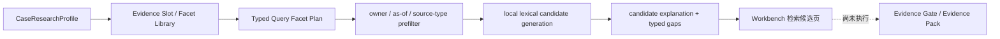

# FIN 0.1.3 S1-A 类型化本地检索纵切

日期：2026-08-12
状态：工程纵切已接入当前 Runtime；S1 产品验收仍未通过

## 1. 为什么先做这一刀

当前活动代码原本只有 EvidenceObject 和 BM25 建索引，没有产品运行时的查询入口。Workbench 的中文问题经过旧 tokenizer 后，DELL 案几乎只剩 `dell`、`ai` 两个 token。零改动尸检的自然结果因此混入下载说明、旧期风险、错误业务线和其他公司材料。

这证明第一阻断不在 DeepSeek、dense 或 reranker，而在它们之前：没有把“研究谁、谁在披露、什么关系、截至哪天、需要哪类证据”编译成候选合同。

## 2. 当前新增主链

活动实现：

- `configs/retrieval/fin_ia_0_1_3_s1_financial_research_kernel_v1_0.json`：通用金融内核、9 个 Evidence Slot、17 个独立 facet、行业 Pack 和 DELL/MU/NVDA Case Profile。
- `src/retrieval/contracts.py`：严格加载并校验 provider-neutral 合同。
- `src/retrieval/query_plan.py`：把案例和 facet 编译成 exact/lexical/semantic/graph 视图；当前只执行 local lexical lane。
- `src/retrieval/candidate_retriever.py`：在排名前执行 owner、source type、截至日和导航垃圾过滤；关联方材料保留“背景不等于分配/归因”边界。
- `scripts/data_retrieval/build_current_retrieval_snapshot.py`：从本机历史 SEC candidate store 生成不可变、可审计快照，并在候选生成结束后才连接 reviewed labels。
- Workbench `/workspace/cases/{case}/retrieval`：展示问题 facet、披露主体范围、前三候选、来源角色缺口和业务边界。

## 3. 本轮真实结果

三个案例都由同一核心代码生成 9 slot / 17 facet；没有 ticker 条件分支，没有模型、网络、dense 或 rerank 调用。主体、日期和 source type 的硬约束无违规。

但当前快照不是 S1 产品通过：

- DELL：76 个唯一候选；当前 reviewed target 对照只命中 4 个。AI 订单/积压、当期业绩和利润 mix 已能自然出现，但营运资本、关系归因、反方与供给的完整多片段组合仍不足。
- MU：80 个唯一候选；当前 reviewed target 对照命中 0 个。主要原因不是 MU 没有材料，而是最新 prepared remarks / supplemental objects 不在这份历史 candidate store 中；旧 SEC chunk 的 price/bit/HBM/合同桥接也不完整。
- NVDA：77 个唯一候选；命中 6 个。当期结果、利润和部分产品/供应风险可见，但客户集中、采购承诺、架构切换、出口限制和供给不能自动组成完整 pack。
- 三案的 PIT 市场行情角色都缺失，因此 `capital_allocation_and_valuation.point_in_time_valuation` 明确保留为 typed gap。

早期 R1 将“所有 lane 非空”误记为 ready，但业务复核发现 DELL 利润槽被税项/服务收入干扰、MU 估值槽被通用股价风险占据。该 R1 已作为本地不可变失败 capture 保留，随后用 facet 拆分、anchor 与标题权重修复；没有扩大字符上限或切到新版本。

## 4. 泛化和模型边界

- 通用内核定义 Slot/Facet 语义、时间和证据角色。
- 行业 Pack 只提供行业术语，不允许写标准答案 URL。
- Case Profile 只声明身份、别名、关系实体和案例术语。
- Provider-specific wire projection 不能进入核心合同。
- 模型以后只能提出 query atoms 或 residual-gap repair 建议；本地编译器仍负责身份、截至日、来源角色、禁止扩展和预算。

新案例应当通过新增配置迁移；如果必须修改核心检索代码，必须说明是通用能力缺口还是不当案例特判。

## 5. 下一步边界

S1-B 必须先补 current source/object：DELL 电话会/remarks、MU latest prepared remarks、NVDA 当前 10-Q 关键表与风险对象、TSMC 先进封装，以及 PIT 行情对象。随后以同一 17-facet 计划重建 candidate store，并比较 source-missing 与 eligible-but-not-ranked 两类缺口。

只有 candidate coverage 通过后才值得：

1. 构建父子 financial objects；
2. 重建 sparse/dense；
3. 在已存在候选上评估 reranker；
4. 生成新的 Evidence Pack；
5. 把真实 residual gap 交给外源补源。

当前不得宣称 dynamic retrieval、完整金融 RAG、current Evidence Pack、Agentic Research 或研报质量通过。
