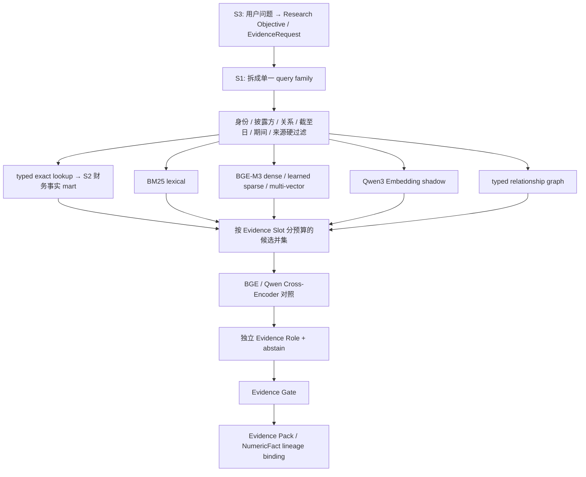

# FIN 0.1.3 S1-C 检索栈与数据库通道决策

日期：2026-08-12
状态：`Owner 已接受执行顺序 / S1 模型 shadow 完成 / S2 request Runtime 已接通 / DELL S1-S2-S3 纵切进行中 / 微调未授权`

## 1. 本次修正的结论

S1 不能只做“拆混合查询＋对象编译器”，然后继续沿用当前 BGE-M3 dense 与单一 reranker。查询、对象、数据库精确查询、lexical/dense/multi-vector 召回、Cross-Encoder、Evidence Role 和 Evidence Gate 必须作为一个分层检索栈共同定型。

这也不等于在进入产品纵切前选出一个永久模型。当前要冻结的是 provider-neutral 接口、比较方法、数据边界和停止条件；通过统一对照选出一个当前 provisional winner，并保留 shadow challenger。模型升级时替换 profile，不改金融事实与 Evidence 权威骨架。

## 2. 为什么不能直接换模型或微调

当前 18 条固定开发查询中，BM25 Recall@10 为 `17/18`，BGE-M3 dense 为 `14/18`，固定 RRF 为 `16/18`；BM25 top24 与 BGE top24 并集的 target-in-pool 为 `18/18`。现成 BGE reranker 仍为 `17/18`，虽然把 NVDA 现金流目标从第 12 提升到第 1，却把 DELL 直接需求风险目标从第 1 降到第 19。

因此当前主要矛盾不是“正确材料完全找不到”，而是：

- 同一个 query 混入结果、指引、反方、现金、监管等多种意图；
- claim、财务表、父级语境的模型可见表面不同；
- 排序相关性与“这段材料有资格证明什么”被混在一起；
- 固定查询含大量精确关键词，不能代表未来自然问题；
- 现有开发标签数量不足以支持微调。

模型选择必须在查询和对象合同修正后进行。BGE-M3 也尚未完整测试：当前只运行 dense，未运行其 learned sparse 和 multi-vector 模式。官方能力说明见 [BGE-M3 model card](https://huggingface.co/BAAI/bge-m3)。

## 3. 数据库不是后续附属项

### 3.1 当前活动基线的真实数据库状态

- `src/sec_agent/workbench/store.py` 的 SQLite 是可写 Operations state，不是金融研究事实库。
- 行情 catalog DuckDB 只负责行情快照；行业 DuckDB 只负责行业快照。
- 当前已有独立的 source-bound 公司财务事实 mart，private 路径由 `RuntimePathRegistry` 显式绑定；它不属于 Operations state，也不进入 Git 或 Runtime Resource Registry。
- request-scoped Research Runtime 已实际执行该 mart：一条 DELL 结果／现金请求拆出 6 个 typed fact sibling，6/6 resolved、0 gap、0 conflict。
- 当前三案 reviewed Pack 尚未复编译、前端和尚未建立的 S3 planner 也尚未消费这些 NumericFact，因此 reviewed Pack 的 structured numeric 仍为 0。

### 3.2 旧 SQL 路线说明了什么

归档中的旧路线最初 current exact SQL target 为 `0/18`；后续 successor 做到 latest-available annual `9/9`，但 current-quarter 仍为 `0/6 typed refresh gap`。这说明 SQL 思路不是无效，而是旧数据新鲜度、期间合同和当前对象绑定没有完成。旧结果只可用于设计回放，不能冒充当前能力。

### 3.3 新边界

| 请求类型 | 责任路线 | 权威边界 |
| --- | --- | --- |
| 精确指标、期间、单位、PIT | S1 编译 typed exact lookup，S2 的公司财务事实 mart 执行 | 只有 source-bound NumericFact 可成为最终数值权威 |
| 机制、需求、供给、风险、指引 | S1 文本与图检索 | 候选仍需 Role 与 Evidence Gate |
| 同时包含数字和叙事 | 拆成同一 cell 下的 fact request 与 evidence request | 最后按 request/cell/lineage 绑定，不做字符串超级拼装 |
| PDF/HTML 表格 | 可作为语境候选 | 未经 S2 规范化前不能因被 embedding 找到而成为数值权威 |

因此不是“SQL 还是 RAG”二选一。SQL 负责确定性事实，文本和图检索负责披露语境、因果机制、风险及关系证据。

## 4. 冻结的分层检索栈

排序模型只回答“当前单一问题下哪个候选更相关”；Evidence Role 回答“材料能证明结果、指引、需求、供给、风险、监管还是背景”；Evidence Gate 才拥有晋升权。任何 embedding、reranker 或 role 分数均不能授予数值或 Evidence 权威。

## 5. 有界模型对照

### 5.1 召回

- BM25：继续作为廉价稳定基线。
- BGE-M3：分别测试 dense、learned sparse、multi-vector，不把三种能力混成一个结果。
- `Qwen/Qwen3-Embedding-0.6B`：作为 instruction-aware、多语言 dense challenger；见 [官方 model card](https://huggingface.co/Qwen/Qwen3-Embedding-0.6B)。
- typed SQL/metadata 与 relationship graph：作为独立路线，不与 embedding 争夺事实权威。

### 5.2 重排

- `BAAI/bge-reranker-v2-m3`：复用当前不可变模型身份；见 [官方 model card](https://huggingface.co/BAAI/bge-reranker-v2-m3)。
- `Qwen/Qwen3-Reranker-0.6B`：必须按官方 instruction/scoring 方式运行；见 [官方 model card](https://huggingface.co/Qwen/Qwen3-Reranker-0.6B)。

所有路线使用相同对象、硬过滤、候选预算、query family、qrels 和候选池边界。模型不能因扩大 K、读取 gold identity 或看到人工 role label 获得不公平优势。

## 6. 数据切分与微调门

- DELL、MU、NVDA：开发集，用于查询、对象和路线设计。
- ORCL、ASML、ANET：结果已被观察，只能作为已观察 validation，不能再称为纯净 final test。
- digest-bound `test_precut` 已在新模型结果出现前预注册：HPQ／AVGO／INTC，research-as-of=`2026-07-31`，payload digest=`d205b3d8...be37`。来源尚未抓取、标签尚未创建、模型结果尚未观察；后续不得用其调 query、阈值、路线或配额。
- 旧 575 条 model-assisted labels 只能作为迁移和人工复核候选，不能直接成为训练真值。

当前禁止微调。至少 `200` 个源绑定复核关系、`6` 个开发案例和独立留出，只允许重新召开训练决策；真正进行 effect-seeking 训练还应优先达到：角色层约 `500` 条／`10` 家 issuer，reranker 至少 `1,000` 个正例与困难负例组合，embedding 至少 `3,000` 个 query-positive-hard-negative triplet。数量只是治理下限，不能替代标签质量和留出独立性。

## 7. 更新后的执行顺序

1. 冻结本检索栈、数据库通道、业务错误分类和新 test manifest。（已完成）
2. 拆 query family，编译 source-bound claim、metric-table、context。（已完成；实现时由 7 类校正为 11 类）
3. 同语料比较 BM25、BGE-M3 三模式与 Qwen Embedding。（已完成 shadow）
4. 在同一候选并集比较 BGE 与 Qwen Reranker。（已完成 shadow；均未晋升）
5. 建立独立 Evidence Role＋abstain 层。（合同和基线完成，当前实现不通过产品门）
6. 根据稳定残差决定是否值得准备微调数据；默认不微调。（已决定：数据不足，不微调）
7. 选 provisional winner＋shadow challenger。（Qwen Embedding provisional；BM25 必须保留为 lexical 联合候选，Qwen Reranker 仅 shadow）
8. 运行 DELL S1/S2/S3 纵切：S3 产生真实 EvidenceRequest，S1 使用 Qwen＋BM25 候选并集，S2 返回 NumericFact，S3 消费并暴露产品级残差。（S2 request Runtime 已接通；S1 联合产品路线和 S3 planner 仍在实现）

纵切后再决定 S1 product gate；不能用离线 Recall 或 MRR 单独关闭 S1。

## 8. 当前不声称

本决策后续已经完成本地模型 shadow、公司财务 fact mart 和 request-scoped S2 Runtime 接入，但仍没有微调、重编译 Evidence Pack、S3 自然规划、前端 NumericFact 消费或 S1/S2/S3 产品通过。任何“模型已对照”或“数据库 6/6”都只是纵切输入条件，不能替代 Evidence Pack usefulness 与研报内容验收。机器可读治理合同仍为 `configs/retrieval/fin_ia_0_1_3_s1c_retrieval_stack_governance_v1_0.json`，留出合同为 `configs/retrieval/fin_ia_0_1_3_s1c_retrieval_stack_test_precut_manifest_v1_0.json`。

## 9. S1-C1 实现后校正

原七类查询遗漏了四个真实研究问题：定价／价值获取、关系归因、资本配置和估值。尤其“客户需求”和“直接关系归因”不能合并：行业需求或客户资本开支只能作为 read-through，不能证明客户确实向研究主体下单。当前 17 个 facet 已且仅映射到 11 个 query family。

当前 1,805 条 source-bound child 的零模型编译结果为：原始对象 22,703 个，按父文档和对象内容去掉 2,433 个重叠切块重复后为 20,270 个；包括 claim 11,663、metric-row 7,437、bounded parent context 1,170。编译器拒绝了 257 张非金融数值表；例如“高管姓名／年龄／职位”不再因为职位包含 `Sales` 而被当成销售指标。另有 51 张金融外观表没有可安全绑定的指标行、65 个 claim surface 在同一 child 内不唯一，均保留为诊断而没有静默猜测。

这 20,270 个对象仍是候选，不是 Evidence。表格行即使完整携带表头、期间、单位和父章节，也没有 NumericFact 权限。当前 Runtime 会把 `revenue`、`free cash flow`、`market price` 等 24 个标准指标或受控别名编译成 typed fact request。公司财务事实 mart 可用时，`company_financial_fact_mart` 路线返回 NumericFact／typed gap／typed conflict；不可用时仍返回 `typed_fact_store_unavailable / owning_stage=S2`，而叙事检索可继续。用户自然语言到标准指标 ID 的规范化属于 S3 planner；S2 不用词形猜测扩大事实权限。

## 10. 纵切前的实际路线修订

真实 DELL results／cash 请求暴露出两点离线总分看不见的事实：Qwen 更容易把当前结果表和现金流事实召回到前列；BM25 则能找到自由现金流定义、AI 服务器收入和毛利变化解释。两者分别擅长语义近邻和精确业务措辞，因此当前产品方向不是“Qwen 替换 BM25”，而是同一硬过滤后的候选并集，再由后续 Evidence Gate 和研究 Agent 选择。数据库继续作为独立 exact-fact lane，不参与文本排名，也不被联合召回替代。

同时，8-K 的申报／发布日期不能冒充 issuer reporting period。当前候选投影优先读取 source-bound `reported_fiscal_year` 与 `reported_period_end`，并保留原始 fiscal year/date 和选择来源；这关闭了 DELL FY2027 Q1 候选被 FY2026 filing year 误过滤的根因。该修复只校正时间身份，不增加 Evidence 或 NumericFact 权限。
