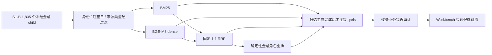

# FIN 0.1.3 S1-C 同对象排名对照

日期：2026-08-12
状态：`engineering_comparison_complete / owner_qrel_review_pending / S1_product_gate_open`

## 1. 本阶段回答的问题

S1-C 不再问“有没有更多网页”，而是问：在完全相同的 `1,805` 个当前金融 child、相同身份／期间／来源过滤和相同 relevance labels 上，BM25、BGE-M3、固定 1:1 RRF 与确定性金融规则重排，谁能把真正回答研究问题的材料送入前十。

四路候选都标为 `candidate_not_evidence`。标签只在候选生成后用于评测，目标 ID、标准答案 URL 和命中状态不会进入查询、排序或 Workbench 投影。

## 2. 活动实现

- `src/retrieval/ranking_comparison.py`：同对象资格过滤、BM25、dense 点积、固定 RRF、确定性金融规则重排、业务错因和安全投影。
- `scripts/data_retrieval/materialize_s1c_requalified_qrels.py`：把 18 条 Owner-accepted relevance qrels 通过 source lineage 重新绑定到当前 child；不修改历史标签。
- `scripts/data_retrieval/run_s1c_ranking_comparison.py`：使用本地 BGE-M3、私有 embedding cache 和冻结策略生成四路对照；不调用模型、不访问网络。
- `apps/workbench/backend/application/research_retrieval_service.py` 与 `ResearchWorkspace.tsx`：只消费剥离 gold identity 的排名投影。

完整业务判断见 `configs/retrieval/fin_ia_0_1_3_s1c_ranking_business_assessment_v1_0.json`。

## 3. 同对象结果

| 路线 | 17 个已映射目标 Recall@10 | 全 18 qrel Recall@10 | 已映射 MRR | 决策 |
| --- | ---: | ---: | ---: | --- |
| Sparse BM25 | `14/17 = 0.823529` | `14/18 = 0.777778` | `0.508964` | 保留当前默认候选路线 |
| Dense BGE-M3 | `12/17 = 0.705882` | `12/18 = 0.666667` | `0.490196` | shadow only |
| Fusion RRF 1:1 | `13/17 = 0.764706` | `13/18 = 0.722222` | `0.549673` | MRR 较高，但召回下降，不晋升 |
| 确定性金融规则重排 | `13/17 = 0.764706` | `13/18 = 0.722222` | `0.449755` | shadow only；不是 neural cross-encoder |

本地 BGE-M3 已在 GPU 上真实运行，向量维度为 `1,024`。本地没有完成资格判断的 neural cross-encoder，因此本阶段没有把规则重排冒充 reranker 模型，也没有为跑一次指标临时联网下载新模型。

## 4. 真实业务错误，而不只是指标

1. NVDA 供给问题：dense 把 Deferred Revenue 小节里的保修、赔偿和诉讼片段排到前列；这些段落语义上接近“未来义务／风险”，却没有产能、良率、爬坡或供应约束。
2. MU 客户需求问题：dense 把 Dell 资本回报与泛化指引排到需求证据前；“投资／增长”共现不等于客户部署或下单。
3. DELL 客户需求问题：dense 会召回 Microsoft 的云产品定义和安全风险文字；云、AI 共现不等于实际 capex、部署节奏或采购需求。
4. MU 财务桥接问题：fusion 把中国市场供给过剩风险排进库存／营运资金／现金机制问题；它可作反方背景，不能替代当期财务桥接。
5. NVDA 当期结果问题：BM25 会把采购承诺风险因素排在已经发生的当期结果前；词面正确但证据角色错误。

因此 BGE-M3 不是“没能力”，而是当前 dense 表征没有充分编码金融证据角色和经济机制。它可作候选扩展，但不能独立成为默认检索路线。BM25 也未通过 Evidence 门，只是在当前标签和对象下相对最好。

## 5. 评测标签本身暴露的问题

S1-C 首轮发现旧 source-tier allowlist 不认识当前 `primary_global_public_disclosure`，导致三条 TSM 6-K qrel 在排序前就没有合格候选。该问题已通过通用官方来源 tier 等价规则修复；修复后三条 TSM 目标均可进入前十。这是合同分类漂移，不是模型失败。

另外有四条 qrel 需要 Owner 复核：

- `s1c_qrel_05`、`s1c_qrel_11` 当前共同目标以 NVIDIA 联系人和安全港为主体；全文虽提到供需，但切块精度太低。当前 10-Q 已有直接披露产能采购、预付产能协议、生产爬坡和供需错配的更好 child。
- `s1c_qrel_15` 的 8-K 当期结果仍有效，但当前 10-Q 财务报表和 MD&A 是同问题的更精确替代答案；单一目标会把更好的当前对象误判成失败。
- `s1c_qrel_16` 的旧 metric-table ID 不在当前 store；当前按 typed target gap 保留，并提出 10-Q 财务报表 successor，待 Owner 确认。

实现者没有擅自改标签。Owner 决策前，历史 qrels、17 mapped / 1 typed gap 和本轮指标都保持不变。

## 6. 阶段结论和下一门

S1-C 的“同对象工程比较”完成，但不等于排名产品通过，更不等于 S1 通过。当前默认继续使用 BM25，dense、fusion 和规则重排只在 Workbench 只读展示，不获得 Evidence 晋升权。

下一门是：Owner 只复核上述四条 qrel；若接受 successor，利用已有 embedding cache 重新物化同对象对照。之后进入 S1-D，以真实 residual gaps 定向处理 Dell／Micron 官方 PDF transport、TSM 先进封装和新鲜估值来源，而不是继续为当前 aggregate 指标调权重。

S2 NumericFact、S3 动态 Agentic Research、完整报告内容质量、S4 review/repair 和 S5 release 均未由本阶段证明。

## 7. 工程复证

- active baseline：72 个 Python、7 个 frontend、5 个 digest-bound Runtime resources，历史／archive 活动引用为 0。
- Python：65 tests passed。
- TypeScript 与 Vite production build 通过。
- Playwright：真实数据挂载与无数据两种模式，桌面／移动各 6/6 通过；排名对照面无横向溢出。
- Secret scan：6,265 files，0 findings。
- 本地 BGE-M3 复跑生成 ranking result digest `db7fbea1...235d9`；安全投影从结果合同读取 `1,805` 个对象数，不在前端硬编码，并同步更新 Runtime Registry 摘要。
