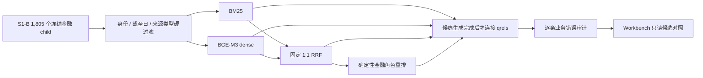

# FIN 0.1.3 S1-C 同对象排名对照

日期：2026-08-12
状态：`successor_recomparison_and_neural_shadow_complete / no_route_promoted / S1_product_gate_open`

## 1. 本阶段回答的问题

S1-C 不再问“有没有更多网页”，而是问：在完全相同的 `1,805` 个当前金融 child、相同身份／期间／来源过滤和相同 relevance labels 上，BM25、BGE-M3、固定 1:1 RRF 与确定性金融规则重排，谁能把真正回答研究问题的材料送入前十。

四路候选都标为 `candidate_not_evidence`。标签只在候选生成后用于评测，目标 ID、标准答案 URL 和命中状态不会进入查询、排序或 Workbench 投影。

## 2. 活动实现

- `src/retrieval/ranking_comparison.py`：同对象资格过滤、BM25、dense 点积、固定 RRF、确定性金融规则重排、业务错因和安全投影。
- `scripts/data_retrieval/materialize_s1c_requalified_qrels.py`：把 18 条 Owner-accepted relevance qrels 通过 source lineage 重新绑定到当前 child；不修改历史标签。
- `scripts/data_retrieval/run_s1c_ranking_comparison.py`：使用本地 BGE-M3、私有 embedding cache 和冻结策略生成四路对照；不调用模型、不访问网络。
- `apps/workbench/backend/application/research_retrieval_service.py` 与 `ResearchWorkspace.tsx`：只消费剥离 gold identity 的排名投影。

完整业务判断见 `configs/retrieval/fin_ia_0_1_3_s1c_ranking_business_assessment_v1_0.json`。

## 3. 同对象结果

| 路线 | 17 个已映射目标 Recall@10 | 全 18 qrel Recall@10 | 已映射 MRR | 决策 |
| --- | ---: | ---: | ---: | --- |
| Sparse BM25 | `14/17 = 0.823529` | `14/18 = 0.777778` | `0.508964` | 保留当前默认候选路线 |
| Dense BGE-M3 | `12/17 = 0.705882` | `12/18 = 0.666667` | `0.490196` | shadow only |
| Fusion RRF 1:1 | `13/17 = 0.764706` | `13/18 = 0.722222` | `0.549673` | MRR 较高，但召回下降，不晋升 |
| 确定性金融规则重排 | `13/17 = 0.764706` | `13/18 = 0.722222` | `0.449755` | shadow only；不是 neural cross-encoder |

本地 BGE-M3 已在 GPU 上真实运行，向量维度为 `1,024`。本地没有完成资格判断的 neural cross-encoder，因此本阶段没有把规则重排冒充 reranker 模型，也没有为跑一次指标临时联网下载新模型。

## 4. 真实业务错误，而不只是指标

1. NVDA 供给问题：dense 把 Deferred Revenue 小节里的保修、赔偿和诉讼片段排到前列；这些段落语义上接近“未来义务／风险”，却没有产能、良率、爬坡或供应约束。
2. MU 客户需求问题：dense 把 Dell 资本回报与泛化指引排到需求证据前；“投资／增长”共现不等于客户部署或下单。
3. DELL 客户需求问题：dense 会召回 Microsoft 的云产品定义和安全风险文字；云、AI 共现不等于实际 capex、部署节奏或采购需求。
4. MU 财务桥接问题：fusion 把中国市场供给过剩风险排进库存／营运资金／现金机制问题；它可作反方背景，不能替代当期财务桥接。
5. NVDA 当期结果问题：BM25 会把采购承诺风险因素排在已经发生的当期结果前；词面正确但证据角色错误。

因此 BGE-M3 不是“没能力”，而是当前 dense 表征没有充分编码金融证据角色和经济机制。它可作候选扩展，但不能独立成为默认检索路线。BM25 也未通过 Evidence 门，只是在当前标签和对象下相对最好。

## 5. 评测标签本身暴露的问题

S1-C 首轮发现旧 source-tier allowlist 不认识当前 `primary_global_public_disclosure`，导致三条 TSM 6-K qrel 在排序前就没有合格候选。该问题已通过通用官方来源 tier 等价规则修复；修复后三条 TSM 目标均可进入前十。这是合同分类漂移，不是模型失败。

另外有四条 qrel 需要 Owner 复核：

- `s1c_qrel_05`、`s1c_qrel_11` 当前共同目标以 NVIDIA 联系人和安全港为主体；全文虽提到供需，但切块精度太低。当前 10-Q 已有直接披露产能采购、预付产能协议、生产爬坡和供需错配的更好 child。
- `s1c_qrel_15` 的 8-K 当期结果仍有效，但当前 10-Q 财务报表和 MD&A 是同问题的更精确替代答案；单一目标会把更好的当前对象误判成失败。
- `s1c_qrel_16` 的旧 metric-table ID 不在当前 store；当前按 typed target gap 保留，并提出 10-Q 财务报表 successor，待 Owner 确认。

实现者没有擅自改标签。Owner 决策前，历史 qrels、17 mapped / 1 typed gap 和本轮指标都保持不变。

## 6. 首轮阶段结论（已被第 8–11 节 successor 更新）

S1-C 的“同对象工程比较”完成，但不等于排名产品通过，更不等于 S1 通过。当前默认继续使用 BM25，dense、fusion 和规则重排只在 Workbench 只读展示，不获得 Evidence 晋升权。

首轮下一门曾是 Owner 复核上述四条 qrel；该项现已完成。当前有效下一门以第 11 节为准，不再直接跳入 S1-D。

S2 NumericFact、S3 动态 Agentic Research、完整报告内容质量、S4 review/repair 和 S5 release 均未由本阶段证明。

## 8. Owner successor 与请求级入口

Owner 决策已通过 evaluation-only successor 应用：`05/11` 使用当前 NVDA 10-Q 供给风险 child，`15` 保留原 8-K 并增加当前 10-Q，`16` 使用当前资产负债／现金流表 child。历史 qrel 不改写，successor 另存并绑定 base digest。缓存复跑结果如下：

| 路线 | 18 qrel Recall@10 | MRR |
| --- | ---: | ---: |
| BM25 | `17/18` | `0.559392` |
| BGE-M3 | `14/18` | `0.490741` |
| RRF 1:1 | `16/18` | `0.580817` |
| 旧确定性重排 | `16/18` | `0.567626` |

当前 Runtime 同时新增 `EvidenceRequest → requested facets → QueryFacetPlan → immutable snapshot candidates/gaps`。它只消费类型化请求；用户自然语言到 Research Objective／EvidenceRequest 仍由 S3 负责，真实输入与澄清 UI 仍由 S4 负责。

## 9. 现成 Cross-Encoder shadow

本地 `BAAI/bge-reranker-v2-m3`（Apache-2.0，model.safetensors SHA256=`d9e3e081...b5286`）在 BM25 top24 与 BGE-M3 top24 并集上离线重排，631 个冻结 pair 用 RTX 4060 Laptop GPU 耗时 `25.141s`，峰值显存约 `2.28 GB`。网络、生成模型和训练调用均为 0。

Cross-Encoder 的三案 Recall@10=`17/18`，与 BM25 相同，MRR 从 `0.559392` 提升到 `0.608480`。它有两种相反表现：

- 正例：NVDA 财务桥接问题中，BM25 把需求／采购承诺风险排在前面，经营现金流目标仅第 12；Cross-Encoder 把现金流表升到第 1。
- 负例：DELL 风险／财务综合问题中，BM25 把直接 AI 需求集中风险排第 1；Cross-Encoder 因宽泛问题同时包含结果、库存与收入确认，把公司概览／市场风险排前，正确风险段落落到第 19。
- 负例：MU 财务桥接中，Cross-Encoder 将 exhibit index 排第 1，正确流动性正文第 2，说明截断、文档类型和表面词匹配仍会干扰。

因此它是“有增量的候选重排器”，不是已合格默认路线，更不是 Evidence evaluator。

## 10. Evidence Role shadow 与评测合同纠错

规则版多标签角色支持 observed result、guidance、direct demand、risk/counterevidence、supply/capacity、financial statement、regulatory、relationship、valuation、generic，并允许 `abstain`。三案中它把 Cross-Encoder top3 的显式不兼容项从 `27` 降至 `3`，但 Recall@10 从 `17/18` 降为 `13/18`。

第一版留出评测把“reviewed pack 未绑定当前 slot”机械标成 hard negative。这在业务上不成立：例如 ORCL 客户预付款现金流可同时支持 cash conversion 和 relationship attribution。该 R1 结果保留为评测合同失败，不用于模型结论。R2 只使用逐条明确的同案例角色对照，其余材料标记 unjudged：

| 留出结果（ORCL/ASML/ANET，17 问题） | Cross-Encoder | Cross-Encoder + 规则角色门 |
| --- | ---: | ---: |
| 正例胜明确 hard negative pairwise | `0.790698` | 不适用（角色门不是连续分数） |
| top1 含正确材料 | `0.823529` | `0.764706` |
| top3 含正确材料 | `1.0` | `1.0` |

角色规则在留出正例上 compatibility=`0.232558`、abstain=`0.697674`。典型错例是 ASML 的“customer commitments”明明是需求质量证据，却因词表没有 commitments 被判 incompatible；ORCL 经营利润表明明是 value capture，却因 metric 表语义未被结构化读取而 abstain。当前角色规则不得上线或充当 hard gate。

## 11. 当前决策

- BM25 继续作廉价候选主干；BGE-M3 继续候选扩展；Cross-Encoder 保留 shadow candidate，尚不晋升当前 Runtime。
- 不立即微调 embedding 或 reranker。18 条主 qrel 不足以训练，当前残差同时含宽 query、chunk/exhibit index 和 role label 问题。
- 下一门仍留在 S1-C：建立对象级 Evidence Role 数据合同，显式区分 claim／metric-table／parent context、多标签与 unjudged，并让 Owner 复核扩展标签。只有稳定残差仍存在，才决定微调 Cross-Encoder 或独立角色分类器。
- 第 7／8 项未执行：尚未启动微调，也尚未让 residual gap 驱动 S1-D 补源或 Evidence Pack 重编译。

## 12. 对象级角色合同与固定模型复核 successor

当前 successor 新增三份彼此隔离的对象：

1. `EvidenceObjectView`：只含源绑定的 claim、balanced metric table、parent context、mixed segment 或 navigation surface，以及 source／parent digest；不含任何人工标签。
2. `EvidenceObjectAnnotation`：只含对象的多标签 role、fact state 与原因；不复制 source surface。
3. `EvidenceQueryRelation`：只含 query 相对该对象的 directness、background 和 positive／hard negative／unjudged；不把 Cross-Encoder 分数变成 Evidence 权限。

DELL／MU／NVDA 开发批次为 24 object／35 relation，ORCL／ASML／ANET 未读取、未改标、未调参。三个 parent context 全部只能是 `unjudged/context_only`。当前三案 reviewed Pack 的 45 个条目仍以完整 source segment 绑定人工业务说明；这些条目可继续作为既有 reviewed Evidence 使用，但不能把人工说明当成模型可见 claim，也不能作为角色训练样本，需由后续确定性对象编译器补出 claim/table/context 或 typed gap。

固定模型在精确 surface 上只得到 pairwise=`6/12=0.50`、可比较 query top1=`6/10=0.60`、top3=`10/10`。这表明它仍有候选扩展价值，但对象变小没有自动带来角色判断：

- MU supply：旧季度业务单元结果表以 `0.008` 的微小分差压过 HBM4 高量出货 claim；模型对两者都给极低分，未稳定区分“结果”与“供给执行”。
- MU financial reconciliation：泛化国际经营风险长段压过绑定采购量和客户存款 claim，因为旧 query 同时塞入监管、风险、库存、承诺和营运资金。
- NVDA results：泛化风险提示开场压过收入 claim、利润表和 MD&A 汇总表，因为旧 query 仍要求“counterevidence”。
- NVDA cash reconciliation：供给风险 claim 压过现金流表，暴露 legacy mixed slot 与表格语义投影双重问题。

旧规则角色层在新批次上 positive compatibility=`0.705882`、hard-negative suppression=`0.416667`、multi-label micro-F1=`0.507936`。它仍漏掉表格的 observed/financial role，也无法稳定区分 customer commitments、guidance 和 supply execution，因此继续禁止作为 gate。

当前处置不是微调，也不是立刻训练独立分类器。先拆 query family，并把 metric table 投影成表头／期间／单位／row／父章节；随后用相同固定模型复跑。若在至少 200 个关系、6 个开发案例上仍存在稳定角色残差，才评估独立多标签角色分类器。TSMC 三条 qrel 的当前 target 只含领先制程需求和 2nm ramp，不含 CoWoS／先进封装容量、良率或分配；它们在角色合同中为 `unjudged`，并作为 S1-D 定向补源候选，不追改历史 ranking relevance label。

## 13. 工程复证（含对象级 successor）

- active baseline：79 个 Python、7 个 frontend、6 个 digest-bound Runtime resources，历史／archive 活动引用为 0。
- Python：对象合同定向 18 tests、全仓 91 tests 均通过，retrieval 源码和脚本通过 `compileall`。
- TypeScript、Vite 与 Playwright 产品面在上一项请求／shadow 收口时已通过；本轮没有修改前端或产品 Runtime，因此没有伪造重复执行记录。
- Secret scan：6,298 files，0 findings。
- 本地 BGE-M3 历史 ranking result digest 为 `db7fbea1...235d9`；对象级 fixed-model result digest 为 `4b6ff6e...27c3e`。两项都只属于 shadow，不进入 Runtime Registry。
