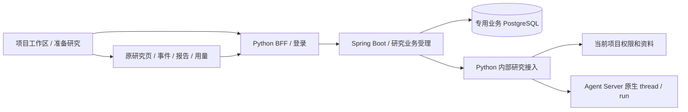

# Java 项目研究接入：第一阶段 A

2026-09-23。对应[产品范围](../product/java_research_intake.zh-CN.md)及[跨语言合同](../architecture/java_research_service_contract.zh-CN.md)。这是可选开发功能；默认部署未启用，不自动迁移历史研究。

## 已交付链路



Java 保存业务任务、输入摘要、固定请求、两个操作凭证及核对结果。Python 继续使用原有 `NewSession`、草稿准备、资料复制、项目授权和原生启动函数。内部 envelope 不放宽公开 `NewSession` 字段；保留文档 wire ID（包括 `UPLOAD::…`）。本批不增加检索端点，不搬 SQL/Redis 访问代码。

`/workspace` 默认进入 `/workspace/projects`，沿用现有紫蓝工作区样式。项目列表提供名称/说明搜索、名称/最近添加排序、创建、修改说明、归档与恢复；项目内部统一概览、研究、资料、成果和项目管理。日常页面隐藏 ID，URL 和内部身份保留不变。同名项目可通过说明区分，切换仍按真实 ID 定位。原 `/workspace/session`、报告与资料链接继续兼容。

Java 准备/启动表单嵌入项目内研究入口：保存问题、执行方式和最多 12 份项目资料，再确认启动。原研究页负责事件、报告和真实费用，并带回原项目的导航；“启动已确认”仅表示运行受理。业务任务按 50 条分页，已关联原生记录按 `business_task_id` 去重。原生列表沿用现有接口最近 50 条窗口；本批不宣称完整历史分页已交付。

`/workspace/assets?view=files` 为全局资料库，按项目、名称和类型筛选；打开原版本与返回时保留 URL 中筛选条件和页码。项目内资料复用同一目录与原阅读/编辑组件，上传和撤销复用已有项目资料管理。配置未启用 Java 时，项目/资料管理可用，新研究进入已有资料选择路径；显式访问业务准备页显示未启用。

项目索引新增可选 `description` 和 `archived`，保存仍使用原 revision 乐观并发控制。旧客户端只提交 id/name 时保留新字段。归档是整理状态，不改变授权或停止已有运行。资料库新增 `GET /api/v1/asset-workspace/catalog`，按当前 owner 的实际项目聚合版本族，保留原 AssetRef；合同与规模边界见[资产协议](../architecture/asset_workspace_protocol.zh-CN.md)。

## 存储与失败语义

`research_task` 唯一键为 `(owner_id, submission_key)`；相同键必须具有相同原始请求字节摘要。`research_command` 按 task + prepare/start 分行，永久保存操作 UUID 和原始 JSON 字符串。新任务和两个操作在一个 PostgreSQL 短事务内创建，网络调用不持有数据库事务。

| 状态 | 含义 | 后续行为 |
| --- | --- | --- |
| ready | 尚未占用派发权 | 用户可以完成草稿准备或明确启动 |
| dispatching | 已原子占用，外部结果未落库 | 前端按待核对显示；其他进程不再派发 |
| unknown | 超时、5xx、响应不匹配或未知回执 | 只读取原提交和确定的原生关联 |
| received | 已验证对应 task/project/thread，启动还须有 run UUID | 可打开原研究 |
| rejected | 确定的 4xx 拒绝 | 留存原因，不重置或自动重交 |

Python 409 回执若标明 `submission_status=unknown`，Java 保持未知。资料复制中断时原草稿可存在，但 `business_prepared=false`，不会当作准备成功。Java 持久化后、尚未占用派发就退出的记录保留 ready，可以完成原操作。已占用但没有执行证明的请求保持未知，不能通过超时重发来追求可用性。

浏览器在发送前将创建请求和凭证存入按 owner/project 隔离的 sessionStorage，刷新后继续同一提交。Java 两个下游操作 ID 与浏览器重试次数无关。GET、刷新和核对不会启动研究。核对只读取既有回执，或用确定 thread UUID 和准确 operation tag 找回 run，不选择“最新 run”。这是有限条件下的一次派发控制，不宣称分布式 exactly-once。

## 接口与权限

| 入口 | 作用 |
| --- | --- |
| BFF `/api/v1/business/config` | 功能开关状态 |
| BFF `/api/v1/business/tasks…` → Java `/v1/tasks…` | 有界专用代理 |
| GET Java `/v1/tasks?project_id=…&offset=…` | 当前身份与项目的分页任务，每页 50 条 |
| POST Java `/v1/tasks` | 带 UUID Idempotency-Key 的创建与准备 |
| GET Java `/v1/tasks/{id}` | 任务及两个操作状态 |
| POST Java `/v1/tasks/{id}/prepare` | 仅 ready 操作可派发 |
| POST Java `/v1/tasks/{id}/start` | 草稿确认准备完成后明确启动 |
| POST Java `/v1/tasks/{id}/reconcile` | 只读核对下游，更新业务投影 |
| Python `/api/v1/internal-research/projects/{id}`、`…/binding` | 当前项目授权与已发布库身份 |
| Python `/api/v1/internal-research/prepare`、`…/start` | 内部 envelope 进入原有函数 |
| Python `/api/v1/internal-research/receipts/{operation_id}`、`…/tasks/{task_id}/state` | 回执与原生关联核对 |

两方向 JWT 使用不同 issuer/audience，60 秒过期，绑定 owner、方法、完整路径和查询参数、正文 SHA-256、操作凭证。仅内部研究路由接受 Java audience，公开 Python 路由不接受此委托替代登录。BFF 验证浏览器身份、写入标识及 Origin；Java 校验业务 owner，再向 Python 查询当前项目权限；Python 在回放写入回执**之前**重查当前项目权限。

本批沿用个人项目规则。没有第二份 Java ACL，也没有宣称机构角色、成员共享或多租户已验收。现有资料撤销在 Python 准备和运行前检查中生效。生产身份应使用现有 OIDC product 模式；`local` 是单人身份，不能支持多人登录。Java 默认仅监听 loopback；HTTP 客户端禁用自动重试和重定向；内部正文限制 64 KiB。

## 版本绑定的实际范围

创建时冻结 BFF 可验证的公开研究库 manifest SHA、研究配置的截止时点、所选项目资料 ID 和执行选项。原生 thread 使用业务 task UUID，保存业务关联；start run 保存 `business_operation_id`。重试不重新求 latest。开始及后续原研究写操作检查可用库版本，不一致时拒绝继续；取消原运行仍可执行，防止版本变化阻碍用户停止付费工作。

这是接入版本校验，尚未实现跨库 snapshot catalog、财务库/向量库统一版本锁、运行中资料热切换，或运行服务与 BFF 的自动 SHA 证明。启用时须按现有部署资格检查确认两者使用同一已发布库与研究配置，在活动研究期间保持发布版本不变。旧报告仍可阅读。完整数据版本与历史 as-of 服务能力后续单独交付。

SSE、检查点、报告、用量仍走原研究页，本批没有 Java SSE 转发或第二个报告账本。Python 提交回执仍是单 BFF 主机存储；Java 使用 PostgreSQL 不会使 Python 自动支持多主机主动写入。

## 部署与停用

1. 准备 Java 21 与专用业务 PostgreSQL 数据库。账号仅访问此数据库，不能指向 Agent Server 生产库。Flyway 首次启动创建两个业务表及迁移历史。本批不自动创建或删除数据库。
2. 在 Git 外提供 Java 的 `FINSIGHT_BUSINESS_JDBC_URL`、`FINSIGHT_BUSINESS_DB_USER`、`FINSIGHT_BUSINESS_DB_PASSWORD`。
3. BFF 与 Java 配置相同且至少 32 字节的 `FINSIGHT_BUSINESS_SHARED_SECRET`。BFF 配置 `FINSIGHT_BUSINESS_API_URL=http://127.0.0.1:8095`；Java 配置 `FINSIGHT_PYTHON_INTAKE_URL=http://127.0.0.1:8765`。端口按实际 BFF 修改，不是原生 Agent Server 地址。Java 端口可用 `FINSIGHT_BUSINESS_PORT` 覆盖。
4. BFF 沿用研究配置、`research_library` / `FINSIGHT_RESEARCH_LIBRARY_PATH`、项目资料和状态目录，并启用新研究。首版仅支持同机 loopback；远程 HTTPS/mTLS 后续设计。
5. 在 `apps/business-service` 执行 `./mvnw verify`（Windows `./mvnw.cmd verify`），再 `java -jar target/business-service-0.1.0.jar`。Wrapper 带发行版校验值；测试需要 Docker。
6. 按原步骤构建前端，协调重启 BFF，再打开 `/workspace/projects`。准备草稿无模型调用，确认启动才进入原执行链和角色预算。

未配置时显示未启用，旧研究入口继续工作。停用时移除 BFF 的 `FINSIGHT_BUSINESS_API_URL` 并协调重启，保留数据库和回执。已有 Java 草稿的初次启动必须经业务入口，不能绕过旧入口生成另一条初次运行。

备份需覆盖业务 PostgreSQL、Python 项目/附件/回执、Agent Server 状态及审计。沿用[服务恢复约束](service_recovery.zh-CN.md)，恢复后先只读核对。禁止清空回执、将未知改回 ready、猜测 run 或自动补发付费请求。本轮未验收多机故障转移或跨存储时间点恢复。

## 复现与资格结果

```bash
# repository root, existing locked qualification environment
python -m pytest -q tests/test_java_research_intake.py tests/test_submission_receipts.py tests/test_submission_receipts_processes.py tests/test_conversation_authentication.py tests/test_project_library.py tests/test_report_session.py

cd apps/business-service
./mvnw verify

# return to repository root
cd ../..
export FINSIGHT_INTAKE_TEST_JAR="$PWD/apps/business-service/target/business-service-0.1.0.jar"
python -m pytest -q tests/integration/test_java_intake_stack.py

cd apps/workbench/frontend
npm run typecheck
npm run build
npm run test:public -- project-research.spec.ts workspace-navigation.spec.ts
```

Windows 可用 `$env:FINSIGHT_INTAKE_TEST_JAR = (Resolve-Path apps/business-service/target/business-service-0.1.0.jar)`。跨进程测试从 PATH 寻找 java/docker，也可用 `FINSIGHT_TEST_JAVA` / `FINSIGHT_TEST_DOCKER` 指定。临时状态和日志保留在 pytest 临时目录；只删除自己创建并核实资格标签的容器，不修改已有服务。未设置 JAR 时普通 Python 套件明确跳过该单项。

2026-09-23 本地验收：65 项 Python 定向回归、7 项真实 Spring/HTTP/PostgreSQL 测试、1 项双进程重启链路、7 项浏览器交互通过，TypeScript 与生产构建通过。Java 测试包括 20 次并发创建 → 1 个草稿、20 次并发启动 → 1 次派发，丢失响应后按原操作找回、排除较新无关 run、无证明保持未知、不同 owner、错项目与当前权限撤销，以及 Python 409 未知回执不被误判为拒绝。跨进程测试实际重启 Java 与 BFF，再恢复相同 task/thread/run 和项目归属。

上述 Java 验收发生于原受理切片。后续项目工作区整合继续验证同名项目按内部 ID 切换、未知提交刷新保留、失效项目无回退、功能关闭以及 1440/390 像素界面；原导航另测 1440/1024/390。Java 集成测试把 Python 执行服务替换为脚本；跨语言测试使用真实 BFF/Spring/PostgreSQL/SQLite，仅原生 SDK 是可持久化假执行器。均无真实模型请求，不证明金融研究质量、生产吞吐、机构权限或完整原生 SSE 恢复。

整合复现增加 `python -m pytest -q tests/test_project_workspace.py` 和前端 `npm run test:public`。真实 BFF 浏览器使用 `playwright.project.config.ts`：先构建前端，设置全新 `FINSIGHT_LOCAL_STATE_ROOT`、可选 `FINSIGHT_E2E_PYTHON`，设置 `FINSIGHT_E2E_DIRECT_BFF=1` 可直接在隔离 BFF 上读取构建产物，避免占用既有 Vite 服务。该配置明确指向本工作区 Python 源码；执行 `npx playwright test --config playwright.project.config.ts project-library.spec.ts` 验证真实 SQLite 上传、项目筛选、版本回读、撤销和新浏览器恢复，原生运行被测试夹具禁用。

2026-09-23 项目工作区整合最终结果：相关 Python 61 passed、1 skipped（需要显式授权本地研究资源）；全量公共浏览器 45 passed；真实 BFF/SQLite 浏览器桌面/手机 2 passed；TypeScript、生产构建、活动基线与秘密扫描通过。浏览器覆盖项目创建/修改/归档/恢复、默认入口、筛选阅读返回、同名项目切换、未知提交与业务/原生记录跨页去重，并保留原报告/对话/资料/配置回归。截图使用合成内容，未调用模型、未切换现有部署；构建保留已有大 chunk 和第三方注释警告。
