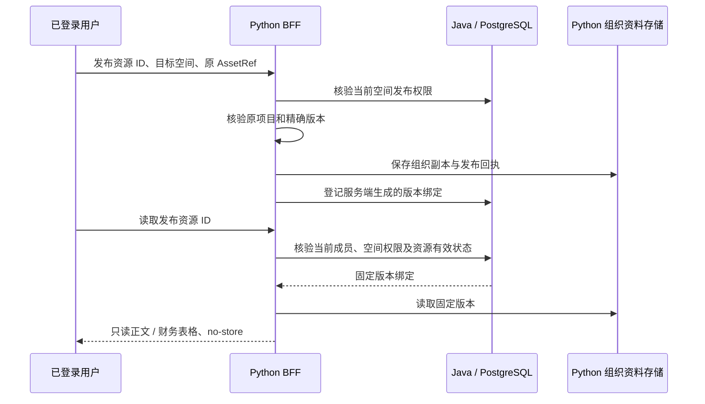

# 组织资料空间：第一条发布与阅读链路

2026-09-24 接续：新组织项目与成员进入[独立第一阶段](organization_projects.zh-CN.md)，由 Java 单独维护；下面“没有共享项目”的表述为本资料发布切片的原始范围。组织项目元数据和成员新增后，空间资源关联、团队研究、实时数据库权限、接管和审批仍未开放。

2026-09-23。接续[项目工作区](../product/java_research_intake.zh-CN.md)，本批落实统一入口、组织内个人区、团队空间和明确发布。研究项目仍由原 Python 项目权限管理；新增组织空间权限由 Java 独立负责，两者管理不同对象，不同步两份可修改的 ACL。

## 用户路径与范围

1. 在资料库使用“所属空间”和“全部 / 文件资料 / 知识库 / 数据库”切换资源。“现有资料”保留原个人项目文件、部署级公开知识库和财务库，文件继续按项目筛选。
2. 已配置独立登录及 Java 的部署可在“空间与成员管理”创建组织、生成一次性邀请码、加入组织、创建团队空间及授予成员阅读/管理权限。邀请码仅一人使用、有效七天，数据库只保存摘要；不发送邮件或其他通知。
3. 每位成员自动获得一个组织内个人工作区。它默认仅本人可读，即使组织管理员也不能直接读取其他人的个人区。数据以组织身份保存；成员移出后失去访问，数据保留，接管与转交操作尚未开放。
4. 从项目资料目录选择本页的一份文件或已保存的知识/财务选取，确认后发布到有管理权限的空间。团队阅读成员可以读取固定版本；空间管理员和组织管理员可以管理团队空间与撤销发布。组织管理员移交和恢复已移除成员尚未开放。

发布是用户明确授权的**独立组织副本**。原文件更新、撤销或作者离开不会自动撤回发布；发布版本必须在组织空间单独撤销。界面在提交前说明并要求勾选确认。文件与发布副本分别保留版本身份，发布记录保存原始 `AssetRef` 溯源；原文来源、财务十进制字符串、期间、单位和知识/财务快照不改变。知识库选取与数据库快照按类型筛选，不能等同于整套知识库检索或实时数据库权限。

已保存的研究成果同样可以明确发布为只读副本：原研究版本及来源依赖留在发布溯源中，不把原私人库的在线依赖权限复制成组织库规则。原项目中的报告仍遵守原有依赖检查。此操作不是报告审批或研究质量认证，也不赋予成员访问原私人来源、研究运行或其完整历史的权限。

本批没有共享项目、空间资源关联项目的独立关系表、团队 Agent 交接、实时数据集行列授权、下载/导出、跨组织资源共享、审批或离职接管。原个人项目筛选只作用于“现有资料 → 文件资料”；组织空间中本批按空间、类型、标题查询。公开库不会因前端选择组织而被当作已受组织权限控制的资源。项目关联是下一条业务链路，不能用来源项目 ID 冒充共享项目权限。

## 权威、存储与接口



Java Flyway V2 新建组织、成员、空间、空间成员、邀请、发布资源和审计表。组织所有权、空间归属、上传者与操作主体分别保存。组织成员关系必须有效；团队成员仅在授权空间可读，管理角色允许发布/撤销/管理成员。个人区不能直接添加其他成员。每次读取重新授权；不缓存授权，不保证撤销已经返回给用户的内容或追溯取消正在处理的请求。

| 接口 | 权限与用途 |
| --- | --- |
| BFF `/api/v1/business/workspaces` | 当前身份可见的组织/空间 |
| `…/organizations`、`…/join`、`…/organizations/{id}/members` | 创建组织、持邀请码加入、当前组织成员目录 |
| `…/organizations/{id}/invites`、`…/remove-member` | 组织管理员邀请/移出普通成员 |
| `…/spaces`、`…/spaces/{id}/members` | 创建团队空间、读取或设置空间成员权限 |
| GET `…/spaces/{id}/resources?type=&query=&offset=` | 当前权限下的发布目录，每页 30；类型及字面标题子串筛选 |
| POST BFF `/api/v1/asset-workspace/spaces/publish` | 仅接收 `{id, space_id, ref}`，不接受客户端 owner、原文或绑定 |
| GET BFF `/api/v1/asset-workspace/spaces/resources/{id}` | Java 当前核权后回读组织版本 |
| POST BFF `/api/v1/business/workspaces/resources/{id}/revoke` | 带当前 revision，管理者撤销发布 |

Java 内部 `POST /v1/workspaces/spaces/{id}/access`、`resources`、`resources/{id}/access` 只供 BFF 签名调用，不在公开业务代理白名单中。委托沿用方法、完整路径、正文摘要、主体与 60 秒时效绑定；Java 端口仅 loopback。普通项目读取接口不能用组织版本 ID 绕过 Java；团队资源不接入原 `asset_context` 或模型工具。

Python `SpaceAssets` 使用 `<项目资料根>/organization-assets` 的独立 `AssetWorkspace` 保存组织副本和 `space_publications` 回执。内部以 `organization:<UUID>` 做物理命名空间，以空间 UUID 做私有存储分组；它不是公开项目，更不是把项目 UUID 当作组织 UUID。数据库和对象路径不由浏览器输入。已有个人项目索引和 AssetRef 保持兼容，无自动迁移或权限扩散。

## 重试、停用与恢复

浏览器在当前登录身份的 sessionStorage 保存组织创建、空间创建和发布操作 UUID。相同内容手动重试复用 UUID；不同发布内容不能占用已有回执，撤销后不能通过重试恢复发布。源版本仍须在重试时有权读取。此链路无模型/付费请求，不自动重发 HTTP。

资料副本先落 Python，再登记 Java。若登记响应未知，可能存在未登记副本；它不会经公开目录或普通个人接口暴露。保留原 ID 手动重试并核验，不能删除回执后随意重建。两个存储没有分布式事务，当前没有自动孤立副本清理，也未完成跨库时间点灾备。

启用时：

- 先按 [Java 业务接入](java_research_intake.zh-CN.md)配置 Java 21、专用 PostgreSQL、BFF loopback 地址和共享签名密钥。
- BFF 必须使用 `FINSIGHT_AUTH_MODE=oidc_product`，另设 `FINSIGHT_RESOURCE_SPACES_ENABLED=1`。缺少独立登录或业务服务配置时关闭组织空间，不降级到共享的 `local-pilot` 身份。
- 构建前端并协调部署服务版本。关闭该开关只关闭访问入口，不删除组织或副本。V2 是新增表迁移，不修改 Agent Server 数据库；当前研究执行仍是原链路。
- 备份至少同时覆盖业务 PostgreSQL 与新的 `organization-assets` 资料库（包括正文/快照/发布回执），另保留原项目和运行状态备份。原项目单库备份命令不会自动包含这份独立组织库。可以对该资料根单独使用现有 SQLite online backup 能力，恢复后需验证 Java 绑定能定位对应版本，再开放读取。

## 可复现验证

```bash
python -m pytest -q tests/test_resource_spaces.py tests/test_asset_workspace.py tests/test_project_source_captures.py tests/test_java_research_intake.py tests/test_project_workspace.py
cd apps/business-service
./mvnw verify
cd ../..
# explicit local qualification, with Docker and a built JAR
export FINSIGHT_INTAKE_TEST_JAR="$PWD/apps/business-service/target/business-service-0.1.0.jar"
python -m pytest -q tests/integration/test_resource_spaces_stack.py
cd apps/workbench/frontend
npm run typecheck
npm run build
npm run test:public
```

测试使用合成组织、双身份与资料。Java 用真实 PostgreSQL；跨语言测试使用真实 BFF 路由、签名 HTTP、Spring、PostgreSQL、SQLite，仅登录身份由测试替代。验证发布幂等、个人区隔离、跨组织拒绝、成员移除、原文件撤销后独立副本保留、Java 重启与 Python 存储重开、发布撤销后的拒绝及代理绕过失败。财务快照测试比较精确值、来源与时间字段；不把这些检查当作真实金融研究质量验收。浏览器响应夹具仅证明交互与布局；真实权限证据来自后端集成测试。无付费模型调用。

本地结果：相关 Python 26 passed；Spring/真实 PostgreSQL 9 passed；跨语言重启链路 1 passed。公共浏览器首轮 48 passed / 2 failed（未打开弹窗的重复选项），修复后相关 8 项全部通过，覆盖新增的同名组织选择检查；原有真实 BFF/SQLite 浏览器 2 passed（1440/390）。TypeScript、生产构建、活动基线通过；构建仍有已有大 chunk 与第三方注释警告。存储测试额外验证同组织双空间副本、成果依赖记录及单独备份/恢复；尚未执行真实 OIDC 提供方、跨库存储灾备或生产吞吐验收。本批保留独立分支，没有切换已有服务。
