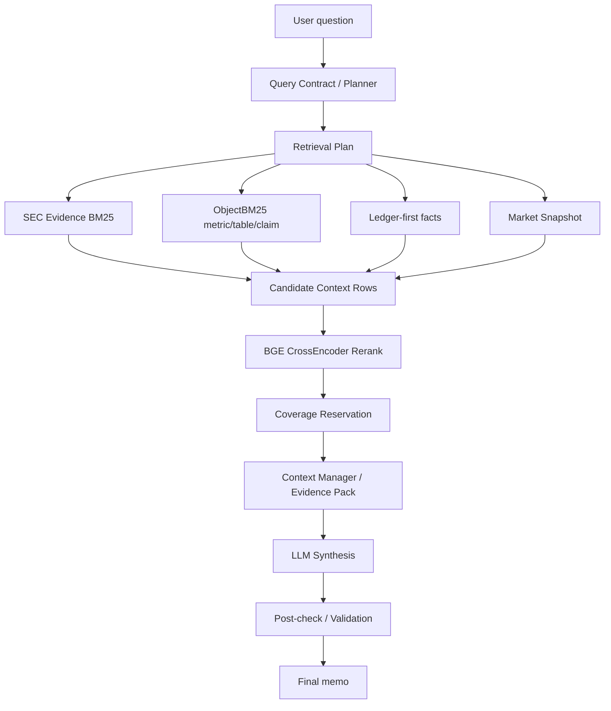
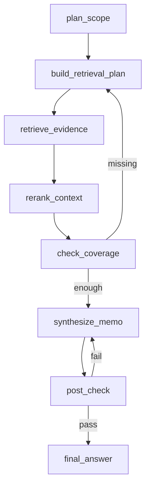

# SEC Agent 架构面试准备笔记

> 目标：这份文档不是源码逐行讲解，而是面试时可以直接口述的项目架构说明。重点放在“我做了什么、系统怎么跑、为什么这样设计、被追问时怎么展开”。

## 1. 项目一句话介绍

这个项目是一个面向 SEC 财报和市场信息的 evidence-grounded financial AI Agent。它把开放式金融分析问题拆成可执行的查询计划，从 SEC filing、结构化指标、市场快照中检索证据，再经过 rerank、上下文打包、LLM synthesis 和后验校验，生成带证据约束的分析 memo。

面试 30 秒版：

> 我做的是一个 SEC 财报分析 Agent，不是普通聊天机器人。核心难点不是让模型写一段金融分析，而是把用户的开放式问题约束成可检索、可验证、可引用的证据链。系统先解析用户意图，生成 query contract 和 retrieval plan，然后用 BM25/ObjectBM25 召回文本和结构化证据，用 BGE cross-encoder 做重排，最后把压缩后的 evidence pack 交给 LLM 生成 memo，并通过 citation、numeric ledger、post-check 降低幻觉。

面试 2 分钟版：

> 这个项目的目标是做一个金融研究场景下的 AI Agent，比如用户可以问“分析微软 AI 投入对其利润率的影响”这类开放问题，也可以让agent输出根据知识库有的资料输出一份投研报告。这个场景下我们及agent需要知道应该查哪些公司、哪些年份、哪些 filing 类型、哪些指标，还要避免模型乱编数字。
>
> 我的架构思路是把任务分成几个层次：第一层是 数据输入和处理，把 SEC 财报、公告等文件从原始HTML解析成按章节分的chunk，并抽取 metric/table/claim 这类结构化对象。第二层是召回，使用 BM25 召回文本证据，用 ObjectBM25 召回结构化指标和表格，再用 BGE reranker做精排。第三层是上下文管理，把多轮会话状态、用户问题的范围、已选证据和最近对话压缩成可控上下文。第四层是总结输出，让大模型只基于整理出来的证据包输出结构化 投研报告或者高质量回答。最后还有验证和后处理，包括引用可靠性、数据连贯性、是否符合来源边界 和评测门控。
>
> 目前项目里的 LangGraph 部分更像一个 graph/状态编排 POC，核心业务链路仍然是确定性的DAG + tool harness。也就是说，我没有把每一步都交给 LLM 自由 tool call，而是把高风险的检索、证据选择、校验做成确定性模块，只在 query改写和计划、回答范围修正、最后的输出总结等位置使用 LLM。

## 2. 端到端链路总览



可以这样讲：

> 整体链路是 planner 先把自然语言问题变成结构化 contract，然后 retrieval plan 决定该从哪些 source 和 route 取证据。召回阶段不是单一路径，而是 BM25 文本证据、ObjectBM25 结构化对象、ledger-first 和 market snapshot 多路并行。之后用 BGE cross-encoder 做 rerank，但最终不是纯 top-k，而是 coverage-aware selection，确保关键来源和关键指标不会被纯相关性排序挤掉。

## 3. 代码模块地图

主要目录：

```text
src/
  ingestion/       SEC HTML 解析、10-K/10-Q/8-K section 切分、chunk 构建
  evidence/        EvidenceObject、structured object、search text 构造
  retrieval/       BM25、ObjectBM25、Dense、Hybrid RRF 检索器
  indexing/        BM25/ObjectBM25/Dense 索引构建
  sec_agent/       query contract、context manager、tool harness、graph state

scripts/
  cloud/           交互式 Agent 主入口、tool controller、graph runner
  run_sec_*.py     benchmark/eval/synthesis/post-gate 主链路脚本
  build_*.py       manifest/chunk/evidence/index/ledger 构建脚本

tests/
  test_*           source policy、retrieval、ledger、LangGraph POC、post gate 等测试
```

面试里不需要背所有文件名，但要能说清楚边界：

- `ingestion` 解决“原始 SEC HTML 怎么变成可检索 chunk”。
- `evidence` 解决“chunk 和结构化对象怎么统一成证据对象”。
- `retrieval` 解决“如何高召回地找到相关证据”。
- `sec_agent` 解决“多轮状态、查询计划、工具编排、上下文管理”。
- `scripts/cloud` 是运行入口，把这些模块串成可演示的 Agent。
- `tests` 和 `validate_*` 是可靠性护栏，防止数字、引用、来源策略出错。

## 4. Chunk 切分逻辑

核心文件：

- `src/ingestion/parse_sec_filing.py`
- `src/ingestion/section_splitter.py`
- `src/ingestion/sec_8k_earnings_parser.py`

切分不是简单按字符长度切，而是三层结构：

```text
SEC HTML
  -> clean text + serialized tables
  -> SEC section: Item 1 / Item 1A / Item 7 / Item 8 ...
  -> semantic block: Revenue, Liquidity, Risk, Notes, Table block ...
  -> paragraph-window chunk with overlap
```

### 4.1 HTML 清洗

先用 BeautifulSoup 解析 SEC HTML：

- 删除 `script/style/noscript`
- 删除隐藏元素
- 把 HTML table 转成文本块

表格会变成类似：

```text
[TABLE_START id=1 rows=10]
Revenue | 2024 | 2023
Cloud | 100 | 80
[TABLE_END]
```

这样做的原因：

> SEC filing 里大量关键数字在表格里。如果直接 `get_text()`，表格结构容易散掉，metric/table extraction 和检索都会变差。所以先把表格序列化成有边界的文本块，让后续 chunk 和检索能识别它是完整表格。

### 4.2 Section-aware 切分

`find_sec_filing_sections` 根据 filing 类型分流：

- `10-K` 默认关注 `Item 1 / 1A / 7 / 7A / 8`
- `10-Q` 默认关注 `Item 1 / 2 / 3 / 4 / 1A`
- `8-K earnings release` 走单独 parser，把 exhibit 作为 source-bounded section

为什么要先按 SEC item 切：

> 金融分析里 source scope 很重要。比如 MD&A、Risk Factors、Financial Statements 的证据角色不同。先按 Item 切，可以在后续检索和 citation 里保留 section 信息，也能做 source policy 和 coverage check。

### 4.3 Semantic block 切分

每个 section 再用语义标题切 block。代码会识别：

- 全大写标题
- `Revenue`、`Liquidity`、`Segment`、`Capital` 等财报小节标题
- `Note 1`、`Consolidated Statements` 等财务报表标题
- Risk Factors 中像风险标题的长句

它会过滤掉噪声标题：

- `Table of Contents`
- `Part I / Part II`
- 页码
- `in millions`
- 纯数字或大量金额行

为什么不直接固定长度切：

> 如果固定长度切，可能把一个风险因素、一个 MD&A 小节或一张表拆断。semantic block 先保留业务语义边界，后面的窗口切分只是为了控制 token 长度。

### 4.4 Paragraph-window chunk

`chunk_semantic_block` 默认参数：

- `10-K/10-Q`: `target_words=900`, `overlap_words=150`, `min_words=80`
- `8-K earnings`: `target_words=650`, `overlap_words=100`, `min_words=40`

实际逻辑：

1. 把 block 切成 paragraph。
2. 按 paragraph 累加词数。
3. 达到 `target_words` 产出一个 chunk。
4. 下一块从上一块尾部保留若干 paragraph 作为 overlap。
5. overlap 不是精确 150 个词，而是 paragraph 级别，避免切断句子或表格。

面试说法：

> 我们的 chunk 是 section-aware 和 semantic-block-aware 的。先保留 SEC item 和业务小节边界，再用 paragraph window 控制长度。overlap 也是 paragraph 粒度，不是硬切 token，这样对财报文本、表格和 citation 更友好。

## 5. EvidenceObject 和结构化对象

Chunk 会转换成 `EvidenceObject`。一个证据对象保留：

- `evidence_id`
- `ticker`
- `fiscal_year`
- `form_type`
- `source_tier`
- `section`
- `subsection`
- `topics`
- `text`
- `metadata`

结构化对象包括：

- `metric`: 指标、值、单位、期间、segment、来源 evidence
- `table`: 表格标题、行列、候选期间、表格 cells
- `claim`: 文本声明、实体、指标、极性

为什么要有结构化对象：

> 财报问答经常要求精确数字。纯文本 chunk 可以帮助理解上下文，但对“这个数是多少、属于哪个期间、单位是什么”不够稳。结构化对象把 metric/table/claim 单独抽出来，可以做 ObjectBM25、ledger、numeric validation，让最终答案更可核验。

## 6. Retrieve 召回逻辑

主入口：

- `scripts/cloud/sec_agent_interactive.py` 的 `_stage_retrieve_context`
- `scripts/run_sec_benchmark_eval.py` 的 `_prepare_trace`
- fallback path: `_pipeline_context_rows`
- route path: `_pipeline_context_rows_from_retrieval_plan`

### 6.1 BM25 文本召回

BM25 索引使用 `EvidenceObject` 的 search text：

```text
ticker
fiscal_year
section
subsection
evidence_type
topics
category
block_type
text
```

召回时会带 filters：

- `ticker`
- `fiscal_year`
- `form_type`
- `source_tier`

这能避免把别的公司、别的年份、别的 filing 类型召回来。

### 6.2 Requirement BM25 补召回

除了用户原始 prompt，还会生成 requirement queries。来源包括：

- query contract 的 qualitative queries
- decomposed tasks
- facets
- gold points / hallucination traps 中的领域要求
- 特定 task type 的 domain expansion，比如 capex、ads AI infra、semiconductor risk

为什么要补召回：

> 用户问题可能很宽泛，直接拿 prompt 搜会漏掉某些关键维度。requirement queries 相当于把任务拆开的检索子问题，提升 coverage。

### 6.3 ObjectBM25 结构化召回

ObjectBM25 召回对象是 `metric/table/claim`。主要用于 `numeric_checks`。

例如 metric family 是 `capex`，会扩展成：

```text
purchases of property and equipment capital expenditures data center infrastructure capex cash flow
```

然后过滤：

- `ticker`
- `fiscal_year`
- `object_type in ["metric", "table"]`
- `form_type/source_tier`

ObjectBM25 还会对年份做 score adjustment：

- query 里有年份，metric period 匹配则加分
- metric period 不匹配则扣分
- table 里 candidate periods 匹配则加分

面试说法：

> 文本 BM25 解决“找到相关段落”，ObjectBM25 解决“找到具体指标和表格”。金融场景里很多错误不是语义不相关，而是数字、期间、单位、来源错了，所以结构化召回是必要的。

### 6.4 Retrieval Plan 路由召回

如果 case 里有 `retrieval_plan`，系统会按 route 编译 search ops。常见 route：

- `ledger_first`: 先查高置信结构化事实
- `filing_text`: 查 filing 正文
- `risk_text`: 查风险因素
- `8k_commentary`: 查 earnings release 管理层 commentary
- `market_snapshot`: 市场行情/估值/事件窗口上下文

路由召回的特点：

- 每个 route 有 candidate budget
- route 可以指定 tickers、years、source tiers、metric families
- 相同 physical search op 会合并，减少重复查询
- 同一个 row 可以被多个 route attribution 共享

面试说法：

> retrieval plan 的价值是把“查什么”显式化。不是所有问题都用一个 query 去搜全文，而是根据任务需要分别查 ledger、filing text、risk text、8-K commentary 和 market snapshot。这样后续也能解释某条证据是从哪个 route 来的。

## 7. Rerank 重排逻辑

主入口：`_rerank_context_rows`

当前 rerank 使用 `sentence_transformers.CrossEncoder`，模型配置通常是 BGE reranker。

### 7.1 为什么不用召回分数直接 top-k

BM25 分数和 ObjectBM25 分数只代表关键词匹配，不一定代表“对最终回答最有用”。例如：

- 一个 chunk 关键词很多，但只是定义性描述。
- 一个 table 关键词不多，但包含关键数字。
- 一个 8-K commentary 与问题高度相关，但 BM25 分数可能不如 10-K 正文高。

所以先高召回，再用 cross-encoder 精排。

### 7.2 CrossEncoder 输入怎么构造

Query 不是只有用户问题，还会拼：

- prompt
- gold points
- hallucination traps
- numeric checks

Document 也不是只有正文，还会拼：

- ticker/year/section
- source kind
- selection query
- route id
- object type
- evidence id / object id
- text / preview

这样 reranker 不只是看文本语义，还能利用来源、公司、年份、对象类型等上下文。

### 7.3 Rerank 后还有 reservation

排序后不是直接 `top_k`。还会做 reservation：

- 如果问题要求 8-K earnings source，每个 focus ticker 保留若干 8-K rows。
- peer comparison 场景下，为 peer ticker 保留 structured object rows。
- route-based retrieval 下，ledger-first pinned rows 不参与 rerank，直接保留。

面试说法：

> 我们的 final context selection 不是纯相关性排序。BGE reranker 负责相关性，但 coverage reservation 负责业务完整性。比如用户要求 8-K earnings commentary，就不能因为 10-K chunk 分数更高，把 8-K 全部挤掉。

## 8. Dense / Hybrid 检索

Dense retrieval 是向量检索：

1. 离线用 SentenceTransformer 把 evidence search text 编成 embedding。
2. 保存 `embeddings.npy`。
3. 查询时把 query 编成向量。
4. 因为 embedding normalize 了，所以用点积计算 cosine similarity。
5. 返回语义相似的 top-k chunk。

适合：

- 同义表达
- query 改写
- 语义相关但关键词不完全匹配的内容

风险：

- 对精确 ticker/year/metric/source 不如 lexical filter 稳
- 可能召回“语义上像，但数字上不能用”的证据

Hybrid retrieval 是 BM25 + Dense 融合：

- 先跑 BM25
- 再跑 Dense
- 用 RRF 合并排名

RRF 公式：

```text
score += 1 / (rrf_k + rank)
```

为什么用 RRF：

> BM25 分数和 dense cosine 分数尺度不同，直接加权不稳。RRF 只看排名，可以把两个召回列表融合起来。

当前项目里的定位：

> 仓库实现了 Dense 和 Hybrid，主要用于检索评估和 demo。当前主链路更偏 BM25/ObjectBM25 + BGE rerank，因为 SEC 财报场景对精确指标、年份、表格来源、citation grounding 要求很高，纯 dense 容易语义相关但证据不够精确。

## 9. Context 管理和压缩

上下文管理的目标不是把所有历史消息塞给模型，而是保留可执行状态：

- 当前任务 scope
- focus tickers/years/source policy
- retrieval plan
- 已检索 context rows
- coverage/citation/ledger 状态
- 最近几轮用户意图
- 长期记忆摘要

多轮会话里，模型通常会看到：

1. 系统任务说明。
2. 当前用户输入。
3. 压缩后的 session context。
4. 当前 scope / query contract。
5. 可用工具或下一步动作 schema。
6. 必要的 evidence pack。

面试说法：

> 我们没有把多轮对话完整 replay 给模型，而是把会话状态结构化。短期保留 recent turns，长期保留 scope、decisions、evidence references、open issues。这样既控制 token，又避免模型忘记用户修改过的分析范围。

为什么需要压缩：

- SEC evidence 本身很长。
- 多轮会话如果直接堆历史，很快超过上下文窗口。
- 历史聊天文本噪声高，不如结构化 state 稳定。
- 模型最需要的是当前任务状态和证据，不是每一句闲聊。

## 10. Tool Harness 和 LangGraph

### 10.1 当前项目的真实情况

当前项目不是完整 LangGraph-native agent。更准确地说：

```text
确定性 DAG / harness
  + 局部 LLM controller
  + graph state / LangGraph POC
```

当前 harness 的职责：

- 串联 retrieval、rerank、market snapshot、synthesis、validation
- 管理 stage status 和 artifact
- 做 source policy、coverage、post gate
- 提供交互式 demo 和多轮入口

LLM 的职责：

- 解析用户意图
- 生成或修订 query contract
- 部分 controller/tool decision
- 最终 synthesis

确定性代码的职责：

- 真实检索
- 文件/索引读取
- BGE rerank
- ledger 查询
- citation/numeric/source 校验

### 10.2 真正 LangGraph-native 会怎么写

真正 LangGraph 通常会有：

- `StateGraph`
- typed state
- node function
- normal edge
- conditional edge
- checkpoint
- `ToolNode`
- interruption/resume
- 多轮状态恢复

可能的 graph：



当前实现和真正 LangGraph 的区别：

- 当前更多是脚本/harness 顺序执行，Graph POC 不是唯一主干。
- 当前不是每个 node 都让 LLM 自由选择 tool。
- 当前更重视 deterministic retrieval + validation。
- 真正 LangGraph 会把 state transition、checkpoint、conditional retry 做得更标准。

面试说法：

> 我会坦诚说当前项目不是完全 LangGraph-native。它有 graph state 和 orchestration POC，但主链路更像确定性 harness。这样做的原因是金融证据链对稳定性要求高，检索、rerank、校验这些步骤不适合完全交给模型自由决定。后续如果迁移到 LangGraph，我会把 planner、retrieval、rerank、coverage check、synthesis、post-check 都做成显式 node，并用 checkpoint 支持 resume。

## 11. 为什么不是每个节点都让 LLM Tool Call

正常 Agent 系统里，LLM 可以多轮 tool call，每轮也可以调用多个工具。但在这个项目里，不建议每个 DAG 节点都让 LLM 自由 tool call。

原因：

- 检索范围和来源策略必须稳定，否则容易查错年份/公司/source。
- 金融数字需要可复现，不能依赖模型临场判断。
- rerank、ledger、citation validation 这些步骤确定性代码更可靠。
- LLM tool call 成本高、延迟高、不可控性更强。

更合理的划分：

```text
LLM 负责：意图理解、任务拆解、自然语言 synthesis
代码负责：检索、过滤、重排、数值校验、状态存储
规则负责：source policy、coverage、post gate
```

面试说法：

> 我不会把所有 node 都设计成 LLM tool call。Agent 的核心不是“每步都让模型决定”，而是把不确定性放在适合模型的地方，把可验证的工程步骤固定下来。尤其是金融场景，source scope、数字、引用和校验最好走确定性逻辑。

## 12. 可靠性设计

这个项目的可靠性主要来自几层：

### 12.1 Source Policy

系统会区分：

- `10-K`
- `10-Q`
- `8-K`
- company-authored unaudited earnings release
- market snapshot

不同 source 的证据地位不同。比如 8-K earnings release 可以用于管理层 commentary，但 exact-value ledger 可能不应该直接采用未经审计数字。

### 12.2 Numeric Ledger

结构化 metric/table 会进入 ledger 或 lightweight ledger store。它帮助系统：

- 确认数字来自哪个 object/evidence
- 确认单位、期间、ticker、year
- 支持 numeric consistency check
- 避免把 A 公司的数字写到 B 公司

### 12.3 Citation Grounding

最终答案里的引用应该能回到 evidence id/object id。校验重点：

- 引用是否存在
- claim 是否被引用支持
- 数字是否来自对应证据
- source policy 是否匹配

### 12.4 Post-check / Eval Gate

后处理脚本会检查：

- citation validity
- named fact support
- table cell grounding
- metric role terms
- ledger units
- hallucination traps
- abstract judgment rubric

面试说法：

> 我们不是只靠 prompt 让模型“不要幻觉”，而是把可靠性拆成 source policy、ledger、citation、post-check、eval set。prompt 是一层，检索和校验才是更关键的工程约束。

## 13. 工程取舍

### 13.1 为什么主链路不用纯 Dense

Dense 对语义召回有帮助，但财报场景更看重精确性：

- ticker 要对
- fiscal year 要对
- filing type 要对
- metric name 要对
- unit/period/source 要对

所以当前更偏：

```text
BM25 lexical precision
+ ObjectBM25 structured precision
+ BGE rerank semantic relevance
+ coverage reservation
```

一句话：

> Dense 适合补语义召回，但不适合作为唯一证据入口。

### 13.2 为什么需要 ObjectBM25

因为很多金融问题不是“找相关段落”，而是“找可核验数字”。

ObjectBM25 可以直接搜：

- `metric_name`
- `raw_value`
- `unit`
- `period`
- `segment`
- `table cells`

比纯文本 chunk 更适合 numeric QA。

### 13.3 为什么 rerank 后还要 reservation

纯相关性排序可能牺牲 coverage。例如：

- peer comparison 只保留主公司，漏掉同行。
- 8-K commentary 被 10-K 正文挤掉。
- 关键 table 分数不如长文本 chunk。

reservation 解决的是“业务覆盖”，reranker 解决的是“相关性”。

### 13.4 为什么用 deterministic harness

优点：

- 可复现
- 容易 debug
- 容易加 eval
- 便于 source policy 和 numeric validation

缺点：

- 灵活性不如 fully agentic
- route/planner 规则要维护
- 新任务类型需要扩展 contract 和 routes

面试说法：

> 这是一个偏工程可靠性的 Agent。不是让模型自由探索，而是用模型做规划和生成，用工程系统保证证据链稳定。

## 14. 常见追问与回答模板

### Q1：你们这个项目算 RAG 还是 Agent？

30 秒版：

> 它是 RAG-based Agent。RAG 是证据检索和上下文构造部分，Agent 是任务拆解、多轮 scope 管理、工具编排和后验校验。相比普通 RAG，它多了 query contract、retrieval plan、tool harness、context manager 和 eval gates。

展开版：

> 如果只是用户问题进来，检索 top-k chunk，然后让模型回答，那是普通 RAG。这个项目更复杂：用户问题会先被结构化成 contract，包括公司、年份、source policy、metric families、decomposed tasks。检索也不是单 query，而是 route-based，多路召回文本、结构化对象、ledger 和 market snapshot。多轮会话里还会管理 scope 和 evidence state。所以我会把它定义成 evidence-grounded financial Agent。

### Q2：Chunk 怎么切？

30 秒版：

> 先解析 SEC HTML，保留表格边界；再按 SEC item 切 section；section 内按语义标题切 block；最后按 paragraph window 切 chunk，默认 900 words、150 words overlap。8-K earnings release 因为更短、更像新闻稿，用 650 words、100 overlap。

展开版：

> 我们避免按固定字符硬切，因为 SEC filing 里 section 和表格结构很重要。比如 MD&A、Risk Factors、Financial Statements 的证据角色不同，表格也不能切碎。所以先做 section-aware 和 semantic-block-aware 切分，再做 paragraph-level overlap。这样检索出来的 chunk 保留了 section、subsection、block type 和 table boundary，后续 citation 和 source policy 更稳定。

### Q3：Retrieve 和 Rerank 怎么做？

30 秒版：

> Retrieve 是多路召回：BM25 搜文本 evidence，requirement queries 补覆盖，ObjectBM25 搜 metric/table，route plan 控制来源和预算。Rerank 用 BGE cross-encoder，对 query-doc pair 打分。最后不是纯 top-k，还会做 coverage reservation。

展开版：

> BM25 的输入不是裸文本，而是 ticker、year、section、topics、block_type 加正文。ObjectBM25 的输入是 metric/table/claim 的结构化字段。fallback pipeline 会用 prompt、requirement queries、numeric aliases 分别召回。route-based pipeline 会把 retrieval plan 编译成 search ops，例如 ledger_first、filing_text、risk_text、8k_commentary。召回后用 BGE cross-encoder 精排，query 里会拼 prompt、gold points、traps 和 numeric checks，doc 里会拼 metadata 和正文。最后 reservation 确保 8-K、peer、ledger 等关键覆盖不丢。

### Q4：BM25、Dense、Hybrid、Rerank 区别？

30 秒版：

> BM25 是关键词召回，Dense 是 embedding 语义召回，Hybrid 是把 BM25 和 Dense 用 RRF 融合。Rerank 是第二阶段，用 cross-encoder 对候选逐条精排。前者解决高召回，后者解决排序质量。

展开版：

> BM25 对精确术语、ticker、年份、指标名很稳；Dense 对同义表达和 query 改写更好；Hybrid 用 RRF 融合两个排名，避免分数尺度不一致。BGE rerank 不负责全库搜索，它只对召回候选做更准确的 query-doc 相关性判断。当前主链路更依赖 BM25/ObjectBM25 + BGE，因为 SEC 场景对精确数字和来源约束要求高。

### Q5：为什么不用纯向量库？

回答：

> 因为金融财报问题不是一般语义搜索。很多错误来自年份、单位、期间、公司、source type 混淆。纯 dense 可能找来语义相近但不能支持结论的证据。我们保留 dense/hybrid 能力，但主链路用 BM25/ObjectBM25 加强精确召回，再用 BGE rerank 做语义排序。

### Q6：你们怎么减少幻觉？

回答：

> 不是只靠 prompt。我们从五层做：第一，query contract 限定公司、年份、source；第二，retrieval 只取符合 source policy 的证据；第三，ObjectBM25 和 ledger 提供可核验数字；第四，synthesis 只基于 evidence pack；第五，post-check 校验 citation、numeric consistency、source policy 和 hallucination traps。

### Q7：LangGraph 在这里怎么用？

回答：

> 当前项目有 graph state 和 LangGraph orchestration POC，但主链路不是完整 LangGraph-native。核心执行还是 tool harness 和 deterministic DAG。这样设计是因为金融证据链需要稳定可复现。真正迁移到 LangGraph 时，我会把 plan、retrieve、rerank、coverage check、synthesis、post-check 做成显式 node，用 conditional edge 做缺证据重试，用 checkpoint 支持多轮恢复。

### Q8：为什么不是每个节点都让 LLM tool call？

回答：

> 因为不是所有步骤都适合模型决策。LLM 适合做意图理解、任务拆解和自然语言 synthesis；但检索过滤、rerank、ledger 查询、citation validation 这些需要稳定可复现，确定性代码更适合。尤其金融场景，错误成本主要在证据和数字，不在文字表达。

### Q9：Context 怎么管理？

回答：

> 多轮里不把所有历史消息直接塞给模型，而是结构化保存 session state。包括当前 scope、query contract、已选证据、coverage 状态、recent turns 和摘要。这样既控制 token，又能让模型知道用户上一轮改了哪些分析范围。

### Q10：如果让你继续优化，你会做什么？

回答：

> 我会优先做三件事。第一，把当前 harness 更系统地迁移到 LangGraph-native，加入 checkpoint 和 conditional retry。第二，增强 retrieval plan 的自动生成和评估，让 planner 能根据 coverage 缺口自动补查。第三，把 ledger 和 citation validation 做成更强的 production guardrail，包括可观测性、失败原因分类和人工 review workflow。

## 15. 面试时需要主动强调的点

不要只说“我用了 LangChain/LangGraph/RAG”。要强调：

- 这是金融证据链问题，不是普通 chatbot。
- 系统核心是 evidence grounding 和 source policy。
- Chunk 是 section-aware，不是随便切。
- Retrieval 是多路召回，不是单 query top-k。
- Rerank 后还有 coverage reservation。
- Numeric correctness 靠 structured object/ledger/post-check，不靠模型记忆。
- 当前 LangGraph 是 POC/局部 orchestration，不要夸大成完全 native。
- 你能说清楚为什么做 deterministic harness，而不是全交给 LLM。

## 16. 推荐口述顺序

当面试官让你介绍项目时，按这个顺序讲最稳：

1. 项目目标：SEC financial evidence-grounded Agent。
2. 数据层：SEC HTML -> section/block/chunk -> EvidenceObject/structured object。
3. 检索层：BM25/ObjectBM25/ledger/market snapshot 多路召回。
4. 排序层：BGE cross-encoder rerank + coverage reservation。
5. Agent 层：query contract、retrieval plan、context manager、tool harness。
6. 生成层：LLM synthesis，基于 evidence pack 生成 memo。
7. 可靠性：citation、numeric ledger、source policy、post-check/eval。
8. 取舍：金融场景更重视可验证性，所以不是 fully free-form tool calling。

最后一句可以收束：

> 所以这个项目的重点不是“调一个大模型回答财报问题”，而是把金融研究流程拆成可控的证据检索、上下文管理、结构化生成和后验校验链路。模型负责理解和表达，工程系统负责证据、状态和可靠性。
