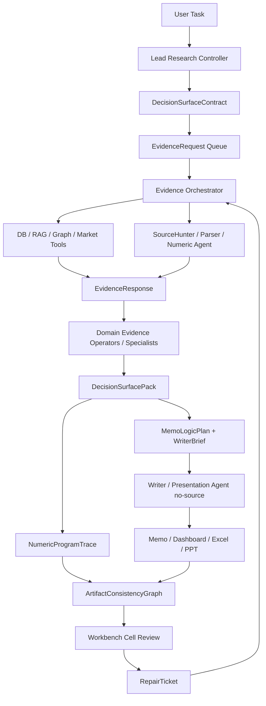

# PRD：FinSight B 端金融研究工作台

日期：2026-06-28

状态：产品经理向 PRD 草案。本文定义 B 端用户、工作流、功能边界、底稿与交付物要求、dashboard/watchlist/图谱交互和验收标准。本文不定义具体 runtime、API、DB schema、agent graph 实现；技术方案应另拆架构文档和交付文档。

关联产品文档：

- `docs/product/PRODUCT_20260628_finsight_tob_toc_positioning_and_product_line.zh-CN.md`
- `docs/architecture/agent_graph_vnext/25_agent_runtime_reference_stack_and_harness_context_engine_draft.zh-CN.md`

## 修订记录

| 日期 | 修改内容 |
| --- | --- |
| 2026-08-08 | Firecrawl/Tencent 同矩阵实证后纠正单 Provider 全职责假设：production SourceHunter 改为 official-first、role-specific portfolio。SEC/issuer IR feed/sitemap/official-domain route 负责 known primary discovery，broad search 只负责 unknown locator；Provider 日期降为 telemetry，capture-backed 本地发布日期裁决仍是 Evidence 硬门。Firecrawl 因 target=`5/6` 只进入 discovery shadow implementation 候选，Tencent 因 `0/6` 保持 diagnostic-only；暂停继续采购/轮测 Provider，先以零调用 replay 证明组合候选、关系、日期和 Evidence Gate。历史 assessment 不改，S1-08 仍未通过。 |
| 2026-08-08 | Firecrawl 关系感知 semantic control 已 exact-once 完成：24/24 成功、topical useful=`133/240`、六个 customer/supply case-slot target-in-pool=`5/6`，证明 evidence-owner/direction 查询和 fan-out 比旧 generic A4 更接近研究目标；但旧／新矩阵调用数与语言不同，不标作单变量 A/B。Firecrawl 因 DELL supply 目标缺失、日期字段=`0/235`、中文 exact target=0 和 p95=`6877 ms` 继续 diagnostic-only。产品验收明确拆分“query compiler live-supported”和“Provider lane qualified”；前者可通过而后者失败。下一步只在 fresh 国内凭据就绪后复用同一 24-query plan，不自动重跑 Firecrawl、加 precise lane 或用 reranker 补上游候选。 |
| 2026-08-08 | S1-08 已完成国内凭据就绪度判断与 Firecrawl 关系感知语义控制组零调用实现：当前腾讯／百度／阿里凭据均不可安全使用，不复用聊天暴露 Key；国内 Provider 优先方向不变。为单独检验查询修复，只选择 customer/supply 的 24 个 semantic execution unit，不同时执行 22 个 precise unit。runner 强制 clean/exact-once、request/raw-response-or-failure capture-first、0 retry/model/document/Evidence，且 evaluator 只有在 24 个身份全终态后才加载 Gold。即使控制组通过也只允许同矩阵国内 Provider 对照，不建立国内能力或 SourceHunter 接入。 |
| 2026-08-08 | S1-08 国内 Provider wire projection 已完成零调用工程证明：60 个 canonical intent 分别编译为 Tencent／Baidu／Alibaba MCP／Firecrawl 安全请求，百度 `60/60` 满足 72-unit 上限，query=`37–66 units`。检索词不再只用通用槽位标签，而按公司与研究问题加入 Azure AI capex、Dell AI-server backlog、Micron HBM、NVIDIA Blackwell、TSMC CoWoS 等实际研究主题。官方精确请求按完全相同 payload 显式合并后，每家从 36 个 intent 降为 22 个执行单元；加 24 个语义单元共 46 次 ceiling，capture 以多 consumer lineage 分别服务三案。该优化减少重复调用但不共享判断、不改 hidden target，也不授权 live。 |
| 2026-08-08 | 完成国内 Provider 输入资格审查：Tencent SearchPro 与百度千帆 Web Search 均属于可返回原始 URL／标题／摘要／日期的 standalone raw-search 形态；阿里 Web Search MCP 可作为返回 `pages` 的国内语义候选，但必须与模型联网问答／合成 Research 分轨。发现百度 query 仅允许 72 个计量字符且中文按 2 计，当前 60 条 canonical intent 的加权长度为 `122–268`、直接可发送=`0/60`。因此产品合同新增 canonical SearchIntent 与 provider wire projection 分层：研究意图和 hidden target 全 Provider 相同，站点／日期等传输字段及有公开上限的短查询由 adapter 确定性编译；不得因输入截断做无效横评，也不得把某一 Provider 的限制写入核心研究合同。 |
| 2026-08-08 | S1-08 relationship-aware SearchIntent 与 typed source-equivalence 已完成零调用工程证明：不再把一个 subject＋通用 slot query 同时代表多个客户／供应商，而是按 evidence owner 单独编译研究主体、披露方、关系方向、期间、来源族、语言和路线。三案形成 `36` 条官方精确路线＋`24` 条语义开放网路线，旧 Tencent `24` 条合同保持不可变但不再作为 successor 模板；60 条 query 全部唯一、最长 268 字符。source-equivalence 只承认 exact locator、SEC accession、经 capture 验证的 canonical/redirect 或内容同一性，同期同事件不同文档不等价。该结果只证明查询与评估合同，不证明任何 Provider live recall。下一步按用户运营约束优先审查可人民币结算、国内充值／发票／支持便利的国内 Provider，Exa 等仅保留可选外部基准；核心 Runtime 仍保持 provider-neutral。 |
| 2026-08-08 | 完成 broad Web Search Provider 市场调研与 Firecrawl keyless 有界试跑。产品检索不再假定单一 API 可覆盖全部 Evidence Slot，而是明确两条互补路线：known-target 的官方域／SERP 精确检索与 unknown-source 的语义开放网发现。Firecrawl issuer/regulatory 初始 exact target=`3/6`，官方域补充=`3/3`，但 customer/supply 通用查询=`0/6`；审计确认现有 planner 虽计算跨实体 evidence owner，却没有把实体别名和关系方向编入 provider-visible query。故下一项先修 provider-neutral relationship-aware SearchIntent，再跑完整 comparator；不得把该项目缺口全归 Provider，也不得把深度研究 API 的合成答案冒充 FIN 自有 Agentic Search/Research。Provider 日期仅为候选元数据，最终发布日期与 source equivalence 必须 capture 后本地核验。 |
| 2026-08-08 | Tencent WSA standard 的 `DELL/MU/NVDA × 4 external Evidence Slot × EN/ZH` 盲搜 comparator 已 exact-once 完成：24/24 terminal、1.104 元、p95 941 ms；中文 topical recall 高于英文，但 Evidence-eligible=`0`、case-slot target-in-pool=`0/12`、hidden target group=`0/12`，日期因零 exact target 无法验证。故 Provider 保持 diagnostic-only，不接 SourceHunter、不允许 reranker rescue。产品采购门明确为：下一候选 Provider 必须复用同一 gold-blind 合同；若不采购，则需 Owner 明确缩减 Internal Alpha 可承诺来源范围，不能把候选缺失写成 Agent 分析失败。 |
| 2026-08-08 | Tencent WSA standard same-query R4 证明套餐升级可把 DELL topical useful 从 `0/10` 提升到 `10/10`，但一手 target、日期权威和独立来源仍为失败，故新增“主题相关 useful@10”和“Evidence-eligible useful@10”分账。付费 broad-search Provider 必须先通过 DELL/MU/NVDA × 四个外部 Evidence Slot × 中英查询的盲搜后评测，对照 target-in-pool、日期准确性、来源多样性、成本和延迟；候选池失败时禁止依赖 reranker 补救，全部门通过也只进入独立接入决策。 |
| 2026-08-08 | P3A A2 已在双 clean archive／双 fresh process 各 `92/92` 通过，关闭项目内 protected-fetch/cache 确定性证明。用户批准将开源 Provider 对照前移：先接入自建 SearXNG 作为 diagnostic metasearch locator provider，再用相同合同对照未来付费 API。该路线不计生产能力，不能直接晋升 Evidence/事实，也不修改 no-R4；其目的只是低成本测量不同搜索引擎能否把缺失资料送入候选入口。 |
| 2026-08-08 | P3 选择 repair-first：先在固定 16 次网络上限内用一个零调用结构包证明 qualified locator 后的受保护正文抓取与 attempt-local cache 边界；Provider 采购、动态页／licensed source 和 Internal Alpha 来源范围缩减暂缓，避免用外采或降范围掩盖项目自有 false gap。P3A 通过后仍须独立 owner 决策才可讨论新 live；no-R4 未被修改。 |
| 2026-08-08 | 唯一 DELL R3 current-search exact-live 已执行：控制面以 `15 network / 0 model-provider-retry` 完整 terminalize，但得到 `0 candidate / 0 source / 5 typed gaps`，产品来源质量失败。229 条 locator 通过初筛后没有发生正文抓取，根因包含项目内共享 discovery/document allowance 与跨 attempt budget-stop negative cache；既有 deterministic fixture 未覆盖该自然拓扑。no-R4 生效，下一项只能先做零调用 P3，联合处置 owned Runtime 缺陷、运营 Provider 能力和 Internal Alpha source claim；不得把本结果归因 DeepSeek、先调 ranking 或直接购买 Provider 后重跑。 |
| 2026-08-08 | 完成 FIN 0.1.3 中段 PRD／TECH／Runtime／产品实证对齐：确认当前工程控制面成熟度高于研究内容与用户验收，要求先用最小 S0-04G 关闭共享 run-scope fail-open，再给 S1-08 一次有界 DELL candidate-ceiling live；若仍失败，进入 Provider 获取或 Internal Alpha 来源范围决策，不得追加 R4。进一步明确“方法写入 registry”不等于研究能力落地，S3 必须证明方法注入、节点消费、实质性研报和 qualified-human 内容验收。 |
| 2026-08-08 | S0-04G 已以 typed blocker state、RunScopeRegistry v1.0 和 post-adoption lineage 关闭共享 scope fail-open；clean archive/fresh process 85/85 兼容复证通过，且不放宽旧 R3 Runtime-tree drift guard。该治理通过不计为检索、Evidence、研究内容或产品能力提升；唯一下一项仅为零调用 P2D，direct R3 仍须独立签发与执行。 |
| 2026-08-08 | 根据 FIN 0.1.3 S1-08 真实 DELL current-search 与 capture replay 完成产品反向校准：Agentic Search 必须按 provider 可运行性、目标资料进入候选池、排序、Evidence 晋升和下游利用逐层验收；target-in-pool 未通过时禁止用 NDCG/MRR 或 reranker 绿色结果掩盖上游缺口。新增 typed blocker/run-scope fail-closed、唯一网络文档收益率和阶段准入要求。 |
| 2026-08-08 | 根据 S1-08 真实 capture bake-off 修正 SourceHunter 成熟组件边界：feedparser/Trafilatura 只能解析已捕获内容并生成 discovery/main-text/metadata candidate；第三方推断日期、sitemap lastmod、HTTP Last-Modified 不拥有金融发布日期权威。新增 relationship-aware Evidence Slot、slot round-robin 与网络唯一文档/本地快照分账要求。 |
| 2026-08-07 | 补齐模型研究判断与金融事实写入权的产品边界：模型必须看见并分析 exact facts、选择 evidence/numeric refs、生成 thesis/机制/反方；Harness 只拥有 material number/date/entity/citation 的确定性渲染与晋升，不得代写研究。新增受保护混合叙事、correction closure 和 anti-template 内容质量门禁。 |
| 2026-07-19 | 完成 FIN 0.1 PRD/TECH/Point 阶段复盘：当前已形成 10-cell P36 本地确定性研究纵向和可运行 Workbench Next，但 DeepSeek 实际调用、exact Human Senior Review、RG1/RG3/RG4 和 P07.5 release 尚未通过。当前功能状态见 `FIN_0_1_STAGE_REVIEW_20260719.zh-CN.md`，不得再以 2026-07-17 的 implementation-not-started scope freeze 代表当前进度。 |
| 2026-07-17 | 纠正 `REL-PROD-001` 产品范围：P36 六条产业链改为 Anchor Case mandatory cell families；FIN 0.1 正式消费 B0+B2+B3 bounded subset+B7，必须覆盖 Dashboard/Task Center、动态 DecisionSurface、durable execution、Evidence/Numeric、Workpaper/Repair、LeadReview、Deliverable/Human Review、provenance 和 bounded same-Case explanation。 |
| 2026-07-17 | 冻结产品发布运行模型：以纵向研究结果切片而非 TECH/Point 作为产品版本单位；采用四周产品列车、Foundation/Internal Alpha/Beta/Pilot/Production 通道和 L/R/Capability/Production Readiness 四轴状态；固定下一产品版本为 `REL-PROD-001 / FIN 0.1 Internal Alpha`。 |
| 2026-07-18 | Point 01 以 `POINT01_FOUNDATION_ALPHA_CONTRACT_RUNTIME_PROOF_COMPLETE` 完成窄范围合同收口：只解锁 FIN 0.1 的 fixture/shadow/internal development；已消费的单次 operational attempt 不得重试，转为 `REL-PROD-001 / RG1_vertical_path` 的发布硬阻断。 |
| 2026-07-12 | 正式将产品主定位升级为“机构研究控制与记忆系统 / AI-native Research Management System”；以 InstitutionalResearchCase 串联 DecisionSurface、Evidence/Numeric/Judgment、Workpaper、Review、Artifact、Memory、Monitoring 与 Supersession；新增五个产品平面、纵向研究结果 R1-R4、Human-AI Accountability、机构配置治理和 provider-neutral capability frontier。 |
| 2026-07-11 | 完成 WorkBuddy 12-case 语义/结构化轨迹复审：0 个外部报告直接晋升；只保留经独立验证的研究责任、行业机制、report-type scaffold 和 presentation contract，拒绝继承事实、数字、估值、排名及搜索轨迹。 |
| 2026-07-11 | 修正 WorkBuddy calibration 边界：12-case 使用 DeepSeek V4，不作为强模型或成熟参考；外部 case 默认进入缺陷诊断和 improve/redesign/reject review，只有独立验证后的改进候选才可进入 pack。 |
| 2026-07-11 | 追加跨行业/跨议题适配合同：通用研究责任骨架 + sector pack + report-type pack + bounded case delta；明确外部案例只校准产品能力与边界，不能把提示词诱导的结构、报告事实或标题模板直接固化为产品真相。 |
| 2026-07-11 | 完成 PRD 可落地性与充分性审计；新增产品能力分级、bounded product claims、缺失产品闭环和 PRD->TECH->R-series->runtime->surface 覆盖要求；明确 Workpaper、LeadReview、Gap、任务模式、Data Room、估值、Agent/Model registry、AIE 与 Watchlist owner。 |
| 2026-07-10 | 追加 TECH_05 领域判断系统与 Active What-Would-Change：拆分 operator task/evidence/judgment，定义 ownership、bounded resume、confidence、cell dependency、sector pack、adjudication，并把 what-would-change 升级为独立反事实取证、证伪和监控章节。 |
| 2026-07-10 | 追加外源准入与社交舆情策略：外源分为常驻数据、按需 SourceHunter、discovery-only 和 licensed adapter；第一方认证账号可支持归因、意图、发布和舆情信号，但账号真实性不等于发言事实为真；新增 claim conflict 与 sampled discourse 产品边界。 |
| 2026-07-10 | 追加 futures/options/other derivatives 分层产品策略：期货与 broad regime 优先、单股期权按 cell 激活、OTC/CDS 调查型或商业授权、衍生品信号不得冒充基本面。 |
| 2026-07-10 | 追加公开资本市场 PIT 数据补强、DerivedMetric / DiagnosticScore / ValidatedFactor 分层、Research-to-Quant 差异化因子方向及 Quant Validation 回流 Decision Surface 的产品边界。 |
| 2026-07-09 | 追加 Agentic Research Operating System 框架：Lead Research Controller、bounded ReAct specialist loops、CaseControlMemory、DecisionSurfaceContract / DecisionSurfacePack、SourceHunter / Evidence Operator / Parser / Writer 权限边界、Workbench cell-level review 与 writer/presentation agent 输出要求。 |
| 2026-07-09 | 追加三条 agent 编排规则：repair ownership 回到来源/最有权限 agent、DB/RAG/补源作为共享 Evidence Layer 而非专家私有工具、Evidence / SourceHunter 作为结构化证据编译器。 |
| 2026-07-09 | 追加 P36 后 agent 框架落地路线：Lead Controller + shared Evidence Layer + domain operators + RepairTicket + Writer no-source，新增 DocumentMetadataIndex、NumericProgramTrace、ArtifactConsistencyGraph，并把 Workbench 从 claim review 扩到 decision surface / document grid / artifact consistency review。 |
| 2026-07-09 | 追加 Evidence Layer 工具栈分层：SEC EDGAR APIs、OpenBB、RSS/feedparser、GDELT、Crawl4AI、Crawlee+Playwright、Trafilatura / news-please、Docling、MinerU、MarkItDown、pdfplumber / Camelot 的产品定位和采用边界。 |
| 2026-07-09 | 追加 Z 盘工具 PoC 后的已验证工具栈与 agentic tool-use 三层：Tool Registry、Evidence Tool Planner、Evidence Gate；明确模型有工具选择和失败重试权，但没有 evidence promotion 权。 |
| 2026-07-09 | 追加 Agentic Search / Agentic Research 与 RAG / 知识库角色定位：agentic search 是 EvidenceRequest 驱动的候选发现和失败重试，agentic research 是 DecisionSurfaceContract 驱动的研究闭环；RAG / 知识库改定位为 source index、candidate generator、artifact router、institutional memory 和 repair cache，而不是事实提权或最终回答引擎。 |
| 2026-07-09 | 追加 Agentic Research Harness 工程控制面：MCP / ToolGateway、durable run state、ContextEngine、subagents-as-tools、skills 渐进式披露、trace/provenance、guardrails、trajectory eval 和 trace-driven self-improvement，明确这些是 runtime harness 要求，不是当前已实现能力。 |

## 1. 产品定位

FinSight B 端正式定位为：

```text
Institutional Research Control and Memory System
AI-native Research Management System
面向金融机构与专业服务团队的研究控制、协作和记忆系统
```

FIN 的核心产品不是一次性报告生成器，也不是一组人格化 Agent。Agent 负责执行研究，FIN 负责让研究过程可控制、可复核、可延续、可追责，并把机构历史判断、人工纠错和正式交付沉淀为可更新的研究资产。

`Evidence-backed Financial Research Workbench` 仍是主要交互形态，`AI junior analyst layer` 仍是重要执行层，但二者不再代表完整产品定位。系统以 `InstitutionalResearchCase` 为纵向聚合身份：

```text
InstitutionalResearchCase
 -> DecisionSurface
 -> Evidence / Numeric / Judgment
 -> Workpaper
 -> Human Review / Decision Attestation
 -> ArtifactSet / Release
 -> Institutional Memory
 -> Follow-up / Monitoring / Refresh / Supersession
```

它不是通用金融聊天框，也不是直接替代 senior / PM / 投委会的自动决策系统。第一阶段继续替代或压缩 junior analyst / associate 的底层重复工作，同时建立 senior、reviewer、compliance 和 client-facing workflow 所需的控制主干：

- 收集公开披露、市场数据、产品数据、行业数据和用户上传材料；
- 做表格抽取、科目归类、事实核对、引用定位；
- 建证据包、研究底稿、反方证据、缺口台账；
- 生成 first draft、PPT outline、Excel appendix、客户简报；
- 支持 senior / manager 审阅、追问、改稿、批准和复盘。

核心商业承诺：

```text
降低低阶研究生产成本，
提高证据密度和流程一致性，
缩短 time-to-approved-output，
复用历史研究、人工纠错和机构方法，
保留 human review、责任链、版本和审计能力。
```

产品 North Star 不是“能否生成高质量报告”，而是一个真实研究 Case 能否更快达到 reviewer-ready、能否复算 material number、能否解释 claim lineage、能否在追问和新季度中选择性刷新、能否把同一批准结论一致地投影到 memo、model、deck 和 dashboard。

## 2. 目标用户和角色

### 2.1 机构类型

- 券商研究所；
- 买方投研团队；
- 投顾 / 财富管理；
- PE / VC / 并购 / 债券尽调团队；
- 咨询公司；
- 会计师事务所；
- 企业战略、IR、投资与财务部门。

### 2.2 用户角色

| 角色 | 目标 | 主要动作 |
| --- | --- | --- |
| Senior Analyst / PM / Manager | 定义研究问题、复核结论、形成判断 | 创建任务、审阅底稿、追问缺口、批准交付物 |
| Junior Analyst / Associate | 执行研究生产、整理数据、写初稿 | 使用系统生成底稿、修正证据、补充人工判断 |
| Compliance / Reviewer | 检查引用、边界、风险和交付质量 | 查看 trace、citation、gap、版本、审批记录 |
| Data / Knowledge Admin | 管理机构知识库、私有文档和权限 | 上传数据、配置数据源、维护模板和权限 |
| Client-facing User | 生成客户可读交付物 | 导出 brief、deck、Word/PDF、图表和 appendix |
| Research / Business Owner | 对 Case 的研究范围、关键判断和后续维护负责 | 指定 accountable owner、接受 bounded gap、触发 thesis revision |
| Approver / Delegated Approver | 对 exact version 的内部使用或对外发布作出授权 | 审批、附条件批准、撤回、重新审批 |

## 3. 核心用户问题

当前 B 端研究流程的主要痛点：

1. 资料和数据分散，junior 大量时间花在找、复制、对数和整理上。
2. 研报/底稿结论常常难以追溯到原始证据。
3. 公开数据、私有材料、历史研究和市场信号没有统一证据层。
4. 多人协作时，问题定义、数据缺口、反方证据和版本记录容易丢失。
5. 输出交付物格式多样，但当前 agent 往往只输出一段长文本。
6. 只靠一次主 agent 调用加几个 specialist 并发请求，不像真实研究团队协作。
7. 如果 agent 行为停留在一轮 planning、一次性 specialist prompt 和 writer 汇总，系统在发现证据不足、数值异常、source gap 或叙事不完整时，无法自主推进 bounded repair。
8. 研究结论、人工纠错、拒绝证据和批准版本没有形成可复用的 point-in-time institutional memory，下一次追问或财报更新仍从零开始。
9. 同一 claim 和 number 进入 memo、Excel/model、PPT、dashboard 后会各自漂移，上游修订无法可靠触发跨产物失效和重新审批。
10. 使用 AI 的操作者、Agent、工具、人工修改、+1/+2 review、Compliance 和 release 责任链分散在聊天、日志和 OA 中，无法形成 Case/Cell/Claim 级审计证据。

## 4. 产品形态

B 端产品主体应是工作台，而不是聊天页。

```text
Dashboard
 -> Research Task Center
 -> Input / Data Room
 -> Evidence Workbench
 -> Workpaper Builder
 -> Research-to-Quant Lab
 -> Lead Review
 -> Deliverable Studio
 -> Human Review / Approval
 -> Knowledge Base / Watchlist / Eval Trace
```

聊天或自然语言输入只作为入口之一。用户更常用的入口应包括：

- dashboard 上的任务、公司、行业、watchlist；
- 文件上传和 data room；
- 公司/行业知识库页面；
- 图谱探索页面；
- 交付物编辑器；
- 审批和评论流。

### 4.0 InstitutionalResearchCase 与五个产品平面（2026-07-12）

产品主状态从一次性 `ResearchTask / Report` 升级为可持续存在的 `InstitutionalResearchCase`。Report、PPT、Excel、dashboard 和 alert 都是 Case 当前受控状态的不同投影，不得各自成为独立事实主账本。

Case 生命周期：

```text
Initiate -> Research -> Review -> Release
 -> Monitor -> Refresh -> Supersede -> Archive
```

Case 必须支持 initiation/deep dive、earnings update、用户追问、reviewer correction、thesis revision、private/public evidence conflict、new-quarter selective refresh、artifact staleness、withdrawal 和 multi-format synchronized update。

现有页面和模块归入五个产品平面：

| 产品平面 | 主要 surface | 核心用户结果 |
| --- | --- | --- |
| Research Control Plane | Task Center、ResearchCase、DecisionSurface、LeadReview、Gap/Repair、Assignment/Handoff | 研究范围、责任、状态和下一步可控 |
| Evidence & Modeling Plane | Evidence Workbench、Data Room、RAG/DB/Web/Graph、Numeric/Valuation/Scenario | 每个 claim 和 number 可验证、可复算 |
| Institutional Memory Plane | Accepted Fact/Judgment、Reviewer Decision、Rejected Evidence、Case History、Method/Playbook | 追问、更新和人工纠错可以复用 |
| Review & Delivery Plane | Workpaper、Review Queue、ArtifactConsistency、Deliverable Studio、Approval/Release | exact-version 可审阅、可批准、可交付 |
| Monitoring & Learning Plane | Watchlist、What-Would-Change、staleness、refresh、Eval、governed improvement | 新信息能选择性更新 Case 和产物 |

能力分层：

- `table_stakes`：Agentic Search、Deep Research、金融 Skill、公司比较、HTML/图表/dashboard、What-Would-Change、多格式输出和基础 fallback；
- `core_differentiation`：Evidence/Numeric control、PIT institutional memory、reviewer correction reuse、private/licensed data、durable review、cross-artifact consistency、exact-version release 和 selective refresh；
- `optional_expansion`：更多 persona、复杂舆情、高频衍生品、自动组合建议和真实交易执行。

更强模型、更强搜索和更多行业 Pack 不是不重要，而是持续演进的 `Capability Frontier`。模型、搜索、数据和 parser provider 必须通过可替换接口、权限/许可/成本策略、fallback 和 shadow eval 接入 Control/Memory Spine；不能各自创建新的事实、记忆或审批主账本。

### 4.1 任务执行形态：Codex-like 长程研究任务

复杂研究任务的产品形态应接近 Codex / Claude Code / OpenCode 类长程任务执行器，但产物不是代码 diff，而是金融研究对象。

它的执行方式不是“一问一答”，也不是“Lead 派一次单、几个 agent 并发返回、writer 汇总”。复杂任务必须呈现为一个持续演进的 `ResearchTask`：

```text
用户提出任务
 -> 系统生成 ResearchObjectiveContract
 -> Research Lead 拆分必答维度、证据要求和缺口处理规则
 -> specialist workstreams 并行或异步推进
 -> 持续写入 WorkpaperEvent
 -> LeadReviewCheckpoint 周期性审查是否满足目标
 -> targeted repair / specialist rework / human question
 -> JudgmentState 和 MemoLogicPlan 成形
 -> Deliverable Composer 生成多格式交付物
 -> Human Review / Approval / Publish
```

用户在任务执行过程中应持续看到：

- 当前计划；
- 正在执行的 workstreams；
- 已完成维度；
- 新增证据；
- 当前缺口；
- targeted repair 结果；
- 被 verifier 拒绝或降权的证据；
- human question / approval request；
- 交付物生成状态；
- 成本、耗时和失败原因。

产品核心产物不是“聊天答案”，而是：

```text
ResearchTask
WorkpaperEvent
WorkpaperPack
EvidencePack
GapLedger
JudgmentState
DeliverablePlan
DecisionSurfaceContract
DecisionSurfacePack
DocumentMetadataIndex
NumericProgramTrace
ArtifactConsistencyGraph
FactorHypothesis
FactorCard
EvalTrace
```

最终回答、memo、PPT、Word、Excel、dashboard card 都只是上述研究对象的不同投影。

### 4.1.1 Agentic Research Operating System（2026-07-09 追加）

复杂研究任务的目标形态不是 `multi-agent report generator`，而是 `agentic research operating system`。系统必须围绕用户问题持续推进证据闭环，直到每个关键决策格被 accepted evidence、typed gap、commercial gap 或 human review 处理。

每个复杂任务应生成 `DecisionSurfaceContract`，并由 Research Lead 持有 `CaseControlMemory`。Lead 的上下文应完整覆盖用户问题、追问、决策格、任务派发、证据状态、缺口、补源请求、叙事计划和 writer 注意事项；但 raw rows、长 PDF、DB 查询结果和图谱大对象应存放在 evidence / artifact store 中，由 Lead 持有引用、摘要和状态，避免把 Lead 退化成超大单 agent。

Agentic loop 不应以暴露原始 CoT 为产品功能。系统应记录可审计行动链：

```text
Plan
 -> Act / ToolUse
 -> Observe / ObservationSummary
 -> Classify accepted / rejected / gap / needs_repair
 -> Repair or Stop
 -> Emit structured state
```

行动链最少应包括：

- `plan`：本轮要解决的决策格、证据要求和停止条件；
- `tool_call`：使用的数据源、DB 查询、RAG route、web/source supplement 或 parser；
- `observation_summary`：工具返回内容的摘要和适用边界；
- `decision`：accepted、rejected、typed gap、commercial gap、needs repair、needs human review；
- `rejection_reason`：数值异常、source authority 不足、period / unit 不匹配、不能推断、重复或过弱；
- `next_action`：继续查、换 route、请求 SourceHunter、请求 parser、回到 Lead、交给 writer 或停止。

共享状态应通过结构化对象维护，而不是靠 prompt 里的长聊天记录：

```text
CaseControlMemory
CaseEventLog
ToolUseLedger
EvidenceLedger
RejectedCandidateLedger
NumericSanityLedger
DomainOperatorTask
CellEvidencePack
DomainCellJudgmentPack
WhatWouldChangeProgram
DecisionSurfacePack
WriterBrief
```

Subagent 可以有独立 working context 和 scratchpad，但跨 agent 通信必须只通过结构化 artifacts 进入共享层。Lead 可以发起 targeted repair、补源或二次派单，但实际取数、联网补源、parser 和数值审计应由有权限的 SourceHunter / Evidence Operator / Parser / Numeric Agent 执行。Writer 不得自己补源；Writer 应作为 `Research Presentation Agent`，负责输出格式、语言、表格、图表、dashboard card、客户版/内部版口径和可读性。

### 4.1.2 P36 后目标落地形态（2026-07-09 追加）

P36 暴露的问题不是“再增加几个专家 agent”即可解决，而是缺少贯穿研究链路的一等对象。落地后的系统应从 `chat answer` 或 `multi-agent report generator` 升级为 `decision-surface-first research workbench`：



关键对象和落地含义：

| 对象 | 产品作用 | 当前项目落地位置 |
| --- | --- | --- |
| `DecisionSurfaceContract` | 把用户问题拆成链条 x 决策格，声明 evidence requirement、route plan、stop condition | Research Lead 输出合同；替代只按 generic memo slot 派单 |
| `DocumentMetadataIndex` | 把 company、ticker、period、doc type、source authority、section、table lineage 作为 retrieval filter | Data / RAG / parser 层；不能只作为 reranker feature |
| `EvidenceRequest` / `EvidenceResponse` | 让专家通过结构化需求取数，返回 accepted / rejected / gap / needs_repair | Evidence Orchestrator 与 domain operators |
| `NumericProgramTrace` | 记录 growth、margin、CAGR、bridge、peer comp、valuation multiple 的可执行计算链 | Parser / Numeric Agent 与 verifier |
| `DecisionSurfacePack` | 给 Lead、Writer、Verifier、Workbench 的 report-first 中间态 | Aggregate / Judgment Planner 与 MemoLogicPlan 之间 |
| `ArtifactConsistencyGraph` | 检查 memo、PPT、Excel、dashboard 的数字、口径、引用一致性 | Deliverable Studio / Workbench review |

落地后的用户界面不应只展示最终 memo，而应展示：

- 中央：`Decision Surface Matrix`，例如 AI 基础设施任务中的 Accelerator、Server OEM、Foundry/Packaging、HBM、Semicap 等链条，以及 demand evidence、value capture、margin quality、supply bottleneck、capex read-through、price-in/crowding、risk/counter-thesis、what-would-change 等 cell；
- 右侧：点击 cell 后展示 accepted evidence、rejected candidates、source grade、numeric trace、ToolUseLedger 和 RepairTickets；
- 下方：`Document Grid`，按 company / document / period / section / table lineage 展示证据覆盖；
- 交付物区：memo、dashboard board、Excel appendix、PPT outline 共用同一批 fact id、numeric trace id 和 citation id；
- 审阅区：`ArtifactConsistencyGraph` 标出跨 artifact 数字、单位、期间、引用和口径不一致之处。

第一阶段落地顺序应保守：先做合同和 deterministic fixtures，再做 EvidenceRequest wrapper、NumericProgramTrace、DecisionSurfacePack-to-MemoLogicPlan 和 Workbench cell review；不得先靠 paid writer 或 full-chain rerun 证明质量。

### 4.2 任务模式

系统应按任务复杂度选择不同运行模式，避免小问题也烧完整 multi-agent 链路。

| 模式 | 场景 | 执行方式 | 主要产物 |
| --- | --- | --- | --- |
| `Quick Answer` | 简单查数、解释、定义、快速对比 | SQL/RAG/pack lookup + lightweight verifier | 短回答、引用、source refs |
| `Focused Memo` | 单公司、单事件、单维度中等研究 | Research Lead + 少量 specialist + LeadReview | Focused Workpaper、short memo |
| `Deep Research Workpaper` | 公司深度、行业链条、产品/供应链/资本多维研究 | Codex-like 长程任务执行，多轮 repair 和 human checkpoint | WorkpaperPack、JudgmentState、DeliverablePlan |
| `Watchlist / Monitoring` | 持续覆盖公司、行业、主题、组合 | scheduled run / event trigger / thesis-change check | Watchlist update card、alert、review queue |
| `Research-to-Quant` | 把研究观点转成因子假设、回测和模拟监控 | Workpaper -> FactorHypothesis，human approval 后进入 backtest / paper monitor | FactorCard、BacktestResult、PaperTradingRun |

通过标准：

- `Quick Answer` 不应强制启动完整 specialist fanout。
- `Deep Research Workpaper` 必须可暂停、恢复、补查、重跑部分节点和回放任务历史。
- `Watchlist / Monitoring` 必须能解释为什么触发或未触发 alert。
- `Research-to-Quant` 必须有人工批准，不得自动变成交易建议。
- 所有模式都必须保留 citation、gap、authority boundary 和 trace。

### 4.2.1 跨行业与跨议题适配合同

复杂研究不能依赖一套全行业固定目录，也不能让 Lead 每次从零自由发挥。产品层采用：

```text
通用研究责任骨架
  + 行业适配包
  + 报告类型适配包
  + 有界 case delta
  -> 本次 DecisionSurfaceContract
```

- 通用骨架固定必须承担的研究责任，不强制所有行业使用同一标题和同一指标。
- 行业适配包负责行业机制、关键指标、常见证据、禁止替代、商业数据缺口和估值惯例。
- 报告类型适配包负责公司比较、事件更新、估值/price-in、政策冲击、反方研究等任务特有的结构和时间边界；它与行业适配正交组合。
- case delta 允许 Lead 围绕用户问题增加少量特殊 cells，但默认只服务当前任务，不自动沉淀成全局能力。

外部优秀报告和 agent case 只用于校准“用户需要什么能力、哪些结构可复用、哪些失败必须治理”。外部样本中由 prompt 预先要求的章节不能被当作独立发现；具体事实、标题顺序、工具选择和原始 reasoning 不进入产品 source of truth。候选模式必须经过人工 rubric、版本治理和 FIN shadow calibration，才可成为默认 pack。

### 4.2.2 Agent Information Economy

Token / cost 不是单纯的运营费用问题，而是 agent 框架设计优劣的核心产品信号。一个金融研究 agent 的价值不在于“调用了多少模型”，而在于它是否把有限上下文、工具调用、专家协作和写作输出转化成可审阅的研究判断。

因此，本产品把 `Agent Information Economy` 作为核心产品能力：

- 如何让 Research Lead 在任务开始时把问题拆成正确的 required items，而不是让下游 agent 大面积盲查；
- 如何让 specialist 只接收与角色相关、已压缩、可追溯的证据包，而不是重复读取同一批大材料；
- 如何让 agent 之间传递的是结构化 WorkpaperEvent、ClaimCard、Gap、QuestionToRole、DependencyRequest 和 pack refs，而不是长文本互相转述；
- 如何让 first pass 产生足够高质量的中间产物，避免“看一遍材料分析不出来，再 repair 看第二遍”成为默认路径；
- 如何从 token 消耗异常反推出质量问题，例如无效信息传递、过宽 fanout、上下文污染、选择器失效、写作器没有把证据转成判断、specialist 输出不可用。

产品验收时，高 token 消耗不能只被解释成“需要降本”。如果高 token 没有转化为 Workpaper section、核心判断、反方、缺口、可引用证据或可复用知识资产，应视为产品质量问题：

```text
High token / low insight
 -> agent planning, routing, context compression, specialist scope, evidence selection, repair loop, or writer contract defect
 -> root-cause repair before broad full-chain rerun
```

关键产品指标：

- `token_to_workpaper_yield`：每单位 token 产出的可审阅 Workpaper section / ClaimCard / JudgmentState；
- `token_to_rendered_claim_yield`：每单位 token 进入最终用户可读判断的比例；
- `duplicate_context_rate`：同一 evidence / pack 被多个 agent 重复读取的比例；
- `invalid_information_transfer_rate`：传给 agent 但未被使用、被拒绝或与角色无关的信息比例；
- `specialist_useful_output_rate`：specialist 输出被 LeadReview / MemoLogicPlan / Workpaper 接受的比例；
- `first_pass_judgment_yield`：第一次 specialist / writer 输出中可直接进入底稿的判断比例；
- `repair_due_to_agent_failure_rate`：因规划、检索、选择、压缩、写作失败触发 repair 的比例；
- `answer_density_per_required_item`：每个 required item 是否形成 answer-first 判断、证据桥、反方和改变观点条件。

通过标准：

- 小任务不得启动完整深链路；
- 深度任务必须在 Research Objective Contract 中声明每个 required item 的 agent、数据源、最低证据要求和预算；
- specialist fanout 必须有激活理由，且可解释为什么未激活某个 specialist；
- 每个 specialist 输入必须是 role-specific pack，不允许把完整上游材料重复塞给多个 agent；
- full-chain rerun 前必须先通过 deterministic / node-level / budget preflight，不能用 paid full-chain 做默认 debugging；
- 如果一个 agent 收到大量输入但输出没有转化成 ClaimCard / Workpaper / JudgmentState，应进入 failure ledger，而不是继续堆 prompt 或扩大上下文。

### 4.3 工作台交互布局

复杂任务执行时，界面不应只是聊天流。理想交互布局：

```text
左侧：任务 / project / company / watchlist / data room
中间：Workpaper 当前版本 / Deliverable draft
右侧：Evidence / Gap / Trace / Agent status / Review comments
底部或侧栏：实时 WorkpaperEvent / run event stream
顶部：Approve / Return / Request repair / Export / Publish
```

实时事件流示例：

```text
Research Lead: 已拆分 5 个研究维度和 3 个必须 repair 的缺口。
Product Specialist: 已完成产品规格、代际和竞品边分析。
Supply-chain Specialist: HBM / CoWoS 证据不足，提交 DependencyRequest。
Lead Review: 触发 targeted repair，允许 official IR / supplier news / existing graph routes。
Verifier: 拒绝 2 条不能提权的订单 proxy，并写入 GapLedger。
Deliverable Composer: 已生成 internal memo draft，等待 human review。
Human Reviewer: 要求重写投资含义并补反方证据。
```

## 5. 数据与信息范围

Evidence Workbench 必须综合 25 文档中的完整研究信息范围，而不是只看当前已实现源。

### 5.1 公司基本面与披露

- SEC / 非美交易所披露；
- 10-K / 10-Q / 20-F / 6-K / annual report / IR deck；
- 三大表：利润表、资产负债表、现金流量表；
- 一级/二级/三级会计科目；
- 同行业、可比公司同口径对比；
- management discussion、风险、segment、geography、capex、working capital。

### 5.2 产品、技术、客户和供应链

- ProductIntelligenceGraph；
- 产品 profile、product family、product/service slot；
- 产品规格、架构、代际、benchmark、whitepaper、datasheet；
- 客户部署、采用、订单/项目事件、OEM config、渠道可得性；
- 竞争、替代、互补、上下游、平台依赖、read-through；
- Product-KPI exact：收入、出货、delivery、backlog、ASP、毛利、ARR/RPO、订阅数、AUM、产能、利用率等。

### 5.3 行业、政策、监管和外部验证

- 行业协会、政府/监管数据库、公开统计；
- ClinicalTrials、openFDA、NHTSA、EIA、FRED、FDIC、Census、OpenAlex、PatentsView；
- 新闻、公司官方博客、客户/供应商官方新闻；
- 招聘、开发者生态、app store、marketplace、公开采购、渠道报价；
- 只要信源足够强，可以作为 bounded thesis driver，但不得冒充 exact financial fact。

### 5.4 资本市场、资金面和二级市场

- 13F、13D/G、Form 3/4/5、N-PORT、ETF 持仓和权重；
- 回购、增发、ATM、可转债、并购、股权激励；
- 债务工具、credit facility、coupon、maturity、credit spread、评级变化；
- 成交额、换手率、short interest、free float、波动率、市场反应；
- PE/PB/PS/EV/EBITDA/FCF yield、同行估值、implied growth；
- 期权/期货、商品、利率、美元、VIX、CFTC COT、跨资产 read-through；
- 这些信号进入 market expectation / price-in / positioning / capital feedback，不直接证明基本面改善。

### 5.5 用户上传和机构私有材料

- PDF、Word、PPT、Excel、Markdown、网页链接；
- 会议纪要、访谈、专家电话、内部模型、历史 memo；
- Data room：招股书、合同、财务模型、行业报告、客户材料；
- 上传材料必须进入 provenance、权限、引用定位和版本管理。

## 6. 功能模块

### 6.1 Dashboard / Home

目标：让用户进入系统后看到任务、覆盖范围、风险、事件和待审事项，而不是空白聊天框。

必须支持：

- 我的研究任务；
- 我的 watchlist / portfolio；
- 最近公告、财报、产品、政策、资金面事件；
- 待审底稿、待确认缺口、待批准交付物；
- 成本、耗时、失败任务、质量告警；
- 团队项目空间入口。

通过标准：

- 用户能从 dashboard 进入任一公司/任务/交付物/trace；
- 每个任务状态清楚：planning、collecting、analysis、lead review、drafting、human review、approved、failed；
- 失败任务必须显示原因和下一步动作，不允许静默失败。

### 6.2 Research Task Center

目标：把自然语言问题变成可执行的研究任务，而不是让模型自由发挥。

任务类型：

- 财报/业绩点评；
- 公司深度初稿；
- 同行/竞品/产品对比；
- 事件影响分析；
- 供应链 read-through；
- 资本市场/资金面分析；
- 投研观点到量化因子验证；
- 尽调 data room 初筛；
- watchlist 定期更新；
- 客户版 brief / 投委会 memo / deck 生成。

任务创建时必须形成 `Research Objective Contract`：

- 原始问题；
- 研究对象：公司、行业、产品、事件、时间范围；
- 必答维度；
- 允许/禁止的数据源；
- 输出格式；
- 缺口处理要求；
- 人工审核人；
- 成本/时延预算；
- 通过标准。

2026-07-09 追加：复杂任务的 `Research Objective Contract` 必须扩展为 `DecisionSurfaceContract`。除上述字段外，还应声明：

- `decision_cells`：本任务必须回答的链条、维度和判断格；
- `required_evidence_by_cell`：每个 cell 的最低证据要求、可接受 proxy 和禁止推断；
- `route_plan`：本次允许尝试的 KB / RAG / SQL / graph / market / source supplement route；
- `agent_capability_manifest`：可用 subagent、tool use、预算、权限和禁止动作；
- `cell_stop_condition`：何时可以 accepted、typed gap、commercial gap 或 human review；
- `writer_boundary`：writer 可写、必须披露和禁止写入的事实/判断边界。

### 6.3 Input / Data Room

目标：企业用户可以上传资料，让系统像 junior 一样读材料、切表、抽事实、做引用。

支持输入：

- PDF / DOCX / PPTX / XLSX / CSV / Markdown；
- 图片和扫描件 OCR；
- 网页链接；
- 文件夹级 data room；
- 私有笔记和会议纪要。

必须产出：

- parsed document outline；
- table/cell extraction；
- cited snippets；
- structured facts；
- source authority；
- document-level permission；
- artifact version；
- rejected/low-confidence extraction log。

### 6.4 Evidence Workbench

目标：让用户看到系统究竟找到了什么、没找到什么、哪些能用、哪些不能提权。

核心对象：

- EvidencePack；
- DataPack；
- GraphPack；
- ClaimCard；
- GapLedger；
- SourceAuthority；
- PublicEvidenceCoverageProfile；
- DimensionEvidencePortfolio。

功能：

- 按维度查看证据：基本面、产品、行业、资本市场、政策、风险；
- 查看每条证据的 source、parser、citation、authority、时间、适用边界；
- 手动降权、标记无效、要求补查；
- 对 gap 分类：retrievable gap、public-source boundary、commercial gap、not material、forbidden claim；
- 生成 evidence appendix。

### 6.5 Workpaper Builder

目标：建立合格底稿层。写作器不能直接拼 ClaimCard；必须先形成底稿。

`WorkpaperPack` 是 EvidencePack 到 Deliverable 之间的产品核心对象。

底稿必须包含：

- 研究问题和初步判断；
- 必答维度覆盖；
- 分维度证据矩阵；
- 财务三表和同行同口径对比；
- 产品/客户/供应链图谱；
- 资本市场和资金面；
- 估值和 price-in；
- 反方证据；
- 缺口和边界；
- senior review notes；
- appendix refs。

标准底稿模板：

| 模板 | 场景 | 必备内容 |
| --- | --- | --- |
| Earnings Review Workpaper | 财报/业绩点评 | 三大表、segment、guidance、management commentary、市场反应、同行对比 |
| Company Deep Dive Workpaper | 公司深度 | 业务、财务、产品、竞争、资本、估值、风险、反方 |
| Product / Competitive Workpaper | 产品或竞品对比 | product family、spec、architecture、benchmark、客户部署、供应链、竞争边 |
| Event Impact Workpaper | 产品发布、订单、政策、监管、融资 | 事件事实、影响链、受益/受损方、反方、price-in |
| Capital Feedback Workpaper | 二级市场和融资反馈 | ownership、liquidity、corporate action、credit、valuation、derivatives |
| Research-to-Quant Workpaper | 投研观点到量化验证 | thesis driver、factor hypothesis、feature/label/universe、数据可得性、回测计划、人工批准记录 |
| Data Room Diligence Workpaper | 尽调材料初筛 | 文件清单、关键条款、财务/合同/风险抽取、缺失清单 |
| Watchlist Update Workpaper | 持续监控 | 新事件、thesis driver 变化、风险变化、触发动作 |

通过标准：

- 每个核心判断都能追溯到 evidence refs；
- 每个必答维度有 status：sufficient、retrievable_gap、public_boundary、commercial_gap、not_material；
- senior 能在底稿上评论、改判断、要求补查；
- Deliverable Composer 只能从 approved 或 review-ready WorkpaperPack 生成正式交付物。

#### 6.5.1 2026-07-10 补充：Active What Would Change

每个 material decision cell 的底稿应包含独立 `What Would Change` section，而不只是结尾边界声明。系统需要展示：当前判断、决定性变量、为什么这些变量会改变判断、加强/削弱/推翻三类条件、尝试查找的数据与来源、观察结果、当前 directional assessment、无法取得的信息、下一次披露/数据触发器和 re-adjudication 状态。

该 section 可以驱动 agent 主动取证。例如系统判断 segment margin expansion 和 cash conversion improvement 会改变 Server OEM 利润质量结论后，可以请求 segment revenue / operating income、management margin commentary、product mix / BOM pass-through、inventory / receivables / operating cash flow、historical peer 和 customer/supplier read-through。所有结果必须标明 reported exact、deterministic derived、bounded directional inference、assumption-based scenario 或 gap。

产品展示的是可审计 reasoning summary 和 evidence trajectory，不展示模型原始私有 CoT。找不到证据时，应显示查过什么、为什么替代指标不够以及当前 unknown/mixed 状态，不能生成看似精确的推测。

`What Would Change` 在 memo、Word、PPT、dashboard 和 Workpaper 中保持独立章节/panel，不并入主结论。新证据如需改变主结论，必须先生成新 cell version、完成 Cell Adjudicator / Lead review，再更新主结论；未 adjudicated scenario 只能留在本 section。

### 6.6 Graph / Visualization Workspace

目标：让图谱成为研究和解释界面，不只是后台数据结构。

至少支持：

- 公司-产品-客户-供应链关系图；
- 产品竞争/替代/代际图；
- 资本结构/债务/持仓图；
- 事件时间线；
- thesis driver map；
- evidence coverage heatmap；
- peer comparison matrix；
- watchlist risk map。

图谱边必须显示：

- edge type；
- direction；
- evidence refs；
- confidence / authority；
- last updated；
- boundary。

### 6.7 Research-to-Quant Lab

目标：把研究底稿、thesis driver、多源证据和图谱推理转成可检验的量化因子假设，并自动执行数据集构建、回测、风险归因和模拟交易监控，但不接真实资金交易，也不面向外部用户提供交易建议。

该模块面向有量化研究需求的机构内部用户。它不是自动交易员，而是研究到量化验证的过渡层：

```text
Research Workpaper / ThesisDriver
 -> FactorHypothesis
 -> FeatureSpec / LabelSpec / UniverseSpec
 -> Point-in-time Dataset
 -> BacktestPlan
 -> BacktestResult
 -> RiskAttribution
 -> PaperTradingRun
 -> FactorCard / PromotionDecision
```

必须支持的对象：

- `ThesisDriver`：来自底稿的研究观点、驱动因素、反方和证据强度；
- `FactorHypothesis`：可检验假设，说明预期方向、适用 universe、时间窗口、失效场景；
- `FeatureSpec`：特征来源、计算方法、lag、winsorize、中性化、缺失处理、可获得时间；
- `LabelSpec`：forward return、excess return、sector-neutral return、event-window return、drawdown 等；
- `UniverseSpec`：股票池、行业、市值、流动性、国家/交易所、可交易性过滤；
- `DatasetBuildPlan`：point-in-time 数据集、vintage、发布日期、system available time、leakage guard；
- `BacktestPlan`：回测区间、rebalance、持仓构建、交易成本、slippage、benchmark；
- `BacktestResult`：收益、回撤、Sharpe、IC/RankIC、turnover、capacity、hit rate；
- `RiskAttribution`：beta、sector、size、momentum、quality、growth、liquidity、event risk；
- `PaperTradingRun`：模拟组合、信号监控、虚拟成交、PnL attribution；
- `FactorCard`：因子逻辑、数据、结果、风险、失效场景、当前状态；
- `PromotionDecision`：candidate、validated、paper_trading、monitored、rejected、retired。

Human-in-the-loop 要求：

- 用户可以选择 `manual mode`：只生成候选因子和数据需求，由人工修改 FeatureSpec / LabelSpec / UniverseSpec 后再运行。
- 用户可以选择 `assisted mode`：系统自动生成候选因子和回测计划，但进入 dataset build / backtest 前必须人工批准。
- 用户可以选择 `auto candidate mode`：系统自动批量生成候选因子，但每个因子进入 paper trading 前必须人工批准。
- 系统不得默认把研究观点自动推入回测、模拟交易或长期监控。
- 系统不得把 backtest 结果直接写成买卖建议；只能写成模型验证结果、适用边界和是否进入后续观察。
- 人工可以修改、冻结、否决、降级或退休任何 FactorHypothesis / FactorCard。

硬门控：

- 无未来函数：所有特征必须有 source publish time、system available time、tradable-after 时间。
- 样本外验证：train / valid / test 时间切分，test 不用于反复调参。
- 幸存者偏差控制：股票池、退市、并购、指数成分变化必须记录。
- 交易成本和流动性：spread、成交额、换手、capacity、slippage 必须进入回测假设。
- 风险归因：区分 alpha 与 beta、sector、size、momentum、quality、growth、liquidity 暴露。
- 可解释性：每个因子必须能追溯到 thesis driver、evidence refs、feature refs 和数据版本。
- Promotion gate：回测通过只代表 validated candidate，不等于上线或交易建议。

通用场景：

- 财报因子：盈利质量、利润率变化、现金流质量、working capital、指引变化；
- 产品/技术因子：产品代际、规格优势、客户部署、供应链 read-through；
- 资本市场因子：资金流、持仓拥挤、回购/增发、信用融资、流动性变化；
- 事件因子：FDA/临床、订单、政策、监管、产品发布、投资者日；
- 宏观/跨资产因子：利率、商品、汇率、波动率、行业 beta 和风格轮动；
- 机构私有因子：用户上传 data room、内部访谈、历史 thesis 和人工标注。

通过标准：

- Research Workpaper 中的 thesis driver 能被转成一个或多个 FactorHypothesis；
- 每个 FactorHypothesis 都显示数据可得性、泄漏风险、样本范围和缺失情况；
- 人工能在 UI 中决定是否自动接入、手动调整或否决；
- 回测结果能解释有效/无效原因和风险暴露；
- Paper trading 不连接真实资金账户，不生成真实订单；
- FactorCard 能反馈到原研究底稿和 watchlist。

#### 6.7.1 2026-07-10 补充：公开数据补强、衍生指标与量化验证输出

Research-to-Quant Lab 的产品价值不是用模型“猜出”缺失的商业数据，而是把公开、低频、分散的信息转成 point-in-time、可复算、可验证的研究信号。公开源补强必须优先完成：

- 多年可复权行情、corporate actions、交易日历和 historical universe / delisting；
- filing accepted / available time、amendment / restatement vintage 和 PIT fundamentals；
- 13F、N-PORT、13D/G、Form 3/4/5、ETF official holdings 的历史变化；
- FINRA short / TRACE、OCC / CFTC 等公开资本反馈；
- ALFRED macro vintage 和 issuer guidance / event timeline；
- TWSE/MOPS、OpenDART/KRX、HKEX、EDINET 等 non-US official source adapters。

产品必须明确区分三类输出：

1. `DerivedMetric`：由确定性公式计算的 growth、margin、cash conversion、valuation、relative return、event return、lagged ownership 等指标，必须可复算。
2. `DiagnosticScore`：把有限公开数据组合成研究诊断信号，可以补强 price-in / risk / divergence discussion，但不能称为显著因子或 alpha。
3. `ValidatedFactor`：经过 PIT、leakage、survivorship、样本外、multiple-testing、risk attribution 和 human review 后的内部量化验证结果。

第一批差异化研究因子可覆盖：

- `FundamentalAccelerationFactor`：收入、利润率、现金流和 capex 的联合变化；
- `ExpectationDivergenceFactor`：基本面变化与相对收益 / valuation change 的背离；
- `GuidanceRevisionEventFactor`：公司 guidance revision 与事件窗口超额收益；
- `ProductDeploymentVelocityFactor`：官方产品代际、客户部署、配置上架和采用事件速度；
- `SupplyChainReadthroughFactor`：客户 capex、supplier/customer graph、capacity/backlog 的传播信号；
- `CapitalPositioningFactor`：lagged ownership、insider、short、volume 和 capital actions；
- `MacroExposureRegimeFactor`：利率、汇率、商品、VIX 和信用 regime；
- `DisclosureChangeFactor`：MD&A、Risk Factors、guidance、capex/product/supply-chain language change。

Decision Surface 中的 Quant 区域必须显示：

- 当前 cell 获得的是 `quant_support`、`quant_counterevidence` 还是 `diagnostic_only`；
- FactorCard lifecycle、样本范围、coverage、OOS、regime、risk exposure 和 failure scenarios；
- feature/source/PIT dataset/backtest lineage；
- commercial field gap 和禁止替代项；
- `no_investment_advice` 与 human approval 状态。

系统不得用公开 proxy 冒充 consensus revision、real-time fund flow、dealer gamma、borrow cost、CDS、完整机构仓位或未披露业务线 margin。量化验证可以补强研究判断，但不能改变原始 evidence identity。

#### 6.7.2 2026-07-10 补充：Futures / Options / Other Derivatives 产品策略

衍生品数据应加入项目，但产品定位是基本面研究的 expectation、risk、positioning、cost transmission 和 macro-regime sensor，不是全品类交易终端。

产品分层：

1. `Regime Core`：商品、利率、FX、股指 futures/options、VIX、CFTC COT、public swap aggregates；作为小型跨资产背景 pack，按 sector exposure 激活。
2. `Cell-Activated Derivatives`：single-stock options、sector ETF options、issuer convertibles/warrants、issuer bond/credit context；仅在 event/price-in/tail-risk/funding/crowding cell 需要时加载。
3. `Investigative / Commercial`：real-time OPRA、full IV surface、dealer gamma、borrow/securities lending、single-name CDS/SBS、TRS/complex OTC/exotics；无授权时显示 commercial gap。

默认优先级为：

- 先 futures / COT / broad volatility regime，再 single-stock options；
- 先 exchange/official delayed data，再 licensed real-time data；
- 先 TRACE/issuer debt/convertible context，再单名 CDS；
- 先可解释的 curve/OI/IV/event metrics，再复杂 Greeks 或 black-box positioning score。

用户界面不展示无关的原始 options chain。Decision Surface 只显示与当前 cell 相关的 signal、economic interpretation、source/as-of、data quality、supports、cannot-support、what-would-change 和 gap。复杂衍生品问题可以激活 `DerivativesQuantOperator`，普通公司研究由 Market/Capital、Industry、Risk operator 使用 bounded signal pack。

系统禁止：

- 用 OI 推断 dealer side；
- 无 dealer inventory 时把 gamma proxy 写成真实 GEX；
- 把 bullish option activity 写成基本面改善；
- 把 COT、swap aggregate 或 anonymous SBS rows写成某机构当前仓位；
- 使用无 PIT release time 的期货/期权数据做历史验证；
- 将 `max pain`、无稳定 quotes 的 IV 或高频噪声作为正式研究结论。

### 6.8 Deliverable Studio

目标：输出端不再只是 `Memo Writer`，而是多格式交付物生成和编辑。

建议命名：

```text
Deliverable Composer / Report Studio
```

支持输出：

- 长回答；
- Markdown memo；
- Word 研报；
- PPT deck；
- Excel data appendix；
- PDF brief；
- 图谱图、思维导图、关系图、时间线；
- 客户版摘要；
- 内部版底稿；
- 投委会 briefing。

职责边界：

- 可以调用文档、图表、表格、PPT、PDF、Excel 渲染工具；
- 不应绕过 Research Lead 自己查事实；
- 不应直接从 raw retrieval rows 生成结论；
- 必须使用 WorkpaperPack、JudgmentState、DeliverablePlan 和 approved evidence refs。

2026-07-09 追加：Deliverable Studio 的 writer 不应只是“写稿子”，而应定位为 `Research Presentation Agent`。它消费 `DecisionSurfacePack`、`WriterBrief`、approved evidence refs、typed gaps 和 Lead 注意事项，负责把上游研究状态转成符合用户语言、语气、格式和场景的交付物。它可以生成表格、图表、dashboard-style board、客户版摘要和内部版底稿，但不能调用 retrieval、DB、live web、source supplement 或 parser 来发现新事实；如发现叙事不完整、证据不足或格式无法满足，应返回 `writer_blocker` 给 Lead，而不是自行补源。

交付物必须支持：

- 引用和 appendix；
- 内部版 / 客户版不同口径；
- 图表和表格；
- 风险提示；
- 缺口 disclosure；
- 版本对比；
- 人工编辑。

### 6.9 Watchlist / Monitoring

目标：从一次性问答升级到持续覆盖。

监控对象：

- 公司；
- 行业；
- 产品；
- 供应链；
- 主题；
- 资本市场信号；
- 政策/监管；
- 事件日历。

触发类型：

- 财报/公告；
- 产品发布；
- 客户部署/订单；
- 监管/政策；
- 价格/成交/波动异常；
- 资金面/持仓变化；
- 信用/融资事件；
- 竞争对手变化。

输出：

- watchlist update card；
- thesis driver changed / unchanged；
- factor signal changed / unchanged；
- paper trading monitor changed / unchanged；
- needs review；
- material event；
- no action。

#### 6.9.1 2026-07-10 补充：Social Statement / Public Discourse Monitoring

Watchlist 应支持 X/Twitter、微博、微信公众号、YouTube 等公开平台上的第一方发言、产品发布、直播、公开互动和用户反馈监控。产品不能把所有社交媒体降为不可信来源，也不能把认证账号的全部内容自动当成事实。

产品输出分为：

- `Official / Public-Figure Statement Card`：谁在何时、通过哪个第一方账号说了什么；
- `Policy Intent / Product Announcement Card`：政策意图、谈判立场、产品发布和 roadmap 信号；
- `Observed Discourse Card`：指定平台、query、时间窗口和样本中的舆情分布；
- `User Feedback Theme Card`：评论区、回复和公开视频反馈中重复出现的使用体验、问题、需求和反例；
- `Claim Conflict Card`：公开发言与 filing、监管文本、产品实测或其他 accepted fact 的冲突；
- `Verification Gap Card`：账号身份、发言上下文或 underlying fact 尚未核验。

用户界面必须展示账号身份依据、speaker role、原帖/视频、发布时间、抓取时间、编辑/删除状态、互动量 snapshot、舆情采样方式、平台覆盖、偏差和冲突证据。用户可以自行决定是否相信这些信号，但系统不得把高赞评论、单平台样本或推荐算法排序结果伪装成总体公众意见。

对于公众人物、政府官员、CEO 和产品负责人的发言：系统可以确认“该人物发表了这项主张”，并把它作为政策、产品、舆情或市场事件；如果其内容与更高权威事实冲突，产品必须同时展示 accepted fact 和冲突状态，不能因人物身份而覆盖事实，也不能因事实冲突而删除该发言作为叙事/市场影响信号。

### 6.10 Human Review / Approval

目标：把 human/lead in the loop 做成产品功能，而不是调试阶段临时介入。

支持：

- 任务审阅；
- 证据降权；
- 结论修改；
- 补查请求；
- 交付物批注；
- 审批流；
- 历史版本；
- 责任人；
- audit trail。

Human Review 必须绑定 exact Case/Cell/Claim/Evidence/Numeric/Artifact version，而不是只保存自由文本评论。系统需区分：

- `comment`：不改变共享真值的普通意见；
- `request_repair`：把 gap 发回最有权限的来源 owner；
- `override_soft_judgment`：在不绕过 evidence/numeric hard fail 的前提下修改业务判断；
- `approve_internal / approve_client_safe`：对 exact version 和 audience 作出批准；
- `conditional_approval / waiver`：记录条件、范围、owner 和 expiry；
- `reject / supersede / withdraw`：保留历史并说明原因。

每个高影响 Case 必须有 human accountable owner。系统可以提供责任链证据，但不能自动裁定法律责任，也不能把 Agent 当作法律责任主体。

必须支持 senior 对系统说：

- 这个维度证据不够，重新查；
- 这个信源不能提权；
- 这个结论写得太保守/太激进；
- 这个 gap 不重要；
- 这个结论需要反方；
- 这个交付物可以给客户。
- 这个 thesis 可以/不可以转成因子假设；
- 这个 FactorSpec 需要人工调整；
- 这个因子可以/不可以进入回测或 paper trading。

### 6.11 Admin / Governance

目标：满足 B 端部署、审计、权限和成本控制。

必须支持：

- 组织 / 项目 / 角色 / 权限；
- 私有数据隔离；
- 数据源配置；
- 模板配置；
- 模型和工具预算；
- run trace；
- eval dashboard；
- failure/gold lifecycle；
- 成本和时延统计；
- 导出审计包。

Admin / Governance 同时负责机构可配置能力的发布治理：

- Agent role、Skill、Sector Pack、Report-Type Pack、source policy、Graph ontology、workflow、model/search/data provider 均采用 immutable version；
- 配置从 `draft -> sandbox_eval -> approved -> staged_rollout -> active -> superseded/rolled_back`；
- 普通配置不得关闭 provenance、permission、evidence identity、entity/period/unit binding、NumericProgramTrace、writer no-source、secret redaction 和 exact-version release；
- 支持 OIDC/SAML 登录、SCIM 用户与组织同步、delegated authority、OA approval workflow、retention、legal hold、DLP 和 audit export；正式接入深度按部署阶段分级。

Human-AI Accountability 必须区分四类视图：Research provenance、Compliance audit、Runtime observability 和 Usage analytics。Token、Prompt、Agent 调用次数和 AI 使用比例不得默认作为员工绩效指标；个人级 usage 查看需要明确目的、权限、告知和二次审计。

### 6.12 Institutional Memory / Case History（2026-07-12）

目标：把一次研究中的 accepted/rejected evidence、数值程序、判断、人工纠错、审批和后续变化沉淀为可寻址、可失效、可追问的机构资产，而不是永久事实缓存。

产品至少展示：

- `CaseControlHistory`：问题、scope、as-of、universe、assumption 和负责人变化；
- `AcceptedFact / AcceptedJudgment Memory`：历史 accepted refs、当时依据、freshness 和 supersession；
- `ReviewerDecision Memory`：accept/reject/override/needs-source 及其后续影响；
- `RejectedEvidence / Repair History`：错误替代、失败 route/parser 和不得重复犯的原因；
- `Artifact/Release History`：内部版、客户版、hash、审批、发布、stale、supersede 和 withdraw；
- `Monitoring/ThesisDelta History`：新 observation 如何触发 affected Cell、refresh 和 reapproval。

Memory 是 prior 和索引，不自动替代当前 evidence。复用前必须检查 as-of、source revision、permission/license、TTL、contradiction 和 current Case scope。用户追问不依赖无限聊天历史，而应从 versioned Case state、memory refs 和事件重建最小可用上下文。

### 6.13 Human-AI Accountability / Attribution（2026-07-12）

系统应能回答：哪个用户以什么身份提交了什么请求；哪些 Agent/Skill/Tool/数据被使用；谁修改了哪个 Cell/Claim/Number/Artifact；谁提出、接受、拒绝或覆盖；哪个 +1/+2、Reviewer 或 Compliance 对哪个 exact version 作出什么决定；最终由谁批准并通过哪个渠道发布。

产品责任链至少覆盖：

- HumanUser、Reviewer、Approver、Compliance、Agent、Subagent、Tool、ServiceAccount 和 ExternalSystem 的 actor/authority snapshot；
- PromptSubmitted、ToolInvoked、EvidencePromoted/Rejected、NumericProgramExecuted、JudgmentModified、ReviewDecision、Approval、Release 和 Withdrawal；
- Case、Cell、Claim、Evidence、NumericProgram、Artifact、before/after version/hash、causation 和 correlation；
- visible `AI-assisted / human-reviewed / compliance-approved` disclosure、embedded provenance manifest 和 exact artifact hash attestation；
- OA/enterprise workflow ID 与 FIN review/approval decision 的双向绑定。

Prompt/response 不默认永久明文保存。Audit metadata/hash、加密 payload ref、redacted payload 和 raw sensitive payload 使用不同 retention/permission/legal-hold policy；secret 和 credential 禁止进入日志。Accountability 证明动作和版本，不自动判定法律责任。

## 7. Multi-agent 产品要求

当前 fixed fanout + second pass 的模式不够像真实团队协作。B 端产品要求不是“多调用几个模型”，而是让 agent workflow 像一个可审计研究团队。

产品层面需要：

1. Research Lead 是 supervising analyst，不是一次性 dispatcher。
2. Specialist 不是孤立回答者，而是围绕同一个 WorkpaperPack 贡献维度分析。
3. Specialist 可以提出缺口、反方和补查请求。
4. Research Lead 可以中途重新分派任务、要求 targeted repair、合并或拆分任务。
5. Human reviewer 可以插入任何关键节点。
6. 所有 agent 共享同一份任务合同、证据状态、底稿状态和 gap 状态，但权限和可见范围分层。
7. agent 间通信必须形成结构化 artifacts，而不是隐藏在 prompt 聊天记录里。
8. 最终写作器只负责表达和交付物生成，不能充当事实补查者。

产品期望的协作形态：

```text
Research Objective Contract
 -> Research Lead Planning
 -> Evidence Operators / Data Room Parser / Graph Retrieval
 -> Specialist Workstreams
 -> Shared WorkpaperPack
 -> Lead Review Checkpoint
 -> Targeted Repair / Specialist Rework / Human Question
 -> JudgmentState
 -> DeliverablePlan
 -> Deliverable Composer
 -> Human Approval
```

该部分后续需要拆成独立技术方案，讨论 agent graph、共享上下文、agent communication、human-in-the-loop、async/sync、工具权限和成本调度。

### 7.1 Agent 权限和通信边界（2026-07-09 追加）

新的 agentic 框架允许 Lead 和 specialist 进行 bounded ReAct / tool-use loop，但必须受 `DecisionSurfaceContract`、预算、权限和审计约束。目标不是让每个 agent 暴露原始思维链，而是让每个 agent 能在发现缺口时按规则行动，并把行动、证据、拒绝原因和下一步写入共享台账。

| 角色 | 核心职责 | 允许 | 禁止 |
| --- | --- | --- | --- |
| Lead Research Controller | 理解用户问题、制定 decision surface、派发任务、审查叙事完整性、维护 CaseControlMemory | 调用 subagent、发起 targeted repair、请求 SourceHunter / Parser / Numeric Agent、审查 draft、向用户请求业务澄清 | 直接把未经审计的 raw retrieval rows 写入结论；把 supervisor supplement 冒充 runtime capability |
| Evidence / Retrieval Agent | 按 cell 执行 KB / RAG / SQL / graph route，返回候选、拒绝和 gap | 工具检索、候选排序、route fallback、写入 EvidenceLedger / RejectedCandidateLedger | 直接给最终投资判断；越权联网补源 |
| SourceHunter | 在 KB 不足或 Lead 明确授权时执行官方源 / 公开源补源 | 记录 source route、tool use、authority、licensing / commercial gap、supplement boundary | 把补源结果伪装成既有知识库召回；跳过 authority gate |
| Parser / Numeric Agent | 做表格抽取、row selection、unit / period / metric sanity、exact fact promotion | 生成 accepted rows、numeric sanity result、parser failure、cannot-infer | 只凭关键词或 reranker 排名提权事实 |
| Fundamental / Product / Market / Risk Specialist | 围绕指定 decision cells 做专业判断和反方 | 使用授权 evidence pack / tool route，提出缺口、反方和 rework request | 扩写未经授权的新事实；绕开 Lead 直接进入 writer |
| Writer / Presentation Agent | 把 approved research state 转成可读交付物 | 组织语言、结构、表格、图表、dashboard board、客户版/内部版口径 | 自行补源、查 DB、联网、从 raw rows 生成新结论 |
| Verifier / Workbench Reviewer | 审查 claim、gap、cell、source boundary、numeric sanity 和 writer forbidden claims | 拒绝、降权、要求 repair、展示 review surface | 只检查全文 citation，不检查 decision cell |

Subagent 通信必须通过结构化 artifact 进入共享层，例如 `TaskAssignment`、`DependencyRequest`、`ToolUseLedger`、`CellEvidencePack`、`DomainCellJudgmentPack`、`GapLedger`、`DecisionSurfacePack` 和 `WriterBrief`。Subagent 发现任务不明确时应先返回 Lead 请求澄清；Lead 只有在业务范围、投资问题或输出目标不明确时才打断用户，数据缺口应优先触发 bounded repair 或 typed gap。

成稿前必须有 Lead review checkpoint。Lead 应检查五类问题：decision cells 是否覆盖、证据/缺口是否闭环、反方是否存在、故事线是否足以支撑 writer、writer boundary 是否清楚。若不满足，Lead 应发起 targeted repair 或输出 typed gap，而不是让 writer 自己补源。

### 7.2 Repair ownership 编排规则（2026-07-09 追加）

Repair 不应默认由 Lead 自己补完。Lead 是研究项目经理和主审，负责 triage、reroute、budget、stop condition 和最终裁决；真正的 repair loop 应回到造成 gap 的来源节点，或回到最有权限解决该 gap 的 agent。

```text
Issue detected
 -> Lead Repair Triage
 -> RepairTicket
 -> owner agent / source node repair loop
 -> RepairResult
 -> Lead adjudication
 -> DecisionSurfacePack / next RepairTicket / typed gap / human review
```

`RepairTicket` 至少应包含：

- `cell_id`；
- `gap_type`；
- `source_agent`；
- `owner_agent`；
- `reason`；
- `required_evidence`；
- `allowed_tools`；
- `budget`；
- `stop_condition`；
- `previous_rejections`；
- `writer_forbidden_claims`。

Repair ownership 规则：

| Gap / failure 来源 | Repair owner | Lead 是否亲自 repair |
| --- | --- | --- |
| 用户问题理解、decision cell 缺失、assignment 错、stop condition 不清 | Lead Research Controller | 是 |
| KB / RAG route 错、候选召回不足、source family 选择错误 | Evidence / Retrieval Agent | 否 |
| SQL row 错、metric family 混淆、unit / period / row label 数值异常 | Parser / Numeric Agent | 否 |
| 官方源缺失、KB 未覆盖、需要公开源补充 | SourceHunter | 否，且 supplement 单独记 ledger |
| 图谱只召回关系，未转成价值捕获 / 风险传导判断 | Graph / Relationship Agent 或对应 specialist | 否 |
| price-in、ownership、valuation、capital feedback 缺失 | Market / Capital Agent | 否 |
| 专家判断太泛、反方缺失、cell 解释不够 | 对应 Specialist | 否 |
| 叙事路径、writer brief、输出口径不清 | Lead Research Controller | 是 |
| 语言、格式、表格、图表、dashboard 表达问题 | Writer / Presentation Agent | Writer repair，但不补事实 |

### 7.3 Evidence Layer 与专家关系（2026-07-09 追加）

DB / RAG / 补源不应完全变成普通专家 agent 的私有工具，也不应完全独立到专家无法调用。目标形态是共享 `Evidence Layer`：专家 agent 有权发起结构化取数请求，Evidence Layer 负责执行查库、RAG、补源、parser、提权和拒绝，专家再基于 typed evidence pack 做业务判断。

```text
Specialist evidence need
 -> EvidenceRequest
 -> Evidence Orchestrator
 -> DB / RAG / Graph / Market / SourceHunter / Parser
 -> EvidenceGate
 -> EvidenceResponse
 -> CellEvidencePack
 -> DomainCellJudgmentPack
 -> Lead adjudication
```

分层边界：

| 能力 | 产品定位 | 是否是 agent | 编排规则 |
| --- | --- | --- | --- |
| DB query | 确定性工具 | 主要是 tool | typed SQL / ledger lookup，不能直接变成 writer-ready fact |
| RAG / KB retrieval | 共享检索能力 | tool + retrieval operator | route selection、query rewrite、候选拒绝需要 operator 记录 |
| Parser / Numeric | 证据治理 agent | 是 | row selection、unit / period sanity、exact fact promotion |
| SourceHunter | 补源治理 agent | 是 | 官方源优先、authority、commercial gap、supervisor supplement boundary |
| Specialist | 业务判断 agent | 是 | 说明需要什么证据、为什么需要、什么证据才够用 |
| Lead | 控制和裁决 agent | 是 | 派单、repair triage、叙事完整性、cell closure 裁决 |

专家不得私有化检索工具并绕过统一证据闸；但专家必须能发起 `EvidenceRequest`，否则 Evidence Layer 只会按关键词做通用检索，无法理解财务、产品、市场、风险等角色的真实证据需求。

### 7.4 Evidence / SourceHunter 作为结构化证据编译器（2026-07-09 追加）

Evidence / SourceHunter 不能只靠通识理解不同专家需求。它们需要被设计成结构化证据编译器：把专家的业务需求编译成 route、query、source policy、parser rule 和 evidence gate。

`EvidenceRequest` 至少应包含：

- `cell_id`；
- `requester_role`；
- `evidence_domain`；
- `target_entity` / `target_entities`；
- `metric_intent` 或 `product_intent`；
- `period` / `granularity` / `unit`；
- `acceptable_sources`；
- `acceptable_proxy`；
- `forbidden_proxy`；
- `stop_condition`；
- `clarification_policy`。

Evidence Orchestrator 应按 `evidence_domain` 路由到不同 domain operator，而不是让一个通用检索 agent 硬吃所有需求：

| Domain operator | 主要理解对象 | 典型输出 |
| --- | --- | --- |
| Financial Evidence Operator | 财务科目、XBRL tag、segment、period、unit、row label、table title | exact rows、rejected rows、numeric sanity、financial typed gap |
| Product Evidence Operator | 产品型号、SKU、规格、代际、OEM config、客户部署、供应链依赖 | product evidence rows、official / proxy boundary、deployment gap |
| Market / Capital Evidence Operator | price action、valuation、ownership、liquidity、credit、positioning、price-in | market/capital pack、bounded price-in signal、capital gap |
| Risk / Counterevidence Operator | 反方、监管、供应瓶颈、客户集中、capex digestion、export control | risk matrix rows、falsifier、what-would-change |
| SourceHunter | 官方源 / 公开源 route、source authority、commercial boundary | source supplement ledger、accepted source rows 或 supplement-only gap |

如果请求太模糊，Evidence Layer 应返回 `clarification_needed`；如果公开源或现有库不披露，应返回 typed gap 或 commercial gap；不得用通识补一个看似合理的事实。

### 7.5 Evidence Layer 工具栈分层（2026-07-09 追加）

以下工具不应被设计成各专家 agent 的私有能力，而应进入共享 Evidence Layer、SourceHunter、Parser / Numeric Agent 或 ingestion pipeline。所有工具输出默认只是 candidate rows；只有通过 source authority、metadata lineage、parser quality、numeric sanity 和 promotion gate 后，才能成为 writer-allowed evidence。

| 层级 | 候选工具 | 项目采用建议 | 主要边界 |
| --- | --- | --- | --- |
| 官方披露 / 市场数据源 | SEC EDGAR APIs、OpenBB | SEC EDGAR APIs 作为美国公司 filing / XBRL / companyfacts 的一级官方 adapter；OpenBB 作为 market / fundamentals / provider aggregation adapter | SEC 是 authority source；OpenBB 是 connector 层，具体 authority 取决于底层 provider |
| 事件 / 新闻发现 | RSS + feedparser、GDELT | RSS/feedparser 做轻量 issuer/news feed watch；GDELT 做全球新闻、事件热度和跨语种风险发现 | 只能做 discovery / context，不能直接晋升为 issuer fact |
| 网页抓取 | capture-first HTTP、Trafilatura/lxml；Crawl4AI、Crawlee + Playwright | 静态官方页先 capture，再由 Trafilatura/lxml 解析；只有静态路径证明不足的动态页才按单独预算切 Crawl4AI/Playwright | parser 不得自行联网；必须遵守 robots / terms / fair access；动态抓取成本和失败率更高 |
| 新闻正文抽取 | Trafilatura、news-please | Trafilatura 作为正文和 metadata candidate extractor；news-please 用于新闻站递归、RSS 和 archive 候选 | 抽取结果仍需实体解析、去重、source grade 和事实边界；第三方日期推断不能直接成为 publication-date authority |
| 文档解析主链路 | Docling、MinerU | Docling 作为 PDF / Office / 图片转结构化候选的主力；MinerU 作为复杂扫描件、复杂研报、公式/表格/OCR fallback | parser 输出必须带 page / section / table / cell lineage；高成本 OCR 不应默认全量跑 |
| 轻量转换 | MarkItDown | 用于 Office、杂文件和快速 Markdown 转换，服务 data room intake 与粗粒度 preview | 不替代表格级 parser、财务科目选择或 numeric sanity |
| 表格 fallback | pdfplumber、Camelot | 用于 machine-generated PDF 的表格抽取、视觉调试和单表 fallback；Camelot 适合 lattice / stream table 场景 | 只能产出 table candidates；需要 row selector、unit/period sanity 和人工/fixture 验证 |

工具使用顺序应遵守：

```text
Existing KB / DB / RAG / Graph route
 -> metadata-filtered retrieval
 -> parser / numeric sanity
 -> SourceHunter official-source supplement
 -> complex crawler / OCR fallback
 -> typed gap / commercial gap / human review
```

P36 的 supervisor supplement ledger 可作为 SourceHunterLoop 的输入队列，但在被上述工具链转成 runtime rows 前，只能保持 `supervisor_supplement_only`，不得写成 agent runtime 已具备能力。

2026-08-08 S1-08 immutable-capture bake-off 进一步冻结以下产品规则：

- 通用库负责“读懂已保存内容”，FIN 负责“这条内容能否证明当前金融命题”；不得把 parser confidence 当成 Evidence authority；
- publication date 必须输出 `value/kind/source/confidence/capture/conflict`。报告期、URL 财季、sitemap `lastmod`、HTTP `Last-Modified` 和只有 library inference 的日期不得静默晋升为发布日期；
- customer/supply evidence 不只检查域名和关键词，还必须绑定 `subject_entity / evidence_owner_entity / ecosystem_role / claim_direction`。客户官网里的下游客户故事不能证明该客户自身基础设施需求；
- 网络预算必须先让 issuer、regulatory、customer、supply 各获得一次机会，再使用 contingency；一个 earlier slot 不得因连续抓取失败饿死 later slot；
- 网络唯一文档、role binding 和本地受管 snapshot 分开计数。相同文档支持两个角色仍是一份 source，local snapshot 不能进入 `accepted network documents / network calls` 的分子。

### 7.6 已验证工具栈与 agentic tool-use 三层（2026-07-09 追加）

2026-07-09 的 Z 盘 PoC 已把第一、第二优先级工具仓库落到 `Z:\FinInsightToolBench\repos`，并用 ASML、TSMC、NVIDIA、SEC、GDELT、OpenBB/yfinance 等真实样例做了 bounded 测试。该 PoC 只证明工具可用性和 fallback 方向，不是 FIN runtime 集成，不是 source ingestion，不是 P36 runtime 修复，也不代表 agent 当前已经具备这些工具能力。

已验证可作为近期 runtime 设计输入的工具栈：

| 工具 / API | PoC 结果 | 产品采用判断 | runtime 边界 |
| --- | --- | --- | --- |
| SEC EDGAR APIs / CompanyFacts / Atom / RSS | NVDA CompanyFacts 可取 626 个 US-GAAP fact concepts；SEC Atom/RSS 经 requests + feedparser 可稳定解析 | 保持美国公司 official structured facts / filings 的一级 authority path | 仅覆盖披露源本身；仍需 issuer binding、period/unit、metric role 和 row selector |
| feedparser | SEC NVDA 8-K Atom 返回 10 条 entry，SEC US-GAAP RSS 返回 200 条 entry | 进入 issuer / SEC / news feed watch | feed 只是 discovery / update trigger，不是事实提权 |
| Crawl4AI | TSMC quarterly 动态页可抓到 actual/guidance 表；NVIDIA/ASML 页面可发现产品和 PDF 链接 | 作为 SourceHunter 的动态 official page crawler 和 PDF locator discovery | 成本、robots/terms、页面噪声和 selector 需入 ToolUseLedger |
| Trafilatura | ASML/NVIDIA/新闻正文抽取可用；对 TSMC 动态 IR 页弱 | 用于 article / static page main-text extraction | 不负责动态渲染、表格提权或 authority promotion |
| pdfplumber | ASML PDF 10 页约 1.23s，NVIDIA line card 3 页约 0.25s；可抽 text/table candidates | PDF fast first-pass parser | 默认表格有页眉噪声和列合并风险；需 row selector / sanity gate |
| Camelot | ASML 部分表格可用；NVIDIA line card 报错 | page-targeted table fallback | 不适合全量默认跑；失败必须 typed |
| MarkItDown | 快速转 Markdown，ASML/NVIDIA PDF 可读性好 | data room preview / lightweight conversion | 不替代表格级 parser、财务科目选择或 numeric sanity |
| Docling | ASML 财务表、NVIDIA line card 表格结构保持最好 | heavy fallback for complex PDF / layout / OCR-like cases | 成本高，NVIDIA 3 页首次约 228s；不适合默认热路径 |
| GDELT + Trafilatura | 能发现 NVIDIA Blackwell、TSMC capex 新闻候选并抽正文 | risk / event / news discovery radar | 来源混有低权重站点；不得直接晋升 issuer fact |
| OpenBB minimal stack | `openbb-core + openbb-yfinance + openbb-equity` 可取 NVDA OHLCV、quote、metrics、income | market / fundamentals provider aggregation connector | tested provider 是 yfinance，不是 authority upgrade；不能替代 SEC exact facts |

未在本轮 PoC 中验证但仍保留为候选的工具：`Crawlee + Playwright`、`news-please`、`MinerU`。它们应在后续按复杂站点、新闻站递归、扫描/复杂研报场景单独 fixture 化，不能因为 PRD 中出现就视为可用 runtime 能力。

工具 fallback 应由模型参与选择，但必须由系统约束和验收。建议三层落地：

| 层 | 作用 | 模型权限 | 系统约束 |
| --- | --- | --- | --- |
| `Tool Registry` | 登记工具能力、输入输出、source role、authority level、成本、latency、并发限制、失败类型、禁止 claim | 模型可读取 registry，判断哪些工具可用于当前 `EvidenceRequest` | registry 是硬约束；工具不能越权访问 source role 或绕过 budget |
| `Evidence Tool Planner` | 根据 cell-level `EvidenceRequest` 选择工具、观察结果、分类失败、切换 fallback、生成 `ToolUseLedger` | 模型可做 bounded ReAct：选择工具、失败后换 route、请求 parser / SourceHunter / Numeric Agent | 每轮必须写入 observation summary、failure type、stop condition；不得把 observation 直接写成 fact |
| `Evidence Gate` | 验收 source authority、metadata binding、parser lineage、period/unit/metric、numeric sanity、citation lineage、promotion status | 模型可建议接受、拒绝或 repair | gate 才能决定 `accepted evidence`、`context_only`、`table_candidate`、`typed_gap`、`commercial_gap`；模型没有 evidence promotion 权 |

核心规则：

```text
EvidenceRequest
 -> Evidence Tool Planner chooses tool
 -> Tool observation
 -> failure / candidate classification
 -> fallback or stop
 -> Evidence Gate
 -> accepted evidence / rejected candidate / typed gap / commercial gap
```

常见 failure type 至少包括：

- `fetch_fail`；
- `dynamic_render_gap`；
- `parser_table_gap`；
- `row_selector_gap`；
- `metadata_binding_missing`；
- `low_authority_source`；
- `numeric_sanity_fail`；
- `period_unit_mismatch`；
- `commercial_gap`；
- `budget_exhausted`。

模型可以拥有工具选择权和失败后重试权，但没有证据晋升权。Specialist 不得把 DB / RAG / web / parser 工具私有化并绕过 Evidence Layer；Writer / Presentation Agent 仍然不得补源。若强模型、Codex 或 human supervisor 手工补源，只能进入 supplement ledger；在 source-route、parser、numeric sanity、promotion gate 和 DecisionSurfacePack 消费前，不能记为 runtime agent capability。

#### 7.6.1 2026-07-10 补充：External Source Admission

值得正式加入项目的外源按产品价值分为：

1. 发行人、交易所、政府、监管和法律原文等 primary authority；
2. 官方市场/宏观/采购/垂直监管等结构化 public data；
3. 官方产品、客户部署、技术 benchmark、标准组织和开发者生态；
4. issuer-authorized wire mirror、可信媒体和行业协会等 bounded context；
5. RSS/GDELT/Common Crawl/search 等 discovery-only route；
6. consensus、real-time market/flow、完整 options、borrow、dealer positioning、commercial supply-chain/channel tracker 等 client-licensed adapters。

不建设无差别新闻全文库，不把 SEO 聚合、AI 摘要、无出处转载、搜索 snippet、论坛热帖或匿名爆料直接作为事实。社交媒体的例外不是“认证即事实”，而是第一方账号可成为高可信归因来源：它可以证明发言存在，并支持意图、发布、用户反馈和市场叙事；underlying fact 仍由 Evidence Gate 按 claim type 核验。

所有外源上线前必须经过 decision-cell 增量价值、authority / claim boundary、license / retention / redistribution、PIT / revision、entity / period / unit / speaker binding、parser/adapter fixture、Evidence Gate 和 specialist-consumption fixture。未通过前保持 documented / candidate / supplement-only 状态。

### 7.7 Agentic Search / Agentic Research 与 RAG / 知识库角色（2026-07-09 追加）

产品判断：复杂金融研究应支持真正的 agentic search 和 agentic research，但二者不是同一个能力，也不能把所有用户问题都默认升级成无边界 autonomous research。agentic search 负责把一个证据需求查明白；agentic research 负责把一个研究问题组织成可审、可追问、可交付的判断闭环。

`Agentic Search` 的定义：

- 输入是 cell-level `EvidenceRequest`、`Tool Registry`、source policy、`DocumentMetadataIndex`、预算和 stop condition；
- 运行主体是 Evidence Layer，不是 Writer，也不是某个专家私有工具；
- 行为是 bounded tool loop：选择 DB / RAG / SQL / graph / market connector / web source / crawler / parser，观察结果，分类失败，改写 query，切换 fallback，记录 `ToolUseLedger`；
- 输出是 candidate evidence、rejected candidates、typed failure、typed gap、parser request 或 SourceHunter request；
- 不负责最终投资判断、叙事组织、证据晋升或 memo 写作。

`Agentic Research` 的定义：

- 输入是用户问题、用户约束、覆盖范围、交付物要求和可用数据 / 工具 / subagent 说明；
- Lead 生成 `DecisionSurfaceContract`、任务分解、关键 decision cells、evidence requirement、stop condition 和 repair policy；
- specialist 消费 cell-level 任务，提出业务判断和 evidence demand，但取数必须通过共享 Evidence Layer；
- Evidence Layer 把 agentic search 的结果转成 `accepted evidence`、`context_only`、`table_candidate`、`typed_gap` 或 `commercial_gap`；
- Lead 用 `CaseControlMemory`、`DecisionSurfacePack`、`RepairTicket` 和 `WriterBrief` 审查故事线、缺口和可交付性；
- Writer / Presentation Agent 只消费 approved package，负责语言、结构、表格、图表、dashboard 表达和用户要求的输出格式，不能补源。

RAG / 知识库在 agentic 架构下的角色必须降级为 evidence pipeline 的组件，而不是“直接回答系统”。P36 已暴露的问题是召回强，但精度、row selection、metadata binding 和 evidence promotion 弱；因此 RAG 不能以 raw hit 或 reranker score 直接进入 writer payload，必须以 decision cell 为单位接受 Evidence Gate。

RAG / 知识库应承担的角色：

| 角色 | 作用 | 不能做什么 |
| --- | --- | --- |
| `Candidate Generator` | 为 EvidenceRequest 召回可能相关的 chunk、table、filing、新闻、历史底稿和图谱节点 | 不能把召回结果直接当事实 |
| `Source Index` | 告诉系统某公司、期间、doc type、section、table lineage 可能在哪里 | 不能替代 official source / parser lineage |
| `Metadata Filter` | 用 company、ticker、period、doc type、source authority、section、table lineage 先过滤，再 rerank | 不能只把 metadata 当 reranker feature |
| `Artifact Router` | 找到历史 memo、PPT、Excel、dashboard、workpaper 中可复用或需一致性检查的对象 | 不能跳过 `ArtifactConsistencyGraph` |
| `Institutional Memory` | 保存机构模板、过往 coverage、house view、用户偏好、review decision 和 prior gaps | 不能作为当前事实证据引用 |
| `Repair Cache` | 记录某类 gap 过去如何补、哪个 source 有效、哪个 parser / query 失败过 | 不能绕过本次 source freshness 和 authority 检查 |
| `Context Router` | 帮 Lead / specialist 按任务取最少必要上下文，降低 context pollution | 不能把低相关历史上下文塞进 writer brief |
| `Coverage Auditor` | 发现某些 decision cells 长期缺 source、缺 parser、缺 commercial data | 不能把缺口包装成已闭环结论 |

知识库分层要求：

| 层 | 内容 | 对 agent 的用途 | evidence 边界 |
| --- | --- | --- | --- |
| `Raw Source Library` | filing、issuer IR、PDF、网页 snapshot、用户上传材料、市场数据 raw pull | SourceHunter / parser / reviewer 可追溯原文 | 只有 source，不等于 accepted evidence |
| `Parsed Evidence Store` | chunk、table candidate、exact-value row、parser lineage、page / section / cell refs | Evidence Layer 做 row selection、sanity 和 promotion | 未过 gate 前不能给 Writer |
| `Accepted Research Memory` | accepted evidence、`DecisionSurfacePack`、`NumericProgramTrace`、`WorkpaperPack`、review decisions | Lead 回答追问、复用已审判断、做 artifact consistency | 必须保留 as-of、source revision 和复核状态 |
| `Method / Playbook KB` | 行业框架、分析模板、估值方法、风险清单、输出 rubric | Lead 和 specialist 做 planning / checklist | 只能作为方法，不得引用为事实 |
| `User / Institutional Context` | 用户偏好、机构口径、coverage universe、house style、历史反馈 | Writer / Lead 调整表达和工作流 | 必须与事实证据隔离展示 |

核心规则：

```text
RAG tells where the answer may be.
Evidence Gate decides whether it is usable.
Specialist and Lead decide what it means.
Writer only presents what has been approved.
```

因此，agentic 之后的 RAG 评价不能只看 top-k recall 或 answer hit rate，还要看：

- decision-cell candidate recall；
- metadata-filtered precision；
- RAG hit 到 accepted evidence 的转化率；
- rejected candidate 解释覆盖率；
- exact fact authority violation rate；
- citation clickthrough success rate；
- repair cache reuse rate；
- context pollution rate。

#### 7.7.1 Agentic Search 分层能力与候选池先行合同（2026-08-08）

一次工具调用成功、网页能解析或候选数量非零，都不能单独证明 Agentic Search 可用。产品必须按以下不可倒置的顺序建立证据：

```text
provider declared/configured
 -> operational route
 -> locator/source discovery
 -> capture/fetch/parse
 -> entity/date/relationship qualification
 -> target enters candidate pool
 -> ranking and selection
 -> Evidence Gate promotion
 -> claim/workpaper utilization
```

- `SearchProviderCapability` 必须区分 `declared / configured / operational / replay_proven / live_proven`。只有文档、接口或 adapter stub 不得显示为“可搜索”；
- evaluator-only Gold 只用于运行后判断 target-in-pool、required-slot recall 和 selected-pack coverage，不得把 Gold URL、expected insight 或 evidence ID 暴露给 Planner；
- 任一 required target 尚不能进入候选池时，ranking/NDCG/MRR/BGE/Milvus 评价均为 `not_admitted`，不是 0 分，也不得先调 reranker 或盲目扩大 top-k；
- typed gap 必须引用真实 route attempt、capture 或明确的 provider/commercial/permission boundary。尚未尝试、slot 被预算饿死或 provider 根本未运营时，不能把 gap 写成“公开资料不存在”；
- source quality 同时评价 currentness、source authority、entity/period、经济关系方向、来源多样性、reconciliation 和下游 claim utilization；只抓到 issuer 单一 filing 不能代表客户、供应链和市场证据已经覆盖；
- 统计必须分开 `unique canonical network documents`、role bindings、本地受管 snapshot 和 accepted evidence。同一文档支持两个角色仍只是一份网络来源；
- broad Web search、official-domain bounded search、issuer feed/sitemap 和 SEC discovery 是不同能力。没有运营 Provider 时必须明确 `route_unavailable`，不得用定向官方抓取冒充通用外部检索。
- Provider 资格必须按 route role 分账，不能要求一个 broad API 同时拥有 locator、原文、发布日期和金融事实权威。broad provider 的日期、score、title 和 snippet 只作候选 telemetry；组合链只有在原文 capture、canonical identity、本地 typed date、关系方向、source authority 与 Evidence Gate 全部通过后，才能形成 writer-allowed Evidence。

Agentic Research 的 S3 准入必须消费上述 Search Quality Card。搜索层未证明当前案例的 required-slot candidate ceiling 时，Lead 只能返回 `needs_source / typed_gap / blocked`，不得通过增加模型调用、自由叙事或本地模板拼装制造产品级研报。

#### 7.7.2 外源与内源统一 Query Facet、BGE 与 rerank 顺序（2026-08-08）

外源 Web Search 和内源数据库／RAG 虽然执行工具不同，但都不能把用户原句直接交给所有 route。产品必须从同一个 typed Evidence intent 编译出 route-specific facet：主体与别名、证据披露方、经济关系方向、期间与截至日、来源角色／文档类型、指标／产品、exact lookup、lexical、semantic、graph、negative／forbidden expansion 和 route filter。该合同是跨 route 的公共上游，不属于某家 Provider，也不能由 BGE 或 reranker 事后补救。

模型可以在受限 schema 内建议同义词、机制、产品、指标和补充 facet；本地确定性 compiler 仍拥有 entity、period、relationship direction、source role、禁止扩展、预算和最终 physical query envelope。是否接入模型辅助必须由 DELL／MU／NVDA 三路同口径比较决定：用户原句、本地确定性编译、模型 query atoms＋本地编译。只有 required-slot target-in-pool 或 facet coverage 实质提高，且错误实体／期间／方向、重复率和不稳定性没有扩大时，模型辅助才可进入 Runtime。

当前 FIN 0.1.3 顺序固定为：

1. 先完成 official-first 外源组合路由、immutable replay、统一 Query Facet 和一次另行授权的 combined live；
2. 外源 S1-08 关闭后，立即把同一 Query Facet 接入内源 exact SQL／object lookup、BM25／ObjectBM25、dense／Milvus 和 relationship graph；
3. 先用人工复核 qrels、hard negative 和三案 mutation 证明 candidate ceiling；
4. candidate ceiling 通过后，才比较 BGE embedding、RRF／fusion 和 reranker；目标未进入候选池时这些阶段一律为 `not_admitted`；
5. 最后证明 selected candidate 通过 Evidence Gate 并被 Claim、Workpaper 和报告实际使用。只改善 Recall／MRR／NDCG、但下游仍不使用，不构成产品完成。

机器可读顺序见 `configs/releases/fin_ia_0_1_3_s1_retrieval_query_facet_external_internal_progression_plan_v1_0.json`。该登记防止内源检索、BGE 和 rerank 在外源工作结束后因上下文压缩丢失，但不把它们提前塞进当前 external combined live。

#### 7.7.3 Query Facet v1 当前实现状态（2026-08-08）

统一 compiler 已完成零调用工程实现：60 个外源 route intent 被合并为 36 个 `case × Evidence Slot × evidence owner × language` 计划，保留 60/60 lineage；每个计划同时给出 official/open-web、internal exact-object、BM25、dense 与 graph 的查询面，但所有 route 仍为 `execution_admitted=false`。关系型查询必须以 evidence owner 自身披露为中心，subject 产品只作连接条件；模型原子只可增加经本地验证的 metric／product／mechanism／synonym query，不得改写身份、期间、关系、来源或预算。

该状态只证明 query contract 可执行和可审计。真实 target-in-pool、日期准确性、来源多样性、成本／延迟、内部 qrels、BGE／rerank 增益和下游研究利用仍未成立；下一项是三路同口径对照，不直接宣称检索质量改善。

#### 7.7.4 Query Facet 三路对照的分阶段证据与模型准入（2026-08-08）

三路对照必须区分“查询结构代理”“自然模型合同遵循”和“真实候选召回”，不能用其中一层代替另一层。冻结 replay 的第一阶段已经得到：用户原句平均 facet coverage=`0.138889`、重复率=`0.916667`；本地 deterministic compiler 平均／最小 coverage=`1.0/1.0`、跨案污染=`0`、重复率=`0`。英文 target-addressability 代理从 raw `0/9` 提升到 local `9/9`，但该指标只表示目标所需 owner／period／source-role 词可被查询表达，不是 Provider 真实 candidate generation。历史 Firecrawl `5/6` target-in-pool 也不得归因给新三路 variant。

DeepSeek variant 只通过一次单 batch 自然 query-atom canary 观察：18 个英文 typed plan、最多 18 atom、每计划最多 1 个，也允许空集合。模型不得输出最终 query、URL/domain、identity/alias、period/date、relationship、source family、provider/route/filter/budget、Gold/qrel、金融事实或结论；所有 atom 必须经本地 compiler，且只能增加 lexical／semantic facet。一次 natural output 只证明合同遵循和 atom 候选，不自动启用 Runtime。模型辅助必须在后续同计划真实 candidate pool 上产生增量 target-in-pool／有用候选，且不增加污染、重复、不稳定性、成本或延迟失控；否则 external combined live 使用 local-only variant。

该分层不会改变已批准的外源→内源顺序。外源 combined live 完成后仍必须回到 internal exact／BM25／dense／graph，建立人工 qrels／hard negative 和 candidate ceiling，再评估 BGE／fusion／rerank，最后证明下游研究使用。

#### 7.7.5 内源当前语料门禁与双时间口径（2026-08-09）

内源查询必须区分两个不能互换的时间角色：`reporting fiscal period` 用于 Gold SQL／事实权威，例如 NVDA `Q1 FY2027`；`filing/publication calendar year` 用于文档、BM25、ObjectBM25 与向量索引，例如该季报在 2026 年发布。任何 route 不得继续复用一个含义模糊的 `fiscal_year` 过滤器。Graph 若没有独立 period authority，只能提供关系候选，不能单独满足 strict current target。

FIN 0.1.3 首次真实 candidate ceiling 的修正后结果为：18 个研究束在 SQL／ObjectBM25／BM25／Graph 上得到 `0／360／360／196` 个候选；Milvus 只完成 collection、schema、1024 维和 ticker coverage 资格检查，没有执行 embedding。agent-curated、待 Owner 复核的 18 个 strict current qrel target 中只有 9 个进入候选池，SQL current exact 为 0。主要缺口是 MU current Q3、DELL／NVDA current regulatory document 与 TSMC/TSM lexical/object corpus，而不是查询意图仍无法表达。

因此产品增加一条强制门禁：candidate pool 缺目标时，先刷新 current official corpus、Gold mart 和各索引；不得先下载 reranker、调大 top-k 或把 dense/fusion 分数当作补资料手段。刷新必须建立 successor asset 和 lineage，不原地改写历史索引；同一冻结 qrels 达到 strict current target-in-pool `18/18` 并经 Owner 复核后，才能准入 BGE-M3、facet-aware fusion 与可选 reranker。模型可建议受控 query atoms，但不拥有时间、身份、关系、来源或数据刷新权。

#### 7.7.6 研究 qrels、数值 qrels 与资源资格分账（2026-08-09）

研究候选 qrels 与 exact numeric qrels 是两个不同的验收面。前者判断某份文档或片段能否支撑需求、供应、监管、客户和反证研究；后者逐项核对 ticker、metric、period、unit、value 和 authority。不得因为一个定性研究束没有 SQL 候选就声称数值库失败，也不得因为 annual exact 数值齐全就声称 current-quarter research source 已覆盖。

FIN 0.1.3 的实测说明这种分账是必要的：R7 research target-in-pool 已达到 agent-curated `18/18`；独立 numeric suite 中，三案例 current successor mart 的 latest-available annual exact facts=`9/9`，但 DELL/MU/NVDA 六个冻结 current-quarter 产品事实=`0/6`。旧主 mart 只命中 annual `3/9`。因此产品必须把 `route bound to stale mart`、`current-quarter transform absent` 与 `exact lookup logic failed` 分成不同 typed state。评测 evidence pack 可以证明缺口，但不得反向成为自动入库来源。

资源存在也不等于 ranking admission。本地 BGE-M3、Milvus collection 和依赖可以先做零 embedding 资格检查；只有 18-row research qrels 经 Owner 接受后，才允许绑定 successor model locator 并执行 sparse／dense／facet-aware fusion 对照。reranker 是可选增量层：本机缺失时不得静默下载或阻断 sparse+dense+fusion 基线；存在时也必须用 false promotion、Recall@K、MRR/NDCG、稳定性、延迟和成本证明净增益。任何 embedding、fusion 或 reranker 分数都不拥有事实权威或 Evidence 晋升权。

### 7.8 Agentic Research Harness 工程控制面（2026-07-09 追加）

在 `Agentic Search / Agentic Research` 之上，FIN 需要一个统一的 `Agentic Research Harness`。它不是另一个 agent，也不是把所有节点改成更长 prompt；它是运行时控制面，负责把工具、上下文、权限、状态、trace、评测和自我迭代统一成可审计系统。

目标结构：

```text
User Task
 -> Lead Control Plane
 -> DecisionSurfaceContract
 -> Durable Run State / CaseControlMemory
 -> Subagents-as-Tools / Evidence Tool Planner
 -> MCP / ToolGateway / Sandbox / Permission Gate
 -> Tool Observations / Evidence Candidates
 -> Evidence Gate / Numeric Gate / Provenance Graph
 -> DecisionSurfacePack
 -> Writer no-source
 -> Verifier / Workbench / Eval Harness
 -> Trace-driven Self-Improvement Loop
```

工程控制面应拆成以下模块：

| 模块 | 产品 / 工程职责 | FIN 约束 |
| --- | --- | --- |
| `MCP / ToolGateway` | 统一接入 DB、RAG、SQL、graph、market data、crawler、parser、browser、document renderer、外部 connector | MCP 是工具协议，不是研究大脑；所有工具调用必须过 `Tool Registry`、permission、ledger 和 Evidence Gate |
| `Durable Run State` | 让长任务可 pause / resume / retry / replay / timeout / cancel / human approve | `TaskRun`、`NodeAttempt`、`ToolInvocation`、`Observation`、`EvidenceCandidate`、`PromotionDecision`、`Artifact`、`ReviewAction` 必须可持久化 |
| `ContextEngine` | 选择、压缩、注入、失效和回放 role-specific context | writer no-source、source authority、supervisor supplement boundary、permission policy 必须 pinned，不能被 compaction 丢失 |
| `Subagents-as-Tools` | 让 Lead 以工具方式调用独立上下文 subagent | subagent 不是 roleplay；输入必须是结构化 assignment，输出必须是 `DomainCellJudgmentPack` / `EvidenceResponse` / `RepairTicket` 等 artifact |
| `Skills / Progressive Disclosure` | 按任务加载行业 playbook、source policy、parser rule、writer rubric 和 verifier rule | skill 只能作为方法和约束来源；未进入 runtime prompt/schema/gate 前不得称为 active capability |
| `Tracing / Trajectory Observability` | 记录 plan、tool call、observation、handoff、guardrail、promotion、writer、verifier 和 review action | trace 必须能解释为什么某个 claim 被写入、被拒绝或被降级为 gap |
| `Guardrails / Capability Security` | 约束工具、网络、文件、credential、source role、authority、writer 能力和 approval | prompt 里说禁止不够，runtime 必须让越权动作不可执行或 fail-closed |
| `Trajectory / Execution Eval` | 评价过程是否正确，而不仅是最终答案是否像样 | 覆盖 tool order、repair loop、context pollution、permission violation、claim provenance、artifact consistency |
| `Harness Self-Improvement` | 从 traces 中发现 recurring issue，生成 root-cause issue、fixture、skill/rule/test patch 建议 | 可以自动建议，不能自动合并；所有改动需 deterministic fixture、human review 和 ledger 更新 |

#### MCP / ToolGateway 边界

MCP 适合做外部工具和资源的 typed gateway，例如 SEC / EDGAR、OpenBB、RSS/GDELT、Crawl4AI/Crawlee、Trafilatura、Docling/MinerU、Office/PDF renderer、Drive/GitHub/browser connector。内部 Python function、SQL adapter、RAG retriever 和 parser 也可以暂不 MCP 化，但必须暴露相同的 tool contract：

```text
tool_id
capability
input_schema
output_schema
source_role
authority_level
cost_class
latency_budget
permission_scope
forbidden_claims
failure_types
observation_schema
ledger_policy
```

模型可以选择工具、解释失败和提出 fallback，但工具网关必须负责 permission、sandbox、credential isolation、budget、source role 和 forbidden claims。Evidence Gate 负责 promotion，Writer 仍无工具权限。

#### Durable execution / stateful runtime

长程金融研究任务必须假设会中断、重试、人工审阅、节点 replay 和局部 repair。Harness 最低状态对象：

- `TaskRun`：用户任务、版本、模式、预算、权限、状态；
- `CaseControlMemory`：Lead 持有的任务摘要、decision surface、gaps、repair、writer boundary；
- `NodeAttempt`：节点输入、输出、状态、错误、重试、model / tool profile；
- `ToolInvocation`：工具、输入摘要、权限、成本、latency、observation ref；
- `EvidenceCandidate`：候选证据、source metadata、authority、lineage、promotion status；
- `PromotionDecision`：accepted / rejected / context_only / typed_gap / commercial_gap；
- `Artifact`：DecisionSurfacePack、MemoLogicPlan、memo、PPT、Excel、dashboard；
- `ReviewAction`：human / verifier / Workbench 的 append-only 审阅动作。

所有节点应支持 idempotency key、checkpoint、resume from checkpoint、artifact replay 和 partial rerun。不得用 full-chain rerun 代替节点级 replay。

#### Context management / self-compaction

上下文不能再依赖聊天历史自然保留。ContextEngine 应把上下文分成：

- `Pinned Governance Context`：writer no-source、permission policy、source authority、supervisor supplement boundary、commercial-data boundary、user constraints；
- `Case Working Context`：当前问题、DecisionSurfaceContract、gaps、repair tickets、accepted evidence refs；
- `Role Context Pack`：给 specialist / Evidence operator / Writer 的最小必要上下文；
- `Artifact Context`：可按 ref 回放的 long docs、tables、tool observations、trace spans；
- `Institutional Context`：用户偏好、机构模板、历史 review decision，必须与事实证据分离。

Compaction / self-compaction 只能压缩 `Case Working Context` 和 `Role Context Pack`，不得删除 pinned governance。每次压缩必须生成 `CompactionEvent`，记录 dropped refs、preserved constraints、stale refs、risk flags 和 replay path。若压缩后丢失 writer boundary、source authority、permission 或 decision cell，应视为 `context_governance_decay`。

#### Subagents / handoffs

Subagent 应按工程职责分工，而不是按人格角色聊天。推荐形态：

- `ExploreAgent`：只做 source / code / doc 探查，输出候选与缺口；
- `PlanAgent`：帮助 Lead 拆 decision cells、routes、repair；
- `EvidenceAgent`：执行 EvidenceRequest、tool loop、候选/拒绝/gap；
- `DomainOperator`：Financial / Product / Market-Capital / Risk 等 domain evidence operator；
- `WriterPresentationAgent`：只消费 approved package，输出 memo / dashboard / PPT / Excel；
- `VerifierAgent`：按 claim / cell / artifact / trace 审查。

Handoff 必须传 artifact refs 和 schema，不传未压缩 raw transcript。跨 agent 共享内容必须进入 ledger；私有 scratchpad 不作为事实来源。

#### Tracing / provenance

最终答案里的每个 claim 至少应有以下追溯链：

```text
claim_id
 -> decision_cell_id
 -> evidence_ref
 -> tool_invocation_id
 -> observation_id
 -> parser_lineage / numeric_trace
 -> promotion_decision
 -> verifier_result
 -> artifact_id
```

Trace 需要覆盖 model call、tool call、handoff、guardrail、context injection、retrieval hit、parser output、numeric program、evidence promotion、writer claim、renderer output、verifier action 和 Workbench review。Tracing 后端可以对接 LangSmith / OpenTelemetry / Langfuse / Phoenix 等，但 FIN 自己必须保留最小可审 schema。

#### Guardrails / permission gates

FIN 的 guardrail 不是一个 moderation prompt，而是一组 fail-closed gate：

- `Pre-run gate`：known blocker、budget、mode、user permission、full-chain prohibition；
- `Pre-tool gate`：tool allowlist、source role、credential、network、path、approval；
- `Post-tool gate`：observation schema、source metadata、PII/secrets、authority boundary、failure type；
- `Promotion gate`：source authority、period/unit/metric、parser lineage、numeric sanity、citation lineage；
- `Writer gate`：writer no-source、approved refs only、gap disclosure、forbidden claims；
- `Workbench gate`：cell-level review、artifact consistency、human approval。

模型可以建议通过或 repair，但不能绕过这些 gate。

#### Evaluation / harness self-improvement

Eval 需要从 answer correctness 扩展为 harness-level eval：

| Eval 类型 | 问题 |
| --- | --- |
| `Trajectory Eval` | agent 是否按正确顺序 plan / act / observe / classify / repair / stop |
| `Execution Eval` | tool 是否真的执行，结果是否有 observation 和 ledger |
| `Provenance Eval` | claim 是否能追到 tool observation、parser lineage 和 promotion decision |
| `Context Eval` | 是否发生 context pollution、stale memory、compaction loss、governance decay |
| `Permission Eval` | 是否越权工具、绕过 approval、writer 补源或把 supplement 当 runtime |
| `Artifact Eval` | memo / PPT / Excel / dashboard 数字、单位、期间、引用是否一致 |
| `AIE Eval` | token / tool cost 是否转成 accepted evidence、JudgmentCard、DecisionSurfacePack 或 reviewer value |

`FIN Harness Engine` 的自我迭代流程：

```text
Trace corpus
 -> recurring issue clustering
 -> root-cause issue proposal
 -> harness / prompt / schema / skill / eval patch proposal
 -> deterministic fixture
 -> human review
 -> merge / reject
 -> capability ledger update
```

这允许系统从失败任务中沉淀规则、skills、fixtures、source policies 和 eval cases，但任何会改变 runtime behavior 的 patch 都必须经过 deterministic test 和人工确认。

#### 7.8.1 运行权限、阻断状态与阶段边界（2026-08-08）

Harness 的执行权限不能依赖自由文本 run scope 或不断扩展的描述性状态字符串。产品运行治理必须具备版本化 `RunScopeRegistry`、typed `blocker_state`、scope-to-blocker policy 和 unknown-state/unknown-scope fail-closed；一次 preflight `pass` 不能替代 exact admission、runner、source SHA、预算和结果路径绑定。

当前实施基线为 `RunScopeRegistry v1_0`、adoption cutoff=`v2_191`。新 projection 必须带 state/version/owner/previous-lineage，诊断 override 不得绕过合同错误。共享治理代码改变旧 proof 所绑定的 Runtime tree 时，必须继承旧 evidence 并做一次有界 clean compatibility requalification，不能把旧 proof 继续冒充当前代码证明，也不能为了省 proof 而排除治理文件。

工程失败必须保留在最早责任阶段并产生新 Attempt，而不是自动创建新产品版本。共享治理缺陷归 S0/S5；来源发现、候选池和预算缺陷归 S1；模型 family 能力和自主权归 S2；动态研究、综合和内容质量归 S3；产品审阅负担归 S4；release/rollback 归 S5。后续阶段可以消费 typed gap，但不得在 renderer、Workbench 或 release gate 现场修复上游事实与检索根因。

### 7.9 模型研究判断权与金融事实写入权分离（2026-08-07 追加）

FIN 不采用“让模型自由改写所有数字”，也不采用“模型只选标签、由本地模板代写研报”两个极端。正式产品原则是：

> 模型可以看见、理解、比较、选择和引用受治理的精确事实；material fact 的最终数字、单位、期间、实体身份、引用和 lineage 由确定性 Harness 写入并验证。Harness 是 truth compiler，不是 report author。

产品必须区分 `visibility`、`reasoning`、`citation selection`、`freeform authoring` 和 `render/promotion` 五种权限：

- 模型输入必须包含语义可读的 exact value、unit、scope、period、source 和 authority，不能通过隐藏数字换取安全；
- 模型负责证据重要性、机制、thesis、counter-thesis、冲突、不确定性、WWC 和叙事组织；
- 模型使用 Evidence/Numeric/Gap ref 引用事实，material numeric/date/entity/citation span 通过受保护引用进入草稿；
- Harness 只替换受保护 span、执行允许的换算/舍入、绑定 citation 和验证 final artifact，不得补写因果机制或完整结论；
- analyst scenario/threshold 与公司披露事实分轨，方向性措辞不得未经依据变成看似精确的百分比；
- repair 默认最小 typed patch，每个 correction 必须产生 `closed`、`typed_unresolved` 或 `rejected_new_violation` 的 closure receipt；整节点重算必须重新检查所有 material gates。

这一设计必须同时通过两组门禁：事实侧要求 material ref coverage 100%、placeholder residue 0、未绑定 material span 0；研究侧继续执行 evidence-to-claim bridge、机制、反方、跨证据综合、WWC、内容密度和可读性验收。`L1=0` 但成品机械、空泛或由本地模板代写，不构成 R2。

跨 TECH 实施合同见 `docs/architecture/agent_graph_vnext/38_model_reasoning_numeric_authority_and_protected_narrative_contract.zh-CN.md`。

### 7.10 Provider-neutral Harness、模型能力适配与渐进自主权（2026-08-07 追加）

FIN 不得把每次单一 Provider/模型失败都固化成核心 Harness 分支。产品必须把以下三层分开：

1. **稳定金融控制内核**：来源 capture、金融真值、entity/period/unit/currency、lineage、权限、预算、exact-once、durable terminal、Evidence/Artifact promotion、人工审核与审计。这些是金融产品责任，不因模型升级而删除。
2. **模型能力适配层**：记录某一 provider/model/version 对 strict schema、tool use、Evidence role、numeric ref、citation、threshold discipline、correction closure、长上下文和自然叙事的实测能力。DeepSeek 特殊限制只能存在于版本化 profile/adapter，不得渗入 provider-neutral 业务对象。
3. **渐进自主权策略**：按通过的 capability-family eval 授予模型 closed-set selection、judgment atom、protected narrative、whole-node authoring、dynamic planning/tool use 等权限。能力升级只改变 `AutonomyGrant`，不改金融控制内核。

所有约束必须标注为以下一种，禁止无期限叠加：

- `permanent_financial_invariant`：不可由模型能力替代；
- `adaptive_quality_or_reliability_gate`：模型达到预注册门槛后可从 hard block 降为 shadow monitor；
- `provider_workaround`：必须绑定模型版本、触发证据、owner、复测方法和删除条件。

模型晋级必须通过同一套冻结 benchmark、capability-family canary、三案内容质量和 qualified-human paired review；降级由真实失败、Provider 漂移或版本变化触发。不得因一次漂亮输出提升全局权限，也不得因弱模型长期存在而把所有模型永久降级成盲选分类器。

质量与可靠性是双门而非二选一：可靠但机械、无机制、无反方的模板报告不合格；内容丰富但事实、引用或 closure 不可靠的报告同样不得晋升。产品应保留模型的研究判断和自然叙事，把可标准化的身份、事实、证据角色候选、closure 状态和最终晋升交给可验证系统。

## 8. MVP 切片

### 8.1 B0：产品壳与任务闭环

目标：从 dashboard 创建任务，能看到状态、底稿、证据、交付物。

包括：

- Dashboard；
- Research Task Center；
- Research Objective Contract；
- task status；
- basic evidence view；
- WorkpaperPack skeleton；
- Deliverable Composer skeleton；
- trace link。

### 8.2 B1：财报/业绩点评

目标：替代 junior 做标准 earnings review 初稿。

必须覆盖：

- 三大表；
- 同比/环比/历史趋势；
- segment/product/business line；
- 同行对比；
- management commentary；
- guidance；
- 市场反应；
- 缺口和反方。

### 8.3 B2：公司深度初稿

目标：生成可审阅的公司深度底稿和 memo。

必须覆盖：

- 业务和产品；
- 财务三表；
- 产品/客户/供应链；
- 行业和竞争；
- 资本市场/资金面；
- 估值和 price-in；
- 风险与反方；
- thesis / counter-thesis。

### 8.4 B3：产品/竞品/供应链研究

目标：让 ProductIntelligenceGraph 真正进入用户可见分析。

必须覆盖：

- 产品 family 和 spec；
- 架构/代际/benchmark；
- 竞品关系；
- 客户部署；
- 供应链 read-through；
- exact KPI 与 bounded thesis signal 分离。

### 8.5 B4：Data Room / 文件上传

目标：企业用户能上传材料并进入证据流。

必须覆盖：

- PDF/DOCX/PPTX/XLSX 解析；
- OCR；
- table/cell extraction；
- citation；
- permission；
- user-provided evidence boundary。

### 8.6 B5：Watchlist / Monitoring

目标：从一次性研究变成持续覆盖。

必须覆盖：

- 公司/行业/主题 watchlist；
- event trigger；
- thesis driver changed/unchanged；
- alert card；
- scheduled review。

### 8.7 B6：Research-to-Quant Lab

目标：让机构内部用户把研究底稿中的 thesis driver 转成可检验因子，并在人工批准下运行数据集构建、回测、风险归因和模拟交易。

必须覆盖：

- thesis driver -> FactorHypothesis；
- FeatureSpec / LabelSpec / UniverseSpec；
- point-in-time 数据可得性检查；
- leakage / survivorship / liquidity / cost gate；
- backtest result；
- risk attribution；
- FactorCard；
- human approval for auto candidate / backtest / paper trading；
- 不连接真实资金交易。

### 8.8 B7：P36 Decision Surface / Evidence Tooling Repair Slice（2026-07-09 追加）

目标：把 P36 手工 dogfood 暴露的“召回强、精度和提权弱、writer 前缺 DecisionSurfacePack”转成 no-paid deterministic repair program。

建议按以下增量落地：

1. 合同层：新增或扩展 `DecisionSurfaceContract`、`DecisionSurfaceCell`、`EvidenceRequest`、`RepairTicket`、`DecisionSurfacePack`、`NumericProgramTrace`、`ArtifactConsistencyGraph` 的 schema 和 fixture。
2. Evidence 编译层：实现 `Evidence Orchestrator` wrapper，先复用现有 retrieval plan、source route registry、runtime source context、ProductIntelligenceGraph、CapitalMacroPack 和 parser quality ledger，不先重写 crawler。
3. Metadata filter 层：把 company、ticker、period、doc type、source authority、section、table lineage 写入 `DocumentMetadataIndex` 并进入 retrieval filter。
4. Numeric 层：用 deterministic program trace 复算 growth、margin、CAGR、bridge、peer comp 和 valuation multiple。
5. Projection / Judgment 层：把 Product / Industry、Market / Capital、Risk / Counterevidence 的证据投射成 `CellEvidencePack`，再输出 cell-level `DomainCellJudgmentPack`。
6. Aggregate 层：新增 `DecisionSurfaceAdjudicator`，让 MemoLogicPlan 消费 `DecisionSurfacePack`，而不是 generic memo slots。
7. Artifact 层：用 `ArtifactConsistencyGraph` 审 memo、dashboard、Excel appendix、PPT outline 之间的数字、单位、期间、引用一致性。
8. Workbench 层：新增 `decision_surface_cell` review target、document grid、numeric trace drawer、repair queue 和 artifact consistency panel。

该切片的非目标：

- 不跑 broad full-chain；
- 不跑 paid writer 证明架构；
- 不把 supervisor supplement 直接写成 accepted runtime rows；
- 不先训练 reranker 掩盖 route / parser / numeric / metadata contract 问题；
- 不新增大量“人格化专家”替代 EvidenceRequest、domain operator 和 deterministic modeling engine。

## 9. 用户验收标准

### 9.0 验收级别

本 PRD 的验收不以“能输出答案”作为通过标准。所有功能必须标注目标通过级别：

| 级别 | 产品含义 | 是否可对外 |
| --- | --- | --- |
| `L0_smoke_pass` | 功能入口或单点链路能跑，只能证明不是断链 | 否 |
| `L1_contract_pass` | 对象、事件、证据、artifact、权限和错误暴露合同稳定 | 否 |
| `L2_internal_dogfood_pass` | 内部真实任务可用，能减少 analyst 重复劳动，senior 能审阅和追责 | 仅内部 |
| `L3_release_candidate_pass` | 可给试点用户，产品工作流、质量、异常、成本和回滚都有记录 | 受控试点 |
| `L4_production_pass` | 企业级正式交付，多用户、长任务、权限、审计、监控、故障恢复和持续评测可用 | 是 |

产品验收必须证明工作流价值，而不是只证明模型能力。最低可接受的内部产品验收是 `L2_internal_dogfood_pass`；面向试点客户至少需要 `L3_release_candidate_pass`；正式 B 端交付必须达到 `L4_production_pass`。

上述 L0-L4 表示产品/部署成熟度。每个具体 ResearchCase 还必须单独记录研究结果级别，二者不能混用：

| 结果级别 | 定义 | 通过证据 |
| --- | --- | --- |
| `R1_artifact_complete` | 目标文件或 surface 已生成并可打开 | render/schema/visual pass |
| `R2_research_valid` | required Cell、Evidence、Numeric、Gap 和 LeadReview 达到 bounded research contract | evidence/numeric/decision gate |
| `R3_reviewer_accepted` | Senior/Compliance 对 exact research/artifact version 批准或有条件批准 | DecisionAttestation + exact hash |
| `R4_longitudinally_maintainable` | 可追问、选择性 refresh、supersede、传播 stale 并同步更新多产物 | follow-up/refresh/correction/artifact fixtures |

`R1` 不能冒充研究正确，`R2` 不能冒充客户批准，`R3` 不能证明下一季度仍可维护。核心产品差异化以稳定达到 `R3-R4` 为目标。

### 9.1 研究任务验收

- 用户能在 5 分钟内创建一个标准研究任务；
- 系统能生成结构化任务合同；
- 用户能看到每个节点状态和失败原因；
- 每个核心结论有 citation 或 gap；
- 用户能要求补查并看到补查结果。

### 9.2 底稿验收

- 底稿不是证据堆叠，而是按研究问题组织；
- 必答维度覆盖状态清晰；
- 反方证据和缺口可见；
- senior 能直接在底稿上 review；
- 底稿能导出为 appendix 或内部工作底稿。

### 9.3 交付物验收

- 同一底稿能生成 Word、PPT、Markdown、PDF、Excel appendix 中至少两类；
- 输出分内部版和客户版；
- 引用、图表、appendix 可追溯；
- 用户可编辑并保存版本；
- 不出现内部字段污染正文，如 raw role id、mechanism 字段、未解释的 ClaimCard 标签。

### 9.4 数据和证据验收

- 明确区分 exact fact、bounded thesis signal、proxy、gap；
- 二级市场、期权/期货、资金面、社媒/弱信号不得冒充基本面事实；
- 用户上传材料必须可追溯；
- rejected extraction 和 parser failure 必须可见；
- commercial gap 不得伪装成公开源已解决。

### 9.5 协作验收

- Research Lead 至少在 planning 和 review 两个关键节点出现；
- Specialist 输出必须进入共享底稿，而不是直接进入最终 memo；
- Human reviewer 可以插入任务、底稿、证据和交付物；
- 所有人工修改、agent 修改和版本变化可追溯。

### 9.6 量化验证验收

- 系统能从 approved 或 review-ready WorkpaperPack 中抽取 thesis driver，并生成结构化 FactorHypothesis；
- 用户可以选择 manual mode、assisted mode 或 auto candidate mode；
- assisted / auto candidate 下，dataset build、backtest、paper trading 都需要人工批准才能进入下一阶段；
- FactorSpec 必须记录 feature、label、universe、lag、vintage、system available time、tradable-after、缺失处理和 leakage guard；
- 回测必须显示交易成本、流动性、样本外、风险暴露和 benchmark；
- PaperTradingRun 只能生成模拟组合和监控记录，不能连接真实资金账户或真实订单；
- FactorCard 必须能回到原 thesis、证据、底稿和数据版本；
- rejected / retired 因子必须保留原因，不能从结果里静默消失。

### 9.7 Agentic research workflow 验收（2026-07-09 追加）

- Lead 必须生成 `DecisionSurfaceContract`，并能解释每个关键 decision cell 的 evidence requirement、route plan 和 stop condition；
- 每个关键 cell 必须有状态：`accepted`、`typed_gap`、`commercial_gap`、`needs_source`、`needs_parser`、`needs_repair` 或 `human_review`；
- 至少一个 specialist / evidence agent 能执行 bounded tool loop，并输出 `ToolUseLedger`、`EvidenceLedger`、`RejectedCandidateLedger`、`CellEvidencePack` 和 `DomainCellJudgmentPack`；
- SourceHunter / web supplement 必须单独记账，不能被写成知识库、DB 或 runtime agent 已自然具备的能力；
- Parser / Numeric Agent 必须对 exact-value rows 做 unit、period、metric role、row label、source lineage 和 sanity gate；
- Writer 只能消费 `DecisionSurfacePack`、`WriterBrief`、approved evidence refs 和 typed gaps；发现缺口时返回 `writer_blocker`，不能自行补源；
- Workbench 必须能展示 `CaseEventLog`、cell-level evidence status、accepted / rejected candidates、gap、repair action 和 human review action；
- 用户追问时，Lead 应能基于 `CaseControlMemory`、`EvidenceLedger` 和 `DecisionSurfacePack` 回答“为什么这么判断、哪里没证据、下一步该查什么”。
- Repair 必须生成 `RepairTicket` 并路由到来源节点或最有权限 agent；Lead-local repair 仅限 control plane、assignment、stop condition、writer brief 和叙事路径；
- Specialist 取数必须通过 `EvidenceRequest` 调用共享 Evidence Layer；不得把 DB / RAG / web supplement 作为专家私有工具绕过统一 evidence gate；
- Evidence / SourceHunter 必须按 `evidence_domain` 使用 domain schema、source policy、route planner、parser rule 和 evidence gate，不能只靠通识检索不同角色需求。
- `Tool Registry` 必须登记每个工具的 capability、source role、authority level、输入输出 schema、成本/latency、预算、失败类型和 forbidden claims，模型只能在 registry 允许范围内选择工具；
- `Evidence Tool Planner` 必须能记录模型选择工具、观察失败、切换 fallback 和停止的行动链；每次 fallback 都必须产生 `ToolUseLedger`、`RejectedCandidateLedger` 或 typed failure；
- `Evidence Gate` 必须是 evidence promotion 的唯一入口；模型可以建议接受或 repair，但不能直接把 tool observation、RAG hit、news hit、PDF table candidate 或 supervisor supplement 晋升为 writer-allowed evidence；
- 工具 fallback 顺序必须按 source role、doc type、成本和失败类型配置，例如 official dynamic page 可从 static fetch / Trafilatura 切到 Crawl4AI，PDF 可从 MarkItDown / pdfplumber / Camelot 切到 Docling；
- `DocumentMetadataIndex` 必须证明 metadata filter 生效，至少覆盖 company、ticker、period、doc type、source authority、section 和 table lineage，不能只把这些字段作为 reranker 特征；
- `NumericProgramTrace` 必须能复算所有对外展示的 growth、margin、CAGR、bridge、peer comp、valuation multiple，并记录 input refs、formula、unit、period、sanity result；
- `ArtifactConsistencyGraph` 必须能检测 memo、PPT、Excel、dashboard 之间的数字、口径、期间、引用和 source boundary 不一致；
- Workbench 验收必须从 claim review 扩展到 decision surface matrix、document grid、numeric trace、artifact consistency review 和 repair queue；
- `Agentic Search` 验收必须证明 Evidence Layer 能按 `EvidenceRequest` 产生候选、拒绝项、typed failure、typed gap 和 fallback ledger，而不是直接输出最终判断；
- `Agentic Search` 必须分别给出 provider/route 状态、required slot 是否获得真实机会、target-in-pool、required-slot recall、currentness、source diversity、reconciliation、false promotion、selected-pack coverage 和下游利用；候选池硬门未过时 ranking 指标不得出具通过结论；
- typed gap 必须可回到具体 attempt/capture/provider boundary；slot starvation、未运营 route、未尝试 locator 或 parser/date/relationship 拒绝不得合并成“无资料”；
- `Agentic Research` 验收必须证明 Lead / specialist / Evidence Layer / Writer 之间通过 `DecisionSurfaceContract`、`DecisionSurfacePack`、`RepairTicket` 和 `WriterBrief` 交接，不能靠一次性 prompt 直出；
- RAG / KB 输出必须带知识层级、source metadata、as-of / revision 信息和 promotion status；未过 Evidence Gate 的 RAG hit 只能作为 candidate 或 context；
- RAG / KB 评价必须覆盖 decision-cell accepted-evidence conversion、metadata-filtered precision、exact-authority violation、context pollution 和 repair-cache reuse；
- Harness 必须持久化 `TaskRun`、`NodeAttempt`、`ToolInvocation`、`Observation`、`EvidenceCandidate`、`PromotionDecision`、`Artifact` 和 `ReviewAction`，并能从 checkpoint 局部 replay；
- ContextEngine 必须区分 pinned governance、case working context、role context pack、artifact context 和 institutional context；compaction 不得丢失 writer no-source、source authority、permission policy 或 supplement boundary；
- 每个 writer claim 必须能追溯到 decision cell、evidence ref、tool invocation、observation、parser/numeric lineage、promotion decision 和 verifier result；
- Subagent / handoff 验收必须基于结构化 artifact 输入输出，不能以跨 agent 聊天 transcript 作为共享事实来源；
- Guardrail 验收必须覆盖 pre-run、pre-tool、post-tool、promotion、writer 和 Workbench gate，且越权工具或 writer 补源必须 fail-closed；
- Eval 必须包含 trajectory、execution、provenance、context、permission、artifact consistency 和 AIE 指标；
- Harness self-improvement 只能产生 root-cause issue、fixture、skill/rule/test patch proposal；不能自动合并 runtime behavior 变更。

## 10. 指标

产品指标：

- time to first workpaper；
- time to review-ready deliverable；
- human edit distance；
- task completion rate；
- deliverable export success rate；
- reviewer approval rate；
- repeated user task rate；
- watchlist alert usefulness。
- factor hypothesis approval rate；
- paper trading promotion rate。
- decision cell closure rate；
- writer blocker resolution rate；
- case memory follow-up answerability。
- client-ready gate rate；
- senior-review-ready rate；
- workflow time saved proxy。
- time to approved output；
- R1/R2/R3/R4 conversion rate；
- quarterly selective refresh precision / unnecessary rerun rate；
- reviewer correction reuse rate；
- material stale leakage rate；
- cross-artifact claim/number mismatch rate；
- accountability attribution completeness；
- approval/release exact-hash escape rate；
- provider/model swap non-regression rate。
- live-proven search provider coverage rate；
- required Evidence Slot first-opportunity coverage；
- evaluator-only target-in-pool rate；
- selected-pack target coverage；

质量指标：

- citation coverage；
- unsupported claim rate；
- gap classification accuracy；
- evidence authority misuse rate；
- workpaper completeness；
- readability score；
- thesis density；
- counter-thesis coverage；
- retrieval/role-visible recall。
- factor leakage violation rate；
- backtest reproducibility rate；
- factor attribution completeness。
- decision cell evidence sufficiency rate；
- rejected candidate explanation coverage；
- numeric sanity pass / fail classification accuracy；
- source supplement boundary correctness。
- cross-artifact consistency pass rate；
- numeric reproducibility rate；
- citation clickthrough success rate；
- document metadata filter hit / miss attribution。
- decision-cell RAG candidate recall；
- RAG hit to accepted evidence conversion rate；
- exact fact authority violation rate；
- context pollution rate；
- repair cache reuse rate。
- unique accepted network documents / actual network calls；
- role-binding-to-unique-source inflation rate；
- candidate-to-accepted-evidence conversion by source family；
- accepted-evidence-to-claim utilization rate；
- current eligible source miss rate；
- slot starvation rate；
- claim provenance coverage；
- trace span completeness rate；
- context governance decay rate；
- compaction boundary preservation rate；
- permission gate violation rate；
- writer no-source violation rate。

运营指标：

- token cost per task；
- token-to-workpaper yield；
- token-to-rendered-claim yield；
- duplicate context rate；
- invalid information transfer rate；
- specialist useful output rate；
- first-pass judgment yield；
- repair due to agent failure rate；
- tool cost per task；
- p95 task latency；
- failed run recovery rate；
- queue wait；
- model/tool budget adherence。
- backtest runtime and queue wait；
- paper trading monitor freshness。
- repair loop success rate；
- tool action to accepted evidence rate；
- lead review rework rate；
- sourcehunter supplement to runtime row promotion rate。
- crawler / parser fallback rate；
- metadata-filtered retrieval precision；
- artifact consistency repair turnaround；
- senior review rework avoided rate。
- resumable run success rate；
- checkpoint replay success rate；
- human approval turnaround；
- self-improvement proposal acceptance rate；
- recurring issue recurrence rate after fixture。

## 11. 非目标

第一阶段不承诺：

- 自动给出确定买卖建议；
- 自动替代投资委员会；
- 自动替代合规、审计签字或客户责任人；
- 实时交易信号；
- 高频量化执行；
- 真实资金自动交易；
- 无人工批准的自动回测 / 自动模拟交易升级；
- 把回测或 paper trading 结果直接包装成外部投资建议；
- 无人工审阅的客户正式报告；
- 用社媒/弱信号直接形成核心投资结论。
- 自动把 Prompt、token、Agent 使用次数或 AI 使用比例解释为员工绩效；
- 由系统自动裁定个人、机构或供应商的法律责任；
- 自建全球通用网页索引或 foundation model 与搜索/模型大厂正面竞争；
- 把机构记忆中的历史判断当作无需 freshness、permission 和 current evidence 检查的永久事实；
- 因换用更强模型或搜索 provider 而绕过 Evidence/Numeric/Review/Release 主账本。

## 12. 技术合同覆盖与 source of truth

本 PRD 的技术拆分已经由 `TECH_00_agentic_research_technical_index.zh-CN.md`、`TECH_00A_prd_tech_runtime_product_surface_coverage_matrix.zh-CN.md` 和 `TECH_01-11` 承接。PRD 不再维护一份平行的“待拆 TECH 清单”。

文档关系固定为：

```text
PRD capability / user story
 -> TECH_00 canonical object and business owner
 -> owner TECH contract
 -> runtime store / API / event / adapter
 -> product surface
 -> TECH_10 eval and release gate
```

`TECH_00A` 必须持续覆盖 ResearchCase Lifecycle、Institutional Memory/PIT Reconstruction、Agent/Skill/Graph Configuration Governance、Human-AI Accountability/OA Identity、Longitudinal Refresh、Cross-artifact Reapproval、Provider-neutral Capability Frontier 和 External Platform Replacement Pressure。存在 TECH 文件只证明 `documented / contract_draft`，不自动证明 runtime、产品或 R1-R4 通过。

## 13. 当前产品决策与开放问题

已经冻结的产品原则：

1. Lead 是研究控制与裁决者，不是万能补源 Agent；repair 回到 gap 来源或最有权限 owner。
2. DB/RAG/Web/Graph 是共享 Evidence Layer 能力；Writer no-source；Reranker 无 promotion 权。
3. Institutional Memory 是历史 prior/ref，不替代 freshness、permission 和 current evidence。
4. Agent/Skill/Graph 可由机构配置，但 hard evidence/numeric/permission/release invariants 不可关闭。
5. 更强模型和搜索持续建设，但必须接入 provider-neutral Control/Memory Spine。
6. Human-AI Accountability 记录动作、版本和批准证据，不自动归责，也不得默认用于员工绩效。

仍需在实施切片中确认：

1. 首批 ICP 在买方/卖方研究、咨询和企业战略中的具体 pilot 顺序。
2. 第一版默认交付物和正式 approval depth。
3. Point 01 的 canonical store、model adapter、首批 calibration cases、SLO/retention/rollback window。
4. OA/SSO/SCIM、delegated authority、legal hold 和 artifact signing 的近期实现深度。
5. 机构配置自由度的默认 role matrix、sandbox eval 和 staged rollout policy。
6. Watchlist freshness、licensed data 策略及 portfolio 是否进入正式产品范围。
7. Visible AI disclosure、embedded metadata 和 cryptographic attestation 的 audience/tenant policy。

## 14. 2026-07-11 产品可落地性与充分性审计

### 14.1 总体判断

本 PRD 的功能广度已经充足，核心方向也实际：它不是让模型生成一篇报告，而是把 research task、evidence、workpaper、judgment、review、deliverable、monitoring 和 learning 组织成可审计工作流。当前主要风险不是功能不足，而是目标用户和数据边界过宽、多个长期运行模块仍停留在产品描述，以及旧 R-series 与新 TECH 合同尚未完全收口。

产品不得用单一成熟度描述全部能力。每项能力都应同时标记 `product_claim_scope`、`data_dependency`、`human_review_requirement` 和 TECH_00 maturity。`documented`、UI mock、deterministic fixture、旧 runtime slice 和 paid artifact 是不同证据等级。

### 14.2 功能可行性分级

| 产品能力 | 产品判断 | 可落地边界 |
| --- | --- | --- |
| Research Task Center / Agentic Research | 核心且可落地 | 先按 task mode 运行；Deep Research 需要 durable resume、cell repair、LeadReview 和 bounded gaps |
| Evidence Workbench | 核心且可落地 | 展示 candidate/accepted/rejected/gap/numeric/provenance；不能把 RAG hit 当 evidence |
| Workpaper Builder | 核心且必须补强 | WorkpaperPack 是协作当前态；DecisionSurfacePack 是结构化判断组件；writer 不直接消费 raw evidence |
| Data Room | 可落地但依赖 intake/security | 支持常见 Office/PDF/CSV/OCR；复杂扫描/表格允许低置信和人工复核，不承诺所有文件自动正确结构化 |
| Graph Workspace | 可落地的研究辅助面 | 支持关系、依赖、风险传播和 drilldown；图边不能自动证明收入贡献、价值捕获或因果关系 |
| Deterministic valuation / scenario | 必要且可落地 | 用 reported/guidance/licensed/user/model assumptions 做可复算 scenario；没有 consensus 时不得伪造市场一致预期 |
| Deliverable Studio | 可落地但必须 human-gated | 可生成多格式投影；客户正式报告必须经 exact-version verification/approval，不承诺无人工的 client-ready |
| Watchlist / Monitoring | 可落地但需独立长期 runtime | 公开源优先支持披露驱动、日频/事件型 digest；不默认承诺全市场低延迟实时覆盖 |
| Social / public discourse | 可做 bounded signal | 输出归因、冲突和 observed sample；不把认证账号主张当事实，不把高赞评论或单平台样本当总体舆情 |
| Research-to-Quant | 可落地的 assisted workflow | 支持 hypothesis、PIT dataset、leakage guard、backtest 和 paper monitor；需人工批准，不直接生成交易建议 |
| Futures/options/credit signals | 分层可落地 | 期货/regime 和公开 OI/IV/context 优先；dealer gamma、实时 flow、单股 CDS 等依赖商业 entitlement |
| Self-improvement | 可落地的受治理改进 | 允许从 trace 生成 regression/skill/prompt/harness proposal；不自动改 Gold、gate、permission、evidence 或生产配置 |
| Enterprise Admin | 必需但尚未拆完 | tenant/RBAC/audit/cost 是基础；SSO/SCIM/KMS/DLP/data residency/entitlement 属于正式部署要求 |

### 14.3 必须保持的 bounded product claims

- **行业覆盖**：架构可以扩展多个 sector，不等于所有行业已达到 AI infrastructure 同等研究深度。每个 SectorOperatorPack 需有 calibration cases、source coverage、method/ontology version 和 reviewer acceptance。
- **数据覆盖**：公开源可以形成高质量披露、财务、产品、政策和部分市场研究，但不能替代完整实时行情、consensus、channel checks、fund flow、borrow、OTC/CDS 和专有供应链数据。
- **监控时效**：没有 licensed feed 和稳定 adapter 时，只承诺 source-backed freshness SLA，不使用“实时”泛称。
- **文档解析**：复杂扫描、跨页表格、非美 IR PDF 和单位/footnote 可能需要 heavy parser 或人工复核；产品展示 parser/confidence/rejected log。
- **舆情代表性**：系统只能说明指定平台/query/time window/sample 中观察到什么；不宣称代表公众总体。
- **研究结论**：系统输出 bounded judgment、evidence quality 和 what-would-change，不承诺消除商业数据缺口或预测不确定性。
- **交付质量**：自动生成不等于自动发布；正式外部 artifact 需要 verifier、human approval、audience/disclosure 和 exact-version release gate。
- **量化与投资建议**：研究因子和回测是内部分析工具；不因历史显著性自动变成投资建议、自动交易或未来收益承诺。

### 14.4 当前缺失的产品闭环

1. `TaskModeRouter`：用户、小任务和深研究如何选择、升级、降级与复用 observations。
2. `WorkpaperPack + WorkpaperEventLedger`：作为任务协作主状态，与 DecisionSurfacePack、Review、Approval 的关系。
3. `DecisionSurfaceAssembly + LeadReview + WriterAdmission`：跨 cell 故事线、冲突、coverage 和 writer 入场条件。
4. `GapRecord`：统一缺口身份、repair attempts、commercial/public boundary、reopen 和 supersession。
5. Data Room intake：上传、ACL、安全扫描、quarantine、parse plan、extraction review、reprocess、retention/delete。
6. Valuation/scenario workbench：assumption、peer、forecast、model run、sensitivity 和 reviewer override。
7. Agent/Prompt/Model registry：模型能力、版本、权限、成本、fallback、数据驻留和 eval baseline。
8. Watchlist runtime：subscription、cursor、incremental observation、alert/no-alert、dedupe/suppression、digest 和 delivery。
9. Team collaboration：assignment、mention、review SLA、notification、external sharing 和 approval delegation。
10. Portfolio 语义：如果导航中的 portfolio 指真实持仓，需要 Position/Exposure/Privacy contract；否则第一版应明确只是 watchlist/模拟组合，不宣称 portfolio management。
11. `InstitutionalResearchCase`：统一纵向 identity、current heads、follow-up、refresh、supersession 和 archive。
12. Institutional Memory：PIT reconstruction、reviewer correction reuse、rejected evidence/repair history 和 permission-aware retrieval。
13. Human-AI Accountability：ActorSnapshot、Cell/Claim responsibility、DecisionAttestation、OA binding 和 audit package。
14. Configuration governance：Agent/Skill/Graph/Workflow/Provider 的 sandbox eval、发布、灰度和回滚。
15. Cross-artifact refresh：upstream revision 对 memo/model/deck/dashboard 的 selective invalidation、重新计算和重新审批。

### 14.5 产品充分性结论

在补齐上述闭环后，产品功能已经足以支持 B 端金融研究工作台，不需要继续横向堆更多 agent persona 或数据源名称。后续新增功能应证明它解决新的用户工作流或稳定对象，不能只是增加一个模型节点、工具 connector 或 dashboard card。

当前仍需产品决策收口：首批 ICP、默认交付物、human review 深度、watchlist freshness、机构模板自由度、licensed data 策略和 portfolio 是否进入正式范围。这些决定影响权限、SLA、数据成本、UX 和 eval，不能留给 runtime 自行推断。

### 14.6 通用 Agent 平台能力压缩与产品定位升级（2026-07-12）

外部平台同题 A/B 校准表明，领域 Skill、公开网页研究、行业化 Decision Surface、What-Would-Change、MISSING/STALE 展示以及精美 HTML/dashboard 已可由通用 Agent 平台快速组合。这些能力仍必须做好，但只能视为 table stakes，不能继续作为 FIN 的主要差异化声明。

FIN 的产品重心进一步收敛为“机构研究控制与记忆系统”：

- claim-local provenance、source-open verification、period/entity/unit/metric binding；
- 可执行、可复算、可审的 NumericProgramTrace 与 valuation/scenario model；
- revision/supersession 驱动的 point-in-time accepted fact/judgment memory；
- 用户私有材料、机构知识、商业授权数据与公开源的权限化融合；
- durable TaskRun、repair/handoff、review/approval、exact-version release；
- memo、Excel/model、PPT、dashboard 和监控信号的 ArtifactConsistencyGraph；
- 针对金融机构/专业服务的 retention、RBAC、audit、model-risk 和 reviewer accountability。

目标用户画像也要分层：通用平台已能覆盖 retail/prosumer、通用研究初稿及部分小型顾问场景；FIN 不应以“替用户生成一篇公开资料报告”为核心 ICP。优先服务对象应是存在多人协作、私有/商业数据、数值模型、复核责任、历史追问和正式交付要求的买方/卖方研究、咨询、企业战略与其他专业服务团队。

产品评测新增 external platform replacement-pressure track，按平台版本和日期持续复核。任何“通用平台做不到”的定位都必须有时效和观察边界，不能永久写死。

该定位已经进入本 PRD 第 1-4、6、9-13 节的正式产品合同，不再只是末尾审计意见。后续 TECH 更新必须以本版 PRD 为上游，不得继续把 Report、Chat、单次 TaskRun 或某个 Agent 作为产品 aggregate root。

## 15. 产品发布节奏与 Release Ladder（2026-07-17）

产品不按 TECH_01-11 的文档顺序发布，也不把单个 Point milestone 直接包装成产品版本。正式版本单位是一个用户可完成、senior 可审阅、出现问题可回滚的纵向研究结果切片。

发布通道固定为：

- `dev_snapshot`：L0/L1 开发证据，不称为产品上线；
- `foundation_alpha`：平台合同和迁移基础，只服务内部工程/reviewer；
- `internal_alpha`：最低 L2，Anchor ResearchCase 最低 R2，只供内部 analyst/senior；
- `calibration_beta`：多 Case R2，至少一个 R3，供邀请制团队校准；
- `enterprise_pilot`：最低 L3 和稳定 R3，需独立企业准入；
- `production`：L4 正式企业交付，另需生产、合规和 SLA 证明。

每个版本必须分别记录：`release_channel`、TECH_00 capability maturity、Case outcome R1-R4 和 `production_readiness`。任一状态通过不能替代其他状态。

主产品采用四周列车：第一周打通纵向链，第二周补 Evidence/Numeric/Judgment，第三周做 Anchor + regression dogfood，第四周冻结、review、rollback 和发布。第 3-4 周不得引入第二个主要工作流或非阻断平台重构。

未来三个版本的容量基准为：50% 用户可见纵向功能、20% Evidence/Data/Parser/Numeric、15% Control/Harness、10% Eval/Review、5% 清理和文档。基础治理超出 15% 时必须直接绑定当前已复现 hard blocker、下一纵向切片必需依赖，或数据/权限/Evidence/Numeric 高风险边界。

版本路线：

| Release | 产品工作 | 目标 |
| --- | --- | --- |
| `REL-FND-001 / Foundation 0.1` | Point 01 Control + DecisionSurface foundation | 平台 L1，不是研究产品上线 |
| `REL-PROD-001 / FIN 0.1 Internal Alpha` | B0 产品壳 + B2 深度底稿 + B3 bounded 产品/供应链 + B7 Evidence/Numeric/Repair 的 AI infra 纵向研究工作台 | 产品 L2，Anchor R2 |
| `REL-PROD-002 / FIN 0.2 Earnings Alpha` | 标准财报点评、三表/segment/guidance/市场反应 | 多 Case R2，争取 R3 |
| `REL-PROD-003 / FIN 0.3 Review & Memory Beta` | exact-version review、修订复用、follow-up/refresh | 稳定 R3，一个 bounded R4 sequence |
| `REL-PROD-004 / FIN 0.4 Cross-sector Beta` | SaaS、银行、消费/工业校准 | 跨行业 R2 |
| `REL-PROD-005 / FIN 0.5 Enterprise Pilot` | Data Room、私有材料、RBAC、审计和跨产物一致性 | L3 受控试点 |

当前产品最新上线目标固定为 `REL-PROD-001`。Point 01 的 `POINT01_FOUNDATION_ALPHA_CONTRACT_RUNTIME_PROOF_COMPLETE` 只允许 fixture/shadow/internal development；它不是 FIN 0.1 release admission。发布前仍需在 P07.5 通过 RG1-RG5，且 RG1 必须补齐 entry-to-clean-child identity、一次 bounded operational vertical run 与 actual/oracle/reviewer/Workbench 结果；不因本文自动授权 paid/full-chain、生产切换、商业数据支出或真实客户数据。

`REL-PROD-001` 的产品功能不能由 P36 的研究主题代替。其最低范围必须同时包含 Dashboard/Task Center、ResearchCase/Objective、可审阅的动态 DecisionSurface、durable execution/activity、Agentic Search、Evidence/Numeric Workbench、Workpaper、Gap/Repair、LeadReview/WriterAdmission、HTML/Markdown deliverable、Human Review、provenance 和 bounded same-Case explanation。P36 的六条产业链只作为必选 cell families；Lead 应在本次任务中编译 10-20 个实际 cells。完整 release feature scope 见 `FIN_0_1_INTERNAL_ALPHA_FEATURE_SCOPE_MATRIX_20260717.zh-CN.md`。

完整产品节奏见 `PRODUCT_20260717_release_ladder_and_cadence.zh-CN.md`；工程运行模型和 `REL-PROD-001` 执行计划见 `docs/architecture/repository/RELEASE_OPERATING_MODEL_20260717.zh-CN.md` 与 `RELEASE_FIN_IA_0_1_EXECUTION_PLAN_20260717.zh-CN.md`。

## 16. FIN 0.1.3 中段产品现实与收口边界（2026-08-08）

### 16.1 当前已经拥有与仍未拥有的产品能力

截至 DELL R3 终态复盘，FIN 已经拥有可复用的 Case／Run 身份、exact-once 与失败留存、受控官方来源 fetch/capture/parse/promotion、财务数值确定性控制、Evidence/Numeric/Workpaper/Report/Trace 的基础页面，以及三案例的测试和历史运行证据。它们构成可信研究平台的控制骨架。S0-04G 还已关闭 shared run-scope fail-open；这提升的是治理可靠性，不是搜索召回。

但 FIN 0.1.3 尚未形成一份由 current Agentic Search、动态研究规划、真实模型综合和人工内容验收共同产出的 reviewer-ready 研报。当前 Workbench 中可见的通用判断原子和边界说明只能证明投影链存在，不能证明产品已经实现“有实质内容的金融研究”。因此产品状态必须拆开报告：

| 轴 | 当前状态 | 产品含义 |
| --- | --- | --- |
| 执行与审计 | S0-04G 与 R3 terminal/capture integrity pass | 能 fail-closed 执行并保留失败；不等于来源或内容通过 |
| 官方来源与数值真值 | scoped pass | 能安全取得和约束部分事实，不等于搜索覆盖完整 |
| Agentic Search | DELL R3=`15 network / 0 candidate / 5 gaps`，candidate ceiling 未通过 | 229 条 qualified locator 后仍无 document fetch；S1 scheduler/cache 与运营 route 均需 P3，ranking 不准入 |
| 模型合同 | deterministic guard pass，DeepSeek natural closure fail | Harness 能拒绝错误，模型自主权仍需 profile 化 |
| 研究内容 | minimum engineering anchor only | 尚无 current 三案产品级 thesis、机制、反方和 WWC 证明 |
| Workbench 与发布 | historical projection only / blocked | 尚未完成 current candidate dogfood、human acceptance 与 RG1–RG5 |

### 16.2 FIN 0.1.3 的有界产品承诺

FIN 0.1.3 继续以 `REL-PROD-001 / FIN 0.1 Internal Alpha` 为唯一目标，不扩成完整数据平台或企业版。其最小纵向结果固定为：

1. DELL、MU、NVDA 三个公开资料 Case 具有可解释的 current candidate pool、Evidence Pack 和 attempt-backed typed gaps；
2. Lead 能按开放问题动态编译 DecisionSurface，而不是固定三格或固定九次调用；
3. 研究方法必须经历 `documented -> contract_translated -> runtime_injected -> node_consumed -> paid_artifact_proven -> human_accepted`，不能因为写入方法 registry 就宣称已实现；
4. Workpaper/Report 必须包含公司专属 thesis、经济机制、数值解释、跨 Cell 综合、反方证据、gap 和可执行 what-would-change；
5. current Workbench 能支持 Evidence/Numeric drill-down、repair、LeadReview、exact-version human review、trace 和 bounded follow-up；
6. 最终 candidate 通过 RG1–RG5 后，才可冻结 FIN 0.1.3 的内部收口结论。

Data Room、Watchlist/R4、完整估值、Research-to-Quant、全行业、多格式企业交付、RBAC/多租户和商业实时数据继续按既有版本路线后置，不因本次审计回填到 FIN 0.1.3。

### 16.3 证明预算与停止规则

工程 proof 只回答可复现、权限、lineage 和确定性问题；产品 proof 回答来源覆盖、研究质量、审阅价值和发布可用性。两者不得互相代替。

- shared blocker state 与 run scope 的统一缺陷已由最小 S0-04G 包关闭；此后不得为每个 Attempt 手工新增一条临时 allowlist 作为常态流程；
- S1-08 唯一 DELL R3 candidate-ceiling live 已消费并失败，no-R4 规则生效。失败不是单纯“少一个 Provider”：当前 Runtime 让 landing/structured discovery 与 document fetch 共用 attempt allowance，并把本地 budget stop 写入跨 attempt document cache。P3 必须先把这一 owned defect 与运营 Provider、受控动态页/站内搜索、licensed source、Internal Alpha source claim 放在同一决策里；不得直接进入 R4/R5、增加预算或先做 MU/NVDA transfer；
- P3 若批准零调用结构修复，其最低产品不变量是“合格 locator 后存在受保护的正文抓取机会”和“本地预算停止不跨 slot 污染文档缓存”；只有另行改变 stop-rule／产品范围并重新签发 authority，才可考虑新的 live。购买 Provider 本身不能替代这两个项目内修复；
- P3 已批准且只批准 `S1_08_P3A_PROTECTED_DOCUMENT_FETCH_BUDGET_AND_ATTEMPT_LOCAL_CACHE_ZERO_CALL_IMPLEMENTATION_AND_PROOF`：全局 16 次上限、Evidence Gate 与 no-R4 均保持；candidate policy 以 successor v4 表达，历史 R3/v3 不改写。Provider／动态页／licensed source 与来源承诺缩减在 P3A 后再决定；P3A 即使全绿也不自动产生 live authority；
- P3A A2 已通过。Owner 随后批准的 SearXNG 路线只前移“诊断型 Provider 对照”，不前移生产 Provider 或新 DELL product-live：adapter 输出只能是未晋升 locator candidate 与 provider/engine telemetry；原始来源仍须由 FIN capture-first fetch、qualification 与 Evidence Gate 重新处理；
- S2 只冻结 provider-neutral ModelCapabilityProfile、DeepSeek profile 和 AutonomyGrant，不再用整条 full-chain 反复寻找字段级不遵循；
- S3 承担动态研究、方法到 Runtime 激活、targeted repair 和内容质量；搜索、模型、研究内容三个 failure domain 分开评分；
- L2–L4 表达问题在 S3/S4 处理，不回流破坏已通过的数值、Evidence 或 source 合同；新的 L1 必须留在最早责任阶段并触发一次结构处置，而不是无限增加 live attempts。

这次重排不降低产品标准。它降低的是重复证明和逐字段修补，把节省的工程预算重新投入 Agentic Search 覆盖、金融研究综合和真实用户验收。

### 16.4 Broad Web Search 的产品边界与 SearXNG 实测（2026-08-08）

FIN 不把“能向一个搜索端点发请求”写成 Agentic Search 产品能力。Broad Web Search 至少分为四层：Provider 可运营性、locator 候选覆盖、FIN 对原始来源的独立抓取与 Evidence 晋升、研究内容利用。前一层通过不能替代后一层。

自建 SearXNG 只作为 diagnostic provider。唯一三案 baseline 完成 `3` 次 FIN query，原子保存 `9` 份 capture，得到 `30` 条不重复 locator，模型、retry、正文抓取和 Evidence promotion 都为 `0`。但有效结果全部来自 DuckDuckGo；Brave 三案均限流，Bing 不支持本次统一 `year` 参数，镜像默认 Google inactive，运行实例没有请求中的 `news` category，且 `30` 条结果没有一条发布日期。结论只能是“诊断 transport 与 locator normalization 可用，多引擎/currentness 质量失败”，不能是生产搜索通过。

后续商业或自托管 Provider 必须遵守同一产品合同，但不要求不同 Provider 使用逐字相同的 HTTP 参数：

1. FIN 冻结的是 case、研究意图、Evidence Slot、结果预算和评价口径；
2. 每个 Provider 先声明 engine/category/date/domain/pagination 等能力，FIN 再编译其支持的 transport 参数；未知或不支持的能力必须在网络调用前 typed fail 或明确降级，不能静默发送无效过滤器；
3. 搜索返回的 title、snippet、score、date 和数字都只是候选元数据；必须重新抓取原始 URL，通过 entity/date/relationship/content/Evidence Gate 后才可成为证据；
4. paid API 的生产资格还必须证明稳定性、发布日期元数据、来源多样性、所需 Evidence Slot 覆盖、错误率、延迟、限流、成本和数据使用条款；一次成功请求或优于 SearXNG 不等于 production-ready；
5. 在候选付费 API 资料到位前，不继续修补免费 engine、不重跑同一 SearXNG baseline，也不因此解锁 DELL R4、ranking、S3、Workbench 或 release。

### 16.5 内源检索排序与索引新鲜度产品门禁（2026-08-09）

FIN 的内源检索不能用单一“RAG 通过”概括。产品验收必须至少分开四层：候选是否存在、目标是否进入对应索引、排序是否把目标送入可消费窗口、下游研究是否真正使用并正确引用。只有后一层成立，才形成用户可见的研究价值。

三案例 18 行 Owner qrels 的本轮实测表明：sparse RRF Recall@10=`16/18`，BGE dense=`3/18`，facet fusion=`14/18`；fusion 低于 sparse，因此当前不准入。后续只读诊断又确认 10 个唯一 selected targets 只有 `5/10` 存在于旧 Milvus。由此冻结以下产品规则：

1. 缺失于索引的目标属于 corpus/index freshness，不得归因 embedding 模型，也不得由 fusion 或 reranker“救回”；
2. dense refresh 必须来自 capture-backed、身份／期间／来源血缘完整的 current documents，使用 immutable successor 或 federated collection，不覆盖历史索引；
3. 只有 selected-target physical presence 达到 `10/10 unique`，才允许一次同矩阵 dense/fusion 复评；不得针对 18 行 qrels 反复调权重制造通过；
4. reranker 只重排已进入候选池的内容，需独立的模型资源、许可证、成本与质量准入，不是 dense refresh 的默认依赖；
5. sparse 作为当前生产候选基线不等于内源检索产品完成。current-quarter exact SQL、graph、Evidence 晋升和 report utilization 仍需各自证明；
6. 内源成功不能关闭 broad external search 的 `4/12` release blocker，也不能替代 current 研报内容验收。

用户可见的最终验收仍以 Evidence→Claim→Workpaper→Report 的事实可追溯性、机制分析、反方证据、what-would-change 和人工可用性为准；离线 retrieval 指标只是必要条件，不是产品成果。

### 16.6 Supplemental dense 构建的全量语料与防泄漏要求（2026-08-09）

索引新鲜度修复不得只把评测选中的目标片段塞入向量库。每次 supplemental build 必须先由 capture-backed source manifest 机械确定完整语料边界，再生成全部 vector specs；qrels、Gold 或人工选择只能在 vector-spec terminal digest 之后加载，用于验收而不能影响入库集合。

本轮可执行边界为 4 份官方文件、410 条 source-derived segments。零调用证明显示 410/410 身份唯一，5 个旧库缺失目标自然包含于全量语料；构建成功后可使 federated physical presence 从 `5/10` 达到 `10/10`。产品仍必须区分：

1. `vector spec pass`：身份、来源、期间、URL、accession、capture digest 和 candidate-only 状态完整；
2. `physical presence pass`：目标真实存在于历史＋successor collection；
3. `ranking pass`：冻结查询下进入 top-k，且没有跨案／期间污染；
4. `research utilization pass`：进入 Evidence、Claim、Workpaper 和报告并形成有质量的分析。

前一层不能冒充后一层。跨 collection 只允许基于 rank 的确定性联邦与 canonical evidence identity 去重，不允许直接比较不同 collection 的 raw similarity score。任何 partial insert、维度错误、重复身份、lineage 缺失或目标路径碰撞都必须在发布 runtime manifest 前失败；旧 collection 永远只读。

### 16.7 检索错误的业务语义归因与“本地优先、外源补源”闭环（2026-08-09）

检索验收与用户汇报不得只给 Recall、MRR、`16/18` 或 `3/18` 等总分。每个失败行至少要同时说明：研究问题与证据角色、正确目标实际包含的业务内容、前排候选实际包含的内容、为何不足或错误、最早责任层、修复动作。最低错误类型包括：`source_not_acquired`、`target_absent_from_index`、`correct_owner_wrong_section`、`generic_context_crowded_specific_evidence`、`wrong_owner`、`wrong_period`、`cross_case`、`parser_or_lineage_error`、`target_ranked_outside_window` 和 `qrel_business_semantic_defect`。没有逐行语义解释的聚合分数只能作为诊断指标，不能支撑产品采用。

本轮 R2 已建立以下具体边界：dense 的 `3/18` 不是 15 行都搜到了别家公司。8 行是 current 目标根本未进入旧 Milvus；其余失败主要是在正确公司和时期内，通用公司介绍、风险段落或宽泛业绩内容挤掉了更具体的需求、供应、现金流或承诺片段。例如 DELL／MSFT 需求目标存在于索引，但 Microsoft 的通用公司与 AI 概览排在前面；NVDA 监管／财务目标为经营现金流行，dense 只排到第 16；sparse 对 DELL 当前业绩目标把同一公司 8-K 的法律／风险段落排在正式业绩段之前，使目标落到第 12。后续报告必须按这种业务语义说明错误，不得把它们统称为“模型差”。

Owner 对 qrels 的接受只代表其可进入排序评测，不自动代表目标片段已达到 Evidence 或研报内容质量。当前至少两条 NVDA supply qrel 的 selected preview 落在联系人／免责声明开头，另有若干 Microsoft／TSMC 目标只是较宽的公司或业绩材料。下一次正式 ranking successor 前必须增加业务语义复核：目标片段应直接承载 demand、deployment、capacity、financial reconciliation、risk 或 counterevidence 内容；只因公司、时期和文件正确而业务内容过弱的片段必须退回、扩邻或重新标注。旧 R2 保持对 v1.3 标签集有效，但不得冒充产品级金融相关性证明。

外源检索的产品角色冻结为 `local-first gap-filling`，不是可被永久后传的独立附属功能：

1. internal SQL／object／BM25／dense／graph 先执行并生成逐 Evidence Slot 的 selected candidate 或 typed residual gap；
2. SourceHunter 只消费这些残余缺口、官方优先要求或 currentness 缺口，使用同一 Query Facet、身份、期间、关系方向和预算；
3. 外源返回仍是 candidate，必须 capture-first、重新解析并通过本地日期、身份、关系和 Evidence Gate；
4. 外源补回的资料与本地候选在统一 lineage 下合并，但报告必须显示来源于 internal 还是 supplement，不能把外源能力伪装成本地库能力；
5. 本地检索与工具链稳定后，必须回到当前 external `4/12` blocker，用本地残余缺口驱动同一 DELL／MU／NVDA 矩阵复验；在该补源闭环完成前，不得宣称 S1 或产品研报资料面完成。

### 16.8 Candidate-level qrel 与完整 Evidence Slot 的分层验收（2026-08-09）

排序 qrel 判断的是“这个候选是否对当前研究问题具有足够相关性”，不是“单个候选是否独自回答该 Evidence Slot 的全部问题”。因此 qrel 内容复核必须同时输出两个互不替代的结果：`ranking_label_valid` 与 `slot_facet_coverage`。前者允许一个直接覆盖关键子问题的二级相关候选进入排序评测；后者必须逐项列出已覆盖和未覆盖的业务面，并由多个候选、内外源补采与 Evidence Gate 共同补齐。禁止因为候选只覆盖部分 facet 就把相关材料误判为无关，也禁止因为 qrel 相关就宣称完整研报资料已经具备。

FIN 0.1.3 对 18 行 accepted qrels 的全文复核确认：`18/18` 仍是有效排序标签，但只有 `4/18` 的单个候选覆盖该行全部目标面，`14/18` 为实质相关但部分覆盖。典型例子包括：MU 产品量产段能证明 supply ramp，却没有 HBM 产能和紧张度；TSM 先进制程占比和 2nm ramp 能作为产能扩张信号，却没有 CoWoS 数量；NVDA 经营现金流对象只回答 cash flow，不回答客户集中、采购承诺和出口风险。此类边界必须在产品报告中显式保留，不能由 Writer 补写成完整结论。

内容复核还必须读取完整候选正文，不能只凭截断 preview 定性。两条 NVDA supply 行的 preview 虽从联系人和安全港开始，全文后半部确实包含第三方制造、组装、封装和测试依赖，因此应归类为“相关但切块低精度”，而不是“事实不存在”。若冻结候选池已有同来源、同期间、同业务含义的干净 child claim，应优先提出 candidate-identity successor；原 qrels 与历史指标保持不可变，只有变更行需要 Owner 重新确认。当前共提出 `5` 条此类替换（3 条 MSFT demand、2 条 NVDA supply），在确认前不得生成 qrels v1.4、重建正式评测目标或启动新 ranking。

“同来源”不仅要求 issuer、accession 和正文相符，还要求最终 citation URL 能直接打开承载该 claim 的真实文档。8-K 附件中的 child claim 不得只继承母 filing URL；必须解析到 Exhibit 99.1／6-K 附件等实际被引文件，并保留 manifest 与解析方法。内容正确但链接落在不含该句的母文档时，replacement 必须 fail closed，不能交给 Owner 签发。

### 16.9 通用金融研究内核、行业 Pack 与案例配置边界（2026-08-09）

三案例检索尸检进一步证明，FIN 不能把 DELL／MU／NVDA 的当前问题继续固化成三套 ticker 特判，也不能用一个过宽的四槽查询模板冒充可泛化的金融研究。FIN 0.1.3 采用四层产品结构：

1. `FinancialResearchKernel` 只拥有主体、证据披露方、关系方向、期间／截至日、来源权威、candidate／Evidence 状态、引用／lineage、facet 覆盖、冲突和 typed gap 等长期金融控制面；
2. `Evidence Slot Library` 提供经营表现、需求／数量质量、价格／数量／mix 与价值捕获、产能／投入／执行、现金转换／资产负债表、关系归因、监管政策、资本／估值、反证／what-would-change 等可组合研究问题；
3. `Industry Pack` 只增加行业 metric、mechanism、query atoms、source role、常见误用和可选择 facet，不能放宽身份、期间、关系、lineage、来源权威或 Evidence 晋升；
4. `CaseResearchProfile` 只实例化公司别名、财年、截至日、客户／供应商等关系端点和从行业 Pack 中选择的 case-specific facets；不得要求修改核心代码，也不得包含标准答案 URL 或 Gold target。

模型可提出查询原子和后续追问 facet，但本地 compiler 继续持有身份、期间、关系方向、来源权威、预算和 Evidence promotion。检索、parser、Provider 和向量库通过稳定插件接口接入；更换模型、Provider 或索引实现不得改变金融内核。模型能力增强时可以扩大 AutonomyGrant，不能删除引用、事实权威、PIT、冲突、gap 和审阅骨架。

FIN 0.1.3 的采用顺序固定为：先冻结上述合同；再做 DELL 完整纵切；MU／NVDA 必须在核心文件字节不变的情况下只改行业／案例配置完成迁移；随后用一个美国非半导体、一个 non-US 20-F／6-K、一个披露稀疏 archetype 做留出验证。留出案例的真实身份和答案在其 proof 前不得写进核心合同。只有迁移和留出测试通过后，才允许根据已证明的对象形状重建 sparse／dense。

本合同不把 `capital_allocation_and_valuation` 提前变成 FIN 0.1.3 的新增硬门。该 Slot 已进入通用库，但仍按本 PRD 16.2 的版本边界保持 optional；本轮 DELL／MU／NVDA 的必需门聚焦事实、经济机制、归因、现金转换、监管、反证、typed gap 和可追溯性。

### 16.10 MU／NVDA 不改核心迁移后的产品边界（2026-08-09）

MU 与 NVDA 已在通用 core fingerprint、通用 source/object executor 和插件实现逐字节不变的前提下完成真实本地迁移。MU=`24/24`、NVDA=`26/26` 预审目标进入合格候选，且均无 candidate contract rejection。这证明当前内核可以表达已有三案的公司、期间、关系和研究面差异，但不等于三个案例的 Evidence Pack 已完整。

迁移同时把“命中”与“能写研报”进一步分开：MU 仍缺产品级 HBM／AI 收入、订单／backlog、利用率／良率和供应分配；NVDA 仍缺公司自身订单、ASP／单位／price-volume-mix、公司特定供应容量及 current Q1 FY2027 10-Q。客户押金不能冒充收入，Dell 订单不能冒充 NVIDIA 订单，供应商总体扩产不能冒充公司特定 allocation。上述缺口必须保留为 typed residual gap，并在本地 Pack 完成后才可成为外源补源请求。

新增公司不得要求修改 `FinancialResearchKernel`。Case identity 应通过外部 `CaseResearchProfile` 注册；若每加入一个 ticker 都需要改核心合同文件或增加 ticker 条件，留出泛化门即失败。冻结 executor 仍含 DELL 命名属于非阻断兼容债，后续只能用版本化合同统一重命名，不得为本次迁移改写已冻结 proof。

### 16.11 留出案例对象形状通过后的产品准入边界（2026-08-09）

ORCL、ASML、ANET 的当前官方源已证明同一通用 parser／CandidateBundleV2 可覆盖 10-K、non-US 6-K exhibit 与 10-Q，无需向金融内核加入 ticker 特判。产品验收同时要求机器门和人工业务语义门：数量、digest 与 mutation 全通过，但若债务利率被分进现金、市场化证券回款被分进债务、无形资产被冒充客户关系证据，仍必须退回本阶段。

索引准入对象不是“所有成功解析出来的文本”。下一版 sparse／dense manifest 只能包含身份、期间、来源、父子表路径、单元格、币种／单位和 Evidence Slot 语义完整的选定 CandidateBundle；自动生成但研究含量弱的安全港、联系人、导航、模板与法律套话保留在 candidate／negative／repair 层。这样既避免为当前模型能力做 ticker 专用补丁，也避免未来模型升级后仍背负被污染的索引骨架。

本轮只建立 `object-shape generalization engineering pass`，不宣称 Evidence Pack 或研报泛化完成。执行顺序保持：clean independent proof → sparse/dense manifest 重定基与 Ubuntu WSL 构建 → 同矩阵检索评测 → 用真实 residual gaps 做 external supplement → DeepSeek 动态追问与研究综合 → qualified-human report acceptance。

### 16.12 财务 Metric 的期间／单位产品门与 clean-proof 更正规则（2026-08-10）

对留出案例的索引前业务审计发现，数量门、mutation 和 clean reproducibility 全通过，仍可能稳定复现错误的金融坐标。例如无形资产剩余年限被当作美元、2025 的权益滚存交易被绑定为 2026、固定资产金额落到 Useful Life 列。用户最终看到的会是“数字看起来精确、事实其实错位”的高风险报告，因此 FIN 把以下要求提升为索引准入硬门：

1. 每个拟入主索引的 Metric 必须带可验证的 `period／period_role／unit／row／column／table／source lineage`；
2. period 缺失、unit 与 canonical authority 不一致、descriptor／period 坐标不唯一或 rollforward 年份无法推导时，候选必须隔离，不能交给 dense、reranker 或模型猜测；
3. clean proof 只证明结果可复现。若后续人工业务审计发现已复现结果存在 L1 财务语义错误，历史 proof 继续保留，但其下游授权必须撤销并改绑 successor，而不是删除失败证据或降低门槛；
4. parser 修复必须按通用表格结构表达，禁止为 ORCL／ANET 等 ticker 添加核心条件；MU／NVDA／DELL 与其他表形 mutation 必须保持通过；
5. index manifest 只消费审过的 CandidateBundle。Evidence 晋升、完整研究内容、外源补源和报告验收继续作为后续独立门。

期间角色不能只靠表单类型兜底。季度结果表中的 `Q2 2026` 对销售、利润、毛利率和销量通常表示 `qtd`，但同列的 `End-quarter cash` 是 `instant`；`June 30, 2026` 这样的独立日期列也是时点，而 `Six Months Ended June 30, 2026` 是 `ytd`。产品门必须按“行的经济语义优先于紧凑列标签、完整期间组优先于裸年份”编译，禁止把 flow 和 stock 混进同一检索口径。

任何 parser successor 在满足数量门后，还必须与前一已审基线做入选业务对象等价审计，至少比较公司、行、列、数值、单位、期间和 source lineage。总数相同不能掩盖 headline sales 消失、四个季度／半年 margin 压成三个错列候选，或完整 `Year Ended` 引用坐标退化。差异必须逐项解释并由新 Attempt 复证，不能交给 dense 或模型“补语义”。

这项更正不改变既定大顺序，也不增加产品版本：仍在 FIN 0.1.3 的 S1 修复对象与索引入口。R8 在 48 条入选留出 Metric 上实现业务 identity 与 R4 等价、`period_role` 缺失为 0，并已从提交 `7e49846c...bb41` 的两个 clean archive／fresh process 完全复现，proof=`e1565f9d...13342`。但后续 manifest R3 的逐条业务审计又发现四个 ORCL 时点余额被错误标成 `annual`，因此 R8 的可复现事实继续保留、下游索引 authority 撤销。

产品门由“period role 非空”提升为“period role 与财务 presentation axis 一致”：期初／期末余额、资产负债表和债务明细的 comparative as-of 列必须为 instant；收入、利润、现金流变动等 duration 列才可为 qtd／ytd／annual。行级经济语义、列级明确期间和表级 as-of／duration axis 必须在本地确定性编译，10-K form 只能作为最后 fallback。R9 仍是同一 S1 successor，不是新产品版本；若 R9 再出现新时间坐标 L1，应升级版本化时间坐标 schema，而不是继续逐词修补。真实 build 仍需 Ubuntu WSL 独立 authority。索引和本地 Evidence Pack 完成后，以真实 residual gaps 驱动外源补源，最后才评估 DeepSeek 的动态研究和综合质量。

R9 已保持 48 条入选 Metric 的 case／row／column／raw value／unit／period 不变，只将四个已确认余额改为 instant，最终为 `18 instant／10 qtd／8 ytd／12 annual`；并已从提交 `aff1cc46...514e` 的两个 clean archive／fresh process 完全复现，proof=`5d46ca9d...0a7c`。因此只准入 manifest R4 零调用重绑与业务审计，仍不得直接授权真实索引。

manifest R4 working-tree 已绑定上述 R9 clean input，保持 93 个六案主 spec 与 19 条叙事隔离；known-case 45 个对象逐项不变，留出 48 个 Metric 的角色分布与业务审计一致，15 类 mutation 与 fake sparse／dense 完整物化通过。R4 仍须在 committed clean archive 中从三份原始 capture 先重建 R9、再重建 manifest；通过后也只进入独立 Ubuntu build authority，而不是自动宣称检索质量通过。

该 clean proof 已从提交 `0db3c40a...ff37` 的两个 archive 完成，proof=`47cdb6e8...6beb`；每个 archive 都重新执行 R9 与 manifest R4，而非复制主工作区 CAS。产品现在只获得“可签发一次 Ubuntu real-build authority decision”的资格；物理索引、召回和排序仍未成立。

物理索引必须把同一份业务审过 manifest 同时用于 sparse 与 dense，禁止 ObjectBM25、BGE/Milvus 各自选择不同对象。FIN 0.1.3 当前 physical-index contract 固定消费六案 93 个 CandidateBundle spec，自动叙事 19 条继续 quarantine；ObjectBM25 输出必须可由现有 retriever 读取，dense 必须在 close/reopen 后逐项核对同一 `(vector_id, case, spec digest)`。Linux 建库采用 working root、私有 receipt 和同文件系统 rename；任何失败保留 working root、写 typed terminal result、0 automatic retry。

Linux 环境资格与 full-fake 已通过：Ubuntu-22.04 独立 CPU runtime 绑定 BGE-M3 五个本地模型文件、pymilvus/milvus-lite 完整 package tree、59-row pip freeze 和 fresh targets；真实 ObjectBM25 序列化与 fake dense 均完整接收 93 条、12 批，七类物理层 mutation fail closed，proof=`99b7f66e...cfdc`。这只准入 clean-commit-bound exact-once authority；BGE 尚未加载、Milvus 尚未写入。即使未来 physical build 成功，`retrieval_quality` 和 `workbench_integration` 仍为 false，必须另做同矩阵查询与 Windows→WSL 调用接线证明。

上述实现已从 clean/synced `566d5223...477e` 签发唯一 R1 authority=`0ca08fec...4260`。签发器再次核对 Linux 包树、BGE bytes、manifest、磁盘和 fresh targets，仍未加载模型或写索引。执行前必须先提交 authority，worker 再做一次 environment identity requalification；任何签发后漂移在模型加载前终止，且不得自动 R2。

R1 已按唯一 authority 执行并在物理发布门失败。BGE-M3 成功生成 93 个向量，Milvus 也形成包含 93 行 Parquet 与 FLAT index 的目录型 store；失败并非模型、语料或向量生成问题，而是产品发布器把 `milvus_lite.db` 错当成单个文件。由于 receipt 与 final publication 没有完成，产品仍不得显示“本地向量索引可用”，失败 working root 也不得作为降级索引接入。

物理索引的产品合同必须与后端文件布局解耦：可接受的 artifact 可以是 file 或 directory，但都必须有可重算的内容清单、row／identity 校验、完整调用与阶段收据，以及 working-root 到 final-root 的同文件系统原子发布。下一轮只修这一 S1 结构边界并做零模型 micro-canary；R1 保持失败，R2 需 fresh authority。不得因底层数据“看起来已经在磁盘上”绕过终态，也不得把此失败归咎于 DeepSeek 或以增加模型调用解决。

v1.1 working-tree 实现现已完成：核心合同同时支持 file 和 directory，不从 `.db` 后缀猜形态；Milvus 3.0 profile 明确声明 directory，并绑定 canonical tree、collection manifest／schema、data／index files、`current_seq`、维度和 metric/index type。发布前后 artifact digest 必须一致，成功与失败 terminal 使用同一完整 counter／phase receipt。93-spec full-fake、file 控制组、directory fixture 与 11 类 mutation 已通过；Windows issuer 与 clean-proof normalized-count comparator 均绑定后，当前 proof=`898a9aae...768f`。真实 microcanary 已通过；R2、查询和 Evidence 仍为 false。

后续产品执行线冻结为五步但不预支结果：先完成 synthetic microcanary／clean proof／fresh R2；再以六案同矩阵解释 sparse／dense／fusion 的具体业务命中和错误；然后生成可审 Evidence Pack；只按 typed residual gaps 外源补源；最后把固定包分析能力和动态工具研究能力分开评估。此顺序避免再次把“索引存在”“召回排序”“Evidence 可用”和“模型会写研报”混成一个总门。

synthetic microcanary 已实际通过并只证明目录发布能力：Ubuntu 中 1 个非业务 4 维向量完成 close／reopen identity、manifest／data／index tree digest、symlink 拒绝与 whole-root rename，result=`b7042ceb...4e77`；没有加载 BGE，也没有公司数据、检索或 Evidence。产品 UI 仍不得把它显示为“业务索引可用”。下一项是 two-clean-archive reproduction，之后才允许 fresh 93-object R2。

two-clean-archive successor A2 已 terminal succeeded（A1 的时间字段误比较保持失败）：两份 clean Git archive 均重现同一实现 proof、同一文件 SHA、相同 `16 passed／1 skipped`、11 mutations 和 0-call receipt，并只读复核 microcanary。clean proof=`095e24ab...f9a9`，因此产品门现在只允许签发一次 fresh 93-object R2；仍不得声称业务索引、召回或研报能力已通过。

fresh R2 现已 exact-once terminal succeeded：六案 93 个 CandidateBundle 对象成功发布到同一 ObjectBM25 与 BGE-M3／Milvus population，目录 store 在 close/reopen 与 whole-root publication 后保持内容摘要一致。这只完成“可搜索资料底座”，不等于“搜得准”或“能写好研报”。产品验收继续要求六案真实检索逐条说明公司、期间、关系、章节与内容错误，再生成 Evidence Pack；外源只补真实 residual gaps，DeepSeek 必须先在固定 Evidence Pack 上证明分析质量。

六案检索评测的产品口径进一步明确为“两套标签、先天花板优先”：DELL／MU／NVDA 的 18 条 Owner qrels 检查已审目标是否进入前十；六案 54 个 canonical Slot 只用冻结 manifest 的 slot metadata 诊断上游对象覆盖，不能冒充 Evidence 或研报质量。候选必须在加载标签前生成，sparse／dense 只允许 case filter，禁止用 gold target、URL 或 slot filter 偷渡答案；fusion 固定 1:1 RRF，不准看结果调权重。当前 93-object population 的先天 required-slot ceiling 是 `36/48`：前三案均 `8/8`，ORCL `5/8`、ASML `3/8`、ANET `4/8`；Owner targets 为 `16/18`，缺 NVDA regulatory 与 NVDA case 下的 MU supply target。真实排序即使全命中，也不能弥补这 12 个 required-slot 空洞，必须在 Evidence Pack 审计中保留 typed gaps，并只把真正 residual gaps 送入后续外源补源。

六案真实 R1 已进一步证明，`slot metadata 命中` 与 `内容可用于研究` 必须是两个产品门。ObjectBM25／BGE-M3／fusion 对 16 个上游可用 Owner targets 的 Recall@10 分别为 `1.0／0.875／1.0`，但留出案例存在“ANET Land→capacity”“ORCL 债券利率→valuation”等标签命中而内容不回答问题的情况。产品默认 Candidate route 因此暂定为 ObjectBM25；BGE-M3 只作 shadow／候选扩展，1:1 fusion 的微小 aggregate MRR 增益不足以成为全局默认，reranker 也不得用于掩盖缺源或弱对象。下一门必须逐条读取候选正文，区分 source fact、bounded mechanism、counterevidence 与 typed gap；只有通过 Evidence Gate 的内容才可供模型引用。

面向业务解释时，检索结果必须从同一冻结 Candidate spec 回接 `evidence_owner_ticker`、经济关系方向、来源类型、发布日期和 source record，而不能靠 target ID 前缀猜“谁在披露谁”。这让“查 Dell 客户需求却排进 Dell 自己的收入”“查供应约束却排进另一交易对手”“主题相近但期间错误”成为可审计的不同错误。该辅助 join 只解释候选，不改变 rank、不晋升 Evidence，也不触发模型或网络调用。

### 16.13 本地 Evidence Pack 的内容准入与外源缺口预算（2026-08-10）

FIN 的本地检索输出必须先经过独立内容准入，不能把 `Slot label`、top-k、向量相似度或结构化数值安全性直接等同于 Evidence。六案 R1 已对 93 个索引候选和 19 条自动叙事逐项审查：84 条可在明确边界内进入本地 Pack，28 条因不回答研究问题、模板化、截断或角色错误被拒绝。典型拒绝包括把 ORCL 债券利率／金额当作估值依据、把汇率敏感度当作实际现金余额、把 ANET 土地和设备当作网络供给能力、把 marketable securities 当作公司债务。检索系统必须让这些“看起来精确”的错误在模型写作前消失。

有用材料也不能越过其披露边界。Microsoft、Micron、TSMC 等第三方资料可以证明行业需求、供应能力或机制背景，但在没有公司特定绑定时只能标记为 `bounded_context_evidence`，不得被 Writer 改写为 Dell／NVIDIA 已取得特定订单、产能分配或客户承诺。每条准入材料必须附可直接交给 Writer 的 citation boundary；每条拒绝项必须从 prompt surface 排除。数值 Evidence 必须绑定父表、行列、期间、单位、币种、披露主体和 source lineage；模型可以分析这些数字，但不能改写 authoritative value。

六份 Pack 当前共有 126 个 raw facet gaps，它们是研究覆盖账，不是搜索调用清单。外源补源必须先按“是否影响投资判断、是否有可能从权威公开来源取得、能否覆盖多个相邻 facet、时效与成本”做确定性优先级编译；每个案例只形成少量 SearchIntent。issuer／counterparty／regulator 官方来源优先，broad search 只负责找 locator；搜索摘要、Provider 日期和排名不能直接成为 Evidence，必须重新抓取原文、做 as-of／日期裁决并经过同一 Evidence Gate。权威材料不存在时，产品必须保留 typed gap，而不是扩大调用或让模型补写。
