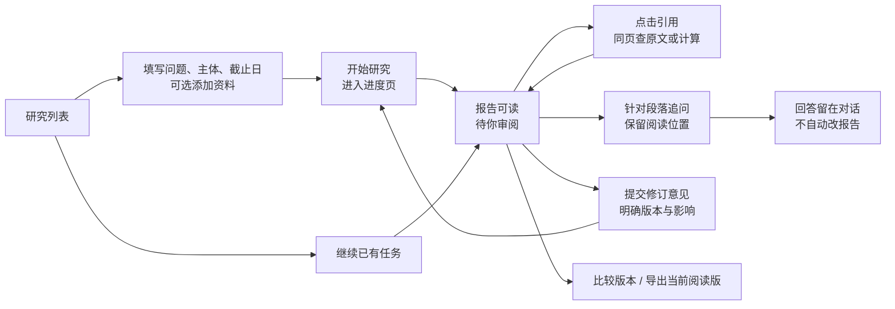

# FinSight 工作台交互概设 A

状态：Owner看过概念交付后要求继续，按认可方向推进切片A；全套交互与易用性仍待实际审阅。日期：2026-09-08。产品仍为 FIN 0.1.3，Hermes 后置。阅读与来源实现见[S3/193](../worklog/fin_0_1_3_s3/193_report_reading_and_source_navigation.md)。

## 设计起点

Owner 实际使用后明确反馈：页面太杂、报告/来源/追问切换不顺、发起研究与进度不直观，三个问题都存在。此前工程检查通过不能代表界面好用。本轮暂停正式前端改造，先审概念与关键交互，再授权实现。

亲读当前工作台的观察：任务说明、上传入口、资料和分工占据大部分首屏；在当前浏览状态，报告和长对话被挤在下方。左侧多条同名会话缺少足够区分；“审查、来源与运行”合并了三种不同用途。此处为一次界面观察与 Owner 反馈，不是量化可用性实验。

主要用户：亲自提出研究问题、读取结论、检查依据、追问并修订报告的人。求职演示是同一流程的短路径，不另造一套展示系统。

## 概设是什么，详设是什么

- 概设决定：用户有哪些任务、页面怎么组织、哪件事最突出、完成一件事需要怎样走。
- 详设决定：点击后出现什么、哪些信息保留、错误怎么处理、窄屏怎么切换、现有服务支持到什么程度。
- 可点击原型用于体验上述路径，不连接模型或正式服务。视觉样式只是建议，原型通过也不等于研究结果或生产软件验收通过。

## 首选方向：任务入口 + 报告工作区 + 按需辅助区

只保留两个主要场所。研究列表负责“开始哪个研究/继续哪个研究”；任务工作区负责“这项研究现在怎样、结论是什么、依据在哪、下一步怎么问”。任务内部一级导航只有报告、研究进度、资料；追问为随时可用的辅助入口。版本和导出属于当前报告。

桌面阅读默认“窄目录 + 宽报告”；辅助区关闭。点引用、计算或追问才展开一个右侧区域。报告仍可读，查完关闭即回原位置。不让多个抽屉层层叠加。长对话需要时可以切为主体，报告保留返回位置，此细节在实现前的阅读切片验证。

## 页面概念

| 场所 | 用户首先看到什么 | 主要操作 | 从首屏移开的信息 |
| --- | --- | --- | --- |
| 研究列表/新研究 | 一个问题输入框；近期任务的主体、短题目、状态、更新时间、简短标识 | 开始研究 / 继续任务 | 模型节点、工程参数、重复的营销式标题 |
| 任务进行中 | 当前正在做什么；已经保存什么；是否需要用户操作 | 查看资料 / 查看已有报告 / 允许时继续未完成项 | 原始调用日志、没有可靠依据的百分比和剩余分钟 |
| 报告阅读 | 任务名、信息截止日、版本、待审状态；核心判断在首屏 | 目录定位 / 查来源 / 针对段落追问 | 完整任务说明、上传大区域、全部专家分工 |
| 辅助阅读区 | 被点中的来源、计算或当前问题 | 原文定位 / 操作数回读 / 返回报告 | 原始 ID、技术细节默认折叠，但保留查看入口 |
| 资料 | 已加入的文件、读取或识别状态、使用范围 | 添加资料 / 查看内容 | 不把“已上传”写成“模型已经理解” |
| 版本比较 | 选中的两个版本、差异、当前和历史的明确标签 | 返回阅读版 / 导出阅读版 | 未保存的模型推测式“修订原因” |

“待你审阅”是报告状态，不是“可以放心使用”的保证。工程细节按需显示；事实、计算、推断、假设和重要未决项仍贴近具体内容，不藏到没人看的总免责声明中。

## 五条关键交互

1. **开始研究**：输入问题，检查主体和信息截止日，可附资料，点击开始。按钮附近明确会启动模型任务；未提供可靠估费时不编造价格。点击后立即看到任务入口和真实运行状态，禁止重复发送。同一输入提交失败时保留草稿。
2. **查证据**：报告引用 → 来源标题、日期、期间、相关原文/定位 → 必要时原文页。计算引用 → 表达式、结果、单位/期间 → 单个操作数来源。缺页、缺绑定、读取失败分别说明，不显示假“无披露”。
3. **追问**：显式“针对这一段追问”与常驻追问入口并存。前者携带版本、章节、原文及引用；用户看得到、可移除。默认只是回答，不改报告。原型使用固定示例回答并清楚标记，任何自由输入都不发送。
4. **修订**：独立于普通追问。先显示当前候选版本、修改意见和“可能形成新候选、旧版保留、会调用模型”的影响，再提交。历史版本上可以问问题，但不直接执行面向旧版本的写入。执行失败保留当前报告和意见。
5. **版本/交付**：当前/历史标签始终可见。选择版本后导出该版；比较结束返回原章节。模型审阅完成和 Owner 接受分开，不由版本新增自动提升为已接受。

## 布局与视觉建议

- 报告像阅读文档：白/深色纸面，克制的绿色强调，正文建议16–18px，行宽约65–85个拉丁字符的等效宽度；中文行宽以实际阅读验证调整。
- 任务头压缩为短标题、时点、版本、状态和必要动作。完整原始需求放任务详情，不重复占用阅读首屏。
- 不让长对话、报告、日志同时争抢主区域。宽屏辅助区约320–400px；空间不够就切为独立阅读页，而不是把全文挤成窄条。
- 手机/窄侧栏：查来源或追问进入同任务的子页，提供明确“返回报告”；保留章节和滚动位置，不强塞三栏。
- 保留可见标签、键盘焦点、Esc关闭、关闭后返回触发点。颜色不单独表达状态。

备选是“聊天始终居中、报告作为右侧产物”。它更适合以短问答为主的使用方式，但当前还要长报告审阅、来源核对和四格式交付，所以首选报告主导。可先在原型讨论这项取舍，不同时维护两套正式前端。

## 这次需要 Owner 判断的三件事

1. 入口和报告工作区的拆分，是否让你知道下一步做什么？
2. 报告为主、来源/追问按需展开，是否比当前方式顺手？
3. 普通追问与修改报告分开，修改前明确版本与影响，是否符合你的预期？

颜色和圆角可以后调。若主路径仍不顺，先调整概念，不进入实现。Owner 可直接指出哪一步别扭，不需要先学会前端术语。

## 审阅与验收

原型路径：研究列表 → 填问题开始 → 进度；已有报告 → 现金兑现 → 计算 → 操作数；报告段落 → 追问；修订 → 影响确认；版本比较；资料与失败状态。

后续正式验收目标：首次进入任务能在首屏发现核心结论和主要动作；从引用到相关原文最多两次操作（不含原件内翻页）；查完返回原章节；同名任务可区分；失败时能说清“什么没完成/什么保留/下一步能做什么”。这些是拟定标准，尚未测得通过。

原型有意简化内容与滚动，展示的三节不是删减正式报告的决定；固定示例不代表重新审过财务事实。正式长文、长对话、来源加载与服务恢复须在获批后使用真实保存会话验证。

对应[交互详设与实施切片](../architecture/UX_WORKBENCH_INTERACTION_DESIGN_20260908.zh-CN.md)。原型源文件：`prototypes/finsight-concept.html`。原型不接正式服务；Owner要求继续后，切片A的真实实现已在8766提供本地体验，尚未并入GitHub主线。
