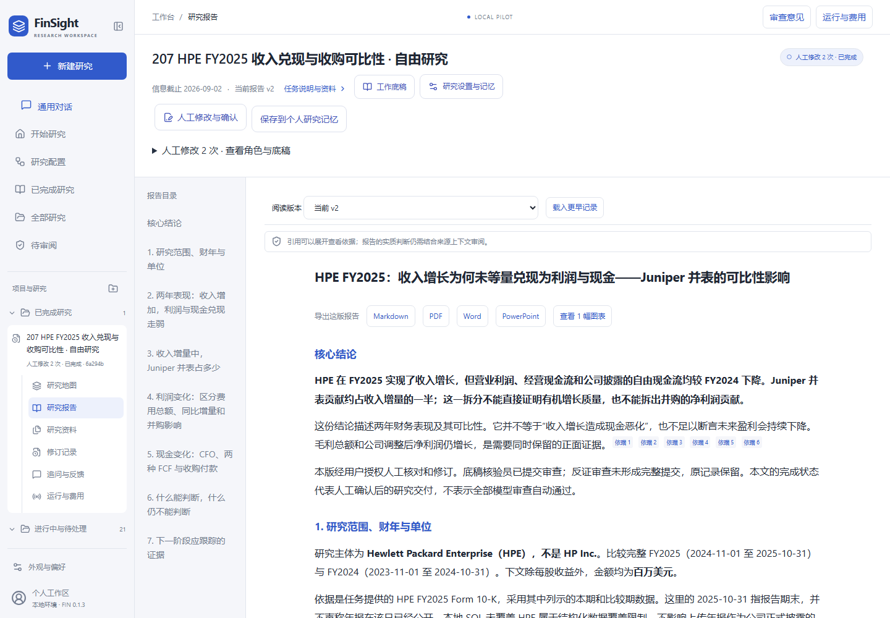
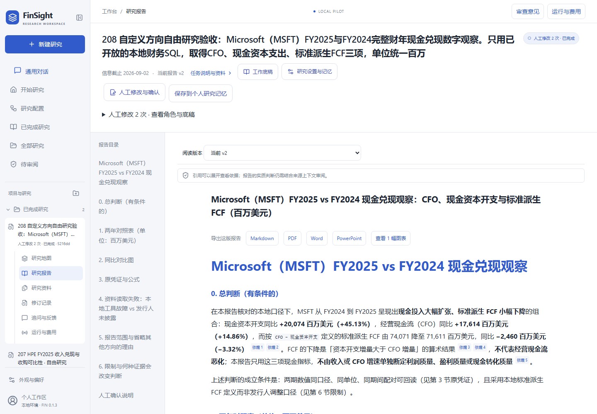

# FinSight Agent Engineering and Evaluation Report

2026-09-11 · FIN 0.1.3 · Local evaluation

[中文](technical-evaluation.zh-CN.md) · [Reproduction guide](quickstart.en.md) · [Metrics JSON](evaluation-metrics.json) · [Résumé claims and evidence](engineering-evidence.md)

FinSight combines resumable financial research, source-bound calculations, role-owned working papers and human-editable reports. This evaluation asks whether useful work survives parsing failures, context pressure, review interruptions and service restarts, and whether a researcher can finish delivery without erasing the original evidence.

Retrieval quality, answer delivery and engineering checks are reported separately. Retrieval hit rate is not financial answer accuracy; human completion is not unanimous model approval; a local identity pilot is not production tenancy certification.

## Architecture

The React workspace and Python BFF provide research configuration, multi-turn conversations, streamed activity, working-paper editing, review history and exports. LangGraph Agent Server 0.13.3, PostgreSQL and Redis own execution, parallelism, checkpoints and interrupt/resume. LangChain middleware supplies model/tool limits and summarization. Hermes is integrated for a bounded conversation and working-memory comparison, rather than presented as a completed migration of all research agents.

Working papers are readable natural-language records with versions and optimistic concurrency checks. Conversation history, source passages and numerical receipts retain separate locators. Runtime audit records are distinct from working papers, and a summary or human opinion never automatically becomes source evidence.

Retrieval combines BM25, Qwen text-embedding-v4 and qwen3-rerank, with completed-request caching. The existing SEC companyfacts parser and SQLite fact mart supply observations and derived metrics with issuer, period, unit, formula and source identity. OIDC/PKCE and server-side ownership checks protect product resources. Docker isolation and native approval recovery are integrated into the local conversational product through authenticated MCP.

## Observed product behavior

| Scenario | Evidence | Interpretation |
| --- | --- | --- |
| HPE FY2025 research | Report v2, two human edits, expandable role/paper diffs, real MD/PDF/Word downloads | A human-confirmed deliverable; incomplete model reviews remain visible |
| MSFT and multi-topic conversation | Financial queries, paper updates, HPE corrections, HTTP caching, scope withdrawal and handoff | 17 same-thread user turns including five targeted recoveries, followed by two turns in a new thread after service restart |
| Non-financial question | Retrieved RFC 9111 and explained cache directives; exported from the actual workspace | General tool-based conversation, without forcing every question through financial specialist research |
| Hermes/native memory comparison | Three turns: hypothetical CFO 120/capex 40, correction to capex 50, then retrieval of the revised paper and original correction | Both returned FCF 70 and preserved supersession; not an unlimited-history or multi-agent migration result |
| Custom research direction | Saved a custom title/method and applied its configuration to a real MSFT research task | Repaired inconsistent data bindings; delivered v2 with two human amendments, role papers, a chart, three-format exports and personal research memory |

The 19 conversation turns used **81 model requests and 1,231,464 known tokens, with zero unknown-usage requests**. Costs include failed attempts, summaries and recovery. The 12 original intents and two handoff intents eventually received answers; this is not a claim of 19 independent cases or 100% first-pass success.

The three-turn Hermes run used **8 requests / 44,961 tokens**; the native run used **10 requests / 65,713 tokens**. The native agent also had a calculator, so this is not a controlled equal-tool cost ablation. It demonstrates a bounded versioned-memory round trip, not a general efficiency advantage.

## Final custom-research delivery

The MSFT task now has **report v2, two human amendments, two role-owned papers and one data-bound chart**, exported through the real UI and saved to personal research memory. FY2024→FY2025 CFO is 118,548→136,162; cash capital expenditure is 44,477→64,551; derived FCF is 74,071→71,611, all in USD millions.

After the snapshot-binding repair, the model produced the correct six values. Subsequent review still confused comparative fiscal periods and treated out-of-scope definition/vintage research as mandatory. Current-task route projection was clarified; a checkpoint-based human handoff requires an explicit disposition for every blocking review item, preserves original review/source records, and supplies amended role-paper prose to the writer. Final human confirmation distinguishes four direct financial observations from two calculated FCF values and corrects the chart explanation without changing its data.

| Attempt or continuation | Requests | Known tokens | Estimated CNY |
| --- | ---: | ---: | ---: |
| Initial wrong-snapshot failure | 43 | 1,542,624 | 1.573728 |
| Correct-data paper production | 27 | 927,019 | 1.091936 |
| Scope-confirmed independent review | 38 | 1,321,253 | 1.214529 |
| Human-amended papers → writer/reviewer | 17 | 672,006 | 0.752876 |
| Final UI confirmation and memory save | 0 | 0 | 0 |
| **Total** | **125** | **4,462,902** | **4.633069** |

Unknown usage is zero; dated list-price estimates are not invoices. The delivered thread alone accounts for 82 requests/2,920,278 tokens, but the initial failure remains in the total. This establishes an auditable delivery path with human participation, **not low-cost, efficient or first-pass autonomous completion**. Review still repeats retrieval and over-expands scope; no further full paid rerun was performed.

HPE, custom MSFT research, ordinary data answers and non-financial answers were downloaded as MD/PDF/Word through the actual UI. PDF pages were rendered and inspected. Word packages, tables and images passed structural checks; a Word renderer was unavailable, so no page-by-page Word visual acceptance is claimed. Source/calculation appendices remain detailed.

## Same-corpus retrieval comparison

The corpus contains **739 source leaves, 1,105 retrieval chunks and 1,456,098 characters**, spanning HPE, MSFT and RFC material. There are 28 queries: 14 development and 14 validation, each with 12 positive and two negative queries. Labels identify source anchors and do not exhaust all relevant passages.

| Method | Development Hit@5 | Validation Hit@5 | Validation anchor Recall@5 | Validation MRR@20 |
| --- | ---: | ---: | ---: | ---: |
| BM25 | 5/12 | 7/12 | 0.4037 | 0.4608 |
| Qwen dense | 8/12 | 9/12 | 0.5565 | 0.5759 |
| BM25 + dense + Qwen reranking | 11/12 | 12/12 | 0.8494 | 0.8056 |

Across 24 positives, hybrid Hit@5 was **23/24 (95.8%)**, compared with **12/24 (50.0%)** for BM25. This measures whether a labeled supporting passage appears in the first five candidates. It does not measure answer correctness. The four negative queries are outside that denominator; no abstention-accuracy claim is made.

Embedding uses text-embedding-v4 at 1,024 dimensions; merged sparse/dense candidates are reranked with qwen3-rerank. An ASCII tokenization bug rejected Chinese-only queries; adopting jieba search tokenization fixed it, and reruns reused completed API calls. Validation outputs were visible during engineering repair, so this is an open-label qualification, not a blind benchmark or a statistical-significance claim.

There were **167 completed API requests**, comprising 317,882 embedding tokens and 370,916 reranking tokens, **688,798 total**. Exact repeat requests incurred no new API calls. At the checked rate of CNY 0.0005 per thousand tokens for both models, estimated list cost was **CNY 0.344399**, before free credits; this is not an account invoice. [Alibaba Cloud pricing](https://help.aliyun.com/zh/model-studio/billing-for-knowledge-base)

## Engineering repairs and evidence

- **Human corrections were absent from downstream reads.** Current-paper access now applies versioned human prose while preserving original claims and sources. Two real follow-ups over frozen HPE evidence used seven requests / 112,863 tokens, retained the corrections and rejected an unsupported contradictory instruction.
- **Whole-paper rewrites could exhaust output before saving.** Versioned append writes only the new prose, with a base-version check. Existing versions and owner/role boundaries remain intact; the real dialogue paper progressed to v5.
- **Old tool arguments and results repeatedly consumed context.** Already-read history is projected to locators backed by the existing result reader. Unread content, errors and the original checkpoint remain. A zero-model replay reduced request-message text from 208,296 to 21,544 characters; this proves structural reduction, not semantic compression accuracy.
- **A lifetime summary quota stopped later conversation turns.** Native summarization can now run on demand once per new user turn. Same-thread continuation and post-restart handoff recovered original values and withdrawn scope.
- **Tool-limit notices and raw tool-protocol text looked like successful answers.** Delivery uses the remaining model allowance without excess tools. Recognized non-answers require attention and cannot be exported; private originals remain available for diagnosis.
- **Browser retries risked duplicate submissions.** Persistent receipts bind owner, request key and payload fingerprint. Unknown outcomes are not automatically resent. Three submissions spanning a real service restart returned the same draft with zero model runs.
- **Research and conversation read different company snapshots.** Compatible captured policies are merged using the existing parser/builder. Both routes bind the same read-only snapshot and reject source conflicts. The result contains five companies and 2,274 rows; ten issuer/year batches matched values, periods and units across actual MCP and conversation SQL paths, with zero model calls.

The data pool retains DELL, HPE, MSFT, MU and NVDA. Route parity covers CFO, capex and FCF for two fiscal years each; it does not establish correctness of every financial definition. The earlier misbound research attempt consumed **43 requests / 1,542,624 tokens** and remains part of the cost evidence rather than being attributed to model knowledge or deleted.

## Identity, isolation and deployment limits

A real Keycloak service completed PKCE login/logout for two users and secure-cookie checks. **39 real HTTP resource checks**, plus eight concurrent reads, covered ownership of threads, attachments, papers, context, review history, exports and configurations. Ownership is supplied by the server rather than by model arguments.

Docker isolation passed three real-container scenarios, followed by four checkpoint-reopening/MCP approval checks. After operator startup of port 18796, host and native-container authentication, tool discovery and mounted-credential consistency passed. **Four real product-browser scenarios passed: standard-mode rejection, standard-mode approval, delegated approval and full access.** Both standard-mode cases had zero container events before the decision; rejection created no container. The other three each created and removed one offline, read-only-root, non-root container without host bind mounts, returning the fixed print result. The suite used eight real model requests and 45,609 reported tokens, with no unknown requests; product pricing estimated CNY 0.01205, not a billing receipt. Fresh browser reads verified all four saved outcomes. This is local native-conversation integration with a foreground operator service, not production service management or Hermes sandbox integration. Historical policy and interpreter startup failures remain recorded.

The public browser suite passed **36 checks**, including 390/1,024/1,440-pixel viewports; the final integrated Python suite passed **104 checks, with five private-fixture skips** (overlapping the earlier 85-check suite). Additional focused suites overlap and are not summed into an inflated count. Public UI tests use explicit API fixtures; real identity, downloads and restart evidence are recorded separately.

## Reproduction and scope

The [query, source-manifest and per-query records](evaluation/README.md) retain the public labels and top-five candidates for checking the reported retrieval metrics. Re-ranking requires the corresponding source material or a newly labeled corpus.

Use the [public checkout guide](quickstart.en.md) for maintained retrieval, configuration, revision, export and browser checks without private data or model credentials. Historical experiments use their original implementation, as described in the [evaluation records](evaluation/README.md); archived runners are not current startup commands.

Private source material, account configuration and raw provider responses are not distributed with the repository. Evidence supports controlled local usage, auditable human completion and bounded multi-topic recovery. Production identity operations, sandbox production hosting and Hermes integration, cross-host idempotency/quotas, arbitrary multi-agent replanning and unlimited-history fidelity are outside the verified scope. Remaining model errors should be corrected through source-aware human participation, with complete role/paper history, rather than hidden behind repeated full paid reruns.
