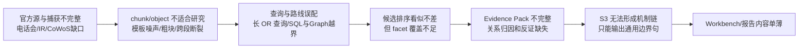

# FIN 0.1.3 三案例检索尸检与跨案例根因图

日期：2026-08-09
冻结截至日：2026-08-06
案例：DELL / MU / NVDA

## 总结

本轮 1–8 已完整执行，除了为让诊断脚本继续运行而把一个写错的 slot 字符串改成仓库真实枚举外，没有修改任何产品代码。结论比“BGE 3/18”或“sparse 16/18”更重要：

1. 当前内源并非没有材料，而是缺少面向研究问题的源覆盖、chunk/object 形状和检索语义。
2. 人工改写查询能改善结果，但不能修复源缺失和宽松 OR 排序；A 到 B 的 Recall@1 从 `4/18` 升到 `7/18`、Recall@10 从 `16/18` 升到 `17/18`，同时 Recall@5 从 `16/18` 降到 `13/18`。
3. qrels 的 `18/18 target-in-pool` 只证明 18 个已知相关候选都在 top 24，不证明任何一案已经有完整 Evidence Pack。全文复核本就显示只有 `4/18` 单候选覆盖全部 target facets，`14/18` 是有效但不完整的 partial。
4. 外源 replay 证明运行时和 capture 可以恢复，但实际 required-slot coverage 仍是 `4/12`，hidden target-in-pool 是 `0/12`，来源只有 SEC regulatory 一族。
5. 三案手工检查后，`0/3` 能由当前自然结果直接组成合格的四槽 Evidence Pack。
6. 本轮所有 A/B/外源 replay 均为 `0` 模型调用；这些问题不能归因于 DeepSeek 不遵循合同。

## 1–8 执行记录

| 步骤 | 结果 |
| --- | --- |
| 1. 冻结问题、as-of、Evidence Slots 和泄漏规则 | 完成；as-of=`2026-08-06`，3 案、18 个内源 bundle、4 个 required slot family |
| 2. A 当前产品自动内源检索 | 完成；90 terminals，ObjectBM25 369、BM25 297、Graph 196、SQL 0、dense 0 qualification-only |
| 3. B Codex 监督、同工具 | 完成；只改 36 个 sparse/object 查询，请求预算和索引不变 |
| 4. 对 residual gaps 跑当前外源工具 | 完成不可变 capture replay；runtime pass、coverage fail |
| 5. C Codex 独立参考研究 | 完成；使用截至日内的公司 IR、电话会和 SEC 原始材料，不向 A/B 注入答案 |
| 6. 手工 Evidence Pack 检查 | 完成；三案均不完整 |
| 7. 三份逐案尸检 | 完成；见同目录 DELL/MU/NVDA 报告 |
| 8. 跨案例根因和阶段归属 | 本文完成；未实施修复 |

## 具体问题，不只报指标

- 查 DELL 当期业绩时，真正的 AI server orders / revenue 候选在 A/B 分别排第 12/13；前面是供应链风险、定义、前瞻声明和历史表格。问题不是文档完全不存在，而是 query、chunk 和模板噪声共同把它压下去。
- 查 Microsoft 作为需求佐证时，A 的首条是 Microsoft 365／LinkedIn 等宽泛云业务；B 把 AI 基础设施投入推到第 1，说明 query compiler 确实需要改进。但这仍只是行业需求，不是 DELL、MU 或 NVDA 的客户归因。
- 查 MU 时，一条更具体的查询把客户存款／承诺从第 14 提到第 1，却把 issuer target 从第 2 推到第 7；一个长查询同时承担收入、毛利、price、bit、HBM 时，各 facet 会互相竞争。
- 查 NVDA regulatory 时，A 的首条只是 `Unaudited`；B 把出口风险推到第 1，却让现金流 target 从第 2 降到第 7。现有系统不能一次完成多 facet reconciliation。
- 查 TSMC 供给时，三个 case 都反复得到 Q2 收入、毛利和联系方式；当前只有 3 个粗 chunk，没有 CoWoS capacity，后端 reranker 无法从不存在的候选中救出答案。
- Graph 经常返回旧年公司事实和业务占比，期间字段不可用；它适合连接实体和关系，当前却被当作同质 narrative retriever。
- SQL 对 18 个定性 bundle 全部是 0；这不是 SQL 引擎坏了，而是 route contract 没先区分“精确数值问题”和“管理层／机制问题”。另一个独立缺口是 current-quarter exact facts 仍为 `0/6`。

## 根因图

## 阶段归属

| 阶段 | 本轮确认的问题 | 不应塞入该阶段的问题 |
| --- | --- | --- |
| S0 数据与知识对象 | 当前源清单不完整；电话会／prepared remarks／IR document family 不稳；TSMC chunk 过粗；模板和表格对象缺少层级上下文 | 不在 S0 调 Prompt 或改 Writer |
| S1 检索与 Evidence candidate | Query Facet 需要拆成短的原子查询；字段／短语／semantic／graph／SQL 各走自己的 lane；外源只补真实 residual gap；需要 slot completeness 而不只是单 qrel | 不把缺候选归因给模型，也不让 reranker 从 0 候选中救援 |
| S2 模型能力与权限 | 本轮未调用模型，不能下 DeepSeek 结论；以后只比较模型 query atoms 是否在同一 compiler 下提高召回且不增污染 | 不为本轮 S0/S1 缺陷继续加 DS 专用核心分支 |
| S3 动态研究与内容质量 | 对 residual facets 追问；把 demand、price/volume/mix、capacity、cash flow、risk、WWC 组成机制链；区分行业佐证与公司归因 | 不在 S3 伪造上游 Evidence 或用长叙事填空 |
| S4 Workbench | 展示 slot 覆盖、引用、冲突、gap 和为什么不能下结论；内容质量进入人工验收 | 不靠 renderer 补事实或生成研究机制 |
| S5 Release | 以三案完整 Evidence Pack、研究内容、来源多样性和人工 paired review 验收 | 不以 18/18 qrel、9 Artifacts 或页面能打开代替产品通过 |

## 对 410-vector build 的处置建议

暂不执行正式 410-vector build。原因不是向量检索不重要，而是当前 410 行仍承载同一批源覆盖和 chunk 形状；现在入库只能证明“这些片段可向量化”，不能证明它们适合回答研究问题。应先重定 S0 source/chunk blueprint 和 S1 Evidence Pack evaluator，再决定哪些对象进入 dense。这样避免在低质量对象上继续花 GPU、Milvus 和评测成本。

## 建议的下一轮顺序（尚未实施）

1. 冻结这次 C 参考研究的事实需求为 Evidence Slot facet inventory，而不是把 URL 写成检索答案。
2. S0 做 current official source inventory：业绩稿、prepared remarks、电话会、10-Q/10-K、IR feed/sitemap 和必要行业一手源；缺失就 typed gap。
3. 定义金融 chunk/object blueprint：文档层级、段落、表格、claim、Q&A、前后文窗口、模板过滤、原始 lineage。
4. S1 将每个 slot 拆成多个短的 typed query：exact field/phrase、lexical、semantic、relationship、negative filters；先按 facet 分预算，再聚合。
5. retrieval lane 各司其职：SQL 只回答 exact facts，graph 只给关系候选，sparse 找精确术语，dense 找语义补充，reranker 只在候选已存在时排序。
6. 用多候选 Evidence Pack completeness evaluator 取代“一个 qrel 等于一个 slot 完成”的错觉；检查主体、披露方、期间、关系方向、facet、来源多样性、冲突和 gap。
7. 本地 pack 形成后，用 residual gap 驱动外源补源；外源不是本地 RAG 的替代品。
8. 再跑 DELL/MU/NVDA，并扩到至少两个非 AI 半导体案例和一个证据稀疏案例；之后才进入 S2/S3 的模型和研究质量对照。

## 不变边界

- 没有改产品代码、qrels、索引、模型合同或 release 状态。
- A/B qrels 只在两轮候选生成结束后加载。
- C 的官方来源只用于独立人工参照和缺口识别，不作为本轮产品检索输入。
- 外源 `4/12`、current-quarter SQL `0/6`、dense production build、reranker、Evidence promotion、S3 内容质量和 release 全部保持 open。
